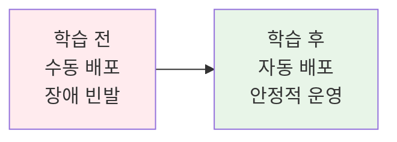
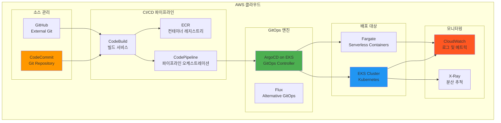
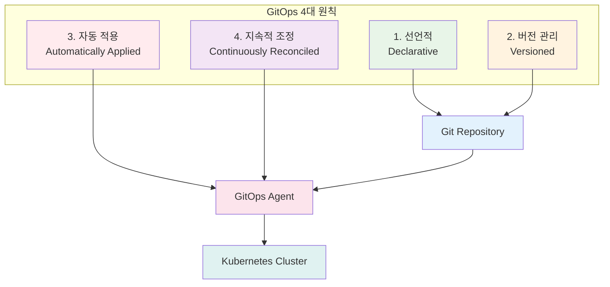
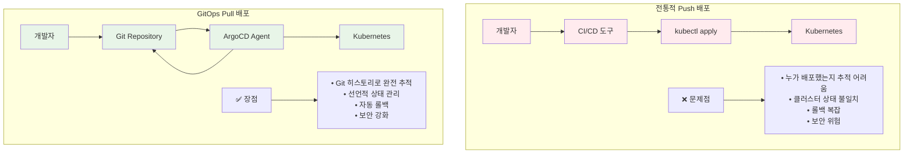
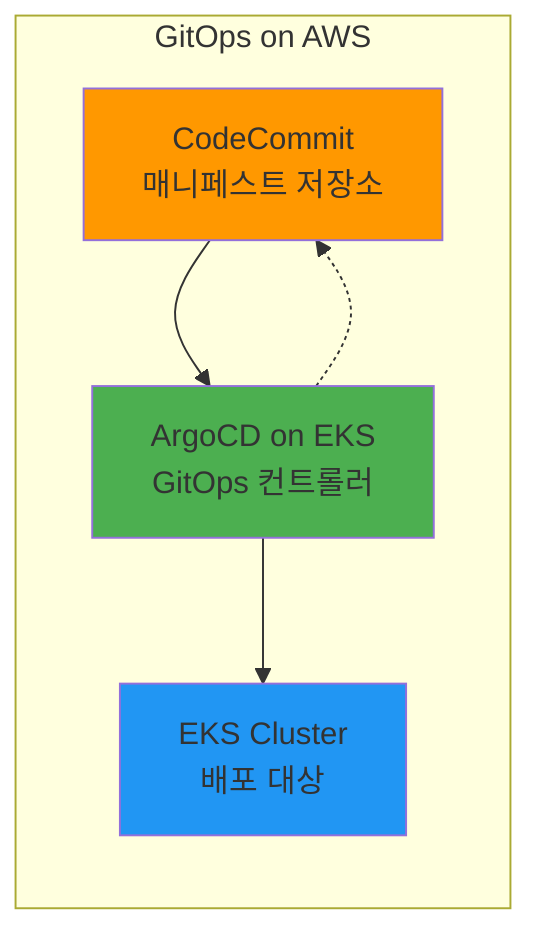
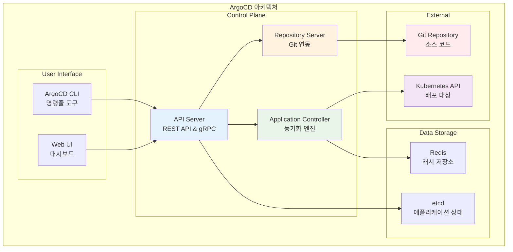
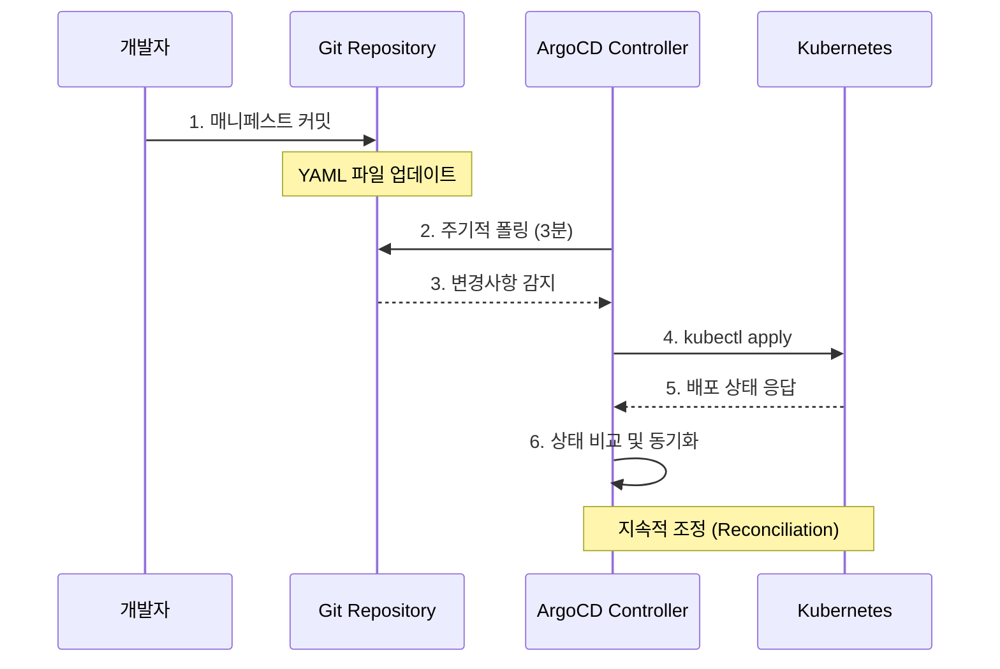
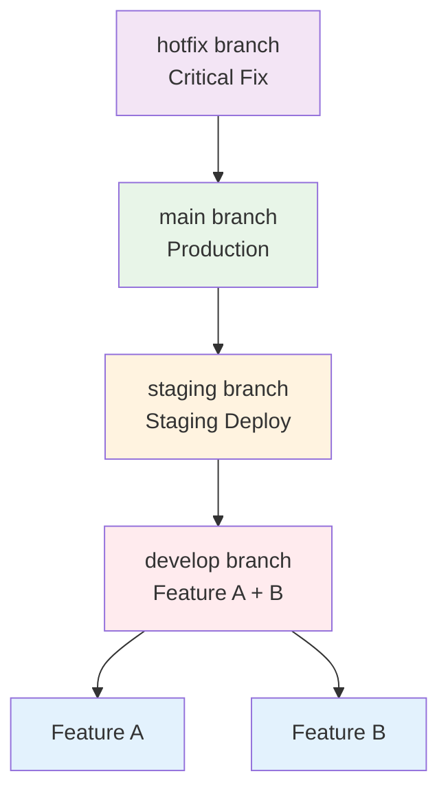
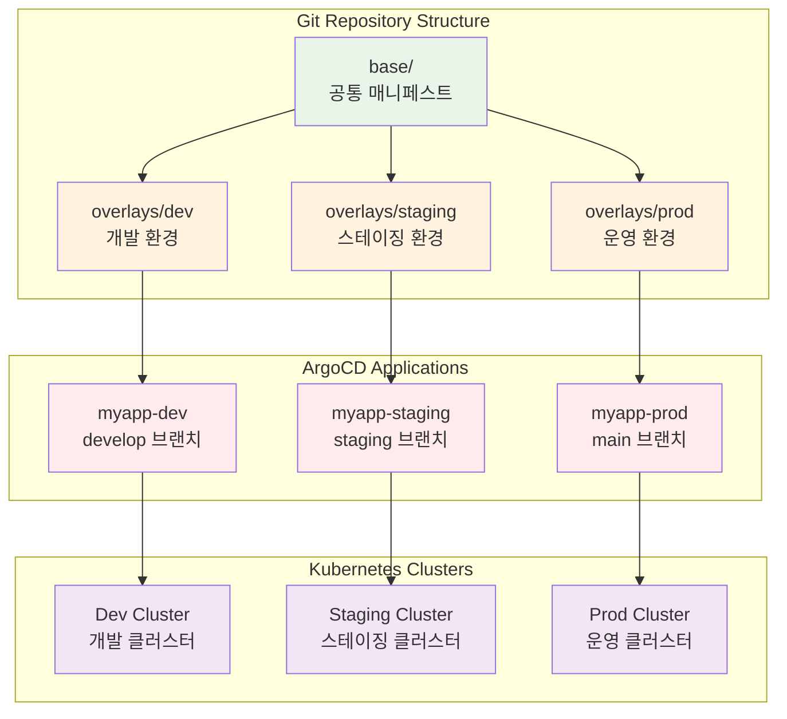

# Week 4 Day 4 Session 1: GitOps 철학과 ArgoCD

<div align="center">

**🔄 GitOps 철학** • **🚀 ArgoCD** • **📋 선언적 배포**

*Git을 단일 진실 소스로 하는 현대적 배포 패러다임*

</div>

---

## 🕘 세션 정보
**시간**: 09:00-09:50 (50분)
**목표**: GitOps의 핵심 철학과 ArgoCD를 통한 실무 구현 이해
**방식**: 이론 설명 + 실무 사례 + 페어 토론

## 🎯 세션 목표
### 📚 학습 목표
- **철학 이해**: GitOps의 핵심 원칙과 선언적 배포 패러다임
- **도구 이해**: ArgoCD 아키텍처와 핵심 컴포넌트 파악
- **실무 적용**: Git 기반 배포 워크플로우 설계 능력

### 🤔 왜 필요한가? (5분 - 동기부여 및 맥락 제공)

**현실 문제 상황**:
- 💼 **실무 시나리오**: "배달의민족에서 배포할 때마다 장애가 발생해요. 누가 언제 무엇을 배포했는지 추적이 어려워요"
- 🏠 **일상 비유**: "요리 레시피(Git)를 보고 요리사(ArgoCD)가 자동으로 요리를 만드는 것처럼"
- ☁️ **AWS 아키텍처**: "CodeCommit + CodePipeline + EKS의 진화된 형태"
- 📊 **시장 동향**: "배달의민족, 쿠팡, 카카오 등 국내 대규모 서비스의 필수 배포 전략"

**학습 전후 비교**:


**🏗️ 실제 AWS 아키텍처**:


**🔧 구현 세부사항**:
- **CodeCommit/GitHub**: Git 기반 소스 코드 및 배포 매니페스트 관리
- **CodeBuild**: 컨테이너 이미지 빌드 및 테스트 자동화
- **ArgoCD**: Kubernetes 클러스터에서 GitOps 배포 자동화
- **EKS**: 관리형 Kubernetes 서비스로 애플리케이션 실행
- **CloudWatch + X-Ray**: 배포 및 애플리케이션 모니터링

---

## 📖 핵심 개념 (35분 - 체계적 지식 구축)

### 🔍 개념 1: GitOps 철학과 원칙 (12분)

> **정의**: Git을 단일 진실 소스(Single Source of Truth)로 사용하여 인프라와 애플리케이션을 선언적으로 관리하는 운영 모델

**GitOps 4대 원칙**:


**전통적 배포 vs GitOps 비교**:


**☁️ AWS 구현 예시**:


**🔧 AWS 서비스 매핑**:
- **선언적 관리** → **CodeCommit + YAML 매니페스트**: Git 기반 인프라 코드 관리
- **자동 적용** → **ArgoCD on EKS**: Kubernetes 네이티브 GitOps 컨트롤러
- **지속적 조정** → **EKS + CloudWatch**: 실시간 상태 모니터링 및 동기화

### 🔍 개념 2: ArgoCD 아키텍처와 컴포넌트 (12분)

> **정의**: Kubernetes 네이티브 GitOps 도구로, Git 리포지토리의 선언적 설정을 클러스터에 자동 동기화

**ArgoCD 핵심 컴포넌트**:


**동작 원리 상세**:


**실무 연결**:

**배달의민족 GitOps 아키텍처**:


- **배달의민족 사례**: 50+ 마이크로서비스를 ArgoCD로 관리, 일일 배포 50회 이상
  - 주문/결제/배송/알림 서비스의 독립적 배포
  - Git 커밋 후 5분 내 자동 배포 완료
  - 배포 실패율 1% 미만, 롤백 시간 5분 이내
- **카카오 사례**: 카카오톡 서비스의 GitOps 기반 무중단 배포
  - 1억+ 사용자 서비스의 안정적 업데이트
  - 멀티 클러스터 환경에서 ArgoCD App of Apps 패턴 활용
- **쿠팡 사례**: 로켓배송 시스템의 GitOps 기반 배포 자동화
  - 물류 시스템의 24시간 무중단 운영
  - 카나리 배포와 ArgoCD Rollouts 통합으로 안전한 배포

### 🔍 개념 3: Git 기반 배포 워크플로우 (11분)

> **정의**: Git 브랜치 전략과 연계된 환경별 배포 자동화 워크플로우

**환경별 브랜치 전략**:


**ArgoCD Application 구조**:
```yaml
# 개발 환경 Application
apiVersion: argoproj.io/v1alpha1
kind: Application
metadata:
  name: myapp-dev
  namespace: argocd
spec:
  project: default
  source:
    repoURL: https://github.com/company/k8s-manifests
    targetRevision: develop  # 개발 브랜치
    path: overlays/dev
  destination:
    server: https://kubernetes.default.svc
    namespace: myapp-dev
  syncPolicy:
    automated:
      prune: true
      selfHeal: true
```

**멀티 환경 배포 전략**:


**프로모션 파이프라인**:


**🔑 핵심 키워드 정리**:
- **GitOps**: Git을 단일 진실 소스로 하는 운영 모델
- **선언적 배포**: 원하는 상태를 선언하고 시스템이 자동으로 맞춤
- **ArgoCD**: Kubernetes 네이티브 GitOps 컨트롤러
- **Pull 모델**: 클러스터에서 Git을 주기적으로 확인하여 동기화
- **Reconciliation**: 현재 상태와 원하는 상태를 지속적으로 일치시키는 과정

---

## 💭 함께 생각해보기 (10분 - 상호작용 및 이해도 확인)

### 🤝 페어 토론 (5분):
**토론 주제**:
1. **GitOps 도입**: "현재 회사의 배포 방식을 GitOps로 전환한다면 어떤 장점과 도전이 있을까요?"
2. **환경 전략**: "개발/스테이징/운영 환경을 어떻게 구성하고 프로모션 전략을 세울까요?"
3. **도구 선택**: "ArgoCD vs Flux vs Jenkins, 어떤 상황에서 어떤 도구를 선택하시겠어요?"

**페어 활동 가이드**:
- 👥 **경험 기반 페어링**: 배포 경험이 있는 사람과 없는 사람 매칭
- 🔄 **역할 교대**: 3분씩 설명자/질문자 역할 바꾸기
- 📝 **실무 연결**: 각자의 경험이나 회사 상황과 연결하여 토론

### 🎯 전체 공유 (5분):
- **인사이트 공유**: 페어 토론에서 나온 실무적 아이디어
- **질문 수집**: GitOps 도입 시 예상되는 어려움이나 궁금한 점
- **다음 연결**: Session 2의 배포 전략과 연결되는 포인트 확인

**💡 이해도 체크 질문**:
- ✅ "GitOps의 4대 원칙을 설명할 수 있나요?"
- ✅ "ArgoCD의 Pull 모델이 기존 Push 모델과 어떻게 다른가요?"
- ✅ "실무에서 GitOps 도입 시 고려해야 할 점들을 말할 수 있나요?"

---

## 🔑 핵심 키워드

### 🆕 새로운 용어
- **GitOps**: Git + Operations, Git 기반 운영 방법론
- **선언적 배포(Declarative Deployment)**: 원하는 상태를 선언하는 배포 방식
- **Pull 모델**: 클러스터가 Git을 주기적으로 확인하는 방식
- **Reconciliation**: 현재 상태와 원하는 상태를 일치시키는 과정
- **App of Apps**: ArgoCD에서 여러 애플리케이션을 관리하는 패턴

### 🔤 기술 용어
- **ArgoCD**: Kubernetes 네이티브 GitOps 도구
- **Kustomize**: Kubernetes 매니페스트 커스터마이징 도구
- **Helm**: Kubernetes 패키지 매니저
- **Sync Policy**: ArgoCD의 동기화 정책 설정
- **Health Status**: 애플리케이션의 건강 상태 표시

### 🔤 실무 용어
- **프로모션(Promotion)**: 환경 간 코드 승격 과정
- **드리프트(Drift)**: Git과 클러스터 상태 간 차이
- **셀프 힐링(Self Healing)**: 자동 복구 기능
- **프루닝(Pruning)**: 불필요한 리소스 자동 삭제

---

## 📝 세션 마무리

### ✅ 오늘 세션 성과
- [ ] **GitOps 철학 이해**: 4대 원칙과 선언적 배포 패러다임 파악
- [ ] **ArgoCD 아키텍처**: 핵심 컴포넌트와 동작 원리 이해
- [ ] **배포 워크플로우**: Git 기반 멀티 환경 배포 전략 설계
- [ ] **실무 연계**: 기업 사례를 통한 실제 적용 방안 학습

### 🎯 다음 세션 준비
- **Session 2 연결**: GitOps 기반에서 카나리, 블루-그린 등 고급 배포 전략 학습
- **실습 준비**: ArgoCD 설치와 기본 애플리케이션 배포 실습 예정
- **심화 학습**: Argo Rollouts를 통한 고급 배포 패턴 구현

### 🔮 다음 학습 예고
- **Session 2**: 고급 배포 전략 - 카나리, 블루-그린, 롤링 배포의 실무 적용
- **Session 3**: 클라우드 네이티브 CI/CD - Tekton, Flux 등 현대적 도구 비교
- **Lab 4**: ArgoCD 기반 GitOps 파이프라인 직접 구축 실습

---

<div align="center">

**🔄 Git 기반 운영** • **🚀 자동화 배포** • **📋 선언적 관리** • **🤝 협업 강화**

*GitOps로 시작하는 현대적 배포 자동화 여정*

</div>
