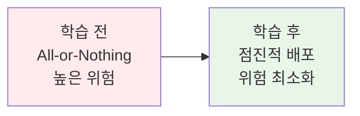
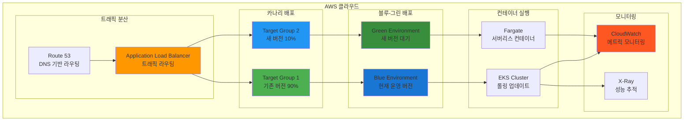
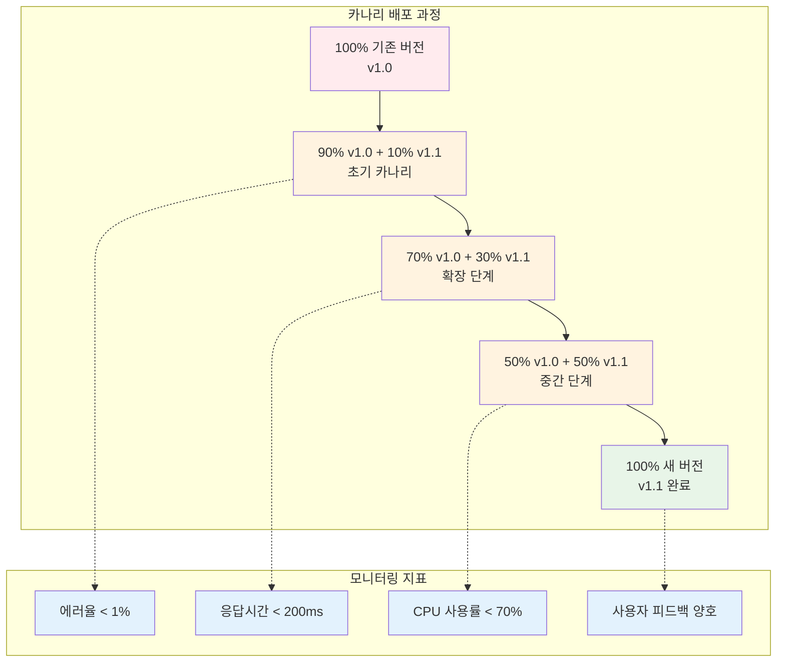
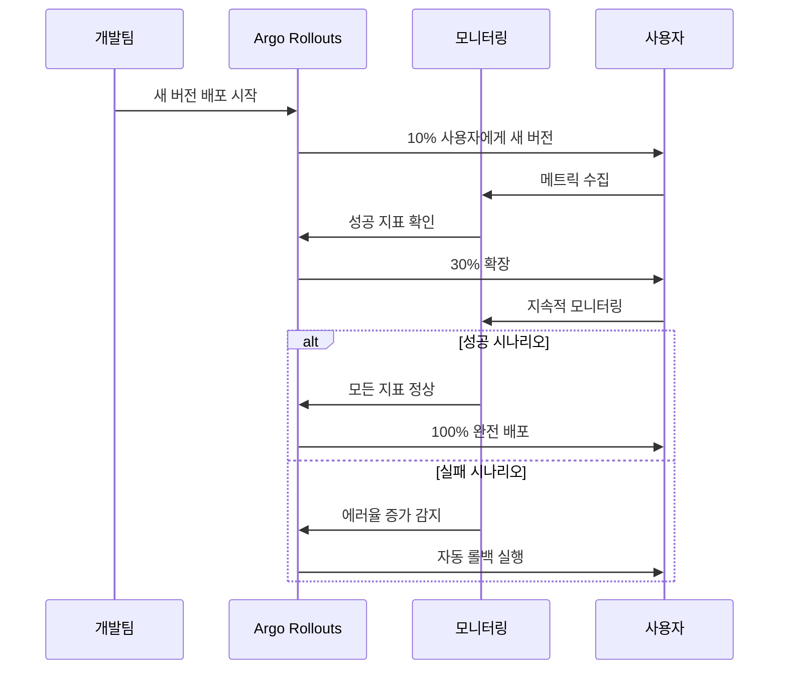
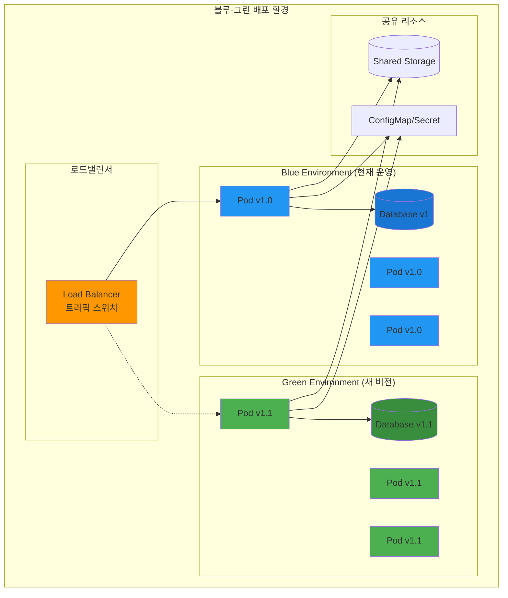
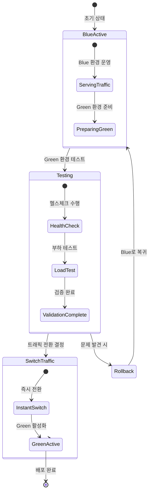
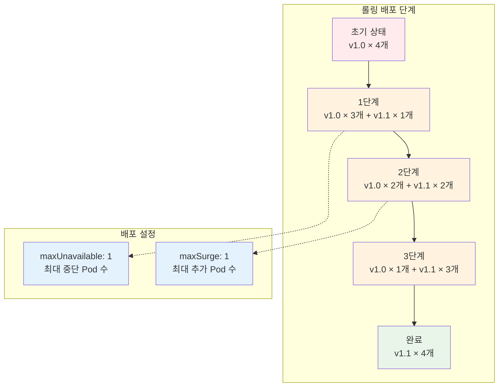
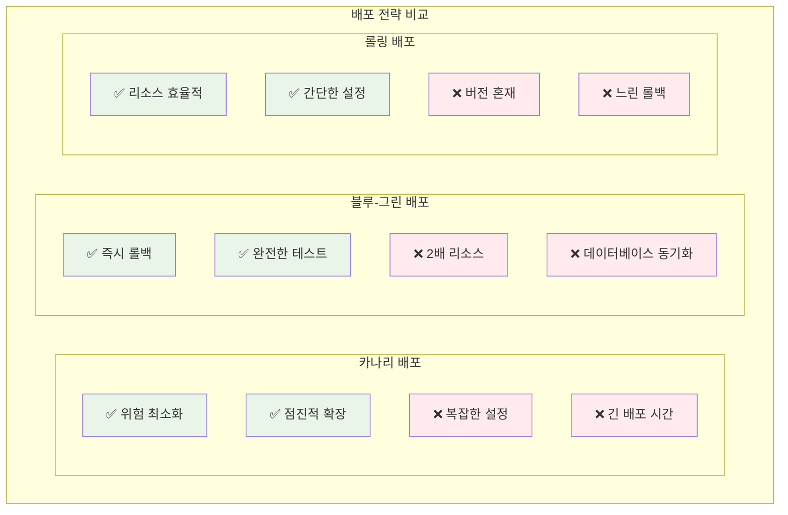
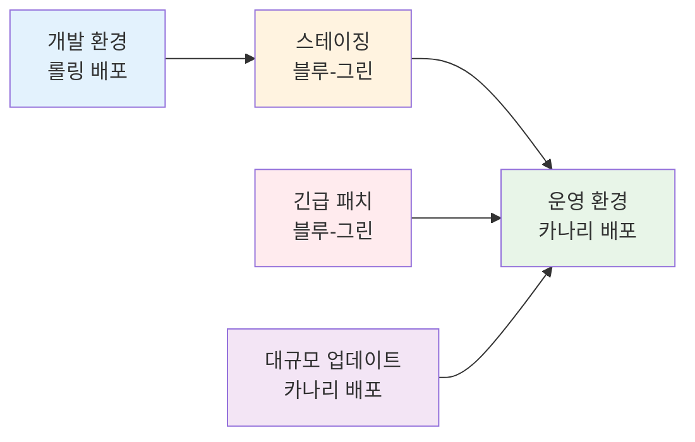

# Week 4 Day 4 Session 2: 고급 배포 전략

<div align="center">

**🎯 카나리 배포** • **🔄 블루-그린** • **📈 롤링 배포** • **⚡ 점진적 배포**

*안전하고 효율적인 프로덕션 배포 전략 마스터*

</div>

---

## 🕘 세션 정보
**시간**: 10:00-10:50 (50분)
**목표**: 카나리, 블루-그린, 롤링 배포 전략의 실무 적용과 상황별 선택 기준
**방식**: 이론 설명 + 실무 사례 + 시뮬레이션 + 페어 토론

## 🎯 세션 목표
### 📚 학습 목표
- **배포 전략 이해**: 각 배포 방식의 특징과 장단점 완전 파악
- **상황별 선택**: 비즈니스 요구사항에 따른 최적 배포 전략 선택
- **실무 적용**: Argo Rollouts와 Kubernetes를 활용한 구현 방법

### 🤔 왜 필요한가? (5분 - 동기부여 및 맥락 제공)

**현실 문제 상황**:
- 💼 **실무 시나리오**: "쿠팡 로켓배송 새 버전 배포 후 전체 서비스가 다운되어 긴급 롤백했어요"
- 🏠 **일상 비유**: "새 요리 레시피를 전체 손님에게 바로 제공하지 않고, 일부 손님에게 먼저 테스트하는 것처럼"
- ☁️ **AWS 아키텍처**: "ALB + Target Group을 활용한 트래픽 분할 배포"
- 📊 **시장 동향**: "쿠팡은 1% 사용자부터 시작해서 점진적으로 100%까지 배포"

**학습 전후 비교**:


**🏗️ 실제 AWS 배포 아키텍처**:


---

## 📖 핵심 개념 (35분 - 체계적 지식 구축)

### 🔍 개념 1: 카나리 배포 (Canary Deployment) (12분)

> **정의**: 새 버전을 소수의 사용자에게 먼저 배포하여 테스트한 후, 점진적으로 확대하는 배포 전략

**카나리 배포 동작 원리**:


**Argo Rollouts 카나리 설정**:
```yaml
apiVersion: argoproj.io/v1alpha1
kind: Rollout
metadata:
  name: canary-demo
spec:
  replicas: 10
  strategy:
    canary:
      steps:
      - setWeight: 10    # 10% 트래픽
      - pause: {duration: 30s}
      - setWeight: 30    # 30% 트래픽
      - pause: {duration: 30s}
      - setWeight: 50    # 50% 트래픽
      - pause: {duration: 30s}
      # 자동으로 100% 완료
      canaryService: canary-svc
      stableService: stable-svc
      trafficRouting:
        istio:
          virtualService:
            name: rollout-vsvc
```

**실무 카나리 배포 시나리오**:

**쿠팡 로켓배송 카나리 배포**:




**☁️ AWS 구현 예시**:
- **ALB + Target Groups**: 가중치 기반 트래픽 분할
- **CloudWatch**: 실시간 메트릭 모니터링 및 알람
- **X-Ray**: 분산 추적을 통한 성능 분석
- **Lambda**: 자동화된 배포 승인/거부 로직

### 🔍 개념 2: 블루-그린 배포 (Blue-Green Deployment) (12분)

> **정의**: 두 개의 동일한 환경(블루/그린)을 준비하고, 트래픽을 한 번에 전환하는 배포 전략

**블루-그린 배포 아키텍처**:


**블루-그린 전환 과정**:


**Kubernetes 블루-그린 구현**:
```yaml
# Blue Service (현재 운영)
apiVersion: v1
kind: Service
metadata:
  name: app-service
spec:
  selector:
    app: myapp
    version: blue  # 현재 블루 환경
  ports:
  - port: 80
    targetPort: 8080

---
# Green Deployment (새 버전 준비)
apiVersion: apps/v1
kind: Deployment
metadata:
  name: myapp-green
spec:
  replicas: 3
  selector:
    matchLabels:
      app: myapp
      version: green
  template:
    metadata:
      labels:
        app: myapp
        version: green
    spec:
      containers:
      - name: app
        image: myapp:v1.1  # 새 버전
```

**실무 블루-그린 시나리오**:
- **네이버 사례**: 네이버 쇼핑 결제 시스템의 블루-그린 배포
  - 대규모 쇼핑 이벤트(11번가 세일) 전 안전한 시스템 업데이트
  - 전체 서비스를 블루-그린으로 배포, 문제 시 즉시 롤백
- **토스 사례**: 금융 서비스의 블루-그린 배포로 안정성 확보
  - 송금/결제 시스템의 24시간 무중단 운영
  - 규제 요구사항을 만족하는 안전한 배포 전략
- **당근마켓 사례**: 지역 기반 서비스의 블루-그린 배포
  - 지역별 트래픽 패턴을 고려한 단계적 전환
  - 사용자 경험 최우선의 무중단 서비스 업데이트

### 🔍 개념 3: 롤링 배포와 배포 전략 비교 (11분)

> **정의**: 기존 인스턴스를 하나씩 새 버전으로 교체하는 점진적 배포 방식

**롤링 배포 동작 과정**:


**배포 전략 종합 비교**:


**상황별 배포 전략 선택 가이드**:

| 상황 | 카나리 | 블루-그린 | 롤링 |
|------|--------|-----------|------|
| **높은 가용성 필요** | ⭐⭐⭐ | ⭐⭐⭐ | ⭐⭐ |
| **빠른 롤백 필요** | ⭐⭐ | ⭐⭐⭐ | ⭐ |
| **리소스 제약** | ⭐⭐ | ⭐ | ⭐⭐⭐ |
| **복잡한 테스트** | ⭐⭐⭐ | ⭐⭐⭐ | ⭐ |
| **데이터베이스 변경** | ⭐ | ⭐⭐ | ⭐⭐⭐ |
| **마이크로서비스** | ⭐⭐⭐ | ⭐⭐ | ⭐⭐ |

**실무 배포 전략 조합**:


**🔑 핵심 키워드 정리**:
- **카나리 배포**: 점진적 트래픽 증가를 통한 안전한 배포
- **블루-그린 배포**: 두 환경 간 즉시 전환을 통한 무중단 배포
- **롤링 배포**: 인스턴스 단위 점진적 교체를 통한 효율적 배포
- **트래픽 분할**: 사용자 트래픽을 버전별로 나누는 기술
- **자동 롤백**: 문제 감지 시 이전 버전으로 자동 복구

---

## 💭 함께 생각해보기 (10분 - 상호작용 및 이해도 확인)

### 🤝 페어 토론 (5분):
**토론 주제**:
1. **전략 선택**: "전자상거래 사이트의 결제 시스템 업데이트 시 어떤 배포 전략을 선택하시겠어요?"
2. **위험 관리**: "각 배포 전략에서 가장 큰 위험 요소는 무엇이고, 어떻게 대비하시겠어요?"
3. **실무 적용**: "현재 회사나 프로젝트에 가장 적합한 배포 전략은 무엇일까요?"

**페어 활동 가이드**:
- 👥 **시나리오 기반 페어링**: 다양한 업무 경험을 가진 사람들끼리 매칭
- 🔄 **역할 교대**: 3분씩 의사결정자/조언자 역할 바꾸기
- 📝 **의사결정 기록**: 선택한 전략과 그 이유를 간단히 정리

### 🎯 전체 공유 (5분):
- **전략 발표**: 각 페어가 선택한 배포 전략과 근거 공유
- **경험 공유**: 실제 배포 경험이나 장애 사례 공유
- **다음 연결**: Session 3의 CI/CD 도구와 배포 전략 연계 포인트

**💡 이해도 체크 질문**:
- ✅ "카나리 배포와 블루-그린 배포의 핵심 차이점을 설명할 수 있나요?"
- ✅ "상황별로 적절한 배포 전략을 선택할 수 있나요?"
- ✅ "각 배포 전략의 장단점과 위험 요소를 파악했나요?"

---

## 🔑 핵심 키워드

### 🆕 새로운 용어
- **카나리 배포(Canary Deployment)**: 소수 사용자 대상 점진적 배포
- **블루-그린 배포(Blue-Green Deployment)**: 두 환경 간 즉시 전환 배포
- **롤링 배포(Rolling Deployment)**: 인스턴스 단위 점진적 교체
- **트래픽 분할(Traffic Splitting)**: 사용자 트래픽을 버전별로 분산
- **가중치 라우팅(Weighted Routing)**: 비율 기반 트래픽 분배

### 🔤 기술 용어
- **Argo Rollouts**: Kubernetes 고급 배포 컨트롤러
- **Istio**: 서비스 메시 기반 트래픽 관리
- **Flagger**: 자동화된 카나리 배포 도구
- **Spinnaker**: Netflix의 멀티 클라우드 배포 플랫폼
- **Progressive Delivery**: 점진적 배포 방법론

### 🔤 실무 용어
- **배포 게이트(Deployment Gate)**: 배포 승인 체크포인트
- **메트릭 기반 승격(Metric-based Promotion)**: 지표 기반 자동 배포 진행
- **자동 롤백(Auto Rollback)**: 문제 감지 시 자동 이전 버전 복구
- **배포 윈도우(Deployment Window)**: 배포 허용 시간대
- **카나리 분석(Canary Analysis)**: 카나리 배포 성공/실패 판단

---

## 📝 세션 마무리

### ✅ 오늘 세션 성과
- [ ] **배포 전략 이해**: 카나리, 블루-그린, 롤링 배포의 특징과 차이점 파악
- [ ] **상황별 선택**: 비즈니스 요구사항에 따른 최적 배포 전략 선택 능력
- [ ] **실무 적용**: Argo Rollouts 등 도구를 활용한 구현 방법 이해
- [ ] **위험 관리**: 각 전략의 장단점과 위험 요소 인식

### 🎯 다음 세션 준비
- **Session 3 연결**: 배포 전략을 지원하는 CI/CD 도구들(Tekton, Flux, GitHub Actions) 학습
- **실습 준비**: ArgoCD와 Argo Rollouts를 활용한 실제 배포 전략 구현
- **심화 학습**: 멀티 클러스터 환경에서의 배포 전략 고도화

### 🔮 다음 학습 예고
- **Session 3**: 클라우드 네이티브 CI/CD - Tekton, Flux 등 현대적 도구 비교
- **Lab 4**: ArgoCD 기반 GitOps 파이프라인 구축 - 실제 배포 전략 적용
- **Hands-on 4**: 멀티 환경 배포 자동화 - 카나리/블루-그린 배포 구현

---

<div align="center">

**🎯 안전한 배포** • **📈 점진적 확장** • **⚡ 빠른 롤백** • **🤝 실무 적용**

*프로덕션 환경을 위한 고급 배포 전략 마스터*

</div>
