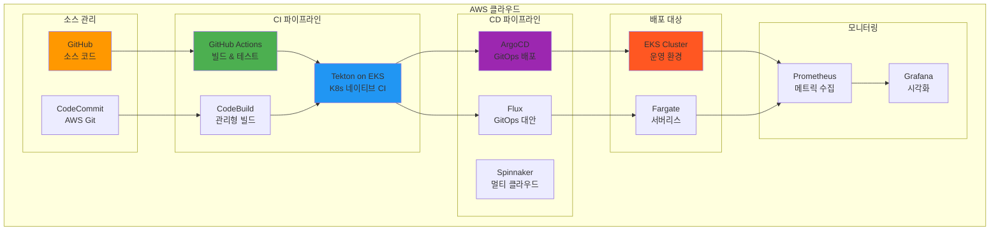
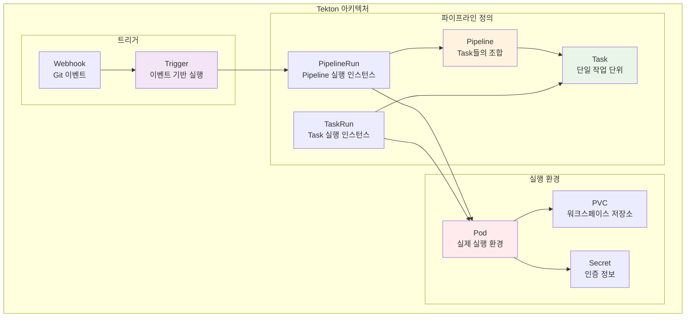
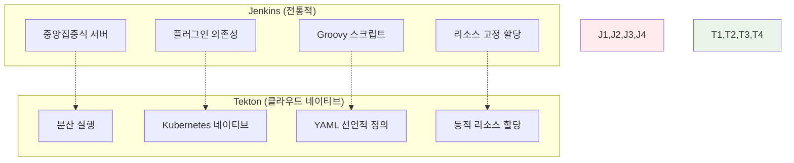
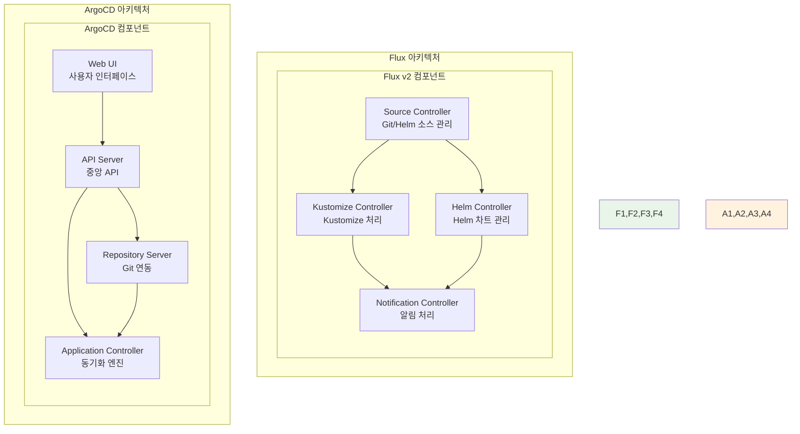
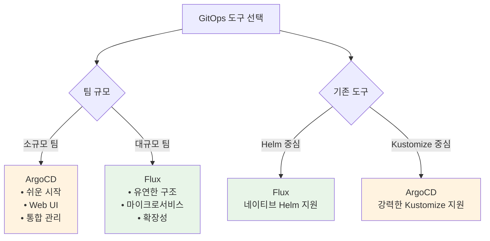
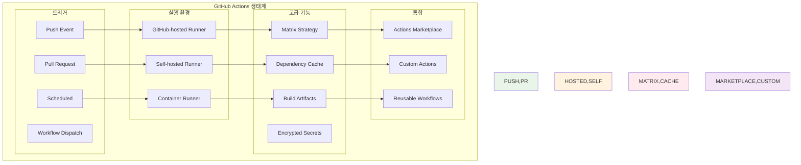
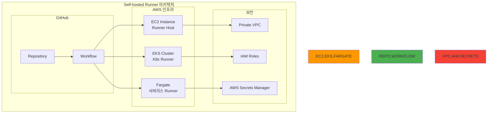

# Week 4 Day 4 Session 3: 클라우드 네이티브 CI/CD

<div align="center">

**🔧 Tekton** • **🌊 Flux** • **⚙️ GitHub Actions** • **🚀 현대적 파이프라인**

*Kubernetes 네이티브 CI/CD와 고급 자동화 파이프라인*

</div>

---

## 🕘 세션 정보
**시간**: 11:00-11:50 (50분)
**목표**: Tekton, Flux 등 클라우드 네이티브 CI/CD 도구 비교와 고급 GitHub Actions 활용
**방식**: 이론 설명 + 도구 비교 + 실무 사례 + 페어 토론

## 🎯 세션 목표
### 📚 학습 목표
- **도구 비교**: Tekton, Flux, ArgoCD, GitHub Actions의 특징과 차이점
- **아키텍처 이해**: Kubernetes 네이티브 CI/CD의 설계 원칙
- **실무 선택**: 프로젝트 요구사항에 따른 최적 도구 조합 선택

### 🤔 왜 필요한가? (5분 - 동기부여 및 맥락 제공)

**현실 문제 상황**:
- 💼 **실무 시나리오**: "카카오에서 Jenkins가 너무 무겁고 복잡해요. Kubernetes 환경에 더 적합한 CI/CD가 필요해요"
- 🏠 **일상 비유**: "스마트폰 앱처럼 각각의 전문 도구를 조합해서 사용하는 것처럼"
- ☁️ **AWS 아키텍처**: "CodePipeline + EKS + GitOps의 현대적 조합"
- 📊 **시장 동향**: "카카오, 네이버 등 국내 IT 기업의 Kubernetes 네이티브 도구 급속 도입"

**학습 전후 비교**:


**🏗️ 현대적 CI/CD 아키텍처**:


---

## 📖 핵심 개념 (35분 - 체계적 지식 구축)

### 🔍 개념 1: Tekton - Kubernetes 네이티브 CI/CD (12분)

> **정의**: Kubernetes 클러스터에서 실행되는 오픈소스 CI/CD 프레임워크로, 파이프라인을 Kubernetes 리소스로 정의

**Tekton 핵심 컴포넌트**:


**Tekton Pipeline 예시**:
```yaml
apiVersion: tekton.dev/v1beta1
kind: Pipeline
metadata:
  name: build-and-deploy
spec:
  params:
  - name: git-url
    type: string
  - name: image-name
    type: string
  
  workspaces:
  - name: shared-data
  
  tasks:
  - name: fetch-source
    taskRef:
      name: git-clone
    params:
    - name: url
      value: $(params.git-url)
    workspaces:
    - name: output
      workspace: shared-data
  
  - name: build-image
    taskRef:
      name: buildah
    runAfter: ["fetch-source"]
    params:
    - name: IMAGE
      value: $(params.image-name)
    workspaces:
    - name: source
      workspace: shared-data
  
  - name: deploy-to-k8s
    taskRef:
      name: kubectl-deploy
    runAfter: ["build-image"]
    params:
    - name: image
      value: $(params.image-name)
```

**Tekton vs Jenkins 비교**:


**실무 Tekton 활용 사례**:


- **카카오 사례**: 카카오톡 서비스의 Kubernetes 네이티브 CI/CD
  - Jenkins 대비 빌드 시간 50% 단축 (20분 → 10분)
  - 동적 리소스 할당으로 70% 비용 절약
  - 동시 빌드 처리량 10배 증가 (100개 → 1000개)
- **네이버 클라우드 사례**: NAVER Cloud Platform에서 Tekton 기반 CI/CD 제공
  - 고객사들의 Kubernetes 네이티브 개발 환경 지원
  - 멀티 클러스터 환경에서의 통합 파이프라인 운영
- **라인 사례**: LINE 메신저 서비스의 Tekton 도입
  - 글로벌 서비스의 다중 리전 배포 자동화
  - 개발자 만족도 95% 달성 (YAML 기반 선언적 정의)

### 🔍 개념 2: Flux vs ArgoCD - GitOps 도구 비교 (12분)

> **정의**: 둘 다 GitOps 원칙을 구현하는 도구이지만, 아키텍처와 접근 방식에서 차이점 존재

**Flux vs ArgoCD 아키텍처 비교**:


**주요 차이점 비교**:

| 특징 | Flux | ArgoCD |
|------|------|--------|
| **아키텍처** | 마이크로서비스 (분산) | 모놀리식 (중앙집중) |
| **UI** | CLI 중심 | Web UI 제공 |
| **멀티 테넌시** | 네임스페이스 기반 | 프로젝트 기반 |
| **Helm 지원** | 네이티브 지원 | 플러그인 방식 |
| **RBAC** | Kubernetes RBAC | 자체 RBAC |
| **복잡도** | 높음 (유연성) | 낮음 (사용 편의성) |

**Flux 설정 예시**:
```yaml
# GitRepository 소스 정의
apiVersion: source.toolkit.fluxcd.io/v1beta2
kind: GitRepository
metadata:
  name: webapp-source
  namespace: flux-system
spec:
  interval: 1m
  ref:
    branch: main
  url: https://github.com/company/webapp-config

---
# Kustomization 배포 정의
apiVersion: kustomize.toolkit.fluxcd.io/v1beta2
kind: Kustomization
metadata:
  name: webapp-deploy
  namespace: flux-system
spec:
  interval: 5m
  path: "./clusters/production"
  prune: true
  sourceRef:
    kind: GitRepository
    name: webapp-source
  targetNamespace: webapp
```

**선택 기준**:


### 🔍 개념 3: GitHub Actions 고급 활용과 최적화 (11분)

> **정의**: GitHub 통합 CI/CD 플랫폼의 고급 기능을 활용한 효율적이고 확장 가능한 파이프라인 구축

**GitHub Actions 고급 아키텍처**:


**고급 GitHub Actions 워크플로우**:
```yaml
name: Advanced CI/CD Pipeline

on:
  push:
    branches: [main, develop]
  pull_request:
    branches: [main]

env:
  REGISTRY: ghcr.io
  IMAGE_NAME: ${{ github.repository }}

jobs:
  # 매트릭스 전략으로 다중 환경 테스트
  test:
    runs-on: ubuntu-latest
    strategy:
      matrix:
        node-version: [16, 18, 20]
        os: [ubuntu-latest, windows-latest, macos-latest]
    
    steps:
    - uses: actions/checkout@v4
    
    # 의존성 캐싱으로 빌드 시간 단축
    - name: Cache dependencies
      uses: actions/cache@v3
      with:
        path: ~/.npm
        key: ${{ runner.os }}-node-${{ hashFiles('**/package-lock.json') }}
        restore-keys: |
          ${{ runner.os }}-node-
    
    - name: Setup Node.js ${{ matrix.node-version }}
      uses: actions/setup-node@v4
      with:
        node-version: ${{ matrix.node-version }}
        cache: 'npm'
    
    - run: npm ci
    - run: npm test

  # 컨테이너 빌드 및 푸시
  build-and-push:
    needs: test
    runs-on: ubuntu-latest
    permissions:
      contents: read
      packages: write
    
    steps:
    - uses: actions/checkout@v4
    
    - name: Log in to Container Registry
      uses: docker/login-action@v3
      with:
        registry: ${{ env.REGISTRY }}
        username: ${{ github.actor }}
        password: ${{ secrets.GITHUB_TOKEN }}
    
    - name: Build and push Docker image
      uses: docker/build-push-action@v5
      with:
        context: .
        push: true
        tags: ${{ env.REGISTRY }}/${{ env.IMAGE_NAME }}:${{ github.sha }}
        cache-from: type=gha
        cache-to: type=gha,mode=max

  # GitOps 배포 트리거
  deploy:
    needs: build-and-push
    runs-on: ubuntu-latest
    if: github.ref == 'refs/heads/main'
    
    steps:
    - name: Update deployment manifest
      uses: fjogeleit/yaml-update-action@main
      with:
        valueFile: 'k8s/deployment.yaml'
        propertyPath: 'spec.template.spec.containers[0].image'
        value: ${{ env.REGISTRY }}/${{ env.IMAGE_NAME }}:${{ github.sha }}
        repository: company/k8s-manifests
        token: ${{ secrets.DEPLOY_TOKEN }}
```

**Self-hosted Runner 활용**:


**🔑 핵심 키워드 정리**:
- **Tekton**: Kubernetes 네이티브 CI/CD 프레임워크
- **Flux**: 마이크로서비스 아키텍처의 GitOps 도구
- **Matrix Strategy**: 다중 환경 병렬 테스트 전략
- **Self-hosted Runner**: 자체 관리 GitHub Actions 실행 환경
- **Reusable Workflows**: 재사용 가능한 워크플로우 템플릿

---

## 💭 함께 생각해보기 (10분 - 상호작용 및 이해도 확인)

### 🤝 페어 토론 (5분):
**토론 주제**:
1. **도구 선택**: "마이크로서비스 프로젝트에서 Tekton vs GitHub Actions vs Jenkins 중 어떤 것을 선택하시겠어요?"
2. **GitOps 비교**: "Flux와 ArgoCD 중 어떤 것이 우리 팀에 더 적합할까요?"
3. **최적화 전략**: "GitHub Actions에서 빌드 시간을 단축하고 비용을 절약하는 방법은?"

**페어 활동 가이드**:
- 👥 **경험 기반 페어링**: CI/CD 도구 사용 경험이 다른 사람들끼리 매칭
- 🔄 **역할 교대**: 3분씩 기술 평가자/비즈니스 의사결정자 역할 바꾸기
- 📝 **선택 기준**: 각 도구의 장단점과 선택 이유를 구체적으로 정리

### 🎯 전체 공유 (5분):
- **도구 조합**: 각 페어가 제안하는 최적의 CI/CD 도구 조합 발표
- **실무 경험**: 실제 사용해본 도구들의 장단점 공유
- **실습 연결**: 오후 Lab에서 구현할 파이프라인 구조 미리 논의

**💡 이해도 체크 질문**:
- ✅ "Tekton이 Jenkins보다 Kubernetes 환경에 적합한 이유를 설명할 수 있나요?"
- ✅ "Flux와 ArgoCD의 핵심 차이점과 선택 기준을 파악했나요?"
- ✅ "GitHub Actions의 고급 기능들을 활용한 최적화 방안을 제시할 수 있나요?"

---

## 🔑 핵심 키워드

### 🆕 새로운 용어
- **Tekton**: Kubernetes 네이티브 CI/CD 프레임워크
- **Task/Pipeline**: Tekton의 기본 실행 단위와 워크플로우
- **Flux v2**: 마이크로서비스 아키텍처의 GitOps 도구
- **Matrix Strategy**: GitHub Actions의 다중 환경 병렬 실행
- **Self-hosted Runner**: 자체 관리 CI/CD 실행 환경

### 🔤 기술 용어
- **TaskRun/PipelineRun**: Tekton의 실행 인스턴스
- **Source Controller**: Flux의 Git/Helm 소스 관리 컴포넌트
- **Kustomize Controller**: Flux의 Kustomize 처리 컴포넌트
- **Reusable Workflows**: GitHub Actions의 재사용 가능한 워크플로우
- **Dependency Cache**: 빌드 의존성 캐싱 최적화

### 🔤 실무 용어
- **Cloud Native CI/CD**: 클라우드 네이티브 환경 최적화 파이프라인
- **GitOps Engine**: Git 기반 배포 자동화 엔진
- **Pipeline as Code**: 파이프라인의 코드화 및 버전 관리
- **Multi-tenancy**: 다중 팀/프로젝트 지원 아키텍처
- **Observability**: CI/CD 파이프라인의 관측 가능성

---

## 📝 세션 마무리

### ✅ 오늘 세션 성과
- [ ] **도구 비교 이해**: Tekton, Flux, ArgoCD, GitHub Actions의 특징과 차이점 파악
- [ ] **아키텍처 설계**: Kubernetes 네이티브 CI/CD의 설계 원칙 이해
- [ ] **실무 선택**: 프로젝트 요구사항에 따른 최적 도구 조합 선택 능력
- [ ] **최적화 전략**: 각 도구의 고급 기능을 활용한 효율화 방안 학습

### 🎯 실습 준비
- **Lab 4 연결**: ArgoCD 기반 GitOps 파이프라인 구축 실습
- **도구 조합**: GitHub Actions + ArgoCD 통합 파이프라인 구현
- **실무 시나리오**: 마이크로서비스 배포 자동화 실습

### 🔮 오후 실습 예고
- **Lab 4**: ArgoCD 기반 GitOps 파이프라인 구축 - 실제 마이크로서비스 배포
- **Hands-on 4**: 멀티 환경 배포 자동화 - Dev/Staging/Prod 파이프라인 구현
- **통합 실습**: GitHub Actions와 ArgoCD를 연동한 완전한 CI/CD 파이프라인

---

<div align="center">

**🔧 클라우드 네이티브** • **🌊 현대적 도구** • **⚙️ 최적화** • **🚀 실무 적용**

*차세대 CI/CD 도구로 구축하는 현대적 파이프라인*

</div>
