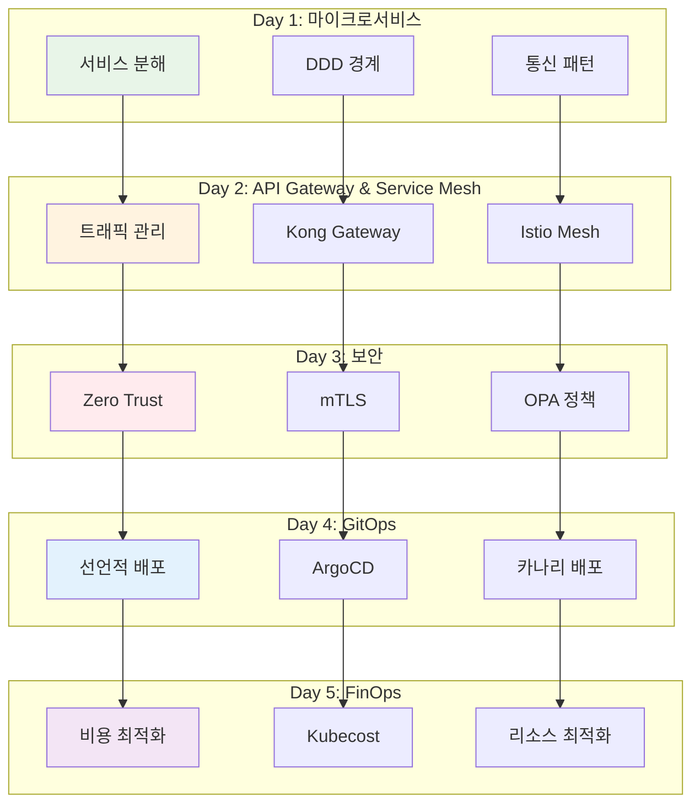
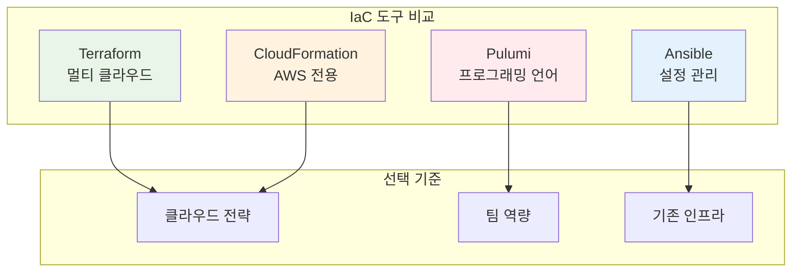
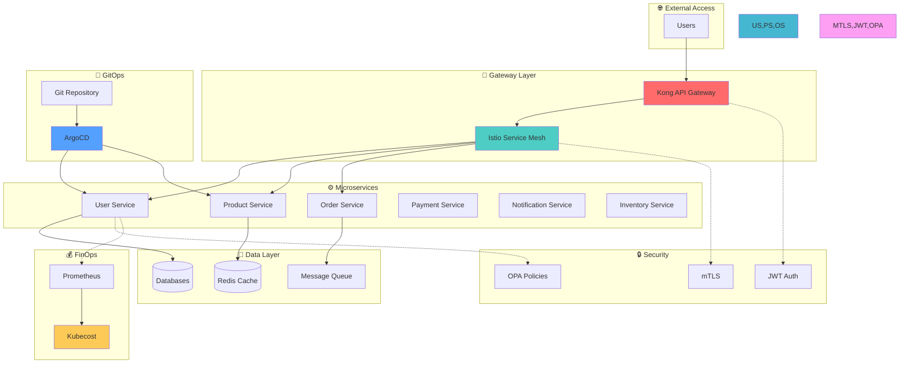
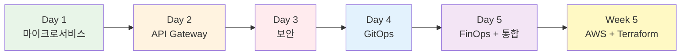
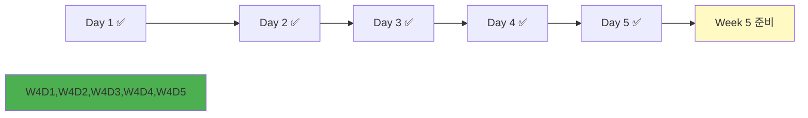

# Week 4 Day 5: FinOps & 클라우드 네이티브 통합 정리

<div align="center">

**💰 FinOps** • **📊 비용 최적화** • **🔄 Week 4 통합** • **☁️ AWS 준비**

*클라우드 비용 관리와 Week 4 마무리, Week 5 AWS 학습 준비*

</div>

---

## 🕘 일일 스케줄

### 📊 시간 배분
```
📚 이론 강의: 2.5시간 (50분×3세션) - FinOps + 통합 정리 + AWS 준비
🛠️ 실습 세션: 2.5시간 (75분×2세션) - 비용 모니터링 + 프로젝트 완성
🎮 Challenge: 1.5시간 (90분) - 통합 운영 챌린지
👥 학생 케어: 1.5시간 - 개별 맞춤 지원
```

### 🗓️ 상세 스케줄
| 시간 | 구분 | 내용 | 목적 |
|------|------|------|------|
| **09:00-09:50** | 📚 이론 1 | FinOps 문화와 Kubernetes 비용 최적화 (50분) | 비용 관리 기초 |
| **09:50-10:00** | ☕ 휴식 | 10분 휴식 | |
| **10:00-10:50** | 📚 이론 2 | Week 4 핵심 개념 통합 정리 (50분) | 전체 복습 |
| **10:50-11:00** | ☕ 휴식 | 10분 휴식 | |
| **11:00-11:50** | 📚 이론 3 | 클라우드 인프라 관리 - IaC와 AWS 기초 (50분) | Week 5 준비 |
| **11:50-12:00** | ☕ 휴식 | 10분 휴식 | |
| **12:00-13:00** | 🛠️ 실습 1 | Kubecost 기반 비용 모니터링 + 리소스 최적화 (60분) | 비용 관리 실습 |
| **13:00-14:00** | 🍽️ 점심 | 점심시간 (60분) | |
| **14:00-15:15** | 🛠️ 실습 2 | Week 4 CloudMart 프로젝트 최종 완성 (75분) | 통합 프로젝트 |
| **15:15-15:30** | ☕ 휴식 | 15분 휴식 | |
| **15:30-17:00** | 🎮 Challenge | 통합 운영 챌린지 - 비용/성능/보안 균형 (90분) | 종합 평가 |
| **17:00-18:00** | 👥 케어 | 개별 학습 지원 및 Week 5 준비 | 맞춤 지원 |

---

## 🎯 학습 목표

### 📚 이론 학습 목표
- **FinOps 문화**: 클라우드 비용 관리의 조직적 접근법 이해
- **비용 최적화**: Kubernetes 환경의 리소스 최적화 전략
- **Week 4 통합**: 마이크로서비스부터 GitOps까지 전체 개념 정리
- **IaC 이해**: Infrastructure as Code 도구 비교 및 선택 기준
- **AWS 기초**: Kubernetes에서 AWS 인프라로의 개념 전환

### 🛠️ 실습 목표
- **비용 모니터링**: Kubecost를 활용한 실시간 비용 추적
- **리소스 최적화**: HPA/VPA를 통한 자동 최적화
- **프로젝트 완성**: CloudMart 통합 프로젝트 마무리
- **통합 운영**: 비용, 성능, 보안의 균형잡힌 운영

### 🤝 협업 목표
- **지식 공유**: Week 4 학습 내용 상호 정리
- **프로젝트 완성**: 팀별 CloudMart 최종 완성
- **경험 공유**: 실무 적용 아이디어 교환

---

## 📚 이론 세션 구성

### [Session 1: FinOps 문화와 Kubernetes 비용 최적화](./session_1.md) (50분)
**🎯 목표**: 클라우드 비용 관리의 체계적 접근법 이해

#### 핵심 내용
- **FinOps 프레임워크**: Inform → Optimize → Operate 사이클
- **비용 가시성**: 클러스터/네임스페이스/Pod 단위 비용 추적
- **리소스 최적화**: CPU/Memory 요청/제한 최적화
- **자동 스케일링**: HPA/VPA/Cluster Autoscaler 비용 영향

#### 실무 연계
- **Netflix**: 수천 개 마이크로서비스의 비용 최적화 전략
- **Spotify**: Pod 리소스 최적화로 30% 비용 절감
- **Airbnb**: 자동 스케일링으로 유휴 리소스 최소화

---

### [Session 2: Week 4 핵심 개념 통합 정리](./session_2.md) (50분)
**🎯 목표**: 4일간 학습한 클라우드 네이티브 개념 종합 정리

#### 통합 아키텍처


#### 핵심 개념 정리
- **마이크로서비스**: 서비스 분해 전략과 통신 패턴
- **API Gateway**: Kong vs Istio 선택 기준
- **보안**: Zero Trust 아키텍처와 mTLS
- **GitOps**: 선언적 배포와 고급 배포 전략
- **FinOps**: 비용 최적화와 리소스 관리

---

### [Session 3: 클라우드 인프라 관리 - IaC와 AWS 기초](./session_3.md) (50분)
**🎯 목표**: Infrastructure as Code 이해와 Week 5 프로젝트 배포 준비

#### Part 1: IaC 개념과 도구 비교 (20분)


#### Part 2: Kubernetes → AWS 매핑 (20분)
- **컴퓨팅**: Pod/Deployment → EC2 Instance
- **네트워킹**: Service/Ingress → VPC/ALB/Route53
- **스토리지**: PV/PVC → EBS/S3
- **데이터베이스**: StatefulSet → RDS

#### Part 3: Week 5 학습 로드맵 (10분)
- **프로젝트 목표**: CloudMart를 AWS에 배포
- **Day 1-2**: AWS 핵심 서비스 (VPC, EC2, RDS, S3, ALB)
- **Day 3-4**: Terraform으로 인프라 코드화
- **Day 5**: CloudMart 프로젝트 AWS 배포 완성

---

## 🛠️ 실습 세션 구성

### [Lab 1: Kubecost 기반 비용 모니터링 + 리소스 최적화](./lab_1.md) (75분)
**🎯 목표**: 실시간 비용 추적과 자동 최적화 구현

#### 실습 내용
1. **Kubecost 설치 및 설정** (20분)
   - Helm을 통한 Kubecost 배포
   - Prometheus 연동 설정
   - 비용 데이터 수집 확인

2. **비용 분석 및 시각화** (25분)
   - 네임스페이스별 비용 분석
   - Pod별 리소스 사용량 추적
   - 비용 트렌드 분석

3. **리소스 최적화 구현** (30분)
   - HPA 설정으로 자동 스케일링
   - VPA로 리소스 요청 최적화
   - 비용 절감 효과 측정

---

### [Hands-on 1: Week 4 CloudMart 프로젝트 최종 완성](./handson_1.md) (75분)
**🎯 목표**: 4일간 구축한 CloudMart 프로젝트 통합 완성

#### 통합 체크리스트
- [ ] **마이크로서비스**: 6개 서비스 정상 동작
- [ ] **API Gateway**: Kong/Istio 트래픽 관리
- [ ] **보안**: mTLS + JWT + OPA 정책 적용
- [ ] **GitOps**: ArgoCD 자동 배포
- [ ] **FinOps**: Kubecost 비용 모니터링

#### 최종 아키텍처


---

### [Challenge 1: 통합 운영 챌린지 - 비용/성능/보안 균형](./challenge_1.md) (90분)
**🎯 목표**: 실무 운영 시나리오에서 비용, 성능, 보안의 균형 찾기

#### Challenge 시나리오
**"Black Friday 세일 준비 - 트래픽 10배 증가 대응"**

#### 해결 과제
1. **비용 최적화** (30분)
   - 현재 비용 분석 및 낭비 요소 식별
   - 리소스 최적화 전략 수립
   - 자동 스케일링 설정

2. **성능 보장** (30분)
   - 트래픽 증가 시뮬레이션
   - 병목 지점 식별 및 해결
   - 카나리 배포로 안전한 확장

3. **보안 유지** (30분)
   - 보안 정책 검증
   - 취약점 스캔 및 해결
   - 컴플라이언스 확인

---

## ✅ 학습 체크포인트

### 📚 이론 이해도
- [ ] FinOps 프레임워크 3단계 설명 가능
- [ ] Week 4 핵심 개념 통합 이해
- [ ] IaC 도구별 특징과 선택 기준 파악
- [ ] Kubernetes → AWS 개념 매핑 이해

### 🛠️ 실습 완성도
- [ ] Kubecost 비용 모니터링 구축
- [ ] 리소스 최적화 자동화 구현
- [ ] CloudMart 프로젝트 완전 통합
- [ ] 통합 운영 챌린지 해결

### 🤝 협업 성과
- [ ] 팀별 프로젝트 완성도
- [ ] 지식 공유 및 상호 학습
- [ ] 실무 적용 아이디어 도출

---

## 🎯 학습 성과

### 💡 기술적 성취
- **FinOps 역량**: 클라우드 비용 관리 전문 지식
- **통합 이해**: Week 4 전체 개념의 유기적 연결
- **실무 준비**: 실제 운영 환경 대응 능력
- **AWS 준비**: Week 5 학습을 위한 기초 확립

### 🚀 실무 적용
- **비용 최적화**: 즉시 적용 가능한 비용 절감 전략
- **운영 노하우**: 비용/성능/보안 균형 유지 방법
- **도구 활용**: Kubecost, HPA/VPA 실무 활용
- **아키텍처 설계**: 클라우드 네이티브 전체 아키텍처 이해

---

## 🔗 연결성

### Week 4 Day 1-4 복습


### Week 5 준비
- **AWS 기초**: EC2, VPC, S3, RDS 등 프로젝트 구현을 위한 핵심 서비스
- **IaC 도구**: Terraform으로 인프라 코드화
- **프로젝트 배포**: CloudMart를 AWS에 배포하기 위한 인프라 구축

---

## 📝 일일 마무리

### ✅ 오늘의 성과
- [ ] FinOps 문화와 비용 최적화 이해
- [ ] Week 4 전체 개념 통합 정리
- [ ] IaC와 AWS 기초 개념 학습
- [ ] CloudMart 프로젝트 완성
- [ ] 통합 운영 챌린지 해결

### 🎯 Week 5 준비사항
- **예습**: AWS 핵심 서비스 개념 (VPC, EC2, RDS, S3, ALB)
- **환경**: AWS 계정 준비 (Free Tier 가입)
- **도구**: Terraform 설치 준비
- **목표**: CloudMart 프로젝트를 AWS에 배포할 준비

### 📊 Week 4 학습 진도


---

## 🔄 피드백 및 개선

### 📈 일일 회고 (15분)
**학습 회고**:
1. Week 4에서 가장 인상 깊었던 개념은?
2. CloudMart 프로젝트에서 가장 어려웠던 부분과 해결 방법은?
3. 실무에서 바로 적용하고 싶은 기술은?
4. Week 5 AWS 학습에 대한 기대와 준비 계획은?

### 🎯 개선 포인트
**📊 강사 관찰 기반**:
- Week 4 전체 이해도 확인
- 프로젝트 완성도 평가
- Week 5 준비 상태 점검

**💬 학생 피드백 기반**:
- Week 4 난이도 및 속도 평가
- 실습 프로젝트 만족도
- Week 5 학습 기대사항

---

<div align="center">

**💰 FinOps 전문가** • **🏗️ 클라우드 네이티브 아키텍트** • **☁️ AWS 준비 완료**

*Week 4를 완벽히 마무리하고 Week 5에서 CloudMart를 AWS에 배포합니다*

**이전**: [Day 4 - GitOps와 배포 자동화](../day4/README.md) | **다음**: [Week 5 - AWS 인프라 구축과 프로젝트 배포](../../week_05/README.md)

</div>
