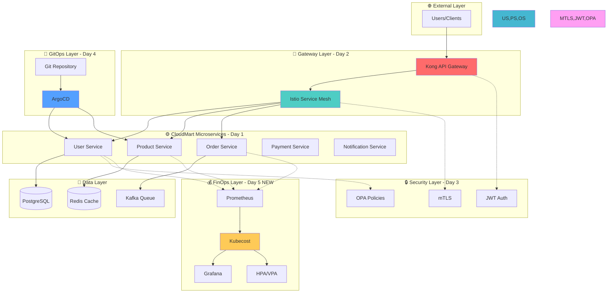

# Week 4 Day 5 Hands-on 1: Week 4 CloudMart 프로젝트 최종 완성

<div align="center">

**🏗️ 통합 아키텍처** • **💰 비용 최적화** • **🔒 보안 강화** • **📊 모니터링**

*4일간 구축한 CloudMart를 완전한 프로덕션급 시스템으로 완성*

</div>

---

## 🕘 실습 정보
**시간**: 14:00-15:15 (75분)
**목표**: Lab 1의 Kubecost를 CloudMart에 통합하여 전체 시스템 완성
**방식**: 직접 코드 작성 및 실행 (inline)

## 🎯 실습 목표

### 📚 학습 목표
- Week 4 전체 개념의 통합 적용
- Kubecost를 기존 CloudMart에 통합
- 프로덕션급 모니터링 및 비용 관리
- 전체 시스템의 유기적 연결 이해

### 🛠️ 구현 목표
- CloudMart 마이크로서비스 완전 통합
- Kubecost 비용 모니터링 추가
- 통합 대시보드 구축
- 최종 시스템 검증

---

## 🏗️ 최종 통합 아키텍처

### 🤔 Week 4 전체 여정 (Day 1 → Day 5)

**🏠 실생활 비유**: 온라인 쇼핑몰을 처음부터 완성까지 만드는 과정



### 📅 Week 4 통합 스토리

**Day 1: 마이크로서비스 아키텍처 (기초 공사)**
- 🏠 비유: 쇼핑몰의 각 부서 만들기 (회원팀, 상품팀, 주문팀)
- 역할: CloudMart의 핵심 서비스들을 독립적으로 구축
- 결과: User, Product, Order, Payment, Notification 서비스

**Day 2: API Gateway & Service Mesh (출입구와 내부 통로)**
- 🏠 비유: 쇼핑몰 정문(API Gateway)과 부서 간 복도(Service Mesh)
- 역할: 외부 요청 관리(Kong)와 내부 서비스 간 통신(Istio)
- 결과: 통합된 API 엔드포인트와 서비스 간 안전한 통신

**Day 3: 보안과 컴플라이언스 (보안 시스템)**
- 🏠 비유: 출입증(JWT), CCTV(mTLS), 보안 규칙(OPA)
- 역할: 인증/인가, 암호화 통신, 정책 기반 접근 제어
- 결과: 프로덕션급 보안 체계 구축

**Day 4: GitOps와 배포 자동화 (자동 관리 시스템)**
- 🏠 비유: 쇼핑몰 운영 매뉴얼(Git)과 자동 관리 시스템(ArgoCD)
- 역할: 코드 기반 인프라 관리와 자동 배포
- 결과: 안전하고 추적 가능한 배포 프로세스

**Day 5: FinOps와 비용 최적화 (가계부와 절약 시스템) ⭐ 오늘**
- 🏠 비유: 쇼핑몰 운영비 관리와 자동 절약 시스템
- 역할: 실시간 비용 모니터링과 자동 리소스 최적화
- 결과: 비용 가시성 확보 + 30-60% 비용 절감

### 🎯 Hands-on 1의 목표

**Lab 1과의 차이점**:
- **Lab 1**: Kubecost 기본 설치 및 샘플 앱 테스트 (학습용)
- **Hands-on 1**: 실제 CloudMart에 Kubecost 통합 (실전용)

**왜 통합이 중요한가?**:
- 실제 프로젝트에서는 모든 시스템이 유기적으로 연결되어야 함
- 비용 모니터링은 독립적이 아니라 전체 시스템의 일부
- 🏠 비유: 가계부는 따로 쓰는 게 아니라 실제 지출과 연결되어야 의미 있음

### 💰 CloudMart 마이크로서비스 상세 설명

**User Service (회원 서비스)**:
- 역할: 회원 가입, 로그인, 프로필 관리
- 🏠 비유: 쇼핑몰 회원 카드 발급 및 관리 부서
- 데이터: PostgreSQL (회원 정보는 안전하게 DB에 저장)
- 비용 특성: 안정적인 트래픽 (회원 수는 급변하지 않음)

**Product Service (상품 서비스)**:
- 역할: 상품 목록, 상세 정보, 재고 관리
- 🏠 비유: 쇼핑몰 상품 진열 및 재고 관리 부서
- 데이터: Redis Cache (빠른 조회를 위해 캐시 사용)
- 비용 특성: 높은 트래픽 (많은 사람이 상품을 둘러봄)

**Order Service (주문 서비스)**:
- 역할: 장바구니, 주문 생성, 주문 내역
- 🏠 비유: 쇼핑몰 계산대 및 주문 처리 부서
- 데이터: Kafka Queue (주문은 순서대로 처리)
- 비용 특성: 변동 트래픽 (세일 기간에 급증)

**Payment Service (결제 서비스)**:
- 역할: 결제 처리, 결제 내역 관리
- 🏠 비유: 쇼핑몰 결제 시스템 (카드, 계좌이체 등)
- 데이터: 외부 결제 API 연동
- 비용 특성: 중요도 높음 (장애 시 매출 손실)

**Notification Service (알림 서비스)**:
- 역할: 이메일, SMS, 푸시 알림 발송
- 🏠 비유: 쇼핑몰 고객 안내 방송 시스템
- 데이터: 메시지 큐 (비동기 처리)
- 비용 특성: 낮은 리소스 (알림만 보내면 됨)

---

## 🛠️ Step 1: 클러스터 및 모니터링 스택 설치 (15분)

### 🤔 왜 필요한가?
**문제 상황**:
- CloudMart 전체 시스템을 모니터링하려면 완전한 관측성 스택 필요
- 비용(Kubecost), 메트릭(Prometheus), 추적(Jaeger), 시각화(Grafana) 모두 필요
- 🏠 비유: 쇼핑몰 운영에 CCTV(Jaeger), 전기계량기(Prometheus), 가계부(Kubecost), 대시보드(Grafana) 모두 필요

**관측성 3요소 + 비용**:
- **Metrics** (메트릭): CPU, Memory 사용량 → Prometheus
- **Traces** (추적): 서비스 간 요청 흐름 → Jaeger
- **Logs** (로그): 애플리케이션 로그 → (이번 실습에서는 생략)
- **Cost** (비용): 리소스 사용량 → 비용 변환 → Kubecost

### 🚀 자동화 스크립트 사용

**1-1. 클러스터 생성**
```bash
cd theory/week_04/day5/lab_scripts/handson1
./setup-cluster.sh
```

**📋 스크립트 내용**: [setup-cluster.sh](./lab_scripts/handson1/setup-cluster.sh)

**스크립트 핵심 부분**:
```bash
# 기존 클러스터 삭제
kind delete cluster --name lab-cluster

# 새 클러스터 생성 (모니터링 포트 포함)
kind create cluster --config=- <<EOF
kind: Cluster
apiVersion: kind.x-k8s.io/v1alpha4
name: lab-cluster
nodes:
- role: control-plane
  extraPortMappings:
  - containerPort: 30080-30082  # CloudMart 서비스
  - containerPort: 30090        # Kubecost
  - containerPort: 30091        # Grafana
  - containerPort: 30092        # Jaeger UI
- role: worker
- role: worker
EOF
```

**📊 예상 결과**:
```
=== Hands-on 클러스터 초기화 완료 ===

클러스터 정보:
- 이름: lab-cluster
- Control Plane: 1개
- Worker Node: 2개
- 오픈 포트:
  * 30080-30082: CloudMart 서비스
  * 30090: Kubecost
  * 30091: Grafana
  * 30092: Jaeger UI
```

**1-2. 모니터링 스택 설치**
```bash
./install-monitoring-stack.sh
```

**📋 스크립트 내용**: [install-monitoring-stack.sh](./lab_scripts/handson1/install-monitoring-stack.sh)

**스크립트 핵심 부분**:
```bash
# Metrics Server 설치
kubectl apply -f https://github.com/kubernetes-sigs/metrics-server/releases/latest/download/components.yaml

# Prometheus 설치
kubectl apply -f prometheus-config.yaml

# Jaeger 설치
kubectl apply -f jaeger-all-in-one.yaml

# Kubecost 설치
kubectl apply -f kubecost-deployment.yaml

# Grafana 설치
kubectl apply -f grafana-deployment.yaml
```

**설치되는 컴포넌트**:
- **Metrics Server**: 리소스 사용량 수집 (CPU, Memory)
- **Prometheus**: 메트릭 저장 및 쿼리
- **Jaeger**: 분산 추적 (서비스 간 요청 흐름)
- **Kubecost**: 비용 계산 및 분석
- **Grafana**: 통합 대시보드

**📊 예상 결과**:
```
=== 모니터링 스택 설치 완료 ===

설치된 컴포넌트:
- Metrics Server (kube-system namespace)
- Prometheus (monitoring namespace)
- Jaeger (tracing namespace)
  * UI: http://localhost:30092
- Kubecost (kubecost namespace)
  * UI: http://localhost:30090
- Grafana (monitoring namespace)
  * UI: http://localhost:30091
  * ID: admin / PW: admin
```

### ✅ 검증

**설치 확인**:
```bash
# 모든 네임스페이스의 Pod 확인
kubectl get pods --all-namespaces

# Metrics Server 동작 확인
kubectl top nodes
```

**예상 출력**:
```
NAMESPACE       NAME                              READY   STATUS    RESTARTS   AGE
kube-system     metrics-server-xxx                1/1     Running   0          2m
monitoring      prometheus-xxx                    1/1     Running   0          2m
tracing         jaeger-xxx                        1/1     Running   0          2m
kubecost        kubecost-xxx                      1/1     Running   0          2m
monitoring      grafana-xxx                       1/1     Running   0          2m
```

### 💡 코드 설명

**각 도구의 역할**:
- **Metrics Server**: "지금 CPU/Memory 얼마나 쓰는지" 실시간 수집
- **Prometheus**: 메트릭을 시계열로 저장 (과거 데이터 조회 가능)
- **Jaeger**: "User Service → Product Service → DB" 같은 요청 흐름 추적
- **Kubecost**: "이 Pod가 한 달에 $50 사용" 같은 비용 계산
- **Grafana**: 모든 데이터를 보기 좋은 그래프로 표시

**포트 설정 이유**:
- **30090 (Kubecost)**: 비용 대시보드 접근
- **30091 (Grafana)**: 통합 모니터링 대시보드
- **30092 (Jaeger)**: 분산 추적 UI

---

## 🛠️ Step 2: CloudMart 마이크로서비스 배포 (20분)

### 🤔 왜 필요한가?
**문제 상황**:
- Lab 1의 샘플 앱은 학습용일 뿐, 실제 서비스가 아님
- Week 4 전체를 통합한 실제 프로젝트(CloudMart)가 필요
- 🏠 비유: 연습용 모형 매장이 아닌 실제 운영 매장 오픈

**CloudMart 마이크로서비스 구조**:
- **User Service**: 회원 관리 (가입, 로그인, 프로필)
- **Product Service**: 상품 관리 (목록, 상세, 재고)
- **Order Service**: 주문 처리 (장바구니, 결제, 배송)
- **Payment Service**: 결제 처리 (카드, 계좌이체)
- **Notification Service**: 알림 발송 (이메일, SMS)

**왜 이렇게 나눴나?**:
- 🏠 비유: 대형 쇼핑몰을 회원팀, 상품팀, 주문팀으로 나누는 것
- 각 팀이 독립적으로 일하면 효율적
- 한 팀에 문제가 생겨도 다른 팀은 정상 운영
- 팀별로 리소스와 비용을 따로 관리 가능

### 📝 직접 작성하기

**2-1. CloudMart 네임스페이스 생성**
```bash
# CloudMart 전용 네임스페이스
cat <<EOF | kubectl apply -f -
apiVersion: v1
kind: Namespace
metadata:
  name: cloudmart
  labels:
    project: cloudmart      # 프로젝트 이름
    team: platform          # 담당 팀
    cost-center: CC-2001    # 비용 센터 (Kubecost에서 추적용)
EOF
```

**💡 네임스페이스 라벨 설명**:
- `project: cloudmart`: Kubecost에서 "cloudmart 프로젝트 비용"으로 집계
- `team: platform`: 어느 팀이 관리하는지 표시
- `cost-center: CC-2001`: 회계 부서의 비용 코드 (실제 회사에서 사용)

**2-2. User Service 배포**
```bash
cat <<EOF | kubectl apply -f -
apiVersion: apps/v1
kind: Deployment
metadata:
  name: user-service
  namespace: cloudmart
  labels:
    app: user-service
    tier: backend
spec:
  replicas: 2              # 기본 2개 Pod (고가용성)
  selector:
    matchLabels:
      app: user-service
  template:
    metadata:
      labels:
        app: user-service
        tier: backend
        version: v1        # 버전 관리 (Day 4 GitOps 연계)
      annotations:
        prometheus.io/scrape: "true"    # 💡 Prometheus가 메트릭 수집
        prometheus.io/port: "9113"      # 💡 메트릭 포트
        prometheus.io/path: "/metrics"  # 💡 메트릭 경로
    spec:
      containers:
      - name: user-service
        image: nginx:alpine  # 💡 실제로는 user-service 이미지 사용
        ports:
        - containerPort: 8080
          name: http
        env:
        - name: SERVICE_NAME
          value: "user-service"
        - name: DB_HOST
          value: "postgres-service"  # PostgreSQL 연결
        resources:
          requests:
            cpu: 100m        # 최소 보장: CPU 0.1 코어
            memory: 128Mi    # 최소 보장: 메모리 128MB
          limits:
            cpu: 300m        # 최대 사용: CPU 0.3 코어
            memory: 256Mi    # 최대 사용: 메모리 256MB
        livenessProbe:       # 💡 살아있는지 확인 (죽으면 재시작)
          httpGet:
            path: /health
            port: 8080
          initialDelaySeconds: 30
          periodSeconds: 10
        readinessProbe:      # 💡 준비됐는지 확인 (준비 안되면 트래픽 안 보냄)
          httpGet:
            path: /ready
            port: 8080
          initialDelaySeconds: 10
          periodSeconds: 5
      # 💡 Nginx Prometheus Exporter (사이드카)
      - name: nginx-exporter
        image: nginx/nginx-prometheus-exporter:0.11.0
        args:
        - -nginx.scrape-uri=http://localhost:8080/stub_status
        ports:
        - containerPort: 9113
          name: metrics
        resources:
          requests:
            cpu: 10m
            memory: 16Mi
          limits:
            cpu: 50m
            memory: 64Mi
---
apiVersion: v1
kind: Service
metadata:
  name: user-service
  namespace: cloudmart
spec:
  selector:
    app: user-service
  ports:
  - port: 80
    targetPort: 8080
    name: http
  - port: 9113
    targetPort: 9113
    name: metrics        # 💡 메트릭 포트 추가
  type: ClusterIP
EOF
```

**💡 User Service 설정 설명**:
- **replicas: 2**: 최소 2개로 고가용성 확보 (1개 죽어도 서비스 유지)
- **resources**: Kubecost가 이 값을 보고 비용 계산
  - requests: "최소 이만큼은 보장해줘" (비용 계산 기준)
  - limits: "최대 이만큼까지만 써" (노드 과부하 방지)
- **livenessProbe**: 서비스가 죽었는지 확인 (죽으면 자동 재시작)
- **readinessProbe**: 서비스가 준비됐는지 확인 (준비 안되면 트래픽 차단)
- **prometheus.io annotations**: Prometheus가 자동으로 메트릭 수집
  - `scrape: "true"`: 이 Pod에서 메트릭 수집
  - `port: "9113"`: 메트릭 포트 지정
  - `path: "/metrics"`: 메트릭 경로 지정
- **nginx-exporter 사이드카**: Nginx 메트릭을 Prometheus 형식으로 변환
  - 요청 수, 응답 시간, 연결 수 등 수집
  - Grafana에서 시각화 가능

**2-3. Product Service 배포**
```bash
cat <<EOF | kubectl apply -f -
apiVersion: apps/v1
kind: Deployment
metadata:
  name: product-service
  namespace: cloudmart
  labels:
    app: product-service
    tier: backend
spec:
  replicas: 3              # 💡 User보다 많음 (상품 조회가 더 많아서)
  selector:
    matchLabels:
      app: product-service
  template:
    metadata:
      labels:
        app: product-service
        tier: backend
        version: v1
      annotations:
        prometheus.io/scrape: "true"
        prometheus.io/port: "9113"
        prometheus.io/path: "/metrics"
    spec:
      containers:
      - name: product-service
        image: nginx:alpine
        ports:
        - containerPort: 8080
        env:
        - name: SERVICE_NAME
          value: "product-service"
        - name: REDIS_HOST
          value: "redis-service"  # 💡 Redis 캐시 사용 (빠른 조회)
        resources:
          requests:
            cpu: 150m        # 💡 User보다 많음 (트래픽이 더 많아서)
            memory: 256Mi
          limits:
            cpu: 500m
            memory: 512Mi
      - name: nginx-exporter
        image: nginx/nginx-prometheus-exporter:0.11.0
        args:
        - -nginx.scrape-uri=http://localhost:8080/stub_status
        ports:
        - containerPort: 9113
          name: metrics
        resources:
          requests:
            cpu: 10m
            memory: 16Mi
          limits:
            cpu: 50m
            memory: 64Mi
---
apiVersion: v1
kind: Service
metadata:
  name: product-service
  namespace: cloudmart
spec:
  selector:
    app: product-service
  ports:
  - port: 80
    targetPort: 8080
    name: http
  - port: 9113
    targetPort: 9113
    name: metrics
  type: ClusterIP
EOF
```

**2-4. Order Service 배포**
```bash
cat <<EOF | kubectl apply -f -
apiVersion: apps/v1
kind: Deployment
metadata:
  name: order-service
  namespace: cloudmart
  labels:
    app: order-service
    tier: backend
spec:
  replicas: 2
  selector:
    matchLabels:
      app: order-service
  template:
    metadata:
      labels:
        app: order-service
        tier: backend
        version: v1
      annotations:
        prometheus.io/scrape: "true"
        prometheus.io/port: "9113"
        prometheus.io/path: "/metrics"
    spec:
      containers:
      - name: order-service
        image: nginx:alpine
        ports:
        - containerPort: 8080
        env:
        - name: SERVICE_NAME
          value: "order-service"
        - name: KAFKA_BROKERS
          value: "kafka-service:9092"
        resources:
          requests:
            cpu: 100m
            memory: 128Mi
          limits:
            cpu: 300m
            memory: 256Mi
      - name: nginx-exporter
        image: nginx/nginx-prometheus-exporter:0.11.0
        args:
        - -nginx.scrape-uri=http://localhost:8080/stub_status
        ports:
        - containerPort: 9113
          name: metrics
        resources:
          requests:
            cpu: 10m
            memory: 16Mi
          limits:
            cpu: 50m
            memory: 64Mi
---
apiVersion: v1
kind: Service
metadata:
  name: order-service
  namespace: cloudmart
spec:
  selector:
    app: order-service
  ports:
  - port: 80
    targetPort: 8080
    name: http
  - port: 9113
    targetPort: 9113
    name: metrics
  type: ClusterIP
EOF
```
    app: order-service
  ports:
  - port: 80
    targetPort: 8080
  type: ClusterIP
EOF
```

**2-5. 배포 확인**
```bash
# Pod 상태 확인
kubectl get pods -n cloudmart

# Service 확인
kubectl get svc -n cloudmart

# 배포 완료 대기
kubectl wait --for=condition=ready pod \
  -l tier=backend \
  -n cloudmart \
  --timeout=120s
```

### 💡 코드 설명
- **리소스 설정**: 각 서비스별 적절한 CPU/Memory 할당
- **헬스체크**: liveness/readiness probe로 안정성 확보
- **환경 변수**: 서비스 간 연결 정보 설정
- **라벨**: Kubecost 비용 추적을 위한 체계적 라벨링

---

## 🛠️ Step 3: HPA 설정 및 비용 최적화 (15분)

### 📝 직접 작성하기

**3-1. User Service HPA**
```bash
cat <<EOF | kubectl apply -f -
apiVersion: autoscaling/v2
kind: HorizontalPodAutoscaler
metadata:
  name: user-service-hpa
  namespace: cloudmart
spec:
  scaleTargetRef:
    apiVersion: apps/v1
    kind: Deployment
    name: user-service
  minReplicas: 2
  maxReplicas: 8
  metrics:
  - type: Resource
    resource:
      name: cpu
      target:
        type: Utilization
        averageUtilization: 70
  - type: Resource
    resource:
      name: memory
      target:
        type: Utilization
        averageUtilization: 80
  behavior:
    scaleDown:
      stabilizationWindowSeconds: 300
      policies:
      - type: Percent
        value: 50
        periodSeconds: 60
    scaleUp:
      stabilizationWindowSeconds: 0
      policies:
      - type: Percent
        value: 100
        periodSeconds: 30
EOF
```

**3-2. Product Service HPA**
```bash
cat <<EOF | kubectl apply -f -
apiVersion: autoscaling/v2
kind: HorizontalPodAutoscaler
metadata:
  name: product-service-hpa
  namespace: cloudmart
spec:
  scaleTargetRef:
    apiVersion: apps/v1
    kind: Deployment
    name: product-service
  minReplicas: 2
  maxReplicas: 10
  metrics:
  - type: Resource
    resource:
      name: cpu
      target:
        type: Utilization
        averageUtilization: 70
EOF
```

**3-3. Order Service HPA**
```bash
cat <<EOF | kubectl apply -f -
apiVersion: autoscaling/v2
kind: HorizontalPodAutoscaler
metadata:
  name: order-service-hpa
  namespace: cloudmart
spec:
  scaleTargetRef:
    apiVersion: apps/v1
    kind: Deployment
    name: order-service
  minReplicas: 1
  maxReplicas: 6
  metrics:
  - type: Resource
    resource:
      name: cpu
      target:
        type: Utilization
        averageUtilization: 70
EOF
```

**3-4. HPA 상태 확인**
```bash
# HPA 목록
kubectl get hpa -n cloudmart

# 상세 정보
kubectl describe hpa -n cloudmart
```

### 💡 코드 설명
- **Min/Max Replicas**: 서비스별 트래픽 패턴에 맞는 범위 설정
- **Behavior**: 급격한 스케일링 방지를 위한 안정화 설정
- **Multi-Metric**: CPU와 Memory 모두 고려한 스케일링

---

## 🛠️ Step 4: Kubecost 비용 분석 (15분)

### 📝 직접 분석하기

**4-1. Kubecost 대시보드 접속**
```bash
# 포트 포워딩
kubectl port-forward -n kubecost svc/kubecost-cost-analyzer 9090:9090 &

# 브라우저에서 http://localhost:9090 접속
```

**4-2. 네임스페이스별 비용 조회 (API)**
```bash
# CloudMart 비용 조회
curl -s "http://localhost:9090/model/allocation?window=1d&aggregate=namespace&filter=namespace:cloudmart" | jq

# 전체 네임스페이스 비용 비교
curl -s "http://localhost:9090/model/allocation?window=1d&aggregate=namespace" | jq '.data[] | {name: .name, totalCost: .totalCost}'
```

**예상 출력**:
```json
{
  "name": "cloudmart",
  "totalCost": 12.50
}
{
  "name": "production",
  "totalCost": 8.30
}
{
  "name": "staging",
  "totalCost": 4.20
}
```

**4-3. 서비스별 비용 조회**
```bash
# CloudMart 서비스별 비용
curl -s "http://localhost:9090/model/allocation?window=1d&aggregate=pod&filter=namespace:cloudmart" | jq '.data[] | {pod: .name, cpu: .cpuCost, memory: .memoryCost, total: .totalCost}' | head -20
```

**4-4. 비용 최적화 기회 식별**
```bash
# 리소스 사용률 확인
kubectl top pods -n cloudmart

# 과다 프로비저닝 Pod 식별
kubectl top pods -n cloudmart --sort-by=cpu
kubectl top pods -n cloudmart --sort-by=memory
```

### 💡 분석 포인트
- **비용 비교**: CloudMart vs 기존 샘플 애플리케이션
- **서비스별 비용**: 어떤 서비스가 가장 비용이 높은가?
- **최적화 기회**: 실제 사용량 대비 요청 리소스 비율
- **HPA 효과**: 자동 스케일링으로 인한 비용 변화

---

## 🛠️ Step 5: 통합 검증 및 최종 확인 (15분)

### 📝 직접 검증하기

**5-1. 전체 시스템 상태 확인**
```bash
# 모든 네임스페이스의 Pod
kubectl get pods --all-namespaces | grep -E "cloudmart|kubecost|production|staging"

# 모든 HPA
kubectl get hpa --all-namespaces

# 모든 Service
kubectl get svc -n cloudmart
```

**5-2. 리소스 사용량 확인**
```bash
# 노드 리소스
kubectl top nodes

# CloudMart Pod 리소스
kubectl top pods -n cloudmart

# 전체 클러스터 리소스
kubectl top pods --all-namespaces --sort-by=cpu | head -20
```

**5-3. 비용 대시보드 최종 확인**

Kubecost 대시보드에서 확인할 항목:
1. **Namespace 비용**: cloudmart, production, staging, development 비교
2. **서비스별 비용**: user-service, product-service, order-service
3. **비용 트렌드**: 시간대별 비용 변화
4. **최적화 제안**: Kubecost가 제안하는 최적화 기회

**5-4. 통합 아키텍처 검증 체크리스트**
```bash
./verify-cloudmart.sh
```

**📋 스크립트 내용**: [verify-cloudmart.sh](./lab_scripts/handson1/verify-cloudmart.sh)

**검증 항목**:
1. CloudMart 서비스 Pod 상태
2. HPA 동작 확인
3. Kubecost 상태
4. 전체 리소스 사용량
5. CloudMart 비용 (최근 1일)

### 💡 검증 포인트
- **가용성**: 모든 Pod가 Running 상태
- **스케일링**: HPA가 메트릭을 정상적으로 수집
- **비용 추적**: Kubecost가 CloudMart 비용 정상 추적
- **리소스 효율**: 노드 리소스 사용률 적정 수준

---

## ✅ 실습 체크포인트

### ✅ Step 1: 환경 확인
- [ ] Lab 1 클러스터 정상 동작
- [ ] Kubecost 정상 실행 (3/3 Running)
- [ ] 기존 샘플 애플리케이션 확인

### ✅ Step 2: CloudMart 배포
- [ ] cloudmart 네임스페이스 생성
- [ ] user-service 배포 완료
- [ ] product-service 배포 완료
- [ ] order-service 배포 완료
- [ ] 모든 Service 생성 확인

### ✅ Step 3: HPA 설정
- [ ] user-service HPA 설정
- [ ] product-service HPA 설정
- [ ] order-service HPA 설정
- [ ] HPA TARGETS 표시 확인

### ✅ Step 4: 비용 분석
- [ ] Kubecost 대시보드 접속 성공
- [ ] CloudMart 비용 조회 성공
- [ ] 서비스별 비용 분석 완료
- [ ] 최적화 기회 식별

### ✅ Step 5: 통합 검증
- [ ] 전체 시스템 상태 정상
- [ ] 리소스 사용량 적정 수준
- [ ] 비용 추적 정상 동작
- [ ] 검증 스크립트 실행 성공

---

## 🔍 트러블슈팅

### 문제 1: Pod가 Pending 상태
```bash
# 증상
kubectl get pods -n cloudmart
NAME                              READY   STATUS    RESTARTS   AGE
user-service-xxx                  0/1     Pending   0          2m
```

**원인**: 리소스 부족 또는 스케줄링 실패

**해결 방법**:
```bash
# Pod 상세 정보 확인
kubectl describe pod user-service-xxx -n cloudmart

# 노드 리소스 확인
kubectl top nodes

# 리소스 요청 감소 (필요시)
kubectl edit deployment user-service -n cloudmart
# requests를 더 낮은 값으로 수정
```

### 문제 2: HPA가 메트릭을 가져오지 못함
```bash
# 증상
kubectl get hpa -n cloudmart
NAME                  REFERENCE                   TARGETS         MINPODS   MAXPODS
user-service-hpa      Deployment/user-service     <unknown>/70%   2         8
```

**원인**: Metrics Server가 아직 메트릭 수집 중

**해결 방법**:
```bash
# 1-2분 대기 후 재확인
kubectl get hpa -n cloudmart

# Metrics Server 로그 확인
kubectl logs -n kube-system deployment/metrics-server
```

### 문제 3: Kubecost API 응답 없음
```bash
# 증상
curl http://localhost:9090/model/allocation
curl: (7) Failed to connect to localhost port 9090
```

**원인**: 포트 포워딩 실행 안 됨

**해결 방법**:
```bash
# 포트 포워딩 재실행
kubectl port-forward -n kubecost svc/kubecost-cost-analyzer 9090:9090

# 다른 터미널에서 API 호출
curl http://localhost:9090/model/allocation?window=1d
```

---

## 💡 실습 회고

### 🤝 팀 회고 (10분)
1. **통합 경험**: Week 4 전체 개념을 통합하면서 어려웠던 점은?
2. **비용 인사이트**: Kubecost를 통해 발견한 비용 최적화 기회는?
3. **실무 적용**: CloudMart 프로젝트를 실제 업무에 어떻게 적용할 수 있을까?
4. **개선 아이디어**: 추가하고 싶은 기능이나 개선 사항은?

### 📊 학습 성과
- **통합 역량**: Week 4 전체 개념의 유기적 통합
- **비용 관리**: Kubecost를 활용한 실시간 비용 추적
- **자동 최적화**: HPA를 통한 리소스 효율화
- **프로덕션 준비**: 실무 적용 가능한 완전한 시스템 구축

### 🔗 다음 단계
- **Challenge 1**: 통합 운영 챌린지 - 비용/성능/보안 균형
- **Week 5 준비**: AWS 인프라와 Terraform 학습

---

<div align="center">

**🏗️ 완전한 통합** • **💰 비용 최적화** • **📊 실시간 모니터링** • **🚀 프로덕션 준비**

*Week 4 CloudMart 프로젝트 완성 - 클라우드 네이티브 전문가로의 여정*

**이전**: [Lab 1 - Kubecost 비용 모니터링](./lab_1.md) | **다음**: [Challenge 1 - 통합 운영 챌린지](./challenge_1.md)

</div>
