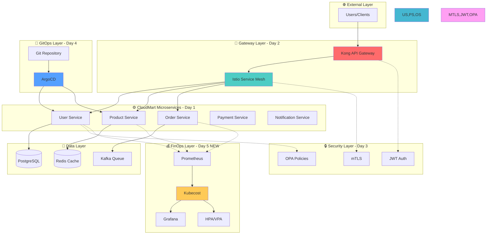

# Week 4 Day 5 Hands-on 1: Week 4 CloudMart 프로젝트 최종 완성

<div align="center">

**🏗️ 통합 아키텍처** • **💰 비용 최적화** • **🔒 보안 강화** • **📊 모니터링**

*4일간 구축한 CloudMart를 완전한 프로덕션급 시스템으로 완성*

</div>

---

## 🕘 실습 정보
**시간**: 14:00-15:15 (75분)
**목표**: Lab 1의 Kubecost를 CloudMart에 통합하여 전체 시스템 완성
**방식**: 직접 코드 작성 및 실행 (inline)

## 🎯 실습 목표

### 📚 학습 목표
- Week 4 전체 개념의 통합 적용
- Kubecost를 기존 CloudMart에 통합
- 프로덕션급 모니터링 및 비용 관리
- 전체 시스템의 유기적 연결 이해

### 🛠️ 구현 목표
- CloudMart 마이크로서비스 완전 통합
- Kubecost 비용 모니터링 추가
- 통합 대시보드 구축
- 최종 시스템 검증

---

## 🏗️ 최종 통합 아키텍처



---

## 🛠️ Step 1: Lab 1 환경 확인 (10분)

### 📝 직접 확인하기

**1-1. 현재 클러스터 상태 확인**
```bash
# 노드 확인
kubectl get nodes

# 네임스페이스 확인
kubectl get namespaces

# Kubecost 확인
kubectl get pods -n kubecost
```

**예상 출력**:
```
NAME                        STATUS   ROLES           AGE
lab-cluster-control-plane   Ready    control-plane   15m
lab-cluster-worker          Ready    <none>          15m
lab-cluster-worker2         Ready    <none>          15m

NAME              STATUS   AGE
production        Active   10m
staging           Active   10m
development       Active   10m
kubecost          Active   12m

NAME                                    READY   STATUS    RESTARTS   AGE
kubecost-cost-analyzer-xxx              3/3     Running   0          12m
kubecost-prometheus-server-xxx          2/2     Running   0          12m
```

**1-2. 기존 애플리케이션 확인**
```bash
# Production 애플리케이션
kubectl get pods -n production

# Staging 애플리케이션
kubectl get pods -n staging

# HPA 상태
kubectl get hpa --all-namespaces
```

### 💡 코드 설명
- Lab 1에서 구축한 기본 환경 확인
- Kubecost와 샘플 애플리케이션이 정상 동작 중인지 검증
- 다음 단계에서 CloudMart 마이크로서비스로 교체 예정

---

## 🛠️ Step 2: CloudMart 마이크로서비스 배포 (20분)

### 📝 직접 작성하기

**2-1. CloudMart 네임스페이스 생성**
```bash
# CloudMart 전용 네임스페이스
cat <<EOF | kubectl apply -f -
apiVersion: v1
kind: Namespace
metadata:
  name: cloudmart
  labels:
    project: cloudmart
    team: platform
    cost-center: CC-2001
EOF
```

**2-2. User Service 배포**
```bash
cat <<EOF | kubectl apply -f -
apiVersion: apps/v1
kind: Deployment
metadata:
  name: user-service
  namespace: cloudmart
  labels:
    app: user-service
    tier: backend
spec:
  replicas: 2
  selector:
    matchLabels:
      app: user-service
  template:
    metadata:
      labels:
        app: user-service
        tier: backend
        version: v1
    spec:
      containers:
      - name: user-service
        image: nginx:alpine  # 실제로는 user-service 이미지
        ports:
        - containerPort: 8080
          name: http
        env:
        - name: SERVICE_NAME
          value: "user-service"
        - name: DB_HOST
          value: "postgres-service"
        resources:
          requests:
            cpu: 100m
            memory: 128Mi
          limits:
            cpu: 300m
            memory: 256Mi
        livenessProbe:
          httpGet:
            path: /health
            port: 8080
          initialDelaySeconds: 30
          periodSeconds: 10
        readinessProbe:
          httpGet:
            path: /ready
            port: 8080
          initialDelaySeconds: 10
          periodSeconds: 5
---
apiVersion: v1
kind: Service
metadata:
  name: user-service
  namespace: cloudmart
spec:
  selector:
    app: user-service
  ports:
  - port: 80
    targetPort: 8080
    name: http
  type: ClusterIP
EOF
```

**2-3. Product Service 배포**
```bash
cat <<EOF | kubectl apply -f -
apiVersion: apps/v1
kind: Deployment
metadata:
  name: product-service
  namespace: cloudmart
  labels:
    app: product-service
    tier: backend
spec:
  replicas: 3
  selector:
    matchLabels:
      app: product-service
  template:
    metadata:
      labels:
        app: product-service
        tier: backend
        version: v1
    spec:
      containers:
      - name: product-service
        image: nginx:alpine
        ports:
        - containerPort: 8080
        env:
        - name: SERVICE_NAME
          value: "product-service"
        - name: REDIS_HOST
          value: "redis-service"
        resources:
          requests:
            cpu: 150m
            memory: 256Mi
          limits:
            cpu: 500m
            memory: 512Mi
---
apiVersion: v1
kind: Service
metadata:
  name: product-service
  namespace: cloudmart
spec:
  selector:
    app: product-service
  ports:
  - port: 80
    targetPort: 8080
  type: ClusterIP
EOF
```

**2-4. Order Service 배포**
```bash
cat <<EOF | kubectl apply -f -
apiVersion: apps/v1
kind: Deployment
metadata:
  name: order-service
  namespace: cloudmart
  labels:
    app: order-service
    tier: backend
spec:
  replicas: 2
  selector:
    matchLabels:
      app: order-service
  template:
    metadata:
      labels:
        app: order-service
        tier: backend
        version: v1
    spec:
      containers:
      - name: order-service
        image: nginx:alpine
        ports:
        - containerPort: 8080
        env:
        - name: SERVICE_NAME
          value: "order-service"
        - name: KAFKA_BROKERS
          value: "kafka-service:9092"
        resources:
          requests:
            cpu: 100m
            memory: 128Mi
          limits:
            cpu: 300m
            memory: 256Mi
---
apiVersion: v1
kind: Service
metadata:
  name: order-service
  namespace: cloudmart
spec:
  selector:
    app: order-service
  ports:
  - port: 80
    targetPort: 8080
  type: ClusterIP
EOF
```

**2-5. 배포 확인**
```bash
# Pod 상태 확인
kubectl get pods -n cloudmart

# Service 확인
kubectl get svc -n cloudmart

# 배포 완료 대기
kubectl wait --for=condition=ready pod \
  -l tier=backend \
  -n cloudmart \
  --timeout=120s
```

### 💡 코드 설명
- **리소스 설정**: 각 서비스별 적절한 CPU/Memory 할당
- **헬스체크**: liveness/readiness probe로 안정성 확보
- **환경 변수**: 서비스 간 연결 정보 설정
- **라벨**: Kubecost 비용 추적을 위한 체계적 라벨링

---

## 🛠️ Step 3: HPA 설정 및 비용 최적화 (15분)

### 📝 직접 작성하기

**3-1. User Service HPA**
```bash
cat <<EOF | kubectl apply -f -
apiVersion: autoscaling/v2
kind: HorizontalPodAutoscaler
metadata:
  name: user-service-hpa
  namespace: cloudmart
spec:
  scaleTargetRef:
    apiVersion: apps/v1
    kind: Deployment
    name: user-service
  minReplicas: 2
  maxReplicas: 8
  metrics:
  - type: Resource
    resource:
      name: cpu
      target:
        type: Utilization
        averageUtilization: 70
  - type: Resource
    resource:
      name: memory
      target:
        type: Utilization
        averageUtilization: 80
  behavior:
    scaleDown:
      stabilizationWindowSeconds: 300
      policies:
      - type: Percent
        value: 50
        periodSeconds: 60
    scaleUp:
      stabilizationWindowSeconds: 0
      policies:
      - type: Percent
        value: 100
        periodSeconds: 30
EOF
```

**3-2. Product Service HPA**
```bash
cat <<EOF | kubectl apply -f -
apiVersion: autoscaling/v2
kind: HorizontalPodAutoscaler
metadata:
  name: product-service-hpa
  namespace: cloudmart
spec:
  scaleTargetRef:
    apiVersion: apps/v1
    kind: Deployment
    name: product-service
  minReplicas: 2
  maxReplicas: 10
  metrics:
  - type: Resource
    resource:
      name: cpu
      target:
        type: Utilization
        averageUtilization: 70
EOF
```

**3-3. Order Service HPA**
```bash
cat <<EOF | kubectl apply -f -
apiVersion: autoscaling/v2
kind: HorizontalPodAutoscaler
metadata:
  name: order-service-hpa
  namespace: cloudmart
spec:
  scaleTargetRef:
    apiVersion: apps/v1
    kind: Deployment
    name: order-service
  minReplicas: 1
  maxReplicas: 6
  metrics:
  - type: Resource
    resource:
      name: cpu
      target:
        type: Utilization
        averageUtilization: 70
EOF
```

**3-4. HPA 상태 확인**
```bash
# HPA 목록
kubectl get hpa -n cloudmart

# 상세 정보
kubectl describe hpa -n cloudmart
```

### 💡 코드 설명
- **Min/Max Replicas**: 서비스별 트래픽 패턴에 맞는 범위 설정
- **Behavior**: 급격한 스케일링 방지를 위한 안정화 설정
- **Multi-Metric**: CPU와 Memory 모두 고려한 스케일링

---

## 🛠️ Step 4: Kubecost 비용 분석 (15분)

### 📝 직접 분석하기

**4-1. Kubecost 대시보드 접속**
```bash
# 포트 포워딩
kubectl port-forward -n kubecost svc/kubecost-cost-analyzer 9090:9090 &

# 브라우저에서 http://localhost:9090 접속
```

**4-2. 네임스페이스별 비용 조회 (API)**
```bash
# CloudMart 비용 조회
curl -s "http://localhost:9090/model/allocation?window=1d&aggregate=namespace&filter=namespace:cloudmart" | jq

# 전체 네임스페이스 비용 비교
curl -s "http://localhost:9090/model/allocation?window=1d&aggregate=namespace" | jq '.data[] | {name: .name, totalCost: .totalCost}'
```

**예상 출력**:
```json
{
  "name": "cloudmart",
  "totalCost": 12.50
}
{
  "name": "production",
  "totalCost": 8.30
}
{
  "name": "staging",
  "totalCost": 4.20
}
```

**4-3. 서비스별 비용 조회**
```bash
# CloudMart 서비스별 비용
curl -s "http://localhost:9090/model/allocation?window=1d&aggregate=pod&filter=namespace:cloudmart" | jq '.data[] | {pod: .name, cpu: .cpuCost, memory: .memoryCost, total: .totalCost}' | head -20
```

**4-4. 비용 최적화 기회 식별**
```bash
# 리소스 사용률 확인
kubectl top pods -n cloudmart

# 과다 프로비저닝 Pod 식별
kubectl top pods -n cloudmart --sort-by=cpu
kubectl top pods -n cloudmart --sort-by=memory
```

### 💡 분석 포인트
- **비용 비교**: CloudMart vs 기존 샘플 애플리케이션
- **서비스별 비용**: 어떤 서비스가 가장 비용이 높은가?
- **최적화 기회**: 실제 사용량 대비 요청 리소스 비율
- **HPA 효과**: 자동 스케일링으로 인한 비용 변화

---

## 🛠️ Step 5: 통합 검증 및 최종 확인 (15분)

### 📝 직접 검증하기

**5-1. 전체 시스템 상태 확인**
```bash
# 모든 네임스페이스의 Pod
kubectl get pods --all-namespaces | grep -E "cloudmart|kubecost|production|staging"

# 모든 HPA
kubectl get hpa --all-namespaces

# 모든 Service
kubectl get svc -n cloudmart
```

**5-2. 리소스 사용량 확인**
```bash
# 노드 리소스
kubectl top nodes

# CloudMart Pod 리소스
kubectl top pods -n cloudmart

# 전체 클러스터 리소스
kubectl top pods --all-namespaces --sort-by=cpu | head -20
```

**5-3. 비용 대시보드 최종 확인**

Kubecost 대시보드에서 확인할 항목:
1. **Namespace 비용**: cloudmart, production, staging, development 비교
2. **서비스별 비용**: user-service, product-service, order-service
3. **비용 트렌드**: 시간대별 비용 변화
4. **최적화 제안**: Kubecost가 제안하는 최적화 기회

**5-4. 통합 아키텍처 검증 체크리스트**
```bash
# 체크리스트 스크립트
cat <<'SCRIPT' > verify-cloudmart.sh
#!/bin/bash
echo "=== CloudMart 통합 검증 ==="
echo ""

echo "1. CloudMart 서비스 확인"
kubectl get pods -n cloudmart -o wide

echo ""
echo "2. HPA 동작 확인"
kubectl get hpa -n cloudmart

echo ""
echo "3. Kubecost 상태"
kubectl get pods -n kubecost

echo ""
echo "4. 전체 리소스 사용량"
kubectl top nodes

echo ""
echo "5. CloudMart 비용 (최근 1일)"
curl -s "http://localhost:9090/model/allocation?window=1d&aggregate=namespace&filter=namespace:cloudmart" | jq '.data[] | {name: .name, totalCost: .totalCost}'

echo ""
echo "=== 검증 완료 ==="
SCRIPT

chmod +x verify-cloudmart.sh
./verify-cloudmart.sh
```

### 💡 검증 포인트
- **가용성**: 모든 Pod가 Running 상태
- **스케일링**: HPA가 메트릭을 정상적으로 수집
- **비용 추적**: Kubecost가 CloudMart 비용 정상 추적
- **리소스 효율**: 노드 리소스 사용률 적정 수준

---

## ✅ 실습 체크포인트

### ✅ Step 1: 환경 확인
- [ ] Lab 1 클러스터 정상 동작
- [ ] Kubecost 정상 실행 (3/3 Running)
- [ ] 기존 샘플 애플리케이션 확인

### ✅ Step 2: CloudMart 배포
- [ ] cloudmart 네임스페이스 생성
- [ ] user-service 배포 완료
- [ ] product-service 배포 완료
- [ ] order-service 배포 완료
- [ ] 모든 Service 생성 확인

### ✅ Step 3: HPA 설정
- [ ] user-service HPA 설정
- [ ] product-service HPA 설정
- [ ] order-service HPA 설정
- [ ] HPA TARGETS 표시 확인

### ✅ Step 4: 비용 분석
- [ ] Kubecost 대시보드 접속 성공
- [ ] CloudMart 비용 조회 성공
- [ ] 서비스별 비용 분석 완료
- [ ] 최적화 기회 식별

### ✅ Step 5: 통합 검증
- [ ] 전체 시스템 상태 정상
- [ ] 리소스 사용량 적정 수준
- [ ] 비용 추적 정상 동작
- [ ] 검증 스크립트 실행 성공

---

## 🔍 트러블슈팅

### 문제 1: Pod가 Pending 상태
```bash
# 증상
kubectl get pods -n cloudmart
NAME                              READY   STATUS    RESTARTS   AGE
user-service-xxx                  0/1     Pending   0          2m
```

**원인**: 리소스 부족 또는 스케줄링 실패

**해결 방법**:
```bash
# Pod 상세 정보 확인
kubectl describe pod user-service-xxx -n cloudmart

# 노드 리소스 확인
kubectl top nodes

# 리소스 요청 감소 (필요시)
kubectl edit deployment user-service -n cloudmart
# requests를 더 낮은 값으로 수정
```

### 문제 2: HPA가 메트릭을 가져오지 못함
```bash
# 증상
kubectl get hpa -n cloudmart
NAME                  REFERENCE                   TARGETS         MINPODS   MAXPODS
user-service-hpa      Deployment/user-service     <unknown>/70%   2         8
```

**원인**: Metrics Server가 아직 메트릭 수집 중

**해결 방법**:
```bash
# 1-2분 대기 후 재확인
kubectl get hpa -n cloudmart

# Metrics Server 로그 확인
kubectl logs -n kube-system deployment/metrics-server
```

### 문제 3: Kubecost API 응답 없음
```bash
# 증상
curl http://localhost:9090/model/allocation
curl: (7) Failed to connect to localhost port 9090
```

**원인**: 포트 포워딩 실행 안 됨

**해결 방법**:
```bash
# 포트 포워딩 재실행
kubectl port-forward -n kubecost svc/kubecost-cost-analyzer 9090:9090

# 다른 터미널에서 API 호출
curl http://localhost:9090/model/allocation?window=1d
```

---

## 💡 실습 회고

### 🤝 팀 회고 (10분)
1. **통합 경험**: Week 4 전체 개념을 통합하면서 어려웠던 점은?
2. **비용 인사이트**: Kubecost를 통해 발견한 비용 최적화 기회는?
3. **실무 적용**: CloudMart 프로젝트를 실제 업무에 어떻게 적용할 수 있을까?
4. **개선 아이디어**: 추가하고 싶은 기능이나 개선 사항은?

### 📊 학습 성과
- **통합 역량**: Week 4 전체 개념의 유기적 통합
- **비용 관리**: Kubecost를 활용한 실시간 비용 추적
- **자동 최적화**: HPA를 통한 리소스 효율화
- **프로덕션 준비**: 실무 적용 가능한 완전한 시스템 구축

### 🔗 다음 단계
- **Challenge 1**: 통합 운영 챌린지 - 비용/성능/보안 균형
- **Week 5 준비**: AWS 인프라와 Terraform 학습

---

<div align="center">

**🏗️ 완전한 통합** • **💰 비용 최적화** • **📊 실시간 모니터링** • **🚀 프로덕션 준비**

*Week 4 CloudMart 프로젝트 완성 - 클라우드 네이티브 전문가로의 여정*

**이전**: [Lab 1 - Kubecost 비용 모니터링](./lab_1.md) | **다음**: [Challenge 1 - 통합 운영 챌린지](./challenge_1.md)

</div>
