# Week 4 Day 5 Hands-on 1: CloudMart 비용 최적화

<div align="center">

**💰 비용 분석** • **⚙️ 리소스 최적화** • **📊 대시보드 커스터마이징**

*Lab 1의 Kubecost를 활용한 CloudMart 비용 최적화*

</div>

---

## 🕘 실습 정보
**시간**: 14:00-14:50 (50분)
**목표**: Lab 1의 Kubecost를 활용하여 CloudMart 비용 분석 및 최적화
**방식**: 직접 코드 작성 및 실행 (inline)

## 🎯 실습 목표

### 📚 학습 목표
- Kubecost를 활용한 실제 프로젝트 비용 분석
- 비용 효율성 개선을 위한 리소스 최적화
- 커스텀 비용 알림 설정
- 실무 비용 관리 프로세스 이해

### 🛠️ 구현 목표
- CloudMart 마이크로서비스 배포
- 서비스별 비용 분석
- Over-provisioned 리소스 최적화
- 비용 알림 설정

---

## 🏗️ 전체 아키텍처 (Week 4 통합)

```mermaid
graph TB
    subgraph "External Access"
        CLIENT[Client<br/>사용자]
    end
    
    subgraph "API Gateway Layer (Day 2)"
        KONG[Kong API Gateway<br/>외부 진입점]
    end
    
    subgraph "Service Mesh Layer (Day 2)"
        ISTIO[Istio Control Plane<br/>트래픽 관리]
        ENVOY[Envoy Sidecars<br/>프록시]
    end
    
    subgraph "Security Layer (Day 3)"
        JWT[JWT 인증<br/>토큰 검증]
        MTLS[mTLS<br/>암호화 통신]
        OPA[OPA Gatekeeper<br/>정책 엔진]
    end
    
    subgraph "CloudMart Microservices"
        US[User Service<br/>회원 관리<br/>2 replicas]
        PS[Product Service<br/>상품 관리<br/>3 replicas]
        OS[Order Service<br/>주문 처리<br/>2 replicas]
        PAYS[Payment Service<br/>결제 처리]
        NS[Notification Service<br/>알림 발송]
    end
    
    subgraph "GitOps Layer (Day 4)"
        GIT[Git Repository<br/>단일 진실 소스]
        ARGO[ArgoCD<br/>자동 배포]
    end
    
    subgraph "Cost Monitoring Stack (Day 5 Lab 1)"
        MS[Metrics Server<br/>리소스 메트릭]
        PROM[Prometheus<br/>메트릭 수집]
        KC[Kubecost<br/>비용 계산 엔진]
        DASH[Kubecost Dashboard<br/>http://localhost:30080]
    end
    
    subgraph "Optimization (Day 5 Hands-on 1)"
        HPA1[User Service HPA<br/>CPU 기반]
        HPA2[Product Service HPA<br/>Memory 기반]
        HPA3[Order Service HPA<br/>CPU+Memory]
        ALERT[비용 알림<br/>Slack/Email]
    end
    
    subgraph "Database Layer"
        DB[(PostgreSQL<br/>주문/회원 DB)]
        CACHE[(Redis<br/>캐시)]
    end
    
    CLIENT --> KONG
    KONG --> JWT
    JWT --> ISTIO
    ISTIO --> ENVOY
    ENVOY --> MTLS
    MTLS --> OPA
    
    OPA --> US
    OPA --> PS
    OPA --> OS
    
    GIT --> ARGO
    ARGO -.배포.-> US
    ARGO -.배포.-> PS
    ARGO -.배포.-> OS
    ARGO -.배포.-> PAYS
    ARGO -.배포.-> NS
    
    US --> MS
    PS --> MS
    OS --> MS
    
    MS --> PROM
    PROM --> KC
    KC --> DASH
    
    KC -.비용 분석.-> HPA1
    KC -.비용 분석.-> HPA2
    KC -.비용 분석.-> HPA3
    KC -.임계값 초과.-> ALERT
    
    HPA1 -.스케일링.-> US
    HPA2 -.스케일링.-> PS
    HPA3 -.스케일링.-> OS
    
    US --> DB
    OS --> DB
    PS --> CACHE
    
    OS --> PAYS
    PAYS --> NS
    
    style KONG fill:#f0f0f0
    style ISTIO fill:#f0f0f0
    style ENVOY fill:#f0f0f0
    
    style JWT fill:#f0f0f0
    style MTLS fill:#f0f0f0
    style OPA fill:#f0f0f0
    
    style GIT fill:#f0f0f0
    style ARGO fill:#f0f0f0
    
    style MS fill:#e3f2fd
    style PROM fill:#e3f2fd
    style KC fill:#e3f2fd
    style DASH fill:#e3f2fd
    
    style US fill:#fff
    style PS fill:#fff
    style OS fill:#fff
    style PAYS fill:#fff
    style NS fill:#fff
    
    style HPA1 fill:#fff9c4
    style HPA2 fill:#fff9c4
    style HPA3 fill:#fff9c4
    style ALERT fill:#fff9c4
    
    style DB fill:#f0f0f0
    style CACHE fill:#f0f0f0
```



**범례**:
- ⚫ **회색 (Day 2-4 구축 완료)**: Kong, Istio, JWT/mTLS/OPA, GitOps
- 🔵 **연파랑 (Day 5 Lab 1 구현)**: Metrics Server, Prometheus, Kubecost 모니터링 스택
- ⚪ **흰색 (Hands-on 1 배포)**: CloudMart 마이크로서비스들
- 🟡 **노란색 (Hands-on 1 구현)**: HPA 자동 스케일링 및 비용 알림

---

### 📅 Week 4 통합 스토리

**Day 1: 마이크로서비스 아키텍처 (기초 공사)**
- 🏠 비유: 쇼핑몰의 각 부서 만들기 (회원팀, 상품팀, 주문팀)
- 역할: CloudMart의 핵심 서비스들을 독립적으로 구축
- 결과: User, Product, Order, Payment, Notification 서비스

**Day 2: API Gateway & Service Mesh (출입구와 내부 통로)**
- 🏠 비유: 쇼핑몰 정문(API Gateway)과 부서 간 복도(Service Mesh)
- 역할: 외부 요청 관리(Kong)와 내부 서비스 간 통신(Istio)
- 결과: 통합된 API 엔드포인트와 서비스 간 안전한 통신

**Day 3: 보안과 컴플라이언스 (보안 시스템)**
- 🏠 비유: 출입증(JWT), CCTV(mTLS), 보안 규칙(OPA)
- 역할: 인증/인가, 암호화 통신, 정책 기반 접근 제어
- 결과: 프로덕션급 보안 체계 구축

**Day 4: GitOps와 배포 자동화 (자동 관리 시스템)**
- 🏠 비유: 쇼핑몰 운영 매뉴얼(Git)과 자동 관리 시스템(ArgoCD)
- 역할: 코드 기반 인프라 관리와 자동 배포
- 결과: 안전하고 추적 가능한 배포 프로세스

**Day 5: FinOps와 비용 최적화 (가계부와 절약 시스템) ⭐ 오늘**
- 🏠 비유: 쇼핑몰 운영비 관리와 자동 절약 시스템
- 역할: 실시간 비용 모니터링(Kubecost)과 자동 리소스 최적화(HPA)
- 결과: 비용 가시성 확보 + 30% 비용 절감

### 🎯 Hands-on 1의 목표

**Lab 1과의 차이점**:
- **Lab 1**: 기본 Kubecost 설치 및 샘플 앱 비용 추적
- **Hands-on 1**: 실제 CloudMart 프로젝트의 비용 분석 및 최적화

**왜 CloudMart인가?**:
- Week 4 전체를 통합한 실제 프로젝트
- 실무와 유사한 마이크로서비스 구조
- 서비스별 비용 특성이 다름 (최적화 연습에 적합)
- 🏠 비유: 연습용 모형이 아닌 실제 운영 쇼핑몰

---

## 🛠️ Step 0: 환경 초기화 및 모니터링 스택 설치 (5분)

### 목표
- 기존 lab-cluster 삭제 및 새 클러스터 생성
- Helm 기반 모니터링 스택 설치 (Metrics Server, Prometheus, Grafana, Jaeger)
- Kubecost 설치 및 설정

### 📝 직접 실행하기

**0-1. 클러스터 초기화 및 모니터링 스택 설치**

Lab 1에서 사용한 스크립트를 재사용합니다:

```bash
# Lab 1 스크립트 디렉토리로 이동
cd theory/week_04/day5/lab_scripts/lab1

# Step 1: 클러스터 초기화
./step1-setup-cluster.sh

# Step 2: Metrics Server 설치
./step2-install-metrics-server.sh

# Step 3: Kubecost 설치 (Prometheus 포함)
./step3-install-kubecost.sh
```

**0-2. 설치 확인**

```bash
# 모든 Pod 상태 확인
kubectl get pods -n kube-system
kubectl get pods -n kubecost

# Kubecost 서비스 확인
kubectl get svc -n kubecost

# Kubecost 대시보드 접속
echo "Kubecost Dashboard: http://localhost:30080"
```

### 📊 예상 결과

```bash
# kube-system namespace
NAME                                    READY   STATUS    RESTARTS   AGE
metrics-server-xxx                      1/1     Running   0          2m

# kubecost namespace
NAME                                    READY   STATUS    RESTARTS   AGE
kubecost-cost-analyzer-xxx              2/2     Running   0          3m
kubecost-prometheus-server-xxx          2/2     Running   0          3m
kubecost-kube-state-metrics-xxx         1/1     Running   0          3m

# Kubecost 서비스
NAME                      TYPE        CLUSTER-IP      EXTERNAL-IP   PORT(S)
kubecost-cost-analyzer    NodePort    10.96.xxx.xxx   <none>        9090:30080/TCP
```

### ✅ 검증

```bash
# Kubecost 대시보드 접속 테스트
curl -s http://localhost:30080 | grep -q "Kubecost" && echo "✅ Kubecost 정상" || echo "❌ Kubecost 오류"

# Prometheus 메트릭 확인
kubectl port-forward -n kubecost svc/kubecost-prometheus-server 9090:80 &
sleep 3
curl -s http://localhost:9090/api/v1/query?query=up | grep -q "success" && echo "✅ Prometheus 정상" || echo "❌ Prometheus 오류"
pkill -f "port-forward.*9090"
```

### 💡 설명

**왜 Lab 1 스크립트를 재사용하나요?**
- Hands-on 1은 Lab 1의 환경을 기반으로 확장하는 실습입니다
- 동일한 모니터링 스택이 필요하므로 스크립트를 재사용합니다
- 클러스터를 새로 만들어 깨끗한 환경에서 시작합니다

**설치되는 컴포넌트**:
- **Metrics Server**: CPU/Memory 메트릭 수집
- **Prometheus**: 시계열 메트릭 저장소
- **Kubecost**: 비용 계산 및 분석 엔진
- **Kube State Metrics**: Kubernetes 리소스 상태 메트릭

---

## 🛠️ Step 1: CloudMart 마이크로서비스 배포 (15분)

### 📝 직접 작성하기

**1-1. CloudMart 네임스페이스 생성**
```bash
cat <<EOF | kubectl apply -f -
apiVersion: v1
kind: Namespace
metadata:
  name: cloudmart
  labels:
    project: cloudmart
    team: platform
    cost-center: CC-2001
EOF
```

**1-2. User Service 배포**
```bash
cat <<EOF | kubectl apply -f -
apiVersion: apps/v1
kind: Deployment
metadata:
  name: user-service
  namespace: cloudmart
spec:
  replicas: 2
  selector:
    matchLabels:
      app: user-service
  template:
    metadata:
      labels:
        app: user-service
        tier: backend
    spec:
      containers:
      - name: nginx
        image: nginx:alpine
        ports:
        - containerPort: 80
        resources:
          requests:
            cpu: 100m
            memory: 128Mi
          limits:
            cpu: 300m
            memory: 256Mi
---
apiVersion: v1
kind: Service
metadata:
  name: user-service
  namespace: cloudmart
spec:
  selector:
    app: user-service
  ports:
  - port: 80
    targetPort: 80
EOF
```

**1-3. Product Service 배포**
```bash
cat <<EOF | kubectl apply -f -
apiVersion: apps/v1
kind: Deployment
metadata:
  name: product-service
  namespace: cloudmart
spec:
  replicas: 3
  selector:
    matchLabels:
      app: product-service
  template:
    metadata:
      labels:
        app: product-service
        tier: backend
    spec:
      containers:
      - name: nginx
        image: nginx:alpine
        ports:
        - containerPort: 80
        resources:
          requests:
            cpu: 150m
            memory: 256Mi
          limits:
            cpu: 500m
            memory: 512Mi
---
apiVersion: v1
kind: Service
metadata:
  name: product-service
  namespace: cloudmart
spec:
  selector:
    app: product-service
  ports:
  - port: 80
    targetPort: 80
EOF
```

**1-4. Order Service 배포**
```bash
cat <<EOF | kubectl apply -f -
apiVersion: apps/v1
kind: Deployment
metadata:
  name: order-service
  namespace: cloudmart
spec:
  replicas: 2
  selector:
    matchLabels:
      app: order-service
  template:
    metadata:
      labels:
        app: order-service
        tier: backend
    spec:
      containers:
      - name: nginx
        image: nginx:alpine
        ports:
        - containerPort: 80
        resources:
          requests:
            cpu: 100m
            memory: 128Mi
          limits:
            cpu: 300m
            memory: 256Mi
---
apiVersion: v1
kind: Service
metadata:
  name: order-service
  namespace: cloudmart
spec:
  selector:
    app: order-service
  ports:
  - port: 80
    targetPort: 80
EOF
```

**1-5. 배포 확인**
```bash
kubectl get pods -n cloudmart
kubectl wait --for=condition=ready pod -l tier=backend -n cloudmart --timeout=120s
```

### 📊 예상 결과
```
NAME                              READY   STATUS    RESTARTS   AGE
user-service-xxx                  1/1     Running   0          1m
user-service-yyy                  1/1     Running   0          1m
product-service-xxx               1/1     Running   0          1m
product-service-yyy               1/1     Running   0          1m
product-service-zzz               1/1     Running   0          1m
order-service-xxx                 1/1     Running   0          1m
order-service-yyy                 1/1     Running   0          1m
```

### 💡 코드 설명
- **네임스페이스 라벨**: Kubecost가 프로젝트별 비용 추적
- **리소스 설정**: requests는 비용 계산 기준, limits는 최대 사용량
- **replicas**: 서비스별 트래픽 패턴에 맞는 Pod 개수

---

## 🛠️ Step 2: Kubecost 비용 분석 (15분)

### 📝 직접 분석하기

**2-1. Kubecost 대시보드 접속**
```bash
# 브라우저에서 http://localhost:30080 접속
echo "Kubecost URL: http://localhost:30080"
```

**2-2. CloudMart 비용 확인**
1. Kubecost 대시보드 → **Allocations** 메뉴
2. **Aggregate By** → `namespace` 선택
3. `cloudmart` 네임스페이스 비용 확인

**2-3. 서비스별 비용 분석**
1. **Aggregate By** → `deployment` 선택
2. **Filter** → `namespace: cloudmart`
3. 각 서비스별 비용 비교:
   - user-service
   - product-service
   - order-service

**2-4. 비용 효율성 확인**
1. **Savings** 메뉴 선택
2. **Right-sizing recommendations** 확인
3. Over-provisioned Pod 식별

### 📊 예상 분석 결과

**네임스페이스별 비용** (최근 7일):
```
cloudmart:     $15.50 (CPU: $10.20, Memory: $5.30)
production:    $23.70 (CPU: $15.50, Memory: $8.20)
staging:       $11.90 (CPU: $7.80, Memory: $4.10)
development:   $4.00 (CPU: $2.60, Memory: $1.40)
```

**서비스별 비용**:
```
product-service: $7.80 (3 replicas, 높은 리소스)
user-service:    $4.40 (2 replicas, 중간 리소스)
order-service:   $3.30 (2 replicas, 낮은 리소스)
```

**최적화 기회**:
- product-service: CPU 요청 150m → 실제 사용 80m (47% 낭비)
- user-service: Memory 요청 128Mi → 실제 사용 90Mi (30% 낭비)

### 💡 분석 포인트
- **비용 비율**: CloudMart가 전체 비용의 약 28% 차지
- **서비스 비교**: Product Service가 가장 비용이 높음 (트래픽 많음)
- **최적화 여지**: CPU/Memory 요청을 실제 사용량에 맞게 조정 가능

---

## 🛠️ Step 3: 리소스 최적화 (10분)

### 📝 직접 최적화하기

**3-1. Product Service 리소스 최적화**
```bash
# 현재 설정 확인
kubectl get deployment product-service -n cloudmart -o yaml | grep -A 4 resources

# 최적화된 리소스로 업데이트
kubectl patch deployment product-service -n cloudmart --type='json' -p='[
  {
    "op": "replace",
    "path": "/spec/template/spec/containers/0/resources/requests/cpu",
    "value": "100m"
  },
  {
    "op": "replace",
    "path": "/spec/template/spec/containers/0/resources/requests/memory",
    "value": "192Mi"
  }
]'
```

**3-2. User Service 리소스 최적화**
```bash
kubectl patch deployment user-service -n cloudmart --type='json' -p='[
  {
    "op": "replace",
    "path": "/spec/template/spec/containers/0/resources/requests/cpu",
    "value": "75m"
  },
  {
    "op": "replace",
    "path": "/spec/template/spec/containers/0/resources/requests/memory",
    "value": "96Mi"
  }
]'
```

**3-3. 최적화 결과 확인**
```bash
# Pod 재시작 확인
kubectl get pods -n cloudmart -w

# 리소스 사용량 확인
kubectl top pods -n cloudmart
```

### 📊 예상 절감 효과
```
최적화 전:
- product-service: CPU 150m × 3 = 450m
- user-service: CPU 100m × 2 = 200m
- 합계: 650m

최적화 후:
- product-service: CPU 100m × 3 = 300m
- user-service: CPU 75m × 2 = 150m
- 합계: 450m

절감: 200m (약 31% 비용 절감)
```

### 💡 최적화 전략
- **Right-sizing**: 실제 사용량 + 20% 버퍼로 설정
- **점진적 조정**: 한 번에 크게 줄이지 말고 단계적으로
- **모니터링**: 최적화 후 성능 저하 없는지 확인

---

## 🛠️ Step 4: HPA 설정 및 검증 (10분)

### 📝 직접 설정하기

**4-1. Product Service HPA**
```bash
cat <<EOF | kubectl apply -f -
apiVersion: autoscaling/v2
kind: HorizontalPodAutoscaler
metadata:
  name: product-service-hpa
  namespace: cloudmart
spec:
  scaleTargetRef:
    apiVersion: apps/v1
    kind: Deployment
    name: product-service
  minReplicas: 2
  maxReplicas: 8
  metrics:
  - type: Resource
    resource:
      name: cpu
      target:
        type: Utilization
        averageUtilization: 70
EOF
```

**4-2. User Service HPA**
```bash
cat <<EOF | kubectl apply -f -
apiVersion: autoscaling/v2
kind: HorizontalPodAutoscaler
metadata:
  name: user-service-hpa
  namespace: cloudmart
spec:
  scaleTargetRef:
    apiVersion: apps/v1
    kind: Deployment
    name: user-service
  minReplicas: 2
  maxReplicas: 6
  metrics:
  - type: Resource
    resource:
      name: cpu
      target:
        type: Utilization
        averageUtilization: 70
EOF
```

**4-3. HPA 상태 확인**
```bash
kubectl get hpa -n cloudmart
kubectl describe hpa product-service-hpa -n cloudmart
```

### 📊 예상 결과
```
NAME                    REFERENCE                   TARGETS   MINPODS   MAXPODS   REPLICAS
product-service-hpa     Deployment/product-service  15%/70%   2         8         3
user-service-hpa        Deployment/user-service     12%/70%   2         6         2
```

### 💡 HPA 효과
- **비용 절감**: 트래픽 낮을 때 자동으로 Pod 감소
- **성능 보장**: 트래픽 높을 때 자동으로 Pod 증가
- **운영 자동화**: 수동 스케일링 불필요

---

## ✅ 실습 체크포인트

### ✅ Step 1: CloudMart 배포
- [ ] cloudmart 네임스페이스 생성
- [ ] user-service 배포 완료
- [ ] product-service 배포 완료
- [ ] order-service 배포 완료
- [ ] 모든 Pod Running 상태

### ✅ Step 2: 비용 분석
- [ ] Kubecost 대시보드 접속
- [ ] CloudMart 비용 확인
- [ ] 서비스별 비용 비교
- [ ] 최적화 기회 식별

### ✅ Step 3: 리소스 최적화
- [ ] Product Service 리소스 조정
- [ ] User Service 리소스 조정
- [ ] 최적화 효과 확인

### ✅ Step 4: HPA 설정
- [ ] Product Service HPA 설정
- [ ] User Service HPA 설정
- [ ] HPA 동작 확인

---

## 🔍 트러블슈팅

### 문제 1: Kubecost에서 CloudMart 비용이 안 보임
**원인**: 메트릭 수집 시간 필요

**해결 방법**:
```bash
# 5-10분 대기 후 재확인
# Prometheus가 메트릭을 수집하는 시간 필요
```

### 문제 2: HPA가 메트릭을 가져오지 못함
**원인**: Metrics Server 미설치 또는 메트릭 수집 중

**해결 방법**:
```bash
# Metrics Server 확인
kubectl get deployment metrics-server -n kube-system

# 1-2분 대기 후 재확인
kubectl get hpa -n cloudmart
```

---

## 🧹 실습 정리

```bash
# CloudMart 리소스 삭제
kubectl delete namespace cloudmart

# 또는 전체 클러스터 삭제
kind delete cluster --name lab-cluster
```

---

## 💡 실습 회고

### 🤝 페어 회고 (5분)
1. **비용 인사이트**: Kubecost를 통해 발견한 가장 큰 비용 낭비는?
2. **최적화 경험**: 리소스 최적화 과정에서 어려웠던 점은?
3. **실무 적용**: 실제 프로젝트에 어떻게 적용할 수 있을까?

### 📊 학습 성과
- **비용 분석**: Kubecost를 활용한 실제 프로젝트 비용 분석
- **리소스 최적화**: Right-sizing을 통한 30% 비용 절감
- **자동화**: HPA를 통한 자동 스케일링 구현
- **실무 역량**: 프로덕션급 비용 관리 프로세스 이해

### 🔗 다음 단계
- **Challenge 1**: 비용/성능/보안 균형 챌린지
- **Week 5**: AWS 인프라와 Terraform

---

<div align="center">

**💰 비용 가시성** • **⚙️ 자동 최적화** • **📊 실시간 분석**

*Kubecost로 시작하는 실전 FinOps*

**이전**: [Lab 1 - Kubecost 비용 모니터링](./lab_1.md) | **다음**: [Challenge 1 - 통합 운영 챌린지](./challenge_1.md)

</div>
