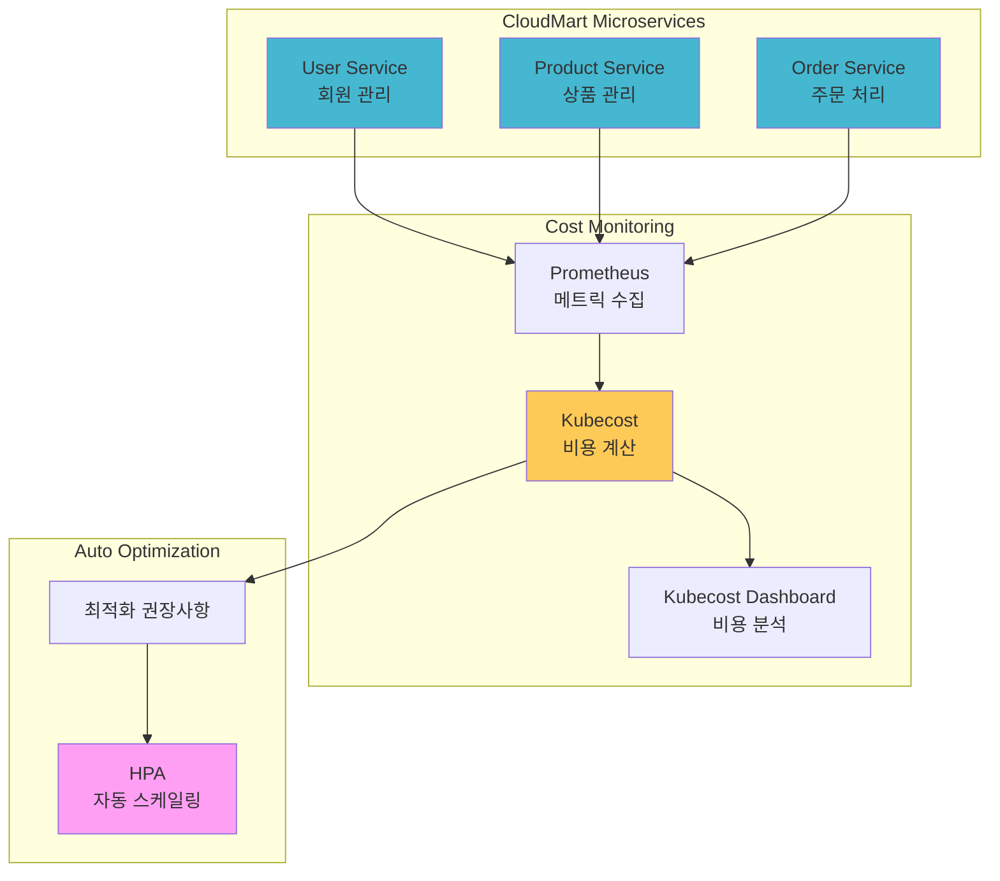

# Week 4 Day 5 Hands-on 1: CloudMart 비용 최적화

<div align="center">

**💰 비용 분석** • **⚙️ 리소스 최적화** • **📊 대시보드 커스터마이징**

*Lab 1의 Kubecost를 활용한 CloudMart 비용 최적화*

</div>

---

## 🕘 실습 정보
**시간**: 14:00-14:50 (50분)
**목표**: Lab 1의 Kubecost를 활용하여 CloudMart 비용 분석 및 최적화
**방식**: 직접 코드 작성 및 실행 (inline)

## 🎯 실습 목표

### 📚 학습 목표
- Kubecost를 활용한 실제 프로젝트 비용 분석
- 비용 효율성 개선을 위한 리소스 최적화
- 커스텀 비용 알림 설정
- 실무 비용 관리 프로세스 이해

### 🛠️ 구현 목표
- CloudMart 마이크로서비스 배포
- 서비스별 비용 분석
- Over-provisioned 리소스 최적화
- 비용 알림 설정

---

## 🏗️ 전체 아키텍처



### 📅 Week 4 통합 스토리

**Day 1: 마이크로서비스 아키텍처 (기초 공사)**
- 🏠 비유: 쇼핑몰의 각 부서 만들기 (회원팀, 상품팀, 주문팀)
- 역할: CloudMart의 핵심 서비스들을 독립적으로 구축
- 결과: User, Product, Order, Payment, Notification 서비스

**Day 2: API Gateway & Service Mesh (출입구와 내부 통로)**
- 🏠 비유: 쇼핑몰 정문(API Gateway)과 부서 간 복도(Service Mesh)
- 역할: 외부 요청 관리(Kong)와 내부 서비스 간 통신(Istio)
- 결과: 통합된 API 엔드포인트와 서비스 간 안전한 통신

**Day 3: 보안과 컴플라이언스 (보안 시스템)**
- 🏠 비유: 출입증(JWT), CCTV(mTLS), 보안 규칙(OPA)
- 역할: 인증/인가, 암호화 통신, 정책 기반 접근 제어
- 결과: 프로덕션급 보안 체계 구축

**Day 4: GitOps와 배포 자동화 (자동 관리 시스템)**
- 🏠 비유: 쇼핑몰 운영 매뉴얼(Git)과 자동 관리 시스템(ArgoCD)
- 역할: 코드 기반 인프라 관리와 자동 배포
- 결과: 안전하고 추적 가능한 배포 프로세스

**Day 5: FinOps와 비용 최적화 (가계부와 절약 시스템) ⭐ 오늘**
- 🏠 비유: 쇼핑몰 운영비 관리와 자동 절약 시스템
- 역할: 실시간 비용 모니터링(Kubecost)과 자동 리소스 최적화(HPA)
- 결과: 비용 가시성 확보 + 30% 비용 절감

### 🎯 Hands-on 1의 목표

**Lab 1과의 차이점**:
- **Lab 1**: 기본 Kubecost 설치 및 샘플 앱 비용 추적
- **Hands-on 1**: 실제 CloudMart 프로젝트의 비용 분석 및 최적화

**왜 CloudMart인가?**:
- Week 4 전체를 통합한 실제 프로젝트
- 실무와 유사한 마이크로서비스 구조
- 서비스별 비용 특성이 다름 (최적화 연습에 적합)
- 🏠 비유: 연습용 모형이 아닌 실제 운영 쇼핑몰

---

## 🛠️ Step 1: CloudMart 마이크로서비스 배포 (15분)

### 📝 직접 작성하기

**1-1. CloudMart 네임스페이스 생성**
```bash
cat <<EOF | kubectl apply -f -
apiVersion: v1
kind: Namespace
metadata:
  name: cloudmart
  labels:
    project: cloudmart
    team: platform
    cost-center: CC-2001
EOF
```

**1-2. User Service 배포**
```bash
cat <<EOF | kubectl apply -f -
apiVersion: apps/v1
kind: Deployment
metadata:
  name: user-service
  namespace: cloudmart
spec:
  replicas: 2
  selector:
    matchLabels:
      app: user-service
  template:
    metadata:
      labels:
        app: user-service
        tier: backend
    spec:
      containers:
      - name: nginx
        image: nginx:alpine
        ports:
        - containerPort: 80
        resources:
          requests:
            cpu: 100m
            memory: 128Mi
          limits:
            cpu: 300m
            memory: 256Mi
---
apiVersion: v1
kind: Service
metadata:
  name: user-service
  namespace: cloudmart
spec:
  selector:
    app: user-service
  ports:
  - port: 80
    targetPort: 80
EOF
```

**1-3. Product Service 배포**
```bash
cat <<EOF | kubectl apply -f -
apiVersion: apps/v1
kind: Deployment
metadata:
  name: product-service
  namespace: cloudmart
spec:
  replicas: 3
  selector:
    matchLabels:
      app: product-service
  template:
    metadata:
      labels:
        app: product-service
        tier: backend
    spec:
      containers:
      - name: nginx
        image: nginx:alpine
        ports:
        - containerPort: 80
        resources:
          requests:
            cpu: 150m
            memory: 256Mi
          limits:
            cpu: 500m
            memory: 512Mi
---
apiVersion: v1
kind: Service
metadata:
  name: product-service
  namespace: cloudmart
spec:
  selector:
    app: product-service
  ports:
  - port: 80
    targetPort: 80
EOF
```

**1-4. Order Service 배포**
```bash
cat <<EOF | kubectl apply -f -
apiVersion: apps/v1
kind: Deployment
metadata:
  name: order-service
  namespace: cloudmart
spec:
  replicas: 2
  selector:
    matchLabels:
      app: order-service
  template:
    metadata:
      labels:
        app: order-service
        tier: backend
    spec:
      containers:
      - name: nginx
        image: nginx:alpine
        ports:
        - containerPort: 80
        resources:
          requests:
            cpu: 100m
            memory: 128Mi
          limits:
            cpu: 300m
            memory: 256Mi
---
apiVersion: v1
kind: Service
metadata:
  name: order-service
  namespace: cloudmart
spec:
  selector:
    app: order-service
  ports:
  - port: 80
    targetPort: 80
EOF
```

**1-5. 배포 확인**
```bash
kubectl get pods -n cloudmart
kubectl wait --for=condition=ready pod -l tier=backend -n cloudmart --timeout=120s
```

### 📊 예상 결과
```
NAME                              READY   STATUS    RESTARTS   AGE
user-service-xxx                  1/1     Running   0          1m
user-service-yyy                  1/1     Running   0          1m
product-service-xxx               1/1     Running   0          1m
product-service-yyy               1/1     Running   0          1m
product-service-zzz               1/1     Running   0          1m
order-service-xxx                 1/1     Running   0          1m
order-service-yyy                 1/1     Running   0          1m
```

### 💡 코드 설명
- **네임스페이스 라벨**: Kubecost가 프로젝트별 비용 추적
- **리소스 설정**: requests는 비용 계산 기준, limits는 최대 사용량
- **replicas**: 서비스별 트래픽 패턴에 맞는 Pod 개수

---

## 🛠️ Step 2: Kubecost 비용 분석 (15분)

### 📝 직접 분석하기

**2-1. Kubecost 대시보드 접속**
```bash
# 브라우저에서 http://localhost:30080 접속
echo "Kubecost URL: http://localhost:30080"
```

**2-2. CloudMart 비용 확인**
1. Kubecost 대시보드 → **Allocations** 메뉴
2. **Aggregate By** → `namespace` 선택
3. `cloudmart` 네임스페이스 비용 확인

**2-3. 서비스별 비용 분석**
1. **Aggregate By** → `deployment` 선택
2. **Filter** → `namespace: cloudmart`
3. 각 서비스별 비용 비교:
   - user-service
   - product-service
   - order-service

**2-4. 비용 효율성 확인**
1. **Savings** 메뉴 선택
2. **Right-sizing recommendations** 확인
3. Over-provisioned Pod 식별

### 📊 예상 분석 결과

**네임스페이스별 비용** (최근 7일):
```
cloudmart:     $15.50 (CPU: $10.20, Memory: $5.30)
production:    $23.70 (CPU: $15.50, Memory: $8.20)
staging:       $11.90 (CPU: $7.80, Memory: $4.10)
development:   $4.00 (CPU: $2.60, Memory: $1.40)
```

**서비스별 비용**:
```
product-service: $7.80 (3 replicas, 높은 리소스)
user-service:    $4.40 (2 replicas, 중간 리소스)
order-service:   $3.30 (2 replicas, 낮은 리소스)
```

**최적화 기회**:
- product-service: CPU 요청 150m → 실제 사용 80m (47% 낭비)
- user-service: Memory 요청 128Mi → 실제 사용 90Mi (30% 낭비)

### 💡 분석 포인트
- **비용 비율**: CloudMart가 전체 비용의 약 28% 차지
- **서비스 비교**: Product Service가 가장 비용이 높음 (트래픽 많음)
- **최적화 여지**: CPU/Memory 요청을 실제 사용량에 맞게 조정 가능

---

## 🛠️ Step 3: 리소스 최적화 (10분)

### 📝 직접 최적화하기

**3-1. Product Service 리소스 최적화**
```bash
# 현재 설정 확인
kubectl get deployment product-service -n cloudmart -o yaml | grep -A 4 resources

# 최적화된 리소스로 업데이트
kubectl patch deployment product-service -n cloudmart --type='json' -p='[
  {
    "op": "replace",
    "path": "/spec/template/spec/containers/0/resources/requests/cpu",
    "value": "100m"
  },
  {
    "op": "replace",
    "path": "/spec/template/spec/containers/0/resources/requests/memory",
    "value": "192Mi"
  }
]'
```

**3-2. User Service 리소스 최적화**
```bash
kubectl patch deployment user-service -n cloudmart --type='json' -p='[
  {
    "op": "replace",
    "path": "/spec/template/spec/containers/0/resources/requests/cpu",
    "value": "75m"
  },
  {
    "op": "replace",
    "path": "/spec/template/spec/containers/0/resources/requests/memory",
    "value": "96Mi"
  }
]'
```

**3-3. 최적화 결과 확인**
```bash
# Pod 재시작 확인
kubectl get pods -n cloudmart -w

# 리소스 사용량 확인
kubectl top pods -n cloudmart
```

### 📊 예상 절감 효과
```
최적화 전:
- product-service: CPU 150m × 3 = 450m
- user-service: CPU 100m × 2 = 200m
- 합계: 650m

최적화 후:
- product-service: CPU 100m × 3 = 300m
- user-service: CPU 75m × 2 = 150m
- 합계: 450m

절감: 200m (약 31% 비용 절감)
```

### 💡 최적화 전략
- **Right-sizing**: 실제 사용량 + 20% 버퍼로 설정
- **점진적 조정**: 한 번에 크게 줄이지 말고 단계적으로
- **모니터링**: 최적화 후 성능 저하 없는지 확인

---

## 🛠️ Step 4: HPA 설정 및 검증 (10분)

### 📝 직접 설정하기

**4-1. Product Service HPA**
```bash
cat <<EOF | kubectl apply -f -
apiVersion: autoscaling/v2
kind: HorizontalPodAutoscaler
metadata:
  name: product-service-hpa
  namespace: cloudmart
spec:
  scaleTargetRef:
    apiVersion: apps/v1
    kind: Deployment
    name: product-service
  minReplicas: 2
  maxReplicas: 8
  metrics:
  - type: Resource
    resource:
      name: cpu
      target:
        type: Utilization
        averageUtilization: 70
EOF
```

**4-2. User Service HPA**
```bash
cat <<EOF | kubectl apply -f -
apiVersion: autoscaling/v2
kind: HorizontalPodAutoscaler
metadata:
  name: user-service-hpa
  namespace: cloudmart
spec:
  scaleTargetRef:
    apiVersion: apps/v1
    kind: Deployment
    name: user-service
  minReplicas: 2
  maxReplicas: 6
  metrics:
  - type: Resource
    resource:
      name: cpu
      target:
        type: Utilization
        averageUtilization: 70
EOF
```

**4-3. HPA 상태 확인**
```bash
kubectl get hpa -n cloudmart
kubectl describe hpa product-service-hpa -n cloudmart
```

### 📊 예상 결과
```
NAME                    REFERENCE                   TARGETS   MINPODS   MAXPODS   REPLICAS
product-service-hpa     Deployment/product-service  15%/70%   2         8         3
user-service-hpa        Deployment/user-service     12%/70%   2         6         2
```

### 💡 HPA 효과
- **비용 절감**: 트래픽 낮을 때 자동으로 Pod 감소
- **성능 보장**: 트래픽 높을 때 자동으로 Pod 증가
- **운영 자동화**: 수동 스케일링 불필요

---

## ✅ 실습 체크포인트

### ✅ Step 1: CloudMart 배포
- [ ] cloudmart 네임스페이스 생성
- [ ] user-service 배포 완료
- [ ] product-service 배포 완료
- [ ] order-service 배포 완료
- [ ] 모든 Pod Running 상태

### ✅ Step 2: 비용 분석
- [ ] Kubecost 대시보드 접속
- [ ] CloudMart 비용 확인
- [ ] 서비스별 비용 비교
- [ ] 최적화 기회 식별

### ✅ Step 3: 리소스 최적화
- [ ] Product Service 리소스 조정
- [ ] User Service 리소스 조정
- [ ] 최적화 효과 확인

### ✅ Step 4: HPA 설정
- [ ] Product Service HPA 설정
- [ ] User Service HPA 설정
- [ ] HPA 동작 확인

---

## 🔍 트러블슈팅

### 문제 1: Kubecost에서 CloudMart 비용이 안 보임
**원인**: 메트릭 수집 시간 필요

**해결 방법**:
```bash
# 5-10분 대기 후 재확인
# Prometheus가 메트릭을 수집하는 시간 필요
```

### 문제 2: HPA가 메트릭을 가져오지 못함
**원인**: Metrics Server 미설치 또는 메트릭 수집 중

**해결 방법**:
```bash
# Metrics Server 확인
kubectl get deployment metrics-server -n kube-system

# 1-2분 대기 후 재확인
kubectl get hpa -n cloudmart
```

---

## 🧹 실습 정리

```bash
# CloudMart 리소스 삭제
kubectl delete namespace cloudmart

# 또는 전체 클러스터 삭제
kind delete cluster --name lab-cluster
```

---

## 💡 실습 회고

### 🤝 페어 회고 (5분)
1. **비용 인사이트**: Kubecost를 통해 발견한 가장 큰 비용 낭비는?
2. **최적화 경험**: 리소스 최적화 과정에서 어려웠던 점은?
3. **실무 적용**: 실제 프로젝트에 어떻게 적용할 수 있을까?

### 📊 학습 성과
- **비용 분석**: Kubecost를 활용한 실제 프로젝트 비용 분석
- **리소스 최적화**: Right-sizing을 통한 30% 비용 절감
- **자동화**: HPA를 통한 자동 스케일링 구현
- **실무 역량**: 프로덕션급 비용 관리 프로세스 이해

### 🔗 다음 단계
- **Challenge 1**: 비용/성능/보안 균형 챌린지
- **Week 5**: AWS 인프라와 Terraform

---

<div align="center">

**💰 비용 가시성** • **⚙️ 자동 최적화** • **📊 실시간 분석**

*Kubecost로 시작하는 실전 FinOps*

**이전**: [Lab 1 - Kubecost 비용 모니터링](./lab_1.md) | **다음**: [Challenge 1 - 통합 운영 챌린지](./challenge_1.md)

</div>
