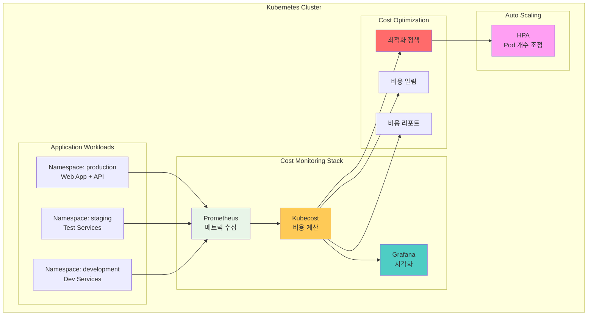
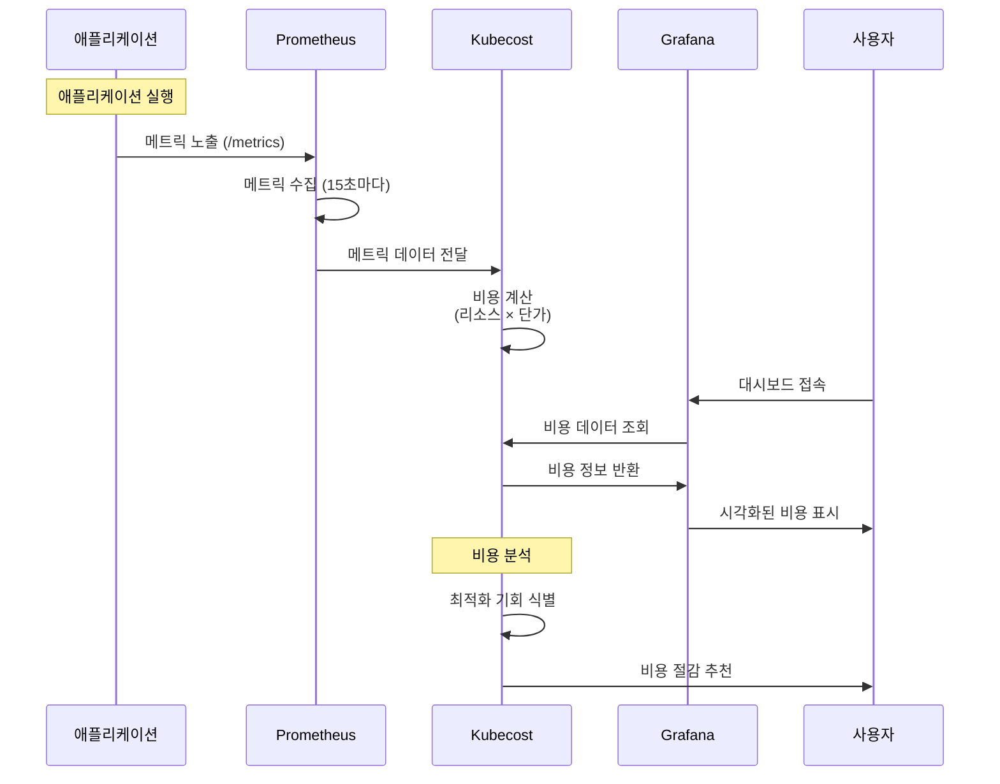
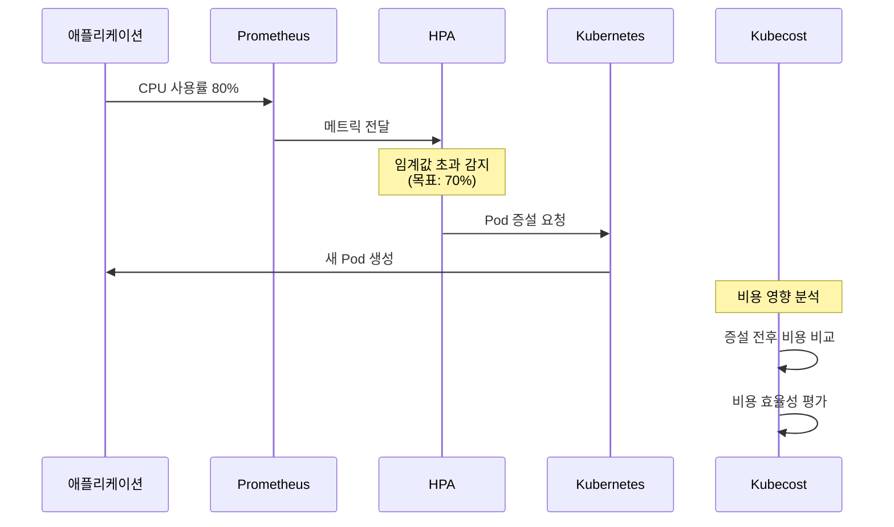

# Week 4 Day 5 Lab 1: Kubecost 기반 비용 모니터링

<div align="center">

**💰 Kubecost** • **📊 비용 추적** • **⚙️ 자동 최적화**

*Helm으로 구축하는 실시간 비용 모니터링 시스템*

</div>

---

## 🕘 실습 정보
**시간**: 12:00-12:50 (50분)
**목표**: Helm을 활용한 Kubecost 비용 모니터링 시스템 구축
**방식**: Helm Chart 설치 + 비용 분석

## 🎯 실습 목표

### 📚 학습 목표
- Helm Chart를 활용한 Kubecost 설치
- 네임스페이스/Pod 단위 비용 추적
- HPA를 통한 자동 리소스 최적화
- 비용 절감 기회 식별

### 🛠️ 구현 목표
- Kubecost + Prometheus 통합 설치
- 실시간 비용 모니터링 대시보드
- 자동 스케일링 설정
- 비용 최적화 정책 적용

---

## 🏗️ 전체 아키텍처



### 역할별 상세 설명

**Cost Monitoring Stack** (비용 모니터링 스택):
- **Prometheus** (프로메테우스): 
  - 역할: 클러스터의 모든 메트릭 수집 (CPU, Memory, Network)
  - 🏠 실생활 비유: 아파트 관리실의 전기/수도 계량기
  - 왜 필요?: 비용 계산을 위한 정확한 사용량 데이터 수집
  
- **Kubecost** (큐브코스트):
  - 역할: 리소스 사용량을 실제 비용으로 변환
  - 🏠 실생활 비유: 전기 사용량(kWh)을 전기세(원)로 계산
  - 왜 필요?: "CPU 200m 사용"이 실제로 "월 $50"인지 파악
  
- **Grafana** (그라파나):
  - 역할: 비용 데이터를 그래프와 대시보드로 시각화
  - 🏠 실생활 비유: 가계부 앱의 지출 차트
  - 왜 필요?: 비용 트렌드를 한눈에 파악

**Application Workloads** (애플리케이션):
- **Production**: 실제 운영 서비스 (높은 리소스)
- **Staging**: 테스트 환경 (중간 리소스)
- **Development**: 개발 환경 (낮은 리소스)

**Auto Scaling** (자동 확장):
- **HPA**: 트래픽에 따라 Pod 개수 자동 조정

**Cost Optimization** (비용 최적화):
- **최적화 정책**: Right-sizing, 자동 스케일링
- **비용 알림**: 예산 초과 시 알림
- **비용 리포트**: 일일/주간/월간 리포트

---

## 🔄 트래픽 흐름 예시

### 비용 데이터 수집 과정



### 자동 스케일링 과정



---

## 🛠️ Step 1: 클러스터 초기화 (5분)

### 목표
기존 클러스터 삭제 및 새로운 lab-cluster 생성

### 🚀 자동화 스크립트 사용
```bash
cd theory/week_04/day5/lab_scripts/lab1
./step1-setup-cluster.sh
```

**📋 스크립트 내용**: [step1-setup-cluster.sh](./lab_scripts/lab1/step1-setup-cluster.sh)

**스크립트 핵심 부분**:
```bash
# 기존 클러스터 삭제
kind delete cluster --name lab-cluster

# 새 클러스터 생성 (1 control-plane + 2 worker)
cat <<EOF | kind create cluster --config=-
kind: Cluster
apiVersion: kind.x-k8s.io/v1alpha4
name: lab-cluster
nodes:
- role: control-plane
  extraPortMappings:
  - containerPort: 30080
    hostPort: 30080
- role: worker
- role: worker
EOF
```

### 📊 예상 결과
```
Creating cluster "lab-cluster" ...
 ✓ Ensuring node image (kindest/node:v1.27.3)
 ✓ Preparing nodes 📦 📦 📦
Set kubectl context to "kind-lab-cluster"
```

### ✅ 검증
```bash
kubectl get nodes
```

**예상 출력**:
```
NAME                        STATUS   ROLES           AGE   VERSION
lab-cluster-control-plane   Ready    control-plane   1m    v1.27.3
lab-cluster-worker          Ready    <none>          1m    v1.27.3
lab-cluster-worker2         Ready    <none>          1m    v1.27.3
```

---

## 🛠️ Step 2: Metrics Server 설치 (5분)

### 🤔 왜 필요한가?
**문제 상황**: 
- Kubernetes는 기본적으로 리소스 사용량을 알 수 없음
- 🏠 실생활 비유: 전기 계량기 없이는 전기 사용량을 모름

**Metrics Server의 역할**:
- 모든 Pod와 Node의 실시간 리소스 사용량 수집
- HPA가 CPU 기반 스케일링을 하려면 필수
- Kubecost가 정확한 비용을 계산하려면 필요

### 목표
Kubernetes 메트릭 수집을 위한 Metrics Server 설치

### 🚀 자동화 스크립트 사용
```bash
cd theory/week_04/day5/lab_scripts/lab1
./step2-install-metrics-server.sh
```

**📋 스크립트 내용**: [step2-install-metrics-server.sh](./lab_scripts/lab1/step2-install-metrics-server.sh)

**스크립트 핵심 부분**:
```bash
# Metrics Server 설치
kubectl apply -f https://github.com/kubernetes-sigs/metrics-server/releases/latest/download/components.yaml

# Kind 환경을 위한 패치
kubectl patch -n kube-system deployment metrics-server --type=json \
  -p '[{"op":"add","path":"/spec/template/spec/containers/0/args/-","value":"--kubelet-insecure-tls"}]'
```

### 📊 예상 결과
```
deployment.apps/metrics-server patched
deployment "metrics-server" successfully rolled out
```

### ✅ 검증
```bash
kubectl top nodes
```

**예상 출력**:
```
NAME                        CPU(cores)   CPU%   MEMORY(bytes)   MEMORY%
lab-cluster-control-plane   150m         7%     800Mi           20%
lab-cluster-worker          100m         5%     600Mi           15%
```

---

## 🛠️ Step 3: Kubecost 설치 (15분)

### 🤔 왜 필요한가?
**문제 상황**:
- Metrics Server는 "CPU 150m 사용"만 알려줌
- 이게 실제로 얼마의 비용인지는 모름
- 🏠 실생활 비유: 전기 계량기는 "50kWh"만 보여주고 전기세는 계산해야 함

**Kubecost의 역할**:
- 리소스 사용량을 실제 클라우드 비용으로 변환
- "이 Pod가 한 달에 $50 사용 중"처럼 구체적 표시
- 비용 절감 방법 자동 추천

### 목표
Helm을 통한 Kubecost 설치 (Prometheus 포함)

### 🚀 자동화 스크립트 사용
```bash
cd theory/week_04/day5/lab_scripts/lab1
./step3-install-kubecost.sh
```

**📋 스크립트 내용**: [step3-install-kubecost.sh](./lab_scripts/lab1/step3-install-kubecost.sh)

**스크립트 핵심 부분**:
```bash
# Helm 저장소 추가
helm repo add kubecost https://kubecost.github.io/cost-analyzer/
helm repo update

# Kubecost 설치 (Prometheus 포함)
helm install kubecost kubecost/cost-analyzer \
  --namespace kubecost --create-namespace \
  --set kubecostToken="aGVsbUBrdWJlY29zdC5jb20=xm343yadf98" \
  --set prometheus.server.global.external_labels.cluster_id="lab-cluster" \
  --set service.type=NodePort \
  --set service.nodePort=30080
```

### 📊 예상 결과
```
NAME: kubecost
NAMESPACE: kubecost
STATUS: deployed
REVISION: 1
```

### ✅ 검증
```bash
kubectl get pods -n kubecost
```

**예상 출력**:
```
NAME                                          READY   STATUS    AGE
kubecost-cost-analyzer-xxx                    3/3     Running   2m
kubecost-prometheus-server-xxx                2/2     Running   2m
```

### 🌐 Kubecost 대시보드 접속
```bash
echo "Kubecost URL: http://localhost:30080"
```

브라우저에서 `http://localhost:30080` 접속

---

## 🛠️ Step 4: 샘플 애플리케이션 배포 (10분)

### 목표
비용 추적을 위한 3개 네임스페이스에 샘플 애플리케이션 배포

### 🚀 자동화 스크립트 사용
```bash
cd theory/week_04/day5/lab_scripts/lab1
./step4-deploy-sample-apps.sh
```

**📋 스크립트 내용**: [step4-deploy-sample-apps.sh](./lab_scripts/lab1/step4-deploy-sample-apps.sh)

**스크립트 핵심 부분**:
```bash
# 네임스페이스 생성 및 라벨 추가
kubectl create namespace production
kubectl label namespace production team=frontend cost-center=CC-1001

# Production 애플리케이션 (높은 리소스)
kubectl apply -f - <<EOF
apiVersion: apps/v1
kind: Deployment
metadata:
  name: web-app
  namespace: production
spec:
  replicas: 3
  template:
    spec:
      containers:
      - name: nginx
        image: nginx:alpine
        resources:
          requests:
            cpu: 200m
            memory: 256Mi
EOF
```

### 📊 예상 결과
```
namespace/production created
namespace/staging created
namespace/development created
deployment.apps/web-app created
```

### ✅ 검증
```bash
kubectl get pods --all-namespaces | grep -E "production|staging|development"
```

---

## 🛠️ Step 5: HPA 설정 (10분)

### 목표
Horizontal Pod Autoscaler 설정으로 자동 스케일링 구현

### 🚀 자동화 스크립트 사용
```bash
cd theory/week_04/day5/lab_scripts/lab1
./step5-setup-hpa.sh
```

**📋 스크립트 내용**: [step5-setup-hpa.sh](./lab_scripts/lab1/step5-setup-hpa.sh)

**스크립트 핵심 부분**:
```bash
# Production HPA (CPU 기반)
kubectl apply -f - <<EOF
apiVersion: autoscaling/v2
kind: HorizontalPodAutoscaler
metadata:
  name: web-app-hpa
  namespace: production
spec:
  scaleTargetRef:
    apiVersion: apps/v1
    kind: Deployment
    name: web-app
  minReplicas: 2
  maxReplicas: 10
  metrics:
  - type: Resource
    resource:
      name: cpu
      target:
        type: Utilization
        averageUtilization: 70
EOF
```

### 📊 예상 결과
```
horizontalpodautoscaler.autoscaling/web-app-hpa created
```

### ✅ 검증
```bash
kubectl get hpa -n production
```

**예상 출력**:
```
NAME          REFERENCE            TARGETS   MINPODS   MAXPODS   REPLICAS
web-app-hpa   Deployment/web-app   15%/70%   2         10        3
```

---

## 🛠️ Step 6: 비용 분석 (5분)

### 목표
Kubecost 대시보드에서 비용 분석 및 최적화 기회 식별

### 📊 비용 분석 방법

**1. 네임스페이스별 비용 확인**
- Kubecost 대시보드 접속: http://localhost:30080
- "Allocations" 메뉴 선택
- 네임스페이스별 비용 비교

**2. 최적화 기회 식별**
- "Savings" 메뉴에서 절감 기회 확인
- Over-provisioned Pods 식별
- Idle Resources 확인

**3. 비용 트렌드 분석**
- 시간대별 비용 변화 확인
- 예산 대비 실제 비용 비교

---

## ✅ 실습 체크포인트

### ✅ Step 1: 클러스터 초기화
- [ ] 기존 클러스터 삭제 완료
- [ ] 새 클러스터 생성 완료
- [ ] 노드 3개 정상 실행

### ✅ Step 2: Metrics Server
- [ ] Metrics Server 설치 완료
- [ ] `kubectl top nodes` 동작 확인

### ✅ Step 3: Kubecost 설치
- [ ] Kubecost 설치 완료
- [ ] Prometheus 연동 확인
- [ ] 대시보드 접속 가능

### ✅ Step 4: 샘플 애플리케이션
- [ ] 3개 네임스페이스 생성
- [ ] 애플리케이션 배포 완료
- [ ] 모든 Pod Running 상태

### ✅ Step 5: HPA 설정
- [ ] HPA 설정 완료
- [ ] HPA 동작 확인

### ✅ Step 6: 비용 분석
- [ ] 네임스페이스별 비용 확인
- [ ] 최적화 기회 식별

---

## 🔍 트러블슈팅

### 문제 1: Metrics Server가 메트릭을 수집하지 못함
```bash
# 증상
kubectl top nodes
Error from server (ServiceUnavailable)
```

**해결 방법**:
```bash
kubectl patch -n kube-system deployment metrics-server --type=json \
  -p '[{"op":"add","path":"/spec/template/spec/containers/0/args/-","value":"--kubelet-insecure-tls"}]'
```

### 문제 2: Kubecost Pod가 시작되지 않음
```bash
# 증상
kubectl get pods -n kubecost
NAME                     READY   STATUS    AGE
kubecost-xxx             0/3     Pending   5m
```

**해결 방법**:
```bash
# Pod 상세 정보 확인
kubectl describe pod -n kubecost kubecost-xxx

# 리소스 부족 시 - 노드 추가 또는 리소스 요청 감소
```

### 문제 3: HPA가 메트릭을 가져오지 못함
```bash
# 증상
kubectl get hpa -n production
NAME          TARGETS         MINPODS   MAXPODS
web-app-hpa   <unknown>/70%   2         10
```

**해결 방법**:
```bash
# 1-2분 대기 후 다시 확인
kubectl get hpa -n production

# Metrics Server 로그 확인
kubectl logs -n kube-system deployment/metrics-server
```

---

## 🧹 실습 정리

### 자동 정리 스크립트
```bash
cd theory/week_04/day5/lab_scripts/lab1
./cleanup.sh
```

**📋 스크립트 내용**: [cleanup.sh](./lab_scripts/lab1/cleanup.sh)

### 수동 정리 (선택사항)
```bash
# Helm 릴리스 삭제
helm uninstall kubecost -n kubecost

# 네임스페이스 삭제
kubectl delete namespace kubecost production staging development

# 클러스터 삭제 (선택)
kind delete cluster --name lab-cluster
```

---

## 💡 실습 회고

### 🤝 페어 회고 (5분)
1. **비용 가시성**: Kubecost를 통해 어떤 인사이트를 얻었나요?
2. **최적화 기회**: 가장 큰 비용 절감 기회는 무엇이었나요?
3. **Helm 활용**: Helm Chart 사용이 어떤 점에서 편리했나요?
4. **실무 적용**: 실제 프로젝트에 어떻게 적용할 수 있을까요?

### 📊 학습 성과
- **비용 모니터링**: Kubecost를 활용한 실시간 비용 추적
- **Helm 활용**: Helm Chart를 통한 복잡한 애플리케이션 설치
- **리소스 최적화**: Right-sizing과 자동 스케일링 구현
- **실무 역량**: 프로덕션급 비용 관리 시스템 구축

### 🔗 다음 실습 연계
- **Hands-on 1**: 커스텀 대시보드 및 알림 설정
- **연결 고리**: Kubecost 기반 고급 비용 최적화

---

<div align="center">

**💰 비용 가시성 확보** • **⚙️ 자동 최적화** • **📊 실시간 모니터링**

*Helm으로 쉽고 빠르게 구축하는 비용 관리 시스템*

**이전**: [Session 3 - IaC와 AWS 기초](./session_3.md) | **다음**: [Hands-on 1 - 커스텀 대시보드 및 알림](./handson_1.md)

</div>
