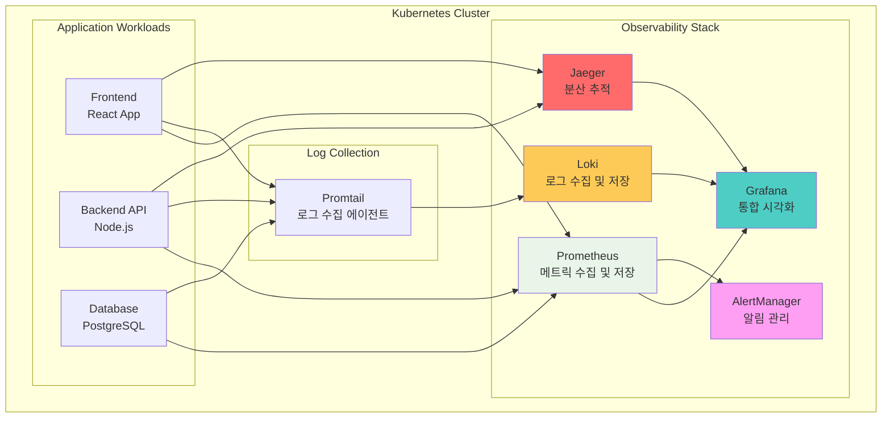
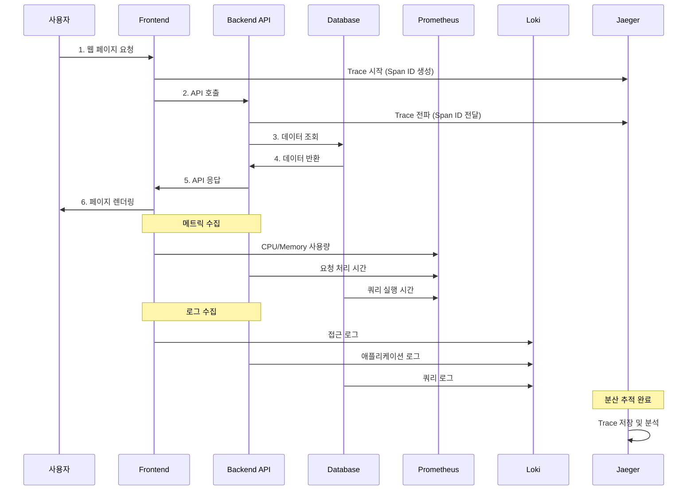
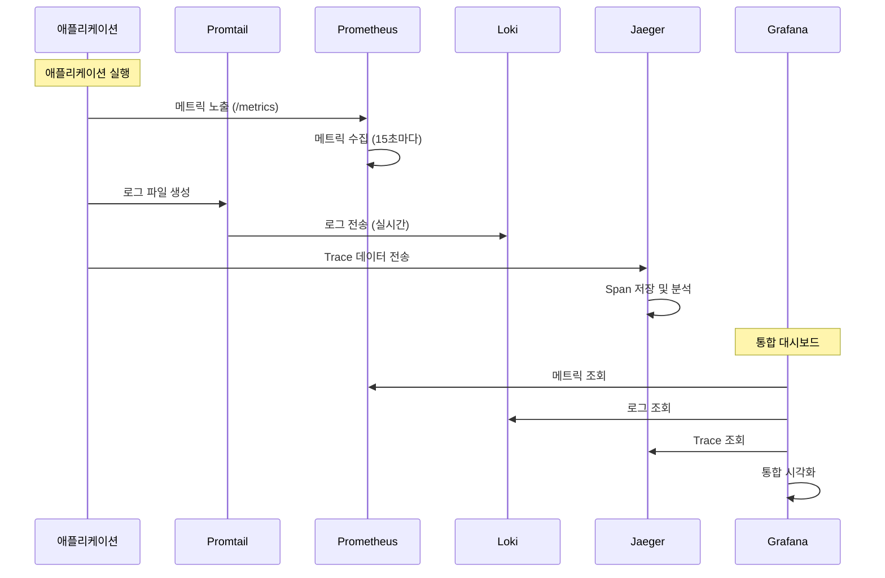

# Week 4 Day 5 Lab 1: Helm으로 관측성 스택 구축

<div align="center">

**📊 Prometheus** • **📈 Grafana** • **📝 Loki** • **🔍 Jaeger**

*Helm Chart로 프로덕션급 관측성 플랫폼 구축*

</div>

---

## 🕘 실습 정보
**시간**: 12:00-12:50 (50분)
**목표**: Helm을 활용한 통합 관측성 스택 구축
**방식**: Helm Chart 설치 + 대시보드 확인

## 🎯 실습 목표

### 📚 학습 목표
- Helm Chart를 활용한 복잡한 애플리케이션 설치
- Prometheus Stack (Prometheus + Grafana + AlertManager) 이해
- Loki를 통한 중앙화된 로깅 시스템 구축
- Jaeger를 통한 분산 추적 시스템 이해

### 🛠️ 구현 목표
- kube-prometheus-stack 설치 (Prometheus + Grafana + AlertManager)
- Loki Stack 설치 (로그 수집 및 저장)
- Jaeger 설치 (분산 추적)
- 통합 대시보드 구성

---

## 🏗️ 전체 아키텍처



### 역할별 상세 설명

**Observability Stack** (관측성 스택):
- **Prometheus** (프로메테우스): 
  - 역할: 시계열 메트릭 데이터 수집 및 저장
  - 🏠 실생활 비유: 건물의 모든 센서(온도, 습도, 전력)를 모니터링하는 중앙 관제실
  - 왜 필요?: CPU, 메모리, 네트워크 사용량 등을 실시간으로 추적하여 문제 발생 전 감지
  
- **Grafana** (그라파나):
  - 역할: 모든 데이터를 통합하여 시각화하는 대시보드
  - 🏠 실생활 비유: 자동차 계기판처럼 속도, 연료, 엔진 상태를 한눈에 보여줌
  - 왜 필요?: 메트릭, 로그, 추적 데이터를 하나의 화면에서 확인 가능
  
- **AlertManager** (알림 관리자):
  - 역할: 임계값 초과 시 Slack, Email 등으로 알림 전송
  - 🏠 실생활 비유: 화재 경보기처럼 위험 상황 발생 시 즉시 알림
  - 왜 필요?: 장애 발생 시 빠른 대응을 위한 자동 알림
  
- **Loki** (로키):
  - 역할: 애플리케이션 로그를 중앙에서 수집하고 저장
  - 🏠 실생활 비유: CCTV 녹화 시스템처럼 모든 활동을 기록
  - 왜 필요?: 에러 발생 시 로그를 통해 원인 분석 가능
  
- **Jaeger** (예거):
  - 역할: 마이크로서비스 간 요청 흐름을 추적
  - 🏠 실생활 비유: 택배 추적 시스템처럼 요청이 어디를 거쳐가는지 확인
  - 왜 필요?: 어느 서비스에서 지연이 발생하는지 정확히 파악

**Application Workloads** (애플리케이션):
- **Frontend**: 사용자가 보는 웹 페이지
- **Backend API**: 비즈니스 로직 처리
- **Database**: 데이터 저장 및 조회

**Log Collection** (로그 수집):
- **Promtail**: 각 Pod의 로그를 수집하여 Loki로 전송하는 에이전트

---

## 🔄 트래픽 흐름 예시

### 사용자 요청 처리 과정



### 관측성 데이터 흐름



---

## 🛠️ Step 1: 클러스터 초기화 (5분)

### 목표
기존 클러스터 삭제 및 새로운 lab-cluster 생성

### 🚀 자동화 스크립트 사용
```bash
cd theory/week_04/day5/lab_scripts/lab1
./step1-setup-cluster.sh
```

**📋 스크립트 내용**: [step1-setup-cluster.sh](./lab_scripts/lab1/step1-setup-cluster.sh)

**스크립트 핵심 부분**:
```bash
# 기존 클러스터 삭제
kind delete cluster --name lab-cluster

# 새 클러스터 생성 (1 control-plane + 2 worker)
cat <<EOF | kind create cluster --config=-
kind: Cluster
apiVersion: kind.x-k8s.io/v1alpha4
name: lab-cluster
nodes:
- role: control-plane
  extraPortMappings:
  - containerPort: 30080
    hostPort: 30080
  - containerPort: 30081
    hostPort: 30081
  - containerPort: 30082
    hostPort: 30082
- role: worker
- role: worker
EOF
```

### 📊 예상 결과
```
Creating cluster "lab-cluster" ...
 ✓ Ensuring node image (kindest/node:v1.27.3)
 ✓ Preparing nodes 📦 📦 📦
 ✓ Writing configuration 📜
 ✓ Starting control-plane 🕹️
 ✓ Installing CNI 🔌
 ✓ Installing StorageClass 💾
 ✓ Joining worker nodes 🚜
Set kubectl context to "kind-lab-cluster"
```

### ✅ 검증
```bash
kubectl get nodes
```

**예상 출력**:
```
NAME                        STATUS   ROLES           AGE   VERSION
lab-cluster-control-plane   Ready    control-plane   1m    v1.27.3
lab-cluster-worker          Ready    <none>          1m    v1.27.3
lab-cluster-worker2         Ready    <none>          1m    v1.27.3
```

---

## 🛠️ Step 2: Prometheus Stack 설치 (15분)

### 🤔 왜 필요한가?
**문제 상황**: 
- 클러스터에서 무슨 일이 일어나는지 알 수 없음
- 🏠 실생활 비유: 계기판 없는 자동차 운전 - 속도, 연료, 엔진 상태를 모름

**Prometheus Stack의 역할**:
- **Prometheus**: 모든 메트릭 수집 (CPU, 메모리, 네트워크)
- **Grafana**: 수집된 데이터를 보기 쉬운 대시보드로 시각화
- **AlertManager**: 문제 발생 시 자동 알림

### 목표
kube-prometheus-stack Helm Chart 설치

### 🚀 자동화 스크립트 사용
```bash
cd theory/week_04/day5/lab_scripts/lab1
./step2-install-prometheus-stack.sh
```

**📋 스크립트 내용**: [step2-install-prometheus-stack.sh](./lab_scripts/lab1/step2-install-prometheus-stack.sh)

**스크립트 핵심 부분**:
```bash
# Helm 저장소 추가
helm repo add prometheus-community https://prometheus-community.github.io/helm-charts
helm repo update

# kube-prometheus-stack 설치
helm install prometheus prometheus-community/kube-prometheus-stack \
  --namespace monitoring --create-namespace \
  --set grafana.service.type=NodePort \
  --set grafana.service.nodePort=30080
```

### 📊 예상 결과
```
NAME: prometheus
NAMESPACE: monitoring
STATUS: deployed
REVISION: 1

kube-prometheus-stack has been installed!
```

### ✅ 검증
```bash
kubectl get pods -n monitoring
```

**예상 출력**:
```
NAME                                                   READY   STATUS    AGE
prometheus-kube-prometheus-operator-xxx                1/1     Running   2m
prometheus-prometheus-kube-prometheus-prometheus-0     2/2     Running   2m
prometheus-grafana-xxx                                 3/3     Running   2m
alertmanager-prometheus-kube-prometheus-alertmanager-0 2/2     Running   2m
```

### 🌐 Grafana 대시보드 접속
```bash
# NodePort로 접속 (포트 30080)
echo "Grafana URL: http://localhost:30080"
echo "Username: admin"
echo "Password: admin123"
```

브라우저에서 `http://localhost:30080` 접속

**🎯 대시보드에서 확인할 수 있는 것**:
- Kubernetes 클러스터 전체 상태
- 노드별 CPU/메모리 사용률
- Pod별 리소스 사용량
- 네트워크 트래픽

---

## 🛠️ Step 3: Loki Stack 설치 (10분)

### 🤔 왜 필요한가?
**문제 상황**:
- 에러 발생 시 각 Pod마다 로그를 확인해야 함
- 🏠 실생활 비유: 여러 CCTV를 일일이 확인하는 것 vs 통합 관제실에서 한번에 확인

**Loki의 역할**:
- 모든 Pod의 로그를 중앙에서 수집
- Grafana에서 로그 검색 및 필터링
- 시간대별 로그 분석

### 목표
Loki Stack (Loki + Promtail) 설치

### 🚀 자동화 스크립트 사용
```bash
cd theory/week_04/day5/lab_scripts/lab1
./step3-install-loki.sh
```

**📋 스크립트 내용**: [step3-install-loki.sh](./lab_scripts/lab1/step3-install-loki.sh)

**스크립트 핵심 부분**:
```bash
# Grafana Helm 저장소 추가
helm repo add grafana https://grafana.github.io/helm-charts
helm repo update

# Loki Stack 설치
helm install loki grafana/loki-stack \
  --namespace monitoring \
  --set grafana.enabled=false \
  --set loki.persistence.enabled=true
```

### 📊 예상 결과
```
NAME: loki
NAMESPACE: monitoring
STATUS: deployed
REVISION: 1

Loki Stack has been installed!
```

### ✅ 검증
```bash
kubectl get pods -n monitoring | grep loki
```

**예상 출력**:
```
loki-0                                                 1/1     Running   0          2m
loki-promtail-xxx                                      1/1     Running   0          2m
loki-promtail-yyy                                      1/1     Running   0          2m
loki-promtail-zzz                                      1/1     Running   0          2m
```

**💡 Pod 설명**:
- `loki-0`: 로그 저장소 (메인 서버)
- `loki-promtail-xxx`: 각 노드에서 로그를 수집하는 에이전트 (DaemonSet)

---

## 🛠️ Step 4: Jaeger 설치 (10분)

### 🤔 왜 필요한가?
**문제 상황**:
- 마이크로서비스 환경에서 요청이 여러 서비스를 거침
- 어느 서비스에서 지연이 발생하는지 알기 어려움
- 🏠 실생활 비유: 택배가 어디서 지연되는지 추적 시스템 없이는 알 수 없음

**Jaeger의 역할**:
- 요청이 거쳐가는 모든 서비스 추적
- 각 서비스에서 소요된 시간 측정
- 병목 지점 시각화

### 목표
Jaeger 분산 추적 시스템 설치

### 🚀 자동화 스크립트 사용
```bash
cd theory/week_04/day5/lab_scripts/lab1
./step4-install-jaeger.sh
```

**📋 스크립트 내용**: [step4-install-jaeger.sh](./lab_scripts/lab1/step4-install-jaeger.sh)

**스크립트 핵심 부분**:
```bash
# Jaeger Helm 저장소 추가
helm repo add jaegertracing https://jaegertracing.github.io/helm-charts
helm repo update

# Jaeger 설치
helm install jaeger jaegertracing/jaeger \
  --namespace monitoring \
  --set allInOne.enabled=true \
  --set query.service.type=NodePort \
  --set query.service.nodePort=30081
```

### 📊 예상 결과
```
NAME: jaeger
NAMESPACE: monitoring
STATUS: deployed
REVISION: 1

Jaeger has been installed!
```

### ✅ 검증
```bash
kubectl get pods -n monitoring | grep jaeger
```

**예상 출력**:
```
jaeger-xxx                                             1/1     Running   0          2m
```

### 🌐 Jaeger UI 접속
```bash
echo "Jaeger URL: http://localhost:30081"
```

브라우저에서 `http://localhost:30081` 접속

---

## 🛠️ Step 5: 샘플 애플리케이션 배포 (10분)

### 목표
관측성 스택 테스트를 위한 샘플 애플리케이션 배포

### 🚀 자동화 스크립트 사용
```bash
cd theory/week_04/day5/lab_scripts/lab1
./step5-deploy-sample-app.sh
```

**📋 스크립트 내용**: [step5-deploy-sample-app.sh](./lab_scripts/lab1/step5-deploy-sample-app.sh)

**스크립트 핵심 부분**:
```bash
# 네임스페이스 생성
kubectl create namespace demo

# 샘플 애플리케이션 배포
kubectl apply -f - <<EOF
apiVersion: apps/v1
kind: Deployment
metadata:
  name: web-app
  namespace: demo
spec:
  replicas: 3
  selector:
    matchLabels:
      app: web
  template:
    metadata:
      labels:
        app: web
    spec:
      containers:
      - name: nginx
        image: nginx:alpine
        ports:
        - containerPort: 80
        resources:
          requests:
            cpu: 100m
            memory: 128Mi
---
apiVersion: v1
kind: Service
metadata:
  name: web-service
  namespace: demo
spec:
  type: NodePort
  selector:
    app: web
  ports:
  - port: 80
    targetPort: 80
    nodePort: 30082
EOF
```

### 📊 예상 결과
```
namespace/demo created
deployment.apps/web-app created
service/web-service created
```

### ✅ 검증
```bash
kubectl get pods -n demo
```

**예상 출력**:
```
NAME                       READY   STATUS    RESTARTS   AGE
web-app-xxx                1/1     Running   0          1m
web-app-yyy                1/1     Running   0          1m
web-app-zzz                1/1     Running   0          1m
```

### 🌐 애플리케이션 접속
```bash
curl http://localhost:30082
```

---

## ✅ 실습 체크포인트

### ✅ Step 1: 클러스터 초기화
- [ ] 기존 클러스터 삭제 완료
- [ ] 새 클러스터 생성 완료 (1 control-plane + 2 worker)
- [ ] 노드 3개 정상 실행 확인

### ✅ Step 2: Prometheus Stack
- [ ] kube-prometheus-stack 설치 완료
- [ ] Grafana 대시보드 접속 가능 (http://localhost:30080)
- [ ] 기본 대시보드에서 메트릭 확인

### ✅ Step 3: Loki Stack
- [ ] Loki 설치 완료
- [ ] Promtail DaemonSet 정상 실행
- [ ] Grafana에서 Loki 데이터소스 확인

### ✅ Step 4: Jaeger
- [ ] Jaeger 설치 완료
- [ ] Jaeger UI 접속 가능 (http://localhost:30081)

### ✅ Step 5: 샘플 애플리케이션
- [ ] demo 네임스페이스 생성
- [ ] web-app 배포 완료
- [ ] 애플리케이션 접속 가능 (http://localhost:30082)

---

## 🔍 트러블슈팅

### 문제 1: Helm 저장소 추가 실패
```bash
# 증상
Error: looks like "https://prometheus-community.github.io/helm-charts" is not a valid chart repository
```

**해결 방법**:
```bash
# Helm 버전 확인
helm version

# Helm 3.x 이상인지 확인
# 2.x인 경우 업그레이드 필요
```

### 문제 2: Pod가 Pending 상태
```bash
# 증상
kubectl get pods -n monitoring
NAME                     READY   STATUS    RESTARTS   AGE
prometheus-xxx           0/2     Pending   0          5m
```

**해결 방법**:
```bash
# Pod 상세 정보 확인
kubectl describe pod -n monitoring prometheus-xxx

# 리소스 부족 시 - 노드 추가 또는 리소스 요청 감소
```

### 문제 3: Grafana 접속 불가
```bash
# 증상
curl: (7) Failed to connect to localhost port 30080
```

**해결 방법**:
```bash
# Service 확인
kubectl get svc -n monitoring

# NodePort 확인
kubectl get svc -n monitoring prometheus-grafana -o yaml | grep nodePort

# 포트 포워딩 사용 (대안)
kubectl port-forward -n monitoring svc/prometheus-grafana 3000:80
# http://localhost:3000 접속
```

---

## 🧹 실습 정리

### 자동 정리 스크립트
```bash
./cleanup.sh
```

**📋 스크립트 내용**: [cleanup.sh](./lab_scripts/lab1/cleanup.sh)

### 수동 정리 (선택사항)
```bash
# Helm 릴리스 삭제
helm uninstall prometheus -n monitoring
helm uninstall loki -n monitoring
helm uninstall jaeger -n monitoring

# 네임스페이스 삭제
kubectl delete namespace monitoring demo

# 클러스터 삭제 (선택)
kind delete cluster --name lab-cluster
```

---

## 💡 실습 회고

### 🤝 페어 회고 (5분)
1. **Helm의 장점**: Helm Chart를 사용한 설치가 어떤 점에서 편리했나요?
2. **관측성 3요소**: Metrics, Logs, Traces 중 어떤 것이 가장 유용할 것 같나요?
3. **대시보드 활용**: Grafana 대시보드에서 어떤 정보가 가장 인상 깊었나요?
4. **실무 적용**: 실제 프로젝트에 어떻게 적용할 수 있을까요?

### 📊 학습 성과
- **Helm 활용**: Helm Chart를 통한 복잡한 애플리케이션 설치
- **관측성 스택**: Prometheus, Grafana, Loki, Jaeger 통합 구축
- **실무 역량**: 프로덕션급 모니터링 시스템 구축 경험
- **도구 이해**: 각 도구의 역할과 연동 방식 이해

### 🔗 다음 실습 연계
- **Hands-on 1**: 커스텀 대시보드 생성 및 알림 설정
- **연결 고리**: 기본 스택을 바탕으로 실무 맞춤 설정

---

<div align="center">

**📊 통합 관측성** • **🎯 Helm 활용** • **🚀 프로덕션 준비**

*Helm으로 쉽고 빠르게 구축하는 관측성 플랫폼*

**이전**: [Session 3 - IaC와 AWS 기초](./session_3.md) | **다음**: [Hands-on 1 - 커스텀 대시보드 및 알림](./handson_1.md)

</div>

### 목표
기존 클러스터 삭제 및 새로운 lab-cluster 생성

### 🚀 자동화 스크립트 사용
```bash
cd theory/week_04/day5/lab_scripts/lab1
./step1-setup-cluster.sh
```

**📋 스크립트 내용**: [step1-setup-cluster.sh](./lab_scripts/lab1/step1-setup-cluster.sh)

**스크립트 핵심 부분**:
```bash
# 기존 클러스터 삭제
kind delete cluster --name lab-cluster

# 새 클러스터 생성 (1 control-plane + 2 worker)
cat <<EOF | kind create cluster --config=-
kind: Cluster
apiVersion: kind.x-k8s.io/v1alpha4
name: lab-cluster
nodes:
- role: control-plane
  extraPortMappings:
  - containerPort: 30080
    hostPort: 30080
  - containerPort: 30081
    hostPort: 30081
- role: worker
- role: worker
EOF
```

### 📊 예상 결과
```
Creating cluster "lab-cluster" ...
 ✓ Ensuring node image (kindest/node:v1.27.3)
 ✓ Preparing nodes 📦 📦 📦
 ✓ Writing configuration 📜
 ✓ Starting control-plane 🕹️
 ✓ Installing CNI 🔌
 ✓ Installing StorageClass 💾
 ✓ Joining worker nodes 🚜
Set kubectl context to "kind-lab-cluster"
```

### ✅ 검증
```bash
kubectl get nodes
```

**예상 출력**:
```
NAME                        STATUS   ROLES           AGE   VERSION
lab-cluster-control-plane   Ready    control-plane   1m    v1.27.3
lab-cluster-worker          Ready    <none>          1m    v1.27.3
lab-cluster-worker2         Ready    <none>          1m    v1.27.3
```

---

## 🛠️ Step 2: Metrics Server 설치 (10분)

### 🤔 왜 필요한가?
**문제 상황**: 
- Kubernetes는 기본적으로 "지금 CPU를 얼마나 쓰고 있는지" 알 수 없습니다
- 🏠 실생활 비유: 전기 계량기가 없으면 전기를 얼마나 쓰는지 알 수 없는 것과 같음

**Metrics Server의 역할**:
- 모든 Pod와 Node의 실시간 리소스 사용량을 수집
- HPA(자동 확장)가 "CPU 70% 넘으면 Pod 추가"를 판단하려면 현재 CPU 사용률을 알아야 함
- Kubecost가 비용을 계산하려면 정확한 사용량 데이터가 필요

### 목표
Kubernetes 메트릭 수집을 위한 Metrics Server 설치

### 🚀 자동화 스크립트 사용
```bash
./step2-install-metrics-server.sh
```

**📋 스크립트 내용**: [step2-install-metrics-server.sh](./lab_scripts/lab1/step2-install-metrics-server.sh)

**스크립트 핵심 부분**:
```bash
# Metrics Server 설치
kubectl apply -f https://github.com/kubernetes-sigs/metrics-server/releases/latest/download/components.yaml

# Kind 환경을 위한 패치 (TLS 검증 비활성화)
# 💡 설명: Kind는 로컬 테스트 환경이라 보안 인증서가 없어서 이 설정이 필요
kubectl patch -n kube-system deployment metrics-server --type=json \
  -p '[{"op":"add","path":"/spec/template/spec/containers/0/args/-","value":"--kubelet-insecure-tls"}]'

# 재시작 대기
kubectl rollout status -n kube-system deployment/metrics-server
```

### 📊 예상 결과
```
deployment.apps/metrics-server patched
Waiting for deployment "metrics-server" rollout to finish...
deployment "metrics-server" successfully rolled out
```

### ✅ 검증
```bash
kubectl top nodes
```

**예상 출력**:
```
NAME                        CPU(cores)   CPU%   MEMORY(bytes)   MEMORY%
lab-cluster-control-plane   150m         7%     800Mi           20%
lab-cluster-worker          100m         5%     600Mi           15%
lab-cluster-worker2         100m         5%     600Mi           15%
```

**💡 출력 설명**:
- `CPU(cores)`: 현재 사용 중인 CPU (150m = 0.15 코어 = CPU의 15%)
- `CPU%`: 전체 CPU 대비 사용률
- `MEMORY(bytes)`: 현재 사용 중인 메모리 (800Mi = 약 800MB)
- `MEMORY%`: 전체 메모리 대비 사용률

**🎯 이제 할 수 있는 것**:
- `kubectl top pods`: 각 Pod의 실시간 리소스 사용량 확인
- `kubectl top nodes`: 각 노드의 실시간 리소스 사용량 확인
- HPA가 CPU/Memory 기반으로 자동 확장 가능

---

## 🛠️ Step 3: Kubecost 설치 (15분)

### 🤔 왜 필요한가?
**문제 상황**:
- Metrics Server는 "CPU 150m 사용 중"이라고 알려주지만, 이게 "얼마의 비용"인지는 모름
- 🏠 실생활 비유: 전기 계량기는 "50kWh 사용"이라고 보여주지만, 전기세가 얼마인지는 계산해야 알 수 있음

**Kubecost의 역할**:
- 리소스 사용량을 실제 클라우드 비용으로 변환
- "이 Pod가 한 달에 $50 사용 중"처럼 구체적인 비용 표시
- 어떤 팀/서비스가 비용을 많이 쓰는지 한눈에 파악
- 비용 절감 방법 자동 추천 (예: "이 Pod는 리소스를 50%만 쓰니 줄이세요")

### 목표
Helm을 통한 Kubecost 설치 및 Prometheus 연동

### 🚀 자동화 스크립트 사용
```bash
./step3-install-kubecost.sh
```

**📋 스크립트 내용**: [step3-install-kubecost.sh](./lab_scripts/lab1/step3-install-kubecost.sh)

**스크립트 핵심 부분**:
```bash
# Helm 저장소 추가
# 💡 Helm: Kubernetes 애플리케이션을 쉽게 설치하는 패키지 매니저 (앱스토어 같은 것)
helm repo add kubecost https://kubecost.github.io/cost-analyzer/
helm repo update

# Kubecost 설치 (Prometheus 포함)
# 💡 --set: 설치 옵션 설정 (클러스터 이름 등)
helm install kubecost kubecost/cost-analyzer \
  --namespace kubecost --create-namespace \
  --set kubecostToken="aGVsbUBrdWJlY29zdC5jb20=xm343yadf98" \
  --set prometheus.server.global.external_labels.cluster_id="lab-cluster"

# 배포 완료 대기
kubectl wait --for=condition=ready pod \
  -l app=cost-analyzer \
  -n kubecost \
  --timeout=300s
```

### 📊 예상 결과
```
NAME: kubecost
NAMESPACE: kubecost
STATUS: deployed
REVISION: 1

Kubecost has been successfully installed!
```

### ✅ 검증
```bash
kubectl get pods -n kubecost
```

**예상 출력**:
```
NAME                                          READY   STATUS    RESTARTS   AGE
kubecost-cost-analyzer-5d9f8b5c4-x7k2m       3/3     Running   0          2m
kubecost-prometheus-server-7d8f9c6b5-9h4j3   2/2     Running   0          2m
kubecost-grafana-6b8d9c7f5-3k5l7             1/1     Running   0          2m
```

**💡 Pod 설명**:
- `kubecost-cost-analyzer`: 비용 계산 엔진 (메인 서비스)
- `kubecost-prometheus-server`: 메트릭 수집 및 저장
- `kubecost-grafana`: 비용 대시보드 (웹 UI)

### 🌐 Kubecost 대시보드 접속
```bash
kubectl port-forward -n kubecost svc/kubecost-cost-analyzer 9090:9090
```

**💡 port-forward 설명**:
- Kubernetes 내부 서비스를 로컬 컴퓨터에서 접속 가능하게 만드는 명령어
- 🏠 실생활 비유: 회사 내부망 서비스를 VPN으로 집에서 접속하는 것과 비슷

브라우저에서 `http://localhost:9090` 접속

**🎯 대시보드에서 확인할 수 있는 것**:
- 네임스페이스별 비용 (production, staging, development)
- Pod별 상세 비용
- 시간대별 비용 트렌드
- 비용 절감 추천 사항

---

## 🛠️ Step 4: 샘플 애플리케이션 배포 (15분)

### 목표
비용 추적을 위한 3개 네임스페이스에 샘플 애플리케이션 배포

### 🚀 자동화 스크립트 사용
```bash
./step4-deploy-sample-apps.sh
```

**📋 스크립트 내용**: [step4-deploy-sample-apps.sh](./lab_scripts/lab1/step4-deploy-sample-apps.sh)

**스크립트 핵심 부분**:
```bash
# 네임스페이스 생성
kubectl create namespace production
kubectl create namespace staging
kubectl create namespace development

# 비용 추적을 위한 라벨 추가
kubectl label namespace production team=frontend cost-center=CC-1001
kubectl label namespace staging team=qa cost-center=CC-1002
kubectl label namespace development team=dev cost-center=CC-1003

# Production 애플리케이션 (높은 리소스)
kubectl apply -f - <<EOF
apiVersion: apps/v1
kind: Deployment
metadata:
  name: web-app
  namespace: production
spec:
  replicas: 3
  selector:
    matchLabels:
      app: web
  template:
    metadata:
      labels:
        app: web
        tier: frontend
    spec:
      containers:
      - name: nginx
        image: nginx:alpine
        resources:
          requests:
            cpu: 200m
            memory: 256Mi
          limits:
            cpu: 500m
            memory: 512Mi
EOF

# Staging 애플리케이션 (중간 리소스)
kubectl apply -f - <<EOF
apiVersion: apps/v1
kind: Deployment
metadata:
  name: api-server
  namespace: staging
spec:
  replicas: 2
  selector:
    matchLabels:
      app: api
  template:
    metadata:
      labels:
        app: api
        tier: backend
    spec:
      containers:
      - name: api
        image: nginx:alpine
        resources:
          requests:
            cpu: 100m
            memory: 128Mi
          limits:
            cpu: 300m
            memory: 256Mi
EOF

# Development 애플리케이션 (낮은 리소스)
kubectl apply -f - <<EOF
apiVersion: apps/v1
kind: Deployment
metadata:
  name: dev-service
  namespace: development
spec:
  replicas: 1
  selector:
    matchLabels:
      app: dev
  template:
    metadata:
      labels:
        app: dev
        tier: backend
    spec:
      containers:
      - name: dev
        image: nginx:alpine
        resources:
          requests:
            cpu: 50m
            memory: 64Mi
          limits:
            cpu: 100m
            memory: 128Mi
EOF
```

### 📊 예상 결과
```
namespace/production created
namespace/staging created
namespace/development created
deployment.apps/web-app created
deployment.apps/api-server created
deployment.apps/dev-service created
```

### ✅ 검증
```bash
kubectl get pods --all-namespaces | grep -E "production|staging|development"
```

**예상 출력**:
```
production     web-app-7d9f8b5c4-abc12      1/1     Running   0          1m
production     web-app-7d9f8b5c4-def34      1/1     Running   0          1m
production     web-app-7d9f8b5c4-ghi56      1/1     Running   0          1m
staging        api-server-6b8d9c7f5-jkl78   1/1     Running   0          1m
staging        api-server-6b8d9c7f5-mno90   1/1     Running   0          1m
development    dev-service-5c7d8e9f6-pqr12  1/1     Running   0          1m
```

---

## 🛠️ Step 5: HPA 설정 (10분)

### 목표
Horizontal Pod Autoscaler 설정으로 자동 스케일링 구현

### 🚀 자동화 스크립트 사용
```bash
./step5-setup-hpa.sh
```

**📋 스크립트 내용**: [step5-setup-hpa.sh](./lab_scripts/lab1/step5-setup-hpa.sh)

**스크립트 핵심 부분**:
```bash
# Production HPA (CPU 기반)
kubectl apply -f - <<EOF
apiVersion: autoscaling/v2
kind: HorizontalPodAutoscaler
metadata:
  name: web-app-hpa
  namespace: production
spec:
  scaleTargetRef:
    apiVersion: apps/v1
    kind: Deployment
    name: web-app
  minReplicas: 2
  maxReplicas: 10
  metrics:
  - type: Resource
    resource:
      name: cpu
      target:
        type: Utilization
        averageUtilization: 70
  - type: Resource
    resource:
      name: memory
      target:
        type: Utilization
        averageUtilization: 80
  behavior:
    scaleDown:
      stabilizationWindowSeconds: 300
      policies:
      - type: Percent
        value: 50
        periodSeconds: 60
    scaleUp:
      stabilizationWindowSeconds: 0
      policies:
      - type: Percent
        value: 100
        periodSeconds: 30
EOF

# Staging HPA
kubectl apply -f - <<EOF
apiVersion: autoscaling/v2
kind: HorizontalPodAutoscaler
metadata:
  name: api-server-hpa
  namespace: staging
spec:
  scaleTargetRef:
    apiVersion: apps/v1
    kind: Deployment
    name: api-server
  minReplicas: 1
  maxReplicas: 5
  metrics:
  - type: Resource
    resource:
      name: cpu
      target:
        type: Utilization
        averageUtilization: 70
EOF
```

### 📊 예상 결과
```
horizontalpodautoscaler.autoscaling/web-app-hpa created
horizontalpodautoscaler.autoscaling/api-server-hpa created
```

### ✅ 검증
```bash
kubectl get hpa --all-namespaces
```

**예상 출력**:
```
NAMESPACE    NAME             REFERENCE            TARGETS         MINPODS   MAXPODS   REPLICAS   AGE
production   web-app-hpa      Deployment/web-app   15%/70%, 20%/80%   2         10        3          1m
staging      api-server-hpa   Deployment/api-server   10%/70%        1         5         2          1m
```

---

## 🛠️ Step 6: 비용 분석 및 최적화 (15분)

### 목표
Kubecost 대시보드에서 비용 분석 및 최적화 기회 식별

### 📊 비용 분석 방법

**1. 네임스페이스별 비용 확인**
```bash
# Kubecost API를 통한 비용 조회
kubectl port-forward -n kubecost svc/kubecost-cost-analyzer 9090:9090 &

# 네임스페이스별 비용 (최근 7일)
curl -s "http://localhost:9090/model/allocation?window=7d&aggregate=namespace" | jq
```

**예상 출력**:
```json
{
  "data": [
    {
      "name": "production",
      "cpuCost": 15.50,
      "memoryCost": 8.20,
      "totalCost": 23.70
    },
    {
      "name": "staging",
      "cpuCost": 7.80,
      "memoryCost": 4.10,
      "totalCost": 11.90
    },
    {
      "name": "development",
      "cpuCost": 2.60,
      "memoryCost": 1.40,
      "totalCost": 4.00
    }
  ]
}
```

**2. Pod별 비용 확인**
```bash
kubectl top pods -n production
```

**예상 출력**:
```
NAME                       CPU(cores)   MEMORY(bytes)
web-app-7d9f8b5c4-abc12    180m         220Mi
web-app-7d9f8b5c4-def34    190m         230Mi
web-app-7d9f8b5c4-ghi56    170m         210Mi
```

**3. 최적화 기회 식별**

Kubecost 대시보드에서 확인:
- **Over-provisioned Pods**: 요청 리소스 > 실제 사용량
- **Under-utilized Nodes**: 노드 사용률 < 50%
- **Idle Resources**: 사용되지 않는 PV, LoadBalancer

### 🔧 최적화 적용

**Right-sizing 예시**:
```bash
# 현재 설정 (과다 프로비저닝)
resources:
  requests:
    cpu: 200m      # 실제 사용: 50m (25%)
    memory: 256Mi  # 실제 사용: 100Mi (39%)

# 최적화 후
resources:
  requests:
    cpu: 75m       # 실제 사용 + 50% 버퍼
    memory: 150Mi  # 실제 사용 + 50% 버퍼
  limits:
    cpu: 150m      # 2배 여유
    memory: 300Mi  # 2배 여유
```

---

## ✅ 실습 체크포인트

### ✅ Step 1: 클러스터 초기화
- [ ] 기존 클러스터 삭제 완료
- [ ] 새 클러스터 생성 완료 (1 control-plane + 2 worker)
- [ ] 노드 3개 정상 실행 확인

### ✅ Step 2: Metrics Server
- [ ] Metrics Server 설치 완료
- [ ] `kubectl top nodes` 명령어 동작 확인
- [ ] 메트릭 수집 정상 동작

### ✅ Step 3: Kubecost 설치
- [ ] Kubecost 설치 완료
- [ ] Prometheus 연동 확인
- [ ] 대시보드 접속 가능

### ✅ Step 4: 샘플 애플리케이션
- [ ] 3개 네임스페이스 생성 완료
- [ ] 각 네임스페이스에 애플리케이션 배포
- [ ] 모든 Pod Running 상태

### ✅ Step 5: HPA 설정
- [ ] Production HPA 설정 완료
- [ ] Staging HPA 설정 완료
- [ ] HPA 동작 확인 (TARGETS 표시)

### ✅ Step 6: 비용 분석
- [ ] 네임스페이스별 비용 확인
- [ ] Pod별 리소스 사용량 확인
- [ ] 최적화 기회 식별

---

## 🔍 트러블슈팅

### 문제 1: Metrics Server가 메트릭을 수집하지 못함
```bash
# 증상
kubectl top nodes
Error from server (ServiceUnavailable): the server is currently unable to handle the request
```

**원인**: Metrics Server가 kubelet TLS 인증서를 검증하지 못함

**해결 방법**:
```bash
# Metrics Server에 --kubelet-insecure-tls 플래그 추가
kubectl patch -n kube-system deployment metrics-server --type=json \
  -p '[{"op":"add","path":"/spec/template/spec/containers/0/args/-","value":"--kubelet-insecure-tls"}]'

# 재시작 대기
kubectl rollout status -n kube-system deployment/metrics-server
```

**검증**:
```bash
kubectl top nodes
# 정상적으로 노드 메트릭 표시
```

### 문제 2: Kubecost Pod가 시작되지 않음
```bash
# 증상
kubectl get pods -n kubecost
NAME                                    READY   STATUS    RESTARTS   AGE
kubecost-cost-analyzer-xxx              0/3     Pending   0          5m
```

**원인**: 리소스 부족 또는 이미지 Pull 실패

**해결 방법**:
```bash
# Pod 상세 정보 확인
kubectl describe pod -n kubecost kubecost-cost-analyzer-xxx

# 이미지 Pull 실패 시
kubectl delete pod -n kubecost kubecost-cost-analyzer-xxx

# 리소스 부족 시 - 노드 추가 또는 리소스 요청 감소
```

### 문제 3: HPA가 메트릭을 가져오지 못함
```bash
# 증상
kubectl get hpa -n production
NAME          REFERENCE            TARGETS         MINPODS   MAXPODS   REPLICAS
web-app-hpa   Deployment/web-app   <unknown>/70%   2         10        0
```

**원인**: Metrics Server가 아직 메트릭을 수집하지 못함

**해결 방법**:
```bash
# 1-2분 대기 후 다시 확인
kubectl get hpa -n production

# Metrics Server 로그 확인
kubectl logs -n kube-system deployment/metrics-server
```

---

## 🧹 실습 정리

### 자동 정리 스크립트
```bash
./cleanup.sh
```

**📋 스크립트 내용**: [cleanup.sh](./lab_scripts/lab1/cleanup.sh)

### 수동 정리 (선택사항)
```bash
# 네임스페이스 삭제
kubectl delete namespace production staging development kubecost

# 클러스터 삭제 (선택)
kind delete cluster --name lab-cluster
```

---

## 💡 실습 회고

### 🤝 페어 회고 (5분)
1. **비용 가시성**: Kubecost를 통해 어떤 인사이트를 얻었나요?
2. **최적화 기회**: 가장 큰 비용 절감 기회는 무엇이었나요?
3. **자동 스케일링**: HPA 설정에서 어려웠던 점은?
4. **실무 적용**: 실제 프로젝트에 어떻게 적용할 수 있을까요?

### 📊 학습 성과
- **비용 모니터링**: Kubecost를 활용한 실시간 비용 추적
- **리소스 최적화**: Right-sizing과 자동 스케일링 구현
- **실무 역량**: 프로덕션급 비용 관리 시스템 구축
- **도구 활용**: Prometheus, Kubecost, HPA 통합 운영

### 🔗 다음 실습 연계
- **Hands-on 1**: Week 4 CloudMart 프로젝트 최종 완성
- **연결 고리**: Kubecost를 CloudMart에 통합하여 전체 비용 추적

---

<div align="center">

**💰 비용 가시성 확보** • **⚙️ 자동 최적화** • **📊 실시간 모니터링**

*클라우드 비용 관리의 첫 걸음, Kubecost로 시작하기*

**이전**: [Session 3 - IaC와 AWS 기초](./session_3.md) | **다음**: [Hands-on 1 - CloudMart 프로젝트 완성](./handson_1.md)

</div>
