# Week 4 Day 5 Lab 1: Kubecost 기반 비용 모니터링 + 리소스 최적화

<div align="center">

**💰 Kubecost** • **📊 비용 추적** • **⚙️ 자동 최적화**

*실시간 비용 모니터링과 리소스 최적화 구현*

</div>

---

## 🕘 실습 정보
**시간**: 12:00-13:15 (75분)
**목표**: Kubecost를 활용한 비용 모니터링 시스템 구축 및 HPA/VPA 최적화
**방식**: 단계별 스크립트 실행 + 수동 검증

## 🎯 실습 목표

### 📚 학습 목표
- Kubecost 설치 및 Prometheus 연동
- 네임스페이스/Pod 단위 비용 추적
- HPA/VPA를 통한 자동 리소스 최적화
- 비용 절감 효과 측정

### 🛠️ 구현 목표
- Kubecost 대시보드 구축
- 실시간 비용 모니터링 시스템
- 자동 스케일링 설정
- 비용 최적화 정책 적용

---

## 🏗️ 전체 아키텍처

```mermaid
graph TB
    subgraph "Kubernetes Cluster"
        subgraph "Monitoring Stack"
            P[Prometheus<br/>메트릭 수집]
            K[Kubecost<br/>비용 계산]
            G[Grafana<br/>시각화]
        end
        
        subgraph "Application Workloads"
            NS1[Namespace: production<br/>Web App + API]
            NS2[Namespace: staging<br/>Test Services]
            NS3[Namespace: development<br/>Dev Services]
        end
        
        subgraph "Auto Scaling"
            HPA[HPA<br/>Pod 개수 조정]
            VPA[VPA<br/>리소스 조정]
            CA[Cluster Autoscaler<br/>노드 조정]
        end
        
        subgraph "Cost Optimization"
            OPT[최적화 정책]
            ALERT[비용 알림]
            REPORT[비용 리포트]
        end
    end
    
    NS1 --> P
    NS2 --> P
    NS3 --> P
    
    P --> K
    K --> G
    
    K --> OPT
    OPT --> HPA
    OPT --> VPA
    OPT --> CA
    
    K --> ALERT
    K --> REPORT
    
    style P fill:#e8f5e8
    style K fill:#feca57
    style G fill:#4ecdc4
    style HPA,VPA,CA fill:#ff9ff3
    style OPT fill:#ff6b6b
```



### 역할별 상세 설명

**Monitoring Stack**:
- **Prometheus**: 클러스터 메트릭 수집 (CPU, Memory, Network)
- **Kubecost**: 비용 계산 엔진 (리소스 사용량 → 비용 변환)
- **Grafana**: 비용 대시보드 및 시각화

**Application Workloads**:
- **Production**: 실제 운영 서비스 (높은 리소스)
- **Staging**: 테스트 환경 (중간 리소스)
- **Development**: 개발 환경 (낮은 리소스)

**Auto Scaling**:
- **HPA**: 트래픽 기반 Pod 개수 자동 조정
- **VPA**: 사용 패턴 기반 리소스 자동 조정
- **Cluster Autoscaler**: Pod 스케줄링 실패 시 노드 추가

**Cost Optimization**:
- **최적화 정책**: Right-sizing, 자동 스케일링 규칙
- **비용 알림**: 예산 초과 시 Slack/Email 알림
- **비용 리포트**: 일일/주간/월간 비용 리포트

---

## 🛠️ Step 1: 클러스터 초기화 (10분)

### 목표
기존 클러스터 삭제 및 새로운 lab-cluster 생성

### 🚀 자동화 스크립트 사용
```bash
cd theory/week_04/day5/lab_scripts/lab1
./step1-setup-cluster.sh
```

**📋 스크립트 내용**: [step1-setup-cluster.sh](./lab_scripts/lab1/step1-setup-cluster.sh)

**스크립트 핵심 부분**:
```bash
# 기존 클러스터 삭제
kind delete cluster --name lab-cluster

# 새 클러스터 생성 (1 control-plane + 2 worker)
cat <<EOF | kind create cluster --config=-
kind: Cluster
apiVersion: kind.x-k8s.io/v1alpha4
name: lab-cluster
nodes:
- role: control-plane
  extraPortMappings:
  - containerPort: 30080
    hostPort: 30080
  - containerPort: 30081
    hostPort: 30081
- role: worker
- role: worker
EOF
```

### 📊 예상 결과
```
Creating cluster "lab-cluster" ...
 ✓ Ensuring node image (kindest/node:v1.27.3)
 ✓ Preparing nodes 📦 📦 📦
 ✓ Writing configuration 📜
 ✓ Starting control-plane 🕹️
 ✓ Installing CNI 🔌
 ✓ Installing StorageClass 💾
 ✓ Joining worker nodes 🚜
Set kubectl context to "kind-lab-cluster"
```

### ✅ 검증
```bash
kubectl get nodes
```

**예상 출력**:
```
NAME                        STATUS   ROLES           AGE   VERSION
lab-cluster-control-plane   Ready    control-plane   1m    v1.27.3
lab-cluster-worker          Ready    <none>          1m    v1.27.3
lab-cluster-worker2         Ready    <none>          1m    v1.27.3
```

---

## 🛠️ Step 2: Metrics Server 설치 (10분)

### 목표
Kubernetes 메트릭 수집을 위한 Metrics Server 설치

### 🚀 자동화 스크립트 사용
```bash
./step2-install-metrics-server.sh
```

**📋 스크립트 내용**: [step2-install-metrics-server.sh](./lab_scripts/lab1/step2-install-metrics-server.sh)

**스크립트 핵심 부분**:
```bash
# Metrics Server 설치
kubectl apply -f https://github.com/kubernetes-sigs/metrics-server/releases/latest/download/components.yaml

# Kind 환경을 위한 패치 (TLS 검증 비활성화)
kubectl patch -n kube-system deployment metrics-server --type=json \
  -p '[{"op":"add","path":"/spec/template/spec/containers/0/args/-","value":"--kubelet-insecure-tls"}]'

# 재시작 대기
kubectl rollout status -n kube-system deployment/metrics-server
```

### 📊 예상 결과
```
deployment.apps/metrics-server patched
Waiting for deployment "metrics-server" rollout to finish...
deployment "metrics-server" successfully rolled out
```

### ✅ 검증
```bash
kubectl top nodes
```

**예상 출력**:
```
NAME                        CPU(cores)   CPU%   MEMORY(bytes)   MEMORY%
lab-cluster-control-plane   150m         7%     800Mi           20%
lab-cluster-worker          100m         5%     600Mi           15%
lab-cluster-worker2         100m         5%     600Mi           15%
```

---

## 🛠️ Step 3: Kubecost 설치 (15분)

### 목표
Helm을 통한 Kubecost 설치 및 Prometheus 연동

### 🚀 자동화 스크립트 사용
```bash
./step3-install-kubecost.sh
```

**📋 스크립트 내용**: [step3-install-kubecost.sh](./lab_scripts/lab1/step3-install-kubecost.sh)

**스크립트 핵심 부분**:
```bash
# Helm 저장소 추가
helm repo add kubecost https://kubecost.github.io/cost-analyzer/
helm repo update

# Kubecost 설치 (Prometheus 포함)
helm install kubecost kubecost/cost-analyzer \
  --namespace kubecost --create-namespace \
  --set kubecostToken="aGVsbUBrdWJlY29zdC5jb20=xm343yadf98" \
  --set prometheus.server.global.external_labels.cluster_id="lab-cluster"

# 배포 완료 대기
kubectl wait --for=condition=ready pod \
  -l app=cost-analyzer \
  -n kubecost \
  --timeout=300s
```

### 📊 예상 결과
```
NAME: kubecost
NAMESPACE: kubecost
STATUS: deployed
REVISION: 1

Kubecost has been successfully installed!
```

### ✅ 검증
```bash
kubectl get pods -n kubecost
```

**예상 출력**:
```
NAME                                          READY   STATUS    RESTARTS   AGE
kubecost-cost-analyzer-5d9f8b5c4-x7k2m       3/3     Running   0          2m
kubecost-prometheus-server-7d8f9c6b5-9h4j3   2/2     Running   0          2m
kubecost-grafana-6b8d9c7f5-3k5l7             1/1     Running   0          2m
```

### 🌐 Kubecost 대시보드 접속
```bash
kubectl port-forward -n kubecost svc/kubecost-cost-analyzer 9090:9090
```

브라우저에서 `http://localhost:9090` 접속

---

## 🛠️ Step 4: 샘플 애플리케이션 배포 (15분)

### 목표
비용 추적을 위한 3개 네임스페이스에 샘플 애플리케이션 배포

### 🚀 자동화 스크립트 사용
```bash
./step4-deploy-sample-apps.sh
```

**📋 스크립트 내용**: [step4-deploy-sample-apps.sh](./lab_scripts/lab1/step4-deploy-sample-apps.sh)

**스크립트 핵심 부분**:
```bash
# 네임스페이스 생성
kubectl create namespace production
kubectl create namespace staging
kubectl create namespace development

# 비용 추적을 위한 라벨 추가
kubectl label namespace production team=frontend cost-center=CC-1001
kubectl label namespace staging team=qa cost-center=CC-1002
kubectl label namespace development team=dev cost-center=CC-1003

# Production 애플리케이션 (높은 리소스)
kubectl apply -f - <<EOF
apiVersion: apps/v1
kind: Deployment
metadata:
  name: web-app
  namespace: production
spec:
  replicas: 3
  selector:
    matchLabels:
      app: web
  template:
    metadata:
      labels:
        app: web
        tier: frontend
    spec:
      containers:
      - name: nginx
        image: nginx:alpine
        resources:
          requests:
            cpu: 200m
            memory: 256Mi
          limits:
            cpu: 500m
            memory: 512Mi
EOF

# Staging 애플리케이션 (중간 리소스)
kubectl apply -f - <<EOF
apiVersion: apps/v1
kind: Deployment
metadata:
  name: api-server
  namespace: staging
spec:
  replicas: 2
  selector:
    matchLabels:
      app: api
  template:
    metadata:
      labels:
        app: api
        tier: backend
    spec:
      containers:
      - name: api
        image: nginx:alpine
        resources:
          requests:
            cpu: 100m
            memory: 128Mi
          limits:
            cpu: 300m
            memory: 256Mi
EOF

# Development 애플리케이션 (낮은 리소스)
kubectl apply -f - <<EOF
apiVersion: apps/v1
kind: Deployment
metadata:
  name: dev-service
  namespace: development
spec:
  replicas: 1
  selector:
    matchLabels:
      app: dev
  template:
    metadata:
      labels:
        app: dev
        tier: backend
    spec:
      containers:
      - name: dev
        image: nginx:alpine
        resources:
          requests:
            cpu: 50m
            memory: 64Mi
          limits:
            cpu: 100m
            memory: 128Mi
EOF
```

### 📊 예상 결과
```
namespace/production created
namespace/staging created
namespace/development created
deployment.apps/web-app created
deployment.apps/api-server created
deployment.apps/dev-service created
```

### ✅ 검증
```bash
kubectl get pods --all-namespaces | grep -E "production|staging|development"
```

**예상 출력**:
```
production     web-app-7d9f8b5c4-abc12      1/1     Running   0          1m
production     web-app-7d9f8b5c4-def34      1/1     Running   0          1m
production     web-app-7d9f8b5c4-ghi56      1/1     Running   0          1m
staging        api-server-6b8d9c7f5-jkl78   1/1     Running   0          1m
staging        api-server-6b8d9c7f5-mno90   1/1     Running   0          1m
development    dev-service-5c7d8e9f6-pqr12  1/1     Running   0          1m
```

---

## 🛠️ Step 5: HPA 설정 (10분)

### 목표
Horizontal Pod Autoscaler 설정으로 자동 스케일링 구현

### 🚀 자동화 스크립트 사용
```bash
./step5-setup-hpa.sh
```

**📋 스크립트 내용**: [step5-setup-hpa.sh](./lab_scripts/lab1/step5-setup-hpa.sh)

**스크립트 핵심 부분**:
```bash
# Production HPA (CPU 기반)
kubectl apply -f - <<EOF
apiVersion: autoscaling/v2
kind: HorizontalPodAutoscaler
metadata:
  name: web-app-hpa
  namespace: production
spec:
  scaleTargetRef:
    apiVersion: apps/v1
    kind: Deployment
    name: web-app
  minReplicas: 2
  maxReplicas: 10
  metrics:
  - type: Resource
    resource:
      name: cpu
      target:
        type: Utilization
        averageUtilization: 70
  - type: Resource
    resource:
      name: memory
      target:
        type: Utilization
        averageUtilization: 80
  behavior:
    scaleDown:
      stabilizationWindowSeconds: 300
      policies:
      - type: Percent
        value: 50
        periodSeconds: 60
    scaleUp:
      stabilizationWindowSeconds: 0
      policies:
      - type: Percent
        value: 100
        periodSeconds: 30
EOF

# Staging HPA
kubectl apply -f - <<EOF
apiVersion: autoscaling/v2
kind: HorizontalPodAutoscaler
metadata:
  name: api-server-hpa
  namespace: staging
spec:
  scaleTargetRef:
    apiVersion: apps/v1
    kind: Deployment
    name: api-server
  minReplicas: 1
  maxReplicas: 5
  metrics:
  - type: Resource
    resource:
      name: cpu
      target:
        type: Utilization
        averageUtilization: 70
EOF
```

### 📊 예상 결과
```
horizontalpodautoscaler.autoscaling/web-app-hpa created
horizontalpodautoscaler.autoscaling/api-server-hpa created
```

### ✅ 검증
```bash
kubectl get hpa --all-namespaces
```

**예상 출력**:
```
NAMESPACE    NAME             REFERENCE            TARGETS         MINPODS   MAXPODS   REPLICAS   AGE
production   web-app-hpa      Deployment/web-app   15%/70%, 20%/80%   2         10        3          1m
staging      api-server-hpa   Deployment/api-server   10%/70%        1         5         2          1m
```

---

## 🛠️ Step 6: 비용 분석 및 최적화 (15분)

### 목표
Kubecost 대시보드에서 비용 분석 및 최적화 기회 식별

### 📊 비용 분석 방법

**1. 네임스페이스별 비용 확인**
```bash
# Kubecost API를 통한 비용 조회
kubectl port-forward -n kubecost svc/kubecost-cost-analyzer 9090:9090 &

# 네임스페이스별 비용 (최근 7일)
curl -s "http://localhost:9090/model/allocation?window=7d&aggregate=namespace" | jq
```

**예상 출력**:
```json
{
  "data": [
    {
      "name": "production",
      "cpuCost": 15.50,
      "memoryCost": 8.20,
      "totalCost": 23.70
    },
    {
      "name": "staging",
      "cpuCost": 7.80,
      "memoryCost": 4.10,
      "totalCost": 11.90
    },
    {
      "name": "development",
      "cpuCost": 2.60,
      "memoryCost": 1.40,
      "totalCost": 4.00
    }
  ]
}
```

**2. Pod별 비용 확인**
```bash
kubectl top pods -n production
```

**예상 출력**:
```
NAME                       CPU(cores)   MEMORY(bytes)
web-app-7d9f8b5c4-abc12    180m         220Mi
web-app-7d9f8b5c4-def34    190m         230Mi
web-app-7d9f8b5c4-ghi56    170m         210Mi
```

**3. 최적화 기회 식별**

Kubecost 대시보드에서 확인:
- **Over-provisioned Pods**: 요청 리소스 > 실제 사용량
- **Under-utilized Nodes**: 노드 사용률 < 50%
- **Idle Resources**: 사용되지 않는 PV, LoadBalancer

### 🔧 최적화 적용

**Right-sizing 예시**:
```bash
# 현재 설정 (과다 프로비저닝)
resources:
  requests:
    cpu: 200m      # 실제 사용: 50m (25%)
    memory: 256Mi  # 실제 사용: 100Mi (39%)

# 최적화 후
resources:
  requests:
    cpu: 75m       # 실제 사용 + 50% 버퍼
    memory: 150Mi  # 실제 사용 + 50% 버퍼
  limits:
    cpu: 150m      # 2배 여유
    memory: 300Mi  # 2배 여유
```

---

## ✅ 실습 체크포인트

### ✅ Step 1: 클러스터 초기화
- [ ] 기존 클러스터 삭제 완료
- [ ] 새 클러스터 생성 완료 (1 control-plane + 2 worker)
- [ ] 노드 3개 정상 실행 확인

### ✅ Step 2: Metrics Server
- [ ] Metrics Server 설치 완료
- [ ] `kubectl top nodes` 명령어 동작 확인
- [ ] 메트릭 수집 정상 동작

### ✅ Step 3: Kubecost 설치
- [ ] Kubecost 설치 완료
- [ ] Prometheus 연동 확인
- [ ] 대시보드 접속 가능

### ✅ Step 4: 샘플 애플리케이션
- [ ] 3개 네임스페이스 생성 완료
- [ ] 각 네임스페이스에 애플리케이션 배포
- [ ] 모든 Pod Running 상태

### ✅ Step 5: HPA 설정
- [ ] Production HPA 설정 완료
- [ ] Staging HPA 설정 완료
- [ ] HPA 동작 확인 (TARGETS 표시)

### ✅ Step 6: 비용 분석
- [ ] 네임스페이스별 비용 확인
- [ ] Pod별 리소스 사용량 확인
- [ ] 최적화 기회 식별

---

## 🔍 트러블슈팅

### 문제 1: Metrics Server가 메트릭을 수집하지 못함
```bash
# 증상
kubectl top nodes
Error from server (ServiceUnavailable): the server is currently unable to handle the request
```

**원인**: Metrics Server가 kubelet TLS 인증서를 검증하지 못함

**해결 방법**:
```bash
# Metrics Server에 --kubelet-insecure-tls 플래그 추가
kubectl patch -n kube-system deployment metrics-server --type=json \
  -p '[{"op":"add","path":"/spec/template/spec/containers/0/args/-","value":"--kubelet-insecure-tls"}]'

# 재시작 대기
kubectl rollout status -n kube-system deployment/metrics-server
```

**검증**:
```bash
kubectl top nodes
# 정상적으로 노드 메트릭 표시
```

### 문제 2: Kubecost Pod가 시작되지 않음
```bash
# 증상
kubectl get pods -n kubecost
NAME                                    READY   STATUS    RESTARTS   AGE
kubecost-cost-analyzer-xxx              0/3     Pending   0          5m
```

**원인**: 리소스 부족 또는 이미지 Pull 실패

**해결 방법**:
```bash
# Pod 상세 정보 확인
kubectl describe pod -n kubecost kubecost-cost-analyzer-xxx

# 이미지 Pull 실패 시
kubectl delete pod -n kubecost kubecost-cost-analyzer-xxx

# 리소스 부족 시 - 노드 추가 또는 리소스 요청 감소
```

### 문제 3: HPA가 메트릭을 가져오지 못함
```bash
# 증상
kubectl get hpa -n production
NAME          REFERENCE            TARGETS         MINPODS   MAXPODS   REPLICAS
web-app-hpa   Deployment/web-app   <unknown>/70%   2         10        0
```

**원인**: Metrics Server가 아직 메트릭을 수집하지 못함

**해결 방법**:
```bash
# 1-2분 대기 후 다시 확인
kubectl get hpa -n production

# Metrics Server 로그 확인
kubectl logs -n kube-system deployment/metrics-server
```

---

## 🧹 실습 정리

### 자동 정리 스크립트
```bash
./cleanup.sh
```

**📋 스크립트 내용**: [cleanup.sh](./lab_scripts/lab1/cleanup.sh)

### 수동 정리 (선택사항)
```bash
# 네임스페이스 삭제
kubectl delete namespace production staging development kubecost

# 클러스터 삭제 (선택)
kind delete cluster --name lab-cluster
```

---

## 💡 실습 회고

### 🤝 페어 회고 (5분)
1. **비용 가시성**: Kubecost를 통해 어떤 인사이트를 얻었나요?
2. **최적화 기회**: 가장 큰 비용 절감 기회는 무엇이었나요?
3. **자동 스케일링**: HPA 설정에서 어려웠던 점은?
4. **실무 적용**: 실제 프로젝트에 어떻게 적용할 수 있을까요?

### 📊 학습 성과
- **비용 모니터링**: Kubecost를 활용한 실시간 비용 추적
- **리소스 최적화**: Right-sizing과 자동 스케일링 구현
- **실무 역량**: 프로덕션급 비용 관리 시스템 구축
- **도구 활용**: Prometheus, Kubecost, HPA 통합 운영

### 🔗 다음 실습 연계
- **Hands-on 1**: Week 4 CloudMart 프로젝트 최종 완성
- **연결 고리**: Kubecost를 CloudMart에 통합하여 전체 비용 추적

---

<div align="center">

**💰 비용 가시성 확보** • **⚙️ 자동 최적화** • **📊 실시간 모니터링**

*클라우드 비용 관리의 첫 걸음, Kubecost로 시작하기*

**이전**: [Session 3 - IaC와 AWS 기초](./session_3.md) | **다음**: [Hands-on 1 - CloudMart 프로젝트 완성](./handson_1.md)

</div>
