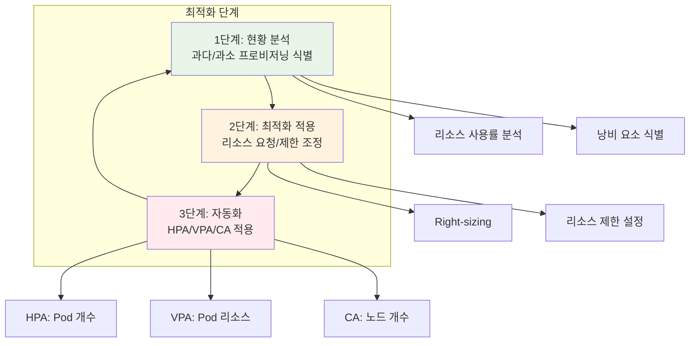

# Week 4 Day 5 Session 1: FinOps 문화와 Kubernetes 비용 최적화

<div align="center">

**💰 FinOps 프레임워크** • **📊 비용 가시성** • **⚙️ 리소스 최적화**

*클라우드 비용 관리의 체계적 접근법*

</div>

---

## 🕘 세션 정보
**시간**: 09:00-09:50 (50분)
**목표**: FinOps 문화 이해와 Kubernetes 환경의 비용 최적화 전략 습득
**방식**: 이론 설명 + 실무 사례 + 페어 토론

## 🎯 세션 목표

### 📚 학습 목표
- **이해 목표**: FinOps 프레임워크의 3단계 사이클 완전 이해
- **적용 목표**: Kubernetes 환경의 비용 가시성 확보 방법
- **협업 목표**: 팀 내 비용 최적화 문화 구축 방안 토론

### 🤔 왜 필요한가? (5분)

**현실 문제 상황**:
- 💼 **실무 시나리오**: "클라우드 비용이 매달 예상보다 30% 초과되는데 원인을 모르겠어요"
- 🏠 **일상 비유**: "전기세가 많이 나오는데 어느 가전제품이 전기를 많이 쓰는지 모르는 상황"
- ☁️ **AWS 아키텍처**: "EKS 클러스터 비용이 월 $10,000인데 어떤 서비스가 얼마나 쓰는지 불명확"
- 📊 **시장 동향**: "Gartner 조사: 기업의 평균 클라우드 비용 낭비율 35%"

**학습 전후 비교**:


---

## 📖 핵심 개념 (35분)

### 🔍 개념 1: FinOps 프레임워크 (12분)

> **정의**: FinOps(Financial Operations)는 클라우드 비용을 최적화하고 관리하기 위한 조직적, 기술적, 문화적 접근법

**FinOps 3단계 사이클**:


**1️⃣ Inform (정보 수집)**:
- **비용 가시성**: 실시간 비용 추적 및 대시보드
- **할당 및 태깅**: 팀/프로젝트/환경별 비용 분류
- **예측 및 예산**: 미래 비용 예측 및 예산 설정

**2️⃣ Optimize (최적화)**:
- **리소스 최적화**: 과다/과소 프로비저닝 식별 및 조정
- **예약 인스턴스**: 장기 사용 리소스의 할인 구매
- **자동 스케일링**: 수요에 따른 동적 리소스 조정

**3️⃣ Operate (운영)**:
- **정책 및 거버넌스**: 비용 관리 정책 수립 및 시행
- **자동화**: 비용 최적화 작업 자동화
- **지속적 개선**: 정기적 리뷰 및 개선

**FinOps 팀 구성**:


### 🔍 개념 2: Kubernetes 비용 가시성 (12분)

> **정의**: Kubernetes 환경에서 클러스터, 네임스페이스, Pod 단위로 비용을 추적하고 분석하는 능력

**비용 계층 구조**:


**비용 구성 요소**:

1. **컴퓨팅 비용**:
   - **CPU**: vCPU 시간당 비용
   - **Memory**: GB 시간당 비용
   - **GPU**: GPU 시간당 비용 (해당 시)

2. **스토리지 비용**:
   - **PV (Persistent Volume)**: GB 월별 비용
   - **EBS/EFS**: 스토리지 타입별 비용
   - **백업**: 스냅샷 및 백업 비용

3. **네트워크 비용**:
   - **데이터 전송**: 인터넷 아웃바운드 비용
   - **로드밸런서**: ALB/NLB 시간당 비용
   - **NAT Gateway**: 데이터 처리 비용

**비용 추적 방법**:
```yaml
# Pod에 비용 추적을 위한 라벨 추가
apiVersion: v1
kind: Pod
metadata:
  name: web-app
  labels:
    app: web
    team: frontend
    project: cloudmart
    environment: production
    cost-center: "CC-1001"
spec:
  containers:
  - name: app
    image: web-app:v1.0
    resources:
      requests:
        cpu: 100m
        memory: 128Mi
      limits:
        cpu: 500m
        memory: 512Mi
```

**Kubecost 비용 분석**:


### 🔍 개념 3: 리소스 최적화 전략 (11분)

> **정의**: Kubernetes 환경에서 리소스 요청/제한을 최적화하고 자동 스케일링을 통해 비용을 절감하는 전략

**리소스 최적화 3단계**:


**1. Right-sizing (적정 크기 조정)**:
```yaml
# Before: 과다 프로비저닝
resources:
  requests:
    cpu: 2000m      # 실제 사용: 200m (10%)
    memory: 4Gi     # 실제 사용: 512Mi (12.5%)
  limits:
    cpu: 4000m
    memory: 8Gi

# After: 최적화
resources:
  requests:
    cpu: 250m       # 실제 사용 + 25% 버퍼
    memory: 640Mi   # 실제 사용 + 25% 버퍼
  limits:
    cpu: 500m       # 2배 여유
    memory: 1Gi     # 1.5배 여유
```

**비용 절감 효과**:
- **CPU**: 2000m → 250m = 87.5% 절감
- **Memory**: 4Gi → 640Mi = 84% 절감
- **전체 비용**: 약 85% 절감 가능

**2. 자동 스케일링 전략**:


**HPA 설정 예시**:
```yaml
apiVersion: autoscaling/v2
kind: HorizontalPodAutoscaler
metadata:
  name: web-app-hpa
spec:
  scaleTargetRef:
    apiVersion: apps/v1
    kind: Deployment
    name: web-app
  minReplicas: 2
  maxReplicas: 10
  metrics:
  - type: Resource
    resource:
      name: cpu
      target:
        type: Utilization
        averageUtilization: 70
  - type: Resource
    resource:
      name: memory
      target:
        type: Utilization
        averageUtilization: 80
  behavior:
    scaleDown:
      stabilizationWindowSeconds: 300
      policies:
      - type: Percent
        value: 50
        periodSeconds: 60
    scaleUp:
      stabilizationWindowSeconds: 0
      policies:
      - type: Percent
        value: 100
        periodSeconds: 30
```

**비용 최적화 효과**:


**3. 비용 최적화 베스트 프랙티스**:

| 전략 | 방법 | 비용 절감 효과 |
|------|------|----------------|
| **Right-sizing** | 리소스 요청/제한 최적화 | 50-80% |
| **HPA** | 트래픽 기반 자동 스케일링 | 30-60% |
| **VPA** | 리소스 자동 조정 | 20-40% |
| **Spot Instances** | 저렴한 인스턴스 활용 | 60-90% |
| **예약 인스턴스** | 장기 사용 할인 | 30-70% |
| **스토리지 최적화** | 적절한 스토리지 클래스 | 20-50% |

---

## 💭 함께 생각해보기 (10분)

### 🤝 페어 토론 (5분)

**토론 주제**:
1. **비용 가시성**: "우리 팀/프로젝트의 클라우드 비용을 어떻게 추적하고 있나요?"
2. **낭비 요소**: "가장 큰 비용 낭비 요소는 무엇이라고 생각하나요?"
3. **최적화 전략**: "어떤 최적화 전략을 먼저 적용하면 좋을까요?"

**페어 활동 가이드**:
- 👥 **자유 페어링**: 비슷한 경험이나 관심사를 가진 사람끼리
- 🔄 **역할 교대**: 각자 경험과 아이디어 공유
- 📝 **핵심 정리**: 실무 적용 가능한 아이디어 메모

### 🎯 전체 공유 (5분)

**공유 내용**:
- **인사이트**: 페어 토론에서 나온 좋은 아이디어
- **질문**: 아직 이해가 어려운 부분
- **실무 연계**: 실제 업무에 적용할 수 있는 방법

### 💡 이해도 체크 질문

- ✅ "FinOps 3단계 사이클을 설명할 수 있나요?"
- ✅ "Kubernetes 비용을 어떻게 추적하나요?"
- ✅ "HPA와 VPA의 차이점은 무엇인가요?"
- ✅ "비용 최적화의 우선순위는 어떻게 정하나요?"

---

## 🎉 Fun Facts & 기업 사례

### 🏢 Netflix 사례
**문제**: 수천 개 마이크로서비스의 비용 추적 어려움
**해결**: 
- 모든 리소스에 팀/프로젝트 태그 의무화
- 실시간 비용 대시보드 구축
- 팀별 비용 예산 설정 및 알림
**결과**: 연간 $100M+ 비용 절감

### 🎵 Spotify 사례
**문제**: Pod 리소스 과다 프로비저닝
**해결**:
- VPA를 통한 자동 Right-sizing
- 사용 패턴 분석 및 최적화
- Spot Instances 적극 활용
**결과**: 30% 비용 절감, 리소스 효율 2배 향상

### 🏠 Airbnb 사례
**문제**: 피크/비피크 시간대 리소스 낭비
**해결**:
- HPA로 트래픽 기반 자동 스케일링
- 시간대별 최소/최대 Pod 수 조정
- 예약 인스턴스와 Spot 혼합 사용
**결과**: 40% 비용 절감, 성능 유지

### 📊 업계 통계
- **평균 클라우드 낭비율**: 35% (Gartner)
- **Right-sizing 효과**: 평균 50-80% 비용 절감
- **자동 스케일링 효과**: 평균 30-60% 비용 절감
- **FinOps 도입 기업**: 평균 20-30% 비용 절감

---

## 🔑 핵심 키워드

### 📝 오늘의 핵심 용어

- **FinOps (Financial Operations)**: 클라우드 비용 최적화를 위한 조직적 접근법
- **비용 가시성 (Cost Visibility)**: 실시간 비용 추적 및 분석 능력
- **Right-sizing**: 리소스 요청/제한을 실제 사용량에 맞게 조정
- **HPA (Horizontal Pod Autoscaler)**: Pod 개수 자동 조정
- **VPA (Vertical Pod Autoscaler)**: Pod 리소스 자동 조정
- **Cluster Autoscaler**: 노드 개수 자동 조정
- **Kubecost**: Kubernetes 비용 모니터링 도구
- **예약 인스턴스 (Reserved Instances)**: 장기 사용 할인 구매
- **Spot Instances**: 저렴한 임시 인스턴스

---

## 📝 세션 마무리

### ✅ 오늘 세션 성과
- FinOps 프레임워크 3단계 사이클 이해
- Kubernetes 비용 가시성 확보 방법 학습
- 리소스 최적화 전략 및 자동 스케일링 이해
- 실무 기업 사례를 통한 적용 방법 파악

### 🎯 다음 세션 준비
- **Session 2**: Week 4 핵심 개념 통합 정리
- **연결 고리**: FinOps는 모든 클라우드 네이티브 기술의 비용 측면
- **실습 연계**: Lab 1에서 Kubecost 직접 구축 및 비용 분석

---

<div align="center">

**💰 FinOps 문화** • **📊 비용 가시성** • **⚙️ 자동 최적화**

*클라우드 비용 관리의 시작은 가시성 확보부터*

**이전**: [Day 4 Session 3](../../day4/session_3.md) | **다음**: [Session 2 - Week 4 통합 정리](./session_2.md)

</div>
