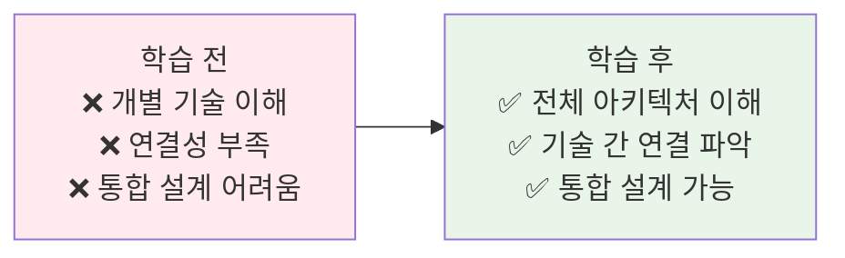
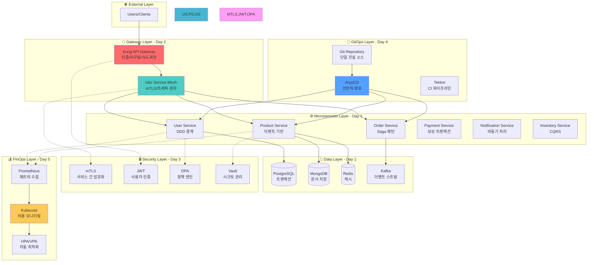
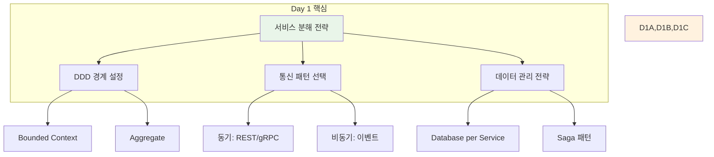
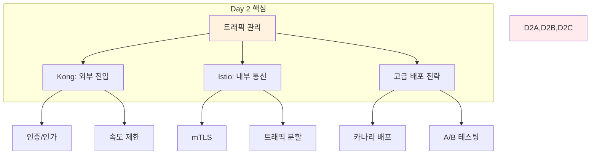
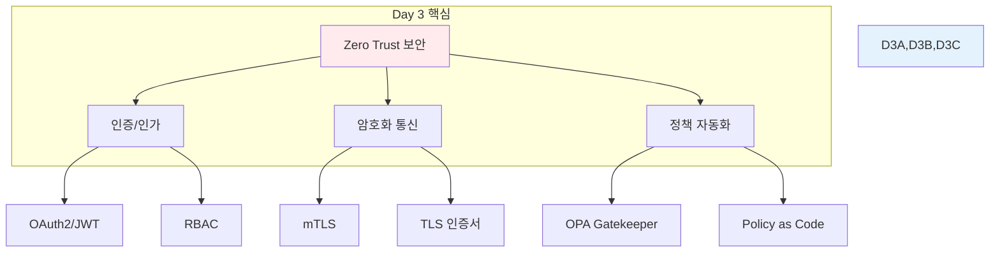
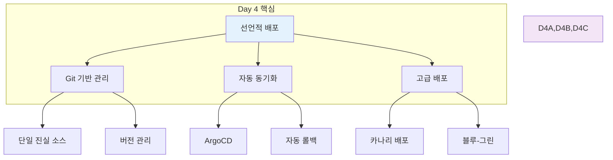
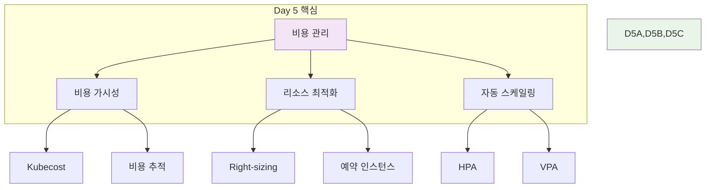
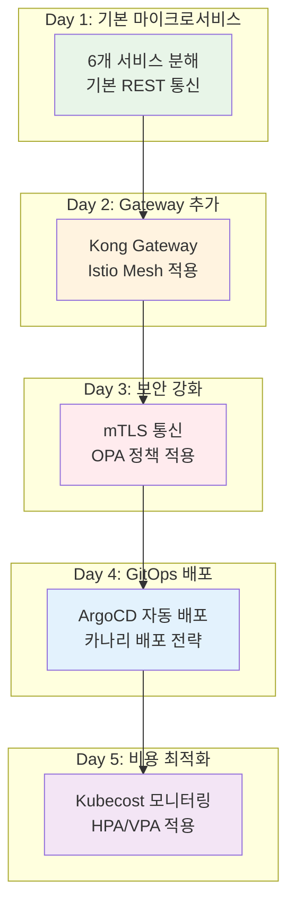

# Week 4 Day 5 Session 2: Week 4 핵심 개념 통합 정리

**🏗️ 마이크로서비스** • **🌐 API Gateway** • **🔒 보안** • **🔄 GitOps** • **💰 FinOps**

*4일간 학습한 클라우드 네이티브 개념의 종합 정리*

---

## 🕘 세션 정보
**시간**: 10:00-10:50 (50분)
**목표**: Week 4 전체 개념의 유기적 연결과 통합 이해
**방식**: 통합 정리 + 실무 연계 + 팀 토론

## 🎯 세션 목표

### 📚 학습 목표
- **이해 목표**: Day 1-5의 개념이 어떻게 연결되는지 통합적 이해
- **적용 목표**: CloudMart 프로젝트에서 모든 개념이 어떻게 적용되었는지 파악
- **협업 목표**: 팀별로 Week 4 학습 내용 정리 및 공유

### 🤔 왜 필요한가? (5분)

**현실 문제 상황**:
- 💼 **실무 시나리오**: "각 기술은 이해했는데, 실제 프로젝트에서 어떻게 통합하는지 모르겠어요"
- 🏠 **일상 비유**: "자동차 부품은 다 알지만, 어떻게 조립해서 차가 되는지 모르는 상황"
- ☁️ **AWS 아키텍처**: "EKS, API Gateway, IAM, CodePipeline을 어떻게 연결하는가?"
- 📊 **시장 동향**: "클라우드 네이티브 아키텍트는 개별 기술이 아닌 통합 설계 능력이 핵심"

**학습 전후 비교**:

---

## 📖 핵심 개념 (35분)

### 🔍 개념 1: Week 4 전체 아키텍처 통합 (12분)

> **정의**: Day 1부터 Day 5까지 학습한 모든 개념이 하나의 클라우드 네이티브 플랫폼으로 통합되는 구조

**전체 통합 아키텍처**:

**계층별 역할**:

1. **Gateway Layer (Day 2)**:
   - **Kong**: 외부 트래픽 진입점, 인증, 속도 제한
   - **Istio**: 서비스 간 통신 관리, mTLS, 트래픽 분할

2. **Microservices Layer (Day 1)**:
   - **DDD 경계**: 각 서비스의 명확한 책임
   - **통신 패턴**: 동기(REST/gRPC), 비동기(이벤트)
   - **데이터 관리**: 서비스별 독립적 데이터베이스

3. **Security Layer (Day 3)**:
   - **Zero Trust**: 모든 통신 검증
   - **mTLS**: 서비스 간 암호화 통신
   - **OPA**: 정책 기반 접근 제어

4. **GitOps Layer (Day 4)**:
   - **Git**: 모든 설정의 단일 진실 소스
   - **ArgoCD**: 자동 배포 및 동기화
   - **Tekton**: CI 파이프라인 자동화

5. **FinOps Layer (Day 5)**:
   - **Kubecost**: 실시간 비용 추적
   - **HPA/VPA**: 자동 리소스 최적화
   - **예산 관리**: 비용 알림 및 제어

### 🔍 개념 2: Day별 핵심 개념 정리 (12분)

**Day 1: 마이크로서비스 아키텍처**:

**핵심 포인트**:
- ✅ **서비스 분해**: DDD로 명확한 경계 설정
- ✅ **통신 패턴**: 동기/비동기 적절히 혼합
- ✅ **데이터 관리**: 서비스별 독립적 데이터베이스
- ✅ **트랜잭션**: Saga 패턴으로 분산 트랜잭션 관리

**Day 2: API Gateway & Service Mesh**:

**핵심 포인트**:
- ✅ **Kong**: 외부 트래픽 관리, 플러그인 확장
- ✅ **Istio**: 서비스 간 통신, Sidecar 패턴
- ✅ **트래픽 분할**: 카나리, 블루-그린, A/B 테스팅
- ✅ **관측성**: 분산 추적, 메트릭 수집

**Day 3: 보안과 컴플라이언스**:

**핵심 포인트**:
- ✅ **Zero Trust**: 모든 통신 검증, 신뢰하지 않음
- ✅ **mTLS**: 서비스 간 암호화 및 상호 인증
- ✅ **OPA**: 정책 기반 접근 제어 자동화
- ✅ **컴플라이언스**: 자동화된 정책 검증

**Day 4: GitOps와 배포 자동화**:

**핵심 포인트**:
- ✅ **GitOps**: Git을 단일 진실 소스로 사용
- ✅ **ArgoCD**: 선언적 배포 자동화
- ✅ **배포 전략**: 카나리, 블루-그린, 롤링
- ✅ **롤백**: 자동 롤백 및 복구

**Day 5: FinOps와 비용 최적화**:

**핵심 포인트**:
- ✅ **FinOps**: 비용 관리의 조직적 접근
- ✅ **Kubecost**: 실시간 비용 모니터링
- ✅ **최적화**: Right-sizing, 자동 스케일링
- ✅ **예산 관리**: 비용 알림 및 제어

### 🔍 개념 3: CloudMart 프로젝트 통합 (11분)

> **정의**: Week 4 전체 학습 내용이 CloudMart 프로젝트에서 어떻게 통합 적용되었는지 확인

**CloudMart 아키텍처 진화**:

**각 Day별 CloudMart 개선사항**:

| Day | 개선 내용 | 적용 기술 | 효과 |
|-----|----------|----------|------|
| **Day 1** | 모놀리스 → 마이크로서비스 | DDD, Saga 패턴 | 독립 배포, 확장성 |
| **Day 2** | 트래픽 관리 추가 | Kong, Istio | 카나리 배포, 관측성 |
| **Day 3** | 보안 강화 | mTLS, OPA | Zero Trust, 정책 자동화 |
| **Day 4** | 배포 자동화 | ArgoCD, GitOps | 선언적 배포, 자동 롤백 |
| **Day 5** | 비용 최적화 | Kubecost, HPA/VPA | 30-60% 비용 절감 |

**최종 CloudMart 특징**:
- ✅ **확장성**: 서비스별 독립 확장 가능
- ✅ **안정성**: 자동 롤백, 카나리 배포
- ✅ **보안**: Zero Trust, mTLS, OPA
- ✅ **효율성**: 자동 스케일링, 비용 최적화
- ✅ **관측성**: 실시간 모니터링, 분산 추적

---

## 💭 함께 생각해보기 (10분)

### 🤝 팀 토론 (7분)

**토론 주제**:
1. **통합 이해**: "Week 4의 각 기술이 어떻게 연결되어 있나요?"
2. **실무 적용**: "실제 프로젝트에서 어떤 순서로 적용하면 좋을까요?"
3. **우선순위**: "제한된 시간/리소스에서 어떤 기술을 먼저 도입해야 할까요?"

**팀 활동 가이드**:
- 👥 **팀 구성**: 3-4명씩 팀 구성
- 🗺️ **마인드맵**: Week 4 개념 연결 관계 그리기
- 📝 **실행 계획**: 실무 적용 로드맵 작성

### 🎯 전체 공유 (3분)

**공유 내용**:
- **팀별 마인드맵**: 개념 연결 관계 발표
- **실행 계획**: 실무 적용 우선순위 공유
- **질문 및 토론**: 어려운 부분 질의응답

### 💡 이해도 체크 질문

- ✅ "Week 4의 5가지 핵심 주제를 설명할 수 있나요?"
- ✅ "각 기술이 CloudMart에서 어떤 역할을 하나요?"
- ✅ "실무에서 어떤 순서로 도입하면 좋을까요?"
- ✅ "비용, 성능, 보안의 균형을 어떻게 맞추나요?"

---

## 🎉 Fun Facts & 통합 사례

### 🏢 Uber 통합 사례
**초기 (2014)**:
- 모놀리스 아키텍처
- 단일 데이터베이스
- 수동 배포

**현재 (2024)**:
- 2,200+ 마이크로서비스
- API Gateway + Service Mesh
- GitOps 자동 배포
- FinOps 비용 최적화
- **결과**: 99.99% 가용성, 30% 비용 절감

### 🎵 Spotify 진화 과정
**Phase 1**: 마이크로서비스 분해 (2015)
**Phase 2**: API Gateway 도입 (2017)
**Phase 3**: Zero Trust 보안 (2019)
**Phase 4**: GitOps 전환 (2021)
**Phase 5**: FinOps 최적화 (2023)
**결과**: 수천 개 서비스, 하루 수백 번 배포

### 📊 업계 통합 트렌드
- **마이크로서비스**: 85% 기업이 도입 (CNCF 2024)
- **Service Mesh**: 60% 기업이 사용 (Gartner)
- **GitOps**: 70% 기업이 채택 (GitLab)
- **FinOps**: 80% 기업이 필요성 인식 (FinOps Foundation)

---

## 🔑 핵심 키워드

### 📝 Week 4 통합 키워드

**아키텍처 패턴**:
- **마이크로서비스**: 서비스 분해, DDD, Saga
- **API Gateway**: Kong, Istio, 트래픽 관리
- **Zero Trust**: mTLS, OPA, 정책 자동화
- **GitOps**: ArgoCD, 선언적 배포
- **FinOps**: Kubecost, 비용 최적화

**핵심 도구**:
- **Kong**: API Gateway
- **Istio**: Service Mesh
- **OPA**: 정책 엔진
- **ArgoCD**: GitOps 배포
- **Kubecost**: 비용 모니터링

**베스트 프랙티스**:
- **서비스 분해**: DDD 경계 설정
- **통신 패턴**: 동기/비동기 혼합
- **보안**: Zero Trust 원칙
- **배포**: 카나리, 블루-그린
- **비용**: Right-sizing, 자동 스케일링

---

## 📝 세션 마무리

### ✅ 오늘 세션 성과
- Week 4 전체 아키텍처 통합 이해
- Day별 핵심 개념 정리 및 연결
- CloudMart 프로젝트의 진화 과정 파악
- 실무 적용 우선순위 및 로드맵 수립

### 🎯 다음 세션 준비
- **Session 3**: 클라우드 인프라 관리 - IaC와 AWS 기초
- **연결 고리**: Kubernetes → AWS 인프라로의 개념 전환
- **Week 5 준비**: AWS 기본 서비스 및 Terraform 학습 준비

---

**🏗️ 통합 아키텍처** • **🔗 개념 연결** • **🚀 실무 적용**

*개별 기술의 이해를 넘어 통합 설계 능력으로*

**이전**: [Session 1 - FinOps](./session_1.md) | **다음**: [Session 3 - IaC와 AWS 기초](./session_3.md)

