# Week 4 Day 5 Session 3: 클라우드 인프라 관리 - IaC와 AWS 기초

<div align="center">

**🏗️ Infrastructure as Code** • **☁️ AWS 기초** • **🔄 Kubernetes → AWS**

*Week 5 AWS 학습을 위한 체계적 준비*

</div>

---

## 🕘 세션 정보
**시간**: 11:00-11:50 (50분)
**목표**: IaC 개념 이해와 Kubernetes에서 AWS로의 개념 전환
**방식**: 이론 설명 + 도구 비교 + Week 5 준비

## 🎯 세션 목표

### 📚 학습 목표
- **이해 목표**: Infrastructure as Code의 개념과 필요성 이해
- **적용 목표**: IaC 도구별 특징과 선택 기준 파악
- **협업 목표**: Kubernetes 개념을 AWS 서비스로 매핑하는 능력

### 🤔 왜 필요한가? (5분)

**현실 문제 상황**:
- 💼 **실무 시나리오**: "수동으로 인프라를 구성하다가 실수로 프로덕션 서버를 삭제했어요"
- 🏠 **일상 비유**: "레시피 없이 요리하면 매번 맛이 다르듯, 인프라도 코드로 관리해야 일관성 유지"
- ☁️ **AWS 아키텍처**: "100개 EC2 인스턴스를 수동으로 설정하는 것은 비현실적"
- 📊 **시장 동향**: "HashiCorp 조사: IaC 도입 기업의 생산성 3배 향상"

**학습 전후 비교**:
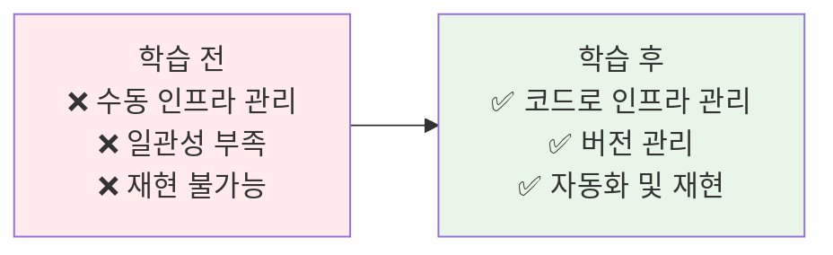

---

## 📖 핵심 개념 (35분)

### 🔍 개념 1: Infrastructure as Code (IaC) 개념 (12분)

> **정의**: 인프라를 코드로 정의하고 관리하여 자동화, 버전 관리, 재현 가능성을 확보하는 방법론

**IaC의 핵심 원칙**:
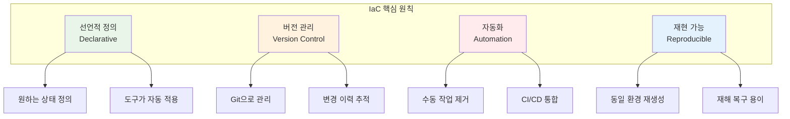

**선언적 vs 명령형**:
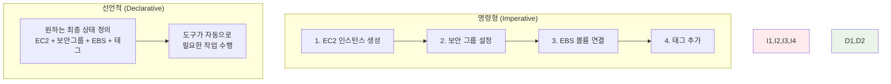

**명령형 예시 (Bash)**:
```bash
# 명령형: 단계별 명령어 실행
aws ec2 create-security-group --group-name web-sg
aws ec2 authorize-security-group-ingress --group-name web-sg --port 80
aws ec2 run-instances --image-id ami-12345 --security-groups web-sg
aws ec2 create-tags --resources i-12345 --tags Key=Name,Value=WebServer
```

**선언적 예시 (Terraform)**:
```hcl
# 선언적: 원하는 최종 상태 정의
resource "aws_security_group" "web" {
  name = "web-sg"
  
  ingress {
    from_port   = 80
    to_port     = 80
    protocol    = "tcp"
    cidr_blocks = ["0.0.0.0/0"]
  }
}

resource "aws_instance" "web" {
  ami           = "ami-12345"
  instance_type = "t3.micro"
  security_groups = [aws_security_group.web.name]
  
  tags = {
    Name = "WebServer"
  }
}
```

**IaC의 장점**:
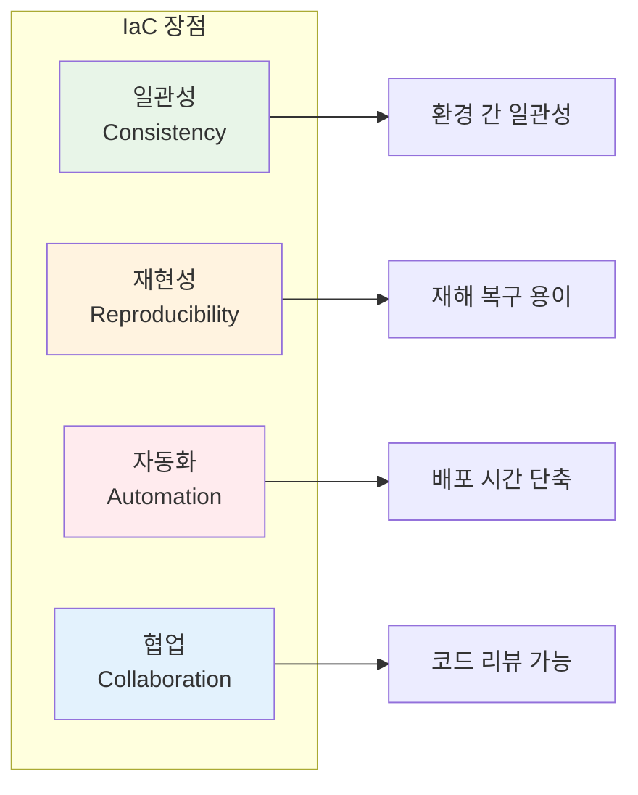

### 🔍 개념 2: IaC 도구 비교 및 선택 기준 (12분)

> **정의**: Terraform, CloudFormation, Pulumi, Ansible 등 주요 IaC 도구의 특징과 선택 기준

**주요 IaC 도구 비교**:
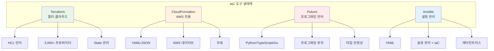

**도구별 상세 비교**:

| 특징 | Terraform | CloudFormation | Pulumi | Ansible |
|------|-----------|----------------|--------|---------|
| **언어** | HCL | YAML/JSON | Python/TS/Go | YAML |
| **클라우드** | 멀티 | AWS 전용 | 멀티 | 멀티 |
| **학습 곡선** | 중간 | 쉬움 | 어려움 | 쉬움 |
| **커뮤니티** | 매우 큼 | 큼 | 성장 중 | 매우 큼 |
| **비용** | 무료/유료 | 무료 | 무료/유료 | 무료/유료 |
| **State 관리** | 필요 | AWS 관리 | 필요 | 불필요 |
| **주요 용도** | 인프라 | AWS 인프라 | 인프라 | 설정 관리 |

**Terraform 예시**:
```hcl
# Terraform: HCL 언어
provider "aws" {
  region = "us-east-1"
}

resource "aws_vpc" "main" {
  cidr_block = "10.0.0.0/16"
  
  tags = {
    Name = "main-vpc"
  }
}

resource "aws_subnet" "public" {
  vpc_id     = aws_vpc.main.id
  cidr_block = "10.0.1.0/24"
  
  tags = {
    Name = "public-subnet"
  }
}
```

**CloudFormation 예시**:
```yaml
# CloudFormation: YAML
AWSTemplateFormatVersion: '2010-09-09'
Resources:
  MainVPC:
    Type: AWS::EC2::VPC
    Properties:
      CidrBlock: 10.0.0.0/16
      Tags:
        - Key: Name
          Value: main-vpc
  
  PublicSubnet:
    Type: AWS::EC2::Subnet
    Properties:
      VpcId: !Ref MainVPC
      CidrBlock: 10.0.1.0/24
      Tags:
        - Key: Name
          Value: public-subnet
```

**Pulumi 예시**:
```python
# Pulumi: Python
import pulumi
import pulumi_aws as aws

vpc = aws.ec2.Vpc("main",
    cidr_block="10.0.0.0/16",
    tags={"Name": "main-vpc"}
)

subnet = aws.ec2.Subnet("public",
    vpc_id=vpc.id,
    cidr_block="10.0.1.0/24",
    tags={"Name": "public-subnet"}
)
```

**선택 기준**:
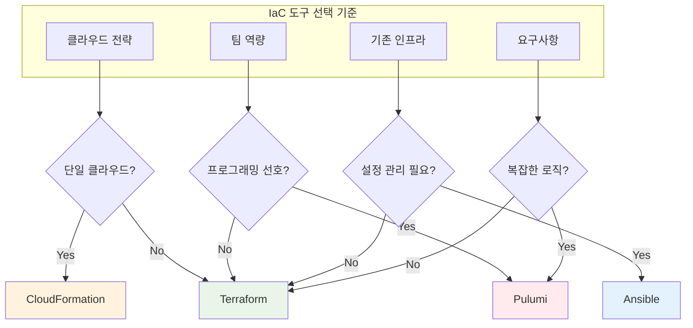

**실무 권장사항**:
- **스타트업/중소기업**: Terraform (멀티 클라우드 대비)
- **AWS 전용 기업**: CloudFormation (네이티브 통합)
- **개발자 중심 팀**: Pulumi (프로그래밍 언어)
- **설정 관리 중심**: Ansible (서버 설정 + IaC)

### 🔍 개념 3: Kubernetes → AWS 개념 매핑 (11분)

> **정의**: Kubernetes의 핵심 개념을 AWS 서비스로 매핑하여 Week 5 학습 준비

**전체 매핑 구조**:
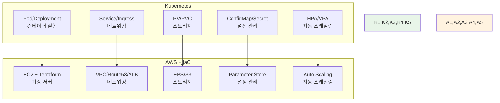

**1. 컴퓨팅: Pod/Deployment → EC2**:
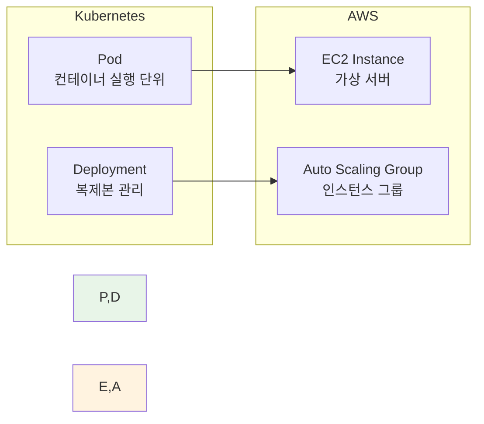

**Kubernetes Deployment**:
```yaml
apiVersion: apps/v1
kind: Deployment
metadata:
  name: web-app
spec:
  replicas: 3
  template:
    spec:
      containers:
      - name: app
        image: nginx:alpine
        ports:
        - containerPort: 80
```

**AWS EC2 + Auto Scaling (Terraform)**:
```hcl
resource "aws_launch_template" "web" {
  name_prefix   = "web-"
  image_id      = "ami-12345"  # Amazon Linux 2
  instance_type = "t3.micro"
}

resource "aws_autoscaling_group" "web" {
  name                = "web-asg"
  min_size            = 3
  max_size            = 10
  desired_capacity    = 3
  launch_template {
    id      = aws_launch_template.web.id
    version = "$Latest"
  }
}
```

**2. 네트워킹: Service/Ingress → VPC/Route53/ALB**:
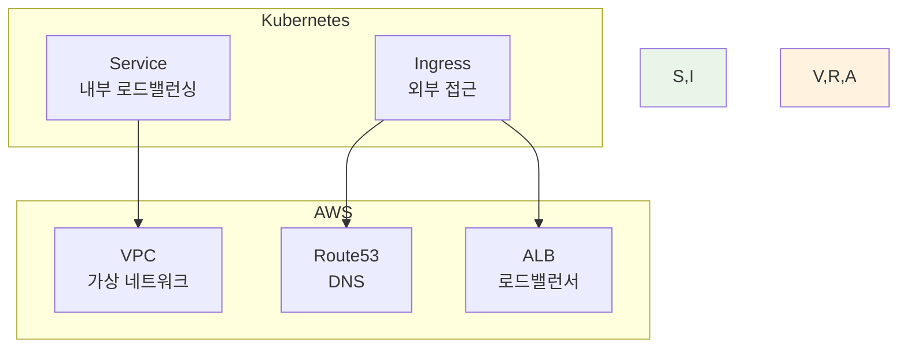

**Kubernetes Service + Ingress**:
```yaml
apiVersion: v1
kind: Service
metadata:
  name: web-service
spec:
  type: ClusterIP
  ports:
  - port: 80
    targetPort: 80
---
apiVersion: networking.k8s.io/v1
kind: Ingress
metadata:
  name: web-ingress
spec:
  rules:
  - host: www.example.com
    http:
      paths:
      - path: /
        backend:
          service:
            name: web-service
            port:
              number: 80
```

**AWS VPC + Route53 + ALB (Terraform)**:
```hcl
resource "aws_vpc" "main" {
  cidr_block = "10.0.0.0/16"
}

resource "aws_lb" "web" {
  name               = "web-alb"
  load_balancer_type = "application"
  subnets            = aws_subnet.public[*].id
}

resource "aws_route53_record" "web" {
  zone_id = aws_route53_zone.main.zone_id
  name    = "www.example.com"
  type    = "A"
  
  alias {
    name                   = aws_lb.web.dns_name
    zone_id                = aws_lb.web.zone_id
    evaluate_target_health = true
  }
}
```

**3. 스토리지: PV/PVC → EBS/S3**:
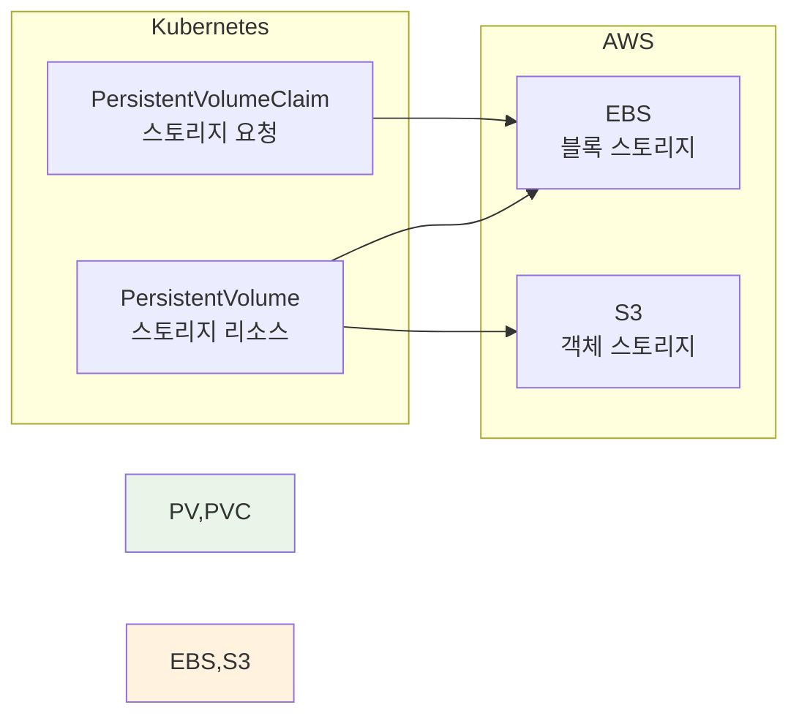

**Kubernetes PV/PVC**:
```yaml
apiVersion: v1
kind: PersistentVolumeClaim
metadata:
  name: data-pvc
spec:
  accessModes:
  - ReadWriteOnce
  resources:
    requests:
      storage: 10Gi
  storageClassName: gp3
```

**AWS EBS (Terraform)**:
```hcl
resource "aws_ebs_volume" "data" {
  availability_zone = "us-east-1a"
  size              = 10
  type              = "gp3"
  
  tags = {
    Name = "data-volume"
  }
}

resource "aws_volume_attachment" "data" {
  device_name = "/dev/sdf"
  volume_id   = aws_ebs_volume.data.id
  instance_id = aws_instance.web.id
}
```

**개념 매핑 요약**:

| Kubernetes | AWS 서비스 | 역할 |
|------------|-----------|------|
| **Pod** | EC2 Instance | 컨테이너/애플리케이션 실행 |
| **Deployment** | Auto Scaling Group | 복제본 관리 및 자동 확장 |
| **Service** | VPC + Security Group | 내부 네트워킹 |
| **Ingress** | ALB + Route53 | 외부 접근 및 라우팅 |
| **PV/PVC** | EBS/EFS/S3 | 데이터 영속성 |
| **ConfigMap** | Parameter Store | 설정 관리 |
| **Secret** | Secrets Manager | 민감 정보 관리 |
| **HPA** | Auto Scaling Policy | 자동 스케일링 |

---

## 💭 함께 생각해보기 (10분)

### 🤝 페어 토론 (5분)

**토론 주제**:
1. **IaC 도입**: "우리 팀에 어떤 IaC 도구가 적합할까요?"
2. **개념 전환**: "Kubernetes 개념을 AWS로 전환할 때 가장 어려운 부분은?"
3. **Week 5 준비**: "AWS 학습에서 가장 먼저 배워야 할 것은?"

**페어 활동 가이드**:
- 👥 **자유 페어링**: 관심사나 경험이 비슷한 사람끼리
- 🔄 **역할 교대**: 각자 생각과 경험 공유
- 📝 **핵심 정리**: Week 5 학습 계획 메모

### 🎯 전체 공유 (5분)

**공유 내용**:
- **도구 선택**: 팀별 IaC 도구 선택 이유
- **개념 매핑**: Kubernetes → AWS 전환 시 주의사항
- **학습 계획**: Week 5 학습 우선순위

### 💡 이해도 체크 질문

- ✅ "IaC의 핵심 원칙 4가지를 설명할 수 있나요?"
- ✅ "Terraform과 CloudFormation의 차이점은?"
- ✅ "Kubernetes Pod는 AWS의 어떤 서비스와 대응되나요?"
- ✅ "Week 5에서 가장 먼저 배울 AWS 서비스는?"

---

## 🎉 Fun Facts & Week 5 준비

### 🏢 HashiCorp (Terraform 개발사)
**창립**: 2012년
**Terraform 출시**: 2014년
**현재**: 3,000+ 프로바이더, 100M+ 다운로드
**영향**: IaC 표준으로 자리잡음

### ☁️ AWS CloudFormation
**출시**: 2011년 (Terraform보다 3년 빠름)
**특징**: AWS 네이티브, 무료
**사용**: AWS 전용 기업에서 선호
**통합**: AWS 서비스와 완벽한 통합

### 📊 IaC 도입 효과
- **배포 시간**: 수동 대비 10배 빠름
- **오류 감소**: 수동 대비 90% 감소
- **일관성**: 환경 간 100% 일관성
- **재해 복구**: 수 시간 → 수 분

### 🎯 Week 5 학습 로드맵
**Day 1-2**: AWS 기초 서비스
- EC2, VPC, EBS, Route53, S3, CloudFront
- 실습: 수동으로 인프라 구축

**Day 3-4**: Terraform 기초
- HCL 문법, 리소스 정의
- 실습: Terraform으로 인프라 자동화

**Day 5**: Docker Compose + Terraform 통합
- 컨테이너 + 인프라 통합 관리
- 실습: 전체 스택 배포

---

## 🔑 핵심 키워드

### 📝 오늘의 핵심 용어

**IaC 개념**:
- **Infrastructure as Code**: 인프라를 코드로 관리
- **선언적 (Declarative)**: 원하는 상태 정의
- **명령형 (Imperative)**: 단계별 명령 실행
- **State 관리**: 현재 인프라 상태 추적

**IaC 도구**:
- **Terraform**: 멀티 클라우드 IaC 도구
- **CloudFormation**: AWS 전용 IaC 서비스
- **Pulumi**: 프로그래밍 언어 기반 IaC
- **Ansible**: 설정 관리 + IaC

**AWS 서비스**:
- **EC2**: 가상 서버 인스턴스
- **VPC**: 가상 프라이빗 클라우드
- **EBS**: 블록 스토리지
- **S3**: 객체 스토리지
- **Route53**: DNS 서비스
- **ALB**: Application Load Balancer

---

## 📝 세션 마무리

### ✅ 오늘 세션 성과
- IaC 개념과 필요성 완전 이해
- 주요 IaC 도구 비교 및 선택 기준 파악
- Kubernetes → AWS 개념 매핑 완료
- Week 5 학습 준비 완료

### 🎯 Week 5 준비사항
- **예습**: AWS 기본 서비스 개념 (EC2, VPC)
- **환경**: AWS 계정 준비 (Free Tier 가입)
- **도구**: Terraform 설치 준비
- **복습**: Kubernetes 핵심 개념 정리

### 📊 Week 4 완료 및 Week 5 시작
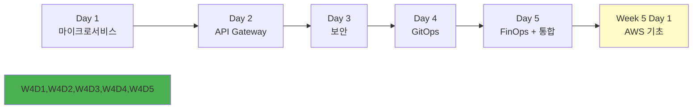

---

<div align="center">

**🏗️ IaC 마스터** • **☁️ AWS 준비 완료** • **🔄 개념 전환**

*Kubernetes에서 AWS로, 클라우드 네이티브 여정의 확장*

**이전**: [Session 2 - Week 4 통합 정리](./session_2.md) | **다음**: [Lab 1 - Kubecost 비용 모니터링](./lab_1.md)

</div>
