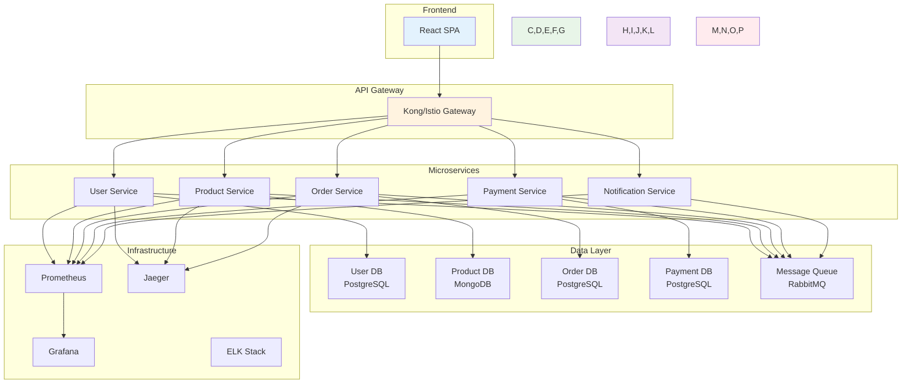
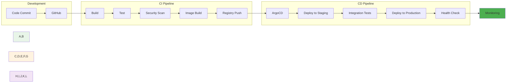

# Week 5: 클라우드 네이티브 & CI/CD

**🌐 클라우드 네이티브 아키텍처** • **🔄 CI/CD 파이프라인** • **🚀 GitOps**

*마이크로서비스부터 자동화 배포까지, 현대적 소프트웨어 개발의 완성*

---

## 🎯 주간 학습 목표 (5일 구성)

### 📚 전체 공통 목표
> **클라우드 네이티브 아키텍처 설계 원칙을 이해하고, CI/CD 파이프라인을 구축하여 현대적 소프트웨어 개발 워크플로우를 완성한다**

### 🎪 협업 중심 학습
- **모든 학생 함께**: 복잡한 마이크로서비스 아키텍처를 팀으로 설계
- **자연스러운 역할 분담**: DevOps 파이프라인의 다양한 역할 체험
- **상호 학습**: CI/CD 도구와 GitOps 패턴을 함께 탐구
- **실무 연계**: 실제 기업에서 사용하는 배포 전략과 동일한 경험

---

## 📅 일일 학습 계획 (5일 구성)

### [Day 1: 마이크로서비스 아키텍처 & API Gateway](./day1/README.md)
**🎯 목표**: 클라우드 네이티브 마이크로서비스 아키텍처 설계 및 구현

#### 📚 이론 강의 (2.5시간)
- **Session 1**: 마이크로서비스 아키텍처 설계 원칙
- **Session 2**: API Gateway 패턴과 구현
- **Session 3**: 서비스 간 통신과 데이터 일관성

#### 🛠️ 실습 챌린지 (3시간)
- **Phase 1**: 모놀리스 애플리케이션 분해
- **Phase 2**: API Gateway 구축 및 라우팅 설정
- **Phase 3**: 서비스 간 통신 구현

---

### [Day 2: 데이터 관리와 상태 관리](./day2/README.md)
**🎯 목표**: 분산 시스템에서의 데이터 관리와 상태 관리 전문성 확보

#### 📚 이론 강의 (2.5시간)
- **Session 1**: 분산 데이터베이스 패턴
- **Session 2**: 이벤트 소싱과 CQRS
- **Session 3**: 상태 관리와 분산 트랜잭션

#### 🛠️ 실습 챌린지 (3시간)
- **Phase 1**: 데이터베이스 분리 및 마이그레이션
- **Phase 2**: 이벤트 기반 아키텍처 구현
- **Phase 3**: 분산 트랜잭션 처리

---

### [Day 3: CI/CD 개념과 Git 워크플로우](./day3/README.md)
**🎯 목표**: 현대적 CI/CD 파이프라인 설계 및 Git 기반 워크플로우 구축

#### 📚 이론 강의 (2.5시간)
- **Session 1**: CI/CD 파이프라인 설계 원칙
- **Session 2**: Git 워크플로우와 브랜치 전략
- **Session 3**: 테스트 자동화와 품질 게이트

#### 🛠️ 실습 챌린지 (3시간)
- **Phase 1**: GitHub Actions CI/CD 파이프라인 구축
- **Phase 2**: 다양한 테스트 단계 통합
- **Phase 3**: 품질 게이트와 승인 프로세스

---

### [Day 4: 컨테이너 기반 배포와 GitOps](./day4/README.md)
**🎯 목표**: 컨테이너 기반 배포 전략과 GitOps 패턴 완전 이해

#### 📚 이론 강의 (2.5시간)
- **Session 1**: 컨테이너 배포 전략 (Blue-Green, Canary, Rolling)
- **Session 2**: GitOps 개념과 ArgoCD
- **Session 3**: 선언적 배포와 상태 관리

#### 🛠️ 실습 챌린지 (3시간)
- **Phase 1**: 다양한 배포 전략 구현
- **Phase 2**: ArgoCD 설치 및 GitOps 파이프라인 구축
- **Phase 3**: 자동화된 배포와 롤백 시스템

---

### [Day 5: 보안과 컴플라이언스 & FinOps](./day5/README.md)
**🎯 목표**: DevSecOps 통합과 클라우드 비용 최적화 전문성 확보

#### 📚 이론 강의 (2.5시간)
- **Session 1**: DevSecOps와 보안 자동화
- **Session 2**: 컴플라이언스와 정책 관리
- **Session 3**: FinOps와 클라우드 비용 최적화

#### 🛠️ 실습 챌린지 (3시간)
- **Phase 1**: 보안 스캔과 정책 자동화
- **Phase 2**: 컴플라이언스 체크 파이프라인
- **Phase 3**: 비용 모니터링과 최적화 시스템

---

## 🛠️ 주간 통합 프로젝트

### 🎯 프로젝트 목표
**"완전한 클라우드 네이티브 플랫폼 구축"**
- 마이크로서비스 아키텍처 기반 전자상거래 플랫폼
- GitOps 기반 자동화된 CI/CD 파이프라인
- 보안, 모니터링, 비용 최적화가 통합된 운영 환경

### 📋 프로젝트 요구사항
1. **아키텍처**: 5개 이상 마이크로서비스 + API Gateway
2. **데이터**: 서비스별 독립적 데이터베이스 + 이벤트 기반 통신
3. **CI/CD**: GitHub Actions + ArgoCD GitOps 파이프라인
4. **배포**: Blue-Green, Canary 배포 전략 구현
5. **보안**: DevSecOps 파이프라인 + 정책 자동화
6. **모니터링**: 분산 추적 + 비즈니스 메트릭
7. **FinOps**: 리소스 최적화 + 비용 모니터링

### 🏗️ 아키텍처 예시

### 🔄 CI/CD 파이프라인

---

## 📊 주간 평가 기준

### ✅ 이해도 평가
- **아키텍처 설계**: 마이크로서비스 분해와 설계 능력
- **API 관리**: API Gateway와 서비스 간 통신 구현
- **데이터 관리**: 분산 데이터베이스와 이벤트 기반 아키텍처
- **CI/CD**: 자동화된 파이프라인 구축과 배포 전략
- **보안**: DevSecOps 통합과 정책 자동화
- **운영**: 모니터링, 로깅, 비용 최적화

### 🎯 성공 지표
- **마이크로서비스**: 5개 이상 독립적 서비스 구축
- **API Gateway**: 통합된 API 관리와 라우팅
- **CI/CD**: 완전 자동화된 배포 파이프라인
- **GitOps**: ArgoCD 기반 선언적 배포
- **보안**: 자동화된 보안 스캔과 정책 적용
- **모니터링**: 분산 추적과 비즈니스 메트릭
- **팀 협업**: 복잡한 시스템의 협업 구축

### 📋 평가 체크리스트
- [ ] 마이크로서비스 아키텍처 설계 및 구현
- [ ] API Gateway를 통한 통합 API 관리
- [ ] 이벤트 기반 서비스 간 통신 구현
- [ ] GitHub Actions CI 파이프라인 구축
- [ ] ArgoCD GitOps CD 파이프라인 구축
- [ ] Blue-Green 또는 Canary 배포 전략 구현
- [ ] DevSecOps 보안 자동화 적용
- [ ] 분산 추적과 모니터링 시스템 구축
- [ ] FinOps 비용 최적화 구현

---

## 🤝 협업 학습 하이라이트

### 🌟 클라우드 네이티브 팀워크
- **아키텍처팀**: 마이크로서비스 설계와 API 정의
- **개발팀**: 서비스별 개발과 통합
- **데이터팀**: 데이터베이스 설계와 이벤트 스키마
- **DevOps팀**: CI/CD 파이프라인과 인프라 자동화
- **보안팀**: DevSecOps와 정책 관리
- **운영팀**: 모니터링과 비용 최적화

### 🔄 실무 시나리오 기반 협업
- **기능 개발**: 새로운 마이크로서비스 추가
- **배포 전략**: 무중단 배포와 롤백 시나리오
- **장애 대응**: 분산 시스템 장애 진단과 복구
- **성능 최적화**: 병목 지점 분석과 개선
- **보안 강화**: 취약점 발견과 자동 수정
- **비용 최적화**: 리소스 사용량 분석과 최적화

### 🎯 전문성 발현 기회
- **솔루션 아키텍트**: 전체 시스템 아키텍처 설계
- **마이크로서비스 전문가**: 서비스 분해와 통합
- **DevOps 엔지니어**: CI/CD 파이프라인 구축
- **플랫폼 엔지니어**: 개발자 경험 향상
- **보안 전문가**: DevSecOps 통합
- **SRE**: 안정성과 성능 최적화

---

## 🔗 다음 주 연결

### 🚀 Week 6 준비사항
- 클라우드 네이티브 아키텍처 경험 정리
- 최신 DevOps 트렌드 조사
- 플랫폼 엔지니어링 개념 학습

### 📚 추천 학습 자료
- [12-Factor App](https://12factor.net/)
- [Microservices Patterns](https://microservices.io/)
- [GitOps Principles](https://opengitops.dev/)
- [CNCF Cloud Native Trail Map](https://github.com/cncf/trailmap)

### 🎯 심화 학습 주제 (개인별 관심사에 따라)
- **아키텍처**: 이벤트 기반 아키텍처, 서비스 메시
- **데이터**: 분산 데이터베이스, 이벤트 소싱
- **CI/CD**: 고급 배포 전략, 테스트 자동화
- **보안**: Zero Trust, 정책 엔진
- **운영**: SRE, 카오스 엔지니어링

---

## 📝 주간 회고

### 🤔 회고 질문
1. 마이크로서비스 아키텍처의 복잡성을 어떻게 관리했나요?
2. CI/CD 파이프라인 구축에서 가장 어려웠던 점은?
3. GitOps 패턴이 기존 배포 방식과 어떻게 다른가요?
4. 팀 협업에서 어떤 새로운 역할을 경험했나요?

### 📈 개선 포인트
- 마이크로서비스 간 의존성 관리
- CI/CD 파이프라인의 복잡성 해결
- 분산 시스템 디버깅과 모니터링
- 팀 간 커뮤니케이션과 협업 방식

### 🎉 성취 사항
- 클라우드 네이티브 아키텍처 설계 경험
- 완전 자동화된 CI/CD 파이프라인 구축
- GitOps 기반 선언적 배포 시스템
- DevSecOps 통합 보안 자동화
- 팀워크를 통한 복잡한 시스템 구축

---

**🌐 클라우드 네이티브 아키텍트** • **🔄 CI/CD 전문가** • **🚀 GitOps 마스터**

*Week 5를 통해 현대적 소프트웨어 개발의 완전한 워크플로우를 구축했습니다*

**이전 주**: [Week 4 - Kubernetes 운영과 관리](../week_04/README.md) | **다음 주**: [Week 6 - 최신 DevOps 트렌드 & 통합](../week_06/README.md)

