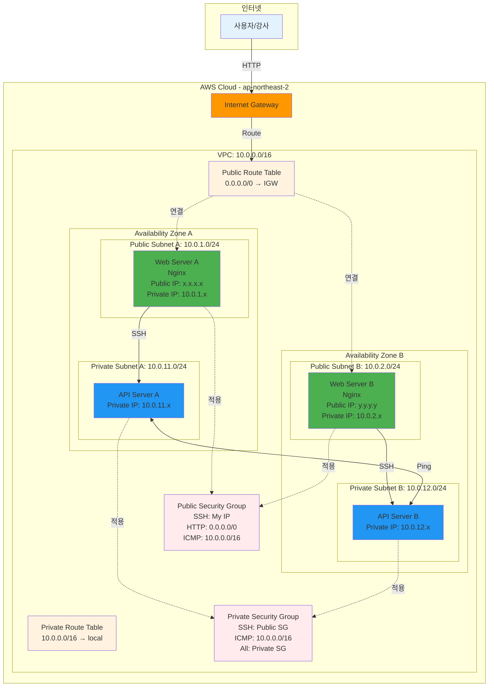

# Week 5 Day 1 Challenge 1: 커뮤니티 사이트 인프라 구축

<div align="center">

**🚀 실전 구축** • **🔍 문제 해결** • **✅ 검증**

*Lab 1 + Lab 2를 통합하여 실제 서비스 인프라 구축*

</div>

---

## 🕘 Challenge 정보
**시간**: 15:00-15:50 (50분)
**목표**: 커뮤니티 사이트를 위한 AWS 인프라 완전 구축
**방식**: 요구사항만 제시 (단계별 가이드 없음)
**난이도**: ⭐⭐⭐ (중간)

## 🎯 Challenge 목표
- Lab 1, 2에서 배운 내용을 통합 적용
- 실제 접속 가능한 웹 서버 배포
- **강사가 직접 접속할 수 있는 URL 제공**
- 상세한 아키텍처 다이어그램 작성

---

## 📖 시나리오

### 배경
당신은 "DevOps 커뮤니티" 사이트의 인프라 담당자입니다. 
강사(고객)가 직접 사이트에 접속하여 확인할 수 있도록 완전한 인프라를 구축하세요.

**구조**:
- **웹 서버**: 사용자가 직접 접근하는 프론트엔드 (Public)
- **API 서버**: 백엔드 로직 처리 (Private)
- **고가용성**: 장애 대비 Multi-AZ 구성
- **접속 가능**: 강사가 브라우저로 직접 확인

### 요구사항 명세서

#### 🔧 사전 준비
**기존 리소스 정리**:
- Lab 1, Lab 2에서 생성한 모든 리소스 삭제
- VPC 삭제 순서:
  1. EC2 인스턴스 종료 (Lab 2)
  2. Security Group 삭제
  3. Internet Gateway 분리 및 삭제
  4. Subnet 삭제
  5. Route Table 삭제 (Public RT)
  6. VPC 삭제

**새로운 명명 규칙**:
- VPC 이름: `[username]-challenge-vpc`
- Subnet 이름: `[username]-challenge-public-a` 등
- Security Group: `[username]-challenge-public-sg` 등
- EC2 이름: `[username]-challenge-web-a` 등

**💡 왜 새로 만드나요?**:
- Challenge는 독립적인 평가 환경
- 깨끗한 상태에서 시작
- 실수로 인한 기존 설정 영향 방지

#### 📋 네트워크 인프라
- **VPC**: 10.0.0.0/16
- **Availability Zone**: 2개 (ap-northeast-2a, ap-northeast-2b)
- **Subnet**: 총 4개
  - Public Subnet A: 10.0.1.0/24 (AZ-A)
  - Public Subnet B: 10.0.2.0/24 (AZ-B)
  - Private Subnet A: 10.0.11.0/24 (AZ-A)
  - Private Subnet B: 10.0.12.0/24 (AZ-B)
- **Internet Gateway**: Public Subnet 외부 통신
- **Route Table**: Public/Private 분리

#### 💻 서버 구성
- **Public EC2 (웹 서버)**: 2대
  - 위치: Public Subnet A, B (각 1대)
  - 인스턴스 타입: t2.micro
  - AMI: Amazon Linux 2023
  - 웹 서버: Nginx 설치 및 실행
  - **커스터마이징**: 본인 정보가 표시되는 웹 페이지
  - 접근: 외부에서 HTTP 접속 가능

- **Private EC2 (API 서버)**: 2대
  - 위치: Private Subnet A, B (각 1대)
  - 인스턴스 타입: t2.micro
  - AMI: Amazon Linux 2023
  - 접근: Public EC2에서만 SSH 가능

#### 🎨 웹 페이지 요구사항
**Public EC2의 Nginx 페이지에 다음 정보 표시**:
```html
<!DOCTYPE html>
<html>
<head>
    <title>DevOps 커뮤니티</title>
    <style>
        body {
            font-family: Arial, sans-serif;
            max-width: 800px;
            margin: 50px auto;
            padding: 20px;
            background-color: #f0f0f0;
        }
        .container {
            background-color: white;
            padding: 30px;
            border-radius: 10px;
            box-shadow: 0 2px 10px rgba(0,0,0,0.1);
        }
        h1 { color: #333; }
        .info { margin: 10px 0; }
        .label { font-weight: bold; color: #666; }
    </style>
</head>
<body>
    <div class="container">
        <h1>🚀 DevOps 커뮤니티</h1>
        <div class="info">
            <span class="label">챌린저 이름:</span> [본인 이름]
        </div>
        <div class="info">
            <span class="label">서버 위치:</span> [AZ-A 또는 AZ-B]
        </div>
        <div class="info">
            <span class="label">인스턴스 ID:</span> [EC2 Instance ID]
        </div>
        <div class="info">
            <span class="label">Private IP:</span> [Private IP 주소]
        </div>
        <div class="info">
            <span class="label">구축 일시:</span> [날짜 및 시간]
        </div>
    </div>
</body>
</html>
```

**User Data 예시**:
```bash
#!/bin/bash
# Nginx 설치
yum update -y
yum install -y nginx

# 커스텀 페이지 생성
INSTANCE_ID=$(ec2-metadata --instance-id | cut -d " " -f 2)
PRIVATE_IP=$(ec2-metadata --local-ipv4 | cut -d " " -f 2)
AZ=$(ec2-metadata --availability-zone | cut -d " " -f 2)

cat > /usr/share/nginx/html/index.html <<EOF
<!DOCTYPE html>
<html>
<head>
    <title>DevOps 커뮤니티</title>
    <style>
        body {
            font-family: Arial, sans-serif;
            max-width: 800px;
            margin: 50px auto;
            padding: 20px;
            background-color: #f0f0f0;
        }
        .container {
            background-color: white;
            padding: 30px;
            border-radius: 10px;
            box-shadow: 0 2px 10px rgba(0,0,0,0.1);
        }
        h1 { color: #333; }
        .info { margin: 10px 0; }
        .label { font-weight: bold; color: #666; }
    </style>
</head>
<body>
    <div class="container">
        <h1>🚀 DevOps 커뮤니티</h1>
        <div class="info">
            <span class="label">챌린저 이름:</span> [본인 이름으로 수정]
        </div>
        <div class="info">
            <span class="label">서버 위치:</span> $AZ
        </div>
        <div class="info">
            <span class="label">인스턴스 ID:</span> $INSTANCE_ID
        </div>
        <div class="info">
            <span class="label">Private IP:</span> $PRIVATE_IP
        </div>
        <div class="info">
            <span class="label">구축 일시:</span> $(date '+%Y-%m-%d %H:%M:%S')
        </div>
    </div>
</body>
</html>
EOF

# Nginx 시작
systemctl start nginx
systemctl enable nginx
```

#### 🔐 보안 요구사항
- **Public EC2**:
  - SSH: 본인 IP만 허용
  - HTTP: 모든 IP 허용
  - ICMP: VPC 내부만 허용

- **Private EC2**:
  - SSH: Public EC2에서만 허용
  - ICMP: VPC 내부 허용
  - Private 간 통신: 모든 트래픽 허용

#### ✅ 검증 기준
1. 외부에서 Public EC2의 커스텀 웹 페이지 접속 가능
2. 웹 페이지에 본인 정보 정확히 표시
3. Public EC2에서 Private EC2로 SSH 접속 가능
4. Private EC2 간 Ping 통신 가능
5. Private EC2에서 외부 인터넷 접속 불가 (정상)

#### 📤 제출 방법
**디스코드 스레드에 다음 정보 업로드**:

1. **접속 URL** (2개):
   ```
   Public EC2 A: http://[Public-IP-A]
   Public EC2 B: http://[Public-IP-B]
   ```

2. **아키텍처 다이어그램**:
   - VPC Resource Map 스크린샷
   - 또는 직접 그린 상세 다이어그램
   - 포함 정보:
     * VPC CIDR
     * Subnet CIDR (4개)
     * EC2 위치 및 IP
     * Security Group 규칙
     * Route Table 설정

3. **구성 정보**:
   ```
   챌린저 이름: [본인 이름]
   VPC ID: vpc-xxxxx
   Public EC2 A: i-xxxxx (10.0.1.x)
   Public EC2 B: i-xxxxx (10.0.2.x)
   Private EC2 A: i-xxxxx (10.0.11.x)
   Private EC2 B: i-xxxxx (10.0.12.x)
   ```

**디스코드 제출 형식**:
```markdown
# Challenge 1 제출

## 챌린저 정보
- 이름: 홍길동
- 제출 시간: 2025-10-26 15:45

## 접속 URL
- Public EC2 A: http://3.34.123.45
- Public EC2 B: http://3.34.123.46

## 아키텍처 다이어그램
[VPC Resource Map 스크린샷 첨부]

## 구성 정보
- VPC ID: vpc-0a1b2c3d4e5f6g7h8
- Public EC2 A: i-0123456789abcdef0 (10.0.1.10)
- Public EC2 B: i-0123456789abcdef1 (10.0.2.10)
- Private EC2 A: i-0123456789abcdef2 (10.0.11.10)
- Private EC2 B: i-0123456789abcdef3 (10.0.12.10)

## 검증 완료
- [x] 웹 페이지 접속 가능
- [x] 본인 정보 표시
- [x] Private SSH 접속 가능
- [x] Private 간 통신 가능
```

**💡 디스코드 업로드 팁**:
- 스크린샷은 이미지 파일로 첨부
- URL은 클릭 가능하도록 작성
- 마크다운 형식으로 깔끔하게 정리

---

## 🛠️ Challenge 진행 방식

### Phase 0: 기존 리소스 정리 (5분)

**⚠️ 중요: Challenge 시작 전 필수 작업**

**정리 순서**:
```
1. EC2 인스턴스 종료 (Lab 2에서 생성한 4대)
   → EC2 → Instances → Terminate

2. Security Group 삭제 (2개)
   → EC2 → Security Groups → Delete
   
3. Internet Gateway 분리 및 삭제
   → VPC → Internet Gateways → Detach → Delete
   
4. Subnet 삭제 (4개)
   → VPC → Subnets → Delete
   
5. Route Table 삭제 (Public RT)
   → VPC → Route Tables → Delete
   
6. VPC 삭제
   → VPC → Your VPCs → Delete VPC
```

**확인**:
- [ ] VPC 목록이 비어있음
- [ ] EC2 인스턴스 없음
- [ ] Security Group 없음 (default 제외)

### Phase 1: 인프라 구축 (30분)

**1단계: 네트워크 구성 (12분)**
- VPC 생성 (`[username]-challenge-vpc`)
- Subnet 4개 생성
- Internet Gateway 생성 및 연결
- Route Table 설정

**2단계: 보안 그룹 생성 (5분)**
- Public Security Group (`[username]-challenge-public-sg`)
- Private Security Group (`[username]-challenge-private-sg`)

**3단계: EC2 배포 (13분)**
- Public EC2 2대 배포 (Nginx + 커스텀 페이지)
- Private EC2 2대 배포

### Phase 2: 검증 및 제출 (15분)

**검증 (10분)**:
- [ ] 브라우저에서 Public EC2 A 접속
- [ ] 브라우저에서 Public EC2 B 접속
- [ ] 웹 페이지 정보 확인
- [ ] Public에서 Private SSH 접속
- [ ] Private 간 Ping 테스트

**제출 준비 (5분)**:
- VPC Resource Map 스크린샷
- 접속 URL 정리
- 구성 정보 작성

---

## 📐 목표 아키텍처

### 상세 아키텍처 다이어그램



### 구성 요소 상세 설명

**네트워크 계층**:
- **VPC**: 10.0.0.0/16 (65,536개 IP)
- **Public Subnet A**: 10.0.1.0/24 (AZ-A, 256개 IP)
- **Public Subnet B**: 10.0.2.0/24 (AZ-B, 256개 IP)
- **Private Subnet A**: 10.0.11.0/24 (AZ-A, 256개 IP)
- **Private Subnet B**: 10.0.12.0/24 (AZ-B, 256개 IP)

**라우팅**:
- **Public Route Table**: 0.0.0.0/0 → Internet Gateway
- **Private Route Table**: 10.0.0.0/16 → local (VPC 내부만)

**보안**:
- **Public Security Group**:
  - Inbound: SSH (My IP), HTTP (0.0.0.0/0), ICMP (VPC)
  - Outbound: All traffic
  
- **Private Security Group**:
  - Inbound: SSH (Public SG), ICMP (VPC), All (Private SG)
  - Outbound: All traffic

**서버**:
- **Web Server A/B**: Nginx + 커스텀 페이지 (본인 정보)
- **API Server A/B**: Private 통신 전용

---

## 🎯 평가 기준

### 기능 구현 (40점)
- [ ] VPC 및 Subnet 정확히 구성 (10점)
- [ ] Internet Gateway 및 Route Table 설정 (10점)
- [ ] Security Group 올바르게 설정 (10점)
- [ ] EC2 4대 정상 배포 (10점)

### 웹 서버 구현 (30점)
- [ ] Nginx 정상 실행 (10점)
- [ ] 커스텀 웹 페이지 구현 (10점)
- [ ] 본인 정보 정확히 표시 (10점)

### 강사 접속 가능 (20점)
- [ ] Public EC2 A 접속 가능 (10점)
- [ ] Public EC2 B 접속 가능 (10점)

### 아키텍처 문서화 (10점)
- [ ] VPC Resource Map 또는 상세 다이어그램 제공 (5점)
- [ ] 구성 정보 정확히 작성 (5점)

---

## 💡 Challenge 팁

### 강사 접속 확인 포인트
강사는 다음을 확인합니다:
1. **웹 페이지 접속**: 제공된 URL로 접속 가능한가?
2. **정보 표시**: 챌린저 이름, 서버 위치, 인스턴스 정보가 정확한가?
3. **Multi-AZ**: 2개 서버가 서로 다른 AZ에 배치되었는가?
4. **아키텍처**: 다이어그램이 실제 구성과 일치하는가?

### 시간 관리
- **기존 리소스 정리**: 5분 (빠르게 삭제)
- **네트워크 구성**: 12분 (정확히)
- **보안 그룹**: 5분 (Lab 참고)
- **EC2 배포**: 13분 (User Data 활용)
- **검증**: 10분 (체계적 확인)
- **제출 준비**: 5분 (문서 정리)

### 체계적 접근
1. **요구사항 분석**: 무엇을 만들어야 하는가?
2. **순서 계획**: 어떤 순서로 만들 것인가?
3. **단계별 검증**: 각 단계마다 확인
4. **문제 진단**: VPC Resource Map 활용

### 자주 하는 실수
- ❌ Route Table 연결 누락
- ❌ Security Group Source 잘못 설정
- ❌ Public IP 자동 할당 비활성화
- ❌ Nginx 서비스 시작 안 함

---

## 🔍 트러블슈팅 가이드

### 문제 1: Public EC2 접속 안 됨
**진단 순서**:
1. Public IP 할당 확인
2. Security Group HTTP 규칙 확인
3. Route Table IGW 경로 확인
4. Nginx 서비스 실행 확인

### 문제 2: Private EC2 SSH 접속 안 됨
**진단 순서**:
1. Private Security Group SSH 규칙 확인
2. Public EC2에서 Private IP로 접속 시도
3. Key Pair 파일 권한 확인 (chmod 400)

### 문제 3: Private 간 통신 안 됨
**진단 순서**:
1. Private Security Group 자기 참조 규칙 확인
2. ICMP 규칙 확인
3. VPC 내부 통신 (local 경로) 확인

---

## 🧹 Challenge 정리

### 리소스 삭제 순서
```
1. EC2 인스턴스 종료 (4대)
2. Security Group 삭제 (2개)
3. Internet Gateway 분리 및 삭제
4. Subnet 삭제 (4개)
5. Route Table 삭제 (Public RT)
6. VPC 삭제
```

**⚠️ 주의**:
- 반드시 역순으로 삭제
- 의존 관계 확인 후 삭제
- 비용 발생 방지

---

## 💰 예상 비용

| 리소스 | 사용 시간 | 단가 | 예상 비용 |
|--------|----------|------|-----------|
| EC2 t2.micro (4대) | 1시간 | $0.0116/hour × 4 | $0.05 |
| VPC/Subnet/IGW | 무제한 | 무료 | $0.00 |
| **합계** | | | **$0.05** |

---

## 📝 Challenge 회고

### 🤝 팀 회고 (Challenge 후)
1. **가장 어려웠던 부분**:
2. **해결 방법**:
3. **배운 점**:
4. **실무 적용 아이디어**:

### 📊 자가 평가
- **시간 관리**: ⭐⭐⭐⭐⭐
- **문제 해결**: ⭐⭐⭐⭐⭐
- **요구사항 이해**: ⭐⭐⭐⭐⭐
- **전체 만족도**: ⭐⭐⭐⭐⭐

---

## 🔗 참고 자료

### 📚 Lab 복습
- [Lab 1: VPC 네트워크 인프라 구축](./lab_1.md)
- [Lab 2: EC2 웹 서버 배포](./lab_2.md)

### 📖 Session 복습
- [Session 1: AWS 기초 개념](./session_1.md)
- [Session 2: VPC 아키텍처](./session_2.md)
- [Session 3: EC2 & Security Groups](./session_3.md)

---

<div align="center">

**🚀 실전 구축** • **🔍 독립적 문제 해결** • **✅ 완전한 검증**

*Challenge를 통해 실무 역량을 키워보세요!*

</div>
