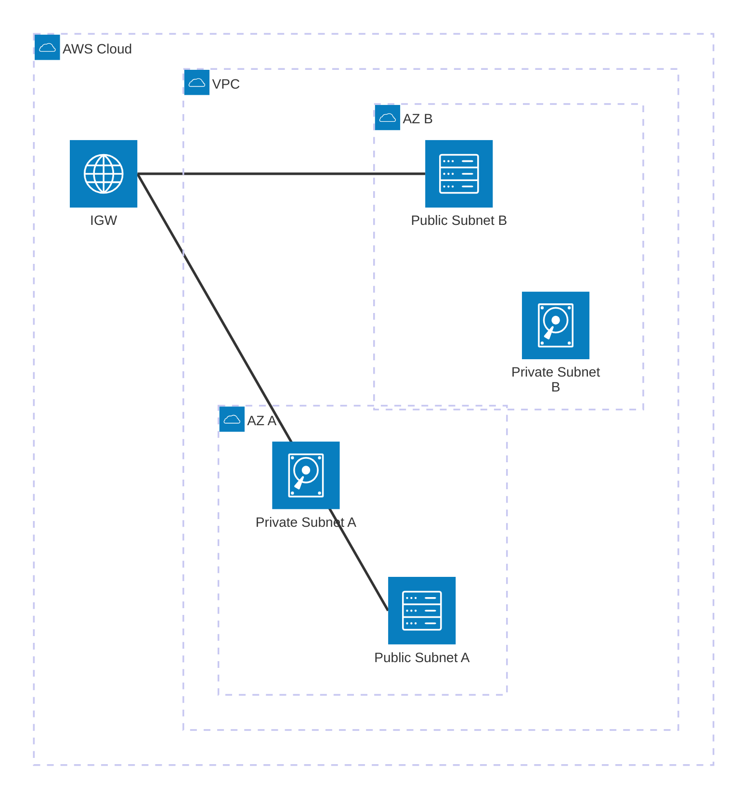

# Week 5 Day 1 Lab 1: VPC 네트워크 인프라 구축 (14:00-14:50)

<div align="center">

**🌐 VPC 생성** • **🏗️ Multi-AZ Subnet** • **🚪 Internet Gateway** • **🗺️ Route Table**

*AWS 네트워크의 기초를 직접 구축하기*

</div>

---

## 🕘 Lab 정보
**시간**: 14:00-14:50 (50분)
**목표**: VPC부터 Route Table까지 완전한 네트워크 인프라 구축
**방식**: AWS Web Console 실습
**예상 비용**: $0.00 (VPC 자체는 무료)

**⏱️ 시간 배분**:
- 사전 준비 (Default VPC 삭제): 5분
- Step 1 (VPC 생성): 10분
- Step 2 (Subnet 생성): 15분
- Step 3 (IGW 생성): 10분
- Step 4 (Route Table 설정): 10분

## 🎯 학습 목표
- [ ] VPC CIDR 블록 설계 및 생성
- [ ] Multi-AZ Subnet 구성 (Public/Private)
- [ ] Internet Gateway 생성 및 연결
- [ ] Route Table 설정 및 Subnet 연결

---

## 🏗️ 구축할 아키텍처

### 📐 아키텍처 다이어그램



### 🔗 참조 Session
**당일 Session**:
- [Session 1: AWS 기초 개념](./session_1.md) - Region, AZ, VPC 개념
- [Session 2: VPC 아키텍처](./session_2.md) - CIDR, Subnet, IGW, Route Table

---

## 🔧 사전 준비: Default VPC 삭제 (예상 시간: 5분)

### ⚠️ 왜 필요한가?

**VPC Quota 제한**:
- AWS 기본 제한: 리전당 VPC 5개
- Default VPC: 1개 (자동 생성)
- 팀원 5명 실습: 5개 VPC 필요
- **문제**: Default VPC + 5개 = 6개 (제한 초과!)

**해결 방법**: Default VPC 삭제 후 실습 시작

### 📝 Default VPC 삭제 절차

#### 준비-1. Default VPC 확인

**AWS Console 경로**:
```
VPC → Your VPCs
```

**확인 항목**:
- "Default VPC" 라벨이 있는 VPC 찾기
- CIDR: 172.31.0.0/16 (일반적)

**이미지 자리**: Default VPC 확인

#### 준비-2. Default VPC 삭제

**AWS Console 경로**:
```
VPC → Your VPCs → Default VPC 선택 → Actions → Delete VPC
```

**⚠️ 주의사항**:
- Default VPC 삭제 시 연결된 모든 리소스 함께 삭제
- 실습 전이므로 안전하게 삭제 가능
- 필요 시 나중에 재생성 가능

**삭제 확인**:
- "delete" 입력하여 확인
- 모든 연결된 리소스 자동 삭제

**이미지 자리**: Default VPC 삭제

#### 준비-3. 삭제 확인

**AWS Console에서 확인**:
```
VPC → Your VPCs
```

**예상 결과**:
- VPC 목록이 비어있음
- 또는 Default VPC가 없음

**이미지 자리**: 삭제 확인

**💡 Default VPC 재생성 방법** (실습 후 필요 시):
```
VPC → Your VPCs → Actions → Create default VPC
```

---

## 🛠️ Step 1: VPC 생성 (예상 시간: 10분)

### 📋 이 단계에서 할 일
- VPC CIDR 블록 설계
- VPC 생성
- DNS 설정 활성화

### 🔗 참조 개념
- [Session 2: VPC 아키텍처](./session_2.md) - VPC CIDR 블록 설계

### 📝 실습 절차

#### 1-1. VPC 생성

**AWS Console 경로**:
```
AWS Console → VPC → Your VPCs → Create VPC
```

**설정 값**:
| 항목 | 값 | 설명 |
|------|-----|------|
| **Resources to create** | VPC only | VPC만 생성 (Subnet은 별도) |
| **Name tag** | [username]-vpc | 예: alice-vpc, bob-vpc |
| **IPv4 CIDR block** | 10.0.0.0/16 | 65,536개 IP 주소 |
| **IPv6 CIDR block** | No IPv6 CIDR block | IPv6 사용 안 함 |
| **Tenancy** | Default | 공유 하드웨어 (비용 절감) |

**💡 유저네임 규칙**:
- 팀 계정 내 각 팀원의 IAM 유저네임 사용
- 모든 리소스 이름에 본인의 유저네임 포함
- 예: alice, bob, charlie, david, eve

**이미지 자리**: Step 1-1 VPC 생성 화면

**⚠️ 주의사항**:
- CIDR 블록은 생성 후 변경 불가능
- 10.0.0.0/16은 가장 일반적인 선택
- Tenancy는 Default 선택 (Dedicated는 비용 높음)

#### 1-2. DNS 설정 활성화

**AWS Console 경로**:
```
VPC → Your VPCs → [username]-vpc 선택 → Actions → Edit VPC settings
```

**설정 값**:
| 항목 | 값 | 설명 |
|------|-----|------|
| **Enable DNS resolution** | ✅ 체크 | DNS 쿼리 활성화 |
| **Enable DNS hostnames** | ✅ 체크 | 인스턴스 DNS 이름 자동 할당 |

**이미지 자리**: Step 1-2 DNS 설정 화면

**💡 왜 필요한가?**:
- DNS resolution: VPC 내에서 도메인 이름 해석
- DNS hostnames: EC2 인스턴스에 자동으로 DNS 이름 부여

### ✅ Step 1 검증

**AWS Console에서 확인**:
```
VPC → Your VPCs → [username]-vpc 선택
```

**확인 항목**:
| 항목 | 예상 값 |
|------|---------|
| **VPC ID** | vpc-xxxxx |
| **IPv4 CIDR** | 10.0.0.0/16 |
| **DNS resolution** | Enabled |
| **DNS hostnames** | Enabled |

**이미지 자리**: Step 1 검증 결과

**✅ 체크리스트**:
- [ ] VPC ID 확인 (vpc-xxxxx)
- [ ] CIDR 블록 10.0.0.0/16 확인
- [ ] DNS resolution enabled 확인
- [ ] DNS hostnames enabled 확인

---

## 🛠️ Step 2: Subnet 생성 (예상 시간: 15분)

### 📋 이 단계에서 할 일
- AZ-A Public Subnet 생성
- AZ-A Private Subnet 생성
- AZ-B Public Subnet 생성
- AZ-B Private Subnet 생성

### 🔗 참조 개념
- [Session 2: VPC 아키텍처](./session_2.md) - Subnet 설계 및 CIDR 계산

### 📝 실습 절차

#### 2-1. Public Subnet A 생성

**AWS Console 경로**:
```
VPC → Subnets → Create subnet
```

**설정 값**:
| 항목 | 값 | 설명 |
|------|-----|------|
| **VPC ID** | [username]-vpc | 위에서 생성한 VPC |
| **Subnet name** | [username]-public-a | Public Subnet A |
| **Availability Zone** | ap-northeast-2a | AZ-A |
| **IPv4 CIDR block** | 10.0.1.0/24 | 256개 IP (251개 사용 가능) |

**이미지 자리**: Step 2-1 Public Subnet A 생성

#### 2-2. Private Subnet A 생성

**설정 값**:
| 항목 | 값 | 설명 |
|------|-----|------|
| **VPC ID** | [username]-vpc | 동일 VPC |
| **Subnet name** | [username]-private-a | Private Subnet A |
| **Availability Zone** | ap-northeast-2a | AZ-A |
| **IPv4 CIDR block** | 10.0.11.0/24 | 256개 IP (251개 사용 가능) |

**이미지 자리**: Step 2-2 Private Subnet A 생성

#### 2-3. Public Subnet B 생성

**설정 값**:
| 항목 | 값 | 설명 |
|------|-----|------|
| **VPC ID** | [username]-vpc | 동일 VPC |
| **Subnet name** | [username]-public-b | Public Subnet B |
| **Availability Zone** | ap-northeast-2b | AZ-B |
| **IPv4 CIDR block** | 10.0.2.0/24 | 256개 IP (251개 사용 가능) |

**이미지 자리**: Step 2-3 Public Subnet B 생성

#### 2-4. Private Subnet B 생성

**설정 값**:
| 항목 | 값 | 설명 |
|------|-----|------|
| **VPC ID** | [username]-vpc | 동일 VPC |
| **Subnet name** | [username]-private-b | Private Subnet B |
| **Availability Zone** | ap-northeast-2b | AZ-B |
| **IPv4 CIDR block** | 10.0.12.0/24 | 256개 IP (251개 사용 가능) |

**이미지 자리**: Step 2-4 Private Subnet B 생성

**💡 Subnet CIDR 설계 팁**:
- Public: 10.0.1.0/24, 10.0.2.0/24 (작은 번호)
- Private: 10.0.11.0/24, 10.0.12.0/24 (큰 번호)
- 규칙적인 번호로 관리 용이

### ✅ Step 2 검증

**AWS Console에서 확인**:
```
VPC → Subnets → Filters에서 VPC 선택
```

**확인 항목**:
| Subnet 이름 | CIDR | AZ | 타입 |
|------------|------|-----|------|
| [username]-public-a | 10.0.1.0/24 | ap-northeast-2a | Public |
| [username]-private-a | 10.0.11.0/24 | ap-northeast-2a | Private |
| [username]-public-b | 10.0.2.0/24 | ap-northeast-2b | Public |
| [username]-private-b | 10.0.12.0/24 | ap-northeast-2b | Private |

**이미지 자리**: Step 2 검증 결과

**✅ 체크리스트**:
- [ ] 4개 Subnet 모두 생성 확인
- [ ] CIDR 블록 정확히 설정 확인
- [ ] AZ 분산 배치 확인 (2a, 2b)
- [ ] 이름 태그 정확히 설정 확인

---

## 🛠️ Step 3: Internet Gateway 생성 및 연결 (예상 시간: 10분)

### 📋 이 단계에서 할 일
- Internet Gateway 생성
- VPC에 연결

### 🔗 참조 개념
- [Session 2: VPC 아키텍처](./session_2.md) - Internet Gateway 역할

### 📝 실습 절차

#### 3-1. Internet Gateway 생성

**AWS Console 경로**:
```
VPC → Internet Gateways → Create internet gateway
```

**설정 값**:
| 항목 | 값 | 설명 |
|------|-----|------|
| **Name tag** | [username]-igw | Internet Gateway |

**이미지 자리**: Step 3-1 IGW 생성

#### 3-2. VPC에 연결

**AWS Console 경로**:
```
Internet Gateways → [username]-igw 선택 → Actions → Attach to VPC
```

**설정 값**:
| 항목 | 값 | 설명 |
|------|-----|------|
| **Available VPCs** | [username]-vpc | 위에서 생성한 VPC |

**이미지 자리**: Step 3-2 VPC 연결

**⚠️ 주의사항**:
- 하나의 VPC에는 하나의 IGW만 연결 가능
- IGW는 VPC에 연결되어야 작동

### ✅ Step 3 검증

**AWS Console에서 확인**:
```
VPC → Internet Gateways → [username]-igw 선택
```

**확인 항목**:
| 항목 | 예상 값 |
|------|---------|
| **Internet gateway ID** | igw-xxxxx |
| **State** | Attached |
| **VPC ID** | vpc-xxxxx ([username]-vpc) |

**이미지 자리**: Step 3 검증 결과

**✅ 체크리스트**:
- [ ] IGW ID 확인 (igw-xxxxx)
- [ ] State가 "Attached" 확인
- [ ] VPC ID 연결 확인

---

## 🛠️ Step 4: Route Table 설정 (예상 시간: 15분)

### 📋 이 단계에서 할 일
- Public Route Table 생성
- Public Route Table에 IGW 경로 추가
- Public Subnet들을 Public Route Table에 연결
- Private Route Table 확인 (기본 생성됨)

### 🔗 참조 개념
- [Session 2: VPC 아키텍처](./session_2.md) - Route Table 설정

### 📝 실습 절차

#### 4-1. Public Route Table 생성

**AWS Console 경로**:
```
VPC → Route Tables → Create route table
```

**설정 값**:
| 항목 | 값 | 설명 |
|------|-----|------|
| **Name** | [username]-public-rt | Public Route Table |
| **VPC** | [username]-vpc | 위에서 생성한 VPC |

**이미지 자리**: Step 4-1 Public RT 생성

#### 4-2. Internet Gateway 경로 추가

**AWS Console 경로**:
```
Route Tables → [username]-public-rt 선택 → Routes 탭 → Edit routes
```

**설정 값**:
| Destination | Target | 설명 |
|-------------|--------|------|
| 0.0.0.0/0 | [username]-igw | 모든 외부 트래픽을 IGW로 |

**이미지 자리**: Step 4-2 IGW 경로 추가

**💡 0.0.0.0/0의 의미**:
- 모든 IP 주소 (인터넷 전체)
- VPC 내부가 아닌 모든 트래픽을 IGW로 전달

#### 4-3. Public Subnet 연결

**AWS Console 경로**:
```
Route Tables → [username]-public-rt 선택 → Subnet associations 탭 → Edit subnet associations
```

**설정 값**:
- ✅ [username]-public-a
- ✅ [username]-public-b

**이미지 자리**: Step 4-3 Subnet 연결

#### 4-4. Private Route Table 확인

**AWS Console 경로**:
```
VPC → Route Tables → Main route table 확인
```

**확인 사항**:
- VPC 생성 시 자동으로 Main Route Table 생성됨
- Private Subnet들은 자동으로 Main Route Table 사용
- Main Route Table에는 IGW 경로 없음 (외부 접속 불가)

**이미지 자리**: Step 4-4 Private RT 확인

**💡 Main Route Table**:
- VPC 생성 시 자동 생성
- 명시적으로 연결하지 않은 Subnet은 Main RT 사용
- Private Subnet용으로 사용 (IGW 경로 없음)

### ✅ Step 4 검증

**AWS Console에서 확인**:
```
VPC → Route Tables → [username]-public-rt 선택 → Routes 탭
```

**확인 항목 (Routes)**:
| Destination | Target | Status |
|-------------|--------|--------|
| 10.0.0.0/16 | local | Active |
| 0.0.0.0/0 | igw-xxxxx | Active |

**Subnet associations 탭 확인**:
| Subnet ID | Subnet 이름 |
|-----------|-------------|
| subnet-xxxxx | [username]-public-a |
| subnet-yyyyy | [username]-public-b |

**이미지 자리**: Step 4 검증 결과

**✅ 체크리스트**:
- [ ] Public Route Table 생성 확인
- [ ] 0.0.0.0/0 → IGW 경로 확인
- [ ] Public Subnet 2개 연결 확인
- [ ] Private Subnet은 Main RT 사용 확인

---

## 🛠️ Step 5: VPC Resource Map으로 아키텍처 검증 (예상 시간: 5분)

### 📋 이 단계에서 할 일
- VPC Resource Map으로 전체 아키텍처 시각화
- 리소스 연결 관계 확인
- 설정 오류 자동 감지

### 🔗 참조 개념
- [Session 2: VPC 아키텍처](./session_2.md) - VPC 전체 구조

### 📝 실습 절차

#### 5-1. VPC Resource Map 접근

**AWS Console 경로**:
```
VPC → Your VPCs → [username]-vpc 선택 → Resource map 탭
```

**이미지 자리**: Step 5-1 Resource Map 화면

**💡 VPC Resource Map이란?**:
- AWS Console의 시각화 도구
- VPC 내 모든 리소스와 연결 관계를 한눈에 표시
- 설정 오류 자동 감지

#### 5-2. 아키텍처 구조 확인

**확인 항목**:

**1. VPC 기본 정보**
- VPC CIDR: 10.0.0.0/16
- Availability Zone: 2개 (ap-northeast-2a, ap-northeast-2b)

**2. Subnet 배치 및 색상**
- ✅ Public Subnet A (녹색): 10.0.1.0/24, AZ-A
- ✅ Public Subnet B (녹색): 10.0.2.0/24, AZ-B
- ✅ Private Subnet A (파란색): 10.0.11.0/24, AZ-A
- ✅ Private Subnet B (파란색): 10.0.12.0/24, AZ-B

**💡 색상 의미**:
- **녹색**: Public Subnet (IGW 경로 있음)
- **파란색**: Private Subnet (IGW 경로 없음)

**3. 연결 관계 (실선)**
- Internet Gateway → Public Route Table
- Public Route Table → Public Subnet A
- Public Route Table → Public Subnet B
- Main Route Table → Private Subnet A
- Main Route Table → Private Subnet B

**4. 트래픽 흐름 (점선)**
- Public Subnet A → Internet Gateway
- Public Subnet B → Internet Gateway

**이미지 자리**: Step 5-2 아키텍처 구조

#### 5-3. 상세 정보 확인

**AWS Console에서**:
```
Resource map → Show details 클릭
```

**확인 가능한 정보**:
- VPC CIDR 범위
- Subnet CIDR 범위
- Route Table 상세 경로
- Internet Gateway 연결 상태

**이미지 자리**: Step 5-3 상세 정보

### ✅ Step 5 검증

**정상 구성 확인**:
- [ ] Public Subnet이 녹색으로 표시
- [ ] Private Subnet이 파란색으로 표시
- [ ] Internet Gateway 연결 확인 (실선)
- [ ] Public Route Table → Public Subnets 연결 (실선)
- [ ] Main Route Table → Private Subnets 연결 (실선)
- [ ] Public Subnets → IGW 트래픽 흐름 (점선)

**⚠️ 오류 감지 (이런 경우 재확인 필요)**:
- ❌ Private Subnet이 녹색으로 표시 (IGW 직접 연결 - 보안 위험)
- ❌ Public Subnet이 파란색으로 표시 (IGW 경로 없음 - 외부 접속 불가)
- ❌ Subnet이 Route Table에 연결되지 않음 (고립된 Subnet)
- ❌ IGW가 VPC에 연결되지 않음 (외부 통신 불가)

**이미지 자리**: Step 5 검증 결과

**💡 Resource Map 활용 팁**:
- 아키텍처 문서화: 스크린샷으로 저장하여 문서화
- 오류 진단: 색상과 연결선으로 빠른 문제 파악
- 팀 공유: 시각적 자료로 팀원과 소통

---

## ✅ 전체 검증 체크리스트

### ✅ 사전 준비 완료
- [ ] Default VPC 삭제 확인
- [ ] VPC 목록 비어있음 확인

### ✅ VPC 구성 완료
- [ ] VPC 생성 (10.0.0.0/16)
- [ ] DNS resolution 활성화
- [ ] DNS hostnames 활성화

### ✅ Subnet 구성 완료
- [ ] Public Subnet A (10.0.1.0/24, AZ-A)
- [ ] Private Subnet A (10.0.11.0/24, AZ-A)
- [ ] Public Subnet B (10.0.2.0/24, AZ-B)
- [ ] Private Subnet B (10.0.12.0/24, AZ-B)

### ✅ Internet Gateway 구성 완료
- [ ] IGW 생성
- [ ] VPC에 연결
- [ ] State "Attached" 확인

### ✅ Route Table 구성 완료
- [ ] Public Route Table 생성
- [ ] 0.0.0.0/0 → IGW 경로 추가
- [ ] Public Subnet 2개 연결
- [ ] Private Subnet Main RT 사용 확인

### ✅ VPC Resource Map 검증 완료
- [ ] Public Subnet 녹색 표시 확인
- [ ] Private Subnet 파란색 표시 확인
- [ ] IGW 연결 관계 확인 (실선)
- [ ] Route Table 연결 확인 (실선)
- [ ] 트래픽 흐름 확인 (점선)
- [ ] 설정 오류 없음 확인

---

## 🔍 트러블슈팅

### 문제 1: Subnet CIDR 블록 중복 오류
**증상**:
```
The CIDR '10.0.1.0/24' conflicts with another subnet
```

**원인**:
- 동일한 CIDR 블록을 중복 사용

**해결 방법**:
- 각 Subnet마다 고유한 CIDR 블록 사용
- 10.0.1.0/24, 10.0.2.0/24, 10.0.11.0/24, 10.0.12.0/24

### 문제 2: IGW를 VPC에 연결할 수 없음
**증상**:
```
Resource has a dependent object
```

**원인**:
- 이미 다른 IGW가 연결되어 있음

**해결 방법**:
- 하나의 VPC에는 하나의 IGW만 연결 가능
- 기존 IGW 확인 및 제거

### 문제 3: Route Table 경로 추가 실패
**증상**:
```
The internet gateway ID 'igw-xxxxx' does not exist
```

**원인**:
- IGW가 VPC에 연결되지 않음

**해결 방법**:
- IGW를 먼저 VPC에 연결
- State가 "available" 확인 후 경로 추가

---

## 💰 비용 확인

### 예상 비용 계산
| 리소스 | 사용 시간 | 단가 | 예상 비용 |
|--------|----------|------|-----------|
| VPC | 무제한 | 무료 | $0.00 |
| Subnet | 무제한 | 무료 | $0.00 |
| Internet Gateway | 무제한 | 무료 | $0.00 |
| Route Table | 무제한 | 무료 | $0.00 |
| **합계** | | | **$0.00** |

**💡 비용 팁**:
- VPC 인프라 자체는 완전 무료
- 비용은 EC2, NAT Gateway 등 리소스 사용 시 발생

---

## 💡 Lab 회고

### 🤝 페어 회고 (5분)
1. **가장 어려웠던 부분**: 
2. **CIDR 블록 설계 경험**:
3. **Route Table 이해도**:

### 📊 학습 성과
- **기술적 성취**: VPC 네트워크 인프라 완전 구축
- **이해도 향상**: CIDR, Subnet, IGW, Route Table 개념
- **다음 Lab 준비**: EC2 배포를 위한 네트워크 준비 완료

---

## 🔗 관련 자료

### 📚 Session 복습
- [Session 1: AWS 기초 개념](./session_1.md)
- [Session 2: VPC 아키텍처](./session_2.md)

### 📖 AWS 공식 문서
- [VPC 사용자 가이드](https://docs.aws.amazon.com/vpc/latest/userguide/)
- [Subnet 설계](https://docs.aws.amazon.com/vpc/latest/userguide/configure-subnets.html)
- [Route Table](https://docs.aws.amazon.com/vpc/latest/userguide/VPC_Route_Tables.html)

### 🎯 다음 Lab
- [Lab 2: EC2 웹 서버 배포](./lab_2.md) - VPC 위에 EC2 배포 및 Nginx 설치

---

<div align="center">

**✅ Lab 1 완료** • **🌐 네트워크 준비 완료** • **💻 다음은 EC2 배포**

*VPC 인프라 구축 성공! 이제 EC2를 배포할 준비가 되었습니다.*

</div>
