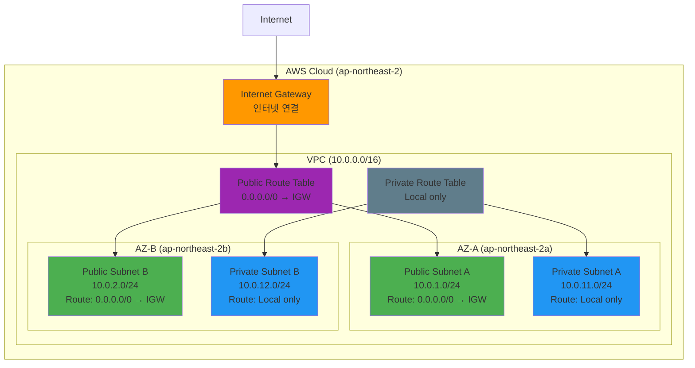

# Week 5 Day 1 Lab 1: VPC 네트워크 인프라 구축 (14:00-15:00)

<div align="center">

**🌐 VPC 생성** • **🏗️ Multi-AZ Subnet** • **🚪 Internet Gateway** • **🗺️ Route Table** • **🗄️ RDS (Optional)** • **⚡ Redis (Optional)**

*AWS 네트워크의 기초를 직접 구축하기*

</div>

---

## 🕘 Lab 정보
**시간**: 14:00-15:00 (60분)
**목표**: VPC 네트워크 인프라 구축 + 선택적 데이터베이스 구성
**방식**: AWS Web Console 실습
**예상 비용**: 
- 필수 Step: $0.00 (VPC 무료)
- 선택 Step: ~$0.20 (RDS + Redis 1시간)

**⏱️ 시간 배분**:

### 필수 Step (40분)
- 사전 준비 (Default VPC 삭제): 5분
- Step 1 (VPC 생성): 5분
- Step 2 (Subnet 생성): 15분
- Step 5 (Internet Gateway): 5분
- Step 6 (Route Table): 10분

### 선택 Step (20분) - Optional
- Step 3 (RDS PostgreSQL 17.6): 10분
- Step 4 (ElastiCache Redis): 10분

## 🎯 학습 목표

### 필수 목표
- [ ] VPC CIDR 블록 설계 및 생성
- [ ] Multi-AZ Subnet 구성 (Public/Private)
- [ ] Internet Gateway 생성 및 연결
- [ ] Route Table 설정 및 Subnet 연결

### 선택 목표 (Optional)
- [ ] RDS PostgreSQL 17.6 구성 (DB Subnet Group 포함)
- [ ] ElastiCache Redis 구성 (Cache Subnet Group 포함)

---

## 🏗️ 구축할 아키텍처

### 📐 목표 아키텍처 (성공 기준)



**핵심 구성 요소**:
- **VPC**: 10.0.0.0/16 (65,536개 IP)
- **Public Subnet**: 인터넷 접근 가능 (IGW 연결)
- **Private Subnet**: 내부 통신만 가능
- **Multi-AZ**: 고가용성을 위한 2개 AZ 구성
- **Route Table**: Public/Private 트래픽 분리

💡 **목표**: 위 아키텍처를 AWS Console에서 직접 구축하기!

### 🔗 참조 Session
**당일 Session**:
- [Session 1: AWS 기초 개념](./session_1.md) - Region, AZ, VPC 개념
- [Session 2: VPC 아키텍처](./session_2.md) - CIDR, Subnet, IGW, Route Table

---

## 🔧 사전 준비: Default VPC 삭제 (예상 시간: 5분)

### ⚠️ 왜 필요한가?

**VPC Quota 제한**:
- AWS 기본 제한: 리전당 VPC 5개
- Default VPC: 1개 (자동 생성)
- 팀원 5명 실습: 5개 VPC 필요
- **문제**: Default VPC + 5개 = 6개 (제한 초과!)

**해결 방법**: Default VPC 삭제 후 실습 시작

### 📝 Default VPC 삭제 절차

#### 준비-1. Default VPC 확인

**AWS Console 경로**:
```
VPC → Your VPCs
```
**직접 링크**: https://ap-northeast-2.console.aws.amazon.com/vpc/home?region=ap-northeast-2#vpcs:

**확인 항목**:
- "Default VPC" 라벨이 있는 VPC 찾기
- CIDR: 172.31.0.0/16 (일반적)

**이미지 자리**: Default VPC 확인

#### 준비-2. Default VPC 삭제

**AWS Console 경로**:
```
VPC → Your VPCs → Default VPC 선택 → Actions → Delete VPC
```

**⚠️ 주의사항**:
- Default VPC 삭제 시 연결된 모든 리소스 함께 삭제
- 실습 전이므로 안전하게 삭제 가능
- 필요 시 나중에 재생성 가능

**삭제 확인**:
- "delete" 입력하여 확인
- 모든 연결된 리소스 자동 삭제

**이미지 자리**: Default VPC 삭제

#### 준비-3. 삭제 확인

**AWS Console에서 확인**:
```
VPC → Your VPCs
```

**예상 결과**:
- VPC 목록이 비어있음
- 또는 Default VPC가 없음

**이미지 자리**: 삭제 확인

**💡 Default VPC 재생성 방법** (실습 후 필요 시):
```
VPC → Your VPCs → Actions → Create default VPC
```

---

## 🛠️ Step 1: VPC 생성 (예상 시간: 5분)

### 📋 이 단계에서 할 일
- VPC CIDR 블록 설계
- VPC 생성
- DNS 설정 활성화

### 🔗 참조 개념
- [Session 2: VPC 아키텍처](./session_2.md) - VPC CIDR 블록 설계

### 📝 실습 절차

#### 1-1. VPC 생성

**AWS Console 경로**:
```
AWS Console → VPC → Your VPCs → Create VPC
```
**직접 링크**: https://ap-northeast-2.console.aws.amazon.com/vpc/home?region=ap-northeast-2#CreateVpc:

**설정 값**:
| 항목 | 값 | 설명 |
|------|-----|------|
| **Resources to create** | VPC only | ⚠️ VPC만 생성 (Subnet은 별도로 생성) |
| **Name tag** | [username]-vpc | 예: alice-vpc, bob-vpc |
| **IPv4 CIDR block** | 10.0.0.0/16 | 65,536개 IP 주소 |
| **IPv6 CIDR block** | No IPv6 CIDR block | IPv6 사용 안 함 |
| **Tenancy** | Default | 공유 하드웨어 (비용 절감) |

**⚠️ 중요: Resources to create**:
- **"VPC only"** 선택 (기본값)
- ❌ "VPC and more" 선택하지 마세요 (자동으로 Subnet 등 생성됨)
- 이유: 학습을 위해 각 리소스를 직접 생성

**💡 유저네임 규칙**:
- 팀 계정 내 각 팀원의 IAM 유저네임 사용
- 모든 리소스 이름에 본인의 유저네임 포함
- 예: alice, bob, charlie, david, eve

**이미지 자리**: Step 1-1 VPC 생성 화면

**⚠️ 주의사항**:
- CIDR 블록은 생성 후 변경 불가능
- 10.0.0.0/16은 가장 일반적인 선택
- Tenancy는 Default 선택 (Dedicated는 비용 높음)

#### 1-2. DNS 설정 활성화

**AWS Console 경로**:
```
VPC → Your VPCs → [username]-vpc 선택 → Actions → Edit VPC settings
```

**설정 값**:
| 항목 | 값 | 설명 |
|------|-----|------|
| **Enable DNS resolution** | ✅ 체크 | DNS 쿼리 활성화 |
| **Enable DNS hostnames** | ✅ 체크 | 인스턴스 DNS 이름 자동 할당 |

**이미지 자리**: Step 1-2 DNS 설정 화면

**💡 왜 필요한가?**:
- DNS resolution: VPC 내에서 도메인 이름 해석
- DNS hostnames: EC2 인스턴스에 자동으로 DNS 이름 부여

### ✅ Step 1 검증

**AWS Console에서 확인**:
```
VPC → Your VPCs → [username]-vpc 선택
```

**확인 항목**:
| 항목 | 예상 값 |
|------|---------|
| **VPC ID** | vpc-xxxxx |
| **IPv4 CIDR** | 10.0.0.0/16 |
| **DNS resolution** | Enabled |
| **DNS hostnames** | Enabled |

**이미지 자리**: Step 1 검증 결과

**✅ 체크리스트**:
- [ ] VPC ID 확인 (vpc-xxxxx)
- [ ] CIDR 블록 10.0.0.0/16 확인
- [ ] DNS resolution enabled 확인
- [ ] DNS hostnames enabled 확인

---

## 🛠️ Step 2: Subnet 생성 (예상 시간: 15분)

### 📋 이 단계에서 할 일
- AZ-A Public Subnet 생성
- AZ-A Private Subnet 생성
- AZ-B Public Subnet 생성
- AZ-B Private Subnet 생성

### 🔗 참조 개념
- [Session 2: VPC 아키텍처](./session_2.md) - Subnet 설계 및 CIDR 계산

### 📝 실습 절차

#### 2-1. Public Subnet A 생성

**AWS Console 경로**:
```
VPC → Subnets → Create subnet
```
**직접 링크**: https://ap-northeast-2.console.aws.amazon.com/vpc/home?region=ap-northeast-2#CreateSubnet:

**설정 값**:
| 항목 | 값 | 설명 |
|------|-----|------|
| **VPC ID** | [username]-vpc | 위에서 생성한 VPC |
| **Subnet name** | [username]-public-a | Public Subnet A |
| **Availability Zone** | ap-northeast-2a | AZ-A |
| **IPv4 CIDR block** | 10.0.1.0/24 | 256개 IP (251개 사용 가능) |

**이미지 자리**: Step 2-1 Public Subnet A 생성

#### 2-2. Private Subnet A 생성

**설정 값**:
| 항목 | 값 | 설명 |
|------|-----|------|
| **VPC ID** | [username]-vpc | 동일 VPC |
| **Subnet name** | [username]-private-a | Private Subnet A |
| **Availability Zone** | ap-northeast-2a | AZ-A |
| **IPv4 CIDR block** | 10.0.11.0/24 | 256개 IP (251개 사용 가능) |

**이미지 자리**: Step 2-2 Private Subnet A 생성

#### 2-3. Public Subnet B 생성

**설정 값**:
| 항목 | 값 | 설명 |
|------|-----|------|
| **VPC ID** | [username]-vpc | 동일 VPC |
| **Subnet name** | [username]-public-b | Public Subnet B |
| **Availability Zone** | ap-northeast-2b | AZ-B |
| **IPv4 CIDR block** | 10.0.2.0/24 | 256개 IP (251개 사용 가능) |

**이미지 자리**: Step 2-3 Public Subnet B 생성

#### 2-4. Private Subnet B 생성

**설정 값**:
| 항목 | 값 | 설명 |
|------|-----|------|
| **VPC ID** | [username]-vpc | 동일 VPC |
| **Subnet name** | [username]-private-b | Private Subnet B |
| **Availability Zone** | ap-northeast-2b | AZ-B |
| **IPv4 CIDR block** | 10.0.12.0/24 | 256개 IP (251개 사용 가능) |

**이미지 자리**: Step 2-4 Private Subnet B 생성

**💡 Subnet CIDR 설계 팁**:
- Public: 10.0.1.0/24, 10.0.2.0/24 (작은 번호)
- Private: 10.0.11.0/24, 10.0.12.0/24 (큰 번호)
- 규칙적인 번호로 관리 용이

### ✅ Step 2 검증

**AWS Console에서 확인**:
```
VPC → Subnets → Filters에서 VPC 선택
```

**확인 항목**:
| Subnet 이름 | CIDR | AZ | 타입 |
|------------|------|-----|------|
| [username]-public-a | 10.0.1.0/24 | ap-northeast-2a | Public |
| [username]-private-a | 10.0.11.0/24 | ap-northeast-2a | Private |
| [username]-public-b | 10.0.2.0/24 | ap-northeast-2b | Public |
| [username]-private-b | 10.0.12.0/24 | ap-northeast-2b | Private |

**이미지 자리**: Step 2 검증 결과

**✅ 체크리스트**:
- [ ] 4개 Subnet 모두 생성 확인
- [ ] CIDR 블록 정확히 설정 확인
- [ ] AZ 분산 배치 확인 (2a, 2b)
- [ ] 이름 태그 정확히 설정 확인

---


---

## 🗄️ Step 3 (Optional): RDS PostgreSQL 17.6 구성 (예상 시간: 10분)

### ⚠️ 선택 사항 안내
이 Step은 **선택 사항**입니다. 시간이 부족하거나 데이터베이스가 필요 없다면 건너뛰어도 됩니다.

### 📋 이 단계에서 할 일
- DB Subnet Group 생성
- RDS Security Group 생성
- RDS PostgreSQL 17.6 인스턴스 생성

### 🔗 참조 개념
- [Session 3: RDS 기초](../day3/session_1.md) - RDS 아키텍처 (Day 3에서 학습 예정)

### 📝 실습 절차

#### 3-1. DB Subnet Group 생성

**AWS Console 경로**:
```
RDS → Subnet groups → Create DB subnet group
```
**직접 링크**: https://ap-northeast-2.console.aws.amazon.com/rds/home?region=ap-northeast-2#create-db-subnet-group:

**설정 값**:
| 항목 | 값 | 설명 |
|------|-----|------|
| **Name** | [username]-db-subnet-group | DB Subnet Group 이름 |
| **Description** | DB subnet group for [username] | 설명 |
| **VPC** | [username]-vpc | 위에서 생성한 VPC |
| **Availability Zones** | ap-northeast-2a, ap-northeast-2b | 2개 AZ 선택 |
| **Subnets** | [username]-private-a (10.0.11.0/24)<br/>[username]-private-b (10.0.12.0/24) | Private Subnet 2개 |

**이미지 자리**: Step 3-1 DB Subnet Group 생성

**💡 왜 Private Subnet인가?**:
- 데이터베이스는 외부 접근 불필요
- 보안을 위해 Private Subnet에 배치
- 애플리케이션 서버만 접근 가능

#### 3-2. RDS Security Group 생성

**AWS Console 경로**:
```
VPC → Security Groups → Create security group
```

**설정 값**:
| 항목 | 값 | 설명 |
|------|-----|------|
| **Security group name** | [username]-rds-sg | RDS Security Group |
| **Description** | Security group for RDS | 설명 |
| **VPC** | [username]-vpc | 위에서 생성한 VPC |

**Inbound rules**:
| Type | Protocol | Port | Source | 설명 |
|------|----------|------|--------|------|
| PostgreSQL | TCP | 5432 | 10.0.0.0/16 | VPC 내부에서만 접근 |

**이미지 자리**: Step 3-2 RDS Security Group

**💡 보안 팁**:
- Source를 VPC CIDR (10.0.0.0/16)로 제한
- 외부 인터넷에서 직접 접근 불가
- 나중에 EC2 Security Group으로 더 제한 가능

#### 3-3. RDS PostgreSQL 17.6 생성

**AWS Console 경로**:
```
RDS → Databases → Create database
```
**직접 링크**: https://ap-northeast-2.console.aws.amazon.com/rds/home?region=ap-northeast-2#launch-dbinstance:

**설정 값**:

**Engine options**:
| 항목 | 값 |
|------|-----|
| **Engine type** | PostgreSQL |
| **Engine Version** | PostgreSQL 17.6-R1 |

**Templates**:
| 항목 | 값 |
|------|-----|
| **Templates** | Free tier |

**Settings**:
| 항목 | 값 |
|------|-----|
| **DB instance identifier** | [username]-postgres |
| **Master username** | postgres |
| **Master password** | YourPassword123! |
| **Confirm password** | YourPassword123! |

**Instance configuration**:
| 항목 | 값 |
|------|-----|
| **DB instance class** | db.t3.micro |

**Storage**:
| 항목 | 값 |
|------|-----|
| **Storage type** | General Purpose SSD (gp3) |
| **Allocated storage** | 20 GiB |
| **Enable storage autoscaling** | ❌ 체크 해제 |

**Connectivity**:
| 항목 | 값 |
|------|-----|
| **VPC** | [username]-vpc |
| **DB subnet group** | [username]-db-subnet-group |
| **Public access** | No |
| **VPC security group** | [username]-rds-sg |
| **Availability Zone** | No preference |

**Database authentication**:
| 항목 | 값 |
|------|-----|
| **Database authentication** | Password authentication |

**Additional configuration**:
| 항목 | 값 |
|------|-----|
| **Initial database name** | mydb |
| **Backup retention period** | 1 day |
| **Enable encryption** | ❌ 체크 해제 (실습용) |

**이미지 자리**: Step 3-3 RDS 생성

**⚠️ 주의사항**:
- 생성 시간: 약 5-10분 소요
- Status가 "Available"이 될 때까지 대기
- 비용: 약 $0.017/hour (Free tier 750시간/월)

### ✅ Step 3 검증

**AWS Console에서 확인**:
```
RDS → Databases → [username]-postgres 선택
```

**확인 항목**:
| 항목 | 예상 값 |
|------|---------|
| **Status** | Available |
| **Engine** | PostgreSQL 17.6-R1 |
| **Endpoint** | [username]-postgres.xxxxx.ap-northeast-2.rds.amazonaws.com |
| **Port** | 5432 |

**이미지 자리**: Step 5 검증 결과

**✅ 체크리스트**:
- [ ] DB Subnet Group 생성 확인
- [ ] RDS Security Group 생성 확인
- [ ] RDS 인스턴스 Status "Available" 확인
- [ ] Endpoint 주소 확인

---

## ⚡ Step 4 (Optional): ElastiCache Redis 구성 (예상 시간: 10분)

### ⚠️ 선택 사항 안내
이 Step도 **선택 사항**입니다. 캐시가 필요 없다면 건너뛰어도 됩니다.

### 📋 이 단계에서 할 일
- Cache Subnet Group 생성
- Redis Security Group 생성
- Redis 클러스터 생성

### 🔗 참조 개념
- [Session 3: ElastiCache](../day3/session_2.md) - Redis 아키텍처 (Day 3에서 학습 예정)

### 📝 실습 절차

#### 4-1. Cache Subnet Group 생성

**AWS Console 경로**:
```
ElastiCache → Subnet groups → Create subnet group
```
**직접 링크**: https://ap-northeast-2.console.aws.amazon.com/elasticache/home?region=ap-northeast-2#/subnet-groups/create

**설정 값**:
| 항목 | 값 | 설명 |
|------|-----|------|
| **Name** | [username]-cache-subnet-group | Cache Subnet Group 이름 |
| **Description** | Cache subnet group for [username] | 설명 |
| **VPC** | [username]-vpc | 위에서 생성한 VPC |
| **Availability Zones** | ap-northeast-2a, ap-northeast-2b | 2개 AZ 선택 |
| **Subnets** | [username]-private-a (10.0.11.0/24)<br/>[username]-private-b (10.0.12.0/24) | Private Subnet 2개 |

**이미지 자리**: Step 4-1 Cache Subnet Group 생성

#### 4-2. Redis Security Group 생성

**AWS Console 경로**:
```
VPC → Security Groups → Create security group
```

**설정 값**:
| 항목 | 값 | 설명 |
|------|-----|------|
| **Security group name** | [username]-redis-sg | Redis Security Group |
| **Description** | Security group for Redis | 설명 |
| **VPC** | [username]-vpc | 위에서 생성한 VPC |

**Inbound rules**:
| Type | Protocol | Port | Source | 설명 |
|------|----------|------|--------|------|
| Custom TCP | TCP | 6379 | 10.0.0.0/16 | VPC 내부에서만 접근 |

**이미지 자리**: Step 4-2 Redis Security Group

#### 4-3. Redis 클러스터 생성

**AWS Console 경로**:
```
ElastiCache → Redis clusters → Create Redis cluster
```
**직접 링크**: https://ap-northeast-2.console.aws.amazon.com/elasticache/home?region=ap-northeast-2#/redis/create

**설정 값**:

**Cluster settings**:
| 항목 | 값 |
|------|-----|
| **Cluster mode** | Disabled |
| **Cluster name** | [username]-redis |
| **Description** | Redis cluster for [username] |

**Location**:
| 항목 | 값 |
|------|-----|
| **AWS Cloud** | 선택 |

**Cluster settings**:
| 항목 | 값 |
|------|-----|
| **Engine version** | 7.1 (최신 버전) |
| **Port** | 6379 |
| **Parameter group** | default.redis7 |
| **Node type** | cache.t3.micro |
| **Number of replicas** | 0 |

**Subnet group settings**:
| 항목 | 값 |
|------|-----|
| **Subnet group** | [username]-cache-subnet-group |

**Security**:
| 항목 | 값 |
|------|-----|
| **Security groups** | [username]-redis-sg |
| **Encryption at rest** | ❌ 체크 해제 (실습용) |
| **Encryption in-transit** | ❌ 체크 해제 (실습용) |

**Backup**:
| 항목 | 값 |
|------|-----|
| **Enable automatic backups** | ❌ 체크 해제 (실습용) |

**이미지 자리**: Step 4-3 Redis 생성

**⚠️ 주의사항**:
- 생성 시간: 약 5-10분 소요
- Status가 "Available"이 될 때까지 대기
- 비용: 약 $0.017/hour

### ✅ Step 4 검증

**AWS Console에서 확인**:
```
ElastiCache → Redis clusters → [username]-redis 선택
```

**확인 항목**:
| 항목 | 예상 값 |
|------|---------|
| **Status** | Available |
| **Engine version** | 7.1 |
| **Primary endpoint** | [username]-redis.xxxxx.cache.amazonaws.com:6379 |

**이미지 자리**: Step 6 검증 결과

**✅ 체크리스트**:
- [ ] Cache Subnet Group 생성 확인
- [ ] Redis Security Group 생성 확인
- [ ] Redis 클러스터 Status "Available" 확인
- [ ] Primary endpoint 주소 확인

---

## 🛠️ Step 5: Internet Gateway 생성 및 연결 (예상 시간: 5분)

### 📋 이 단계에서 할 일
- Internet Gateway 생성
- VPC에 연결

### 🔗 참조 개념
- [Session 2: VPC 아키텍처](./session_2.md) - Internet Gateway 역할

### 📝 실습 절차

#### 3-1. Internet Gateway 생성

**AWS Console 경로**:
```
VPC → Internet Gateways → Create internet gateway
```
**직접 링크**: https://ap-northeast-2.console.aws.amazon.com/vpc/home?region=ap-northeast-2#CreateInternetGateway:

**설정 값**:
| 항목 | 값 | 설명 |
|------|-----|------|
| **Name tag** | [username]-igw | Internet Gateway |

**이미지 자리**: Step 3-1 IGW 생성

#### 3-2. VPC에 연결

**AWS Console 경로**:
```
Internet Gateways → [username]-igw 선택 → Actions → Attach to VPC
```

**설정 값**:
| 항목 | 값 | 설명 |
|------|-----|------|
| **Available VPCs** | [username]-vpc | 위에서 생성한 VPC |

**이미지 자리**: Step 3-2 VPC 연결

**⚠️ 주의사항**:
- 하나의 VPC에는 하나의 IGW만 연결 가능
- IGW는 VPC에 연결되어야 작동

### ✅ Step 3 검증

**AWS Console에서 확인**:
```
VPC → Internet Gateways → [username]-igw 선택
```

**확인 항목**:
| 항목 | 예상 값 |
|------|---------|
| **Internet gateway ID** | igw-xxxxx |
| **State** | Attached |
| **VPC ID** | vpc-xxxxx ([username]-vpc) |

**이미지 자리**: Step 3 검증 결과

**✅ 체크리스트**:
- [ ] IGW ID 확인 (igw-xxxxx)
- [ ] State가 "Attached" 확인
- [ ] VPC ID 연결 확인

---

## 🛠️ Step 6: Route Table 설정 (예상 시간: 10분)

### 📋 이 단계에서 할 일
- Public Route Table 생성
- Public Route Table에 IGW 경로 추가
- Public Subnet들을 Public Route Table에 연결
- Private Route Table 확인 (기본 생성됨)

### 🔗 참조 개념
- [Session 2: VPC 아키텍처](./session_2.md) - Route Table 설정

### 📝 실습 절차

#### 4-1. Public Route Table 생성

**AWS Console 경로**:
```
VPC → Route Tables → Create route table
```
**직접 링크**: https://ap-northeast-2.console.aws.amazon.com/vpc/home?region=ap-northeast-2#CreateRouteTable:

**설정 값**:
| 항목 | 값 | 설명 |
|------|-----|------|
| **Name** | [username]-public-rt | Public Route Table |
| **VPC** | [username]-vpc | 위에서 생성한 VPC |

**이미지 자리**: Step 4-1 Public RT 생성

#### 4-2. Internet Gateway 경로 추가

**AWS Console 경로**:
```
Route Tables → [username]-public-rt 선택 → Routes 탭 → Edit routes
```

**설정 값**:
| Destination | Target | 설명 |
|-------------|--------|------|
| 0.0.0.0/0 | [username]-igw | 모든 외부 트래픽을 IGW로 |

**이미지 자리**: Step 4-2 IGW 경로 추가

**💡 0.0.0.0/0의 의미**:
- 모든 IP 주소 (인터넷 전체)
- VPC 내부가 아닌 모든 트래픽을 IGW로 전달

#### 4-3. Public Subnet 연결

**AWS Console 경로**:
```
Route Tables → [username]-public-rt 선택 → Subnet associations 탭 → Edit subnet associations
```

**설정 값**:
- ✅ [username]-public-a
- ✅ [username]-public-b

**이미지 자리**: Step 4-3 Subnet 연결

#### 6-4. Private Route Table 확인

**AWS Console 경로**:
```
VPC → Route Tables → Main route table 확인
```

**확인 사항**:
- VPC 생성 시 자동으로 Main Route Table 생성됨
- Private Subnet들은 자동으로 Main Route Table 사용
- Main Route Table에는 IGW 경로 없음 (외부 접속 불가)

**이미지 자리**: Step 6-4 Private RT 확인

**💡 Main Route Table**:
- VPC 생성 시 자동 생성
- 명시적으로 연결하지 않은 Subnet은 Main RT 사용
- Private Subnet용으로 사용 (IGW 경로 없음)

**💡 VPC 내부 통신 (local 경로)**:
- 모든 Route Table에는 자동으로 **local 경로** 생성됨
- Destination: 10.0.0.0/16 (VPC CIDR)
- Target: local
- **의미**: VPC 내부 모든 Subnet 간 통신 가능
  - Public ↔ Private 통신 가능
  - Private ↔ Private 통신 가능
  - Public ↔ Public 통신 가능
- **차단 방법**: Security Group 또는 Network ACL로 제어 (Lab 2에서 학습)

### ✅ Step 4 검증

**AWS Console에서 확인**:
```
VPC → Route Tables → [username]-public-rt 선택 → Routes 탭
```

**확인 항목 (Routes)**:
| Destination | Target | Status |
|-------------|--------|--------|
| 10.0.0.0/16 | local | Active |
| 0.0.0.0/0 | igw-xxxxx | Active |

**Subnet associations 탭 확인**:
| Subnet ID | Subnet 이름 |
|-----------|-------------|
| subnet-xxxxx | [username]-public-a |
| subnet-yyyyy | [username]-public-b |

**이미지 자리**: Step 4 검증 결과

**✅ 체크리스트**:
- [ ] Public Route Table 생성 확인
- [ ] 0.0.0.0/0 → IGW 경로 확인
- [ ] Public Subnet 2개 연결 확인
- [ ] Private Subnet은 Main RT 사용 확인

---

## 🎉 필수 Step 완료!

**축하합니다!** VPC 네트워크 인프라 구축을 완료했습니다.

### ✅ 완료된 구성
- ✅ VPC (10.0.0.0/16)
- ✅ Public Subnet 2개 (AZ-A, AZ-B)
- ✅ Private Subnet 2개 (AZ-A, AZ-B)
- ✅ Internet Gateway
- ✅ Route Table (Public/Private)

### 🔄 다음 선택

**Option 1: 여기서 마무리** (40분 완료)
- Lab 1 종료
- 다음 Lab으로 이동

**Option 2: 데이터베이스 구성 계속** (추가 20분)
- Step 5: RDS PostgreSQL 17.6 구성
- Step 6: ElastiCache Redis 구성
- 완전한 3-Tier 아키텍처 완성

---

## ✅ 전체 검증 체크리스트

### ✅ 필수 Step 완료 (40분)
- [ ] VPC 생성 (10.0.0.0/16)
- [ ] DNS resolution 활성화
- [ ] DNS hostnames 활성화
- [ ] Public Subnet A (10.0.1.0/24, AZ-A)
- [ ] Private Subnet A (10.0.11.0/24, AZ-A)
- [ ] Public Subnet B (10.0.2.0/24, AZ-B)
- [ ] Private Subnet B (10.0.12.0/24, AZ-B)
- [ ] IGW 생성 및 VPC 연결
- [ ] Public Route Table 생성
- [ ] 0.0.0.0/0 → IGW 경로 추가
- [ ] Public Subnet 2개 연결

### ✅ 선택 Step 완료 (20분) - Optional
- [ ] DB Subnet Group 생성
- [ ] RDS Security Group 생성
- [ ] RDS PostgreSQL 17.6 생성
- [ ] Cache Subnet Group 생성
- [ ] Redis Security Group 생성
- [ ] Redis 클러스터 생성

---

## 🧹 리소스 정리

### ⚠️ 중요: 반드시 역순으로 삭제

**삭제 순서**:
```
Step 4 (Redis) → Step 3 (RDS) → Step 6 (Route Table) → Step 5 (IGW) → Step 2 (Subnet) → Step 1 (VPC)
```

### 🗑️ 선택 Step 리소스 삭제 (Optional 실행한 경우)

#### 1. Redis 클러스터 삭제
**AWS Console 경로**:
```
ElastiCache → Redis clusters → [username]-redis 선택 → Delete
```

**확인 사항**:
- [ ] Redis 클러스터 삭제 완료
- [ ] Cache Subnet Group 삭제

#### 2. RDS 인스턴스 삭제
**AWS Console 경로**:
```
RDS → Databases → [username]-postgres 선택 → Actions → Delete
```

**설정**:
- Create final snapshot: ❌ 체크 해제
- I acknowledge...: ✅ 체크

**확인 사항**:
- [ ] RDS 인스턴스 삭제 완료
- [ ] DB Subnet Group 삭제

#### 3. Security Groups 삭제
**AWS Console 경로**:
```
VPC → Security Groups → [username]-redis-sg, [username]-rds-sg 선택 → Actions → Delete
```

### 🗑️ 필수 Step 리소스 삭제

#### 4. Route Table 삭제
**AWS Console 경로**:
```
VPC → Route Tables → [username]-public-rt 선택 → Actions → Delete route table
```

**⚠️ 주의**:
- Main Route Table은 삭제하지 마세요 (VPC 삭제 시 자동 삭제)

#### 5. Internet Gateway 삭제
**AWS Console 경로**:
```
VPC → Internet Gateways → [username]-igw 선택 → Actions → Detach from VPC
```

**그 다음**:
```
Actions → Delete internet gateway
```

#### 6. Subnet 삭제
**AWS Console 경로**:
```
VPC → Subnets → 4개 Subnet 모두 선택 → Actions → Delete subnet
```

#### 7. VPC 삭제
**AWS Console 경로**:
```
VPC → Your VPCs → [username]-vpc 선택 → Actions → Delete VPC
```

### ✅ 정리 완료 확인

**확인 명령어** (AWS CLI 사용 시):
```bash
aws ec2 describe-vpcs --region ap-northeast-2 --filters "Name=tag:Name,Values=[username]-vpc"
```

**예상 결과**:
```json
{
    "Vpcs": []
}
```

**✅ 최종 체크리스트**:
- [ ] Redis 클러스터 삭제 (Optional)
- [ ] RDS 인스턴스 삭제 (Optional)
- [ ] Security Groups 삭제 (Optional)
- [ ] Route Table 삭제
- [ ] Internet Gateway 삭제
- [ ] Subnet 4개 삭제
- [ ] VPC 삭제
- [ ] 비용 확인 (Cost Explorer)

---

## 💰 비용 확인

### 예상 비용 계산

**필수 Step**:
| 리소스 | 사용 시간 | 단가 | 예상 비용 |
|--------|----------|------|-----------|
| VPC | 무제한 | 무료 | $0.00 |
| Subnet | 무제한 | 무료 | $0.00 |
| Internet Gateway | 무제한 | 무료 | $0.00 |
| Route Table | 무제한 | 무료 | $0.00 |
| **필수 합계** | | | **$0.00** |

**선택 Step** (Optional 실행 시):
| 리소스 | 사용 시간 | 단가 | 예상 비용 |
|--------|----------|------|-----------|
| RDS db.t3.micro | 1시간 | $0.017/hour | $0.017 |
| Redis cache.t3.micro | 1시간 | $0.017/hour | $0.017 |
| **선택 합계** | | | **$0.034** |

**전체 합계**: $0.00 ~ $0.034 (선택 사항 포함 시)

### 실제 비용 확인
**AWS Console 경로**:
```
AWS Console → Cost Explorer → Cost & Usage
```

**이미지 자리**: 비용 확인 스크린샷

---

## 🔍 트러블슈팅

### 문제 1: Subnet CIDR 블록 중복 오류
**증상**:
```
The CIDR '10.0.1.0/24' conflicts with another subnet
```

**원인**:
- 동일한 CIDR 블록을 중복 사용

**해결 방법**:
- 각 Subnet마다 고유한 CIDR 블록 사용
- 10.0.1.0/24, 10.0.2.0/24, 10.0.11.0/24, 10.0.12.0/24

### 문제 2: IGW를 VPC에 연결할 수 없음
**증상**:
```
Resource has a dependent object
```

**원인**:
- 이미 다른 IGW가 연결되어 있음

**해결 방법**:
- 하나의 VPC에는 하나의 IGW만 연결 가능
- 기존 IGW 확인 및 제거

### 문제 3: RDS 생성 실패 (Optional)
**증상**:
```
DB Subnet Group doesn't meet availability zone coverage requirement
```

**원인**:
- DB Subnet Group에 2개 이상의 AZ가 없음

**해결 방법**:
- DB Subnet Group에 최소 2개 AZ의 Subnet 포함
- Private Subnet A (AZ-A) + Private Subnet B (AZ-B)

### 문제 4: Redis 생성 실패 (Optional)
**증상**:
```
The requested cache subnet group does not exist
```

**원인**:
- Cache Subnet Group이 생성되지 않음

**해결 방법**:
- Step 4-1에서 Cache Subnet Group 먼저 생성
- 생성 완료 후 Redis 클러스터 생성

---

## 💡 Lab 회고

### 🤝 페어 회고 (5분)
1. **가장 어려웠던 부분**: 
   - CIDR 블록 설계?
   - Route Table 설정?
   - Optional Step (RDS/Redis)?

2. **새로 배운 점**:
   - VPC 네트워크 구조 이해
   - Multi-AZ 고가용성 개념
   - DB Subnet Group의 필요성 (Optional)

3. **실무 적용 아이디어**:
   - 프로젝트에 어떻게 활용할 수 있을까?

### 📊 학습 성과

**필수 Step 완료 시**:
- **기술적 성취**: VPC 네트워크 인프라 완전 구축
- **이해도 향상**: CIDR, Subnet, IGW, Route Table 개념
- **다음 Lab 준비**: EC2 배포를 위한 네트워크 준비 완료

**선택 Step 완료 시** (추가):
- **기술적 성취**: 3-Tier 아키텍처 완성 (Network + Database)
- **이해도 향상**: RDS, ElastiCache, Subnet Group 개념
- **실무 연계**: 실제 프로덕션 환경과 유사한 구성

---

## 🔗 관련 자료

### 📚 Session 복습
- [Session 1: AWS 기초 개념](./session_1.md)
- [Session 2: VPC 아키텍처](./session_2.md)

### 📖 AWS 공식 문서
- [VPC 사용자 가이드](https://docs.aws.amazon.com/vpc/latest/userguide/)
- [Subnet 설계](https://docs.aws.amazon.com/vpc/latest/userguide/configure-subnets.html)
- [Route Table](https://docs.aws.amazon.com/vpc/latest/userguide/VPC_Route_Tables.html)
- [RDS PostgreSQL](https://docs.aws.amazon.com/AmazonRDS/latest/UserGuide/CHAP_PostgreSQL.html) (Optional)
- [ElastiCache Redis](https://docs.aws.amazon.com/AmazonElastiCache/latest/red-ug/) (Optional)

### 🎯 다음 Lab
- [Lab 2: EC2 + ALB + ASG 배포](./lab_2.md) - VPC 위에 Backend 애플리케이션 배포

---

<div align="center">

**✅ Lab 1 완료** • **🌐 네트워크 준비 완료** • **🗄️ DB 구성 완료 (Optional)** • **💻 다음은 EC2 배포**

*VPC 인프라 구축 성공! 이제 EC2를 배포할 준비가 되었습니다.*

</div>
The CIDR '10.0.1.0/24' conflicts with another subnet
```

**원인**:
- 동일한 CIDR 블록을 중복 사용

**해결 방법**:
- 각 Subnet마다 고유한 CIDR 블록 사용
- 10.0.1.0/24, 10.0.2.0/24, 10.0.11.0/24, 10.0.12.0/24

### 문제 2: IGW를 VPC에 연결할 수 없음
**증상**:
```
Resource has a dependent object
```

**원인**:
- 이미 다른 IGW가 연결되어 있음

**해결 방법**:
- 하나의 VPC에는 하나의 IGW만 연결 가능
- 기존 IGW 확인 및 제거

### 문제 3: Route Table 경로 추가 실패
**증상**:
```
The internet gateway ID 'igw-xxxxx' does not exist
```

**원인**:
- IGW가 VPC에 연결되지 않음

**해결 방법**:
- IGW를 먼저 VPC에 연결
- State가 "available" 확인 후 경로 추가

---

## 💰 비용 확인

### 예상 비용 계산
| 리소스 | 사용 시간 | 단가 | 예상 비용 |
|--------|----------|------|-----------|
| VPC | 무제한 | 무료 | $0.00 |
| Subnet | 무제한 | 무료 | $0.00 |
| Internet Gateway | 무제한 | 무료 | $0.00 |
| Route Table | 무제한 | 무료 | $0.00 |
| **합계** | | | **$0.00** |

**💡 비용 팁**:
- VPC 인프라 자체는 완전 무료
- 비용은 EC2, NAT Gateway 등 리소스 사용 시 발생

---

## 💡 Lab 회고

### 🤝 페어 회고 (5분)
1. **가장 어려웠던 부분**: 
2. **CIDR 블록 설계 경험**:
3. **Route Table 이해도**:

### 📊 학습 성과
- **기술적 성취**: VPC 네트워크 인프라 완전 구축
- **이해도 향상**: CIDR, Subnet, IGW, Route Table 개념
- **다음 Lab 준비**: EC2 배포를 위한 네트워크 준비 완료

---

## 🔗 관련 자료

### 📚 Session 복습
- [Session 1: AWS 기초 개념](./session_1.md)
- [Session 2: VPC 아키텍처](./session_2.md)

### 📖 AWS 공식 문서
- [VPC 사용자 가이드](https://docs.aws.amazon.com/vpc/latest/userguide/)
- [Subnet 설계](https://docs.aws.amazon.com/vpc/latest/userguide/configure-subnets.html)
- [Route Table](https://docs.aws.amazon.com/vpc/latest/userguide/VPC_Route_Tables.html)

### 🎯 다음 Lab
- [Lab 2: EC2 웹 서버 배포](./lab_2.md) - VPC 위에 EC2 배포 및 Nginx 설치

---

<div align="center">

**✅ Lab 1 완료** • **🌐 네트워크 준비 완료** • **💻 다음은 EC2 배포**

*VPC 인프라 구축 성공! 이제 EC2를 배포할 준비가 되었습니다.*

</div>
