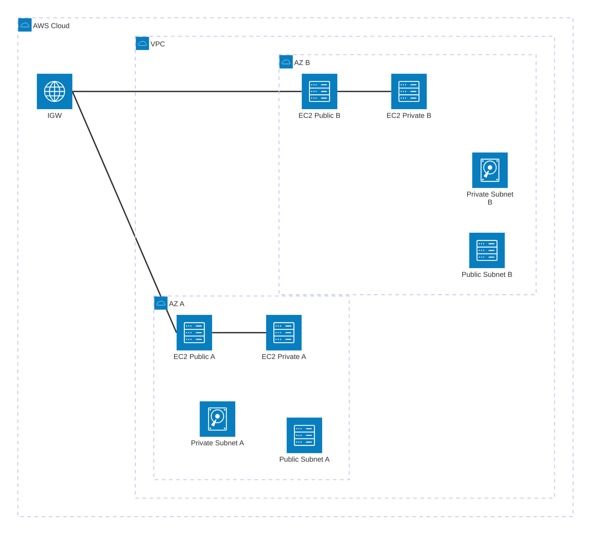

# Week 5 Day 1 Lab 2: EC2 인스턴스 배포 및 통신 확인 (15:00-15:50)

<div align="center">

**💻 EC2 생성** • **🔐 Security Group** • **🌐 통신 테스트** • **🔑 SSH 접속**

*Lab 1의 VPC에 EC2를 배포하고 네트워크 통신 확인하기*

</div>

---

## 🕘 Lab 정보
**시간**: 15:00-15:50 (50분)
**목표**: Lab 1의 VPC에 EC2 인스턴스 배포 및 통신 확인
**방식**: AWS Web Console 실습
**예상 비용**: $0.10 (t3.micro 프리티어 사용)

## 🎯 학습 목표
- [ ] Security Group 생성 및 규칙 설정
- [ ] Public Subnet에 EC2 인스턴스 배포
- [ ] Private Subnet에 EC2 인스턴스 배포
- [ ] 인스턴스 간 통신 확인

---

## 🏗️ 구축할 아키텍처

### 📐 아키텍처 다이어그램



**배포할 EC2 인스턴스**:
| 인스턴스 이름 | Subnet | AZ | Public IP | 용도 |
|--------------|--------|-----|-----------|------|
| [username]-ec2-public-a | Public A | 2a | ✅ | 웹 서버 (외부 접근) |
| [username]-ec2-private-a | Private A | 2a | ❌ | 내부 서비스 |
| [username]-ec2-public-b | Public B | 2b | ✅ | 웹 서버 (외부 접근) |
| [username]-ec2-private-b | Private B | 2b | ❌ | 내부 서비스 |

**💡 유저네임 규칙**:
- Lab 1에서 사용한 동일한 유저네임 사용
- 모든 리소스 이름에 본인의 유저네임 포함
- 예: alice-ec2-public-a, bob-vpc

### 🔗 참조 Session
**당일 Session**:
- [Session 3: 보안 그룹 & EC2 기초](./session_3.md) - Security Group, EC2 인스턴스 타입
- [Session 4: 고객 사례](./session_4.md) - 실무 아키텍처 패턴

**이전 Lab**:
- [Lab 1: VPC 네트워크 인프라 구축](./lab_1.md) - 이 Lab의 기반

---

## 🛠️ Step 1: Security Group 생성 (예상 시간: 10분)

### 📋 이 단계에서 할 일
- Public EC2용 Security Group 생성
- Private EC2용 Security Group 생성

### 🔗 참조 개념
- [Session 3: 보안 그룹 & EC2 기초](./session_3.md) - Security Group 규칙

### 📝 실습 절차

#### 1-1. Public Security Group 생성

**AWS Console 경로**:
```
EC2 → Security Groups → Create security group
```

**설정 값**:
| 항목 | 값 | 설명 |
|------|-----|------|
| **Security group name** | [username]-public-sg | Public EC2용 SG |
| **Description** | Security group for public EC2 instances | 설명 |
| **VPC** | [username]-vpc | Lab 1에서 생성한 VPC |

**Inbound rules**:
| Type | Protocol | Port Range | Source | 설명 |
|------|----------|------------|--------|------|
| SSH | TCP | 22 | My IP | SSH 접속 (내 IP만) |
| HTTP | TCP | 80 | 0.0.0.0/0 | 웹 접속 (모든 IP) |
| ICMP | ICMP | All | 10.0.0.0/16 | VPC 내부 Ping |

**Outbound rules**:
| Type | Protocol | Port Range | Destination | 설명 |
|------|----------|------------|-------------|------|
| All traffic | All | All | 0.0.0.0/0 | 모든 외부 통신 허용 |

**이미지 자리**: Step 1-1 Public SG 생성

**⚠️ 주의사항**:
- SSH는 반드시 "My IP"로 제한 (보안)
- HTTP는 웹 서비스이므로 0.0.0.0/0 허용
- ICMP는 Ping 테스트용 (VPC 내부만)

#### 1-2. Private Security Group 생성

**설정 값**:
| 항목 | 값 | 설명 |
|------|-----|------|
| **Security group name** | [username]-private-sg | Private EC2용 SG |
| **Description** | Security group for private EC2 instances | 설명 |
| **VPC** | [username]-vpc | Lab 1에서 생성한 VPC |

**Inbound rules**:
| Type | Protocol | Port Range | Source | 설명 |
|------|----------|------------|--------|------|
| SSH | TCP | 22 | [username]-public-sg | Public EC2에서만 SSH |
| All ICMP | ICMP | All | 10.0.0.0/16 | VPC 내부 Ping |
| All traffic | All | All | [username]-private-sg | 같은 SG 내 통신 |

**Outbound rules**:
| Type | Protocol | Port Range | Destination | 설명 |
|------|----------|------------|-------------|------|
| All traffic | All | All | 0.0.0.0/0 | 모든 외부 통신 허용 |

**이미지 자리**: Step 1-2 Private SG 생성

**💡 Private SG 설계**:
- SSH는 Public EC2에서만 접근 가능 (Bastion 패턴)
- 외부 직접 접근 불가
- VPC 내부 통신만 허용

### ✅ Step 1 검증

**AWS Console에서 확인**:
```
EC2 → Security Groups → Filters에서 VPC 선택
```

**확인 항목**:
| SG 이름 | Inbound 규칙 수 | Outbound 규칙 수 |
|---------|----------------|-----------------|
| [username]-public-sg | 3 | 1 |
| [username]-private-sg | 3 | 1 |

**이미지 자리**: Step 1 검증 결과

**✅ 체크리스트**:
- [ ] Public SG 생성 확인
- [ ] Private SG 생성 확인
- [ ] Inbound 규칙 정확히 설정 확인
- [ ] VPC 연결 확인

---

## 🛠️ Step 2: Public EC2 인스턴스 배포 (예상 시간: 15분)

### 📋 이 단계에서 할 일
- Public Subnet A에 EC2 배포
- Public Subnet B에 EC2 배포

### 🔗 참조 개념
- [Session 3: 보안 그룹 & EC2 기초](./session_3.md) - EC2 인스턴스 타입, AMI

### 📝 실습 절차

#### 2-1. Public EC2 A 생성

**AWS Console 경로**:
```
EC2 → Instances → Launch instances
```

**설정 값**:

**Name and tags**:
| 항목 | 값 |
|------|-----|
| **Name** | [username]-ec2-public-a |

**Application and OS Images (AMI)**:
| 항목 | 값 |
|------|-----|
| **AMI** | Amazon Linux 2023 AMI |
| **Architecture** | 64-bit (x86) |

**Instance type**:
| 항목 | 값 |
|------|-----|
| **Instance type** | t3.micro (프리티어) |

**Key pair**:
| 항목 | 값 |
|------|-----|
| **Key pair name** | [username]-key (신규 생성) |

**이미지 자리**: Step 2-1-1 Key Pair 생성

**Network settings**:
| 항목 | 값 | 설명 |
|------|-----|------|
| **VPC** | [username]-vpc | Lab 1의 VPC |
| **Subnet** | [username]-public-a | Public Subnet A |
| **Auto-assign public IP** | Enable | Public IP 자동 할당 |
| **Security group** | [username]-public-sg | 위에서 생성한 SG |

**이미지 자리**: Step 2-1-2 Network 설정

**Configure storage**:
| 항목 | 값 |
|------|-----|
| **Size** | 8 GiB (기본값) |
| **Volume type** | gp3 |

**Advanced details - User data**:
```bash
#!/bin/bash
# 시스템 업데이트
yum update -y

# Nginx 설치
yum install -y nginx

# Nginx 시작
systemctl start nginx
systemctl enable nginx

# 간단한 웹 페이지 생성
echo "<h1>Public EC2 A - AZ: ap-northeast-2a</h1>" > /usr/share/nginx/html/index.html
echo "<p>Hostname: $(hostname)</p>" >> /usr/share/nginx/html/index.html
echo "<p>Private IP: $(hostname -I)</p>" >> /usr/share/nginx/html/index.html
```

**이미지 자리**: Step 2-1-3 User Data 입력

#### 2-2. Public EC2 B 생성

**동일한 방법으로 생성, 차이점만 표시**:

| 항목 | 값 |
|------|-----|
| **Name** | [username]-ec2-public-b |
| **Subnet** | [username]-public-b |
| **Key pair** | [username]-key (동일 키 사용) |

**User data**:
```bash
#!/bin/bash
yum update -y
yum install -y nginx
systemctl start nginx
systemctl enable nginx
echo "<h1>Public EC2 B - AZ: ap-northeast-2b</h1>" > /usr/share/nginx/html/index.html
echo "<p>Hostname: $(hostname)</p>" >> /usr/share/nginx/html/index.html
echo "<p>Private IP: $(hostname -I)</p>" >> /usr/share/nginx/html/index.html
```

**이미지 자리**: Step 2-2 Public EC2 B 생성

### ✅ Step 2 검증

**AWS Console에서 확인**:
```
EC2 → Instances
```

**확인 항목**:
| 인스턴스 이름 | Instance State | Public IP | Private IP | AZ |
|--------------|----------------|-----------|------------|-----|
| [username]-ec2-public-a | Running | X.X.X.X | 10.0.1.X | 2a |
| [username]-ec2-public-b | Running | Y.Y.Y.Y | 10.0.2.X | 2b |

**웹 브라우저 테스트**:
```
http://[Public-IP-A]
http://[Public-IP-B]
```

**예상 결과**:
```
Public EC2 A - AZ: ap-northeast-2a
Hostname: ip-10-0-1-X
Private IP: 10.0.1.X
```

**이미지 자리**: Step 2 검증 결과 (웹 페이지)

**✅ 체크리스트**:
- [ ] 2개 Public EC2 Running 상태
- [ ] Public IP 할당 확인
- [ ] 웹 브라우저 접속 성공
- [ ] Nginx 정상 동작 확인

---

## 🛠️ Step 3: Private EC2 인스턴스 배포 (예상 시간: 10분)

### 📋 이 단계에서 할 일
- Private Subnet A에 EC2 배포
- Private Subnet B에 EC2 배포

### 📝 실습 절차

#### 3-1. Private EC2 A 생성

**설정 값 (Public과 차이점만)**:

| 항목 | 값 | 설명 |
|------|-----|------|
| **Name** | [username]-ec2-private-a | |
| **Subnet** | [username]-private-a | Private Subnet A |
| **Auto-assign public IP** | Disable | Public IP 없음 |
| **Security group** | [username]-private-sg | Private SG |

**User data**:
```bash
#!/bin/bash
yum update -y
echo "Private EC2 A - AZ: ap-northeast-2a" > /home/ec2-user/info.txt
echo "Hostname: $(hostname)" >> /home/ec2-user/info.txt
echo "Private IP: $(hostname -I)" >> /home/ec2-user/info.txt
```

**이미지 자리**: Step 3-1 Private EC2 A 생성

#### 3-2. Private EC2 B 생성

| 항목 | 값 |
|------|-----|
| **Name** | [username]-ec2-private-b |
| **Subnet** | [username]-private-b |

**User data**:
```bash
#!/bin/bash
yum update -y
echo "Private EC2 B - AZ: ap-northeast-2b" > /home/ec2-user/info.txt
echo "Hostname: $(hostname)" >> /home/ec2-user/info.txt
echo "Private IP: $(hostname -I)" >> /home/ec2-user/info.txt
```

**이미지 자리**: Step 3-2 Private EC2 B 생성

### ✅ Step 3 검증

**AWS Console에서 확인**:

| 인스턴스 이름 | Instance State | Public IP | Private IP | AZ |
|--------------|----------------|-----------|------------|-----|
| [username]-ec2-private-a | Running | - | 10.0.11.X | 2a |
| [username]-ec2-private-b | Running | - | 10.0.12.X | 2b |

**이미지 자리**: Step 3 검증 결과

**✅ 체크리스트**:
- [ ] 2개 Private EC2 Running 상태
- [ ] Public IP 없음 확인
- [ ] Private IP 할당 확인
- [ ] Private Subnet 배치 확인

---

## 🛠️ Step 4: 통신 테스트 (예상 시간: 15분)

### 📋 이 단계에서 할 일
- Public EC2에 SSH 접속
- Public → Private 통신 테스트
- Private → Private 통신 테스트

### 📝 실습 절차

#### 4-1. Public EC2 A에 SSH 접속

**로컬 터미널에서**:
```bash
# Windows (PowerShell)
ssh -i "[username]-key.pem" ec2-user@[Public-IP-A]

# macOS/Linux
chmod 400 [username]-key.pem
ssh -i "[username]-key.pem" ec2-user@[Public-IP-A]
```

**예상 결과**:
```
[ec2-user@ip-10-0-1-X ~]$
```

**이미지 자리**: Step 4-1 SSH 접속 성공

#### 4-2. Public A → Private A 통신 테스트

**Public EC2 A에서 실행**:
```bash
# Ping 테스트
ping -c 4 10.0.11.X

# SSH 테스트 (Private EC2 A로)
ssh ec2-user@10.0.11.X
```

**예상 결과**:
```
PING 10.0.11.X (10.0.11.X) 56(84) bytes of data.
64 bytes from 10.0.11.X: icmp_seq=1 ttl=64 time=0.5 ms
64 bytes from 10.0.11.X: icmp_seq=2 ttl=64 time=0.4 ms
```

**이미지 자리**: Step 4-2 Ping 테스트 결과

#### 4-3. Private A에서 정보 확인

**Private EC2 A에서 실행**:
```bash
# 정보 파일 확인
cat /home/ec2-user/info.txt

# 네트워크 정보 확인
ip addr show
```

**예상 결과**:
```
Private EC2 A - AZ: ap-northeast-2a
Hostname: ip-10-0-11-X
Private IP: 10.0.11.X
```

**이미지 자리**: Step 4-3 Private EC2 정보

#### 4-4. Private A → Private B 통신 테스트

**Private EC2 A에서 실행**:
```bash
# Ping 테스트 (다른 AZ의 Private EC2)
ping -c 4 10.0.12.X
```

**예상 결과**:
```
64 bytes from 10.0.12.X: icmp_seq=1 ttl=64 time=1.2 ms
```

**이미지 자리**: Step 4-4 AZ 간 통신 테스트

#### 4-5. 외부 인터넷 접근 테스트

**Private EC2 A에서 실행**:
```bash
# 외부 인터넷 접근 시도
ping -c 4 8.8.8.8
```

**예상 결과**:
```
ping: connect: Network is unreachable
```

**💡 왜 실패하는가?**:
- Private Subnet은 Internet Gateway 경로 없음
- NAT Gateway가 필요 (Day 2에서 학습)

**이미지 자리**: Step 4-5 외부 접근 실패

### ✅ Step 4 검증

**통신 테스트 결과**:
| 출발지 | 목적지 | 프로토콜 | 결과 | 이유 |
|--------|--------|---------|------|------|
| 로컬 PC | Public EC2 A | SSH | ✅ 성공 | Public IP + SG 허용 |
| 로컬 PC | Public EC2 A | HTTP | ✅ 성공 | Public IP + SG 허용 |
| Public A | Private A | Ping | ✅ 성공 | VPC 내부 통신 |
| Public A | Private A | SSH | ✅ 성공 | SG 허용 (Bastion) |
| Private A | Private B | Ping | ✅ 성공 | VPC 내부 통신 |
| Private A | 외부 인터넷 | Ping | ❌ 실패 | IGW 경로 없음 |

**이미지 자리**: Step 4 전체 통신 테스트 결과

**✅ 체크리스트**:
- [ ] Public EC2 SSH 접속 성공
- [ ] Public → Private 통신 성공
- [ ] Private → Private 통신 성공
- [ ] Private → 외부 실패 확인 (정상)

---

## 🧹 리소스 정리 (예상 시간: 5분)

### ⚠️ 중요: 반드시 순서대로 삭제

**삭제 순서**:
```
EC2 인스턴스 → Security Groups → (VPC는 유지)
```

### 🗑️ 삭제 절차

#### 1. EC2 인스턴스 종료

**AWS Console 경로**:
```
EC2 → Instances → 4개 인스턴스 선택 → Instance state → Terminate instance
```

**확인 사항**:
- [ ] [username]-ec2-public-a 종료
- [ ] [username]-ec2-public-b 종료
- [ ] [username]-ec2-private-a 종료
- [ ] [username]-ec2-private-b 종료

**이미지 자리**: EC2 종료 확인

**⏱️ 대기 시간**: 약 2-3분 (완전히 종료될 때까지)

#### 2. Security Groups 삭제

**AWS Console 경로**:
```
EC2 → Security Groups → 선택 → Actions → Delete security groups
```

**확인 사항**:
- [ ] [username]-public-sg 삭제
- [ ] [username]-private-sg 삭제

**이미지 자리**: Security Groups 삭제 확인

**⚠️ 주의**:
- EC2가 완전히 종료된 후 삭제 가능
- VPC는 다음 Lab을 위해 유지

### ✅ 정리 완료 확인

**확인 명령어** (AWS CLI):
```bash
# EC2 인스턴스 확인
aws ec2 describe-instances \
  --filters "Name=tag:Name,Values=[username]-ec2-*" \
  --query "Reservations[].Instances[].State.Name"

# Security Groups 확인
aws ec2 describe-security-groups \
  --filters "Name=group-name,Values=[username]-*-sg" \
  --query "SecurityGroups[].GroupName"
```

**예상 결과**:
```
[] (빈 배열 - 모든 리소스 삭제됨)
```

**이미지 자리**: 정리 완료 확인

**✅ 최종 체크리스트**:
- [ ] 모든 EC2 인스턴스 terminated 상태
- [ ] 모든 Security Groups 삭제
- [ ] VPC는 유지 (다음 Lab용)

---

## 💰 비용 확인

### 예상 비용 계산
| 리소스 | 수량 | 사용 시간 | 단가 | 예상 비용 |
|--------|------|----------|------|-----------|
| t3.micro | 4개 | 50분 | $0.0104/hour | $0.035 |
| EBS gp3 | 4개 | 50분 | $0.08/GB/month | $0.002 |
| 데이터 전송 | - | - | 무료 (1GB 이내) | $0.00 |
| **합계** | | | | **$0.04** |

**💡 비용 절감 팁**:
- 프리티어: t3.micro 750시간/월 무료
- 실습 후 즉시 종료로 비용 최소화
- EBS는 인스턴스 종료 시 자동 삭제 설정

### 실제 비용 확인

**AWS Console 경로**:
```
Billing → Cost Explorer → Cost & Usage
```

**이미지 자리**: 비용 확인 스크린샷

---

## 🔍 트러블슈팅

### 문제 1: SSH 접속 실패
**증상**:
```
Connection timed out
```

**원인**:
- Security Group에서 SSH 포트 미허용
- 잘못된 IP 주소 사용

**해결 방법**:
```bash
# Security Group 확인
# Inbound rules에 SSH (22) 포트 확인
# Source가 "My IP"인지 확인
```

### 문제 2: 웹 페이지 접속 안 됨
**증상**:
```
This site can't be reached
```

**원인**:
- Nginx 미설치 또는 미시작
- Security Group HTTP 포트 미허용

**해결 방법**:
```bash
# EC2에 SSH 접속 후
sudo systemctl status nginx
sudo systemctl start nginx

# Security Group HTTP (80) 포트 확인
```

### 문제 3: Private EC2 접속 불가
**증상**:
```
No route to host
```

**원인**:
- Private SG에서 Public SG 허용 안 됨
- 잘못된 Private IP 사용

**해결 방법**:
```bash
# Private SG Inbound 확인
# Source: week5-day1-public-sg 확인

# Private IP 확인
# AWS Console → EC2 → Private IP 복사
```

---

## 💡 Lab 회고

### 🤝 페어 회고 (5분)
1. **가장 어려웠던 부분**: 
2. **Security Group 설계 경험**:
3. **통신 테스트 결과**:

### 📊 학습 성과
- **기술적 성취**: Multi-AZ EC2 배포 및 통신 확인
- **이해도 향상**: Security Group, Public/Private Subnet 차이
- **실무 연계**: Bastion Host 패턴 체험

---

## 🔗 관련 자료

### 📚 Session 복습
- [Session 3: 보안 그룹 & EC2 기초](./session_3.md)
- [Session 4: 고객 사례](./session_4.md)

### 📖 AWS 공식 문서
- [EC2 사용자 가이드](https://docs.aws.amazon.com/ec2/)
- [Security Groups](https://docs.aws.amazon.com/vpc/latest/userguide/vpc-security-groups.html)
- [EC2 요금](https://aws.amazon.com/ec2/pricing/)

### 🎯 다음 Day
- [Week 5 Day 2: 컴퓨팅 & 스토리지](../day2/README.md) - EBS, EFS, S3 심화

---

<div align="center">

**✅ Lab 2 완료** • **💻 EC2 배포 성공** • **🌐 통신 확인 완료**

*Multi-AZ EC2 배포 및 네트워크 통신 검증 완료!*

</div>
