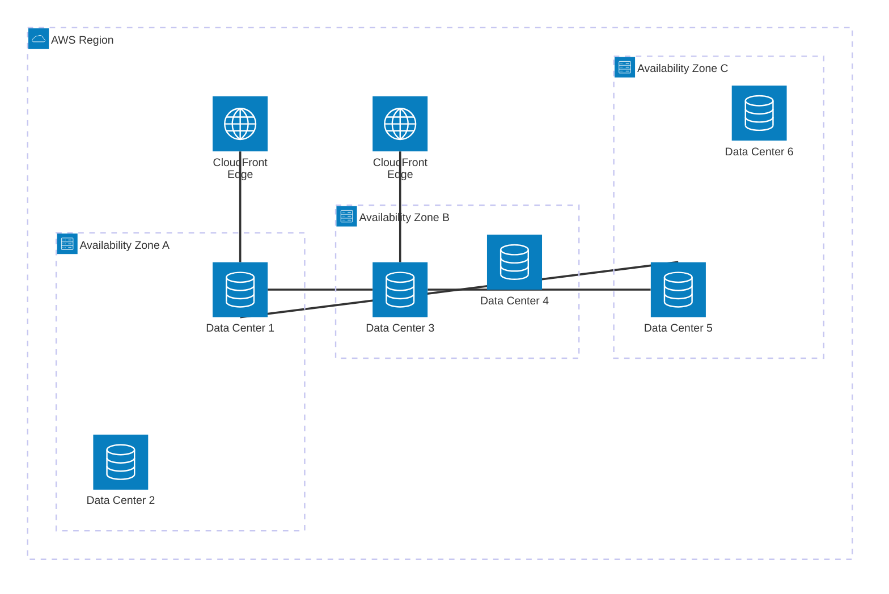
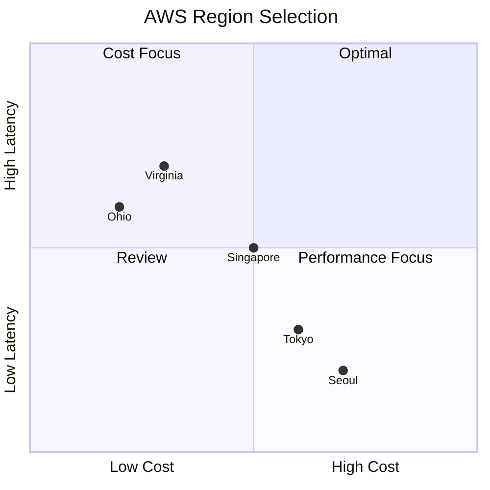
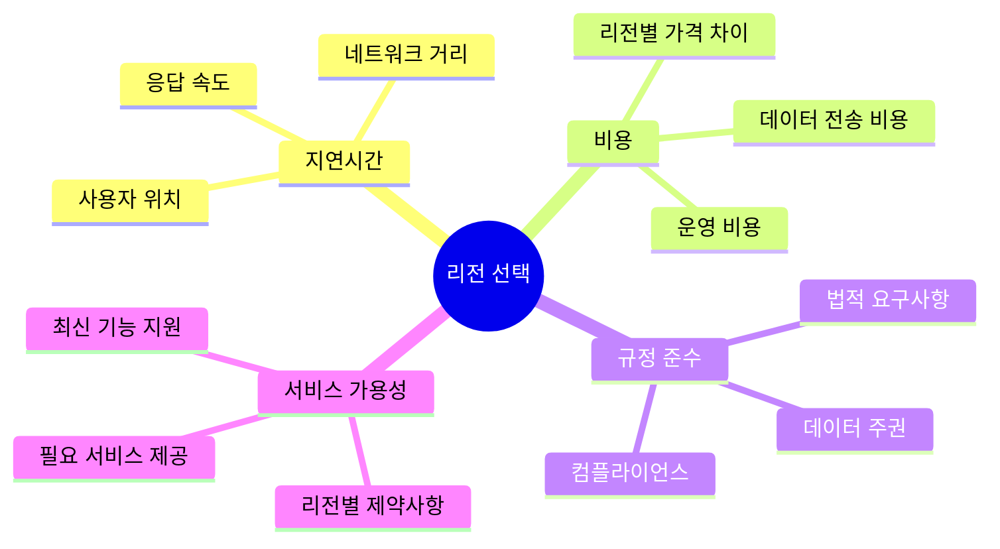
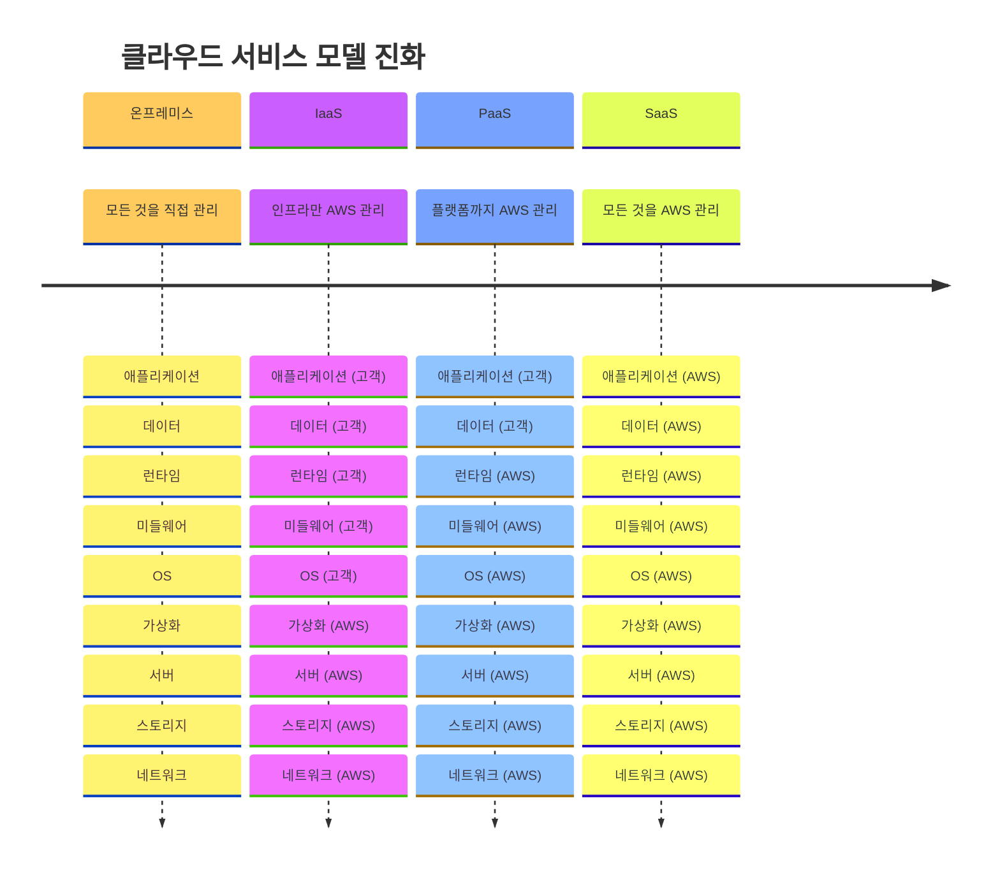
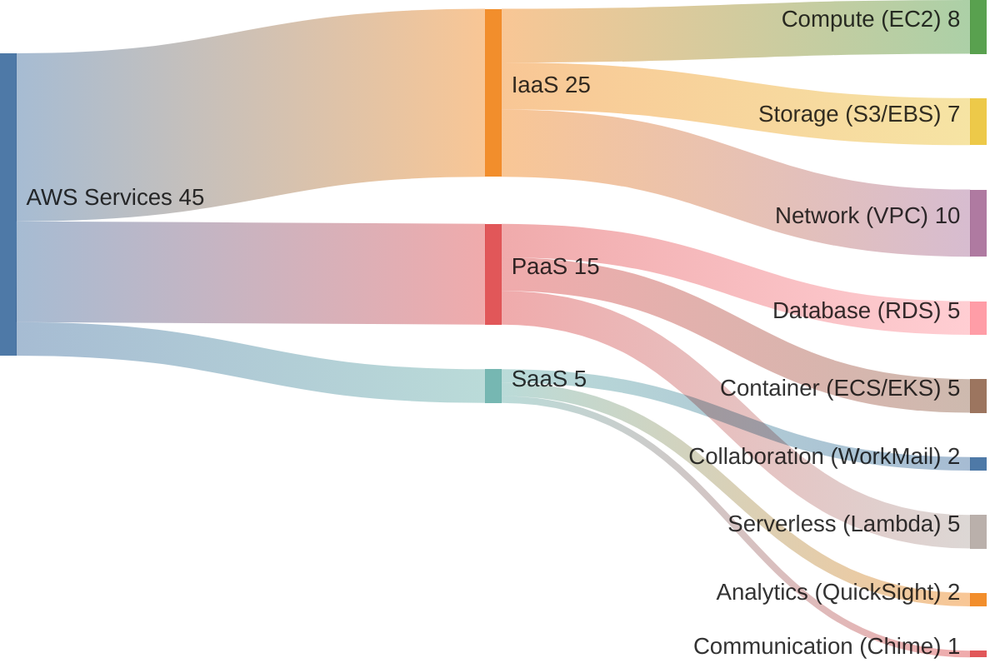
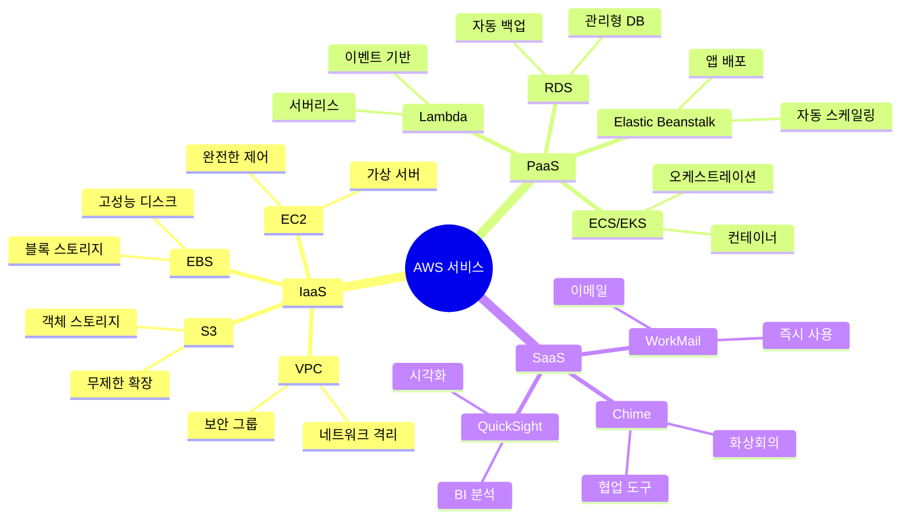
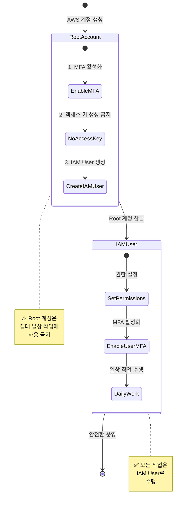

# Week 5 Day 1 Session 1: AWS 기초 개념 (09:00-09:50)

<div align="center">

**🌍 글로벌 인프라** • **☁️ 클라우드 모델** • **🔐 계정 구조** • **💰 프리티어**

*AWS의 기본 개념과 글로벌 인프라 이해*

</div>

---

## 🕘 세션 정보
- **시간**: 09:00-09:50 (50분)
- **목표**: AWS 클라우드의 기본 개념과 글로벌 인프라 구조 이해
- **방식**: 이론 강의 + 실생활 비유 + 시각적 자료

## 🎯 학습 목표

### 📚 학습 목표
- **이해 목표**: AWS 글로벌 인프라(Region, AZ, Edge Location)의 구조와 역할 이해
- **적용 목표**: 클라우드 컴퓨팅 모델(IaaS, PaaS, SaaS)을 실무 상황에 적용
- **협업 목표**: AWS 계정 구조와 프리티어 활용 전략을 팀원과 공유

### 🛠️ 구현 목표
- AWS 계정 생성 및 기본 설정
- 프리티어 한도 이해 및 비용 관리 계획 수립
- 리전 선택 기준 파악

---

## 🤔 왜 필요한가? (5분)

### 현실 문제 상황

**💼 실무 시나리오**: 
"스타트업에서 서비스를 런칭하려고 합니다. 서버를 직접 구매해야 할까요, 아니면 클라우드를 사용해야 할까요?"

**🏠 일상 비유**: 
"집을 사는 것 vs 렌트하는 것"
- **서버 구매**: 집을 사는 것처럼 초기 비용이 크지만 내 소유
- **클라우드**: 렌트하는 것처럼 필요한 만큼만 사용하고 비용 지불

**☁️ AWS 아키텍처**: 
```
온프레미스 (기존)          →          AWS 클라우드 (현대)
├── 서버 구매 (수천만원)    →    필요한 만큼만 사용 (시간당 과금)
├── 유지보수 인력 필요      →    AWS가 인프라 관리
├── 확장 어려움            →    클릭 몇 번으로 확장
└── 장애 대응 복잡         →    자동 복구 및 백업
```

**📊 시장 동향**: 
- 2024년 기준 AWS 시장 점유율 32% (1위)
- 전 세계 37개 리전, 117개 가용 영역 운영
- 700개 이상의 CloudFront POP 및 엣지 캐시
- Fortune 500 기업의 90% 이상이 AWS 사용

### 학습 전후 비교


---

## 📖 핵심 개념 (35분)

### 🔍 개념 1: AWS 글로벌 인프라 (12분)

> **정의**: AWS는 전 세계에 분산된 데이터센터를 통해 서비스를 제공하는 글로벌 클라우드 인프라

**핵심 구성 요소**:
- **AWS Cloud**: 전 세계 분산 인프라
- **Region**: 지리적으로 분리된 데이터센터 그룹 (현재 37개 리전)
- **Availability Zone (AZ)**: Region 내 물리적으로 분리된 데이터센터 (117개 AZ)
- **Edge Location**:  콘텐츠 전송 네트워크(CDN) 엣지 서버 (700개 이상)

#### 🏗️ AWS 글로벌 인프라 구조



#### 📊 인프라 계층 구조

| 계층 | 설명 | 개수 (2024년 10월) | 역할 |
|------|------|---------------------|------|
| **Region** | 지리적으로 분리된 지역 | 37개 | 데이터 주권, 지연시간 최소화 |
| **Availability Zone (AZ)** | Region 내 물리적으로 분리된 데이터센터 | 117개 | 고가용성, 장애 격리 |
| **Edge Location** | 콘텐츠 전송 네트워크(CDN) 거점 | 700개+ | 콘텐츠 캐싱, 빠른 전송 |

#### 🌍 실생활 비유

**Region = 도시**
- 서울 리전 (ap-northeast-2)
- 도쿄 리전 (ap-northeast-1)
- 버지니아 리전 (us-east-1)

**Availability Zone = 구/동**
- 서울 리전 내 AZ-A, AZ-B, AZ-C
- 각 AZ는 물리적으로 분리된 데이터센터
- 하나의 AZ가 장애가 나도 다른 AZ는 정상 운영

**Edge Location = 편의점**
- 사용자와 가까운 곳에서 콘텐츠 제공
- CloudFront CDN 서비스 활용
- 빠른 콘텐츠 전송

#### 🔧 리전 선택 기준



**리전 선택 4대 고려사항**:



**실무 예시**:
- **한국 서비스**: **ap-northeast-2 (서울)** 선택 ⭐ 기본 권장
- **글로벌 서비스**: 주요 시장별 리전 선택 (서울, 도쿄, 버지니아)
- **규정 준수**: 금융 서비스는 데이터 주권 법규에 따라 리전 선택

**💡 Week 5 실습 기준 리전**: **ap-northeast-2 (서울)**
- 모든 Lab 실습은 서울 리전 사용
- 한국 사용자 기준 최저 지연시간
- 한국어 지원 및 기술 지원 용이

#### 💡 AWS 공식 문서

**AWS 글로벌 인프라 현황 (2024년 10월)**:
- **37개 리전**: 개별 다중 가용 영역을 갖춘 지리적 리전
- **117개 가용 영역**: 물리적으로 분리된 독립적인 데이터센터
- **700개 이상 POP**: CloudFront 엣지 로케이션 및 리전 엣지 캐시
- **43개 로컬/Wavelength 영역**: 초저지연 애플리케이션 지원

**참조**: [AWS 글로벌 인프라 공식 페이지](https://aws.amazon.com/ko/about-aws/global-infrastructure/)

---

### 🔍 개념 2: 클라우드 컴퓨팅 모델 (12분)

> **정의**: 클라우드 서비스는 제공하는 관리 수준에 따라 IaaS, PaaS, SaaS로 구분

**AWS 서비스 모델 예시**:
-  **IaaS**: Amazon EC2 (완전한 제어)
-  **PaaS**: Elastic Beanstalk (플랫폼 관리)
-  **SaaS**: WorkMail (즉시 사용)

#### ☁️ 클라우드 서비스 모델 비교



#### 📊 서비스 모델 비교표

| 구분 | IaaS | PaaS | SaaS |
|------|------|------|------|
| **정의** | 인프라만 제공 | 플랫폼까지 제공 | 소프트웨어까지 제공 |
| **관리 범위** | OS부터 직접 관리 | 애플리케이션만 관리 | 사용만 하면 됨 |
| **AWS 예시** | EC2, VPC, S3 | Elastic Beanstalk, RDS | WorkMail, Chime |
| **유연성** | 높음 | 중간 | 낮음 |
| **관리 부담** | 높음 | 중간 | 낮음 |
| **적합한 경우** | 완전한 제어 필요 | 빠른 개발 필요 | 즉시 사용 필요 |

#### 🏠 실생활 비유

**IaaS = 빈 집 렌트**
- 집(서버)만 제공
- 가구(OS, 미들웨어)는 직접 설치
- 완전한 자유도, 높은 관리 부담

**PaaS = 가구 포함 렌트**
- 집 + 기본 가구(플랫폼) 제공
- 개인 물건(애플리케이션)만 가져오면 됨
- 적절한 자유도, 중간 관리 부담

**SaaS = 호텔**
- 모든 것이 준비됨
- 사용만 하면 됨
- 낮은 자유도, 관리 부담 없음

#### 🔧 AWS 서비스 분류



**주요 서비스 카테고리**:



---

### 🔍 개념 3: AWS 계정 구조 & 프리티어 (11분)

> **정의**: AWS 계정은 Root, IAM User, Role로 구성되며, 프리티어를 통해 무료로 학습 가능

**핵심 보안 서비스**:
-  **IAM**: 권한 관리
-  **Organizations**: 계정 관리
-  **CloudTrail**: 감사 로그

#### 🔐 AWS 계정 구조


#### 📊 계정 유형 비교

| 구분 | Root Account | IAM User | IAM Role |
|------|--------------|----------|----------|
| **권한** | 모든 권한 | 제한된 권한 | 임시 권한 |
| **사용 시기** | 계정 생성 시만 | 일상적 작업 | 서비스 간 연동 |
| **MFA 필수** | ✅ 필수 | ✅ 권장 | ❌ 불필요 |
| **비밀번호** | ✅ 있음 | ✅ 있음 | ❌ 없음 |
| **액세스 키** | ⚠️ 생성 금지 | ✅ 가능 | ❌ 불필요 |

#### 🔒 보안 베스트 프랙티스



**⚠️ 중요 보안 규칙**:
1. **Root 계정은 절대 일상 작업에 사용 금지**
2. **Root 계정에 MFA(다중 인증) 필수 설정**
3. **Root 계정의 액세스 키 생성 금지**
4. **모든 작업은 IAM User로 수행**

#### 💰 AWS 프리티어 활용 전략

**12개월 무료 서비스**:
-  **EC2**: t2.micro/t3.micro 750시간/월
-  **RDS**: db.t2.micro 750시간/월
-  **S3**: 5GB 스토리지
-  **CloudFront**: 50GB 전송

**항상 무료 서비스**:
-  **Lambda**: 100만 요청/월
-  **DynamoDB**: 25GB 스토리지
-  **SNS**: 100만 요청/월


#### 📊 프리티어 한도 (Week 5 실습 기준)

| 서비스 | 프리티어 한도 | Week 5 사용 예상 | 초과 여부 |
|--------|---------------|------------------|-----------|
| **EC2** | 750시간/월 | 120시간 (5일 × 24시간) | ✅ 안전 |
| **RDS** | 750시간/월 | 120시간 | ✅ 안전 |
| **S3** | 5GB 스토리지 | 1GB | ✅ 안전 |
| **데이터 전송** | 100GB/월 | 10GB | ✅ 안전 |
| **NAT Gateway** | ❌ 유료 | $0.045/시간 | ⚠️ 비용 발생 |

**💡 비용 절감 팁**:
- **실습 시간 엄수**: 50분 실습 후 즉시 리소스 정리
- **프리티어 서비스 우선**: t2.micro, t3.micro 인스턴스 사용
- **NAT Gateway 최소화**: 필요시에만 생성, 즉시 삭제
- **비용 알림 설정**: $5 초과 시 알림 설정

#### 🔧 프리티어 모니터링

```bash
# AWS CLI로 프리티어 사용량 확인
aws ce get-cost-and-usage \
  --time-period Start=2025-01-01,End=2025-01-31 \
  --granularity MONTHLY \
  --metrics "BlendedCost" "UnblendedCost" \
  --group-by Type=DIMENSION,Key=SERVICE
```

**AWS Console 경로**:
```
AWS Console → Billing Dashboard → Free Tier
```

---

## 💭 함께 생각해보기 (10분)

### 🤝 페어 토론 (5분)

**토론 주제**:
1. **리전 선택**: "한국 서비스를 만든다면 어떤 리전을 선택하고, 그 이유는?"
2. **서비스 모델**: "우리 프로젝트에 IaaS, PaaS, SaaS 중 어떤 것이 적합할까?"
3. **비용 관리**: "프리티어를 최대한 활용하려면 어떻게 해야 할까?"

**페어 활동 가이드**:
- 👥 **자유 페어링**: 관심사가 비슷한 사람끼리
- 🔄 **역할 교대**: 5분씩 설명자/질문자 역할 바꾸기
- 📝 **핵심 정리**: 대화 내용 중 중요한 점 메모하기

### 🎯 전체 공유 (5분)

**공유 내용**:
- 각 페어의 리전 선택 이유
- 서비스 모델 선택 기준
- 비용 절감 아이디어

### 💡 이해도 체크 질문

- ✅ "Region, AZ, Edge Location의 차이를 설명할 수 있나요?"
- ✅ "IaaS, PaaS, SaaS를 실생활 예시로 설명할 수 있나요?"
- ✅ "Root 계정과 IAM User의 차이를 아나요?"
- ✅ "프리티어 한도를 초과하지 않으려면 어떻게 해야 하나요?"

---

## 🔑 핵심 키워드

### 📚 오늘의 핵심 용어

#### 🔤 기본 용어
- **Region (리전)**: 지리적으로 분리된 AWS 데이터센터 그룹
- **Availability Zone (AZ)**: Region 내 물리적으로 분리된 데이터센터
- **Edge Location**: CloudFront CDN 서비스를 위한 콘텐츠 캐싱 거점

#### 🔤 기술 용어
- **IaaS**: Infrastructure as a Service (인프라만 제공)
- **PaaS**: Platform as a Service (플랫폼까지 제공)
- **SaaS**: Software as a Service (소프트웨어까지 제공)
- **IAM**: Identity and Access Management (권한 관리)
- **MFA**: Multi-Factor Authentication (다중 인증)

#### 🔤 실무 용어
- **Free Tier**: 12개월 무료 또는 항상 무료 서비스
- **Root Account**: 최고 권한을 가진 계정 (일상 작업 금지)
- **IAM User**: 일상 작업용 사용자 계정
- **IAM Role**: 서비스 간 연동을 위한 임시 권한

---

## 📝 세션 마무리

### ✅ 오늘 세션 성과

**학습한 내용**:
- ✅ AWS 글로벌 인프라 구조 (Region, AZ, Edge Location)
- ✅ 클라우드 컴퓨팅 모델 (IaaS, PaaS, SaaS)
- ✅ AWS 계정 구조 및 보안 베스트 프랙티스
- ✅ 프리티어 활용 전략 및 비용 관리

**실무 적용**:
- 리전 선택 기준 파악
- 서비스 모델 선택 능력
- 보안 설정 중요성 인식
- 비용 관리 전략 수립

### 🎯 다음 세션 준비

**Session 2: VPC 아키텍처 (10:00-10:50)**
- VPC 개념 및 CIDR 블록
- Subnet (Public/Private) 설계
- Internet Gateway & NAT Gateway
- Route Table 설정

**사전 준비**:
- AWS 계정 생성 (아직 안 했다면)
- MFA 설정 완료
- IAM User 생성 및 로그인

---

## 🔗 공식 문서 (필수)

**⚠️ 학생들이 직접 확인해야 할 공식 문서**:
- 📘 [AWS 글로벌 인프라](https://aws.amazon.com/about-aws/global-infrastructure/)
- 📗 [AWS 계정 및 IAM 사용자 가이드](https://docs.aws.amazon.com/IAM/latest/UserGuide/introduction.html)
- 📙 [AWS 프리티어](https://aws.amazon.com/free/)
- 📕 [AWS 요금 계산기](https://calculator.aws/)
- 🆕 [AWS 최신 업데이트](https://aws.amazon.com/new/)

---

<div align="center">

**🌍 글로벌 인프라** • **☁️ 클라우드 모델** • **🔐 보안 우선** • **💰 비용 관리**

*AWS의 기본을 탄탄히 다지는 첫 걸음*

</div>
