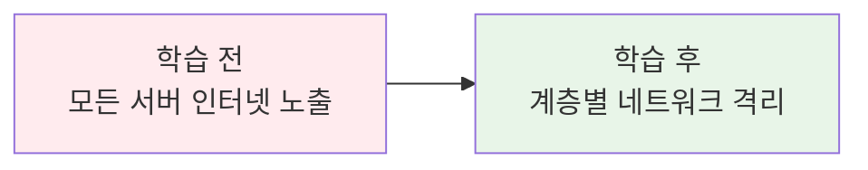
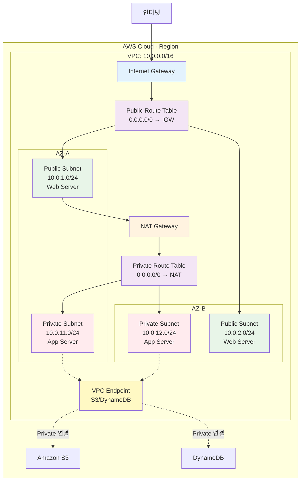
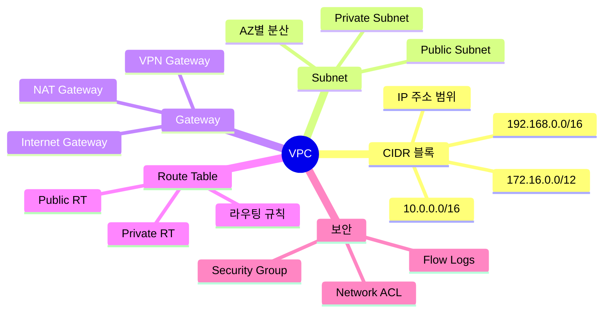
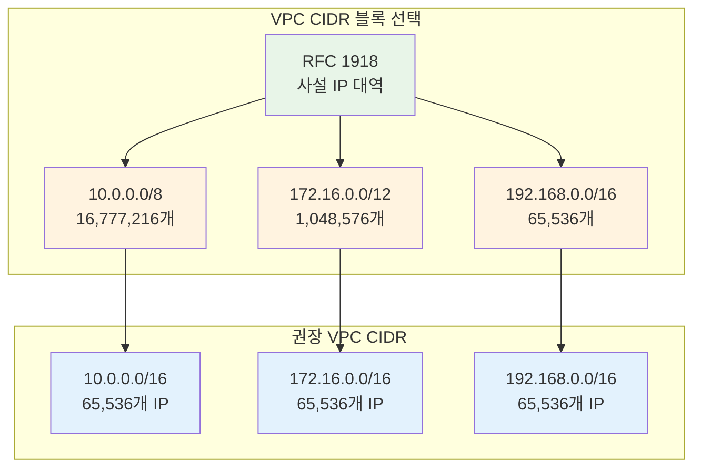
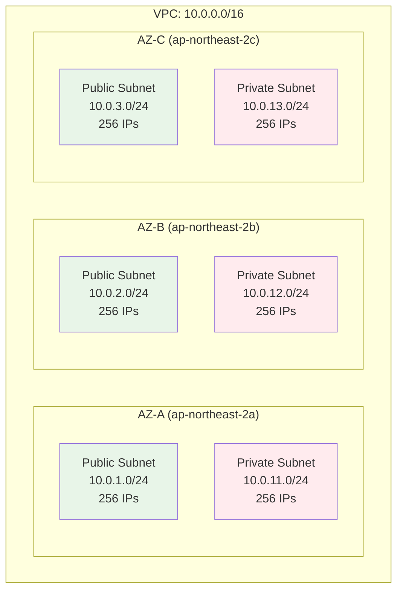
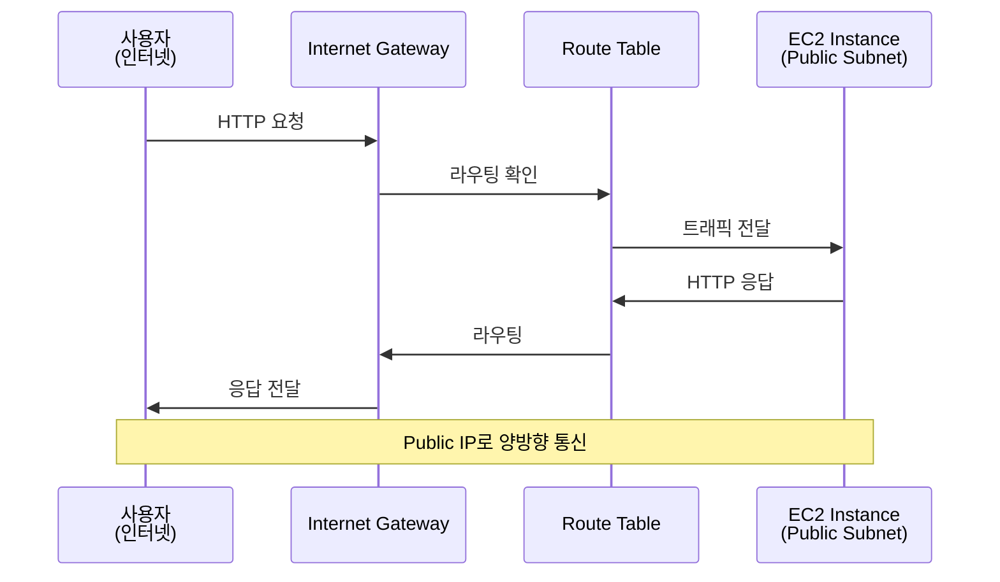
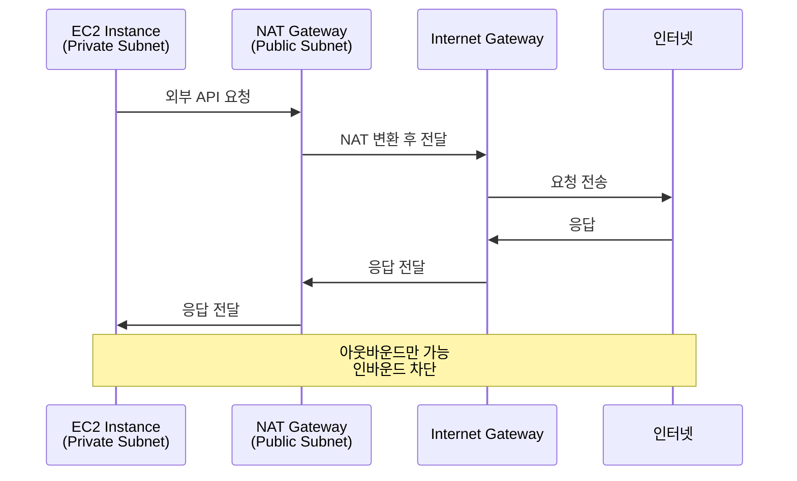
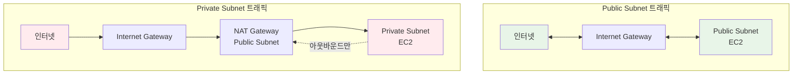

# Week 5 Day 1 Session 2: VPC 아키텍처 (10:00-10:50)

<div align="center">

**🌐 VPC 개념** • **📊 CIDR 블록** • **🔀 Subnet 설계** • **🚪 Gateway**

*AWS 네트워크의 기초, VPC 완전 정복*

</div>

---

## 🕘 세션 정보
- **시간**: 10:00-10:50 (50분)
- **목표**: VPC 네트워크 구조와 CIDR 블록 설계 이해
- **방식**: 이론 강의 + 실습 예제 + 네트워크 설계

## 🎯 학습 목표

### 📚 학습 목표
- **이해 목표**: VPC의 생성 배경과 필요성, CIDR 블록 개념 완전 이해
- **적용 목표**: Public/Private Subnet 설계 및 Gateway 구성 방법 습득
- **협업 목표**: 팀 프로젝트를 위한 네트워크 아키텍처 설계 능력

### 🛠️ 구현 목표
- VPC CIDR 블록 계산 및 설계
- Subnet 분할 및 배치 전략
- Internet Gateway와 NAT Gateway 역할 파악

---

## 🤔 왜 필요한가? (5분)

### 현실 문제 상황

**💼 실무 시나리오**: 
"회사에서 AWS에 서비스를 배포하려고 합니다. 모든 서버를 인터넷에 노출해야 할까요, 아니면 일부만 노출해야 할까요?"

**🏠 일상 비유**: 
"아파트 단지의 보안 시스템"
- **VPC**: 아파트 단지 전체 (외부와 격리된 공간)
- **Public Subnet**: 1층 상가 (외부인 출입 가능)
- **Private Subnet**: 주거 공간 (주민만 출입 가능)
- **Internet Gateway**: 정문 (외부와 연결)
- **NAT Gateway**: 택배 보관함 (내부에서 외부로만 통신)

**☁️ AWS 아키텍처**: 
```
온프레미스 (기존)              →          AWS VPC (현대)
├── 물리적 네트워크 구성        →    논리적 네트워크 격리
├── 라우터, 스위치 구매         →    소프트웨어 정의 네트워크
├── 방화벽 설정 복잡           →    Security Group 간단 설정
└── 확장 어려움                →    클릭 몇 번으로 확장
```

**📊 시장 동향**: 
- Netflix: 수천 개의 VPC로 서비스 격리
- Airbnb: 리전별 VPC로 글로벌 서비스
- Slack: Private Subnet에 민감 데이터 격리
- 금융권: 규정 준수를 위한 VPC 네트워크 설계 필수

### 학습 전후 비교



---

## 📖 핵심 개념 (35분)

### 🔍 개념 1: VPC 기본 개념 (12분)

> **정의**: Amazon VPC는 AWS 클라우드에서 논리적으로 격리된 가상 네트워크를 제공하는 서비스

**핵심 VPC 서비스**:
-  **Amazon VPC**: 가상 네트워크
-  **Internet Gateway**: 인터넷 연결
-  **NAT Gateway**: 아웃바운드 전용

#### 🏗️ VPC 생성 배경 (Why?)

**문제 상황**:
- **온프레미스**: 물리적 네트워크 구성의 복잡성과 높은 비용
- **초기 클라우드**: 공유 네트워크 환경의 보안 우려
- **멀티 테넌시**: 고객 간 네트워크 격리 필요
- **규정 준수**: 데이터 주권 및 보안 규정 충족

**AWS VPC 솔루션**:
- 논리적으로 격리된 가상 네트워크
- 완전한 네트워크 제어권 (IP 범위, 라우팅, 게이트웨이)
- 온프레미스와 동일한 네트워크 개념 적용
- 하이브리드 클라우드 구성 가능 (VPN, Direct Connect)

#### 📊 VPC 아키텍처 구조



#### 🔧 VPC 핵심 원리 (How?)

**VPC 구성 요소**:



**작동 원리**:
1. **VPC 생성**: CIDR 블록으로 IP 주소 범위 정의
2. **Subnet 분할**: AZ별로 네트워크 분할
3. **Gateway 연결**: Internet Gateway로 외부 연결
4. **Route Table 설정**: 트래픽 경로 제어
5. **보안 설정**: Security Group/NACL로 방화벽 구성

#### 💡 주요 사용 사례 (When?)

**적합한 경우**:
- 웹 애플리케이션 호스팅 (Public + Private Subnet)
- 데이터베이스 격리 (Private Subnet only)
- 하이브리드 클라우드 (VPN/Direct Connect)
- 멀티 티어 아키텍처 (Web/App/DB 분리)

**실제 사례**:
- **Netflix**: 수천 개의 VPC로 서비스 격리, 리전별 독립 운영
- **Airbnb**: 리전별 VPC로 글로벌 서비스, 데이터 주권 준수
- **Slack**: Private Subnet에 민감 데이터 격리, 보안 강화
- **금융권**: 규정 준수를 위한 완전 격리 네트워크

---

### 🔍 개념 2: CIDR 블록 & Subnet 설계 (12분)

> **정의**: CIDR(Classless Inter-Domain Routing)는 IP 주소를 효율적으로 할당하는 방법

#### 📊 CIDR 블록 이해

**CIDR 표기법**:
```
10.0.0.0/16
├── 10.0.0.0: 네트워크 주소
├── /16: 서브넷 마스크 (앞 16비트 고정)
└── 사용 가능 IP: 2^(32-16) = 65,536개
```

**주요 CIDR 블록**:

| CIDR | 서브넷 마스크 | 사용 가능 IP | 용도 |
|------|--------------|-------------|------|
| /16 | 255.255.0.0 | 65,536개 | 대규모 VPC |
| /20 | 255.255.240.0 | 4,096개 | 중규모 VPC |
| /24 | 255.255.255.0 | 256개 | Subnet 단위 |
| /28 | 255.255.255.240 | 16개 | 최소 Subnet |

#### 🎯 VPC CIDR 블록 설계



**⚠️ CIDR 블록 선택 시 주의사항**:
- **한 번 설정하면 변경 불가**: 신중한 설계 필요
- **다른 VPC와 중복 방지**: VPC Peering 시 문제 발생
- **온프레미스와 중복 방지**: VPN 연결 시 라우팅 충돌
- **충분한 여유 확보**: 향후 확장 고려

#### 🔀 Subnet 분할 전략

**Subnet 설계 원칙**:



**Subnet 분할 예시** (VPC: 10.0.0.0/16):

| Subnet 유형 | AZ | CIDR | 사용 가능 IP | 용도 |
|-------------|-----|------|-------------|------|
| Public | AZ-A | 10.0.1.0/24 | 251개 | 웹 서버 |
| Public | AZ-B | 10.0.2.0/24 | 251개 | 웹 서버 |
| Private | AZ-A | 10.0.11.0/24 | 251개 | 앱 서버 |
| Private | AZ-B | 10.0.12.0/24 | 251개 | 앱 서버 |
| Private | AZ-A | 10.0.21.0/24 | 251개 | 데이터베이스 |
| Private | AZ-B | 10.0.22.0/24 | 251개 | 데이터베이스 |

**💡 AWS 예약 IP 주소** (각 Subnet마다):
- **첫 번째 IP** (10.0.1.0): 네트워크 주소
- **두 번째 IP** (10.0.1.1): VPC 라우터
- **세 번째 IP** (10.0.1.2): DNS 서버
- **네 번째 IP** (10.0.1.3): 미래 사용 예약
- **마지막 IP** (10.0.1.255): 브로드캐스트 주소

**실제 사용 가능 IP**: 256 - 5 = **251개**

---

### 🔍 개념 3: Gateway & Route Table (11분)

> **정의**: Gateway는 VPC와 외부 네트워크를 연결하는 관문, Route Table은 트래픽 경로를 제어

#### 🚪 Internet Gateway (IGW)

**Internet Gateway 역할**:
- VPC와 인터넷 간 통신 제공
- Public IP를 가진 인스턴스의 인터넷 접근
- 인터넷에서 Public IP로 접근 가능
- VPC당 하나의 IGW만 연결 가능



#### 🔀 NAT Gateway

**NAT Gateway 역할**:
- Private Subnet의 아웃바운드 전용 인터넷 접근
- 인바운드 트래픽 차단 (보안 강화)
- Public Subnet에 배치
- Elastic IP 필요



#### 📋 Route Table 설정

**Public Subnet Route Table**:

| Destination | Target | 설명 |
|-------------|--------|------|
| 10.0.0.0/16 | local | VPC 내부 통신 |
| 0.0.0.0/0 | igw-xxxxx | 인터넷 트래픽 |

**Private Subnet Route Table**:

| Destination | Target | 설명 |
|-------------|--------|------|
| 10.0.0.0/16 | local | VPC 내부 통신 |
| 0.0.0.0/0 | nat-xxxxx | 아웃바운드 전용 |

#### 🔄 트래픽 흐름 비교



#### 💰 비용 구조

**무료 항목**:
- VPC 생성 및 사용: $0
- Subnet, Route Table: $0
- Internet Gateway: $0
- Security Groups, NACL: $0

**유료 항목**:
- **NAT Gateway**: $0.045/시간 + 데이터 처리 $0.045/GB
- **VPN Connection**: $0.05/시간
- **VPC Peering 데이터 전송**: $0.01/GB (동일 AZ)

**비용 최적화 팁**:
- NAT Gateway 대신 NAT Instance 사용 (저비용)
- VPC Endpoint로 S3/DynamoDB 무료 접근
- 불필요한 데이터 전송 최소화
- 동일 AZ 내 리소스 배치

---

## 💭 함께 생각해보기 (10분)

### 🤝 페어 토론 (5분)

**토론 주제**:
1. **CIDR 설계**: "우리 프로젝트에 적합한 VPC CIDR 블록은?"
2. **Subnet 분할**: "Public과 Private Subnet을 어떻게 나눌까?"
3. **비용 최적화**: "NAT Gateway 비용을 줄이려면?"

**페어 활동 가이드**:
- 👥 **자유 페어링**: 네트워크 경험이 다른 사람끼리
- 🔄 **역할 교대**: 5분씩 설계자/검토자 역할 바꾸기
- 📝 **설계 스케치**: 간단한 네트워크 다이어그램 그리기

### 🎯 전체 공유 (5분)

**공유 내용**:
- 각 페어의 VPC 설계안
- CIDR 블록 선택 이유
- 비용 절감 아이디어

### 💡 이해도 체크 질문

- ✅ "VPC CIDR 블록을 10.0.0.0/16으로 설정하면 몇 개의 IP를 사용할 수 있나요?"
- ✅ "Public Subnet과 Private Subnet의 차이를 설명할 수 있나요?"
- ✅ "Internet Gateway와 NAT Gateway의 역할 차이를 아나요?"
- ✅ "Route Table에서 0.0.0.0/0의 의미는 무엇인가요?"

---

## 🔑 핵심 키워드

### 📚 오늘의 핵심 용어

#### 🔤 기본 용어
- **VPC**: Virtual Private Cloud (논리적으로 격리된 가상 네트워크)
- **CIDR**: Classless Inter-Domain Routing (IP 주소 할당 방법)
- **Subnet**: VPC 내 IP 주소 범위 (AZ별로 분할)
- **AZ**: Availability Zone (물리적으로 분리된 데이터센터)

#### 🔤 기술 용어
- **Internet Gateway (IGW)**: VPC와 인터넷 간 양방향 통신
- **NAT Gateway**: Private Subnet의 아웃바운드 전용 인터넷 접근
- **Route Table**: 네트워크 트래픽 경로 제어
- **Public Subnet**: Internet Gateway로 직접 연결된 Subnet
- **Private Subnet**: NAT Gateway를 통해서만 외부 접근 가능한 Subnet

#### 🔤 실무 용어
- **RFC 1918**: 사설 IP 주소 대역 표준
- **0.0.0.0/0**: 모든 IP 주소 (인터넷 전체)
- **local**: VPC 내부 통신
- **Elastic IP**: 고정 Public IP 주소

---

## 📝 세션 마무리

### ✅ 오늘 세션 성과

**학습한 내용**:
- ✅ VPC 개념과 생성 배경 이해
- ✅ CIDR 블록 계산 및 설계 방법
- ✅ Public/Private Subnet 분할 전략
- ✅ Internet Gateway와 NAT Gateway 역할
- ✅ Route Table 설정 방법

**실무 적용**:
- VPC 네트워크 아키텍처 설계 능력
- CIDR 블록 계산 및 Subnet 분할
- 보안을 고려한 네트워크 격리
- 비용 효율적인 Gateway 선택

### 🎯 다음 세션 준비

**Session 3: 보안 그룹 & EC2 기초 (11:00-11:50)**
- Security Groups vs Network ACL
- EC2 인스턴스 타입 및 선택
- AMI & Key Pair
- User Data 초기화

**사전 준비**:
- VPC CIDR 블록 설계 연습
- Subnet 분할 계산 연습
- 네트워크 다이어그램 스케치

---

## 🔗 공식 문서 (필수)

**⚠️ 학생들이 직접 확인해야 할 공식 문서**:
- 📘 [VPC란 무엇인가?](https://docs.aws.amazon.com/vpc/latest/userguide/what-is-amazon-vpc.html)
- 📗 [VPC 사용자 가이드](https://docs.aws.amazon.com/vpc/latest/userguide/)
- 📙 [Subnet CIDR 블록](https://docs.aws.amazon.com/vpc/latest/userguide/subnet-sizing.html)
- 📕 [VPC 요금](https://aws.amazon.com/vpc/pricing/)
- 🆕 [VPC 최신 업데이트](https://aws.amazon.com/about-aws/whats-new/networking/)

---

<div align="center">

**🌐 네트워크 격리** • **📊 CIDR 설계** • **🔀 Subnet 분할** • **🚪 Gateway 구성**

*AWS 네트워크의 기초를 탄탄히*

</div>
