# Week 5 Day 1 Session 3: 보안 그룹 & EC2 기초 (11:00-11:50)

<div align="center">

**🔒 Security Group** • **🛡️ Network ACL** • **💻 EC2 인스턴스** • **🔑 Key Pair**

*AWS 보안의 기초와 가상 서버 시작하기*

</div>

---

## 🕘 세션 정보
- **시간**: 11:00-11:50 (50분)
- **목표**: VPC 보안 설정과 EC2 인스턴스 기본 개념 이해
- **방식**: 이론 강의 + 보안 설계 + 인스턴스 타입 비교

## 🎯 학습 목표

### 📚 학습 목표
- **이해 목표**: Security Group과 Network ACL의 차이점 완전 이해
- **적용 목표**: EC2 인스턴스 타입 선택 기준과 AMI 개념 습득
- **협업 목표**: 보안 정책 설계 및 인스턴스 구성 전략 수립

### 🛠️ 구현 목표
- Security Group 규칙 설계
- EC2 인스턴스 타입 선택
- Key Pair 생성 및 관리
- User Data 스크립트 작성

---

## 🤔 왜 필요한가? (5분)

### 현실 문제 상황

**💼 실무 시나리오**: 
"웹 서버를 배포했는데 해킹 시도가 계속됩니다. 어떻게 보안을 강화해야 할까요?"

**🏠 일상 비유**: 
"아파트 보안 시스템"
- **Security Group**: 각 집의 현관문 (인스턴스 레벨)
- **Network ACL**: 아파트 동 출입구 (Subnet 레벨)
- **Key Pair**: 디지털 도어락 비밀번호
- **IAM Role**: 방문증 (서비스 간 접근 권한)

**☁️ AWS 아키텍처**: 
```
온프레미스 (기존)              →          AWS 보안 (현대)
├── 물리적 방화벽 장비          →    Security Group (소프트웨어)
├── 네트워크 ACL 설정          →    Network ACL (자동화)
├── SSH 키 관리 복잡           →    Key Pair (간편 관리)
└── 서버 초기 설정 수동        →    User Data (자동화)
```

**📊 시장 동향**: 
- 2024년 클라우드 보안 침해 사고의 80%가 잘못된 보안 그룹 설정
- Fortune 500 기업의 95%가 다층 보안 전략 사용
- Zero Trust 아키텍처 도입 증가 (모든 접근 검증)

### 학습 전후 비교

```mermaid
graph LR
    A[학습 전<br/>모든 포트 오픈] --> B[학습 후<br/>최소 권한 원칙]
    
    style A fill:#ffebee
    style B fill:#e8f5e8
```



---

## 📖 핵심 개념 (35분)

### 🔍 개념 1: Security Group vs Network ACL (12분)

> **정의**: Security Group은 인스턴스 레벨 방화벽, Network ACL은 Subnet 레벨 방화벽

**핵심 보안 서비스**:
-  **Security Group**: 인스턴스 방화벽
-  **Network ACL**: Subnet 방화벽
-  **AWS WAF**: 애플리케이션 방화벽

#### 🛡️ Multi-AZ 보안 아키텍처


#### 📊 Security Group vs Network ACL 비교

| 특징 | Security Group | Network ACL |
|------|----------------|-------------|
| **적용 레벨** | 인스턴스 (ENI) | Subnet |
| **상태 추적** | Stateful (응답 자동 허용) | Stateless (명시적 규칙) |
| **규칙 유형** | Allow만 가능 | Allow & Deny 가능 |
| **규칙 평가** | 모든 규칙 평가 | 번호 순서대로 평가 |
| **기본 정책** | 모든 인바운드 거부<br/>모든 아웃바운드 허용 | 모든 트래픽 허용 |
| **적용 방법** | 인스턴스에 직접 연결 | Subnet에 자동 적용 |

#### 🔒 Security Group 설정 예시

**웹 서버 Security Group**:

```mermaid
graph LR
    subgraph "Inbound Rules"
        A1[HTTP<br/>80<br/>0.0.0.0/0]
        A2[HTTPS<br/>443<br/>0.0.0.0/0]
        A3[SSH<br/>22<br/>내 IP만]
    end
    
    subgraph "Security Group"
        B[Web Server SG]
    end
    
    subgraph "Outbound Rules"
        C1[All Traffic<br/>0.0.0.0/0]
    end
    
    A1 --> B
    A2 --> B
    A3 --> B
    B --> C1
    
    style A1 fill:#e8f5e8
    style A2 fill:#e8f5e8
    style A3 fill:#ffebee
    style B fill:#e3f2fd
    style C1 fill:#fff3e0
```



**Inbound Rules** (들어오는 트래픽):
| Type | Protocol | Port | Source | 설명 |
|------|----------|------|--------|------|
| HTTP | TCP | 80 | 0.0.0.0/0 | 모든 곳에서 웹 접근 |
| HTTPS | TCP | 443 | 0.0.0.0/0 | 모든 곳에서 보안 웹 접근 |
| SSH | TCP | 22 | 내 IP | 관리자만 SSH 접근 |

**Outbound Rules** (나가는 트래픽):
| Type | Protocol | Port | Destination | 설명 |
|------|----------|------|-------------|------|
| All | All | All | 0.0.0.0/0 | 모든 외부 접근 허용 |

**⚠️ 보안 베스트 프랙티스**:
- ❌ **SSH 포트를 0.0.0.0/0으로 열지 마세요** (해킹 위험)
- ✅ **SSH는 내 IP 또는 회사 IP만 허용**
- ✅ **최소 권한 원칙**: 필요한 포트만 오픈
- ✅ **정기적 검토**: 사용하지 않는 규칙 제거

#### 🌐 Elastic IP & ENI

**Elastic IP (탄력적 IP)**:
- **정의**: 고정된 공인 IPv4 주소
- **용도**: 인스턴스 재시작 시에도 동일한 IP 유지
- **비용**: 
  - 실행 중인 인스턴스에 연결: 무료
  - 미사용 또는 중지된 인스턴스: 시간당 과금
- **제한**: 리전당 5개 (증가 요청 가능)

**ENI (Elastic Network Interface)**:
- **정의**: 가상 네트워크 카드
- **특징**: 
  - 하나의 EC2에 여러 ENI 연결 가능
  - Private IP, Public IP, Elastic IP 할당
  - Security Group 연결
- **용도**: 
  - 이중화 네트워크 구성
  - 관리 네트워크 분리
  - 라이선스 관리 (MAC 주소 고정)


---

### 🔍 개념 2: EC2 인스턴스 기초 (12분)

> **정의**: Amazon EC2는 클라우드에서 크기 조정 가능한 컴퓨팅 용량을 제공하는 가상 서버

**핵심 EC2 서비스**:
-  **Amazon EC2**: 가상 서버
-  **AMI**: 서버 이미지
-  **EBS**: 블록 스토리지

#### 💻 EC2 인스턴스 타입 분류

```mermaid
mindmap
  root((EC2 인스턴스))
    General Purpose
      T 시리즈
        t3.micro
        t3.small
        t3.medium
      M 시리즈
        m5.large
        m6i.xlarge
    Compute Optimized
      C 시리즈
        c5.large
        c6i.xlarge
    Memory Optimized
      R 시리즈
        r5.large
        r6i.xlarge
      X 시리즈
        x2gd.xlarge
    Storage Optimized
      I 시리즈
        i3.large
        i4i.xlarge
    Accelerated Computing
      P 시리즈
        p4d.24xlarge
      G 시리즈
        g5.xlarge
```



#### 📊 주요 인스턴스 타입 비교 (프리티어 중심)

| 인스턴스 타입 | vCPU | 메모리 | 네트워크 | 용도 | 프리티어 |
|--------------|------|--------|---------|------|---------|
| **t2.micro** | 1 | 1 GiB | 낮음 | 테스트, 학습 | ✅ 750시간/월 |
| **t3.micro** | 2 | 1 GiB | 최대 5 Gbps | 웹 서버, 소규모 앱 | ✅ 750시간/월 |
| **t3.small** | 2 | 2 GiB | 최대 5 Gbps | 중소규모 웹 | ✅ 750시간/월 |
| **t3.medium** | 2 | 4 GiB | 최대 5 Gbps | 중규모 앱 | ❌ 유료 |
| **m5.large** | 2 | 8 GiB | 최대 10 Gbps | 범용 워크로드 | ❌ 유료 |

**💡 T 시리즈 특징 (Burstable)**:
- **기본 성능**: CPU 크레딧 소진 시 기본 성능으로 동작
- **버스트 성능**: CPU 크레딧 사용하여 일시적 고성능
- **비용 효율**: 평소 낮은 사용률, 가끔 높은 성능 필요 시 최적
- **프리티어**: t2.micro, t3.micro 750시간/월 무료

#### 🎯 인스턴스 타입 선택 기준


**선택 가이드**:
- **학습/테스트**: t2.micro, t3.micro (프리티어)
- **소규모 웹**: t3.small, t3.medium
- **중규모 앱**: m5.large, m5.xlarge
- **고성능 컴퓨팅**: c5.xlarge, c6i.2xlarge
- **메모리 집약**: r5.large, r6i.xlarge

---

### 🔍 개념 3: AMI, Key Pair & User Data (11분)

> **정의**: AMI는 서버 이미지, Key Pair는 SSH 접근 키, User Data는 초기화 스크립트

#### 📀 AMI (Amazon Machine Image)

**AMI 구성 요소**:

```mermaid
graph TB
    subgraph "AMI 구조"
        A[AMI]
        B[Root Volume<br/>OS + 기본 설정]
        C[추가 Volume<br/>데이터 디스크]
        D[권한 설정<br/>Public/Private]
        E[메타데이터<br/>설명, 태그]
    end
    
    A --> B
    A --> C
    A --> D
    A --> E
    
    style A fill:#e3f2fd
    style B fill:#e8f5e8
    style C fill:#fff3e0
    style D fill:#ffebee
    style E fill:#f3e5f5
```



**주요 AMI 유형**:

| AMI 유형 | 제공자 | 비용 | 용도 |
|---------|--------|------|------|
| **Amazon Linux 2023** | AWS | 무료 | AWS 최적화 Linux |
| **Ubuntu Server** | Canonical | 무료 | 범용 Linux |
| **Windows Server** | Microsoft | 유료 | Windows 환경 |
| **Red Hat Enterprise** | Red Hat | 유료 | 엔터프라이즈 |
| **Custom AMI** | 사용자 | 무료 | 커스텀 설정 |

**💡 Week 5 권장 AMI**: **Amazon Linux 2023**
- AWS 서비스와 최적화된 통합
- 보안 업데이트 자동 제공
- 프리티어 적용 가능
- yum/dnf 패키지 관리자

#### 🔑 Key Pair (SSH 키)

**Key Pair 동작 원리**:

```mermaid
sequenceDiagram
    participant U as 사용자
    participant AWS as AWS Console
    participant EC2 as EC2 Instance
    
    U->>AWS: 1. Key Pair 생성 요청
    AWS->>U: 2. Private Key 다운로드<br/>(my-key.pem)
    AWS->>EC2: 3. Public Key 저장
    
    Note over U,EC2: EC2 인스턴스 시작 후
    
    U->>EC2: 4. SSH 접속 시도<br/>ssh -i my-key.pem
    EC2->>EC2: 5. Public Key로 검증
    EC2->>U: 6. 접속 허용
    
    Note over U,EC2: Private Key 분실 시<br/>접속 불가능
```



**⚠️ Key Pair 관리 주의사항**:
- **Private Key 분실 시**: 해당 인스턴스 접속 불가능
- **보안 관리**: Private Key를 안전한 곳에 보관
- **권한 설정**: `chmod 400 my-key.pem` (읽기 전용)
- **재사용 가능**: 여러 인스턴스에 동일 Key Pair 사용 가능

#### 🚀 User Data (초기화 스크립트)

**User Data 활용**:

```bash
#!/bin/bash
# EC2 인스턴스 시작 시 자동 실행

# 1. 시스템 업데이트
yum update -y

# 2. Docker 설치
yum install -y docker
systemctl start docker
systemctl enable docker

# 3. 사용자 권한 추가
usermod -aG docker ec2-user

# 4. 애플리케이션 배포
docker run -d -p 80:80 nginx:alpine

# 5. 로그 기록
echo "User Data 실행 완료: $(date)" >> /var/log/user-data.log
```

**User Data 실행 흐름**:

```mermaid
stateDiagram-v2
    [*] --> Pending: EC2 시작
    
    state Pending {
        [*] --> BootOS: OS 부팅
        BootOS --> RunUserData: User Data 실행
        RunUserData --> InstallPackages: 패키지 설치
        InstallPackages --> StartServices: 서비스 시작
    }
    
    Pending --> Running: 초기화 완료
    Running --> [*]: 정상 운영
    
    note right of RunUserData
        ⚠️ 한 번만 실행
        재시작 시 실행 안 됨
    end note
```



**User Data 활용 사례**:
- **자동 설치**: Docker, Nginx, Node.js 등 자동 설치
- **설정 적용**: 환경변수, 설정 파일 자동 구성
- **애플리케이션 배포**: 컨테이너 자동 시작
- **모니터링 에이전트**: CloudWatch Agent 자동 설치

**⚠️ User Data 주의사항**:
- 인스턴스 **최초 시작 시에만 실행**
- 재시작 시에는 실행되지 않음
- 실행 로그: `/var/log/cloud-init-output.log`
- 오류 발생 시 인스턴스 시작 지연 가능

---

## 💭 함께 생각해보기 (10분)

### 🤝 페어 토론 (5분)

**토론 주제**:
1. **보안 설계**: "웹 서버와 DB 서버의 Security Group을 어떻게 설계할까?"
2. **인스턴스 선택**: "우리 프로젝트에 적합한 EC2 인스턴스 타입은?"
3. **자동화**: "User Data로 어떤 작업을 자동화할 수 있을까?"

**페어 활동 가이드**:
- 👥 **자유 페어링**: 보안 관심사가 비슷한 사람끼리
- 🔄 **역할 교대**: 5분씩 보안 설계자/검토자 역할
- 📝 **보안 규칙 작성**: Security Group 규칙 스케치

### 🎯 전체 공유 (5분)

**공유 내용**:
- 각 페어의 보안 설계안
- 인스턴스 타입 선택 이유
- User Data 자동화 아이디어

### 💡 이해도 체크 질문

- ✅ "Security Group과 Network ACL의 가장 큰 차이는?"
- ✅ "Stateful과 Stateless의 의미를 설명할 수 있나요?"
- ✅ "프리티어로 사용 가능한 EC2 인스턴스 타입은?"
- ✅ "User Data는 언제 실행되나요?"

---

## 🔑 핵심 키워드

### 📚 오늘의 핵심 용어

#### 🔤 기본 용어
- **Security Group**: 인스턴스 레벨 가상 방화벽
- **Network ACL**: Subnet 레벨 방화벽
- **EC2**: Elastic Compute Cloud (가상 서버)
- **AMI**: Amazon Machine Image (서버 이미지)

#### 🔤 기술 용어
- **Stateful**: 응답 트래픽 자동 허용 (Security Group)
- **Stateless**: 명시적 규칙 필요 (Network ACL)
- **Inbound**: 들어오는 트래픽
- **Outbound**: 나가는 트래픽
- **ENI**: Elastic Network Interface (가상 네트워크 카드)

#### 🔤 실무 용어
- **Key Pair**: SSH 접속을 위한 공개키/개인키 쌍
- **User Data**: 인스턴스 시작 시 실행되는 초기화 스크립트
- **Instance Type**: 인스턴스의 CPU, 메모리, 네트워크 사양
- **Burstable**: T 시리즈의 CPU 크레딧 기반 성능 변동

---

## 📝 세션 마무리

### ✅ 오늘 세션 성과

**학습한 내용**:
- ✅ Security Group과 Network ACL 차이점 이해
- ✅ 다층 보안 아키텍처 설계 방법
- ✅ EC2 인스턴스 타입 분류 및 선택 기준
- ✅ AMI, Key Pair, User Data 개념
- ✅ 보안 베스트 프랙티스

**실무 적용**:
- 최소 권한 원칙 기반 보안 설계
- 프리티어 활용한 비용 효율적 인스턴스 선택
- User Data로 배포 자동화
- Key Pair 안전한 관리

### 🎯 다음 세션 준비

**Session 4: 고객 사례 - 블로그 플랫폼 아키텍처 (12:00-12:50)**
- Medium 스타일 블로그 플랫폼 (WordPress)
- Docker Compose → AWS 마이그레이션
- VPC + EC2 + RDS 통합 아키텍처
- 실제 배포 시나리오

**사전 준비**:
- Security Group 규칙 설계 연습
- EC2 인스턴스 타입 비교 복습
- User Data 스크립트 작성 연습

---

## 🔗 공식 문서 (필수)

**⚠️ 학생들이 직접 확인해야 할 공식 문서**:
- 📘 [Security Groups 사용자 가이드](https://docs.aws.amazon.com/vpc/latest/userguide/vpc-security-groups.html)
- 📗 [Network ACL 가이드](https://docs.aws.amazon.com/vpc/latest/userguide/vpc-network-acls.html)
- 📙 [EC2 인스턴스 타입](https://aws.amazon.com/ec2/instance-types/)
- 📕 [EC2 요금](https://aws.amazon.com/ec2/pricing/)
- 🆕 [EC2 최신 업데이트](https://aws.amazon.com/about-aws/whats-new/compute/)

---

<div align="center">

**🔒 보안 우선** • **💻 가상 서버** • **🔑 안전한 접근** • **🚀 자동화**

*AWS 보안과 컴퓨팅의 기초*

</div>
