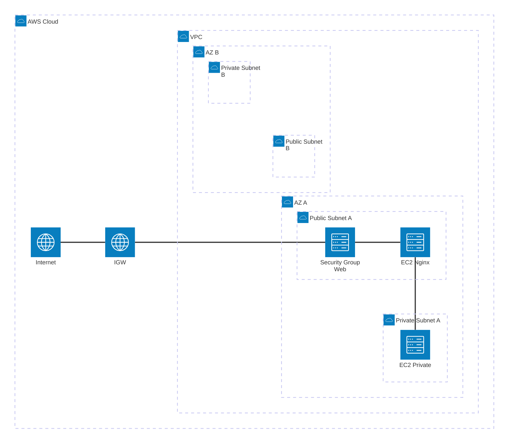
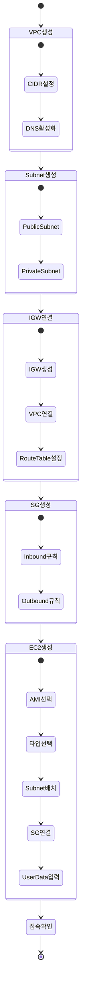
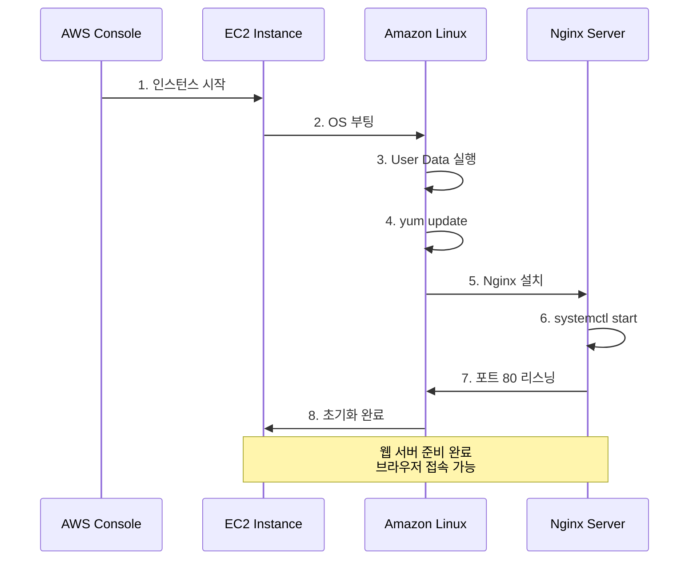

# Week 5 Day 1 Session 4: 첫 번째 웹 서버 배포 (12:00-12:50)

<div align="center">

**🌐 VPC 구성** • **💻 EC2 배포** • **🚀 Nginx 서버** • **✅ 접속 확인**

*Session 1-3에서 배운 모든 개념을 실제로 구현하기*

</div>

---

## 🕘 세션 정보
- **시간**: 12:00-12:50 (50분)
- **목표**: 오전에 배운 VPC, Security Group, EC2 개념을 실제 배포로 확인
- **방식**: 강사 시연 + 학생 Lab 준비

## 🎯 학습 목표

### 📚 학습 목표
- **이해 목표**: VPC부터 웹 서버까지 전체 흐름 이해
- **적용 목표**: 오후 Lab에서 직접 구현할 수 있도록 준비
- **협업 목표**: 배포 과정에서 발생하는 문제 해결 방법 공유

### 🛠️ 구현 목표
- VPC 및 Multi-AZ Subnet 구성
- Security Group 설정 (HTTP/HTTPS)
- EC2 인스턴스 생성 및 Nginx 배포
- 웹 브라우저로 접속 확인

---

## 🤔 왜 필요한가? (5분)

### 현실 문제 상황

**💼 실무 시나리오**: 
"간단한 웹 서비스를 AWS에 배포하고 싶어요. 어디서부터 시작해야 할까요?"

**🏠 일상 비유**: 
"새 집에 이사하기"
- **VPC**: 아파트 단지 선택
- **Subnet**: 동과 층 선택 (Public = 1층 상가, Private = 고층 주거)
- **Security Group**: 현관문 보안 설정
- **EC2**: 실제 집 (서버)
- **Nginx**: 집에 설치하는 가구 (웹 서버)

**☁️ AWS 아키텍처**: 
오늘 만들 구조는 가장 기본적인 웹 서비스 배포 패턴입니다.

**📊 시장 동향**: 
- 스타트업의 90%가 이런 구조로 시작
- 점진적으로 확장 가능한 기본 아키텍처
- 학습 비용 최소화, 실무 적용 최대화

---

## 📖 핵심 개념 (35분)

### 🔍 개념 1: 오늘 만들 아키텍처 (12분)

> **정의**: VPC + Multi-AZ Subnet + EC2 + Nginx로 구성된 기본 웹 서비스

#### 🏗️ 전체 아키텍처



#### 📋 구성 요소 상세

**1. VPC 설정**:
| 항목 | 값 | 설명 |
|------|-----|------|
| **VPC CIDR** | 10.0.0.0/16 | 65,536개 IP 주소 |
| **이름** | week5-day1-vpc | 실습용 VPC |
| **DNS 호스트 이름** | 활성화 | 인스턴스 DNS 이름 자동 할당 |

**2. Subnet 설정**:
| Subnet | AZ | CIDR | 타입 | 용도 |
|--------|-----|------|------|------|
| **Public-A** | ap-northeast-2a | 10.0.1.0/24 | Public | 웹 서버 |
| **Private-A** | ap-northeast-2a | 10.0.11.0/24 | Private | 내부 서버 |
| **Public-B** | ap-northeast-2b | 10.0.2.0/24 | Public | 예비 |
| **Private-B** | ap-northeast-2b | 10.0.12.0/24 | Private | 예비 |

**3. Security Group 규칙**:

**Inbound Rules** (들어오는 트래픽):
| Type | Protocol | Port | Source | 설명 |
|------|----------|------|--------|------|
| HTTP | TCP | 80 | 0.0.0.0/0 | 웹 접속 |
| HTTPS | TCP | 443 | 0.0.0.0/0 | 보안 웹 접속 |
| SSH | TCP | 22 | 내 IP | 관리자 접속 |

**Outbound Rules** (나가는 트래픽):
| Type | Protocol | Port | Destination | 설명 |
|------|----------|------|-------------|------|
| All | All | All | 0.0.0.0/0 | 모든 외부 접근 |

**4. EC2 인스턴스**:
| 항목 | Public EC2 | Private EC2 |
|------|-----------|-------------|
| **AMI** | Amazon Linux 2023 | Amazon Linux 2023 |
| **타입** | t3.micro | t3.micro |
| **Subnet** | Public-A | Private-A |
| **Public IP** | 자동 할당 | 없음 |
| **용도** | Nginx 웹 서버 | 내부 서비스 |

---

### 🔍 개념 2: 배포 순서와 흐름 (12분)

> **정의**: VPC → Subnet → IGW → Route Table → Security Group → EC2 순서로 생성

#### 📊 배포 단계



#### 🔑 각 단계별 핵심 포인트

**Step 1: VPC 생성**
- CIDR 블록 신중히 선택 (나중에 변경 불가)
- DNS 호스트 이름 반드시 활성화

**Step 2: Subnet 생성**
- Public/Private 구분 명확히
- Multi-AZ로 고가용성 준비

**Step 3: Internet Gateway**
- VPC당 1개만 필요
- Route Table에 0.0.0.0/0 → IGW 규칙 추가

**Step 4: Security Group**
- 최소 권한 원칙 적용
- SSH는 내 IP만 허용

**Step 5: EC2 생성**
- Public Subnet에 배치
- Public IP 자동 할당 활성화
- User Data로 Nginx 자동 설치

---

### 🔍 개념 3: User Data로 Nginx 자동 설치 (11분)

> **정의**: EC2 시작 시 자동으로 실행되는 스크립트로 Nginx 설치 및 시작

#### 🚀 User Data 스크립트

```bash
#!/bin/bash
# Week 5 Day 1 - Nginx 자동 설치 스크립트

# 1. 시스템 업데이트
yum update -y

# 2. Nginx 설치
yum install -y nginx

# 3. Nginx 시작 및 부팅 시 자동 시작 설정
systemctl start nginx
systemctl enable nginx

# 4. 간단한 HTML 페이지 생성
cat > /usr/share/nginx/html/index.html <<EOF
<!DOCTYPE html>
<html>
<head>
    <title>Week 5 Day 1 - First Web Server</title>
    <style>
        body {
            font-family: Arial, sans-serif;
            text-align: center;
            padding: 50px;
            background: linear-gradient(135deg, #667eea 0%, #764ba2 100%);
            color: white;
        }
        .container {
            background: rgba(255,255,255,0.1);
            padding: 40px;
            border-radius: 10px;
        }
        h1 { font-size: 3em; margin-bottom: 20px; }
        p { font-size: 1.5em; }
    </style>
</head>
<body>
    <div class="container">
        <h1>🎉 성공!</h1>
        <p>Week 5 Day 1 첫 번째 웹 서버 배포 완료</p>
        <p>Hostname: $(hostname)</p>
        <p>Private IP: $(hostname -I)</p>
    </div>
</body>
</html>
EOF

# 5. 로그 기록
echo "Nginx 설치 완료: $(date)" >> /var/log/user-data.log
```

#### 📊 User Data 실행 흐름



#### ✅ 접속 확인 방법

**1. Public IP 확인**:
```
AWS Console → EC2 → Instances → 인스턴스 선택 → Public IPv4 address
```

**2. 브라우저 접속**:
```
http://[Public-IP]
```

**3. 예상 결과**:
- 보라색 그라데이션 배경
- "🎉 성공!" 메시지
- Hostname과 Private IP 표시

**4. 문제 해결**:
- 접속 안 됨 → Security Group 80번 포트 확인
- 페이지 안 뜸 → User Data 로그 확인: `/var/log/user-data.log`
- Nginx 상태 확인: `sudo systemctl status nginx`

---

## 💭 함께 생각해보기 (10분)

### 🤝 페어 토론 (5분)

**토론 주제**:
1. **보안 개선**: "SSH를 0.0.0.0/0으로 열면 어떤 위험이 있을까?"
2. **고가용성**: "Public Subnet을 2개 만든 이유는?"
3. **비용 최적화**: "t3.micro 대신 t2.micro를 사용하면?"

**페어 활동 가이드**:
- 👥 **자유 페어링**: 관심사가 비슷한 사람끼리
- 🔄 **역할 교대**: 각자 질문 1개씩 답변
- 📝 **개선 아이디어**: 더 나은 구성 방법 토론

### 🎯 전체 공유 (5분)

**공유 내용**:
- 각 페어의 보안 개선 아이디어
- 고가용성 구성 방법
- 비용 최적화 전략

### 💡 이해도 체크 질문

- ✅ "VPC를 만들 때 가장 먼저 결정해야 하는 것은?"
- ✅ "Public Subnet과 Private Subnet의 차이는?"
- ✅ "Security Group에서 SSH를 어떻게 설정해야 안전한가?"
- ✅ "User Data는 언제 실행되나요?"

---

## 🔑 핵심 키워드

### 📚 오늘의 핵심 용어

#### 🔤 기본 용어
- **VPC**: Virtual Private Cloud (가상 사설 클라우드)
- **Subnet**: VPC 내 IP 주소 범위
- **IGW**: Internet Gateway (인터넷 연결)
- **Route Table**: 트래픽 라우팅 규칙

#### 🔤 기술 용어
- **CIDR**: Classless Inter-Domain Routing (IP 주소 범위)
- **Multi-AZ**: 여러 가용 영역에 분산 배치
- **Public IP**: 인터넷에서 접근 가능한 IP
- **User Data**: 인스턴스 시작 시 실행 스크립트

#### 🔤 실무 용어
- **Nginx**: 고성능 웹 서버 및 리버스 프록시
- **systemctl**: Linux 서비스 관리 명령어
- **yum**: Amazon Linux 패키지 관리자
- **Port 80**: HTTP 기본 포트

---

## 📝 세션 마무리

### ✅ 오늘 세션 성과

**학습한 내용**:
- ✅ VPC부터 웹 서버까지 전체 배포 흐름 이해
- ✅ Multi-AZ Subnet 구성 방법
- ✅ Security Group 설정 베스트 프랙티스
- ✅ User Data로 자동화된 서버 설정
- ✅ 실제 웹 서버 접속 확인

**실무 적용**:
- 기본 웹 서비스 배포 패턴
- 보안을 고려한 네트워크 설계
- 자동화된 서버 초기화
- 고가용성 준비 (Multi-AZ)

### 🎯 오후 Lab 준비

**Lab 1: VPC & 웹 서버 배포 (14:00-14:50)**
- 오늘 Session에서 본 아키텍처 직접 구현
- VPC, Subnet, IGW, Route Table 생성
- Security Group 설정
- EC2 인스턴스 생성 및 Nginx 배포
- 웹 브라우저로 접속 확인
- **제출**: 본인의 Public IP 주소를 강사에게 제출
- **검증**: 강사가 학생의 웹 서버에 직접 접속하여 확인

**사전 준비**:
- AWS Console 로그인 확인
- 본인 IP 주소 확인 (https://whatismyipaddress.com)
- Session 1-4 복습

---

## 🔗 공식 문서 (필수)

**⚠️ 학생들이 직접 확인해야 할 공식 문서**:
- 📘 [VPC 시작하기](https://docs.aws.amazon.com/vpc/latest/userguide/vpc-getting-started.html)
- 📗 [EC2 시작하기](https://docs.aws.amazon.com/AWSEC2/latest/UserGuide/EC2_GetStarted.html)
- 📙 [Security Groups 규칙](https://docs.aws.amazon.com/vpc/latest/userguide/vpc-security-groups.html)
- 📕 [User Data 스크립트](https://docs.aws.amazon.com/AWSEC2/latest/UserGuide/user-data.html)
- 🆕 [Amazon Linux 2023](https://docs.aws.amazon.com/linux/al2023/ug/what-is-amazon-linux.html)

---

<div align="center">

**🌐 첫 배포** • **🏗️ 기본 아키텍처** • **🚀 자동화** • **✅ 실전 확인**

*오전 이론을 오후 실습으로 완성*

</div>
