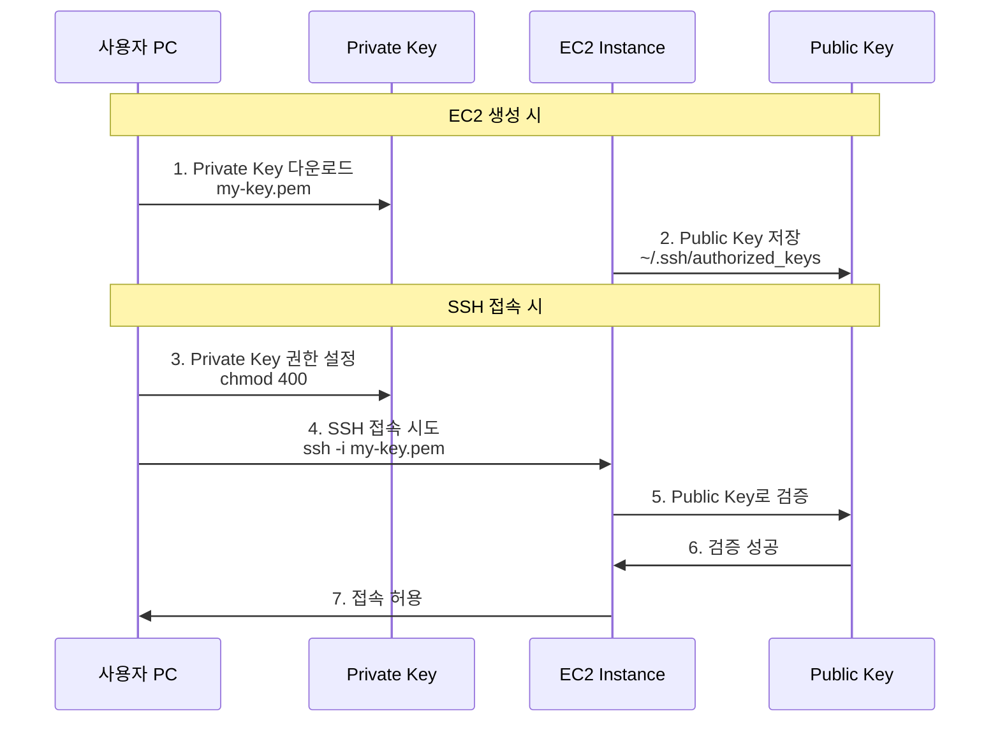
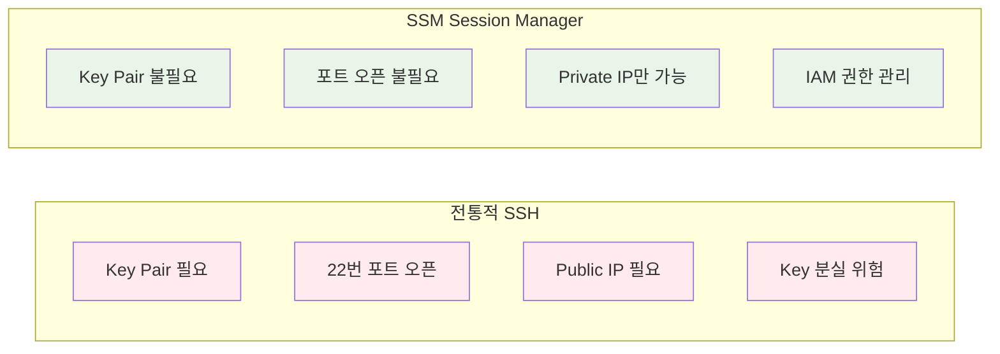

# Week 5 Day 1 Session 4: EC2 인스턴스 생성 & 접속 (12:00-12:50)

<div align="center">

**💻 EC2 생성** • **🔑 Key Pair** • **🔐 SSM 접속** • **🚀 User Data**

*EC2 인스턴스 생성부터 접속까지 완벽 가이드*

</div>

---

## 🕘 세션 정보
- **시간**: 12:00-12:50 (50분)
- **목표**: EC2 인스턴스 생성 시 필수 설정과 접속 방법 완전 이해
- **방식**: 강사 시연 + 학생 Lab 준비

## 🎯 학습 목표

### 📚 학습 목표
- **이해 목표**: EC2 생성 시 각 설정 항목의 의미와 중요성 이해
- **적용 목표**: Key Pair와 SSM 두 가지 접속 방법 습득
- **협업 목표**: 접속 문제 발생 시 해결 방법 공유

### 🛠️ 구현 목표
- EC2 인스턴스 생성 (필수 설정 완벽 이해)
- Key Pair 생성 및 SSH 접속
- SSM Session Manager 접속
- User Data로 자동화된 초기 설정

---

## 🤔 왜 필요한가? (5분)

### 현실 문제 상황

**💼 실무 시나리오**: 
"EC2를 만들었는데 접속이 안 돼요. Key Pair를 잃어버렸어요. 어떻게 하죠?"

**🏠 일상 비유**: 
"새 컴퓨터 구매하기"
- **AMI 선택**: 운영체제 선택 (Windows vs Mac vs Linux)
- **Instance Type**: 사양 선택 (CPU, 메모리)
- **Key Pair**: 비밀번호 설정
- **Security Group**: 방화벽 설정
- **User Data**: 초기 프로그램 자동 설치

**☁️ AWS 아키텍처**: 
EC2 생성은 단순해 보이지만, 각 설정이 보안과 운영에 직접적 영향을 미칩니다.

**📊 시장 동향**: 
- EC2 접속 문제가 초보자 장애의 60%
- Key Pair 분실로 인한 인스턴스 재생성 사례 빈번
- SSM Session Manager 도입으로 보안 강화 추세

---

## 📖 핵심 개념 (35분)

### 🔍 개념 1: EC2 생성 필수 설정 (12분)

> **정의**: EC2 인스턴스 생성 시 반드시 설정해야 하는 7가지 항목

#### 📋 EC2 생성 7단계

```mermaid
stateDiagram-v2
    [*] --> AMI선택
    
    state AMI선택 {
        [*] --> OS선택
        OS선택 --> 버전확인
    }
    
    AMI선택 --> InstanceType
    
    state InstanceType {
        [*] --> CPU메모리
        CPU메모리 --> 프리티어확인
    }
    
    InstanceType --> KeyPair
    
    state KeyPair {
        [*] --> 신규생성
        신규생성 --> 기존사용
        기존사용 --> 없음선택
    }
    
    KeyPair --> Network
    
    state Network {
        [*] --> VPC선택
        VPC선택 --> Subnet선택
        Subnet선택 --> PublicIP설정
    }
    
    Network --> SecurityGroup
    
    state SecurityGroup {
        [*] --> 기존SG
        기존SG --> 신규SG
    }
    
    SecurityGroup --> Storage
    
    state Storage {
        [*] --> 볼륨크기
        볼륨크기 --> 볼륨타입
        볼륨타입 --> 삭제정책
    }
    
    Storage --> UserData
    
    state UserData {
        [*] --> 스크립트입력
        스크립트입력 --> 선택사항
    }
    
    UserData --> [*]
```



#### 🎯 각 단계별 상세 설명

**1. AMI (Amazon Machine Image) 선택**

| 항목 | 설명 | 추천 |
|------|------|------|
| **Amazon Linux 2023** | AWS 최적화, 무료, 최신 보안 패치 | ⭐ 추천 |
| **Ubuntu Server** | 범용성, 커뮤니티 지원 | 개발자 친숙 |
| **Windows Server** | Windows 환경 필요 시 | 라이선스 비용 |
| **Red Hat Enterprise** | 엔터프라이즈 지원 | 유료 |

**⚠️ 주의사항**:
- 프리티어는 Amazon Linux 2023, Ubuntu만 해당
- AMI는 리전별로 다름
- 커스텀 AMI는 나중에 생성 가능

**2. Instance Type 선택**

| 타입 | vCPU | 메모리 | 네트워크 | 프리티어 | 용도 |
|------|------|--------|---------|---------|------|
| **t2.micro** | 1 | 1 GiB | 낮음-중간 | ✅ 750h/월 | 테스트 |
| **t3.micro** | 2 | 1 GiB | 최대 5 Gbps | ✅ 750h/월 | 웹 서버 |
| **t3.small** | 2 | 2 GiB | 최대 5 Gbps | ✅ 750h/월 | 소규모 앱 |
| **t3.medium** | 2 | 4 GiB | 최대 5 Gbps | ❌ 유료 | 중규모 앱 |

**💡 선택 기준**:
- 학습/테스트: t3.micro (프리티어)
- 소규모 웹: t3.small
- 메모리 많이 필요: t3.medium 이상

**3. Key Pair 설정**

| 옵션 | 설명 | 사용 시기 |
|------|------|----------|
| **새 Key Pair 생성** | .pem 파일 다운로드 | 첫 EC2 생성 |
| **기존 Key Pair 사용** | 이미 있는 키 재사용 | 여러 EC2 관리 |
| **Key Pair 없이 진행** | SSM만 사용 | 보안 강화 환경 |

**⚠️ 중요**:
- Private Key (.pem) 분실 시 접속 불가능
- 한 번만 다운로드 가능
- 안전한 곳에 보관 필수

**4. Network 설정**

| 항목 | 설정 | 설명 |
|------|------|------|
| **VPC** | week5-day1-vpc | Session 2에서 생성한 VPC |
| **Subnet** | Public-A 또는 Public-B | 외부 접속 가능 |
| **Auto-assign Public IP** | Enable | 공인 IP 자동 할당 |

**5. Security Group**

| 규칙 | 프로토콜 | 포트 | 소스 | 용도 |
|------|----------|------|------|------|
| SSH | TCP | 22 | 내 IP | 관리자 접속 |
| HTTP | TCP | 80 | 0.0.0.0/0 | 웹 접속 |
| HTTPS | TCP | 443 | 0.0.0.0/0 | 보안 웹 |

**6. Storage (EBS 볼륨)**

| 항목 | 기본값 | 추천 | 설명 |
|------|--------|------|------|
| **크기** | 8 GiB | 8-30 GiB | 프리티어 30GB까지 |
| **타입** | gp3 | gp3 | 범용 SSD |
| **종료 시 삭제** | Yes | Yes | 인스턴스 삭제 시 볼륨도 삭제 |

**7. User Data (선택사항)**

```bash
#!/bin/bash
yum update -y
yum install -y nginx
systemctl start nginx
systemctl enable nginx
```

---

### 🔍 개념 2: Key Pair SSH 접속 (12분)

> **정의**: Private Key를 사용한 전통적인 SSH 접속 방법

#### 🔑 Key Pair 동작 원리



#### 💻 SSH 접속 실습

**Windows (PowerShell)**:
```powershell
# 1. Key Pair 권한 설정 (Windows는 파일 속성에서)
# 파일 우클릭 → 속성 → 보안 → 고급 → 상속 사용 안 함

# 2. SSH 접속
ssh -i "C:\Users\YourName\Downloads\my-key.pem" ec2-user@3.35.123.45
```

**macOS / Linux**:
```bash
# 1. Key Pair 권한 설정
chmod 400 ~/Downloads/my-key.pem

# 2. SSH 접속
ssh -i ~/Downloads/my-key.pem ec2-user@3.35.123.45
```

**접속 성공 시**:
```
   ,     #_
   ~\_  ####_        Amazon Linux 2023
  ~~  \_#####\
  ~~     \###|
  ~~       \#/ ___   https://aws.amazon.com/linux/amazon-linux-2023
   ~~       V~' '->
    ~~~         /
      ~~._.   _/
         _/ _/
       _/m/'

[ec2-user@ip-10-0-1-10 ~]$
```

#### ⚠️ SSH 접속 문제 해결

| 문제 | 원인 | 해결 방법 |
|------|------|----------|
| **Permission denied** | Key 권한 문제 | `chmod 400 my-key.pem` |
| **Connection timeout** | Security Group | 22번 포트 확인 |
| **Host key verification failed** | known_hosts 충돌 | `ssh-keygen -R [IP]` |
| **No such file** | Key 경로 오류 | 절대 경로 사용 |

---

### 🔍 개념 3: SSM Session Manager 접속 (11분)

> **정의**: Key Pair 없이 브라우저나 CLI로 안전하게 접속하는 방법

#### 🔐 SSM Session Manager 장점



#### 🚀 SSM 접속 방법

**방법 1: AWS Console (가장 쉬움)**

```
1. EC2 Console → Instances
2. 인스턴스 선택
3. Connect 버튼 클릭
4. Session Manager 탭 선택
5. Connect 버튼 클릭
→ 브라우저에서 바로 터미널 오픈
```

**방법 2: AWS CLI**

```bash
# 1. Session Manager Plugin 설치 (최초 1회)
# macOS
brew install --cask session-manager-plugin

# Windows
# https://docs.aws.amazon.com/systems-manager/latest/userguide/session-manager-working-with-install-plugin.html

# 2. SSM 접속
aws ssm start-session --target i-1234567890abcdef0 --region ap-northeast-2
```

#### ⚙️ SSM 사용을 위한 IAM Role 설정

```
1. IAM Console → Roles → Create role
2. AWS service → EC2 선택
3. AmazonSSMManagedInstanceCore 정책 연결
4. Role 이름: EC2-SSM-Role
5. EC2 인스턴스에 Role 연결
```

#### 📊 SSH vs SSM 비교

| 항목 | SSH (Key Pair) | SSM Session Manager |
|------|----------------|---------------------|
| **Key Pair** | 필수 | 불필요 |
| **Security Group** | 22번 포트 오픈 | 포트 오픈 불필요 |
| **Public IP** | 필요 | 불필요 (Private도 가능) |
| **보안** | Key 관리 필요 | IAM 권한 관리 |
| **감사 로그** | 별도 설정 | CloudTrail 자동 기록 |
| **사용 편의성** | CLI 숙련 필요 | 브라우저에서 클릭 |
| **비용** | 무료 | 무료 |

**💡 실무 권장**:
- **개발/테스트**: SSH (빠르고 간편)
- **프로덕션**: SSM (보안 강화, 감사 로그)
- **둘 다 설정**: SSH 백업용, SSM 주 사용

---

## 💭 함께 생각해보기 (10분)

### 🤝 페어 토론 (5분)

**토론 주제**:
1. **Key Pair 관리**: "Key Pair를 안전하게 관리하는 방법은?"
2. **접속 방법 선택**: "SSH와 SSM 중 어떤 상황에 무엇을 사용할까?"
3. **보안 강화**: "EC2 접속 보안을 더 강화하려면?"

**페어 활동 가이드**:
- 👥 **자유 페어링**: 관심사가 비슷한 사람끼리
- 🔄 **역할 교대**: 각자 질문 1개씩 답변
- 📝 **베스트 프랙티스**: 실무 팁 공유

### 🎯 전체 공유 (5분)

**공유 내용**:
- Key Pair 관리 방법
- 접속 방법 선택 기준
- 보안 강화 아이디어

### 💡 이해도 체크 질문

- ✅ "EC2 생성 시 반드시 설정해야 하는 항목은?"
- ✅ "Key Pair를 분실하면 어떻게 되나요?"
- ✅ "SSM Session Manager의 가장 큰 장점은?"
- ✅ "프리티어로 사용 가능한 Instance Type은?"

---

## 🔑 핵심 키워드

### 📚 오늘의 핵심 용어

#### 🔤 기본 용어
- **AMI**: Amazon Machine Image (서버 이미지)
- **Instance Type**: CPU, 메모리 사양
- **Key Pair**: SSH 접속용 공개키/개인키 쌍
- **User Data**: 초기화 스크립트

#### 🔤 기술 용어
- **SSH**: Secure Shell (원격 접속 프로토콜)
- **SSM**: Systems Manager (AWS 관리 서비스)
- **IAM Role**: EC2에 부여하는 권한
- **EBS**: Elastic Block Store (블록 스토리지)

#### 🔤 실무 용어
- **chmod 400**: Private Key 권한 설정
- **ec2-user**: Amazon Linux 기본 사용자
- **Session Manager**: 브라우저 기반 터미널
- **CloudTrail**: AWS 감사 로그 서비스

---

## 📝 세션 마무리

### ✅ 오늘 세션 성과

**학습한 내용**:
- ✅ EC2 생성 7단계 완전 이해
- ✅ Key Pair 생성 및 SSH 접속 방법
- ✅ SSM Session Manager 접속 방법
- ✅ IAM Role 설정 및 권한 관리
- ✅ SSH vs SSM 비교 및 선택 기준

**실무 적용**:
- 안전한 Key Pair 관리
- 상황별 접속 방법 선택
- 보안 강화된 EC2 운영
- 감사 로그 자동 기록

### 🎯 오후 Lab 준비

**Lab 1: VPC & EC2 웹 서버 배포 (14:00-14:50)**
- VPC, Subnet, IGW, Route Table 생성
- Security Group 설정
- EC2 인스턴스 생성 (오늘 배운 7단계 적용)
- SSH 또는 SSM으로 접속
- Nginx 설치 및 웹 서버 확인
- **제출**: Public IP 주소를 강사에게 제출
- **검증**: 강사가 학생의 웹 서버에 접속하여 확인

**사전 준비**:
- AWS Console 로그인 확인
- 본인 IP 주소 확인 (https://whatismyipaddress.com)
- SSH 클라이언트 준비 (Windows: PowerShell, macOS: Terminal)

---

## 🔗 공식 문서 (필수)

**⚠️ 학생들이 직접 확인해야 할 공식 문서**:
- 📘 [EC2 시작하기](https://docs.aws.amazon.com/AWSEC2/latest/UserGuide/EC2_GetStarted.html)
- 📗 [Key Pair 관리](https://docs.aws.amazon.com/AWSEC2/latest/UserGuide/ec2-key-pairs.html)
- 📙 [SSM Session Manager](https://docs.aws.amazon.com/systems-manager/latest/userguide/session-manager.html)
- 📕 [EC2 Instance Types](https://aws.amazon.com/ec2/instance-types/)
- 🆕 [User Data 스크립트](https://docs.aws.amazon.com/AWSEC2/latest/UserGuide/user-data.html)

---

<div align="center">

**💻 EC2 생성** • **🔑 안전한 접속** • **🔐 보안 강화** • **🚀 자동화**

*EC2 생성부터 접속까지 완벽 마스터*

</div>


<div align="center">

**🌐 VPC 구성** • **💻 EC2 배포** • **🚀 Nginx 서버** • **✅ 접속 확인**

*Session 1-3에서 배운 모든 개념을 실제로 구현하기*

</div>