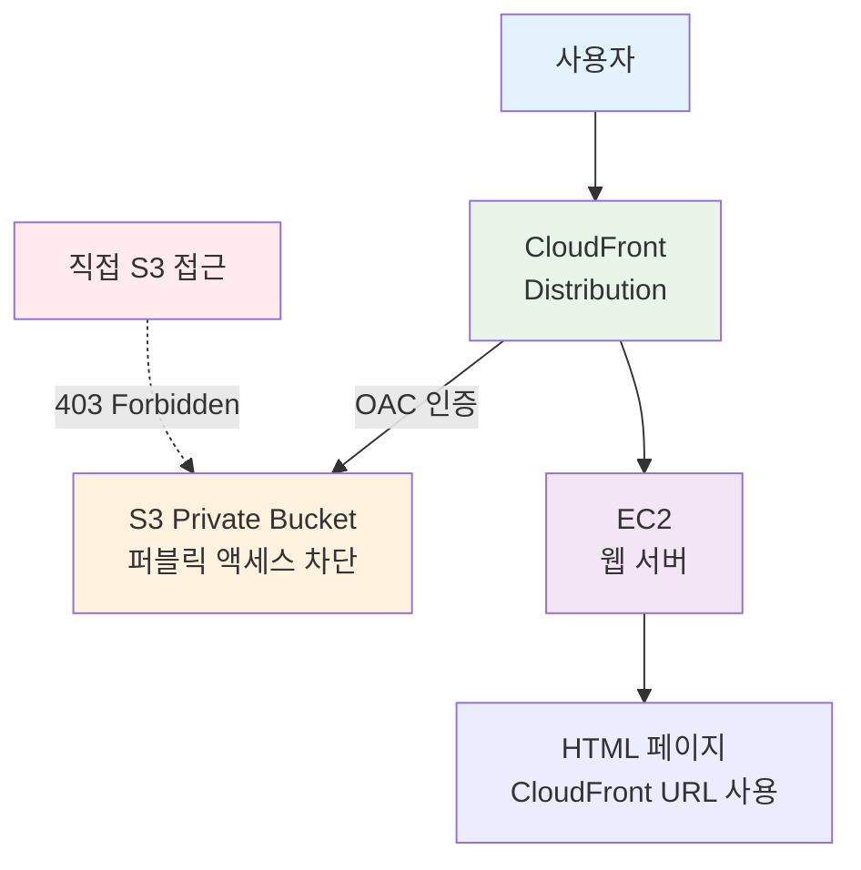

# Week 5 Day 2 Challenge 1: CloudFront OAC 보안 아키텍처

<div align="center">

**🔒 S3 Private** • **🌐 CloudFront OAC** • **⚡ 보안 + 성능** • **🎯 실무 패턴**

*CloudFront Origin Access Control로 S3 보안 강화*

</div>

---

## 🕘 Challenge 정보
**시간**: 15:15-16:05 (50분)
**목표**: CloudFront OAC를 활용한 보안 강화 아키텍처 구축
**방식**: AWS Web Console 실습
**난이도**: ⭐⭐⭐ (중상)

## 🎯 Challenge 목표

### 📚 학습 목표
- **보안 강화**: S3 퍼블릭 액세스 완전 차단
- **OAC 이해**: Origin Access Control 설정 및 동작 원리
- **실무 패턴**: CloudFront를 통한 안전한 콘텐츠 배포
- **통합 아키텍처**: EC2 + S3 + CloudFront 통합

### 🎯 핵심 목표
**CloudFront만 S3에 접근 가능하도록 설정**
- S3 직접 접근: ❌ 403 Forbidden
- CloudFront 접근: ✅ 정상 작동

---

## 📖 시나리오

### 배경
당신은 "Tech Blog" 사이트의 인프라 담당자입니다. 
보안팀에서 S3 버킷의 퍼블릭 액세스를 완전히 차단하라는 요청을 받았습니다.
하지만 사용자는 여전히 빠르게 이미지를 볼 수 있어야 합니다.

**해결책**: CloudFront OAC (Origin Access Control)

### 요구사항

#### 🔧 아키텍처 구성


**사용된 AWS 서비스**:
-  **Amazon EC2**: 웹 서버
-  **Amazon S3**: Private 이미지 저장소
-  **Amazon CloudFront**: CDN + OAC

#### 📋 기능 요구사항
1. **S3 보안**:
   - 퍼블릭 액세스 완전 차단
   - CloudFront만 접근 가능 (OAC)
   
2. **CloudFront 설정**:
   - S3를 Origin으로 설정
   - OAC 생성 및 연결
   - 이미지 캐싱 최적화

3. **웹 페이지**:
   - EC2에서 HTML 제공
   - 이미지는 CloudFront URL 사용
   - 개발자 도구에서 CloudFront 확인 가능

#### ✅ 검증 기준
- [ ] S3 직접 접근 시 403 Forbidden
- [ ] CloudFront URL로 이미지 정상 표시
- [ ] 웹 페이지에서 CloudFront 이미지 로드
- [ ] Network 탭에서 CloudFront 도메인 확인

---

## 🔗 참조 Session
**당일 Session**:
- [Session 3: S3 & CloudFront](../session_3.md) - CloudFront 배포 및 OAC
- [Session 4: E-Commerce 아키텍처](../session_4.md) - 통합 아키텍처

---

## 🛠️ Challenge 진행 방식

### Phase 1: EC2 웹 서버 구축 (10분)

#### 목표
- Lab 1 기반 빠른 EC2 구성
- 간단한 웹 페이지 준비

#### 1-1. VPC 및 EC2 생성

**⚠️ Lab 1 VPC 재사용 가능**:
- Lab 1에서 생성한 `week5-day2-vpc` 사용 가능
- 또는 새로운 VPC 생성 (독립 환경 선호 시)

**EC2 설정**:
| 항목 | 값 | 설명 |
|------|-----|------|
| Name | week5-day2-challenge-web | 인스턴스 이름 |
| AMI | Amazon Linux 2023 | 최신 Amazon Linux |
| Instance type | t3.micro | 프리티어 |
| VPC | week5-day2-vpc | Lab 1 VPC 재사용 |
| Subnet | week5-day2-public-a | Public Subnet |
| Auto-assign public IP | Enable | 공인 IP |
| Security Group | HTTP (80), SSH (22) | 웹 접속 |

**User Data**:
```bash
#!/bin/bash
yum update -y
yum install -y nginx
systemctl start nginx
systemctl enable nginx

# 웹 루트 디렉토리 생성
mkdir -p /usr/share/nginx/html
chown -R nginx:nginx /usr/share/nginx/html
```

#### 1-2. 기본 HTML 페이지 생성

**SSH 접속 후 실행**:
```bash
# HTML 파일 생성 (임시 - Phase 4에서 수정)
sudo tee /usr/share/nginx/html/index.html > /dev/null <<'EOF'
<!DOCTYPE html>
<html lang="ko">
<head>
    <meta charset="UTF-8">
    <meta name="viewport" content="width=device-width, initial-scale=1.0">
    <title>Tech Blog - CloudFront OAC Challenge</title>
    <style>
        body {
            font-family: Arial, sans-serif;
            max-width: 1200px;
            margin: 50px auto;
            padding: 20px;
            background-color: #f5f5f5;
        }
        .container {
            background-color: white;
            padding: 30px;
            border-radius: 10px;
            box-shadow: 0 2px 10px rgba(0,0,0,0.1);
        }
        h1 {
            color: #333;
            text-align: center;
            border-bottom: 3px solid #4CAF50;
            padding-bottom: 10px;
        }
        .info-box {
            background-color: #e8f5e9;
            padding: 20px;
            border-radius: 5px;
            margin: 20px 0;
        }
        .image-gallery {
            display: grid;
            grid-template-columns: repeat(auto-fit, minmax(300px, 1fr));
            gap: 20px;
            margin-top: 30px;
        }
        .image-card {
            background-color: #fff;
            border: 1px solid #ddd;
            border-radius: 8px;
            overflow: hidden;
            box-shadow: 0 2px 5px rgba(0,0,0,0.1);
        }
        .image-card img {
            width: 100%;
            height: 250px;
            object-fit: cover;
        }
        .image-card .caption {
            padding: 15px;
            text-align: center;
            background-color: #f9f9f9;
        }
        .status {
            display: inline-block;
            padding: 5px 10px;
            border-radius: 3px;
            font-size: 14px;
            font-weight: bold;
        }
        .status.success {
            background-color: #4CAF50;
            color: white;
        }
        .status.error {
            background-color: #f44336;
            color: white;
        }
    </style>
</head>
<body>
    <div class="container">
        <h1>🚀 Tech Blog - CloudFront OAC Challenge</h1>
        
        <div class="info-box">
            <h3>📊 아키텍처 정보</h3>
            <ul>
                <li><strong>웹 서버:</strong> EC2 (t3.micro) + Nginx</li>
                <li><strong>이미지 저장:</strong> S3 Private Bucket (퍼블릭 액세스 차단)</li>
                <li><strong>CDN:</strong> CloudFront + OAC (Origin Access Control)</li>
                <li><strong>보안:</strong> CloudFront만 S3 접근 가능</li>
            </ul>
        </div>

        <div class="info-box" style="background-color: #fff3e0;">
            <h3>🔒 보안 검증</h3>
            <p><span class="status error">❌ S3 직접 접근</span> → 403 Forbidden</p>
            <p><span class="status success">✅ CloudFront 접근</span> → 정상 작동</p>
        </div>

        <h2 style="text-align: center; margin-top: 40px;">📸 이미지 갤러리</h2>
        <p style="text-align: center; color: #666;">
            모든 이미지는 CloudFront를 통해 안전하게 제공됩니다
        </p>

        <div class="image-gallery">
            <!-- Phase 4에서 CloudFront URL로 업데이트 -->
            <div class="image-card">
                
                <div class="caption">
                    <strong>Tech Image 1</strong><br>
                    <small>CloudFront URL로 제공</small>
                </div>
            </div>
            <div class="image-card">
                
                <div class="caption">
                    <strong>Tech Image 2</strong><br>
                    <small>CloudFront URL로 제공</small>
                </div>
            </div>
            <div class="image-card">
                
                <div class="caption">
                    <strong>Tech Image 3</strong><br>
                    <small>CloudFront URL로 제공</small>
                </div>
            </div>
        </div>

        <div class="info-box" style="background-color: #e3f2fd; margin-top: 40px;">
            <h3>🎯 Challenge 완료 조건</h3>
            <ol>
                <li>S3 버킷에 이미지 업로드 (퍼블릭 액세스 차단)</li>
                <li>CloudFront Distribution 생성 + OAC 설정</li>
                <li>이 페이지의 이미지를 CloudFront URL로 변경</li>
                <li>개발자 도구에서 CloudFront 도메인 확인</li>
            </ol>
        </div>
    </div>
</body>
</html>
EOF

# Nginx 재시작
sudo systemctl restart nginx
```

#### 1-3. 웹 페이지 확인

**브라우저에서 접속**:
```
http://[EC2-Public-IP]
```

**예상 결과**:
- Tech Blog 페이지 표시
- 임시 placeholder 이미지 3개 표시

### ✅ Phase 1 체크포인트
- [ ] EC2 인스턴스 Running 상태
- [ ] 브라우저에서 웹 페이지 확인
- [ ] HTML 페이지 정상 표시

---

### Phase 2: S3 Private Bucket + 이미지 업로드 (10분)

#### 목표
- S3 Private Bucket 생성 (퍼블릭 액세스 완전 차단)
- 이미지 업로드
- 직접 접근 차단 확인

#### 2-1. S3 Private Bucket 생성

**AWS Console 경로**:
```
S3 → Buckets → Create bucket
```

**설정 값**:
| 항목 | 값 | 설명 |
|------|-----|------|
| Bucket name | week5-day2-challenge-[학번] | 고유한 이름 |
| Region | ap-northeast-2 | 서울 리전 |
| **Block Public Access** | **모두 체크 (차단)** | ⭐ 핵심 설정 |
| Versioning | Disable | 버전 관리 비활성화 |
| Encryption | Enable (SSE-S3) | 기본 암호화 |

**⚠️ 중요**: Block all public access 모두 체크!
```
✅ Block all public access
  ✅ Block public access to buckets and objects granted through new access control lists (ACLs)
  ✅ Block public access to buckets and objects granted through any access control lists (ACLs)
  ✅ Block public access to buckets and objects granted through new public bucket or access point policies
  ✅ Block public and cross-account access to buckets and objects through any public bucket or access point policies
```

#### 2-2. 이미지 업로드

**준비할 이미지**:
- 3-5개의 이미지 파일
- 파일명: `tech1.jpg`, `tech2.jpg`, `tech3.jpg` 등
- 또는 본인이 준비한 이미지

**AWS Console 경로**:
```
S3 → week5-day2-challenge-[학번] → Upload
```

**업로드 설정**:
- Files: 이미지 파일 선택
- Permissions: 기본값 유지 (Private)
- Upload 클릭

#### 2-3. 직접 접근 차단 확인

**S3 Object URL 확인**:
```
S3 → 버킷 → 이미지 선택 → Object URL 복사
예: https://week5-day2-challenge-12345.s3.ap-northeast-2.amazonaws.com/tech1.jpg
```

**브라우저에서 접속 테스트**:
```
https://week5-day2-challenge-12345.s3.ap-northeast-2.amazonaws.com/tech1.jpg
```

**예상 결과**:
```xml
<Error>
  <Code>AccessDenied</Code>
  <Message>Access Denied</Message>
</Error>
```

**✅ 성공**: 403 Access Denied 확인!

### ✅ Phase 2 체크포인트
- [ ] S3 Private Bucket 생성 완료
- [ ] 퍼블릭 액세스 완전 차단 확인
- [ ] 이미지 3-5개 업로드 완료
- [ ] S3 직접 접근 시 403 에러 확인

---

### Phase 3: CloudFront + OAC 설정 (20분) ⭐ 핵심

#### 목표
- CloudFront Distribution 생성
- OAC (Origin Access Control) 설정
- S3 Bucket Policy 자동 업데이트

#### 3-1. CloudFront Distribution 생성

**AWS Console 경로**:
```
CloudFront → Distributions → Create distribution
```

**Origin 설정**:
| 항목 | 값 | 설명 |
|------|-----|------|
| Origin domain | week5-day2-challenge-[학번].s3.ap-northeast-2.amazonaws.com | S3 버킷 선택 |
| Origin path | (비워둠) | 루트 경로 |
| Name | S3-week5-day2-challenge | Origin 이름 |
| **Origin access** | **Origin access control settings (recommended)** | ⭐ OAC 선택 |

**⚠️ 중요**: "Origin access control settings (recommended)" 선택!

#### 3-2. OAC 생성

**Origin access control 섹션**:
```
Create new OAC 클릭
```

**OAC 설정**:
| 항목 | 값 | 설명 |
|------|-----|------|
| Name | week5-day2-challenge-oac | OAC 이름 |
| Description | OAC for Tech Blog images | 설명 |
| Signing behavior | Sign requests (recommended) | ⭐ 권장 설정 |

**Create 클릭**

#### 3-3. CloudFront Distribution 설정 계속

**Default cache behavior**:
| 항목 | 값 | 설명 |
|------|-----|------|
| Viewer protocol policy | Redirect HTTP to HTTPS | HTTPS 강제 |
| Allowed HTTP methods | GET, HEAD | 읽기 전용 |
| Cache policy | CachingOptimized | 최적화된 캐싱 |

**Settings**:
| 항목 | 값 | 설명 |
|------|-----|------|
| Price class | Use all edge locations | 전 세계 배포 |
| Alternate domain name (CNAME) | (비워둠) | 커스텀 도메인 없음 |
| Default root object | (비워둠) | 이미지만 제공 |

**Create distribution 클릭**

**⏳ 배포 대기**: 5-10분 소요 (Status: Deploying → Enabled)

#### 3-4. S3 Bucket Policy 업데이트

**CloudFront 배포 완료 후 안내 메시지**:
```
⚠️ The S3 bucket policy needs to be updated
Copy policy 클릭
```

**복사된 Policy 예시**:
```json
{
  "Version": "2012-10-17",
  "Statement": {
    "Sid": "AllowCloudFrontServicePrincipalReadOnly",
    "Effect": "Allow",
    "Principal": {
      "Service": "cloudfront.amazonaws.com"
    },
    "Action": "s3:GetObject",
    "Resource": "arn:aws:s3:::week5-day2-challenge-12345/*",
    "Condition": {
      "StringEquals": {
        "AWS:SourceArn": "arn:aws:cloudfront::123456789012:distribution/E1234567890ABC"
      }
    }
  }
}
```

**S3 Bucket Policy 적용**:
```
S3 → week5-day2-challenge-[학번] → Permissions → Bucket policy → Edit
```

**복사한 Policy 붙여넣기 → Save changes**

#### 3-5. CloudFront URL 테스트

**CloudFront Distribution URL 확인**:
```
CloudFront → Distributions → Distribution domain name 복사
예: d1234567890abc.cloudfront.net
```

**브라우저에서 이미지 접속**:
```
https://d1234567890abc.cloudfront.net/tech1.jpg
```

**예상 결과**:
- 이미지 정상 표시! ✅

**비교**:
- ❌ S3 직접: `https://bucket.s3.amazonaws.com/tech1.jpg` → 403 Forbidden
- ✅ CloudFront: `https://d123.cloudfront.net/tech1.jpg` → 정상 표시

### ✅ Phase 3 체크포인트
- [ ] CloudFront Distribution 생성 완료
- [ ] OAC 생성 및 연결 완료
- [ ] S3 Bucket Policy 업데이트 완료
- [ ] CloudFront URL로 이미지 접근 성공
- [ ] S3 직접 접근은 여전히 403 확인

---

### Phase 4: 웹 페이지 통합 및 검증 (10분)

#### 목표
- HTML에서 CloudFront URL 사용
- 개발자 도구로 CloudFront 확인
- 제출 준비

#### 4-1. HTML 페이지 업데이트

**SSH 접속 후 실행**:
```bash
# CloudFront Distribution URL 확인
# 예: d1234567890abc.cloudfront.net

# HTML 파일 수정
sudo nano /usr/share/nginx/html/index.html
```

**수정할 부분** (이미지 갤러리 섹션):
```html
<!-- 기존 placeholder 이미지를 CloudFront URL로 변경 -->
<div class="image-gallery">
    <div class="image-card">
        
        <div class="caption">
            <strong>Tech Image 1</strong><br>
            <small>via CloudFront OAC</small>
        </div>
    </div>
    <div class="image-card">
        
        <div class="caption">
            <strong>Tech Image 2</strong><br>
            <small>via CloudFront OAC</small>
        </div>
    </div>
    <div class="image-card">
        
        <div class="caption">
            <strong>Tech Image 3</strong><br>
            <small>via CloudFront OAC</small>
        </div>
    </div>
</div>
```

**⚠️ 주의**: `d1234567890abc.cloudfront.net`를 실제 CloudFront 도메인으로 변경!

#### 4-2. 웹 페이지 확인

**브라우저에서 접속**:
```
http://[EC2-Public-IP]
```

**예상 결과**:
- Tech Blog 페이지 표시
- CloudFront를 통한 이미지 3개 정상 표시

#### 4-3. 개발자 도구로 CloudFront 확인

**Chrome/Edge 개발자 도구**:
```
F12 → Network 탭 → 페이지 새로고침
```

**확인 사항**:
1. **Domain**: 이미지 요청이 CloudFront 도메인으로 가는지 확인
   ```
   d1234567890abc.cloudfront.net
   ```

2. **Response Headers**: CloudFront 헤더 확인
   ```
   X-Cache: Hit from cloudfront
   X-Amz-Cf-Id: ...
   X-Amz-Cf-Pop: ICN54-C1 (서울 엣지)
   ```

3. **Status**: 200 OK

**스크린샷 캡처**:
- 웹 페이지 전체
- Network 탭 (CloudFront 도메인 표시)

#### 4-4. 최종 보안 검증

**테스트 1: S3 직접 접근**
```
https://week5-day2-challenge-12345.s3.ap-northeast-2.amazonaws.com/tech1.jpg
```
**예상**: ❌ 403 Access Denied

**테스트 2: CloudFront 접근**
```
https://d1234567890abc.cloudfront.net/tech1.jpg
```
**예상**: ✅ 이미지 정상 표시

**테스트 3: 웹 페이지**
```
http://[EC2-Public-IP]
```
**예상**: ✅ CloudFront 이미지 정상 표시

### ✅ Phase 4 체크포인트
- [ ] HTML에서 CloudFront URL 사용
- [ ] 웹 페이지에서 이미지 정상 표시
- [ ] Network 탭에서 CloudFront 도메인 확인
- [ ] X-Cache 헤더 확인
- [ ] S3 직접 접근 여전히 403 확인

---

## 📤 Challenge 제출

### 제출 방법
**디스코드 스레드에 다음 내용 작성**:

```markdown
## Week 5 Day 2 Challenge 1 제출

**이름**: [학생 이름]

### 1. CloudFront Distribution URL
```
https://d1234567890abc.cloudfront.net
```

### 2. 웹 페이지 URL
```
http://[EC2-Public-IP]
```

### 3. 보안 검증 결과
- ✅ S3 직접 접근: 403 Forbidden
- ✅ CloudFront 접근: 정상 작동
- ✅ 웹 페이지 이미지: CloudFront에서 로드

### 4. 스크린샷
**웹 페이지**:
[웹 페이지 스크린샷 첨부]

**Network 탭 (CloudFront 확인)**:
[개발자 도구 Network 탭 스크린샷 첨부]

**S3 직접 접근 차단**:
[S3 URL 접근 시 403 에러 스크린샷 첨부]

### 5. 아키텍처 정보
- **S3 Bucket**: week5-day2-challenge-[학번]
- **CloudFront Distribution**: E1234567890ABC
- **OAC**: week5-day2-challenge-oac
- **EC2**: week5-day2-challenge-web
```

### 제출 체크리스트
- [ ] CloudFront URL 제공
- [ ] 웹 페이지 URL 제공
- [ ] 웹 페이지 스크린샷
- [ ] Network 탭 스크린샷 (CloudFront 도메인 표시)
- [ ] S3 직접 접근 403 에러 스크린샷

---

## 🎯 평가 기준

### 기능 구현 (60점)
- [ ] S3 Private Bucket 생성 (10점)
- [ ] CloudFront Distribution 생성 (15점)
- [ ] OAC 설정 및 연결 (20점)
- [ ] 웹 페이지 통합 (15점)

### 보안 검증 (30점)
- [ ] S3 직접 접근 차단 확인 (15점)
- [ ] CloudFront 접근 성공 확인 (15점)

### 문서화 (10점)
- [ ] 제출 내용 완전성 (5점)
- [ ] 스크린샷 품질 (5점)

---

## 💡 Challenge 팁

### 시간 관리
- **Phase 1**: 10분 (EC2 빠르게 구성)
- **Phase 2**: 10분 (S3 + 이미지 업로드)
- **Phase 3**: 20분 (CloudFront + OAC - 핵심!)
- **Phase 4**: 10분 (통합 및 검증)

### 자주 하는 실수
- ❌ S3 퍼블릭 액세스 차단 안 함
- ❌ OAC 대신 OAI 선택
- ❌ Bucket Policy 업데이트 누락
- ❌ CloudFront 배포 완료 전 테스트

### 디버깅 가이드

**문제 1: CloudFront에서도 403 에러**
- Bucket Policy 확인
- OAC 연결 확인
- Distribution ARN 일치 확인

**문제 2: 이미지가 표시되지 않음**
- CloudFront URL 정확한지 확인
- 이미지 파일명 대소문자 확인
- 브라우저 캐시 삭제 후 재시도

**문제 3: X-Cache 헤더가 Miss**
- 정상 (첫 요청은 Miss)
- 새로고침 시 Hit로 변경됨

---

## 🔍 트러블슈팅

### CloudFront 배포 시간이 오래 걸림
**증상**: Status가 "Deploying"에서 멈춤

**해결**:
- 정상 (5-10분 소요)
- 커피 한 잔 ☕
- Phase 2 다시 확인

### S3 Bucket Policy 오류
**증상**: "Policy has invalid resource"

**원인**: ARN이 잘못됨

**해결**:
```json
"Resource": "arn:aws:s3:::버킷명/*"  // /* 확인!
```

### CloudFront에서 403 에러
**증상**: CloudFront URL도 403

**진단**:
```bash
# 1. Bucket Policy 확인
S3 → Permissions → Bucket policy

# 2. Distribution ARN 확인
CloudFront → Distribution → General → ARN

# 3. OAC 연결 확인
CloudFront → Distribution → Origins → Origin access
```

---

## 🧹 리소스 정리

### 삭제 순서
```
CloudFront → S3 → EC2 → (VPC - 선택)
```

### 1. CloudFront Distribution 삭제

**AWS Console 경로**:
```
CloudFront → Distributions → 선택 → Disable → Delete
```

**⚠️ 주의**: Disable 후 15분 대기 → Delete 가능

### 2. S3 Bucket 삭제

**AWS Console 경로**:
```
S3 → week5-day2-challenge-[학번] → Empty → Delete
```

### 3. EC2 인스턴스 종료

**AWS Console 경로**:
```
EC2 → Instances → week5-day2-challenge-web → Terminate
```

### 4. VPC 삭제 (선택)

**Lab 1 VPC 재사용한 경우**: 삭제하지 않음
**새로 생성한 경우**: Lab 1 정리 절차 참조

---

## 💰 예상 비용

| 리소스 | 사용 시간 | 단가 | 예상 비용 |
|--------|----------|------|-----------|
| EC2 t3.micro | 50분 | $0.0116/hour | $0.01 |
| S3 Standard | 5개 이미지 | $0.025/GB | $0.00 |
| CloudFront | 10 요청 | $0.0075/10K | $0.00 |
| **합계** | | | **$0.01** |

---

## 💡 Challenge 회고

### 🤝 팀 회고 (5분)
1. **OAC 설정에서 어려웠던 점**:
2. **보안과 성능을 동시에 달성한 방법**:
3. **실무 프로젝트 적용 계획**:

### 📊 학습 성과
- **보안 강화**: S3 Private + CloudFront OAC 패턴
- **실무 아키텍처**: 정적 콘텐츠 안전한 배포
- **AWS 통합**: EC2 + S3 + CloudFront 통합

---

## 🔗 관련 자료

### 📚 Session 복습
- [Session 3: S3 & CloudFront](../session_3.md)
- [Session 4: E-Commerce 아키텍처](../session_4.md)

### 📖 AWS 공식 문서
- [CloudFront OAC 가이드](https://docs.aws.amazon.com/AmazonCloudFront/latest/DeveloperGuide/private-content-restricting-access-to-s3.html)
- [S3 Bucket Policy](https://docs.aws.amazon.com/AmazonS3/latest/userguide/bucket-policies.html)
- [CloudFront 보안](https://docs.aws.amazon.com/whitepapers/latest/secure-content-delivery-amazon-cloudfront/s3-origin-with-cloudfront.html)

---

<div align="center">

**🔒 보안 강화** • **⚡ 성능 최적화** • **🎯 실무 패턴** • **✅ Challenge 완료**

*CloudFront OAC로 S3를 안전하게 보호하면서 빠른 콘텐츠 배포 달성!*

</div>
