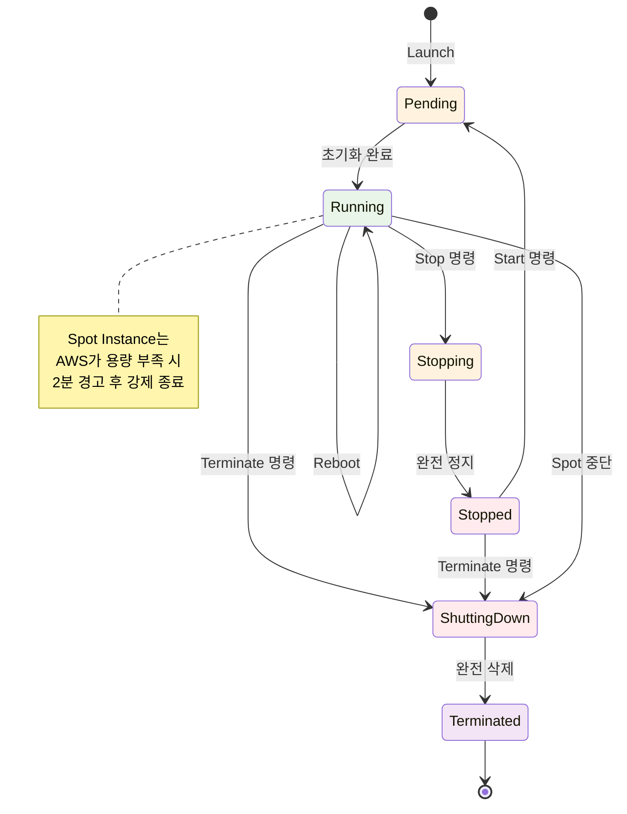
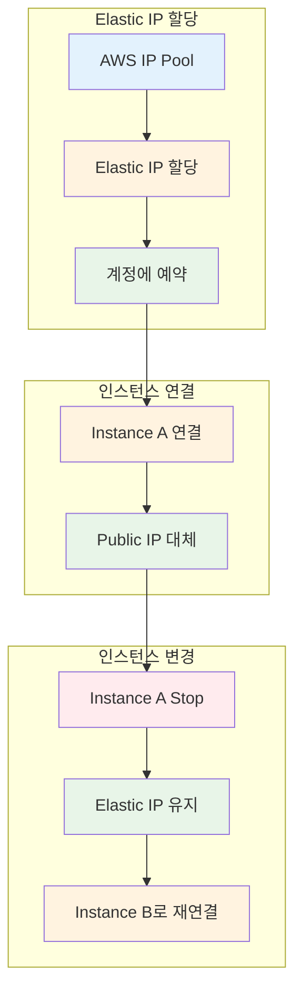
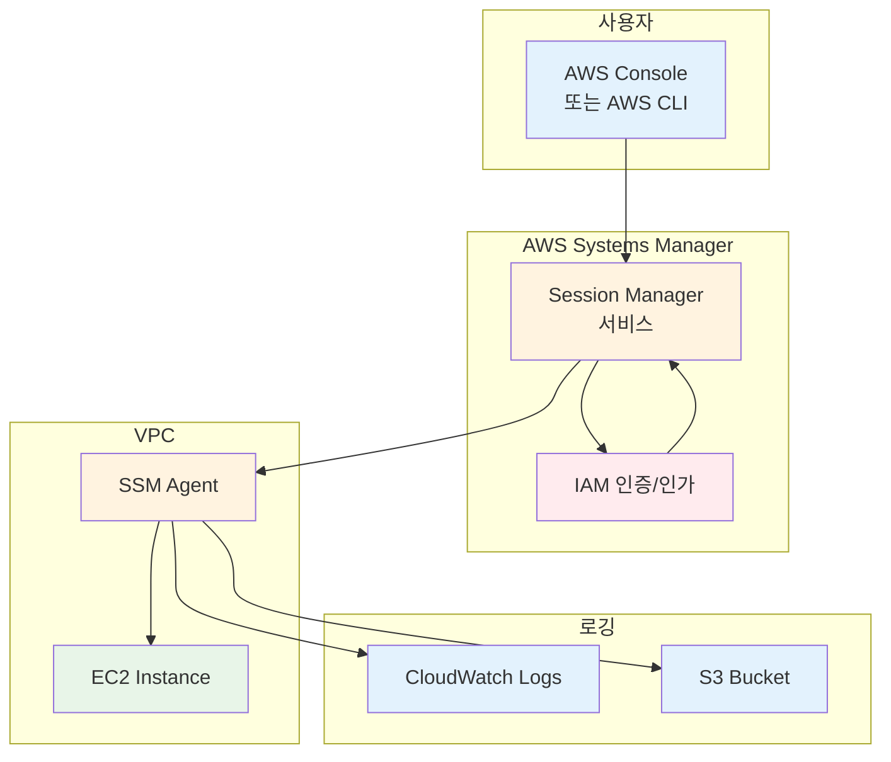

# Week 5 Day 2 Session 1: EC2 심화

<div align="center">

**🔄 인스턴스 생명주기** • **🌐 Elastic IP** • **🔐 Session Manager** • **📊 모니터링**

*EC2 인스턴스 고급 관리 및 운영*

</div>

---

## 🕘 세션 정보
**시간**: 09:00-09:50 (50분)
**목표**: EC2 인스턴스 생명주기 이해 및 고급 관리 기능 습득
**방식**: 이론 강의 + 실습 연계

## 🎯 세션 목표

### 📚 학습 목표
- **이해 목표**: EC2 인스턴스 생명주기 및 상태 전환 이해
- **적용 목표**: Elastic IP, Session Manager 등 고급 기능 활용
- **협업 목표**: 인스턴스 관리 베스트 프랙티스 공유

### 🔗 Day 1 연계
- **Day 1 Lab 1**: EC2 기본 배포 및 접속 (SSH)
- **Day 2 Session 1**: EC2 고급 관리 및 운영 기능
- **Day 2 Lab 1**: EBS 볼륨 추가 및 관리

---

## 🤔 왜 필요한가? (5분)

### 현실 문제 상황

**💼 실무 시나리오**:
- "EC2 인스턴스를 Stop했는데 Public IP가 바뀌었어요!"
- "SSH 키를 잃어버려서 인스턴스에 접속할 수 없어요!"
- "인스턴스가 갑자기 느려졌는데 원인을 모르겠어요!"
- "보안 그룹에서 SSH 포트를 열고 싶지 않은데 접속 방법이 있나요?"

**🏠 일상 비유**:
- **인스턴스 생명주기**: 자동차의 시동 켜기/끄기/주차/폐차
- **Elastic IP**: 이사를 가도 바뀌지 않는 전화번호
- **Session Manager**: 열쇠 없이 지문으로 집에 들어가기
- **CloudWatch**: 자동차 계기판 (속도, 연료, 엔진 상태)

**☁️ AWS 아키텍처**:
```
사용자
  ↓
[Elastic IP] ← 고정 IP 주소
  ↓
[EC2 Instance] ← 생명주기 관리
  ↓
[Session Manager] ← 안전한 접속
  ↓
[CloudWatch] ← 모니터링
```

**📊 시장 동향**:
- **Elastic IP 사용률**: 프로덕션 환경의 80% 이상 사용
- **Session Manager 도입**: 보안 강화로 SSH 키 관리 부담 50% 감소
- **CloudWatch 활용**: 장애 감지 시간 70% 단축

---

## 📖 핵심 개념 (35분)

### 🔍 개념 1: EC2 인스턴스 생명주기 (12분)

> **정의**: EC2 인스턴스가 생성부터 종료까지 거치는 상태 변화 과정

#### 인스턴스 상태 전환



#### 상태별 특징

| 상태 | 설명 | 과금 | Public IP | Private IP | 데이터 |
|------|------|------|-----------|------------|--------|
| **Pending** | 시작 준비 중 | ❌ 없음 | 할당 중 | 할당 중 | - |
| **Running** | 정상 실행 | ✅ 과금 | 유지 | 유지 | 유지 |
| **Stopping** | 정지 중 | ⚠️ 일부 | 해제됨 | 유지 | 유지 |
| **Stopped** | 완전 정지 | ❌ EBS만 | 해제됨 | 유지 | 유지 |
| **Shutting-down** | 종료 중 | ❌ 없음 | 해제됨 | 해제 중 | 삭제 중 |
| **Terminated** | 완전 삭제 | ❌ 없음 | 해제됨 | 해제됨 | 삭제됨 |

#### ⚠️ 비정상 종료 상황

**Spot Instance 중단**:
- **원인**: AWS가 용량 부족 시 Spot Instance 회수
- **경고**: 종료 2분 전 경고 (EC2 Instance Metadata)
- **상태 전환**: Running → Shutting-down → Terminated
- **데이터**: EBS 볼륨은 유지 가능 (설정에 따라)
- **대응**: 중요 데이터는 항상 EBS에 저장

**시스템 장애**:
- **원인**: 하드웨어 장애, 네트워크 문제
- **AWS 대응**: 자동으로 다른 호스트로 재시작 시도
- **상태**: Running → Stopping → Stopped → Pending → Running
- **데이터**: EBS 볼륨 데이터 유지, Instance Store 삭제

#### 주요 동작

**1. Stop (정지)**:

**AWS Console 경로**:
```
EC2 Console → Instances → 인스턴스 선택 → Instance state → Stop instance
```

**특징**:
- Public IP 해제 (Elastic IP는 유지)
- Private IP 유지
- EBS 볼륨 데이터 유지
- Instance Store 데이터 삭제
- 과금: EBS 스토리지만 과금

**⚠️ 주의사항**:
- Stop 후 Start 시 Public IP 변경됨
- Elastic IP 사용 권장 (프로덕션 환경)

---

**2. Start (시작)**:

**AWS Console 경로**:
```
EC2 Console → Instances → 인스턴스 선택 → Instance state → Start instance
```

**특징**:
- 새로운 Public IP 할당 (Elastic IP 제외)
- Private IP 유지
- EBS 볼륨 데이터 복원
- 동일한 물리 호스트 보장 안 됨

**⚠️ 주의사항**:
- Public IP가 변경되므로 DNS 업데이트 필요
- 애플리케이션 재시작 확인

---

**3. Reboot (재부팅)**:

**AWS Console 경로**:
```
EC2 Console → Instances → 인스턴스 선택 → Instance state → Reboot instance
```

**특징**:
- Public IP 유지
- Private IP 유지
- 모든 데이터 유지
- 동일한 물리 호스트 유지

**⚠️ 주의사항**:
- OS 수준 재부팅 (서비스 일시 중단)
- 재부팅 시간: 약 1-2분

---

**4. Terminate (종료)**:

**AWS Console 경로**:
```
EC2 Console → Instances → 인스턴스 선택 → Instance state → Terminate instance
```

**특징**:
- 모든 IP 해제
- EBS 볼륨 삭제 (DeleteOnTermination=true)
- 복구 불가능
- 과금 중지

**⚠️ 주의사항**:
- **되돌릴 수 없음** - 신중히 결정
- 중요 데이터는 사전 백업 필수
- Termination Protection 설정 권장

#### 💡 실무 팁

**Stop vs Terminate 선택**:
- **Stop 사용**: 일시적 중단, 나중에 재사용
- **Terminate 사용**: 완전 삭제, 더 이상 불필요

**비용 최적화**:
- 야간/주말에 개발 서버 Stop → 컴퓨팅 비용 70% 절감
- 불필요한 인스턴스 Terminate → 스토리지 비용도 절감

---

### 🔍 개념 2: Elastic IP (탄력적 IP) (12분)

> **정의**: 인스턴스 Stop/Start 시에도 변하지 않는 고정 Public IPv4 주소

#### Elastic IP 동작 원리



#### Elastic IP vs Public IP

| 구분 | Public IP | Elastic IP |
|------|-----------|------------|
| **할당 방식** | 자동 할당 | 수동 할당 |
| **Stop 시** | 해제됨 | 유지됨 |
| **Start 시** | 새로 할당 | 동일 IP |
| **비용** | 무료 | 사용 시 무료, 미사용 시 과금 |
| **이동** | 불가능 | 다른 인스턴스로 이동 가능 |
| **용도** | 개발/테스트 | 프로덕션 |

#### Elastic IP 사용 예시

**1. Elastic IP 할당**:

**AWS Console 경로**:
```
EC2 Console → Network & Security → Elastic IPs → Allocate Elastic IP address
```

**설정**:
- Network Border Group: 기본값 (ap-northeast-2)
- Public IPv4 address pool: Amazon's pool of IPv4 addresses
- Tags: Name = my-elastic-ip (선택사항)

**결과**:
- Allocated IPv4 address: 203.0.113.25
- Allocation ID: eipalloc-12345678

---

**2. 인스턴스에 연결**:

**AWS Console 경로**:
```
EC2 Console → Network & Security → Elastic IPs → Elastic IP 선택 → Actions → Associate Elastic IP address
```

**설정**:
- Resource type: Instance
- Instance: 연결할 인스턴스 선택
- Private IP address: 자동 선택 (기본값)
- Reassociation: Allow this Elastic IP address to be reassociated (체크)

**결과**:
- Association ID: eipassoc-12345678
- 인스턴스의 Public IP가 Elastic IP로 변경됨

---

**3. 연결 해제**:

**AWS Console 경로**:
```
EC2 Console → Network & Security → Elastic IPs → Elastic IP 선택 → Actions → Disassociate Elastic IP address
```

**확인**:
- Elastic IP가 인스턴스에서 분리됨
- 인스턴스는 새로운 Public IP 할당받음 (Start 시)

---

**4. Elastic IP 해제**:

**AWS Console 경로**:
```
EC2 Console → Network & Security → Elastic IPs → Elastic IP 선택 → Actions → Release Elastic IP addresses
```

**⚠️ 주의사항**:
- 연결된 인스턴스가 있으면 먼저 연결 해제 필요
- 해제 후 복구 불가능
- 미사용 Elastic IP는 즉시 해제하여 비용 절감

#### 💡 실무 팁

**Elastic IP 사용 시나리오**:
- **웹 서버**: 도메인 DNS에 고정 IP 등록
- **API 서버**: 외부 서비스에 IP 화이트리스트 등록
- **VPN 서버**: 고정 IP로 안정적 접속
- **장애 복구**: 빠른 인스턴스 교체 (IP 변경 없이)

**비용 최적화**:
- **사용 중**: 무료 (Running 인스턴스에 연결)
- **미사용**: $0.005/hour (약 $3.6/month)
- **팁**: 사용하지 않는 Elastic IP는 즉시 해제

**제한 사항**:
- **기본 할당량**: 리전당 5개
- **증가 요청**: AWS Support를 통해 증가 가능
- **리전 제한**: 다른 리전으로 이동 불가

---

### 🔍 개념 3: Session Manager (11분)

> **정의**: SSH 키나 Bastion Host 없이 브라우저 또는 AWS CLI로 EC2에 안전하게 접속하는 서비스

#### Session Manager 아키텍처



#### Session Manager vs SSH 비교

| 구분 | SSH | Session Manager |
|------|-----|-----------------|
| **인증 방식** | SSH 키 페어 | IAM 정책 |
| **포트 오픈** | 22번 포트 필요 | 포트 오픈 불필요 |
| **Bastion Host** | 필요 (Private 접속 시) | 불필요 |
| **키 관리** | 키 파일 관리 필요 | 키 관리 불필요 |
| **로깅** | 별도 설정 필요 | 자동 로깅 |
| **감사** | 어려움 | CloudTrail 통합 |
| **비용** | Bastion Host 비용 | 무료 (EC2 비용만) |

#### Session Manager 사용 예시

**1. 사전 요구사항**:

**IAM Role 생성 및 연결**:
```
AWS Console 경로:
IAM Console → Roles → Create role

설정:
1. Trusted entity type: AWS service
2. Use case: EC2
3. Permissions: AmazonSSMManagedInstanceCore (검색 후 선택)
4. Role name: EC2-SSM-Role
5. Create role

EC2에 Role 연결:
EC2 Console → Instances → 인스턴스 선택 → Actions → Security → Modify IAM role
→ EC2-SSM-Role 선택 → Update IAM role
```

**SSM Agent 확인**:
- Amazon Linux 2023: 기본 설치됨
- Ubuntu/Debian: 수동 설치 필요
  ```bash
  sudo snap install amazon-ssm-agent --classic
  sudo snap start amazon-ssm-agent
  ```

---

**2. AWS Console에서 접속**:

**AWS Console 경로**:
```
방법 1: EC2 Console에서
EC2 Console → Instances → 인스턴스 선택 → Connect 버튼 → Session Manager 탭 → Connect

방법 2: Systems Manager Console에서
Systems Manager Console → Session Manager → Start session → 인스턴스 선택 → Start session
```

**결과**:
- 브라우저에서 터미널 오픈
- SSH 키 없이 즉시 접속
- 모든 명령어 실행 가능

---

**3. 포트 포워딩 (고급)**:

**AWS Console 경로**:
```
Systems Manager Console → Session Manager → Preferences → Edit

설정:
1. Enable Run As support for Linux instances (체크)
2. CloudWatch logging: Enable (선택사항)
3. S3 logging: Enable (선택사항)
```

**로컬에서 포트 포워딩** (AWS CLI 필요):
```bash
# Session Manager 플러그인 설치 (최초 1회)
# macOS
brew install --cask session-manager-plugin

# 포트 포워딩 시작
aws ssm start-session \
    --target i-1234567890abcdef0 \
    --document-name AWS-StartPortForwardingSession \
    --parameters '{"portNumber":["80"],"localPortNumber":["8080"]}'

# 이제 localhost:8080으로 접속하면 EC2의 80번 포트로 연결
```

#### 💡 실무 팁

**Session Manager 장점**:
- **보안 강화**: SSH 포트 오픈 불필요 → 공격 표면 감소
- **키 관리 불필요**: IAM으로 중앙 관리
- **감사 추적**: 모든 세션 CloudTrail에 기록
- **비용 절감**: Bastion Host 불필요

**사용 시나리오**:
- **Private Subnet 인스턴스**: Bastion 없이 접속
- **긴급 접속**: SSH 키 없이 빠른 접속
- **규정 준수**: 모든 접속 기록 필요 시
- **포트 포워딩**: 로컬에서 원격 서비스 접속

**제한 사항**:
- **SSM Agent 필요**: 인스턴스에 Agent 설치 필수
- **IAM Role 필요**: 인스턴스에 적절한 Role 연결
- **인터넷 연결**: SSM 엔드포인트 접근 필요 (VPC Endpoint로 해결 가능)

---

## 💭 함께 생각해보기 (10분)

### 🤝 페어 토론 (5분)

**토론 주제**:
1. **Elastic IP 사용 결정**: "어떤 경우에 Elastic IP를 사용하고, 어떤 경우에 일반 Public IP를 사용할까요?"
2. **Session Manager vs SSH**: "Session Manager가 SSH보다 나은 점은 무엇이고, SSH가 여전히 필요한 경우는 언제일까요?"
3. **인스턴스 생명주기 관리**: "개발 환경과 프로덕션 환경에서 인스턴스 생명주기를 어떻게 다르게 관리해야 할까요?"

**페어 활동 가이드**:
- 👥 **자유 페어링**: 관심사가 비슷한 사람끼리
- 🔄 **역할 교대**: 각자 의견 제시 후 토론
- 📝 **핵심 정리**: 합의된 내용 메모

### 🎯 전체 공유 (5분)

**공유 내용**:
- 각 페어의 토론 결과 발표
- 실무 경험이 있다면 공유
- 추가 질문 및 토론

### 💡 이해도 체크 질문

- ✅ "EC2 인스턴스를 Stop하면 어떤 일이 발생하나요?"
- ✅ "Elastic IP를 사용하지 않고 할당만 해두면 비용이 발생하나요?"
- ✅ "Session Manager로 접속하려면 어떤 사전 준비가 필요한가요?"
- ✅ "Private Subnet의 인스턴스에 어떻게 접속할 수 있나요?"

---

## 🔑 핵심 키워드

### 새로운 용어
- **Elastic IP**: 고정 Public IPv4 주소
- **Session Manager**: SSH 키 없이 안전한 접속
- **SSM Agent**: Systems Manager Agent
- **Instance Store**: 임시 스토리지 (Stop 시 삭제)
- **EBS Volume**: 영구 스토리지 (Stop 시 유지)

### 중요 개념
- **인스턴스 생명주기**: Pending → Running → Stopped → Terminated
- **Stop vs Terminate**: 일시 정지 vs 완전 삭제
- **Public IP vs Elastic IP**: 동적 vs 고정
- **IAM Role**: EC2가 AWS 서비스에 접근하기 위한 권한

### 실무 용어
- **Bastion Host**: 외부에서 Private 인스턴스 접속을 위한 중간 서버
- **Port Forwarding**: 로컬 포트를 원격 포트로 연결
- **CloudTrail**: AWS API 호출 기록 서비스

---

## 📝 세션 마무리

### ✅ 오늘 세션 성과
- **기술적 성취**: EC2 생명주기 및 고급 관리 기능 이해
- **실무 연계**: Elastic IP, Session Manager 활용 방법
- **다음 Lab 준비**: EBS 볼륨 추가 및 관리 준비

### 🎯 다음 세션 준비
- **Session 2**: EBS 스토리지 (볼륨 타입, 스냅샷, 암호화)
- **연계 내용**: EC2 인스턴스에 EBS 볼륨 추가하는 방법
- **Lab 1**: 실제로 EBS 볼륨을 추가하고 마운트하는 실습

---

## 🔗 공식 문서 (필수)

**⚠️ 학생들이 직접 확인해야 할 공식 문서**:
- 📘 [EC2 인스턴스 생명주기](https://docs.aws.amazon.com/AWSEC2/latest/UserGuide/ec2-instance-lifecycle.html)
- 📗 [Elastic IP 주소](https://docs.aws.amazon.com/AWSEC2/latest/UserGuide/elastic-ip-addresses-eip.html)
- 📙 [Session Manager](https://docs.aws.amazon.com/systems-manager/latest/userguide/session-manager.html)
- 📕 [EC2 요금](https://aws.amazon.com/ec2/pricing/)
- 🆕 [EC2 최신 업데이트](https://aws.amazon.com/about-aws/whats-new/compute/)

---

<div align="center">

**🔄 생명주기 관리** • **🌐 고정 IP** • **🔐 안전한 접속** • **📊 모니터링**

*EC2 인스턴스 고급 관리로 안정적인 운영 환경 구축*

</div>
