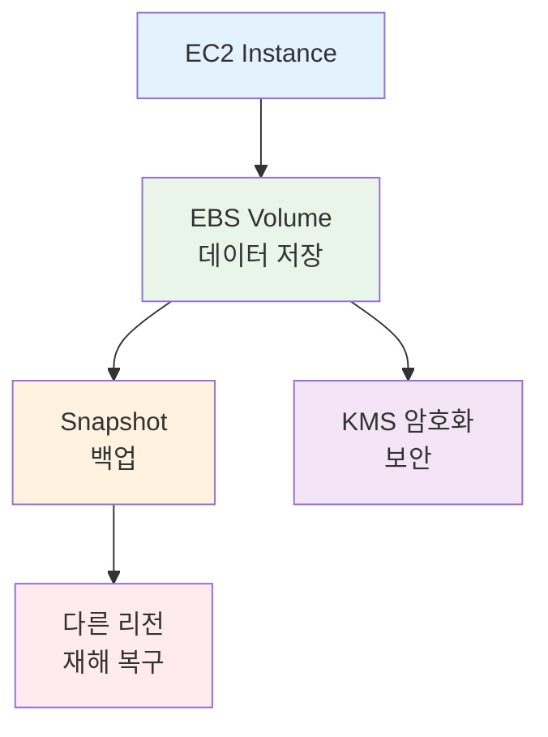
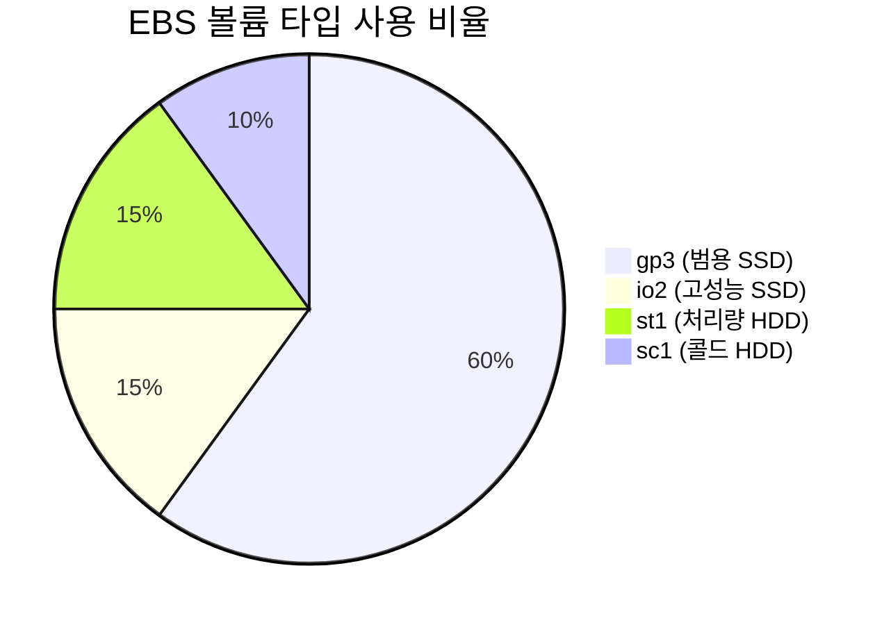
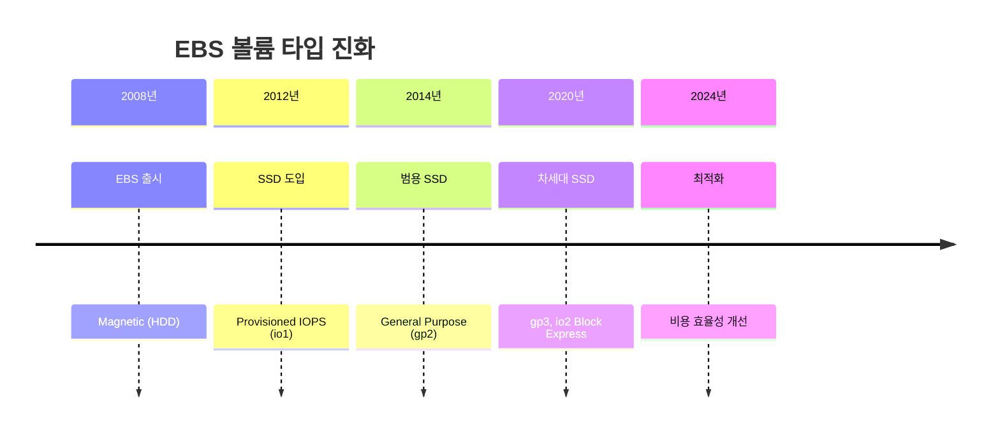
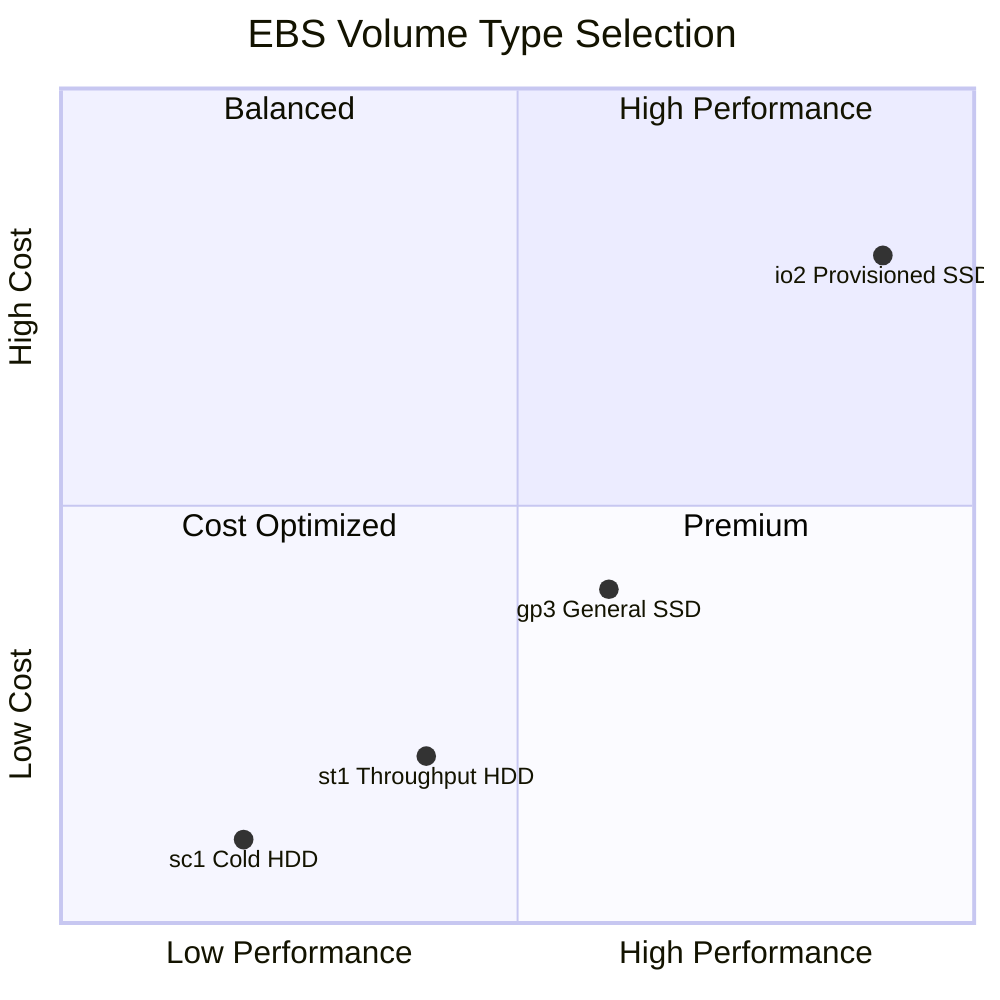
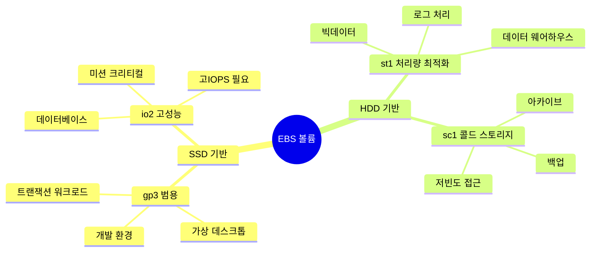
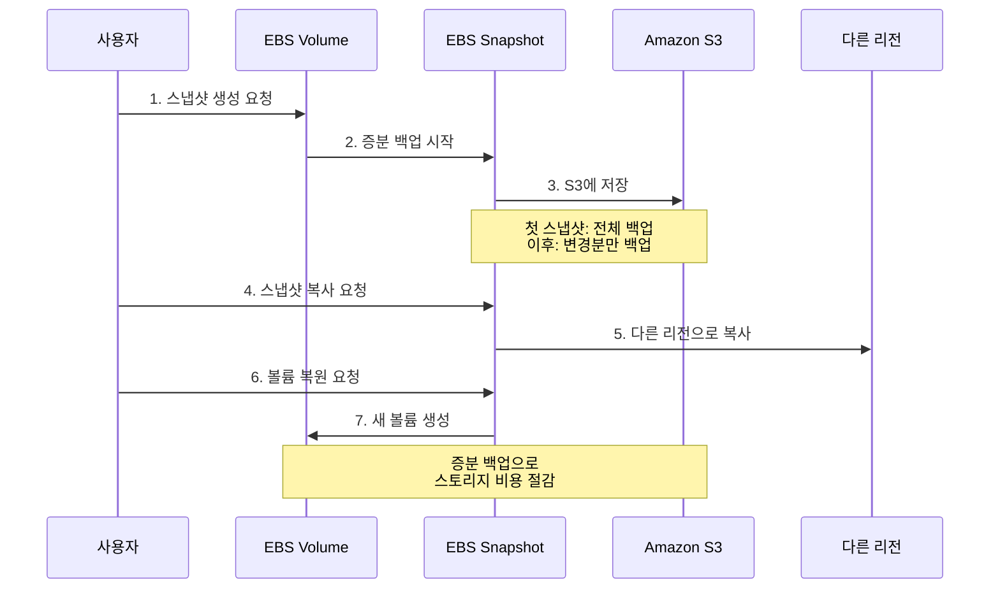
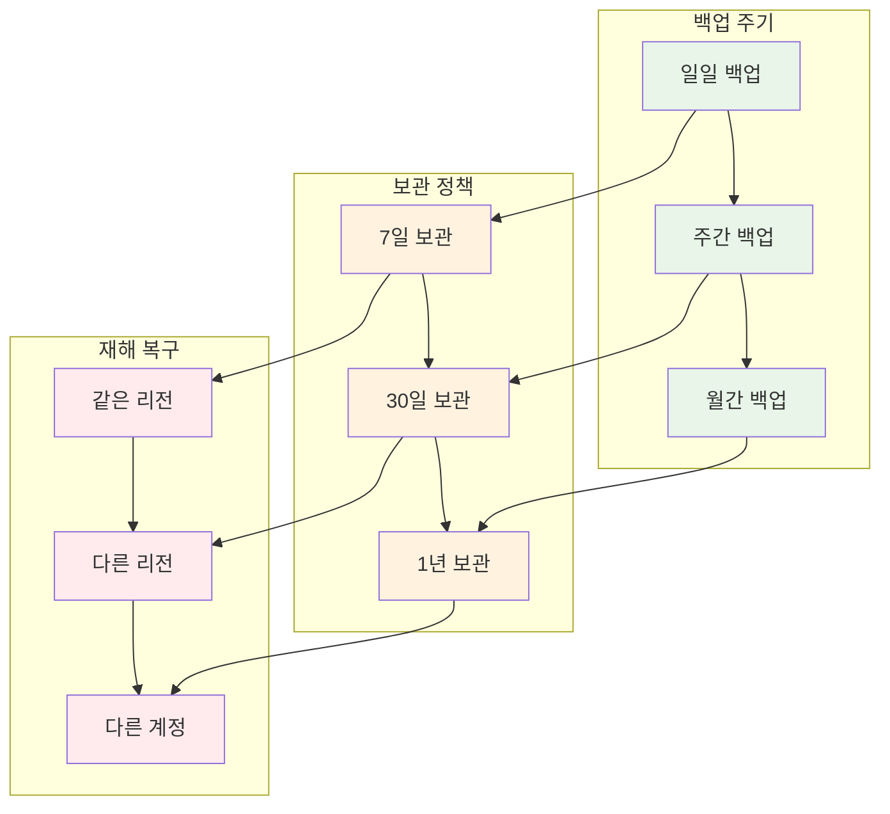
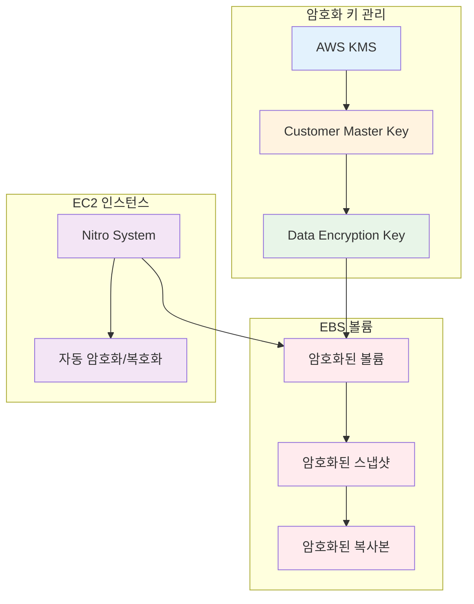
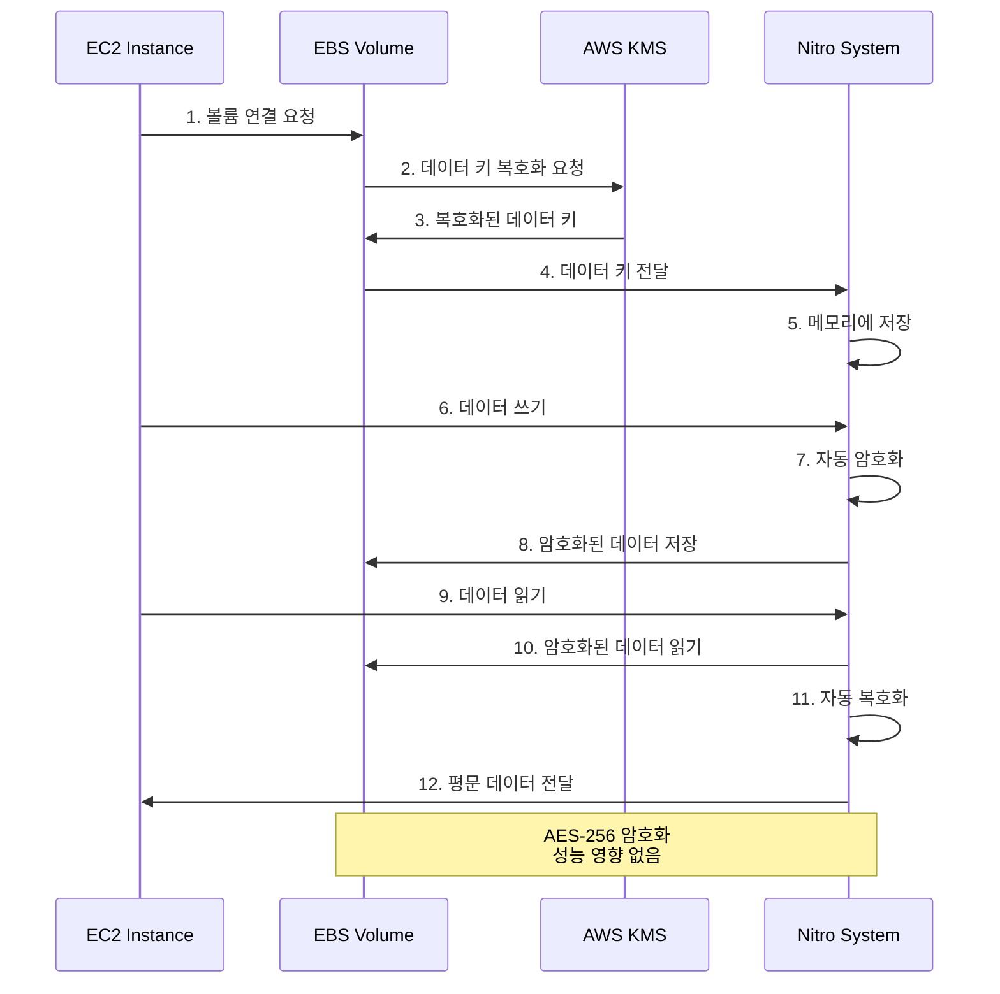

# Week 5 Day 2 Session 2: EBS 스토리지

<div align="center">

**💾 볼륨 타입** • **📸 스냅샷** • **🔐 암호화** • **⚡ 성능 최적화**

*EC2 인스턴스의 영구 스토리지 관리*

</div>

---

## 🕘 세션 정보
**시간**: 10:00-10:50 (50분)
**목표**: EBS 볼륨 타입 이해 및 데이터 영속성 전략 수립
**방식**: 이론 강의 + 실습 연계

## 🎯 세션 목표

### 📚 학습 목표
- **이해 목표**: EBS 볼륨 타입별 특징 및 선택 기준 이해
- **적용 목표**: 스냅샷 백업 및 암호화 전략 수립
- **협업 목표**: 데이터 영속성 및 재해 복구 계획 수립

### 🔗 Session 1 연계
- **Session 1**: EC2 인스턴스 생명주기 (Stop 시 데이터 유지)
- **Session 2**: EBS 볼륨으로 데이터 영속성 확보
- **Lab 1**: 실제 EBS 볼륨 추가 및 관리

---

## 🤔 왜 필요한가? (5분)

### 현실 문제 상황

**💼 실무 시나리오**:
- "EC2를 Terminate했는데 중요한 데이터가 모두 사라졌어요!"
- "데이터베이스 성능이 느린데 어떤 스토리지를 선택해야 하나요?"
- "백업은 어떻게 하고, 다른 리전으로 복제는 어떻게 하나요?"
- "스토리지 비용이 너무 높은데 최적화 방법이 있나요?"

**🏠 일상 비유**:
- **EBS 볼륨**: 컴퓨터의 하드디스크 (데이터 저장)
- **스냅샷**: 사진 찍기 (특정 시점 백업)
- **볼륨 타입**: SSD vs HDD (속도 vs 용량)
- **암호화**: 금고에 보관 (데이터 보안)

**☁️ AWS 아키텍처**:

**핵심 서비스**:
-  **Amazon EBS**: 블록 스토리지
-  **EBS Snapshot**: 백업 및 복구
-  **AWS KMS**: 암호화 키 관리



**📊 시장 동향**:


---

## 📖 핵심 개념 (35분)

### 🔍 개념 1: EBS 볼륨 타입 (12분)

> **정의**: 워크로드 특성에 따라 최적화된 다양한 스토리지 옵션

#### EBS 볼륨 타입 발전 과정



#### 볼륨 타입 선택 매트릭스



#### SSD vs HDD 볼륨 비교



#### 볼륨 타입 상세 비교

| 볼륨 타입 | 용도 | 크기 | IOPS | 처리량 | 가격 | 사용 사례 |
|----------|------|------|------|--------|------|----------|
| **gp3** | 범용 SSD | 1GB-16TB | 3,000-16,000 | 125-1,000 MB/s | $0.08/GB | 웹 서버, 개발 환경 |
| **gp2** | 범용 SSD (이전) | 1GB-16TB | 100-16,000 | 최대 250 MB/s | $0.10/GB | 레거시 워크로드 |
| **io2** | 고성능 SSD | 4GB-16TB | 100-64,000 | 최대 1,000 MB/s | $0.125/GB + IOPS | 데이터베이스, SAP |
| **io2 Block Express** | 최고 성능 | 4GB-64TB | 최대 256,000 | 최대 4,000 MB/s | $0.125/GB + IOPS | 대규모 DB, HPC |
| **st1** | 처리량 HDD | 125GB-16TB | 최대 500 | 최대 500 MB/s | $0.045/GB | 빅데이터, 로그 |
| **sc1** | 콜드 HDD | 125GB-16TB | 최대 250 | 최대 250 MB/s | $0.015/GB | 아카이브, 백업 |

#### 💡 실무 팁

**볼륨 타입 선택 가이드**:
- **웹 서버**: gp3 (범용, 비용 효율적)
- **데이터베이스**: io2 (일관된 성능, 높은 내구성)
- **빅데이터**: st1 (높은 처리량)
- **백업/아카이브**: sc1 (최저 비용)

**gp3 vs gp2**:
- gp3: 기본 3,000 IOPS, 독립적으로 IOPS/처리량 조정 가능
- gp2: 볼륨 크기에 비례 (1GB당 3 IOPS, 최소 100 IOPS)
- **권장**: 신규 워크로드는 gp3 사용 (20% 저렴)

**비용 최적화**:
- 사용하지 않는 볼륨 삭제
- gp2 → gp3 마이그레이션
- 스냅샷 수명주기 정책 설정

---

### 🔍 개념 2: EBS 스냅샷 (12분)

> **정의**: 특정 시점의 EBS 볼륨 데이터를 S3에 백업하는 기능

#### 스냅샷 동작 원리



#### 스냅샷 백업 전략



#### 스냅샷 사용 예시

**1. 스냅샷 생성**:

**AWS Console 경로**:
```
EC2 Console → Elastic Block Store → Volumes → 볼륨 선택 → Actions → Create snapshot
```

**설정**:
- Description: daily-backup-2025-01-26
- Tags: Name = MyApp-Backup, Environment = Production

**특징**:
- 증분 백업 (첫 번째만 전체, 이후 변경분만)
- 볼륨 사용 중에도 생성 가능
- S3에 자동 저장 (리전 내)

---

**2. 다른 리전으로 복사**:

**AWS Console 경로**:
```
EC2 Console → Elastic Block Store → Snapshots → 스냅샷 선택 → Actions → Copy snapshot
```

**설정**:
- Destination region: us-west-2 (재해 복구용)
- Encryption: 다른 KMS 키 선택 가능
- Description: DR-backup-us-west-2

**용도**:
- 재해 복구 (Disaster Recovery)
- 글로벌 배포
- 규정 준수 (데이터 주권)

---

**3. 스냅샷에서 볼륨 복원**:

**AWS Console 경로**:
```
EC2 Console → Elastic Block Store → Snapshots → 스냅샷 선택 → Actions → Create volume from snapshot
```

**설정**:
- Volume type: gp3 (원본과 다른 타입 선택 가능)
- Size: 100 GB (원본보다 크게 가능)
- Availability Zone: ap-northeast-2a
- Encryption: 암호화 설정 변경 가능

---

**4. 스냅샷 수명주기 정책**:

**AWS Console 경로**:
```
EC2 Console → Elastic Block Store → Lifecycle Manager → Create lifecycle policy
```

**설정**:
- Policy type: EBS snapshot policy
- Target resources: 태그 기반 선택
- Schedule: 매일 03:00 AM
- Retention: 7일 보관 후 자동 삭제

#### 💡 실무 팁

**백업 전략**:
- **3-2-1 규칙**: 3개 복사본, 2개 다른 매체, 1개 오프사이트
- **일일 백업**: 중요 데이터 (7일 보관)
- **주간 백업**: 일반 데이터 (30일 보관)
- **월간 백업**: 규정 준수 (1년 보관)

**비용 최적화**:
- 증분 백업으로 스토리지 비용 절감
- 오래된 스냅샷 자동 삭제
- 스냅샷 아카이브 (75% 저렴, 복원 24-72시간)

**재해 복구**:
- 다른 리전에 스냅샷 복사
- 정기적인 복원 테스트
- RTO/RPO 목표 설정

---

### 🔍 개념 3: EBS 암호화 (11분)

> **정의**: AWS KMS를 사용하여 EBS 볼륨과 스냅샷을 자동으로 암호화

#### 암호화 아키텍처



#### 암호화 동작 흐름



#### 암호화 설정 방법

**1. 새 볼륨 생성 시 암호화**:

**AWS Console 경로**:
```
EC2 Console → Elastic Block Store → Volumes → Create volume
```

**설정**:
- Encryption: ✅ Encrypt this volume
- KMS key: (default) aws/ebs 또는 Customer managed key
- 자동으로 스냅샷도 암호화됨

---

**2. 기본 암호화 활성화**:

**AWS Console 경로**:
```
EC2 Console → Account attributes → EBS encryption → Manage
```

**설정**:
- Always encrypt new EBS volumes: ✅ Enable
- Default encryption key: aws/ebs 또는 Customer managed key

**효과**:
- 이후 생성되는 모든 볼륨 자동 암호화
- 스냅샷 복사본도 자동 암호화
- 리전별 설정 (각 리전마다 활성화 필요)

---

**3. 암호화되지 않은 볼륨 암호화**:

**AWS Console 경로**:
```
1. 암호화되지 않은 볼륨의 스냅샷 생성
2. 스냅샷 복사 시 암호화 옵션 선택
3. 암호화된 스냅샷에서 새 볼륨 생성
4. 기존 볼륨 분리 후 새 볼륨 연결
```

**⚠️ 주의사항**:
- 기존 볼륨을 직접 암호화할 수 없음
- 스냅샷 → 암호화 복사 → 새 볼륨 생성 필요
- 다운타임 발생 가능 (계획 필요)

#### 암호화 키 관리

| 키 타입 | 관리 주체 | 비용 | 사용 사례 |
|---------|----------|------|----------|
| **AWS Managed Key** | AWS | 무료 | 기본 암호화, 간단한 사용 |
| **Customer Managed Key** | 사용자 | $1/month | 키 회전, 세밀한 제어 |
| **Custom Key Store** | 사용자 (CloudHSM) | 높음 | 규정 준수, 완전한 제어 |

#### 💡 실무 팁

**암호화 베스트 프랙티스**:
- **기본 암호화 활성화**: 모든 리전에서 설정
- **Customer Managed Key**: 규정 준수 필요 시
- **키 회전**: 자동 키 회전 활성화 (1년)
- **키 정책**: 최소 권한 원칙 적용

**성능 영향**:
- Nitro System: 암호화 성능 영향 없음
- 이전 세대: 약간의 성능 저하 가능
- **권장**: Nitro 기반 인스턴스 사용

**규정 준수**:
- HIPAA, PCI-DSS: 암호화 필수
- GDPR: 개인정보 암호화 권장
- 금융권: Customer Managed Key 사용

---

## 💭 함께 생각해보기 (10분)

### 🤝 페어 토론 (5분)

**토론 주제**:
1. **볼륨 타입 선택**: "웹 서버와 데이터베이스 서버에 각각 어떤 EBS 볼륨 타입을 선택하시겠습니까? 그 이유는?"
2. **백업 전략**: "일일 백업과 주간 백업의 보관 기간을 어떻게 설정하시겠습니까? 비용과 복구 요구사항을 고려해보세요."
3. **암호화 결정**: "모든 볼륨을 암호화해야 할까요? 암호화하지 않아도 되는 경우가 있을까요?"
4. **재해 복구**: "다른 리전에 스냅샷을 복사하는 것이 왜 중요한가요? 어떤 상황에서 필요할까요?"

**페어 활동 가이드**:
- 👥 **자유 페어링**: 관심사가 비슷한 사람끼리
- 🔄 **역할 교대**: 각자 의견 제시 후 토론
- 📝 **핵심 정리**: 합의된 내용 메모

### 🎯 전체 공유 (5분)

**공유 내용**:
- 각 페어의 토론 결과 발표
- 실무 경험이 있다면 공유
- 추가 질문 및 토론

### 💡 이해도 체크 질문

- ✅ "gp3와 io2의 차이점은 무엇이고, 각각 어떤 경우에 사용하나요?"
- ✅ "EBS 스냅샷은 증분 백업인가요, 전체 백업인가요?"
- ✅ "암호화되지 않은 볼륨을 암호화하려면 어떻게 해야 하나요?"
- ✅ "EBS 암호화가 성능에 영향을 주나요?"

---

## 🔑 핵심 키워드

### 새로운 용어
- **IOPS**: Input/Output Operations Per Second (초당 입출력 작업 수)
- **처리량**: Throughput (초당 전송 데이터량, MB/s)
- **증분 백업**: Incremental Backup (변경분만 백업)
- **Nitro System**: AWS의 차세대 하이퍼바이저
- **KMS**: Key Management Service (암호화 키 관리)

### 중요 개념
- **gp3 vs gp2**: 차세대 범용 SSD vs 이전 세대
- **io2 Block Express**: 최고 성능 SSD (256K IOPS)
- **스냅샷 수명주기**: 자동 백업 및 삭제 정책
- **기본 암호화**: 모든 새 볼륨 자동 암호화

### 실무 용어
- **RTO**: Recovery Time Objective (복구 목표 시간)
- **RPO**: Recovery Point Objective (복구 목표 시점)
- **3-2-1 백업 규칙**: 3개 복사본, 2개 매체, 1개 오프사이트
- **DR**: Disaster Recovery (재해 복구)

---

## 📝 세션 마무리

### ✅ 오늘 세션 성과
- **기술적 성취**: EBS 볼륨 타입 및 백업 전략 이해
- **실무 연계**: 스냅샷, 암호화 활용 방법
- **다음 Lab 준비**: 실제 EBS 볼륨 추가 및 스냅샷 생성

### 🎯 다음 세션 준비
- **Session 3**: S3 & CloudFront (객체 스토리지, CDN)
- **연계 내용**: EBS (블록 스토리지) vs S3 (객체 스토리지)
- **Lab 1**: EBS 볼륨 추가, 마운트, 스냅샷 생성

---

## 🔗 공식 문서 (필수)

**⚠️ 학생들이 직접 확인해야 할 공식 문서**:
- 📘 [EBS 볼륨 타입](https://docs.aws.amazon.com/ebs/latest/userguide/ebs-volume-types.html)
- 📗 [EBS 스냅샷](https://docs.aws.amazon.com/ebs/latest/userguide/ebs-snapshots.html)
- 📙 [EBS 암호화](https://docs.aws.amazon.com/ebs/latest/userguide/ebs-encryption.html)
- 📕 [EBS 요금](https://aws.amazon.com/ebs/pricing/)
- 🆕 [EBS 최신 업데이트](https://aws.amazon.com/about-aws/whats-new/storage/)

---

<div align="center">

**💾 영구 스토리지** • **📸 백업 전략** • **🔐 데이터 보안** • **⚡ 성능 최적화**

*EBS로 안전하고 효율적인 데이터 관리*

</div>
