# Week 5 Day 2 Session 3: S3 & CloudFront

<div align="center">

**🪣 객체 스토리지** • **🌐 CDN** • **📦 스토리지 클래스** • **⚡ 콘텐츠 배포**

*무제한 확장 가능한 객체 스토리지와 글로벌 콘텐츠 배포*

</div>

---

## 🕘 세션 정보
**시간**: 11:00-11:50 (50분)
**목표**: S3 스토리지 클래스 이해 및 CloudFront CDN 활용
**방식**: 이론 강의 + 실습 연계

## 🎯 세션 목표

### 📚 학습 목표
- **이해 목표**: S3 스토리지 클래스별 특징 및 선택 기준 이해
- **적용 목표**: CloudFront를 통한 글로벌 콘텐츠 배포 전략 수립
- **협업 목표**: 정적 웹사이트 호스팅 및 CDN 최적화 방안 논의

### 🔗 Session 2 연계
- **Session 2**: EBS 블록 스토리지 (EC2 연결)
- **Session 3**: S3 객체 스토리지 (독립적 사용)
- **Lab 1**: S3 버킷 생성 및 CloudFront 배포

---

## 🤔 왜 필요한가? (5분)

### 현실 문제 상황

**💼 실무 시나리오**:
- "사용자 업로드 파일을 어디에 저장해야 하나요? EC2 디스크는 부족해요!"
- "전 세계 사용자에게 빠르게 이미지를 제공하려면 어떻게 해야 하나요?"
- "오래된 로그 파일은 저렴하게 보관하고 싶은데 방법이 있나요?"
- "정적 웹사이트를 서버 없이 호스팅할 수 있나요?"

**🏠 일상 비유**:
- **S3 버킷**: 무제한 창고 (파일 보관)
- **스토리지 클래스**: 창고 등급 (자주 쓰는 것 vs 보관용)
- **CloudFront**: 전국 배송 센터 (가까운 곳에서 배송)
- **정적 웹사이트**: 전단지 배포 (서버 없이 콘텐츠 제공)

**☁️ AWS 아키텍처**:

**핵심 서비스**:
-  **Amazon S3**: 객체 스토리지
-  **Amazon CloudFront**: 글로벌 CDN
-  **Amazon Route 53**: DNS 관리



```mermaid
graph TB
    A[사용자<br/>전 세계] --> B[CloudFront<br/>Edge Location]
    B --> C[S3 Bucket<br/>Origin]
    C --> D[Lifecycle Policy<br/>자동 전환]
    D --> E[Glacier<br/>아카이브]
    
    style A fill:#e3f2fd
    style B fill:#fff3e0
    style C fill:#e8f5e8
    style D fill:#ffebee
    style E fill:#f3e5f5
```

**📊 시장 동향**:

```mermaid
pie title S3 사용 사례 분포
    "정적 웹사이트" : 25
    "백업 및 아카이브" : 30
    "미디어 스토리지" : 20
    "데이터 레이크" : 15
    "애플리케이션 데이터" : 10
```


---

## 📖 핵심 개념 (35분)

### 🔍 개념 1: S3 기초 및 스토리지 클래스 (12분)

> **정의**: 무제한 확장 가능한 객체 스토리지 서비스

**핵심 서비스**:
-  **Amazon S3**: 객체 스토리지 서비스
-  **S3 Glacier**: 장기 아카이브

#### S3 발전 과정


#### 스토리지 클래스 선택 매트릭스


#### 스토리지 클래스 분류

```mermaid
mindmap
  root((S3 Storage))
    자주 접근
      S3 Standard
        밀리초 지연시간
        99.99% 가용성
        웹사이트, 앱
      S3 Express One Zone
        한자리수 밀리초
        단일 AZ
        고성능 워크로드
    가끔 접근
      S3 Standard-IA
        즉시 접근
        30일 최소 보관
        백업, 재해복구
      S3 One Zone-IA
        단일 AZ
        20% 저렴
        재생성 가능 데이터
      S3 Intelligent-Tiering
        자동 최적화
        모니터링 비용
        접근 패턴 불규칙
    아카이브
      S3 Glacier Instant
        밀리초 검색
        장기 보관
        분기별 접근
      S3 Glacier Flexible
        분-시간 검색
        규정 준수
        연 1-2회 접근
      S3 Glacier Deep Archive
        12시간 검색
        최저 비용
        7-10년 보관
```



#### 스토리지 클래스 상세 비교

**성능 비교 차트**:


**비용 비교 차트**:


| 스토리지 클래스 | 접근 빈도 | 검색 시간 | 최소 보관 | 가용성 | 가격 (GB/월) | 사용 사례 |
|----------------|----------|----------|----------|--------|-------------|----------|
| **S3 Standard** | 자주 | 밀리초 | 없음 | 99.99% | $0.023 | 웹사이트, 앱 데이터 |
| **S3 Express One Zone** | 매우 자주 | 한자리수 ms | 없음 | 99.95% | $0.16 | ML 학습, 분석 |
| **S3 Standard-IA** | 가끔 | 밀리초 | 30일 | 99.9% | $0.0125 | 백업, 재해복구 |
| **S3 One Zone-IA** | 가끔 | 밀리초 | 30일 | 99.5% | $0.01 | 재생성 가능 데이터 |
| **S3 Intelligent-Tiering** | 불규칙 | 밀리초 | 없음 | 99.9% | $0.0025 + 모니터링 | 접근 패턴 불명확 |
| **S3 Glacier Instant** | 분기별 | 밀리초 | 90일 | 99.9% | $0.004 | 의료 기록, 뉴스 |
| **S3 Glacier Flexible** | 연 1-2회 | 분-시간 | 90일 | 99.99% | $0.0036 | 규정 준수 |
| **S3 Glacier Deep Archive** | 연 1회 미만 | 12시간 | 180일 | 99.99% | $0.00099 | 장기 아카이브 |

#### 💡 실무 팁

**스토리지 클래스 선택 가이드**:
- **웹사이트/앱**: S3 Standard (자주 접근)
- **백업**: S3 Standard-IA (즉시 복구 필요)
- **로그 분석**: S3 Intelligent-Tiering (접근 패턴 불규칙)
- **규정 준수**: S3 Glacier Flexible (장기 보관)
- **세금 기록**: S3 Glacier Deep Archive (7년 보관)

**Lifecycle Policy 예시**:
```
AWS Console 경로:
S3 Console → Buckets → 버킷 선택 → Management → Lifecycle rules → Create rule

설정:
- Rule name: auto-archive
- Scope: 전체 버킷 또는 Prefix 지정

Transitions:
- 30일 후: Standard → Standard-IA
- 90일 후: Standard-IA → Glacier Flexible
- 365일 후: Glacier Flexible → Glacier Deep Archive

Expiration:
- 2555일 후 (7년): 객체 삭제
```

**비용 최적화**:
- Lifecycle Policy로 자동 전환
- Intelligent-Tiering으로 자동 최적화
- S3 Storage Lens로 사용 패턴 분석
- 불필요한 객체 정기 삭제

**S3 Express One Zone 최신 기능 (2024년)**:
- **Lifecycle Expirations**: 자동 객체 만료로 비용 최적화
- **Append Data**: 기존 객체에 데이터 추가 (로그 처리 최적화)
- **Conditional Deletes**: 동시성 환경에서 안전한 삭제
- **SSE-KMS Customer Keys**: 고객 관리 키로 감사 로그 강화

**사용 사례**:
- **ML 학습**: 한자리수 밀리초 지연시간
- **로그 처리**: Append 기능으로 실시간 로그 추가
- **분석 워크로드**: 고성능 데이터 접근
- **비디오 편집**: 빠른 읽기/쓰기 성능

**주의사항**:
- **최소 보관 기간**: 조기 삭제 시 전체 기간 비용 청구
- **검색 비용**: Glacier는 검색 시 추가 비용
- **데이터 전송**: 리전 간 전송 비용 발생
- **요청 비용**: PUT, GET 요청마다 비용

---

### 🔍 개념 2: S3 버킷 관리 및 보안 (12분)

> **정의**: S3 버킷의 접근 제어, 버전 관리, 암호화 설정

**핵심 서비스**:
-  **S3 Bucket**: 객체 컨테이너
-  **IAM**: 접근 제어
-  **AWS KMS**: 암호화 키 관리

#### S3 보안 계층

```mermaid
graph TB
    subgraph "접근 제어"
        A[IAM Policy] --> D[접근 허용/거부]
        B[Bucket Policy] --> D
        C[ACL] --> D
    end
    
    subgraph "데이터 보호"
        E[Versioning] --> H[데이터 복구]
        F[Object Lock] --> H
        G[MFA Delete] --> H
    end
    
    subgraph "암호화"
        I[SSE-S3] --> L[데이터 암호화]
        J[SSE-KMS] --> L
        K[SSE-C] --> L
    end
    
    D --> H
    H --> L
    
    style A fill:#e8f5e8
    style B fill:#e8f5e8
    style C fill:#e8f5e8
    style E fill:#fff3e0
    style F fill:#fff3e0
    style G fill:#fff3e0
    style I fill:#ffebee
    style J fill:#ffebee
    style K fill:#ffebee
```



#### 버킷 정책 동작 흐름

```mermaid
sequenceDiagram
    participant U as 사용자
    participant I as IAM
    participant B as Bucket Policy
    participant S as S3 Bucket
    
    U->>I: 1. 요청 (GetObject)
    I->>I: 2. IAM Policy 확인
    I->>B: 3. Bucket Policy 확인
    B->>B: 4. 명시적 Deny 확인
    
    alt Deny 존재
        B->>U: 5a. 접근 거부
    else Allow 존재
        B->>S: 5b. 객체 접근 허용
        S->>U: 6. 객체 반환
    end
    
    Note over I,B: Deny가 Allow보다<br/>우선순위 높음
```



#### S3 버킷 설정 예시

**1. 버킷 생성 및 기본 설정**:

**AWS Console 경로**:
```
S3 Console → Buckets → Create bucket
```

**설정**:
- Bucket name: my-app-data-2025 (전역 고유)
- Region: ap-northeast-2 (서울)
- Block Public Access: ✅ 모두 차단 (기본값)
- Versioning: ✅ Enable (데이터 보호)
- Default encryption: SSE-S3 (자동 암호화)

---

**2. 버킷 정책 설정**:

**AWS Console 경로**:
```
S3 Console → Buckets → 버킷 선택 → Permissions → Bucket policy
```

**정책 예시 (CloudFront 접근 허용)**:
```json
{
  "Version": "2012-10-17",
  "Statement": [
    {
      "Sid": "AllowCloudFrontAccess",
      "Effect": "Allow",
      "Principal": {
        "Service": "cloudfront.amazonaws.com"
      },
      "Action": "s3:GetObject",
      "Resource": "arn:aws:s3:::my-app-data-2025/*",
      "Condition": {
        "StringEquals": {
          "AWS:SourceArn": "arn:aws:cloudfront::123456789012:distribution/EDFDVBD6EXAMPLE"
        }
      }
    }
  ]
}
```

---

**3. 버전 관리 및 복구**:

**AWS Console 경로**:
```
S3 Console → Buckets → 버킷 선택 → Properties → Bucket Versioning → Enable
```

**특징**:
- 모든 객체 버전 보관
- 삭제 시 Delete Marker 생성 (실제 삭제 아님)
- 이전 버전 복원 가능
- Lifecycle Policy로 이전 버전 관리

**복원 방법**:
```
S3 Console → 객체 선택 → Versions → 이전 버전 선택 → Restore
```

---

**4. 암호화 설정**:

**AWS Console 경로**:
```
S3 Console → Buckets → 버킷 선택 → Properties → Default encryption
```

**암호화 옵션**:
| 암호화 타입 | 키 관리 | 비용 | 사용 사례 |
|------------|---------|------|----------|
| **SSE-S3** | AWS 관리 | 무료 | 기본 암호화 |
| **SSE-KMS** | AWS KMS | $1/month + 요청 | 감사 로그 필요 |
| **SSE-C** | 고객 관리 | 무료 | 완전한 키 제어 |

#### 💡 실무 팁

**보안 베스트 프랙티스**:
- **Block Public Access**: 항상 활성화 (공개 필요 시만 해제)
- **Versioning**: 중요 데이터는 필수
- **MFA Delete**: 실수로 삭제 방지
- **Bucket Policy**: 최소 권한 원칙

**버전 관리 주의사항**:
- 모든 버전이 스토리지 비용 발생
- Lifecycle Policy로 이전 버전 자동 삭제
- Delete Marker도 버전으로 카운트

**암호화 권장사항**:
- 기본 암호화 활성화 (SSE-S3)
- 규정 준수: SSE-KMS 사용
- 감사 로그: CloudTrail 연동

---

### 🔍 개념 3: CloudFront CDN (11분)

> **정의**: 전 세계 엣지 로케이션을 통한 콘텐츠 배포 네트워크

**핵심 서비스**:
-  **Amazon CloudFront**: 글로벌 CDN
-  **S3**: Origin 서버
-  **Route 53**: DNS 라우팅

#### CloudFront 아키텍처

```mermaid
graph TB
    subgraph "사용자"
        A1[한국 사용자]
        A2[미국 사용자]
        A3[유럽 사용자]
    end
    
    subgraph "CloudFront Edge Locations"
        B1[서울 Edge]
        B2[버지니아 Edge]
        B3[런던 Edge]
    end
    
    subgraph "Regional Edge Cache"
        C[도쿄 REC]
    end
    
    subgraph "Origin"
        D[S3 Bucket<br/>ap-northeast-2]
    end
    
    A1 --> B1
    A2 --> B2
    A3 --> B3
    
    B1 --> C
    B2 --> C
    B3 --> C
    
    C --> D
    
    style A1 fill:#e3f2fd
    style A2 fill:#e3f2fd
    style A3 fill:#e3f2fd
    style B1 fill:#e8f5e8
    style B2 fill:#e8f5e8
    style B3 fill:#e8f5e8
    style C fill:#fff3e0
    style D fill:#ffebee
```



#### CloudFront 동작 흐름

```mermaid
sequenceDiagram
    participant U as 사용자 (서울)
    participant E as Edge Location (서울)
    participant R as Regional Cache (도쿄)
    participant O as Origin (S3)
    
    U->>E: 1. 콘텐츠 요청
    
    alt 캐시 HIT
        E->>U: 2a. 캐시된 콘텐츠 반환
    else 캐시 MISS
        E->>R: 2b. Regional Cache 확인
        
        alt Regional 캐시 HIT
            R->>E: 3a. 콘텐츠 반환
            E->>U: 4a. 콘텐츠 전달
        else Regional 캐시 MISS
            R->>O: 3b. Origin 요청
            O->>R: 4b. 콘텐츠 반환
            R->>E: 5b. 콘텐츠 전달
            E->>U: 6b. 콘텐츠 전달
        end
    end
    
    Note over E,R: TTL 동안 캐시 유지<br/>(기본 24시간)
```



#### CloudFront 배포 설정

**1. CloudFront Distribution 생성**:

**AWS Console 경로**:
```
CloudFront Console → Distributions → Create distribution
```

**설정**:
- Origin domain: my-app-data-2025.s3.ap-northeast-2.amazonaws.com
- Origin access: Origin Access Control (OAC) - 권장
- Viewer protocol policy: Redirect HTTP to HTTPS
- Allowed HTTP methods: GET, HEAD, OPTIONS
- Cache policy: CachingOptimized
- Price class: Use all edge locations (최고 성능)

---

**2. 캐시 동작 설정**:

**AWS Console 경로**:
```
CloudFront Console → Distributions → 배포 선택 → Behaviors
```

**설정**:
- Path pattern: /images/* (이미지 파일)
- TTL: Min 0, Max 31536000, Default 86400 (24시간)
- Compress objects: ✅ Yes (자동 압축)

---

**3. 커스텀 도메인 설정**:

**AWS Console 경로**:
```
CloudFront Console → Distributions → 배포 선택 → General → Settings → Edit
```

**설정**:
- Alternate domain names (CNAMEs): cdn.example.com
- Custom SSL certificate: ACM 인증서 선택
- Route 53에서 CNAME 레코드 생성

---

**4. 캐시 무효화 (Invalidation)**:

**AWS Console 경로**:
```
CloudFront Console → Distributions → 배포 선택 → Invalidations → Create invalidation
```

**설정**:
- Object paths: /images/* 또는 /* (전체)
- 비용: 월 1,000개 경로까지 무료

#### 성능 최적화 전략

**캐시 효율성 향상**:


**TTL 설정 가이드**:
- **정적 파일** (이미지, CSS, JS): 1년 (31536000초)
- **HTML**: 1시간 (3600초)
- **API 응답**: 캐시 안 함 (0초)
- **자주 변경**: 짧은 TTL + Invalidation

#### 💡 실무 팁

**CloudFront 베스트 프랙티스**:
- **OAC 사용**: S3 직접 접근 차단
- **HTTPS 필수**: 보안 및 SEO
- **압축 활성화**: 전송 비용 절감
- **Price Class**: 필요한 지역만 선택

**비용 최적화**:
- 높은 TTL 설정 (Origin 요청 감소)
- 압축 활성화 (데이터 전송 감소)
- Price Class 조정 (불필요한 지역 제외)
- S3 Transfer Acceleration 대신 CloudFront 사용

**성능 최적화**:
- Regional Edge Cache 활용
- 파일 압축 (Gzip, Brotli)
- HTTP/2, HTTP/3 지원
- Lambda@Edge로 동적 처리

**최신 보안 기능 (2024-2025년)**:
- **Post-Quantum TLS**: 양자 컴퓨팅 대응 암호화 (자동 적용)
- **TLS 1.3 Only Policy**: 최신 보안 프로토콜 (성능 향상)
- **HTTPS DNS Record**: Route 53 통합으로 HTTP/3 즉시 발견
- **Hybrid Key Establishment**: 미래 보안 위협 대비

**HTTPS DNS Record 활용**:
```
기존 방식:
1. DNS 조회 (A/AAAA 레코드)
2. HTTP/1.1 연결
3. Alt-Svc 헤더로 HTTP/3 발견
4. HTTP/3 재연결

새로운 방식 (2024년):
1. DNS 조회 (HTTPS 레코드)
2. HTTP/3 즉시 연결 (1 RTT 절약)

Route 53 설정:
- Record type: HTTPS (Alias)
- CloudFront distribution 선택
- 추가 비용 없음
```

---

## 💭 함께 생각해보기 (10분)

### 🤝 페어 토론 (5분)

**토론 주제**:
1. **스토리지 클래스 선택**: "사용자 업로드 사진을 저장한다면 어떤 스토리지 클래스를 선택하시겠습니까? 30일 후, 1년 후에는 어떻게 관리하시겠습니까?"
2. **보안 전략**: "S3 버킷을 공개해야 하는 경우와 CloudFront를 사용해야 하는 경우의 차이는 무엇인가요?"
3. **비용 최적화**: "CloudFront를 사용하면 비용이 증가할까요, 감소할까요? 어떤 경우에 비용 효율적인가요?"
4. **정적 웹사이트**: "S3 정적 웹사이트 호스팅과 EC2 웹 서버의 장단점은 무엇인가요?"

**페어 활동 가이드**:
- 👥 **자유 페어링**: 관심사가 비슷한 사람끼리
- 🔄 **역할 교대**: 각자 의견 제시 후 토론
- 📝 **핵심 정리**: 합의된 내용 메모

### 🎯 전체 공유 (5분)

**공유 내용**:
- 각 페어의 토론 결과 발표
- 실무 경험이 있다면 공유
- 추가 질문 및 토론

### 💡 이해도 체크 질문

- ✅ "S3 Standard와 S3 Standard-IA의 차이점은 무엇이고, 각각 언제 사용하나요?"
- ✅ "S3 Lifecycle Policy는 어떻게 동작하며, 비용 절감에 어떻게 도움이 되나요?"
- ✅ "CloudFront Edge Location과 Regional Edge Cache의 역할은 무엇인가요?"
- ✅ "S3 버킷을 직접 공개하는 것과 CloudFront를 사용하는 것의 차이는?"

---

## 🔑 핵심 키워드

### 새로운 용어
- **객체 스토리지**: Object Storage (파일 단위 저장)
- **버킷**: Bucket (S3의 최상위 컨테이너)
- **CDN**: Content Delivery Network (콘텐츠 배포 네트워크)
- **Edge Location**: 엣지 로케이션 (사용자와 가까운 캐시 서버)
- **TTL**: Time To Live (캐시 유지 시간)

### 중요 개념
- **Lifecycle Policy**: 자동 스토리지 클래스 전환
- **Versioning**: 객체 버전 관리 및 복구
- **OAC**: Origin Access Control (S3 보안 접근)
- **Invalidation**: 캐시 무효화 (즉시 업데이트)
- **Post-Quantum TLS**: 양자 컴퓨팅 대응 암호화 (2025년)
- **HTTPS DNS Record**: HTTP/3 즉시 발견 (2024년)

### 실무 용어
- **Origin**: 원본 서버 (S3, EC2 등)
- **Distribution**: CloudFront 배포 단위
- **Cache Hit Ratio**: 캐시 적중률
- **Regional Edge Cache**: 중간 캐시 계층

---

## 📝 세션 마무리

### ✅ 오늘 세션 성과
- **기술적 성취**: S3 스토리지 클래스 및 CloudFront CDN 이해
- **실무 연계**: 정적 웹사이트 호스팅 및 글로벌 배포 전략
- **다음 Lab 준비**: S3 버킷 생성 및 CloudFront 배포 실습

### 🎯 다음 세션 준비
- **Session 4**: 고객 사례 - E-Commerce 플랫폼
- **연계 내용**: S3 + CloudFront를 활용한 실제 아키텍처
- **Lab 1**: S3 정적 웹사이트 + CloudFront 배포

---

## 🔗 공식 문서 (필수)

**⚠️ 학생들이 직접 확인해야 할 공식 문서**:
- 📘 [S3 스토리지 클래스](https://docs.aws.amazon.com/AmazonS3/latest/userguide/storage-class-intro.html)
- 📗 [S3 Lifecycle 관리](https://docs.aws.amazon.com/AmazonS3/latest/userguide/object-lifecycle-mgmt.html)
- 📙 [CloudFront 개발자 가이드](https://docs.aws.amazon.com/AmazonCloudFront/latest/DeveloperGuide/Introduction.html)
- 📕 [S3 요금](https://aws.amazon.com/s3/pricing/)
- 🆕 [S3 최신 업데이트](https://aws.amazon.com/about-aws/whats-new/storage/)

**🔥 2024-2025 최신 기능**:
- 🆕 [S3 Express One Zone Lifecycle](https://aws.amazon.com/about-aws/whats-new/2024/11/amazon-s3-express-one-zone-s3-lifecycle-expirations/)
- 🆕 [S3 Express Append Data](https://aws.amazon.com/about-aws/whats-new/2024/11/amazon-s3-express-one-zone-append-data-object/)
- 🆕 [CloudFront Post-Quantum TLS](https://aws.amazon.com/about-aws/whats-new/2025/09/amazon-cloudfront-TLS-policy-post-quantum-support/)
- 🆕 [CloudFront HTTPS DNS Record](https://aws.amazon.com/blogs/networking-and-content-delivery/boost-application-performance-amazon-cloudfront-enables-https-record/)

---

<div align="center">

**🪣 무제한 스토리지** • **🌐 글로벌 배포** • **📦 자동 최적화** • **⚡ 빠른 콘텐츠 전달**

*S3와 CloudFront로 확장 가능한 스토리지 및 배포 시스템 구축*

</div>
