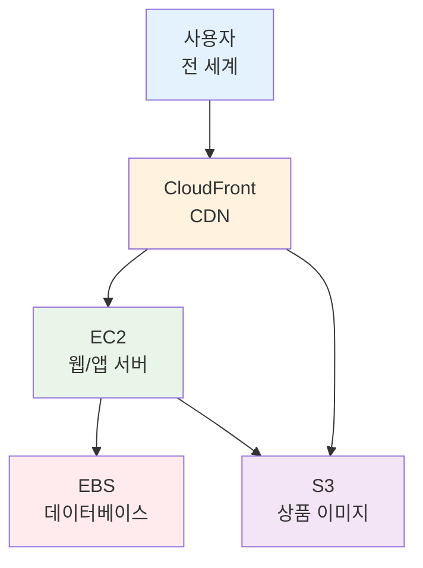
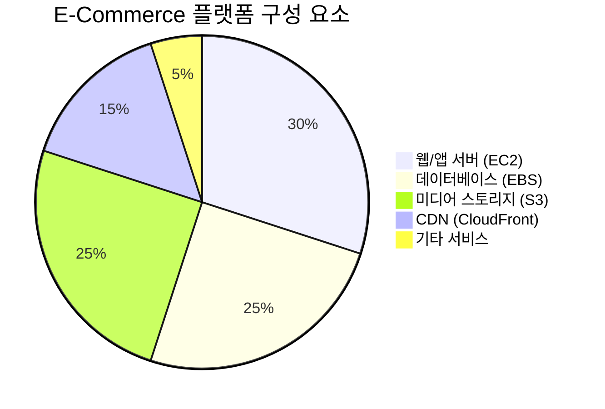
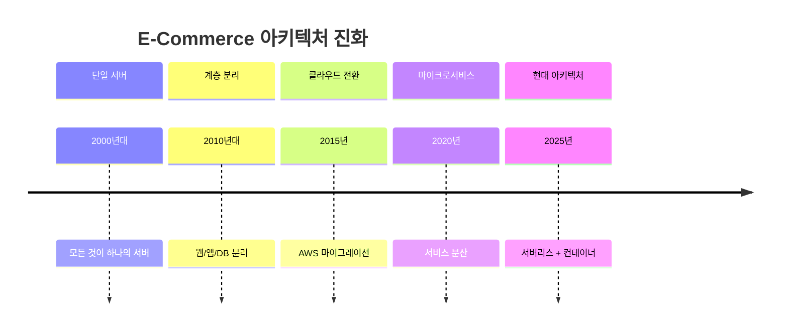
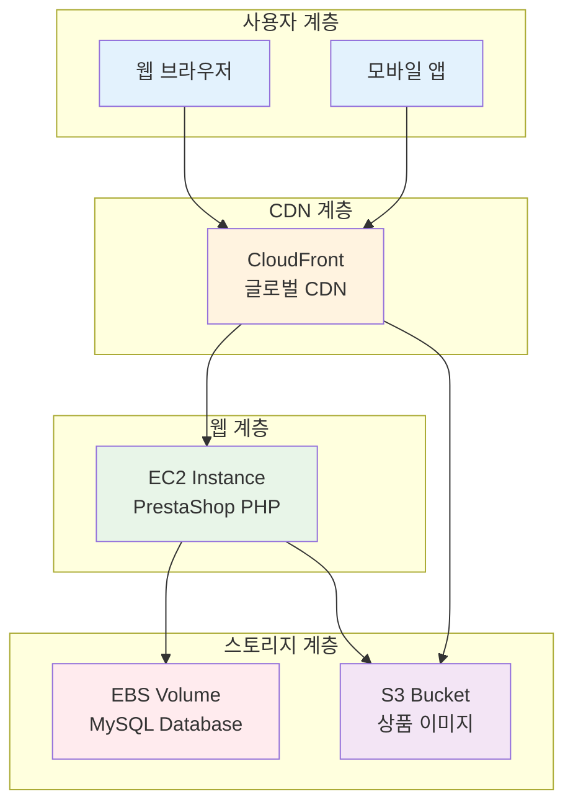
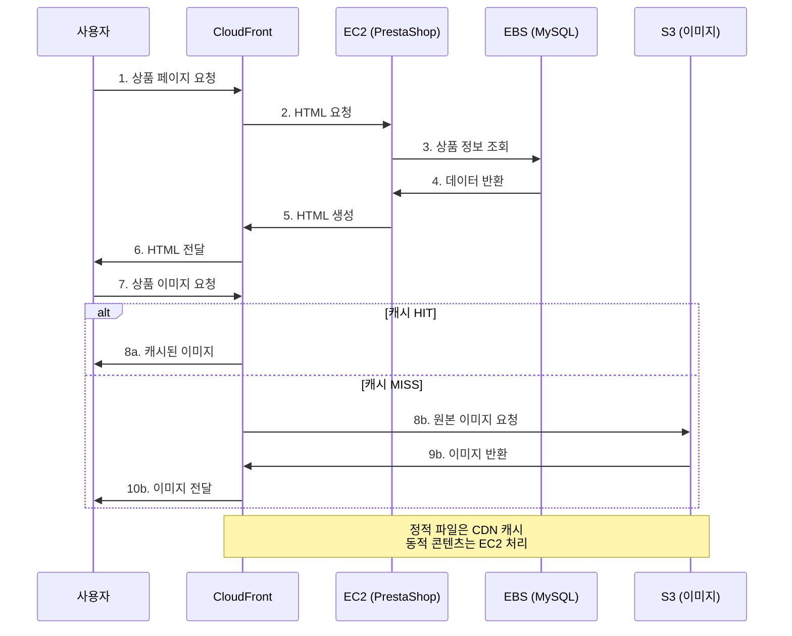
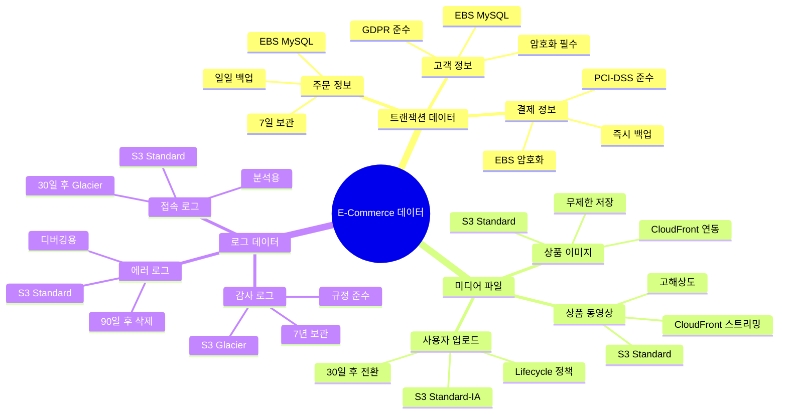
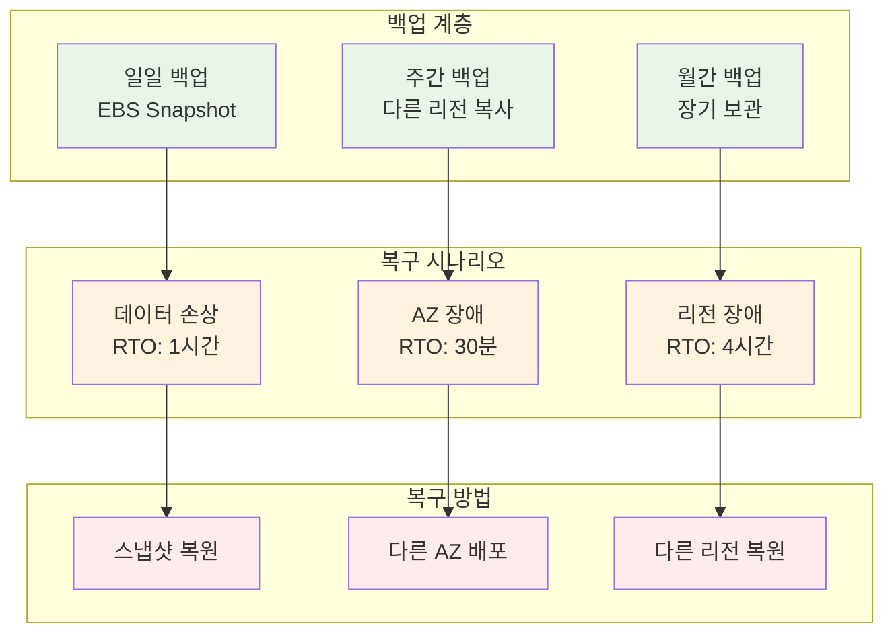
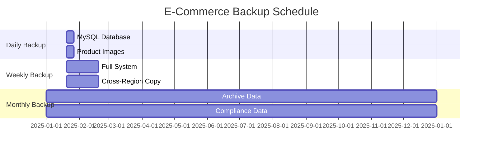
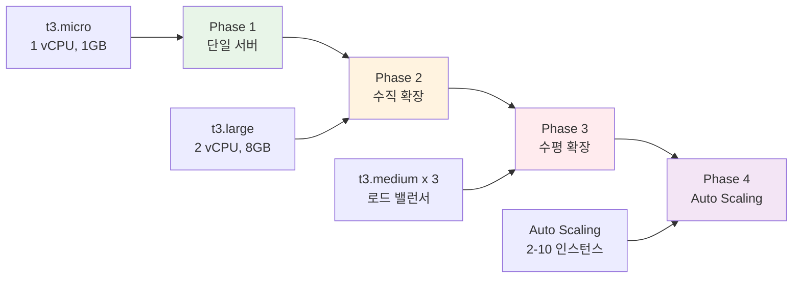
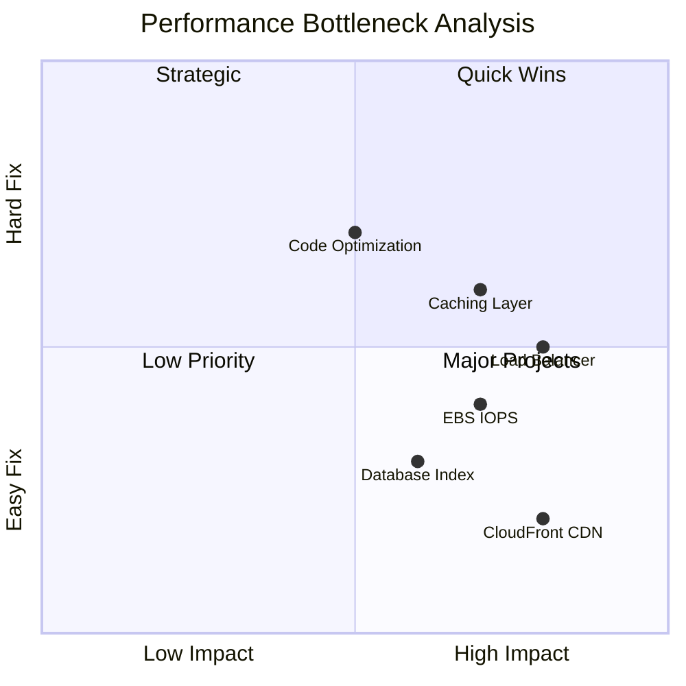

# Week 5 Day 2 Session 4: E-Commerce 플랫폼 아키텍처

<div align="center">

**🛒 쇼핑몰 구축** • **📦 상품 관리** • **🌐 글로벌 배포** • **💾 데이터 영속성**

*EC2 + EBS + S3 + CloudFront 통합 아키텍처*

</div>

---

## 🕘 세션 정보
**시간**: 12:00-12:50 (50분)
**목표**: Session 1-3 통합 및 실무 E-Commerce 아키텍처 이해
**방식**: 고객 사례 분석 + 아키텍처 설계

## 🎯 세션 목표

### 📚 학습 목표
- **이해 목표**: E-Commerce 플랫폼의 AWS 아키텍처 패턴 이해
- **적용 목표**: EC2, EBS, S3, CloudFront 통합 설계 능력
- **협업 목표**: 실무 아키텍처 설계 및 비용 최적화 논의

### 🔗 Session 1-3 통합
- **Session 1**: EC2 인스턴스 (웹/앱 서버)
- **Session 2**: EBS 볼륨 (데이터베이스 스토리지)
- **Session 3**: S3 + CloudFront (상품 이미지, CDN)
- **Session 4**: 전체 통합 아키텍처

---

## 🤔 왜 필요한가? (5분)

### 현실 문제 상황

**💼 실무 시나리오**:
- "쇼핑몰을 AWS에 구축하려는데 어떤 서비스를 조합해야 하나요?"
- "상품 이미지가 많은데 어디에 저장하고 어떻게 빠르게 제공하나요?"
- "데이터베이스 성능과 백업은 어떻게 관리하나요?"
- "트래픽이 급증하면 어떻게 대응하나요?"

**🏠 일상 비유**:
- **EC2**: 매장 건물 (웹/앱 서버)
- **EBS**: 금고 (중요 데이터 보관)
- **S3**: 창고 (상품 이미지 보관)
- **CloudFront**: 배송 센터 (빠른 콘텐츠 전달)

**☁️ AWS 아키텍처**:

**핵심 서비스**:
-  **Amazon EC2**: 웹/앱 서버
-  **Amazon EBS**: 데이터베이스 스토리지
-  **Amazon S3**: 상품 이미지
-  **Amazon CloudFront**: 글로벌 CDN



**📊 E-Commerce 시장 동향**:


---

## 📖 핵심 개념 (35분)

### 🔍 개념 1: E-Commerce 아키텍처 패턴 (12분)

> **정의**: 확장 가능하고 안정적인 온라인 쇼핑몰 인프라 구조

**핵심 서비스**:
-  **EC2**: 애플리케이션 서버
-  **RDS**: 관리형 데이터베이스 (향후 학습)
-  **ElastiCache**: 세션/캐시 (향후 학습)

#### E-Commerce 아키텍처 진화




#### PrestaShop E-Commerce 아키텍처

**PrestaShop 소개**:
- 오픈소스 E-Commerce 플랫폼
- PHP 기반, MySQL 데이터베이스
- 전 세계 30만+ 온라인 쇼핑몰 사용
- 상품 관리, 주문 처리, 결제 통합

**전체 아키텍처**:



**컴포넌트별 역할**:

| 컴포넌트 | AWS 서비스 | 역할 | 스펙 |
|---------|-----------|------|------|
| **웹/앱 서버** | EC2 t3.medium | PrestaShop 실행 | 2 vCPU, 4GB RAM |
| **데이터베이스** | EBS gp3 100GB | MySQL 데이터 | 3,000 IOPS |
| **상품 이미지** | S3 Standard | 이미지 저장 | 무제한 |
| **CDN** | CloudFront | 글로벌 배포 | 전 세계 엣지 |

#### 데이터 흐름 분석



#### 💡 실무 팁

**아키텍처 설계 원칙**:
- **정적/동적 분리**: 이미지는 S3, 페이지는 EC2
- **CDN 활용**: CloudFront로 글로벌 성능 향상
- **데이터 영속성**: EBS 스냅샷으로 백업
- **확장성 고려**: 향후 Auto Scaling 적용 가능

**비용 최적화**:
- S3 Intelligent-Tiering: 오래된 이미지 자동 전환
- CloudFront 캐싱: Origin 요청 감소
- EBS gp3: gp2 대비 20% 저렴
- Elastic IP: 사용 중일 때만 무료

**성능 최적화**:
- CloudFront TTL: 이미지 1년, HTML 1시간
- EBS 최적화 인스턴스: 전용 대역폭
- S3 Transfer Acceleration: 업로드 속도 향상
- MySQL 쿼리 캐싱: 반복 쿼리 최적화

---

### 🔍 개념 2: 데이터 관리 전략 (12분)

> **정의**: E-Commerce 데이터의 저장, 백업, 복구 전략

**핵심 서비스**:
-  **EBS**: 트랜잭션 데이터
-  **S3**: 미디어 파일
-  **AWS Backup**: 통합 백업

#### 데이터 분류 및 저장 전략



#### 백업 및 복구 전략



#### 백업 스케줄 예시



#### 데이터 관리 실무 예시

**1. EBS 스냅샷 자동화**:

**AWS Console 경로**:
```
EC2 Console → Elastic Block Store → Lifecycle Manager → Create lifecycle policy
```

**설정**:
- Policy type: EBS snapshot policy
- Target resources: 태그 기반 (Environment=Production)
- Schedule: 매일 03:00 AM (UTC+9)
- Retention: 7일 보관
- Cross-region copy: ap-northeast-1 (도쿄)

---

**2. S3 Lifecycle Policy**:

**AWS Console 경로**:
```
S3 Console → Buckets → 버킷 선택 → Management → Lifecycle rules
```

**설정**:
```
상품 이미지 (product-images/):
- 0일: S3 Standard
- 90일 후: S3 Standard-IA (접근 빈도 감소)
- 365일 후: S3 Glacier Flexible (아카이브)

사용자 업로드 (user-uploads/):
- 0일: S3 Standard
- 30일 후: S3 Standard-IA
- 180일 후: 삭제 (임시 파일)
```

---

**3. 재해 복구 테스트**:

**월간 DR 테스트 절차**:
```
1. 스냅샷에서 새 EBS 볼륨 생성
2. 테스트 EC2 인스턴스에 연결
3. MySQL 데이터 무결성 확인
4. 애플리케이션 동작 테스트
5. 복구 시간 측정 (RTO)
6. 테스트 리소스 정리
```

#### 💡 실무 팁

**데이터 보호 베스트 프랙티스**:
- **3-2-1 규칙**: 3개 복사본, 2개 매체, 1개 오프사이트
- **암호화 필수**: EBS, S3 모두 암호화
- **정기 테스트**: 월 1회 복구 테스트
- **자동화**: Lifecycle Manager, Lifecycle Policy

**비용 최적화**:
- 오래된 스냅샷 자동 삭제
- S3 Intelligent-Tiering 활용
- 불필요한 백업 정리
- 스냅샷 증분 백업 (변경분만)

**규정 준수**:
- GDPR: 개인정보 암호화 및 삭제 권리
- PCI-DSS: 결제 정보 보안
- 감사 로그: 7년 보관 (금융권)

---

### 🔍 개념 3: 성능 및 확장성 (11분)

> **정의**: 트래픽 증가에 대응하는 확장 전략

**핵심 서비스**:
-  **ALB**: 로드 밸런싱 (향후 학습)
-  **Auto Scaling**: 자동 확장 (향후 학습)
-  **CloudWatch**: 모니터링

#### 확장 전략 로드맵



#### 성능 병목 지점 분석



#### 트래픽 패턴 및 대응

**일반적인 E-Commerce 트래픽 패턴**:

```mermaid
---
config:
  themeVariables:
    xyChart:
      backgroundColor: "transparent"
---
xychart-beta
    title "Daily Traffic Pattern"
    x-axis [00:00, 06:00, 09:00, 12:00, 15:00, 18:00, 21:00, 23:59]
    y-axis "Requests per Second" 0 --> 1000
    line [100, 50, 200, 400, 300, 600, 800, 400]
```

**대응 전략**:
- **피크 시간 (18:00-21:00)**: 수동 스케일 아웃
- **세일 이벤트**: 사전 인스턴스 증설
- **심야 시간 (00:00-06:00)**: 스케일 인
- **향후**: Auto Scaling으로 자동화

#### 성능 최적화 체크리스트

**현재 구현 가능** (Day 2 범위):
- [x] CloudFront CDN 활용
- [x] S3로 정적 파일 분리
- [x] EBS gp3로 IOPS 최적화
- [x] Elastic IP로 고정 IP

**향후 구현** (Day 3-4):
- [ ] Application Load Balancer
- [ ] Auto Scaling Group
- [ ] ElastiCache (Redis)
- [ ] RDS Multi-AZ

#### 💡 실무 팁

**현재 단계 최적화**:
- **CloudFront**: TTL 1년 (이미지), 1시간 (HTML)
- **S3**: Transfer Acceleration 활성화
- **EBS**: gp3 3,000 IOPS 기본 설정
- **EC2**: EBS 최적화 인스턴스 선택

**모니터링 지표**:
- CPU 사용률: 70% 이하 유지
- 메모리 사용률: 80% 이하 유지
- EBS IOPS: 프로비저닝의 80% 이하
- 응답 시간: 200ms 이하

**확장 시점 판단**:
- CPU 사용률 지속적으로 70% 초과
- 응답 시간 500ms 초과
- 에러율 1% 초과
- 동시 접속자 수 급증

---

## 💭 함께 생각해보기 (10분)

### 🤝 페어 토론 (5분)

**토론 주제**:
1. **아키텍처 설계**: "PrestaShop 대신 WordPress 블로그를 구축한다면 아키텍처가 어떻게 달라질까요?"
2. **비용 최적화**: "월 방문자 10만 명 쇼핑몰의 예상 비용은 얼마이고, 어떻게 절감할 수 있을까요?"
3. **확장 전략**: "블랙 프라이데이 세일을 준비한다면 어떤 사전 작업이 필요할까요?"
4. **데이터 보호**: "고객 정보 유출 사고를 방지하려면 어떤 보안 조치가 필요할까요?"

**페어 활동 가이드**:
- 👥 **자유 페어링**: 관심사가 비슷한 사람끼리
- 🔄 **역할 교대**: 각자 의견 제시 후 토론
- 📝 **핵심 정리**: 합의된 내용 메모

### 🎯 전체 공유 (5분)

**공유 내용**:
- 각 페어의 아키텍처 설계 아이디어
- 비용 최적화 방안
- 실무 경험 공유

### 💡 이해도 체크 질문

- ✅ "PrestaShop 아키텍처에서 각 AWS 서비스의 역할은 무엇인가요?"
- ✅ "정적 파일과 동적 콘텐츠를 어떻게 분리하고 왜 그렇게 하나요?"
- ✅ "EBS 스냅샷과 S3 Lifecycle Policy의 차이점은 무엇인가요?"
- ✅ "트래픽이 급증할 때 현재 아키텍처에서 할 수 있는 대응은?"

---

## 🔑 핵심 키워드

### 새로운 용어
- **E-Commerce**: 전자상거래 플랫폼
- **PrestaShop**: 오픈소스 쇼핑몰 솔루션
- **RTO**: Recovery Time Objective (복구 목표 시간)
- **RPO**: Recovery Point Objective (복구 목표 시점)
- **3-2-1 백업**: 3개 복사본, 2개 매체, 1개 오프사이트

### 중요 개념
- **정적/동적 분리**: 이미지는 S3, 페이지는 EC2
- **데이터 분류**: 트랜잭션, 미디어, 로그
- **백업 전략**: 일일, 주간, 월간 백업
- **확장 전략**: 수직 확장 → 수평 확장

### 실무 용어
- **Peak Time**: 트래픽 피크 시간
- **Scale Out**: 수평 확장 (인스턴스 추가)
- **Scale Up**: 수직 확장 (인스턴스 크기 증가)
- **DR Test**: 재해 복구 테스트

---

## 📝 세션 마무리

### ✅ 오늘 세션 성과
- **기술적 성취**: Session 1-3 통합 아키텍처 이해
- **실무 연계**: E-Commerce 플랫폼 구축 패턴
- **다음 Lab 준비**: EBS 볼륨 관리 및 Challenge 준비

### 🎯 다음 실습 준비
- **Lab 1**: EBS 볼륨 추가, 마운트, 스냅샷
- **Challenge 1**: WordPress 블로그 플랫폼 구축
- **연계 내용**: Session 4 아키텍처를 실제로 구현

---

## 🔗 공식 문서 (필수)

**⚠️ 학생들이 직접 확인해야 할 공식 문서**:
- 📘 [AWS 아키텍처 센터](https://aws.amazon.com/architecture/)
- 📗 [E-Commerce 아키텍처 패턴](https://aws.amazon.com/solutions/ecommerce/)
- 📙 [AWS Backup 사용자 가이드](https://docs.aws.amazon.com/aws-backup/latest/devguide/)
- 📕 [고가용성 아키텍처](https://docs.aws.amazon.com/whitepapers/latest/real-time-communication-on-aws/high-availability-and-scalability-on-aws.html)
- 🆕 [AWS Well-Architected Framework](https://aws.amazon.com/architecture/well-architected/)

---

<div align="center">

**🛒 통합 아키텍처** • **💾 데이터 관리** • **📈 확장 전략** • **🔒 보안 강화**

*Session 1-3을 통합한 실무 E-Commerce 플랫폼 구축*

</div>
