# Week 5 Day 3: 데이터베이스 & 캐싱

**🗄️ RDS 관리형 DB** • **⚡ ElastiCache 캐싱** • **📊 모니터링**

*3-Tier 아키텍처 + 캐싱 계층으로 성능 최적화*

---

## 🕘 일일 스케줄

| 시간 | 구분 | 내용 | 목적 |
|------|------|------|------|
| **09:00-09:50** | 📚 Session 1 | RDS 기초 (Multi-AZ, Read Replica) | 관리형 DB 이해 |
| **09:50-10:00** | ☕ 휴식 | 10분 휴식 | |
| **10:00-10:50** | 📚 Session 2 | RDS 운영 (모니터링, 백업) | 운영 전략 |
| **10:50-11:00** | ☕ 휴식 | 10분 휴식 | |
| **11:00-11:50** | 📚 Session 3 | ElastiCache Redis | 캐싱 전략 |
| **11:50-12:00** | ☕ 휴식 | 10분 휴식 | |
| **12:00-12:50** | 📚 Session 4 | 고객 사례 - FinTech 플랫폼 | 실무 아키텍처 |
| **12:50-13:00** | ☕ 휴식 | 10분 휴식 | |
| **13:00-14:00** | 🍽️ 점심 | 점심시간 | |
| **14:00-14:50** | 🛠️ Lab 1 | RDS PostgreSQL 구성 | DB 구축 |
| **14:50-15:00** | ☕ 휴식 | 10분 휴식 | |
| **15:00-15:50** | 🎮 Challenge 1 | 데이터베이스 장애 복구 | 실전 대응 |

---

## 🎯 학습 목표

### 📚 이론 목표
- **RDS 아키텍처**: Multi-AZ, Read Replica 이해
- **운영 전략**: 백업, 모니터링, 장애 복구
- **캐싱 전략**: Redis 활용 및 성능 최적화
- **실무 사례**: FinTech 아키텍처 분석

### 🛠️ 실습 목표
- **RDS 구성**: PostgreSQL Multi-AZ 배포
- **애플리케이션 연동**: EC2 → RDS 연결
- **Redis 캐싱**: ElastiCache 구성 및 성능 비교
- **모니터링**: CloudWatch 메트릭 확인

---

## 🏗️ Day 3 아키텍처

### 📐 전체 구성도

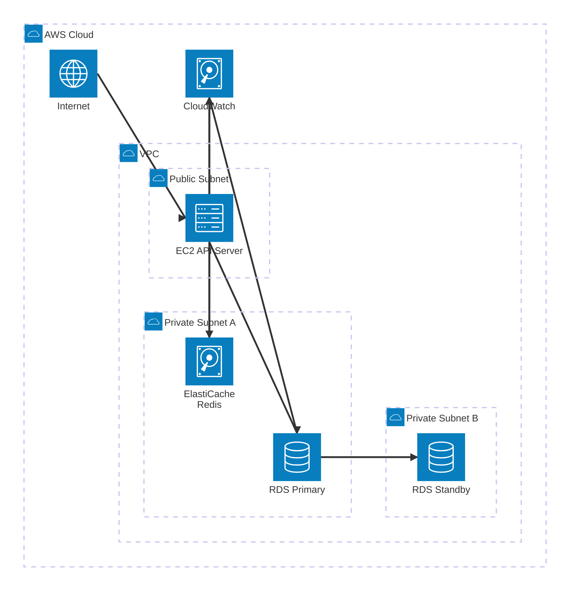

### 🔧 사용된 AWS 서비스

**데이터베이스**:
-  **Amazon RDS**: PostgreSQL Multi-AZ
-  **Amazon ElastiCache**: Redis 캐싱

**컴퓨팅 & 네트워킹**:
-  **Amazon EC2**: API 서버
-  **Amazon VPC**: 네트워크 격리

**모니터링**:
-  **Amazon CloudWatch**: 메트릭 및 알람

---

## 📚 Session 개요

### 📊 Session 학습 흐름

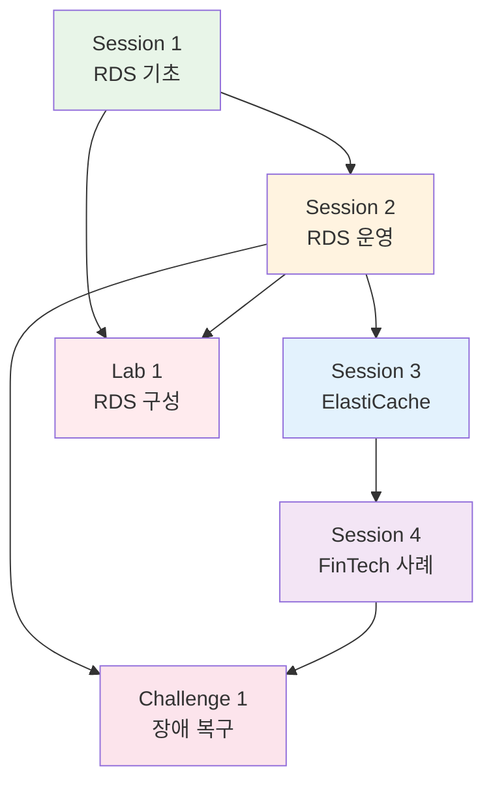

### Session 1: RDS 기초 (09:00-09:50)
**학습 내용**:
- RDS 아키텍처 및 엔진 선택
- Multi-AZ vs Read Replica
- 자동 백업 & 스냅샷
- RDS 보안 (암호화, IAM 인증)

**핵심 개념**:
- 관리형 데이터베이스의 장점
- 고가용성 구성 방법
- 백업 및 복구 전략

### 🔄 RDS Multi-AZ 동작 원리

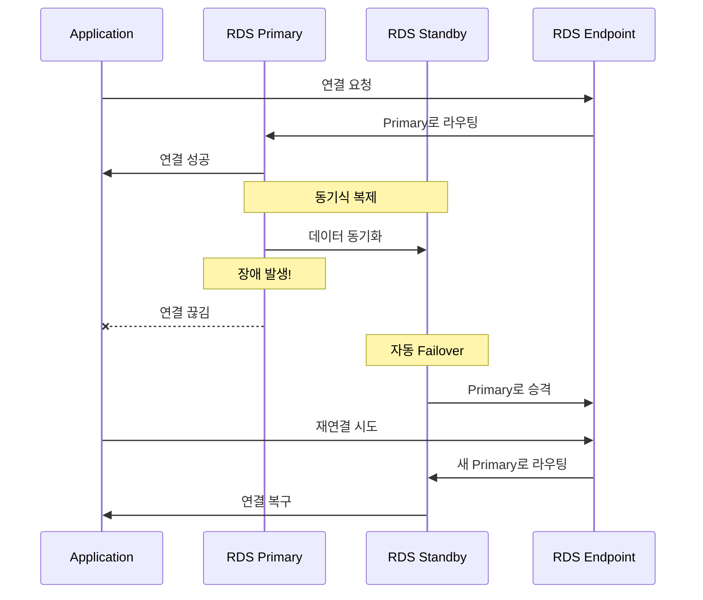

### Session 2: RDS 운영 (10:00-10:50)
**학습 내용**:
- RDS 모니터링 (CloudWatch)
- 성능 인사이트 (Performance Insights)
- 스케일링 전략
- 장애 복구 (Failover)

**핵심 개념**:
- 운영 메트릭 이해
- 성능 최적화 방법
- 장애 대응 절차

### 📊 RDS 모니터링 메트릭

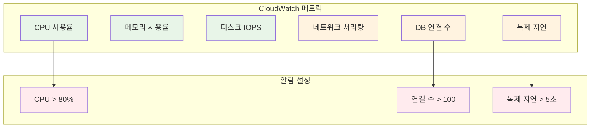

### Session 3: ElastiCache Redis (11:00-11:50)
**학습 내용**:
- Redis vs Memcached
- 캐싱 전략 (Cache-Aside, Write-Through)
- 클러스터 모드
- 데이터 영속성

**핵심 개념**:
- 캐싱의 필요성
- 캐싱 패턴 선택
- Redis 고급 기능

### 🔄 캐싱 패턴 비교

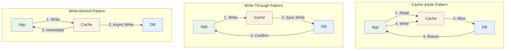

### Session 4: 고객 사례 - FinTech 플랫폼 (12:00-12:50)
**실무 아키텍처**:
- 간편 송금 서비스 (Stripe/PayPal 스타일)
- Node.js API + PostgreSQL + Redis
- 트랜잭션 무결성 보장
- 실시간 잔액 캐싱

**학습 포인트**:
- 금융 데이터 보안
- 트랜잭션 처리
- 고가용성 & 장애 복구
- 규정 준수 (PCI-DSS)

### 🏦 FinTech 아키텍처

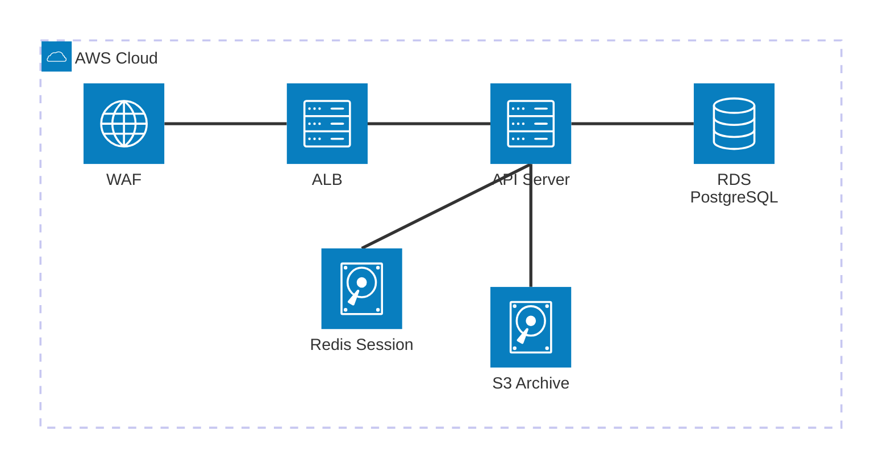

---

## 🛠️ Lab 개요

### 🔄 Lab 실습 흐름

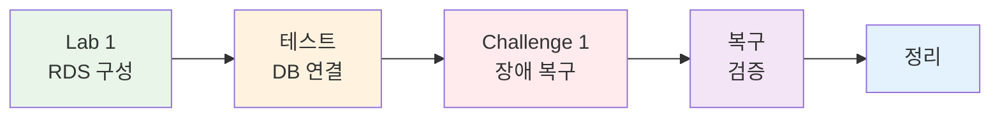

### Lab 1: RDS PostgreSQL 구성 (14:00-14:50)
**목표**: Multi-AZ RDS 구성 및 애플리케이션 연동

**구현 내용**:
1. RDS 인스턴스 생성 (db.t3.micro, Multi-AZ)
2. Security Group 구성
3. EC2에서 psql 연결
4. 테이블 생성 및 데이터 삽입
5. 애플리케이션 연동 테스트
6. 수동 스냅샷 생성

**예상 비용**: $0.20 (1시간 기준)

### 🔧 Lab 1 구성 단계

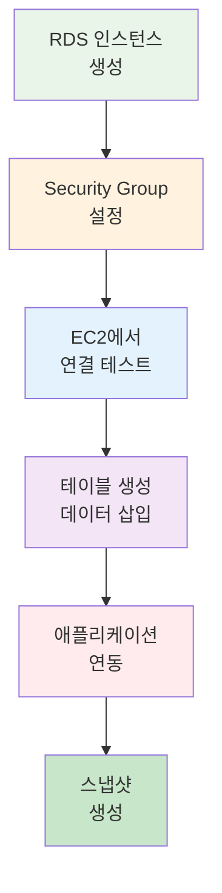

### Challenge 1: 데이터베이스 장애 복구 (15:00-15:50)
**목표**: RDS 장애 상황 대응 및 복구

**시나리오**:
1. **시나리오 1**: RDS Primary 장애 (Multi-AZ Failover)
2. **시나리오 2**: 잘못된 데이터 삭제 (스냅샷 복구)
3. **시나리오 3**: 성능 저하 (Read Replica 추가)
4. **시나리오 4**: 연결 실패 (Security Group 문제)

**학습 포인트**:
- 장애 상황 진단
- 신속한 복구 절차
- 데이터 무결성 보장
- 모니터링 및 알람

**예상 비용**: $0.30 (1시간 기준)

### 🚨 Challenge 1 장애 시나리오

```mermaid
graph TB
    subgraph "시나리오 1: Failover"
        A1[Primary 장애] --> A2[Standby 승격]
        A2 --> A3[DNS 업데이트]
        A3 --> A4[서비스 복구]
    end
    
    subgraph "시나리오 2: 데이터 복구"
        B1[데이터 삭제] --> B2[스냅샷 확인]
        B2 --> B3[새 인스턴스]
        B3 --> B4[데이터 복원]
    end
    
    subgraph "시나리오 3: 성능 개선"
        C1[느린 조회] --> C2[Read Replica]
        C2 --> C3[읽기 분산]
        C3 --> C4[성능 향상]
    end
    
    style A1 fill:#ffebee
    style A4 fill:#c8e6c9
    style B1 fill:#ffebee
    style B4 fill:#c8e6c9
    style C1 fill:#ffebee
    style C4 fill:#c8e6c9
```

---

## 💰 예상 비용

### 일일 비용 계산 (14명 기준)
| 리소스 | 사양 | 시간 | 단가 | 비용 |
|--------|------|------|------|------|
| RDS PostgreSQL | db.t3.micro Multi-AZ | 2시간 | $0.034/hour | $0.068 |
| RDS Read Replica | db.t3.micro | 1시간 | $0.017/hour | $0.017 |
| EC2 | t3.micro | 3시간 | $0.0104/hour | $0.031 |
| 데이터 전송 | 1GB | - | $0.09/GB | $0.09 |
| 스냅샷 스토리지 | 5GB | - | $0.095/GB-month | $0.016 |
| **합계** | | | | **$0.222** |

**학생당**: $0.222 × 14명 = **$3.11**

### 비용 절감 팁
- 프리티어 활용 (RDS 750시간/월)
- 실습 완료 후 즉시 삭제
- 스냅샷은 최소한으로 유지
- 데이터 전송 최소화

---

## 🔗 Day 1-2 연결

### 📊 학습 누적 효과

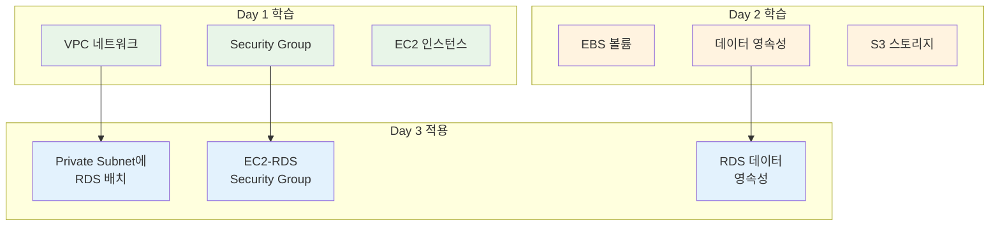

### Day 1에서 배운 내용
- VPC 네트워크 구성
- Public/Private Subnet 분리
- Security Group 설정
- EC2 인스턴스 생성

### Day 2에서 배운 내용
- EBS 볼륨 관리
- 데이터 영속성 전략
- S3 스토리지 활용
- CloudFront CDN

### Day 3에서 재사용
- **VPC**: Day 1에서 생성한 VPC 활용
- **Private Subnet**: DB를 Private Subnet에 배치
- **Security Group**: EC2 → RDS 통신 허용
- **데이터 영속성**: Day 2의 개념을 RDS에 적용

---

## 🎯 Day 3 학습 성과

### ✅ 기술적 성취
- [ ] RDS Multi-AZ 구성 완료
- [ ] ElastiCache Redis 구성 완료
- [ ] 애플리케이션 DB 연동 성공
- [ ] 캐싱 성능 개선 확인
- [ ] CloudWatch 모니터링 설정

### ✅ 실무 역량
- [ ] 관리형 DB 운영 능력
- [ ] 캐싱 전략 수립 능력
- [ ] 성능 최적화 경험
- [ ] 모니터링 및 알람 설정

---

## 🔗 Day 4 준비

### 🚀 다음 단계 로드맵

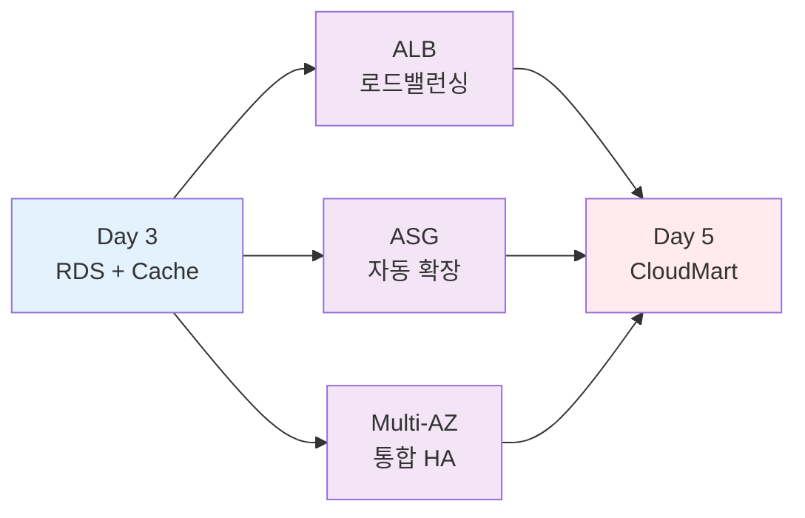

### 다음 학습 내용
- **ALB**: 로드 밸런서로 트래픽 분산
- **Auto Scaling**: 자동 확장으로 고가용성
- **Multi-AZ 통합**: 전체 시스템 고가용성

### 연결 포인트
- Day 3의 RDS Multi-AZ → Day 4의 전체 HA 아키텍처
- ElastiCache 세션 스토어 → ALB Sticky Session 대체
- CloudWatch 모니터링 → Auto Scaling 트리거

---

## 📚 참고 자료

### AWS 공식 문서
- [Amazon RDS 사용자 가이드](https://docs.aws.amazon.com/rds/)
- [Amazon ElastiCache 사용자 가이드](https://docs.aws.amazon.com/elasticache/)
- [RDS 요금](https://aws.amazon.com/rds/pricing/)
- [ElastiCache 요금](https://aws.amazon.com/elasticache/pricing/)

### 추가 학습 자료
- [RDS 베스트 프랙티스](https://docs.aws.amazon.com/AmazonRDS/latest/UserGuide/CHAP_BestPractices.html)
- [Redis 캐싱 패턴](https://redis.io/docs/manual/patterns/)
- [AWS Well-Architected Framework - 데이터베이스](https://docs.aws.amazon.com/wellarchitected/latest/framework/a-database.html)

---

**🗄️ 관리형 DB** • **⚡ 캐싱 최적화** • **📊 운영 모니터링**

*3-Tier 아키텍처로 프로덕션급 시스템 구축*

