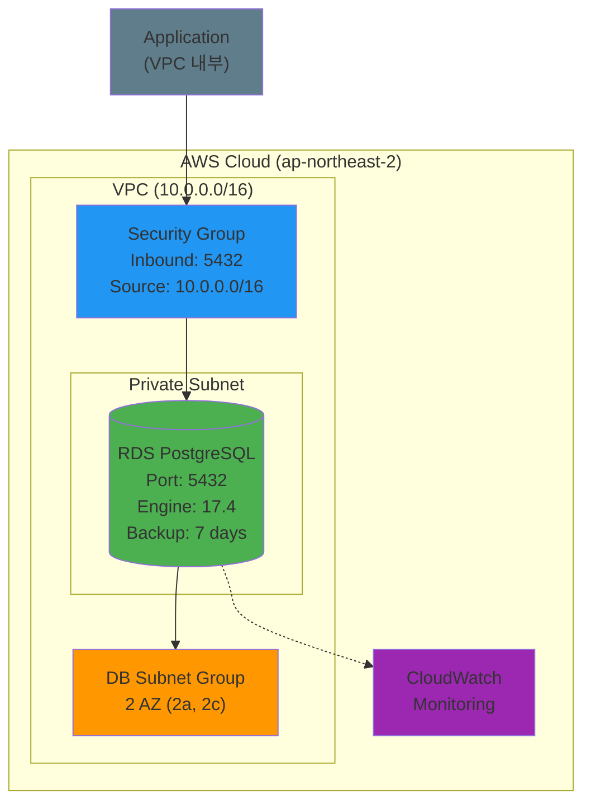

# Week 5 Day 3 Challenge 1: RDS 장애 진단 및 복구

<div align="center">

**🔍 문제 찾기** • **🔧 해결하기** • **📸 증명하기** • **🧹 정리하기**

*실무 디버깅 능력을 키우는 Challenge*

</div>

---

## 🕘 Challenge 정보
**시간**: 15:00-15:50 (50분)
**목표**: 장애 진단 및 해결 능력 향상
**방식**: AWS Web Console 중심 실습
**난이도**: ⭐⭐⭐

## 🎯 Challenge 목표
### 📚 학습 목표
- RDS 설정 오류 진단 능력
- Security Group 포트 설정 이해
- PostgreSQL 기본 지식 습득
- 백업 설정의 중요성 인식

### 🛠️ 실무 역량
- AWS Console 디버깅 능력
- 체계적 문제 해결 프로세스
- 장애 대응 및 복구 경험

---

## 🚨 Challenge 시나리오: "급하게 배포된 RDS"

### 📖 배경 상황
**시나리오**: 
FinTech 스타트업 "QuickPay"의 데이터베이스 담당자가 급하게 RDS를 배포했습니다.
하지만 애플리케이션에서 데이터베이스 연결이 되지 않습니다.

**긴급도**: 🔴 **Critical**
**영향도**: 💰 **High** (서비스 중단)
**제한시간**: ⏰ **50분**

**당신의 임무**:
1. 배포된 RDS의 문제점 찾기
2. 문제 수정하기
3. 정상 작동 증명하기
4. 스크린샷으로 결과 공유하기

---

## 🏗️ 목표 아키텍처

### 📐 정상 작동하는 아키텍처 (성공 기준)



**핵심 구성 요소**:
- **RDS PostgreSQL**: 지원되는 엔진 버전 (17.4)
- **Security Group**: PostgreSQL 포트 (5432) 오픈
- **DB Subnet Group**: 2개 AZ에 Private Subnet
- **백업 설정**: 최소 7일 보관
- **CloudWatch**: 자동 모니터링

💡 **힌트**: 위 다이어그램과 실제 배포된 환경을 비교해보세요!

---

## 🔧 Challenge 환경 배포

⚠️ **주의**: 다음 단계는 **의도적으로 문제가 있는 설정**입니다.

### Step 1: DB Subnet Group 생성 (5분)

**AWS Console 경로**:
```
AWS Console → RDS → Subnet groups → Create DB subnet group
```

**설정 값**:
| 항목 | 값 | 설명 |
|------|-----|------|
| Name | challenge-db-subnet | Subnet Group 이름 |
| Description | Challenge DB Subnet Group | 설명 |
| VPC | vpc-Test (vpc-04293bd03cad62813) | 기존 VPC 선택 |
| Availability Zones | ap-northeast-2a, ap-northeast-2c | 2개 AZ 선택 |
| Subnets | Private-Az-A, Private-Az-C | Private Subnet 선택 |

**이미지 자리**: DB Subnet Group 생성 화면

**✅ 검증**:
AWS Console에서 생성된 Subnet Group 확인

---

### Step 2: Security Group 생성 (10분)

**AWS Console 경로**:
```
AWS Console → EC2 → Security Groups → Create security group
```

**기본 설정**:
| 항목 | 값 |
|------|-----|
| Security group name | challenge-rds-sg |
| Description | Challenge RDS Security Group |
| VPC | vpc-Test (vpc-04293bd03cad62813) |

**이미지 자리**: Security Group 기본 설정

**⚠️ Inbound Rules (의도적 오류 포함)**:
| Type | Protocol | Port Range | Source | Description |
|------|----------|------------|--------|-------------|
| Custom TCP | TCP | **3306** | 10.0.0.0/16 | VPC internal access |

**이미지 자리**: Inbound Rules 설정 (잘못된 포트)

**💡 힌트**: PostgreSQL의 기본 포트는 무엇일까요?

**✅ 검증**:
AWS Console에서 생성된 Security Group 확인

---

### Step 3: RDS 인스턴스 생성 (15분)

**AWS Console 경로**:
```
AWS Console → RDS → Databases → Create database
```

#### 3-1. 엔진 옵션 (의도적 오류)

**이미지 자리**: 엔진 선택 화면

| 항목 | 값 |
|------|-----|
| Engine type | PostgreSQL |
| Engine Version | **PostgreSQL 11.22** ⚠️ |

**💡 힌트**: 이 버전이 아직 지원되나요?

#### 3-2. 템플릿 및 설정

| 항목 | 값 |
|------|-----|
| Templates | Free tier |
| DB instance identifier | challenge-postgres |
| Master username | postgres |
| Master password | Challenge2024! |
| Confirm password | Challenge2024! |

**이미지 자리**: 인스턴스 설정

#### 3-3. 인스턴스 크기

| 항목 | 값 |
|------|-----|
| DB instance class | db.t3.micro |

**이미지 자리**: 인스턴스 크기 선택

#### 3-4. 스토리지

| 항목 | 값 |
|------|-----|
| Storage type | General Purpose SSD (gp3) |
| Allocated storage | 20 GiB |

#### 3-5. 연결

| 항목 | 값 |
|------|-----|
| VPC | vpc-Test |
| DB subnet group | challenge-db-subnet |
| Public access | No |
| VPC security group | challenge-rds-sg |

**이미지 자리**: 연결 설정

#### 3-6. 백업 (의도적 오류)

| 항목 | 값 |
|------|-----|
| Enable automated backups | **Unchecked** ⚠️ |
| Backup retention period | **0 days** ⚠️ |

**이미지 자리**: 백업 설정 (비활성화)

**💡 힌트**: 프로덕션 환경에서 백업이 없다면?

#### 3-7. 생성 완료

**Create database** 버튼 클릭

**이미지 자리**: RDS 생성 진행 중

---

## 💡 힌트 (최소한의 가이드)

### 🔍 어디를 확인해야 할까요?

#### 1. 네트워크 설정
- Security Group의 포트 번호가 맞나요?
- PostgreSQL의 기본 포트는?
- VPC 내부에서 접근 가능한가요?

#### 2. 데이터베이스 설정
- 선택한 엔진 버전이 지원되나요?
- AWS RDS에서 사용 가능한 PostgreSQL 버전은?

#### 3. 백업 설정
- 프로덕션 환경에서 백업이 없다면?
- 최소 백업 보관 기간은?

**💡 Tip**: 
- AWS Console에서 RDS 인스턴스 상태를 확인하세요
- Security Group의 Inbound Rules를 자세히 보세요
- RDS 생성 시 경고 메시지가 있었나요?

---
## ✅ 성공 기준

### 📊 문제 진단 (20점)
- [ ] 네트워크 관련 설정 오류 발견
- [ ] 데이터베이스 엔진 관련 문제 발견
- [ ] 운영 관련 설정 문제 발견

### 🔧 문제 해결 (50점)
- [ ] 네트워크 설정 수정 완료
- [ ] 데이터베이스 설정 수정 완료
- [ ] 운영 설정 수정 완료
- [ ] RDS 상태 `available` 확인

### 📸 검증 및 제출 (30점)
- [ ] RDS 인스턴스 상태 스크린샷
- [ ] Security Group 설정 스크린샷
- [ ] RDS 상세 정보 스크린샷
- [ ] CloudWatch 메트릭 스크린샷

---

## 🔍 문제 해결 가이드

### 체계적 진단 방법
1. **증상 파악**: 무엇이 작동하지 않는가?
2. **로그 분석**: AWS Console에서 이벤트 확인
3. **설정 검증**: Security Group, RDS 설정 확인
4. **근본 원인**: 왜 이 문제가 발생했는가?
5. **해결 및 검증**: 수정 후 정상 작동 확인

---

## 📸 결과 제출

### 필수 스크린샷 (Discord 스레드에 업로드)

#### 1. RDS 인스턴스 상태
**AWS Console 경로**:
```
AWS Console → RDS → Databases → challenge-postgres
```

**확인 사항**:
- Status: `Available` ✅
- Engine: PostgreSQL
- Engine version: 지원되는 버전

**이미지 자리**: RDS 인스턴스 상태

---

#### 2. Security Group 설정
**AWS Console 경로**:
```
AWS Console → EC2 → Security Groups → challenge-rds-sg → Inbound rules
```

**확인 사항**:
- Type: PostgreSQL
- Port: **5432** ✅
- Source: 10.0.0.0/16

**이미지 자리**: Security Group Inbound Rules

---

#### 3. RDS 상세 정보
**AWS Console 경로**:
```
AWS Console → RDS → Databases → challenge-postgres → Configuration
```

**확인 사항**:
- Engine version: 지원되는 버전 ✅
- Backup retention period: 7 days 이상 ✅
- Multi-AZ: 설정 확인

**이미지 자리**: RDS Configuration

---

#### 4. CloudWatch 메트릭
**AWS Console 경로**:
```
AWS Console → RDS → Databases → challenge-postgres → Monitoring
```

**확인 사항**:
- CPU Utilization 그래프 표시
- Database Connections 그래프 표시
- 정상 메트릭 수집 중

**이미지 자리**: CloudWatch 메트릭

---

### Discord 제출 형식
```
[Week 5 Day 3 Challenge 1 완료]
이름: [본인 이름]
소요 시간: [XX분]

발견한 문제:
1. [발견한 문제 1]
2. [발견한 문제 2]
3. [발견한 문제 3]

해결 방법:
1. [간단한 설명]
2. [간단한 설명]
3. [간단한 설명]

[스크린샷 4장 첨부]
```

---

## 🧹 리소스 정리 (필수!)

⚠️ **중요**: Challenge 완료 후 **반드시** 리소스를 삭제하세요!

### 삭제 순서 (역순)

#### 1. RDS 인스턴스 삭제

**AWS Console 경로**:
```
AWS Console → RDS → Databases → challenge-postgres → Actions → Delete
```

**설정**:
- [ ] Create final snapshot: **Unchecked**
- [ ] I acknowledge...: **Checked**
- 입력: `delete me`

**이미지 자리**: RDS 삭제 확인

**CLI 명령어** (선택):
```bash
aws rds delete-db-instance \
  --db-instance-identifier challenge-postgres \
  --skip-final-snapshot \
  --region ap-northeast-2
```

**대기 시간**: 약 5-10분

---

#### 2. DB Subnet Group 삭제

**AWS Console 경로**:
```
AWS Console → RDS → Subnet groups → challenge-db-subnet → Delete
```

**이미지 자리**: DB Subnet Group 삭제 확인

---

#### 3. Security Group 삭제

**AWS Console 경로**:
```
AWS Console → EC2 → Security Groups → challenge-rds-sg → Actions → Delete security groups
```

**이미지 자리**: Security Group 삭제 확인

---

### ✅ 삭제 완료 확인

**AWS Console 확인**:
```
RDS → Databases: challenge-postgres 없음 ✅
RDS → Subnet groups: challenge-db-subnet 없음 ✅
EC2 → Security Groups: challenge-rds-sg 없음 ✅
```

**이미지 자리**: 모든 리소스 삭제 완료

---

## 💰 비용 주의

### 예상 비용
| 리소스 | 사용 시간 | 단가 | 예상 비용 |
|--------|----------|------|-----------|
| RDS db.t3.micro | 1시간 | $0.018/hour | $0.018 |
| 스토리지 (20GB) | 1시간 | $0.115/GB/month | $0.003 |
| **합계** | | | **$0.021** |

⚠️ **삭제하지 않으면**: 시간당 과금 계속 발생!

### 비용 확인
**AWS Console 경로**:
```
AWS Console → Cost Explorer → Cost & Usage
```

**이미지 자리**: 비용 확인

---

## 🎯 학습 포인트

### 이 Challenge를 통해 배우는 것

#### 기술적 역량
- RDS 설정 오류 진단 능력
- Security Group 포트 설정 이해
- PostgreSQL 기본 포트 지식 (5432)
- 백업 설정의 중요성
- AWS Console 디버깅 능력

#### 실무 역량
- 체계적 문제 해결 프로세스
- 장애 대응 및 복구 경험
- 문서화 및 커뮤니케이션
- 비용 관리 의식

#### 협업 역량
- Discord를 통한 결과 공유
- 동료 학습 및 피드백
- 문제 해결 경험 공유

---

## 💡 Challenge 회고

### 🤝 팀 회고 (15분)
1. **가장 어려웠던 문제**: 어떤 문제를 찾기 어려웠나요?
2. **효과적인 디버깅 방법**: 어떻게 문제를 찾았나요?
3. **실무 적용**: 실제 업무에서 비슷한 경험이 있나요?
4. **개선 아이디어**: 더 빠르게 해결하려면?

### 📊 학습 성과
- 문제 진단 능력 향상
- AWS Console 숙련도 증가
- 실무 장애 대응 경험
- 체계적 문제 해결 프로세스 습득

---

<div align="center">

**🔍 문제 찾기** • **🔧 해결하기** • **📸 증명하기** • **🧹 정리하기**

*실무 디버깅 능력을 키우는 Challenge*

</div>
