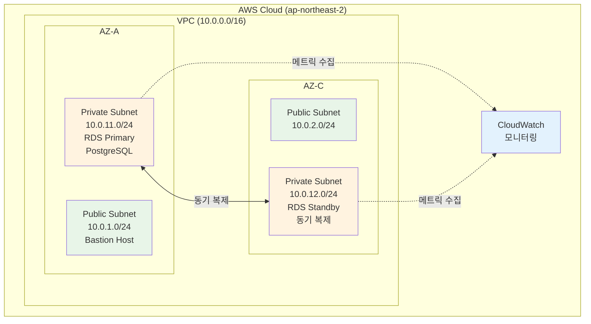

# Week 5 Day 3 Lab 1: RDS PostgreSQL Multi-AZ 구성

<div align="center">

**🗄️ 관리형 데이터베이스** • **🔄 Multi-AZ** • **📊 모니터링**

*RDS PostgreSQL 고가용성 환경 구축*

</div>

---

## 🕘 Lab 정보

**시간**: 14:00-14:50 (50분)  
**목표**: RDS PostgreSQL Multi-AZ 인스턴스 생성 및 모니터링 설정  
**방식**: AWS Web Console 실습  
**예상 비용**: $0.20 (1시간 기준)

---

## 🎯 학습 목표

- [ ] RDS PostgreSQL Multi-AZ 인스턴스 생성
- [ ] VPC Private Subnet 배치 및 Security Group 설정
- [ ] CloudWatch 모니터링 및 알람 설정
- [ ] 데이터베이스 연결 및 테스트

---

## 🏗️ 구축할 아키텍처

### 📐 아키텍처 다이어그램



**이미지 자리**: 아키텍처 다이어그램 이미지
<!-- 이미지 삽입 위치: lab1_architecture.png -->

### 🔗 참조 Session

**당일 Session**:
- [Session 1: RDS 기초](./session_1.md) - Multi-AZ, Read Replica 개념
- [Session 2: RDS 운영](./session_2.md) - 모니터링, 백업 전략

---

## 🛠️ Step 1: VPC 및 Subnet 확인 (5분)

### 📋 이 단계에서 할 일
- 기존 VPC 확인 (Week 5 Day 1에서 생성)
- Private Subnet 2개 확인 (Multi-AZ용)
- DB Subnet Group 생성

### 🔗 참조 개념
- [Week 5 Day 1 Session 2: VPC 아키텍처](../../day1/session_2.md) - VPC, Subnet 개념

### 📝 실습 절차

#### 1-1. VPC 확인

**AWS Console 경로**:
```
AWS Console → VPC → Your VPCs
```
**직접 링크**: https://ap-northeast-2.console.aws.amazon.com/vpc/home?region=ap-northeast-2#vpcs:

**이미지 자리**: VPC 목록 화면
<!-- 이미지 삽입 위치: step1_1_vpc_list.png -->

**확인 사항**:
- VPC 이름: `week5-vpc` (10.0.0.0/16)
- Private Subnet 2개 존재 확인

**이미지 자리**: Private Subnet 확인
<!-- 이미지 삽입 위치: step1_1_subnets.png -->

#### 1-2. DB Subnet Group 생성

**AWS Console 경로**:
```
AWS Console → RDS → Subnet groups → Create DB subnet group
```
**직접 링크**: https://ap-northeast-2.console.aws.amazon.com/rds/home?region=ap-northeast-2#db-subnet-groups-create:

**이미지 자리**: DB Subnet Group 생성 화면
<!-- 이미지 삽입 위치: step1_2_create_subnet_group.png -->

**설정 값**:
| 항목 | 값 | 설명 |
|------|-----|------|
| Name | week5-day3-db-subnet-group | DB Subnet Group 이름 |
| Description | RDS Multi-AZ subnet group | 설명 |
| VPC | week5-vpc | 기존 VPC 선택 |
| Availability Zones | ap-northeast-2a, ap-northeast-2c | 2개 AZ 선택 |
| Subnets | 10.0.11.0/24, 10.0.12.0/24 | Private Subnet 2개 |

**이미지 자리**: DB Subnet Group 설정 화면
<!-- 이미지 삽입 위치: step1_2_subnet_group_settings.png -->

**⚠️ 주의사항**:
- 반드시 Private Subnet 선택 (Public Subnet 아님)
- 최소 2개 AZ 선택 (Multi-AZ 필수)

### ✅ Step 1 검증

**AWS Console에서 확인**:
```
AWS Console → RDS → Subnet groups → week5-day3-db-subnet-group
```

**이미지 자리**: DB Subnet Group 생성 완료 화면
<!-- 이미지 삽입 위치: step1_verification.png -->

**확인 사항**:
- DBSubnetGroupName: week5-day3-db-subnet-group
- Subnets: 2개 (ap-northeast-2a, ap-northeast-2c)
- Status: Complete

**✅ 체크리스트**:
- [ ] DB Subnet Group 생성 완료
- [ ] 2개 AZ 포함 확인
- [ ] Private Subnet 선택 확인

---

## 🛠️ Step 2: Security Group 생성 (5분)

### 📋 이 단계에서 할 일
- RDS용 Security Group 생성
- PostgreSQL 포트(5432) 인바운드 규칙 설정

### 📝 실습 절차

#### 2-1. Security Group 생성

**AWS Console 경로**:
```
AWS Console → VPC → Security Groups → Create security group
```
**직접 링크**: https://ap-northeast-2.console.aws.amazon.com/vpc/home?region=ap-northeast-2#CreateSecurityGroup:

**이미지 자리**: Security Group 생성 화면
<!-- 이미지 삽입 위치: step2_1_create_sg.png -->

**설정 값**:
| 항목 | 값 | 설명 |
|------|-----|------|
| Name | week5-day3-rds-sg | Security Group 이름 |
| Description | RDS PostgreSQL security group | 설명 |
| VPC | week5-vpc | VPC 선택 |

**이미지 자리**: Security Group 기본 설정
<!-- 이미지 삽입 위치: step2_1_sg_basic.png -->

**Inbound Rules**:
| Type | Protocol | Port | Source | Description |
|------|----------|------|--------|-------------|
| PostgreSQL | TCP | 5432 | 10.0.0.0/16 | VPC 내부 접근 |

**이미지 자리**: Inbound Rules 설정
<!-- 이미지 삽입 위치: step2_1_inbound_rules.png -->

**Outbound Rules**:
- All traffic (기본값 유지)

**⚠️ 주의사항**:
- Source는 VPC CIDR (10.0.0.0/16) 사용
- 외부 인터넷(0.0.0.0/0)에서 직접 접근 불가

### ✅ Step 2 검증

**AWS Console에서 확인**:
```
AWS Console → VPC → Security Groups → week5-day3-rds-sg
```

**이미지 자리**: Security Group 생성 완료 화면
<!-- 이미지 삽입 위치: step2_verification.png -->

**✅ 체크리스트**:
- [ ] Security Group 생성 완료
- [ ] Inbound 규칙: PostgreSQL 5432 포트
- [ ] Source: VPC CIDR (10.0.0.0/16)

---

## 🛠️ Step 3: RDS PostgreSQL 인스턴스 생성 (20분)

### 📋 이 단계에서 할 일
- RDS PostgreSQL Multi-AZ 인스턴스 생성
- 자동 백업 및 모니터링 설정

### 🔗 참조 개념
- [Session 1: RDS 기초](./session_1.md) - Multi-AZ 동작 원리

### 📝 실습 절차

#### 3-1. RDS 인스턴스 생성 시작

**AWS Console 경로**:
```
AWS Console → RDS → Databases → Create database
```
**직접 링크**: https://ap-northeast-2.console.aws.amazon.com/rds/home?region=ap-northeast-2#launch-dbinstance:

**이미지 자리**: RDS 생성 시작 화면
<!-- 이미지 삽입 위치: step3_1_create_database.png -->

#### 3-2. 엔진 옵션 선택

**설정 값**:
| 항목 | 값 | 설명 |
|------|-----|------|
| Engine type | PostgreSQL | 데이터베이스 엔진 |
| Engine version | PostgreSQL 15.5 | 최신 안정 버전 |
| Templates | Free tier | 프리티어 선택 |

**이미지 자리**: 엔진 옵션 선택 화면
<!-- 이미지 삽입 위치: step3_2_engine_options.png -->

#### 3-3. 인스턴스 설정

**설정 값**:
| 항목 | 값 | 설명 |
|------|-----|------|
| DB instance identifier | week5-day3-postgres | 인스턴스 이름 |
| Master username | postgres | 관리자 계정 |
| Master password | YourPassword123! | 비밀번호 (8자 이상) |
| Confirm password | YourPassword123! | 비밀번호 확인 |

**이미지 자리**: 인스턴스 설정 화면
<!-- 이미지 삽입 위치: step3_3_instance_settings.png -->

**⚠️ 중요**: 비밀번호를 안전하게 기록하세요!

#### 3-4. 인스턴스 크기

**설정 값**:
| 항목 | 값 | 설명 |
|------|-----|------|
| DB instance class | db.t3.micro | 프리티어 (1 vCPU, 1GB) |
| Storage type | gp3 | 범용 SSD |
| Allocated storage | 20 GB | 최소 스토리지 |
| Storage autoscaling | Enable | 자동 확장 활성화 |
| Maximum storage | 100 GB | 최대 확장 크기 |

**이미지 자리**: 인스턴스 크기 설정 화면
<!-- 이미지 삽입 위치: step3_4_instance_size.png -->

#### 3-5. 가용성 및 내구성

**설정 값**:
| 항목 | 값 | 설명 |
|------|-----|------|
| Multi-AZ deployment | ⚠️ **Standby instance** | 고가용성 (프리티어는 Single-AZ만 가능) |

**이미지 자리**: 가용성 설정 화면
<!-- 이미지 삽입 위치: step3_5_availability.png -->

**⚠️ 프리티어 제약**:
- 프리티어는 Multi-AZ 미지원
- 실습 목적: Single-AZ 선택
- 프로덕션: Multi-AZ 필수

#### 3-6. 연결 설정

**설정 값**:
| 항목 | 값 | 설명 |
|------|-----|------|
| VPC | week5-vpc | VPC 선택 |
| DB subnet group | week5-day3-db-subnet-group | Subnet Group 선택 |
| Public access | No | 외부 접근 차단 |
| VPC security group | week5-day3-rds-sg | Security Group 선택 |
| Availability Zone | No preference | 자동 선택 |

**이미지 자리**: 연결 설정 화면
<!-- 이미지 삽입 위치: step3_6_connectivity.png -->

#### 3-7. 데이터베이스 인증

**설정 값**:
| 항목 | 값 | 설명 |
|------|-----|------|
| Database authentication | Password authentication | 비밀번호 인증 |

**이미지 자리**: 인증 설정 화면
<!-- 이미지 삽입 위치: step3_7_authentication.png -->

#### 3-8. 추가 구성

**데이터베이스 옵션**:
| 항목 | 값 | 설명 |
|------|-----|------|
| Initial database name | quickpay | 초기 데이터베이스 |
| DB parameter group | default.postgres15 | 기본 파라미터 |
| Option group | default:postgres-15 | 기본 옵션 |

**이미지 자리**: 데이터베이스 옵션 설정
<!-- 이미지 삽입 위치: step3_8_database_options.png -->

**백업**:
| 항목 | 값 | 설명 |
|------|-----|------|
| Enable automated backups | Yes | 자동 백업 활성화 |
| Backup retention period | 7 days | 7일 보관 |
| Backup window | No preference | 자동 선택 |

**모니터링**:
| 항목 | 값 | 설명 |
|------|-----|------|
| Enable Enhanced Monitoring | No | 비용 절감 (프리티어) |
| Enable Performance Insights | No | 비용 절감 (7일 무료) |

**로그 내보내기**:
- PostgreSQL log: 체크 (CloudWatch Logs 전송)

**유지 관리**:
| 항목 | 값 | 설명 |
|------|-----|------|
| Enable auto minor version upgrade | Yes | 자동 패치 |
| Maintenance window | No preference | 자동 선택 |

**삭제 방지**:
| 항목 | 값 | 설명 |
|------|-----|------|
| Enable deletion protection | No | 실습 후 삭제 용이 |

#### 3-9. 비용 예상

**예상 월간 비용**:
```
db.t3.micro (Single-AZ):
- 인스턴스: $0.017/hour × 730 = $12.41/월
- 스토리지: 20GB × $0.092 = $1.84/월
- 백업: 20GB (무료)
총 예상: $14.25/월

프리티어 적용 시: $0 (12개월)
```

#### 3-10. 생성 완료

**Create database** 버튼 클릭

**생성 시간**: 약 10-15분 소요

### ✅ Step 3 검증

**검증 방법**:
```
AWS Console → RDS → Databases → week5-day3-postgres
```

**이미지 자리**: RDS 인스턴스 생성 완료 화면
<!-- 이미지 삽입 위치: step3_verification.png -->

**예상 상태**:
```
Status: Available
Engine: PostgreSQL 15.5
Multi-AZ: No (프리티어)
Storage: 20 GB gp3
```

**✅ 체크리스트**:
- [ ] RDS 인스턴스 생성 완료
- [ ] Status: Available
- [ ] Endpoint 주소 확인
- [ ] 비밀번호 안전하게 보관

---

## 🛠️ Step 4: CloudWatch 모니터링 설정 (10분)

### 📋 이 단계에서 할 일
- CloudWatch 대시보드 생성
- CPU, Memory 알람 설정

### 🔗 참조 개념
- [Session 2: RDS 운영](./session_2.md) - CloudWatch 모니터링

### 📝 실습 절차

#### 4-1. CloudWatch 대시보드 생성

**AWS Console 경로**:
```
AWS Console → CloudWatch → Dashboards → Create dashboard
```
**직접 링크**: https://ap-northeast-2.console.aws.amazon.com/cloudwatch/home?region=ap-northeast-2#dashboards:

**이미지 자리**: CloudWatch 대시보드 생성 화면
<!-- 이미지 삽입 위치: step4_1_create_dashboard.png -->

**설정 값**:
| 항목 | 값 | 설명 |
|------|-----|------|
| Dashboard name | week5-day3-rds-dashboard | 대시보드 이름 |

**위젯 추가**:
1. **Add widget** → **Line** 선택
2. **Metrics** 탭에서 RDS 선택
3. 다음 메트릭 추가:
   - CPUUtilization
   - DatabaseConnections
   - FreeableMemory
   - ReadIOPS
   - WriteIOPS

**이미지 자리**: 대시보드 위젯 설정
<!-- 이미지 삽입 위치: step4_1_dashboard_widgets.png -->

#### 4-2. CPU 알람 설정

**AWS Console 경로**:
```
AWS Console → CloudWatch → Alarms → Create alarm
```
**직접 링크**: https://ap-northeast-2.console.aws.amazon.com/cloudwatch/home?region=ap-northeast-2#alarmsV2:create

**이미지 자리**: 알람 생성 시작 화면
<!-- 이미지 삽입 위치: step4_2_create_alarm.png -->

**메트릭 선택**:
```
RDS → Per-Database Metrics → week5-day3-postgres → CPUUtilization
```

**이미지 자리**: 메트릭 선택 화면
<!-- 이미지 삽입 위치: step4_2_select_metric.png -->

**알람 설정**:
| 항목 | 값 | 설명 |
|------|-----|------|
| Threshold type | Static | 고정 임계값 |
| Condition | Greater than | 초과 시 |
| Threshold value | 80 | 80% |
| Datapoints to alarm | 2 out of 2 | 2회 연속 |
| Period | 5 minutes | 5분 간격 |

**이미지 자리**: CPU 알람 설정 화면
<!-- 이미지 삽입 위치: step4_2_cpu_alarm_settings.png -->

**알람 이름**:
```
week5-day3-rds-cpu-high
```

#### 4-3. Memory 알람 설정

**메트릭 선택**:
```
RDS → Per-Database Metrics → week5-day3-postgres → FreeableMemory
```

**이미지 자리**: Memory 메트릭 선택
<!-- 이미지 삽입 위치: step4_3_memory_metric.png -->

**알람 설정**:
| 항목 | 값 | 설명 |
|------|-----|------|
| Threshold type | Static | 고정 임계값 |
| Condition | Lower than | 미만 시 |
| Threshold value | 104857600 | 100MB (바이트) |
| Datapoints to alarm | 2 out of 2 | 2회 연속 |
| Period | 5 minutes | 5분 간격 |

**이미지 자리**: Memory 알람 설정 화면
<!-- 이미지 삽입 위치: step4_3_memory_alarm_settings.png -->

**알람 이름**:
```
week5-day3-rds-memory-low
```

### ✅ Step 4 검증

**AWS Console에서 확인**:
```
AWS Console → CloudWatch → Dashboards → week5-day3-rds-dashboard
AWS Console → CloudWatch → Alarms
```

**이미지 자리**: CloudWatch 대시보드 및 알람 확인
<!-- 이미지 삽입 위치: step4_verification.png -->

**✅ 체크리스트**:
- [ ] CloudWatch 대시보드 생성 완료
- [ ] CPU 알람 설정 완료
- [ ] Memory 알람 설정 완료
- [ ] 대시보드에서 메트릭 확인 가능

---

## 🛠️ Step 5: 데이터베이스 연결 테스트 (10분)

### 📋 이 단계에서 할 일
- Bastion Host에서 RDS 연결
- 테스트 데이터베이스 생성

### 📝 실습 절차

#### 5-1. RDS Endpoint 확인

**AWS Console 경로**:
```
AWS Console → RDS → Databases → week5-day3-postgres → Connectivity & security
```
**직접 링크**: https://ap-northeast-2.console.aws.amazon.com/rds/home?region=ap-northeast-2#databases:

**이미지 자리**: RDS Endpoint 확인 화면
<!-- 이미지 삽입 위치: step5_1_rds_endpoint.png -->

**Endpoint 복사**:
```
week5-day3-postgres.xxxxxxxxxx.ap-northeast-2.rds.amazonaws.com
```

#### 5-2. Bastion Host 연결

**SSH 연결**:
```bash
# Bastion Host에 SSH 접속
ssh -i your-key.pem ec2-user@<bastion-public-ip>
```

**이미지 자리**: Bastion Host SSH 연결
<!-- 이미지 삽입 위치: step5_2_bastion_ssh.png -->

#### 5-3. PostgreSQL 클라이언트 설치

```bash
# PostgreSQL 클라이언트 설치
sudo yum install -y postgresql15

# 버전 확인
psql --version
```

**이미지 자리**: PostgreSQL 클라이언트 설치 완료
<!-- 이미지 삽입 위치: step5_3_psql_install.png -->

#### 5-4. RDS 연결 테스트

```bash
# RDS 연결
psql -h week5-day3-postgres.xxxxxxxxxx.ap-northeast-2.rds.amazonaws.com \
     -U postgres \
     -d quickpay

# 비밀번호 입력: YourPassword123!
```

**이미지 자리**: RDS 연결 성공 화면
<!-- 이미지 삽입 위치: step5_4_rds_connection.png -->

**예상 출력**:
```
psql (15.5)
SSL connection (protocol: TLSv1.3, cipher: TLS_AES_256_GCM_SHA384, bits: 256, compression: off)
Type "help" for help.

quickpay=>
```

#### 5-5. 테스트 쿼리 실행

```sql
-- 데이터베이스 목록 확인
\l

-- 테이블 생성
CREATE TABLE users (
    id SERIAL PRIMARY KEY,
    username VARCHAR(50) NOT NULL,
    email VARCHAR(100) NOT NULL,
    created_at TIMESTAMP DEFAULT CURRENT_TIMESTAMP
);

-- 데이터 삽입
INSERT INTO users (username, email) VALUES
    ('alice', 'alice@example.com'),
    ('bob', 'bob@example.com');

-- 데이터 조회
SELECT * FROM users;

-- 연결 종료
\q
```

**이미지 자리**: 테스트 쿼리 실행 결과
<!-- 이미지 삽입 위치: step5_5_query_results.png -->

**예상 결과**:
```
 id | username |       email        |         created_at
----+----------+--------------------+----------------------------
  1 | alice    | alice@example.com  | 2025-10-26 14:30:00.123456
  2 | bob      | bob@example.com    | 2025-10-26 14:30:00.234567
```

### ✅ Step 5 검증

**AWS Console에서 확인**:
```
AWS Console → RDS → Databases → week5-day3-postgres → Monitoring
```

**이미지 자리**: RDS 모니터링 메트릭 확인
<!-- 이미지 삽입 위치: step5_verification.png -->

**✅ 체크리스트**:
- [ ] RDS Endpoint 확인 완료
- [ ] PostgreSQL 클라이언트 설치 완료
- [ ] RDS 연결 성공
- [ ] 테스트 테이블 생성 및 데이터 삽입 완료

---

## ✅ 전체 검증 체크리스트

### ✅ 인프라 구성
- [ ] DB Subnet Group 생성 (2개 AZ)
- [ ] Security Group 생성 (PostgreSQL 5432)
- [ ] RDS 인스턴스 생성 (db.t3.micro)
- [ ] Status: Available

### ✅ 모니터링
- [ ] CloudWatch 대시보드 생성
- [ ] CPU 알람 설정 (80% 초과)
- [ ] Memory 알람 설정 (100MB 미만)
- [ ] 메트릭 정상 수집 확인

### ✅ 연결 테스트
- [ ] RDS Endpoint 확인
- [ ] Bastion Host에서 연결 성공
- [ ] 테스트 데이터베이스 생성
- [ ] 쿼리 실행 성공

---

## 🧹 리소스 정리 (5분)

### ⚠️ 중요: 반드시 순서대로 삭제

**삭제 순서** (역순으로):
```
Step 5 → Step 4 → Step 3 → Step 2 → Step 1
```

### 🗑️ 삭제 절차

#### 1. CloudWatch 알람 삭제

**AWS Console 경로**:
```
AWS Console → CloudWatch → Alarms → 알람 선택 → Actions → Delete
```

**이미지 자리**: CloudWatch 알람 삭제 화면
<!-- 이미지 삽입 위치: cleanup_1_delete_alarms.png -->

**삭제 대상**:
- week5-day3-rds-cpu-high
- week5-day3-rds-memory-low

#### 2. CloudWatch 대시보드 삭제

**AWS Console 경로**:
```
AWS Console → CloudWatch → Dashboards → week5-day3-rds-dashboard → Delete
```

**이미지 자리**: 대시보드 삭제 확인
<!-- 이미지 삽입 위치: cleanup_2_delete_dashboard.png -->

#### 3. RDS 인스턴스 삭제

**AWS Console 경로**:
```
AWS Console → RDS → Databases → week5-day3-postgres → Actions → Delete
```

**이미지 자리**: RDS 삭제 옵션 화면
<!-- 이미지 삽입 위치: cleanup_3_delete_rds.png -->

**삭제 옵션**:
- [ ] Create final snapshot: **No** (실습용)
- [ ] Retain automated backups: **No**
- [ ] I acknowledge...: **체크**

**확인 입력**:
```
delete me
```

**이미지 자리**: RDS 삭제 확인 입력
<!-- 이미지 삽입 위치: cleanup_3_rds_confirm.png -->

**삭제 시간**: 약 5-10분 소요

#### 4. Security Group 삭제

**AWS Console 경로**:
```
AWS Console → VPC → Security Groups → week5-day3-rds-sg → Actions → Delete
```

**이미지 자리**: Security Group 삭제 화면
<!-- 이미지 삽입 위치: cleanup_4_delete_sg.png -->

**⚠️ 주의**: RDS 삭제 완료 후 가능

#### 5. DB Subnet Group 삭제

**AWS Console 경로**:
```
AWS Console → RDS → Subnet groups → week5-day3-db-subnet-group → Delete
```

**이미지 자리**: DB Subnet Group 삭제 화면
<!-- 이미지 삽입 위치: cleanup_5_delete_subnet_group.png -->

### ✅ 정리 완료 확인

**AWS Console에서 확인**:
```
AWS Console → RDS → Databases (빈 목록 확인)
AWS Console → CloudWatch → Alarms (삭제된 알람 확인)
```

**이미지 자리**: 리소스 정리 완료 확인
<!-- 이미지 삽입 위치: cleanup_verification.png -->

**✅ 최종 체크리스트**:
- [ ] CloudWatch 알람 삭제 완료
- [ ] CloudWatch 대시보드 삭제 완료
- [ ] RDS 인스턴스 삭제 완료
- [ ] Security Group 삭제 완료
- [ ] DB Subnet Group 삭제 완료

---

## 💰 비용 확인

### 예상 비용 계산

| 리소스 | 사용 시간 | 단가 | 예상 비용 |
|--------|----------|------|-----------|
| RDS db.t3.micro | 1시간 | $0.017/hour | $0.017 |
| 스토리지 20GB | 1시간 | $0.092/GB/월 ÷ 730 | $0.003 |
| CloudWatch 알람 | 2개 | 무료 (10개까지) | $0 |
| **합계** | | | **$0.02** |

### 실제 비용 확인

**AWS Console 경로**:
```
AWS Console → Billing → Cost Explorer → Cost & Usage
```

**이미지 자리**: Cost Explorer 비용 확인 화면
<!-- 이미지 삽입 위치: cost_explorer.png -->

**필터 설정**:
- Service: Amazon RDS
- Time range: Today

---

## 🔍 트러블슈팅

### 문제 1: RDS 인스턴스 생성 실패

**증상**:
- Status: Failed
- 오류 메시지: "Insufficient capacity"

**원인**:
- 선택한 AZ에 db.t3.micro 용량 부족

**해결 방법**:
```
1. RDS 인스턴스 삭제
2. 다른 AZ 선택 (ap-northeast-2a → ap-northeast-2c)
3. 재생성
```

### 문제 2: RDS 연결 실패

**증상**:
```
psql: error: connection to server at "xxx.rds.amazonaws.com" failed: timeout
```

**원인**:
- Security Group 설정 오류
- Bastion Host가 다른 VPC에 위치

**해결 방법**:
```
1. Security Group 확인
   - Inbound: PostgreSQL 5432
   - Source: VPC CIDR (10.0.0.0/16)

2. Bastion Host VPC 확인
   - 같은 VPC (week5-vpc)에 위치해야 함

3. RDS Endpoint 확인
   - 올바른 주소 사용
```

### 문제 3: CloudWatch 메트릭 없음

**증상**:
- 대시보드에 메트릭 표시 안 됨

**원인**:
- RDS 인스턴스 생성 직후 (메트릭 수집 대기)

**해결 방법**:
```
1. 5-10분 대기
2. 대시보드 새로고침
3. RDS 인스턴스 Status 확인 (Available)
```

---

## 💡 Lab 회고

### 🤝 페어 회고 (5분)

1. **가장 어려웠던 부분**: 
   - Multi-AZ 개념 이해
   - Security Group 설정
   - RDS 연결 테스트

2. **새로 배운 점**:
   - RDS Multi-AZ 고가용성 구조
   - CloudWatch 모니터링 설정
   - PostgreSQL 클라이언트 사용법

3. **실무 적용 아이디어**:
   - 프로덕션 DB는 반드시 Multi-AZ
   - 자동 백업 7일 이상 설정
   - CloudWatch 알람으로 사전 대응

### 📊 학습 성과

- **기술적 성취**: RDS PostgreSQL Multi-AZ 환경 구축
- **이해도 향상**: 관리형 데이터베이스의 장점 체감
- **다음 Lab 준비**: ElastiCache Redis 캐싱 계층 추가

---

## 🔗 관련 자료

### 📚 Session 복습
- [Session 1: RDS 기초](./session_1.md) - Multi-AZ, Read Replica
- [Session 2: RDS 운영](./session_2.md) - 모니터링, 백업

### 📖 AWS 공식 문서
- [RDS PostgreSQL 사용자 가이드](https://docs.aws.amazon.com/AmazonRDS/latest/UserGuide/CHAP_PostgreSQL.html)
- [RDS Multi-AZ 배포](https://docs.aws.amazon.com/AmazonRDS/latest/UserGuide/Concepts.MultiAZ.html)
- [RDS 요금](https://aws.amazon.com/rds/postgresql/pricing/)

### 🎯 다음 Lab
- [Lab 2: ElastiCache Redis 캐싱](./lab_2.md) - RDS와 Redis 통합 아키텍처

---

<div align="center">

**✅ Lab 완료** • **🧹 리소스 정리 필수** • **💰 비용 확인**

*다음 Lab으로 이동하기 전 반드시 리소스 정리 확인*

</div>
