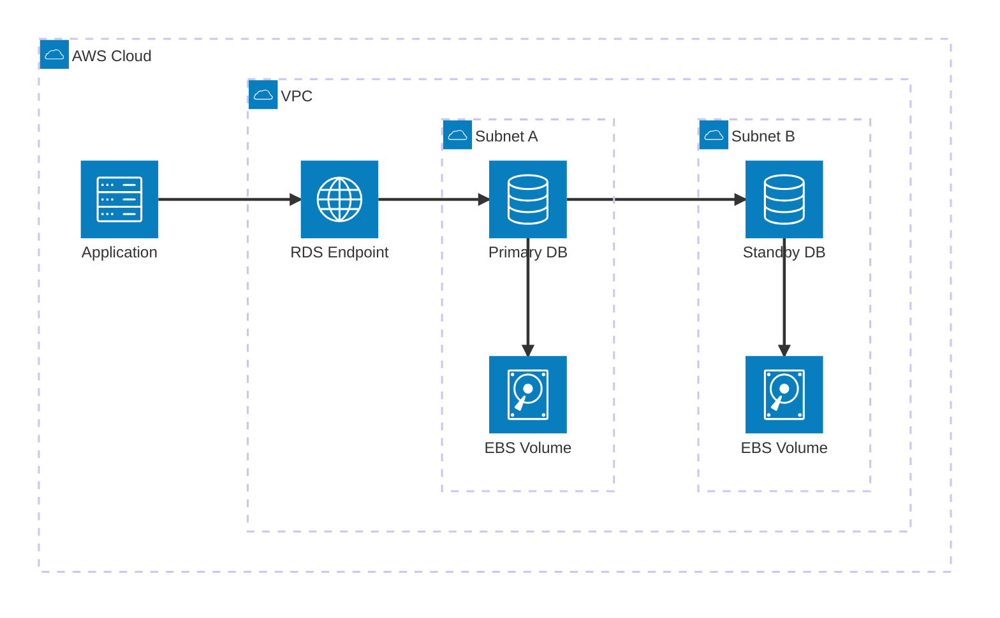
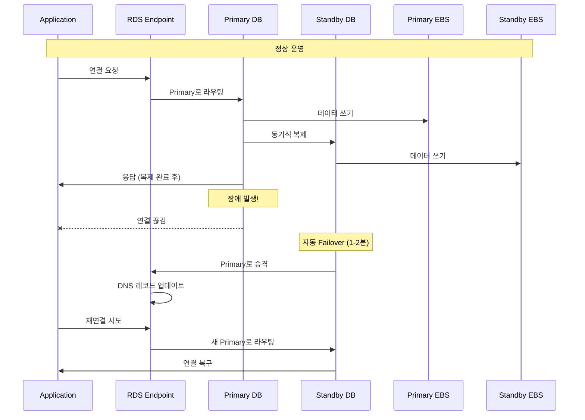
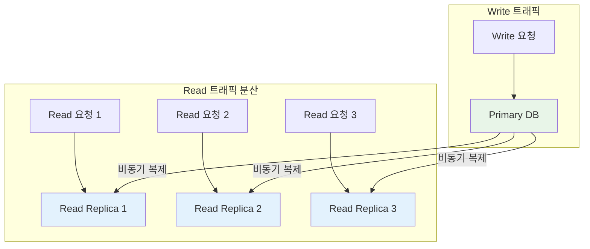

# Week 5 Day 3 Session 1: RDS 기초

<div align="center">

**🗄️ 관리형 데이터베이스** • **🔄 Multi-AZ** • **📖 Read Replica**

*AWS RDS로 데이터베이스 운영 자동화*

</div>

---

## 🕘 Session 정보

**시간**: 09:00-09:50 (50분)  
**목표**: RDS 아키텍처 이해 및 고가용성 구성 방법 학습  
**방식**: 이론 학습 + 실습 준비

---

## 🎯 학습 목표

- **RDS 개념**: 관리형 데이터베이스의 장점과 특징 이해
- **Multi-AZ**: 고가용성 구성 원리 및 Failover 메커니즘
- **Read Replica**: 읽기 성능 확장 전략
- **보안**: 암호화, IAM 인증, 네트워크 격리

---

## 📖 서비스 개요

### 1. 생성 배경 (Why?)

#### 어떤 문제를 해결하기 위해 만들어졌는가?

**온프레미스 데이터베이스의 문제점**:
- 하드웨어 구매 및 설치에 수개월 소요
- 패치, 백업, 복구 등 수동 관리 부담
- 고가용성 구성의 복잡성 (Primary-Standby 설정)
- 확장 시 다운타임 발생
- 전문 DBA 인력 필요

**EC2에 직접 DB 설치의 한계**:
- 백업 자동화 직접 구현 필요
- OS 패치 및 DB 업그레이드 수동 관리
- Multi-AZ 구성 복잡 (복제 설정, Failover 스크립트)
- 모니터링 시스템 별도 구축

**AWS RDS 솔루션**:
- 클릭 몇 번으로 DB 인스턴스 생성 (5-10분)
- 자동 백업, 패치, 모니터링
- Multi-AZ 고가용성 자동 구성
- Read Replica로 읽기 성능 확장
- 관리 부담 80% 감소

### 2. 핵심 원리 (How?)

#### RDS 아키텍처



#### Multi-AZ 동작 원리



#### Read Replica 아키텍처



### 3. 주요 사용 사례 (When?)

#### 적합한 워크로드

**웹 애플리케이션**:
- 사용자 데이터, 세션 정보 저장
- 트랜잭션 처리 (주문, 결제)
- 예: WordPress, Django, Rails 애플리케이션

**모바일 백엔드**:
- 사용자 프로필, 앱 데이터
- 푸시 알림 메타데이터
- 예: 소셜 미디어 앱, 게임 서버

**E-Commerce**:
- 상품 카탈로그, 재고 관리
- 주문 및 결제 트랜잭션
- 예: 쇼핑몰, 예약 시스템

**SaaS 애플리케이스**:
- 멀티 테넌트 데이터
- 사용자별 격리된 데이터
- 예: CRM, ERP 시스템

#### 실제 업계 활용 사례

**Airbnb**:
- 수백 개의 RDS 인스턴스 운영
- Multi-AZ로 99.95% 가용성 달성
- Read Replica로 검색 성능 10배 향상

**Samsung**:
- 글로벌 서비스를 위한 리전별 RDS 배포
- 자동 백업으로 데이터 손실 제로
- 관리 비용 70% 절감

**Expedia**:
- 수천만 건의 예약 데이터 처리
- Multi-AZ로 장애 시 자동 복구
- Read Replica로 보고서 생성 부하 분산

### 4. 비슷한 서비스 비교 (Which?)

#### AWS 내 대안 서비스

**RDS vs EC2에 직접 DB 설치**:

| 기준 | RDS | EC2 + DB |
|------|-----|----------|
| **관리 부담** | 낮음 (자동화) | 높음 (수동) |
| **초기 설정** | 5-10분 | 수 시간 |
| **백업** | 자동 (35일 보관) | 수동 구현 |
| **패치** | 자동 (유지보수 창) | 수동 적용 |
| **Multi-AZ** | 클릭 한 번 | 복잡한 설정 |
| **비용** | 약간 높음 | 낮음 (관리 비용 제외) |
| **커스터마이징** | 제한적 | 완전한 제어 |

**언제 RDS를 사용**:
- 빠른 시작이 필요할 때
- 관리 부담을 최소화하고 싶을 때
- 고가용성이 중요할 때
- DBA 인력이 부족할 때

**언제 EC2 + DB를 사용**:
- 특수한 DB 설정이 필요할 때
- OS 레벨 접근이 필요할 때
- 비용 최적화가 최우선일 때
- 완전한 제어가 필요할 때

**RDS vs Aurora**:

| 기준 | RDS | Aurora |
|------|-----|--------|
| **성능** | 표준 | 5배 빠름 (MySQL 대비) |
| **가용성** | 99.95% | 99.99% |
| **복제** | 최대 5개 Read Replica | 최대 15개 Read Replica |
| **스토리지** | EBS 기반 | 분산 스토리지 |
| **자동 확장** | 수동 | 자동 (10GB → 128TB) |
| **비용** | 낮음 | 약 20% 높음 |
| **호환성** | 완전 호환 | MySQL/PostgreSQL 호환 |

**언제 RDS를 사용**:
- 표준 MySQL/PostgreSQL 기능만 필요
- 비용 최적화가 중요
- 중소 규모 애플리케이션

**언제 Aurora를 사용**:
- 높은 성능과 가용성 필요
- 대규모 읽기 워크로드
- 글로벌 데이터베이스 필요

**RDS vs DynamoDB**:

| 기준 | RDS | DynamoDB |
|------|-----|----------|
| **데이터 모델** | 관계형 (SQL) | NoSQL (Key-Value) |
| **스키마** | 고정 스키마 | 유연한 스키마 |
| **트랜잭션** | ACID 완전 지원 | 제한적 트랜잭션 |
| **확장** | 수직 확장 | 무제한 수평 확장 |
| **쿼리** | 복잡한 JOIN | 단순 쿼리 |
| **비용** | 인스턴스 기반 | 사용량 기반 |

**언제 RDS를 사용**:
- 복잡한 쿼리와 JOIN 필요
- ACID 트랜잭션 필수
- 기존 SQL 애플리케이션 마이그레이션

**언제 DynamoDB를 사용**:
- 단순한 Key-Value 조회
- 무제한 확장 필요
- 서버리스 아키텍처

### 5. 장단점 분석

#### 장점

**✅ 관리 자동화**:
- 자동 백업 (35일 보관, Point-in-Time Recovery)
- 자동 패치 (OS + DB 엔진)
- 자동 장애 복구 (Multi-AZ Failover)

**✅ 고가용성**:
- Multi-AZ: 99.95% SLA
- 자동 Failover (1-2분)
- 데이터 손실 제로 (동기식 복제)

**✅ 확장성**:
- 수직 확장: 인스턴스 타입 변경 (다운타임 최소)
- 수평 확장: Read Replica (최대 5개)
- 스토리지 자동 확장 (최대 64TB)

**✅ 보안**:
- VPC 격리
- 암호화 (저장 데이터 + 전송 데이터)
- IAM 데이터베이스 인증
- 자동 보안 패치

**✅ 모니터링**:
- CloudWatch 통합
- Enhanced Monitoring (1초 단위)
- Performance Insights (쿼리 분석)

#### 단점/제약사항

**⚠️ 제한된 접근**:
- OS 레벨 접근 불가
- 일부 DB 파라미터 변경 제한
- 특정 플러그인 설치 불가

**대안**: EC2에 직접 DB 설치

**⚠️ 비용**:
- EC2 + DB 대비 약 20-30% 높음
- Multi-AZ는 2배 비용 (Standby 인스턴스)
- 스토리지 IOPS 추가 비용

**대안**: Reserved Instance로 최대 60% 절감

**⚠️ 성능 한계**:
- 단일 인스턴스 성능 제한
- Write는 Primary만 가능 (확장 불가)
- Read Replica 복제 지연 (수 초)

**대안**: Aurora로 마이그레이션

**⚠️ 벤더 종속**:
- AWS 특화 기능 사용 시 이전 어려움
- 다른 클라우드로 마이그레이션 복잡

**대안**: 표준 SQL 기능만 사용

### 6. 비용 구조 💰

#### 과금 방식

**인스턴스 비용** (시간당):
```
db.t3.micro (1 vCPU, 1GB RAM)
- Single-AZ: $0.017/hour
- Multi-AZ: $0.034/hour (2배)

db.t3.small (2 vCPU, 2GB RAM)
- Single-AZ: $0.034/hour
- Multi-AZ: $0.068/hour

db.m5.large (2 vCPU, 8GB RAM)
- Single-AZ: $0.192/hour
- Multi-AZ: $0.384/hour
```

**스토리지 비용** (월간):
```
General Purpose SSD (gp3):
- $0.115/GB-month
- 3,000 IOPS 포함
- 추가 IOPS: $0.005/IOPS-month

Provisioned IOPS SSD (io1):
- $0.125/GB-month
- IOPS: $0.10/IOPS-month
```

**백업 스토리지**:
```
- DB 크기만큼 무료
- 초과분: $0.095/GB-month
```

**데이터 전송**:
```
- 인바운드: 무료
- 아웃바운드: $0.09/GB (첫 10TB)
- 같은 AZ 내: 무료
- 다른 AZ: $0.01/GB
```

#### 프리티어 혜택

**12개월 무료**:
- db.t2.micro 또는 db.t3.micro
- Single-AZ 인스턴스
- 750시간/월 (1개 인스턴스 24/7 운영 가능)
- 20GB 스토리지 (gp2 또는 gp3)
- 20GB 백업 스토리지

**제외 항목**:
- Multi-AZ 구성
- Read Replica
- Provisioned IOPS

#### 비용 최적화 팁

**Reserved Instance**:
- 1년 약정: 40% 절감
- 3년 약정: 60% 절감
- 선불 옵션: 추가 5-10% 절감

**인스턴스 크기 조정**:
- CloudWatch 메트릭 모니터링
- CPU < 40%: 다운사이징 고려
- CPU > 80%: 업사이징 필요

**스토리지 최적화**:
- gp3 사용 (gp2 대비 20% 저렴)
- 불필요한 백업 삭제
- 스냅샷 정리 (오래된 것 삭제)

**Read Replica 활용**:
- 보고서 생성을 Replica로 분산
- Primary 부하 감소 → 작은 인스턴스 가능

#### 예상 비용 계산 예시

**소규모 웹 애플리케이션**:
```
db.t3.micro Multi-AZ
- 인스턴스: $0.034/hour × 730시간 = $24.82
- 스토리지: 20GB × $0.115 = $2.30
- 백업: 20GB (무료)
월 합계: $27.12

프리티어 적용 시: $0 (12개월)
```

**중규모 E-Commerce**:
```
db.m5.large Multi-AZ + 1 Read Replica
- Primary: $0.384/hour × 730시간 = $280.32
- Replica: $0.192/hour × 730시간 = $140.16
- 스토리지: 100GB × $0.115 × 2 = $23.00
- 백업: 50GB × $0.095 = $4.75
월 합계: $448.23

Reserved Instance (1년): $268.94 (40% 절감)
```

### 7. 최신 업데이트 🆕

#### 2024년 주요 변경사항

**RDS Blue/Green Deployments** (2024.03):
- 무중단 DB 업그레이드
- 블루(현재) → 그린(새 버전) 전환
- 롤백 가능 (1시간 이내)

**RDS Optimized Reads** (2024.06):
- 읽기 성능 2배 향상
- 로컬 NVMe SSD 캐싱
- Aurora와 유사한 성능

**RDS Custom for Oracle/SQL Server** (2024.09):
- OS 레벨 접근 가능
- 커스텀 패치 적용
- 관리형 + 제어권 균형

#### 2025년 예정

**Multi-Region Read Replica**:
- 글로벌 읽기 성능 향상
- 재해 복구 개선

**AI 기반 성능 최적화**:
- 자동 쿼리 튜닝
- 인덱스 추천

**참조**: [AWS RDS What's New](https://aws.amazon.com/rds/whats-new/)

---

## 📊 실습 연계

### Lab 1에서 활용

**구현 내용**:
- RDS PostgreSQL Multi-AZ 인스턴스 생성
- Private Subnet 배치
- Security Group 설정 (EC2 → RDS)
- 데이터베이스 연결 및 테스트

**주의사항**:
- Multi-AZ 생성 시간: 10-15분 소요
- Endpoint 주소 확인 (DNS 이름)
- 마스터 비밀번호 안전하게 보관
- 삭제 보호 옵션 확인

---

## 🔗 공식 문서 (필수)

**⚠️ 학생들이 직접 확인해야 할 공식 문서**:
- 📘 [Amazon RDS란 무엇인가?](https://docs.aws.amazon.com/AmazonRDS/latest/UserGuide/Welcome.html)
- 📗 [RDS 사용자 가이드](https://docs.aws.amazon.com/AmazonRDS/latest/UserGuide/)
- 📙 [RDS API 레퍼런스](https://docs.aws.amazon.com/AmazonRDS/latest/APIReference/)
- 📕 [RDS 요금](https://aws.amazon.com/rds/pricing/)
- 🆕 [RDS 최신 업데이트](https://aws.amazon.com/rds/whats-new/)

---

## 🔑 핵심 키워드

- **RDS (Relational Database Service)**: AWS 관리형 관계형 데이터베이스
- **Multi-AZ**: 고가용성을 위한 다중 가용 영역 배포
- **Read Replica**: 읽기 성능 확장을 위한 복제본
- **Failover**: 장애 시 자동 전환 메커니즘
- **Endpoint**: 데이터베이스 연결 주소 (DNS)
- **Automated Backup**: 자동 백업 (35일 보관)
- **Point-in-Time Recovery**: 특정 시점으로 복구
- **Enhanced Monitoring**: 1초 단위 상세 모니터링
- **Performance Insights**: 쿼리 성능 분석 도구

---

<div align="center">

**🗄️ 관리형 DB** • **🔄 자동 Failover** • **📈 확장성** • **🔒 보안**

*RDS로 데이터베이스 운영 부담 80% 감소*

</div>
