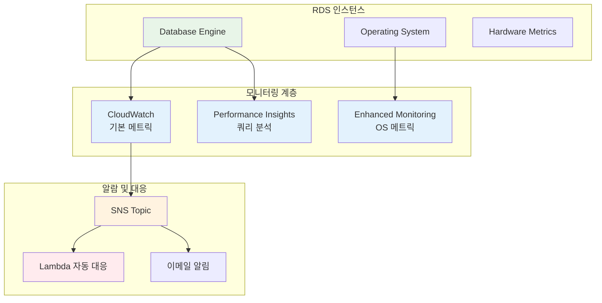
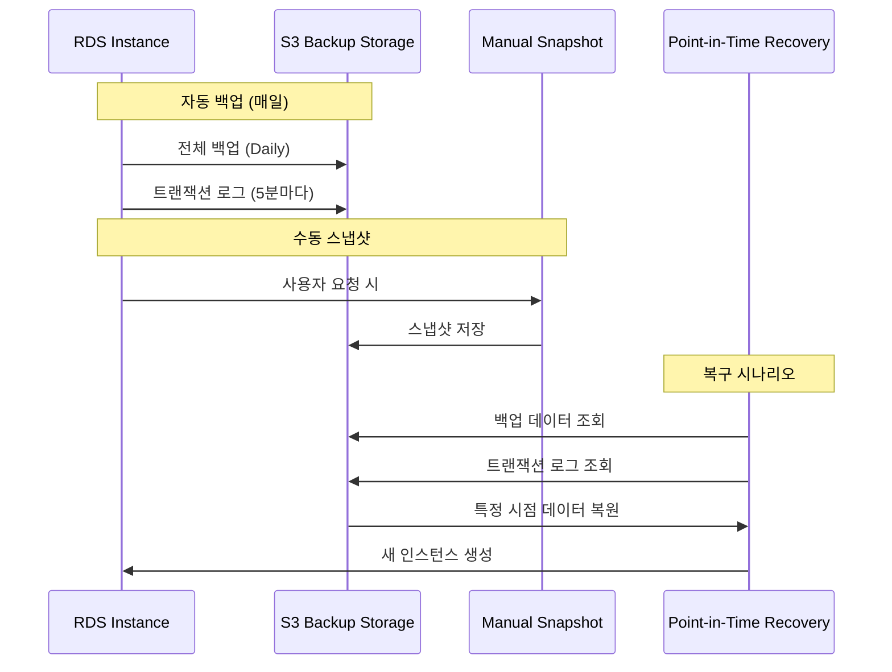
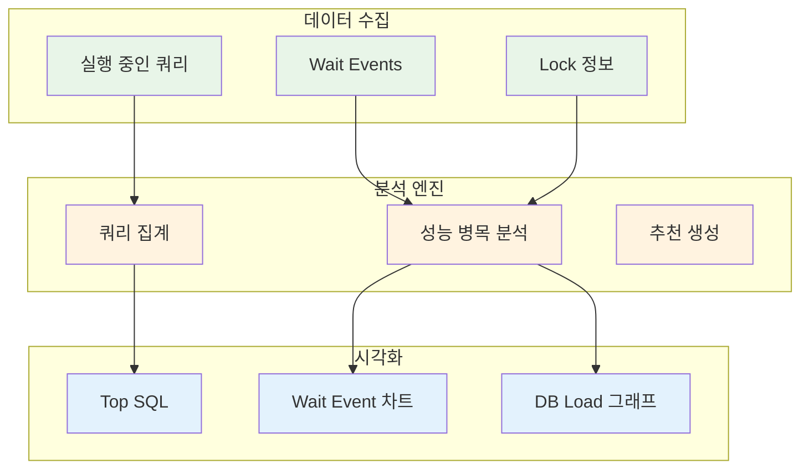
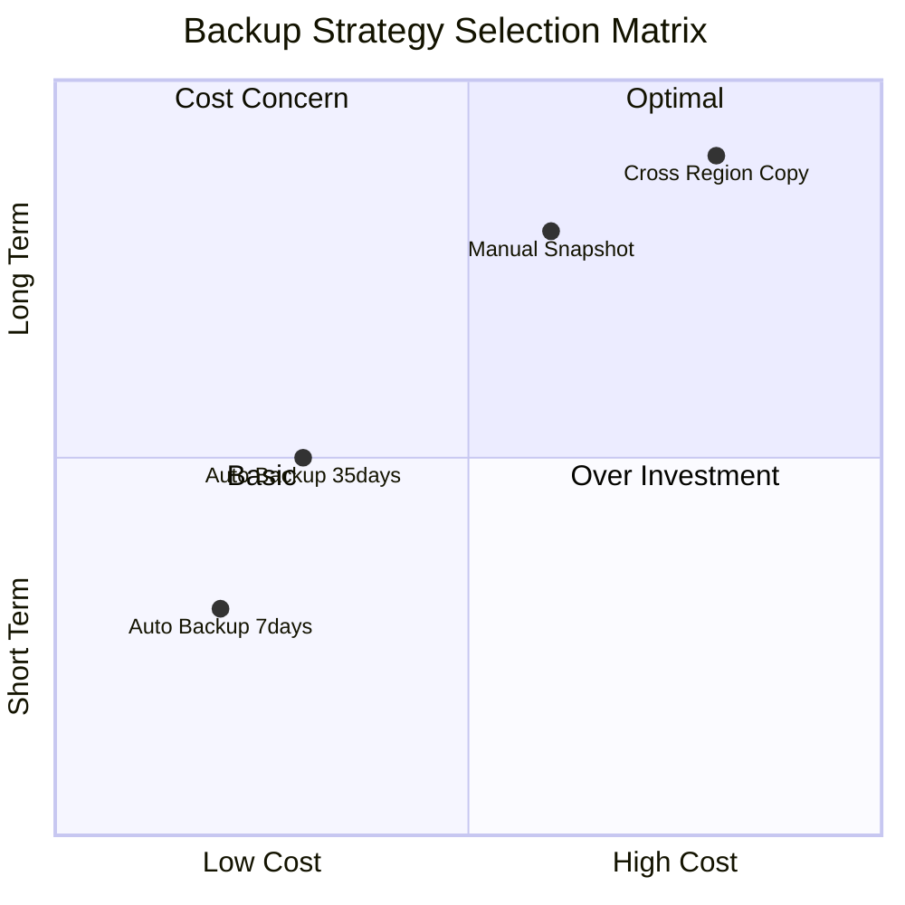
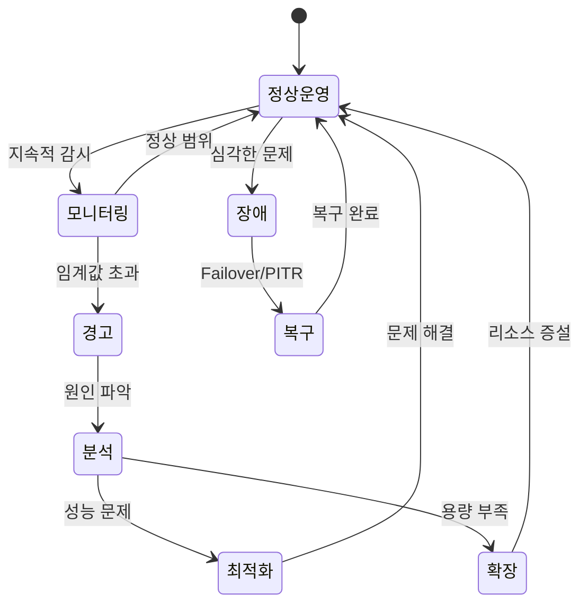
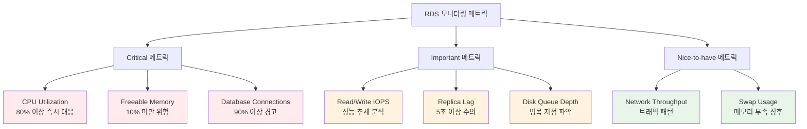
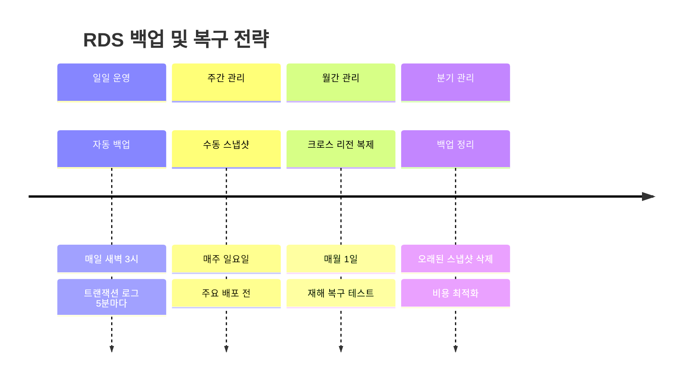
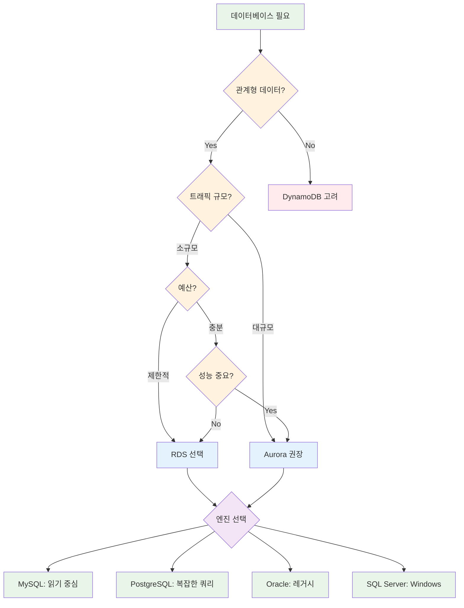

# Week 5 Day 3 Session 2: RDS 운영

<div align="center">

**📊 모니터링** • **💾 백업 & 복구** • **🔧 성능 최적화**

*RDS 운영 전략과 장애 대응*

</div>

---

## 🕘 Session 정보

**시간**: 10:00-10:50 (50분)  
**목표**: RDS 운영 전략 및 모니터링 방법 학습  
**방식**: 이론 학습 + 실무 사례

---

## 🎯 학습 목표

- **모니터링**: CloudWatch 메트릭 및 Performance Insights
- **백업 전략**: 자동 백업, 스냅샷, Point-in-Time Recovery
- **성능 최적화**: 쿼리 튜닝, 인덱스 관리, 파라미터 그룹
- **장애 대응**: Failover 시나리오 및 복구 절차

---

## 📖 서비스 개요

### 1. 생성 배경 (Why?)

#### 어떤 문제를 해결하기 위해 만들어졌는가?

**온프레미스 DB 운영의 문제점**:
- 수동 백업 스크립트 작성 및 관리
- 백업 실패 시 알림 시스템 별도 구축
- 복구 테스트 복잡 (별도 환경 필요)
- 모니터링 도구 설치 및 유지보수
- 성능 분석 도구 라이선스 비용

**EC2 + DB 운영의 한계**:
- CloudWatch 메트릭 수동 설정
- 백업 스토리지 관리 (S3 연동)
- 복구 절차 문서화 및 테스트
- 성능 분석 도구 별도 설치
- 알람 설정 및 관리 복잡

**AWS RDS 솔루션**:
- 자동 백업 (35일 보관, 무료)
- Point-in-Time Recovery (5분 단위)
- CloudWatch 통합 모니터링
- Performance Insights (쿼리 분석)
- 자동 알람 및 이벤트 알림

### 2. 핵심 원리 (How?)

#### RDS 모니터링 아키텍처



#### 백업 및 복구 메커니즘



#### Performance Insights 동작 원리



#### 백업 전략 비교



**전략 설명**:
- **Auto Backup 7days**: 기본 전략, 비용 효율적
- **Auto Backup 35days**: 규정 준수, 중간 비용
- **Manual Snapshot**: 장기 보관, 높은 비용
- **Cross Region Copy**: 재해 복구, 최고 비용

#### RDS 운영 프로세스



#### 모니터링 메트릭 우선순위



#### 백업 및 복구 타임라인



### 3. 주요 사용 사례 (When?)

#### 모니터링 시나리오

**실시간 성능 모니터링**:
- **CPU 사용률**: 70% 이상 시 스케일업 고려
- **메모리 사용률**: Swap 발생 시 인스턴스 크기 증가
- **IOPS**: 프로비저닝된 IOPS 대비 사용률 추적
- **네트워크**: Read/Write 처리량 모니터링

**장애 예방 모니터링**:
- **Disk Queue Depth**: 높은 값은 I/O 병목 신호
- **Read/Write Latency**: 응답 시간 증가 감지
- **Connection Count**: 동시 연결 수 제한 확인
- **Replication Lag**: 읽기 복제본 지연 시간 추적

#### 백업 및 복구 시나리오

**정기 백업 전략**:
```
일일 백업 (Daily):
├── 자동 백업: 매일 새벽 2시
├── 보관 기간: 7일
└── 비용: DB 크기만큼 무료

주간 백업 (Weekly):
├── 수동 스냅샷: 매주 일요일
├── 보관 기간: 4주
└── 비용: $0.095/GB-월

월간 백업 (Monthly):
├── 수동 스냅샷: 매월 1일
├── 보관 기간: 12개월
└── 비용: $0.095/GB-월
```

**재해 복구 시나리오**:
- **데이터 손상**: 특정 시점 복원 (PITR)
- **리전 장애**: 다른 리전으로 스냅샷 복사
- **테스트 환경**: 프로덕션 스냅샷으로 테스트 DB 생성
- **마이그레이션**: 스냅샷 기반 DB 이전

#### 성능 최적화 시나리오

**쿼리 성능 분석**:
```sql
-- Performance Insights에서 확인할 주요 쿼리
-- 1. 가장 느린 쿼리 (Top SQL)
SELECT query, calls, total_time, mean_time
FROM pg_stat_statements
ORDER BY mean_time DESC
LIMIT 10;

-- 2. 가장 많이 실행되는 쿼리
SELECT query, calls, total_time
FROM pg_stat_statements
ORDER BY calls DESC
LIMIT 10;

-- 3. 인덱스 사용률
SELECT schemaname, tablename, indexname, idx_scan
FROM pg_stat_user_indexes
WHERE idx_scan = 0;
```

**인덱스 최적화**:
- **Missing Index**: Performance Insights가 제안하는 인덱스 추가
- **Unused Index**: 사용하지 않는 인덱스 제거
- **Index Bloat**: 인덱스 재구성 (REINDEX)

#### 비용 최적화 시나리오

**스토리지 비용 절감**:
```
현재 상황:
- DB 크기: 100GB
- 자동 백업: 100GB (무료)
- 수동 스냅샷: 500GB ($47.50/월)
- 총 비용: $47.50/월

최적화 후:
- 오래된 스냅샷 삭제: 300GB 제거
- 남은 스냅샷: 200GB ($19/월)
- 절감액: $28.50/월 (60% 절감)
```

**인스턴스 비용 절감**:
- **Reserved Instance**: 1년 약정 시 40% 할인
- **적정 크기 조정**: 사용률 낮은 인스턴스 다운사이징
- **읽기 복제본 최적화**: 필요한 만큼만 유지

#### 고가용성 시나리오

**Multi-AZ 장애 대응**:
```
정상 상태:
Primary (AZ-A) ──동기 복제──> Standby (AZ-B)
        │
        └──> 애플리케이션 연결

장애 발생:
Primary (AZ-A) ✗ 장애 발생
        │
        └──> Standby (AZ-B) 자동 승격
                    │
                    └──> 애플리케이션 자동 재연결

복구 시간: 1-2분 (자동)
데이터 손실: 없음 (동기 복제)
```

**읽기 확장 시나리오**:
```
Primary (쓰기 전용)
    │
    ├──> Read Replica 1 (읽기 전용)
    ├──> Read Replica 2 (읽기 전용)
    └──> Read Replica 3 (읽기 전용)

사용 사례:
- 보고서 생성: Read Replica 1
- 분석 쿼리: Read Replica 2
- 검색 기능: Read Replica 3
```

#### 보안 강화 시나리오

**네트워크 격리**:
```
VPC (10.0.0.0/16)
├── Public Subnet (10.0.1.0/24)
│   └── Bastion Host (SSH 접근)
│
└── Private Subnet (10.0.11.0/24)
    └── RDS Instance (외부 접근 불가)
        │
        └── Security Group
            ├── Inbound: 3306 from App Servers only
            └── Outbound: All traffic
```

**암호화 적용**:
- **저장 데이터 암호화**: KMS 키로 EBS 볼륨 암호화
- **전송 데이터 암호화**: SSL/TLS 연결 강제
- **백업 암호화**: 스냅샷 자동 암호화
- **로그 암호화**: CloudWatch Logs 암호화

#### 마이그레이션 시나리오

**온프레미스 → RDS 마이그레이션**:
```
1단계: 평가
├── Database Migration Assessment Report
├── 스키마 호환성 확인
└── 데이터 크기 및 마이그레이션 시간 예측

2단계: 스키마 마이그레이션
├── AWS Schema Conversion Tool (SCT)
├── 스키마 변환 및 최적화
└── 테스트 환경에서 검증

3단계: 데이터 마이그레이션
├── AWS Database Migration Service (DMS)
├── 초기 전체 로드
└── 지속적 복제 (CDC)

4단계: 전환
├── 애플리케이션 연결 문자열 변경
├── DNS 전환
└── 온프레미스 DB 중지
```

**MySQL → PostgreSQL 마이그레이션**:
- **SCT**: 스키마 자동 변환
- **DMS**: 데이터 마이그레이션
- **호환성 검증**: 애플리케이션 쿼리 테스트
- **성능 튜닝**: PostgreSQL 최적화

#### 개발/테스트 환경 시나리오

**환경 분리 전략**:
```
프로덕션 (Production):
├── db.r5.xlarge (Multi-AZ)
├── 자동 백업: 7일
└── Performance Insights: 활성화

스테이징 (Staging):
├── db.t3.medium (Single-AZ)
├── 자동 백업: 3일
└── 프로덕션 스냅샷 복원

개발 (Development):
├── db.t3.small (Single-AZ)
├── 자동 백업: 1일
└── 샘플 데이터 사용
```

**비용 효율적 개발 환경**:
- **자동 시작/중지**: 업무 시간에만 실행
- **작은 인스턴스**: 개발용은 t3.small 사용
- **스냅샷 공유**: 프로덕션 데이터 복사 최소화

---

### 4. 비슷한 서비스 비교 (Which?)

#### AWS 내 대안 서비스

**RDS vs Aurora**

**언제 RDS를 사용**:
- **예산 제약**: Aurora보다 20-30% 저렴
- **단순한 워크로드**: 복잡한 고가용성 불필요
- **특정 엔진 버전**: Aurora가 지원하지 않는 버전 필요
- **소규모 애플리케이션**: 트래픽이 적고 예측 가능

**언제 Aurora를 사용**:
- **고성능 필요**: MySQL/PostgreSQL 대비 5배 빠른 성능
- **대규모 트래픽**: 초당 수만 건의 트랜잭션
- **글로벌 서비스**: Aurora Global Database로 다중 리전
- **자동 확장**: 스토리지 자동 확장 (최대 128TB)

**RDS vs EC2 + 직접 설치 DB**

**언제 RDS를 사용**:
- **관리 부담 최소화**: 패치, 백업 자동화
- **고가용성 필요**: Multi-AZ 자동 Failover
- **빠른 구축**: 몇 분 내 DB 생성
- **규정 준수**: AWS 인증 활용

**언제 EC2 + DB를 사용**:
- **완전한 제어 필요**: OS 레벨 접근 필요
- **특수한 설정**: RDS가 지원하지 않는 설정
- **레거시 애플리케이션**: 특정 DB 버전이나 플러그인
- **비용 최적화**: Reserved Instance + Spot Instance 조합

**RDS vs DynamoDB**

**언제 RDS를 사용**:
- **복잡한 쿼리**: JOIN, 집계, 트랜잭션
- **관계형 데이터**: 정규화된 스키마
- **기존 SQL 애플리케이션**: 마이그레이션 용이
- **ACID 보장**: 강력한 일관성 필요

**언제 DynamoDB를 사용**:
- **키-값 저장소**: 단순한 읽기/쓰기
- **무한 확장**: 자동 스케일링
- **서버리스**: 관리 불필요
- **밀리초 응답**: 초저지연 필요

#### 선택 기준 비교표

| 기준 | RDS | Aurora | EC2 + DB | DynamoDB |
|------|-----|--------|----------|----------|
| **비용** | 중간 | 높음 | 낮음 (관리 비용 제외) | 사용량 기반 |
| **성능** | 좋음 | 매우 좋음 | 설정에 따라 다름 | 매우 좋음 |
| **관리 복잡도** | 낮음 | 낮음 | 높음 | 매우 낮음 |
| **확장성** | 수직 확장 | 수평 + 수직 | 수동 확장 | 자동 무한 확장 |
| **고가용성** | Multi-AZ | 기본 제공 | 수동 구성 | 기본 제공 |
| **백업/복구** | 자동 | 자동 | 수동 | 자동 |
| **쿼리 복잡도** | 복잡한 SQL | 복잡한 SQL | 복잡한 SQL | 단순 쿼리 |
| **적합한 규모** | 중소규모 | 대규모 | 모든 규모 | 대규모 |
| **학습 곡선** | 낮음 | 낮음 | 높음 | 중간 |

#### 엔진별 선택 가이드

**MySQL vs PostgreSQL**

**MySQL 선택 시**:
- **읽기 중심**: 읽기 성능 우수
- **단순한 트랜잭션**: OLTP 워크로드
- **레플리케이션**: 비동기 복제 성능 좋음
- **커뮤니티**: 더 큰 커뮤니티와 자료

**PostgreSQL 선택 시**:
- **복잡한 쿼리**: 고급 SQL 기능
- **데이터 무결성**: 엄격한 ACID
- **JSON 지원**: NoSQL 기능 필요
- **확장성**: 다양한 확장 기능

**Oracle vs PostgreSQL**

**Oracle 선택 시**:
- **레거시 시스템**: 기존 Oracle 애플리케이션
- **엔터프라이즈 기능**: 고급 파티셔닝, RAC
- **상용 지원**: Oracle 공식 지원 필요
- **규정 준수**: Oracle 인증 필요

**PostgreSQL 선택 시**:
- **비용 절감**: 라이선스 비용 없음
- **오픈소스**: 커뮤니티 지원
- **클라우드 네이티브**: AWS 최적화
- **마이그레이션**: Oracle 호환 기능 제공

**SQL Server vs PostgreSQL**

**SQL Server 선택 시**:
- **Windows 환경**: .NET 애플리케이션
- **Microsoft 생태계**: Azure 통합
- **T-SQL**: 기존 SQL Server 코드
- **BI 도구**: SSRS, SSAS 사용

**PostgreSQL 선택 시**:
- **Linux 환경**: 오픈소스 스택
- **비용 효율**: 라이선스 비용 없음
- **표준 SQL**: ANSI SQL 준수
- **확장성**: 다양한 확장 기능

#### 실무 의사결정 프로세스



#### 마이그레이션 경로

**온프레미스 → RDS**:
```
1단계: 평가
├── 현재 DB 크기 및 성능 측정
├── 호환성 확인 (SCT)
└── 비용 예측

2단계: 테스트
├── 테스트 환경 구축
├── 스키마 마이그레이션
└── 성능 테스트

3단계: 마이그레이션
├── DMS로 데이터 복제
├── 애플리케이션 전환
└── 모니터링 및 최적화
```

**RDS → Aurora**:
```
1단계: 스냅샷 생성
├── RDS 스냅샷 생성
└── 다운타임 최소화 계획

2단계: Aurora 복원
├── 스냅샷에서 Aurora 생성
├── 파라미터 그룹 조정
└── 성능 테스트

3단계: 전환
├── 읽기 복제본 생성 (선택)
├── DNS 전환
└── RDS 종료
```

#### 비용 최적화 전략

**RDS 비용 구성**:
```
총 비용 = 인스턴스 비용 + 스토리지 비용 + 백업 비용 + 데이터 전송 비용

예시 (db.t3.medium, 100GB):
- 인스턴스: $0.068/hour × 730 = $49.64/월
- 스토리지 (gp3): $0.115/GB × 100 = $11.50/월
- 백업 (50GB 초과): $0.095/GB × 50 = $4.75/월
- 데이터 전송: 변동
─────────────────────────────────────────
총 예상 비용: ~$66/월
```

**비용 절감 방법**:
1. **Reserved Instance**: 1년 약정 시 40% 할감
2. **적정 크기 조정**: CloudWatch 메트릭 기반 다운사이징
3. **스토리지 최적화**: gp2 → gp3 전환 (20% 절감)
4. **백업 정리**: 오래된 스냅샷 삭제
5. **읽기 복제본 최적화**: 필요한 만큼만 유지

---

### 5. 장단점 분석

#### 장점

**✅ 관리 부담 최소화**:
- **자동 패치**: OS 및 DB 엔진 자동 업데이트
- **자동 백업**: 일일 자동 백업 및 PITR
- **자동 Failover**: Multi-AZ 자동 장애 조치 (1-2분)
- **모니터링 통합**: CloudWatch 자동 연동

**✅ 고가용성 및 내구성**:
- **Multi-AZ 배포**: 99.95% SLA 보장
- **자동 복제**: 동기식 데이터 복제
- **자동 백업**: 35일까지 보관 가능
- **스냅샷**: 수동 백업 무제한 보관

**✅ 확장성**:
- **수직 확장**: 인스턴스 타입 변경 (다운타임 최소)
- **스토리지 확장**: 온라인 스토리지 증설
- **읽기 확장**: Read Replica 최대 15개
- **성능 향상**: IOPS 및 처리량 조정

**✅ 보안**:
- **네트워크 격리**: VPC 내 Private Subnet 배치
- **암호화**: 저장 데이터 및 전송 데이터 암호화
- **IAM 통합**: 세밀한 권한 관리
- **감사 로그**: 모든 DB 활동 추적

**✅ 비용 효율성**:
- **종량제**: 사용한 만큼만 지불
- **Reserved Instance**: 최대 69% 할인
- **무료 백업**: DB 크기만큼 무료
- **자동 최적화**: AWS가 인프라 최적화

**✅ 다양한 엔진 지원**:
- **MySQL**: 5.7, 8.0
- **PostgreSQL**: 11, 12, 13, 14, 15, 16
- **MariaDB**: 10.3, 10.4, 10.5, 10.6, 10.11
- **Oracle**: 12c, 19c, 21c
- **SQL Server**: 2016, 2017, 2019, 2022

#### 단점/제약사항

**⚠️ OS 레벨 접근 불가**:
- **제약**: SSH 접근 불가, OS 설정 변경 불가
- **영향**: 특수한 OS 설정이나 모니터링 도구 설치 불가
- **대안**: 
  - Enhanced Monitoring으로 OS 메트릭 확인
  - Parameter Group으로 DB 설정 조정
  - CloudWatch Agent로 추가 메트릭 수집

**⚠️ 특정 DB 기능 제한**:
- **제약**: 일부 고급 기능 미지원
  - MySQL: SUPER 권한 제한
  - PostgreSQL: 일부 확장 기능 제한
  - Oracle: RAC, Data Guard 미지원
- **영향**: 특수한 DB 기능 사용 불가
- **대안**:
  - RDS 지원 기능으로 대체
  - Aurora로 마이그레이션 (더 많은 기능)
  - EC2 + 직접 설치 고려

**⚠️ 스토리지 제한**:
- **제약**: 
  - MySQL/PostgreSQL: 최대 64TB
  - Oracle: 최대 64TB
  - SQL Server: 최대 16TB
- **영향**: 초대규모 데이터베이스 제한
- **대안**:
  - Aurora로 마이그레이션 (최대 128TB)
  - 데이터 파티셔닝
  - 아카이빙 전략

**⚠️ 성능 제한**:
- **제약**: 
  - 인스턴스 타입에 따른 성능 상한
  - IOPS 제한 (최대 80,000 IOPS)
  - 네트워크 대역폭 제한
- **영향**: 초고성능 워크로드 제한
- **대안**:
  - Aurora로 마이그레이션 (5배 빠른 성능)
  - 읽기 복제본으로 부하 분산
  - 캐싱 계층 추가 (ElastiCache)

**⚠️ 비용**:
- **제약**: 
  - 24/7 실행 시 비용 발생
  - Multi-AZ는 2배 비용
  - 백업 스토리지 초과 시 추가 비용
- **영향**: 소규모 프로젝트에는 부담
- **대안**:
  - 개발/테스트 환경은 자동 시작/중지
  - Reserved Instance로 40% 절감
  - Aurora Serverless 고려 (사용량 기반)

**⚠️ 마이그레이션 복잡성**:
- **제약**: 
  - 온프레미스 → RDS 마이그레이션 시간 소요
  - 다운타임 발생 가능
  - 애플리케이션 호환성 검증 필요
- **영향**: 마이그레이션 프로젝트 복잡도 증가
- **대안**:
  - DMS로 최소 다운타임 마이그레이션
  - 단계적 마이그레이션 (읽기 복제본 활용)
  - 충분한 테스트 기간 확보

**⚠️ 리전 제약**:
- **제약**: 
  - 특정 리전에서만 사용 가능
  - 리전 간 복제 시 추가 비용
  - 글로벌 배포 시 복잡도 증가
- **영향**: 글로벌 서비스 구축 시 고려 필요
- **대안**:
  - Aurora Global Database (다중 리전)
  - 리전별 독립 DB 구축
  - 읽기 복제본 다중 리전 배치

#### 실무 고려사항

**언제 RDS를 선택하지 말아야 하는가**:

1. **완전한 제어 필요**:
   - OS 레벨 접근 필수
   - 특수한 커널 파라미터 조정
   - 커스텀 모니터링 에이전트 설치
   → **대안**: EC2 + 직접 설치

2. **초고성능 필요**:
   - 초당 수만 건 이상의 트랜잭션
   - 밀리초 단위 응답 시간 필수
   - 복잡한 분석 쿼리
   → **대안**: Aurora 또는 Redshift

3. **NoSQL 워크로드**:
   - 키-값 저장소
   - 문서 기반 데이터
   - 무한 확장 필요
   → **대안**: DynamoDB, DocumentDB

4. **비용 최우선**:
   - 매우 제한된 예산
   - 간헐적 사용 (개발/테스트)
   - 소규모 프로젝트
   → **대안**: Aurora Serverless, EC2 Spot

5. **레거시 시스템**:
   - 매우 오래된 DB 버전
   - RDS가 지원하지 않는 기능
   - 특수한 플러그인 필요
   → **대안**: EC2 + 직접 설치

#### 장단점 요약 비교

| 측면 | 장점 | 단점 | 완화 방법 |
|------|------|------|-----------|
| **관리** | 자동화된 운영 | OS 접근 불가 | Enhanced Monitoring |
| **가용성** | Multi-AZ 자동 Failover | 2배 비용 | 중요 DB만 Multi-AZ |
| **성능** | 쉬운 확장 | 성능 상한 존재 | Aurora 마이그레이션 |
| **보안** | 통합 보안 기능 | 일부 고급 기능 제한 | IAM + KMS 조합 |
| **비용** | 종량제 유연성 | 24/7 실행 시 비용 | Reserved Instance |
| **확장성** | 수직/수평 확장 | 스토리지 제한 (64TB) | 파티셔닝, Aurora |
| **호환성** | 다양한 엔진 지원 | 일부 기능 제한 | 호환성 사전 검증 |

#### 실무 의사결정 체크리스트

**RDS 도입 전 확인사항**:
- [ ] **워크로드 분석**: OLTP vs OLAP vs 혼합
- [ ] **성능 요구사항**: TPS, 응답 시간, 동시 연결 수
- [ ] **가용성 요구사항**: SLA, RTO, RPO
- [ ] **보안 요구사항**: 암호화, 감사, 규정 준수
- [ ] **예산**: 초기 비용, 운영 비용, 확장 비용
- [ ] **기술 스택**: 애플리케이션 호환성
- [ ] **운영 역량**: 관리형 vs 자체 운영
- [ ] **마이그레이션 계획**: 다운타임, 데이터 전환
- [ ] **확장 계획**: 향후 3-5년 성장 예측
- [ ] **재해 복구**: 백업, 복구 전략

**성공적인 RDS 도입을 위한 팁**:
1. **작게 시작**: 개발/테스트 환경부터 시작
2. **충분한 테스트**: 프로덕션 전 성능 및 호환성 검증
3. **모니터링 설정**: CloudWatch 알람 사전 구성
4. **백업 전략**: 자동 백업 + 정기 스냅샷
5. **비용 추적**: Cost Explorer로 비용 모니터링
6. **문서화**: 설정, 절차, 트러블슈팅 가이드
7. **교육**: 팀원 대상 RDS 운영 교육
8. **지속적 최적화**: 정기적인 성능 및 비용 리뷰

---

### 6. 비용 구조 💰

#### 과금 방식

**1. 인스턴스 비용 (시간당)**

**On-Demand 요금 (ap-northeast-2 서울 리전)**:

| 인스턴스 타입 | vCPU | 메모리 | MySQL/PostgreSQL | Oracle BYOL | SQL Server |
|--------------|------|--------|------------------|-------------|------------|
| **db.t3.micro** | 2 | 1GB | $0.017/hour | $0.034/hour | $0.034/hour |
| **db.t3.small** | 2 | 2GB | $0.034/hour | $0.068/hour | $0.068/hour |
| **db.t3.medium** | 2 | 4GB | $0.068/hour | $0.136/hour | $0.136/hour |
| **db.t3.large** | 2 | 8GB | $0.136/hour | $0.272/hour | $0.272/hour |
| **db.r5.large** | 2 | 16GB | $0.240/hour | $0.480/hour | $0.480/hour |
| **db.r5.xlarge** | 4 | 32GB | $0.480/hour | $0.960/hour | $0.960/hour |
| **db.r5.2xlarge** | 8 | 64GB | $0.960/hour | $1.920/hour | $1.920/hour |

**월간 비용 계산** (730시간 기준):
```
db.t3.micro:  $0.017 × 730 = $12.41/월
db.t3.small:  $0.034 × 730 = $24.82/월
db.t3.medium: $0.068 × 730 = $49.64/월
db.t3.large:  $0.136 × 730 = $99.28/월
db.r5.large:  $0.240 × 730 = $175.20/월
```

**2. 스토리지 비용**

**스토리지 타입별 요금**:

| 스토리지 타입 | 용량 | IOPS | 처리량 | 가격 |
|--------------|------|------|--------|------|
| **gp2 (범용 SSD)** | 20GB-64TB | 3 IOPS/GB (최대 16,000) | - | $0.115/GB-월 |
| **gp3 (범용 SSD)** | 20GB-64TB | 3,000 IOPS (기본) | 125 MB/s | $0.092/GB-월 |
| **io1 (프로비저닝 IOPS)** | 100GB-64TB | 최대 64,000 IOPS | - | $0.138/GB-월 + $0.115/IOPS-월 |
| **io2 (프로비저닝 IOPS)** | 100GB-64TB | 최대 64,000 IOPS | - | $0.138/GB-월 + $0.115/IOPS-월 |

**스토리지 비용 예시**:
```
gp2 (100GB):
$0.115 × 100 = $11.50/월

gp3 (100GB, 기본 IOPS):
$0.092 × 100 = $9.20/월
절감액: $2.30/월 (20% 절감)

gp3 (100GB, 10,000 IOPS, 500 MB/s):
스토리지: $0.092 × 100 = $9.20
추가 IOPS: $0.005 × 7,000 = $35.00
추가 처리량: $0.10 × 375 = $37.50
총 비용: $81.70/월
```

**3. 백업 스토리지 비용**

**백업 정책**:
- **무료 백업**: DB 크기만큼 무료
- **추가 백업**: $0.095/GB-월

**백업 비용 예시**:
```
DB 크기: 100GB
자동 백업: 100GB (무료)
수동 스냅샷: 200GB

백업 비용:
- 자동 백업: $0 (100GB 무료)
- 수동 스냅샷: $0.095 × 200 = $19.00/월
총 백업 비용: $19.00/월
```

**4. 데이터 전송 비용**

**데이터 전송 요금**:
- **인바운드**: 무료
- **아웃바운드** (인터넷으로):
  - 첫 100GB/월: 무료
  - 다음 10TB/월: $0.126/GB
  - 다음 40TB/월: $0.122/GB
  - 150TB 이상: $0.117/GB
- **리전 간 복제**: $0.02/GB
- **AZ 간 복제**: $0.01/GB (Multi-AZ)

**5. 추가 기능 비용**

**Enhanced Monitoring**:
- **비용**: $0.01/hour per instance
- **월간**: $0.01 × 730 = $7.30/월

**Performance Insights**:
- **무료**: 7일 데이터 보관
- **유료**: 장기 보관 시 $0.018/vCPU/hour
- **예시** (db.r5.xlarge, 4 vCPU):
  - $0.018 × 4 × 730 = $52.56/월

#### 프리티어 혜택

**AWS 프리티어 (12개월)**:
- **인스턴스**: db.t2.micro 또는 db.t3.micro
- **시간**: 750시간/월 (24/7 실행 가능)
- **스토리지**: 20GB gp2 또는 gp3
- **백업**: 20GB 자동 백업
- **지원 엔진**: MySQL, PostgreSQL, MariaDB

**프리티어 활용 예시**:
```
무료 구성:
- 인스턴스: db.t3.micro (750시간/월)
- 스토리지: 20GB gp3
- 백업: 20GB 자동 백업

월간 비용: $0 (프리티어 범위 내)

프리티어 초과 시:
- 인스턴스: $12.41/월
- 스토리지: $1.84/월 (20GB × $0.092)
- 백업: $0 (20GB 무료)
총 비용: $14.25/월
```

#### 비용 최적화 팁

**1. Reserved Instance 활용**

**할인율**:
- **1년 약정**: 
  - 선결제 없음: 40% 할인
  - 부분 선결제: 42% 할인
  - 전체 선결제: 43% 할인
- **3년 약정**:
  - 선결제 없음: 60% 할인
  - 부분 선결제: 62% 할인
  - 전체 선결제: 69% 할인

**비용 비교 (db.t3.medium)**:
```
On-Demand:
$0.068/hour × 730 × 12 = $595.68/년

1년 Reserved (전체 선결제):
$595.68 × 0.57 = $339.54/년
절감액: $256.14/년 (43% 절감)

3년 Reserved (전체 선결제):
$595.68 × 0.31 = $184.66/년
절감액: $411.02/년 (69% 절감)
```

**2. 스토리지 최적화**

**gp2 → gp3 전환**:
```
100GB 스토리지:
gp2: $0.115 × 100 = $11.50/월
gp3: $0.092 × 100 = $9.20/월
절감액: $2.30/월 (20% 절감)

1TB 스토리지:
gp2: $0.115 × 1,000 = $115/월
gp3: $0.092 × 1,000 = $92/월
절감액: $23/월 (20% 절감)
```

**3. 백업 정리**

**오래된 스냅샷 삭제**:
```
현재 백업:
- DB 크기: 100GB
- 자동 백업: 100GB (무료)
- 수동 스냅샷: 500GB ($47.50/월)

최적화 후:
- 자동 백업: 100GB (무료)
- 수동 스냅샷: 200GB ($19/월)
절감액: $28.50/월 (60% 절감)
```

**4. 인스턴스 크기 조정**

**적정 크기 조정 (Right-sizing)**:
```
현재: db.r5.large (16GB)
- CPU 사용률: 20%
- 메모리 사용률: 30%
- 비용: $175.20/월

최적화: db.t3.large (8GB)
- CPU 사용률: 40%
- 메모리 사용률: 60%
- 비용: $99.28/월
절감액: $75.92/월 (43% 절감)
```

**5. 개발/테스트 환경 자동화**

**자동 시작/중지**:
```
개발 환경 (db.t3.medium):
- 24/7 실행: $49.64/월
- 업무 시간만 (10시간/일, 5일/주): $14.89/월
절감액: $34.75/월 (70% 절감)

테스트 환경 (db.t3.small):
- 24/7 실행: $24.82/월
- 필요 시만 (주 20시간): $2.72/월
절감액: $22.10/월 (89% 절감)
```

#### 예상 비용 계산 예시

**시나리오 1: 소규모 웹 애플리케이션**
```
구성:
- 인스턴스: db.t3.small (Single-AZ)
- 스토리지: 50GB gp3
- 백업: 자동 백업만 (50GB)
- 데이터 전송: 50GB/월

비용 계산:
- 인스턴스: $0.034 × 730 = $24.82
- 스토리지: $0.092 × 50 = $4.60
- 백업: $0 (무료)
- 데이터 전송: $0 (100GB 무료 범위)
─────────────────────────────────────
총 비용: $29.42/월
```

**시나리오 2: 중규모 비즈니스 애플리케이션**
```
구성:
- 인스턴스: db.t3.medium (Multi-AZ)
- 스토리지: 200GB gp3
- 백업: 자동 백업 + 수동 스냅샷 100GB
- Enhanced Monitoring: 활성화
- 데이터 전송: 200GB/월

비용 계산:
- 인스턴스: $0.068 × 730 × 2 = $99.28 (Multi-AZ)
- 스토리지: $0.092 × 200 × 2 = $36.80 (Multi-AZ)
- 백업: $0.095 × 100 = $9.50
- Enhanced Monitoring: $7.30
- 데이터 전송: $0.126 × 100 = $12.60
─────────────────────────────────────
총 비용: $165.48/월
```

**시나리오 3: 대규모 엔터프라이즈 애플리케이션**
```
구성:
- 인스턴스: db.r5.2xlarge (Multi-AZ)
- 스토리지: 1TB gp3 (10,000 IOPS)
- 백업: 자동 백업 + 수동 스냅샷 500GB
- Performance Insights: 활성화 (8 vCPU)
- 읽기 복제본: 2개 (db.r5.xlarge)
- 데이터 전송: 1TB/월

비용 계산:
Primary (Multi-AZ):
- 인스턴스: $0.960 × 730 × 2 = $1,401.60
- 스토리지: $0.092 × 1,000 × 2 = $184.00
- 추가 IOPS: $0.005 × 7,000 × 2 = $70.00

Read Replicas (2개):
- 인스턴스: $0.480 × 730 × 2 = $700.80
- 스토리지: $0.092 × 1,000 × 2 = $184.00

백업 및 모니터링:
- 백업: $0.095 × 500 = $47.50
- Performance Insights: $0.018 × 8 × 730 = $105.12

데이터 전송:
- $0.126 × 900 = $113.40
─────────────────────────────────────
총 비용: $2,806.42/월
```

#### 비용 모니터링 및 알림

**Cost Explorer 활용**:
- **일일 비용**: 실시간 비용 추적
- **월간 예측**: 월말 예상 비용
- **서비스별 분석**: RDS 비용 세부 분석
- **태그별 분석**: 환경/프로젝트별 비용

**AWS Budgets 설정**:
```
예산 알림 설정:
- 예산: $200/월
- 알림 1: 80% 도달 시 ($160)
- 알림 2: 100% 도달 시 ($200)
- 알림 3: 120% 초과 시 ($240)
```

**비용 최적화 체크리스트**:
- [ ] Reserved Instance 검토 (1년 이상 사용 시)
- [ ] gp2 → gp3 전환 검토
- [ ] 오래된 스냅샷 정리 (월 1회)
- [ ] 인스턴스 크기 적정성 검토 (분기 1회)
- [ ] 개발/테스트 환경 자동 시작/중지
- [ ] 읽기 복제본 필요성 검토
- [ ] 데이터 전송 최적화
- [ ] Performance Insights 필요성 검토
- [ ] Multi-AZ 필요성 검토 (개발 환경)
- [ ] 백업 보관 기간 최적화

---

## 📊 실습 연계

### Lab 1에서 활용
- **RDS 인스턴스 생성**: Multi-AZ 구성
- **CloudWatch 모니터링**: 기본 메트릭 확인
- **자동 백업 설정**: 백업 윈도우 구성
- **스냅샷 생성**: 수동 백업 실습

### Lab 2에서 활용
- **Performance Insights**: 쿼리 성능 분석
- **Enhanced Monitoring**: OS 레벨 메트릭
- **파라미터 그룹**: DB 설정 최적화
- **읽기 복제본**: 읽기 부하 분산

### 주의사항
- **비용 관리**: Enhanced Monitoring, Performance Insights 비용 확인
- **백업 보관**: 불필요한 스냅샷 정기 삭제
- **Multi-AZ**: 개발 환경은 Single-AZ로 비용 절감
- **인스턴스 크기**: 프리티어 범위 내 사용 (db.t3.micro)

---

## 🔗 공식 문서 (필수)

**⚠️ 학생들이 직접 확인해야 할 공식 문서**:

- 📘 [Amazon RDS 사용자 가이드](https://docs.aws.amazon.com/AmazonRDS/latest/UserGuide/Welcome.html)
- 📗 [RDS 모니터링](https://docs.aws.amazon.com/AmazonRDS/latest/UserGuide/CHAP_Monitoring.html)
- 📙 [RDS 백업 및 복원](https://docs.aws.amazon.com/AmazonRDS/latest/UserGuide/CHAP_CommonTasks.BackupRestore.html)
- 📕 [RDS 요금](https://aws.amazon.com/rds/pricing/)
- 🆕 [RDS 최신 업데이트](https://aws.amazon.com/about-aws/whats-new/database/)

---

## 🔑 핵심 키워드

### 모니터링
- **CloudWatch**: 기본 메트릭 (CPU, Memory, IOPS)
- **Enhanced Monitoring**: OS 레벨 메트릭 (프로세스, 스레드)
- **Performance Insights**: 쿼리 성능 분석 (Top SQL)
- **알람**: 임계값 기반 알림 (SNS 연동)

### 백업 및 복구
- **자동 백업**: 일일 자동 백업 (최대 35일)
- **수동 스냅샷**: 무제한 보관 가능
- **PITR**: Point-in-Time Recovery (5분 단위)
- **스냅샷 공유**: 다른 계정과 공유

### 성능 최적화
- **파라미터 그룹**: DB 엔진 설정
- **옵션 그룹**: 추가 기능 활성화
- **읽기 복제본**: 읽기 부하 분산 (최대 15개)
- **인덱스**: 쿼리 성능 향상

### 고가용성
- **Multi-AZ**: 자동 Failover (1-2분)
- **동기 복제**: 데이터 무손실
- **자동 백업**: 두 AZ에 저장
- **DNS 자동 전환**: 애플리케이션 재연결 불필요

---

## 💡 Session 마무리

### ✅ 오늘 Session 성과
- **모니터링 전략**: CloudWatch, Enhanced Monitoring, Performance Insights 이해
- **백업 전략**: 자동 백업, 스냅샷, PITR 활용 방법
- **성능 최적화**: 쿼리 튜닝, 인덱스 관리, 파라미터 조정
- **장애 대응**: Multi-AZ Failover 및 복구 절차

### 🎯 다음 Session 준비
- **Session 3**: ElastiCache Redis - 캐싱 전략 및 성능 향상
- **연계 내용**: RDS와 ElastiCache 통합 아키텍처
- **실습 준비**: RDS + Redis 캐싱 계층 구축

---

<div align="center">

**📊 체계적 모니터링** • **💾 안전한 백업** • **🔧 성능 최적화** • **🚨 신속한 장애 대응**

*RDS 운영의 모든 것*

</div>