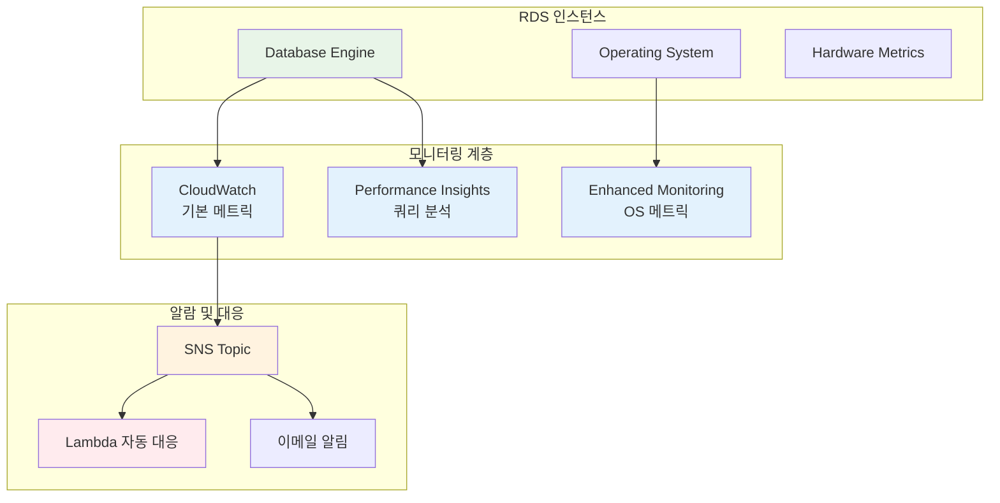
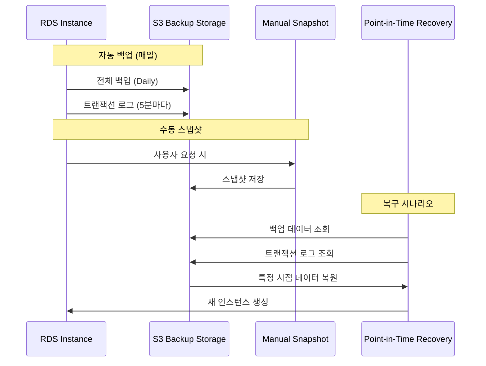
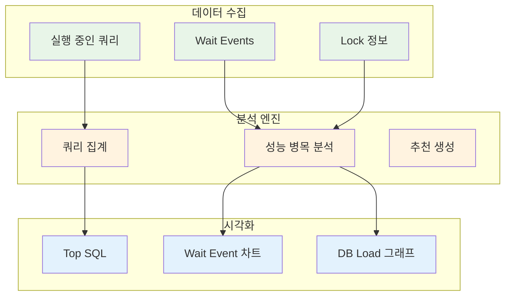
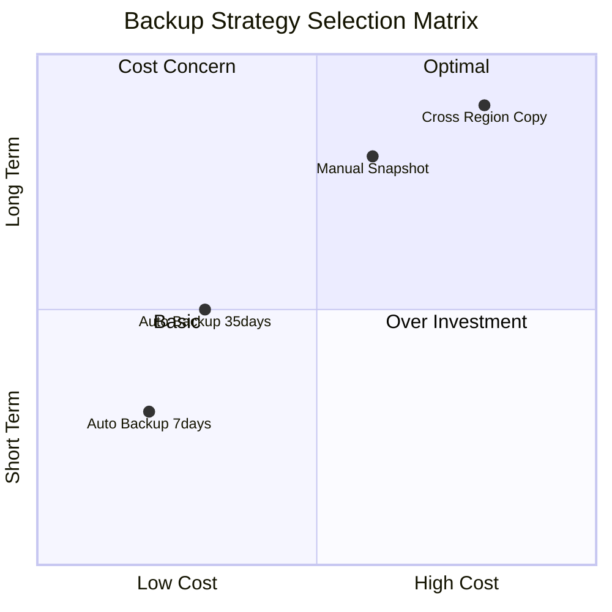
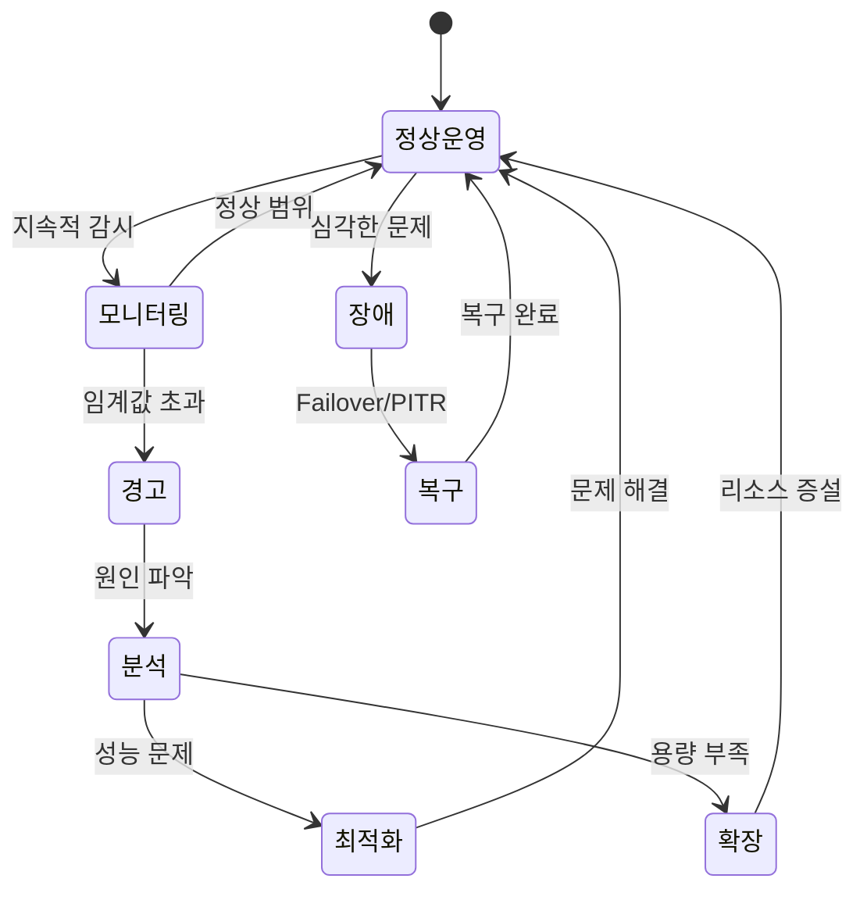
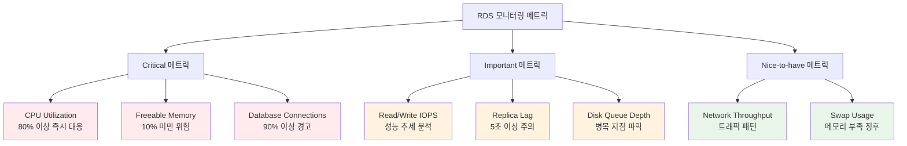
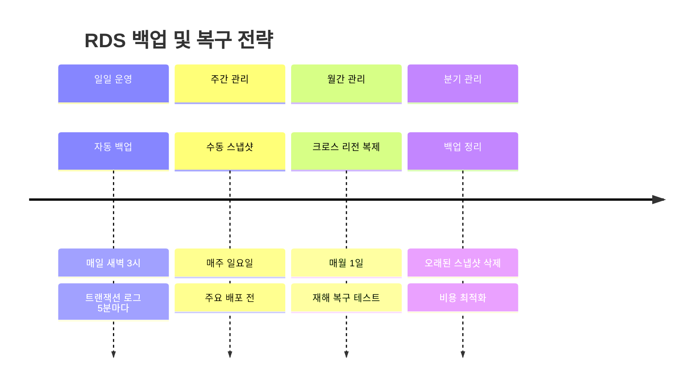

# Week 5 Day 3 Session 2: RDS 운영

<div align="center">

**📊 모니터링** • **💾 백업 & 복구** • **🔧 성능 최적화**

*RDS 운영 전략과 장애 대응*

</div>

---

## 🕘 Session 정보

**시간**: 10:00-10:50 (50분)  
**목표**: RDS 운영 전략 및 모니터링 방법 학습  
**방식**: 이론 학습 + 실무 사례

---

## 🎯 학습 목표

- **모니터링**: CloudWatch 메트릭 및 Performance Insights
- **백업 전략**: 자동 백업, 스냅샷, Point-in-Time Recovery
- **성능 최적화**: 쿼리 튜닝, 인덱스 관리, 파라미터 그룹
- **장애 대응**: Failover 시나리오 및 복구 절차

---

## 📖 서비스 개요

### 1. 생성 배경 (Why?)

#### 어떤 문제를 해결하기 위해 만들어졌는가?

**온프레미스 DB 운영의 문제점**:
- 수동 백업 스크립트 작성 및 관리
- 백업 실패 시 알림 시스템 별도 구축
- 복구 테스트 복잡 (별도 환경 필요)
- 모니터링 도구 설치 및 유지보수
- 성능 분석 도구 라이선스 비용

**EC2 + DB 운영의 한계**:
- CloudWatch 메트릭 수동 설정
- 백업 스토리지 관리 (S3 연동)
- 복구 절차 문서화 및 테스트
- 성능 분석 도구 별도 설치
- 알람 설정 및 관리 복잡

**AWS RDS 솔루션**:
- 자동 백업 (35일 보관, 무료)
- Point-in-Time Recovery (5분 단위)
- CloudWatch 통합 모니터링
- Performance Insights (쿼리 분석)
- 자동 알람 및 이벤트 알림

### 2. 핵심 원리 (How?)

#### RDS 모니터링 아키텍처



#### 백업 및 복구 메커니즘



#### Performance Insights 동작 원리



#### 백업 전략 비교



**전략 설명**:
- **Auto Backup 7days**: 기본 전략, 비용 효율적
- **Auto Backup 35days**: 규정 준수, 중간 비용
- **Manual Snapshot**: 장기 보관, 높은 비용
- **Cross Region Copy**: 재해 복구, 최고 비용

#### RDS 운영 프로세스



#### 모니터링 메트릭 우선순위



#### 백업 및 복구 타임라인



### 3. 주요 사용 사례 (When?)

#### 모니터링 시나리오

**실시간 성능 모니터링**:
- CPU, Memory, IOPS 실시간 추적
- 임계값 초과 시 자동 알람
- 예: CPU 80% 초과 시 SNS 알림

**쿼리 성능 분석**:
- 느린 쿼리 식별 (Performance Insights)
- 인덱스 누락 쿼리 발견
- 예: 1초 이상 쿼리 분석

**용량 계획**:
- 스토리지 사용량 추세 분석
- 연결 수 패턴 파악
- 예: 월별 증가율 예측

#### 백업 및 복구 시나리오

**정기 백업**:
- 매일 자동 백업 (새벽 시간)
- 35일 보관 (규정 준수)
- 예: 금융 서비스 데이터 보관

**장애 복구**:
- 데이터 손상 시 특정 시점 복구
- 잘못된 쿼리 실행 전으로 롤백
- 예: 실수로 DELETE 실행 후 복구

**마이그레이션**:
- 스냅샷으로 다른 리전 복사
- 개발/테스트 환경 생성
- 예: 프로덕션 → 스테이징 복제

### 4. 비슷한 서비스 비교 (Which?)

#### 모니터링 도구 비교

**CloudWatch vs Enhanced Monitoring**:

| 기준 | CloudWatch | Enhanced Monitoring |
|------|------------|---------------------|
| **수집 간격** | 1분 (기본) | 1초 ~ 60초 |
| **메트릭 종류** | DB 엔진 메트릭 | OS 레벨 메트릭 |
| **CPU 상세도** | 전체 CPU | 프로세스별 CPU |
| **메모리 상세도** | 전체 메모리 | 프로세스별 메모리 |
| **비용** | 무료 | 시간당 $0.01 |
| **권장 용도** | 기본 모니터링 | 상세 분석 |

**언제 CloudWatch 사용**:
- 기본 메트릭만 필요
- 비용 최소화
- 간단한 알람 설정

**언제 Enhanced Monitoring 사용**:
- OS 레벨 분석 필요
- 프로세스별 리소스 추적
- 상세한 트러블슈팅

**CloudWatch vs Performance Insights**:

| 기준 | CloudWatch | Performance Insights |
|------|------------|----------------------|
| **초점** | 인프라 메트릭 | 쿼리 성능 |
| **분석 대상** | CPU, Memory, IOPS | SQL 쿼리, Wait Events |
| **시각화** | 기본 차트 | 대화형 대시보드 |
| **쿼리 분석** | 불가 | 가능 (Top SQL) |
| **비용** | 무료 | 7일 무료, 이후 유료 |
| **권장 용도** | 인프라 모니터링 | 쿼리 튜닝 |

**언제 CloudWatch 사용**:
- 인프라 메트릭 중심
- 기본 알람 설정
- 비용 최소화

**언제 Performance Insights 사용**:
- 쿼리 성능 문제 분석
- 데이터베이스 튜닝
- 병목 지점 식별

#### 백업 방식 비교

**자동 백업 vs 수동 스냅샷**:

| 기준 | 자동 백업 | 수동 스냅샷 |
|------|-----------|-------------|
| **생성 방식** | 자동 (매일) | 수동 (사용자 요청) |
| **보관 기간** | 0-35일 | 무제한 |
| **PITR** | 지원 | 미지원 |
| **삭제 시점** | DB 삭제 시 함께 삭제 | 수동 삭제 필요 |
| **비용** | DB 크기만큼 무료 | 스토리지 비용 발생 |
| **권장 용도** | 일상 백업 | 장기 보관 |

**언제 자동 백업 사용**:
- 일상적인 백업
- Point-in-Time Recovery 필요
- 단기 보관 (35일 이내)

**언제 수동 스냅샷 사용**:
- 장기 보관 필요
- 특정 시점 영구 보존
- 다른 리전 복사

### 5. 장단점 분석

#### 장점

**✅ 자동화된 운영**:
- 백업 자동 실행 (실패 시 재시도)
- 패치 자동 적용 (유지보수 창)
- 모니터링 자동 설정

**✅ 통합 모니터링**:
- CloudWatch 통합 (단일 대시보드)
- Performance Insights (쿼리 분석)
- Enhanced Monitoring (OS 메트릭)

**✅ 간편한 복구**:
- Point-in-Time Recovery (5분 단위)
- 스냅샷 복원 (클릭 몇 번)
- 크로스 리전 복사 (재해 복구)

**✅ 비용 효율**:
- 백업 스토리지 무료 (DB 크기만큼)
- CloudWatch 기본 메트릭 무료
- 자동 스토리지 확장 (과다 프로비저닝 방지)

#### 단점/제약사항

**⚠️ 백업 보관 기간 제한**:
- 자동 백업: 최대 35일
- 장기 보관 시 수동 스냅샷 필요

**대안**: 수동 스냅샷으로 장기 보관

**⚠️ 복구 시 다운타임**:
- 새 인스턴스 생성 필요 (10-30분)
- 엔드포인트 변경 필요
- 애플리케이션 재연결 필요

**대안**: Multi-AZ로 Failover 자동화

**⚠️ Performance Insights 비용**:
- 7일 이후 유료 ($0.018/vCPU/hour)
- 장기 데이터 보관 시 비용 증가

**대안**: 필요 시에만 활성화

### 6. 비용 구조 💰

#### 모니터링 비용

**CloudWatch 메트릭**:
```
기본 메트릭: 무료
- CPU, Memory, IOPS, Connections 등
- 1분 간격 수집

커스텀 메트릭: $0.30/메트릭/월
- 사용자 정의 메트릭
- 애플리케이션 메트릭
```

**Enhanced Monitoring**:
```
$0.01/인스턴스/시간
- 1초 ~ 60초 간격 선택
- OS 레벨 메트릭

월 비용 예시:
- 1초 간격: $7.30/월
- 60초 간격: $7.30/월 (동일)
```

**Performance Insights**:
```
7일 보관: 무료
장기 보관: $0.018/vCPU/시간

월 비용 예시:
- db.t3.micro (1 vCPU): $13.14/월
- db.m5.large (2 vCPU): $26.28/월
```

#### 백업 비용

**자동 백업**:
```
DB 크기만큼 무료
- 예: 100GB DB → 100GB 백업 무료

초과분: $0.095/GB-월
- 예: 100GB DB + 50GB 추가 백업 = $4.75/월
```

**수동 스냅샷**:
```
$0.095/GB-월
- 모든 스냅샷 유료
- 예: 100GB 스냅샷 = $9.50/월
```

**크로스 리전 복사**:
```
데이터 전송: $0.02/GB
스토리지: $0.095/GB-월

예시 (100GB 스냅샷):
- 전송 비용: $2.00 (1회)
- 스토리지: $9.50/월
```

#### 비용 최적화 팁

**모니터링 최적화**:
- CloudWatch 기본 메트릭 활용 (무료)
- Enhanced Monitoring 필요 시에만 활성화
- Performance Insights 7일 보관 (무료)

**백업 최적화**:
- 자동 백업 보관 기간 최소화 (7-14일)
- 불필요한 수동 스냅샷 삭제
- 오래된 스냅샷 Glacier로 이동 (수동)

**알람 최적화**:
- 필수 메트릭만 알람 설정
- SNS 대신 CloudWatch Logs 활용
- Lambda로 자동 대응 (알람 감소)

### 7. 최신 업데이트 🆕

#### 2024년 주요 변경사항

**RDS Extended Support** (2024.02):
- 표준 지원 종료 후 3년 추가 지원
- PostgreSQL 11, MySQL 5.7 등
- 추가 비용 발생 (시간당 요금)

**Automated Backups Replication** (2024.05):
- 자동 백업을 다른 리전으로 복제
- 재해 복구 시간 단축
- 크로스 리전 PITR 지원

**CloudWatch Anomaly Detection** (2024.08):
- ML 기반 이상 탐지
- 자동 임계값 조정
- 거짓 알람 감소

#### 2025년 예정

**Intelligent Backup Scheduling**:
- 워크로드 패턴 분석
- 최적 백업 시간 자동 선택

**Predictive Scaling**:
- ML 기반 용량 예측
- 자동 스케일링 권장

**참조**: [AWS RDS What's New](https://aws.amazon.com/rds/whats-new/)

---

## 📊 실습 연계

### Lab 1에서 활용

**모니터링 설정**:
- CloudWatch 대시보드 생성
- CPU, Memory 알람 설정
- Performance Insights 활성화

**백업 설정**:
- 자동 백업 활성화 (7일 보관)
- 수동 스냅샷 생성
- Point-in-Time Recovery 테스트

**주의사항**:
- Enhanced Monitoring 비용 발생
- Performance Insights 7일 이후 유료
- 스냅샷 삭제 확인 (비용 절감)

---

## 🔗 공식 문서 (필수)

**⚠️ 학생들이 직접 확인해야 할 공식 문서**:
- 📘 [RDS 모니터링](https://docs.aws.amazon.com/AmazonRDS/latest/UserGuide/CHAP_Monitoring.html)
- 📗 [백업 및 복원](https://docs.aws.amazon.com/AmazonRDS/latest/UserGuide/CHAP_CommonTasks.BackupRestore.html)
- 📙 [Performance Insights](https://docs.aws.amazon.com/AmazonRDS/latest/UserGuide/USER_PerfInsights.html)
- 📕 [CloudWatch 통합](https://docs.aws.amazon.com/AmazonRDS/latest/UserGuide/monitoring-cloudwatch.html)
- 🆕 [RDS 최신 기능](https://aws.amazon.com/rds/features/)

---

## 🔑 핵심 키워드

- **CloudWatch**: AWS 통합 모니터링 서비스
- **Enhanced Monitoring**: OS 레벨 상세 모니터링
- **Performance Insights**: 쿼리 성능 분석 도구
- **Automated Backup**: 자동 백업 (35일 보관)
- **Manual Snapshot**: 수동 스냅샷 (무제한 보관)
- **Point-in-Time Recovery (PITR)**: 특정 시점 복구
- **DB Parameter Group**: 데이터베이스 설정 그룹
- **Maintenance Window**: 유지보수 시간대
- **Event Notification**: 이벤트 알림 (SNS)

---

<div align="center">

**📊 실시간 모니터링** • **💾 자동 백업** • **🔧 성능 최적화** • **🚨 장애 대응**

*RDS 운영 자동화로 관리 부담 90% 감소*

</div>
