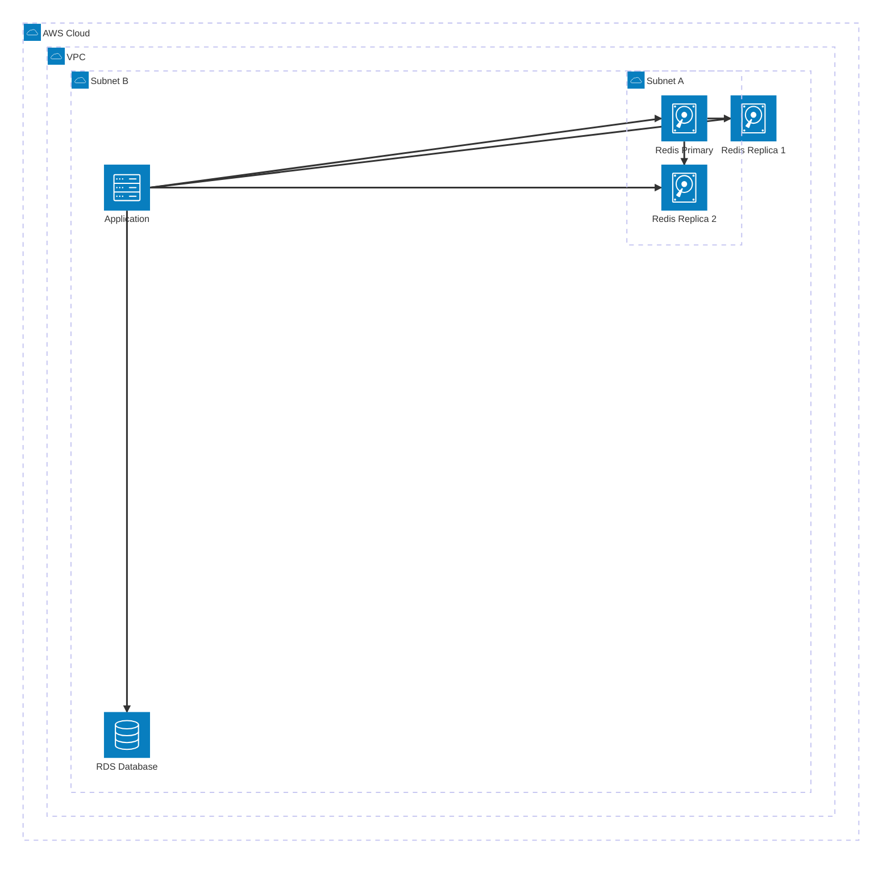
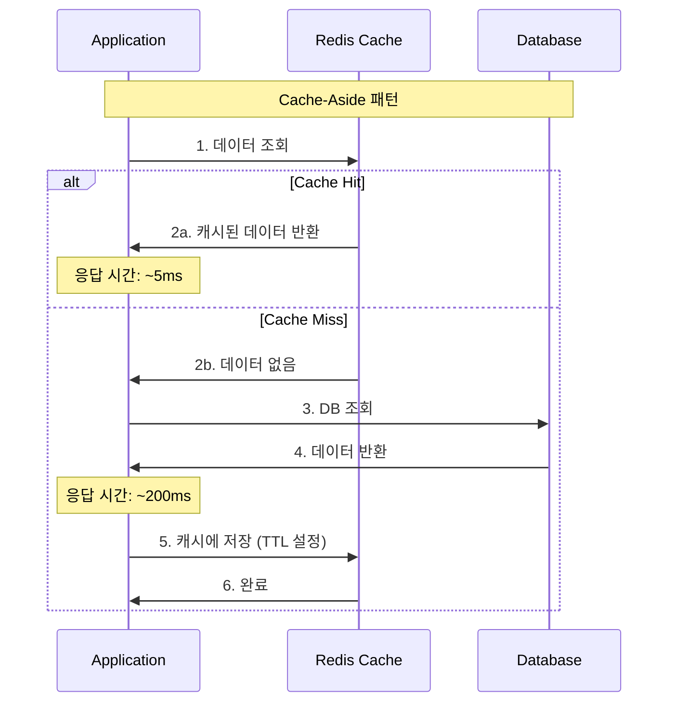
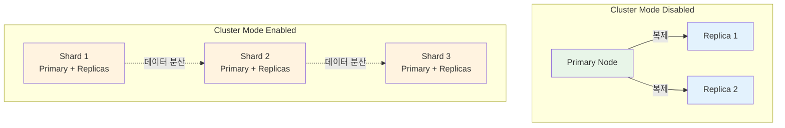
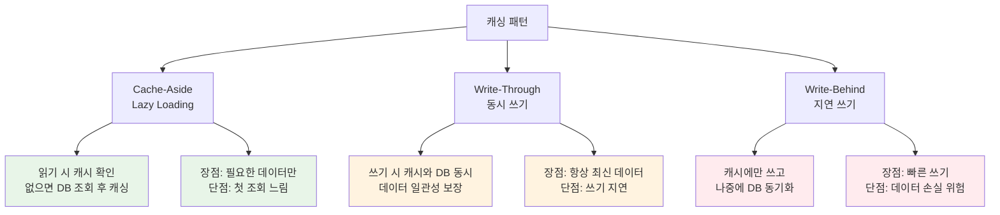
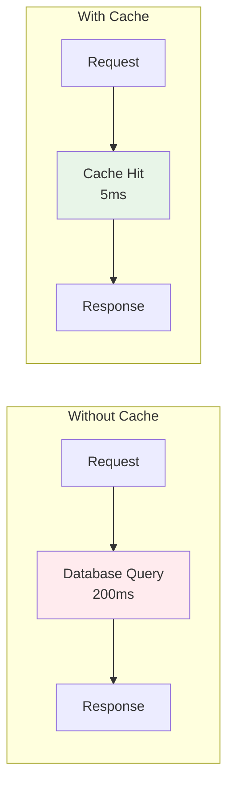
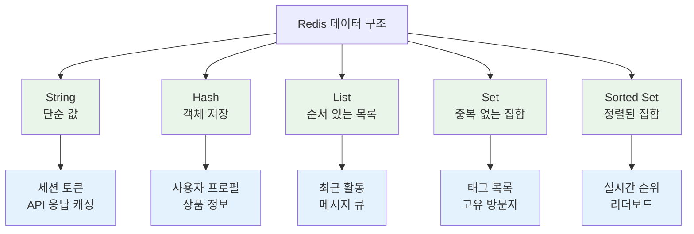
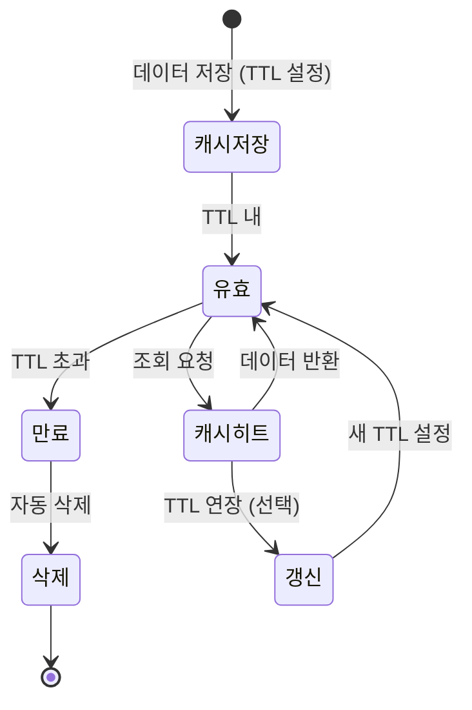
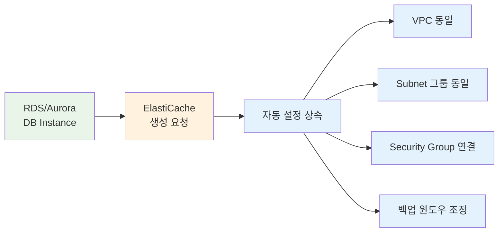

# Week 5 Day 3 Session 3: ElastiCache Redis

<div align="center">

**⚡ 인메모리 캐싱** • **🚀 성능 최적화** • **📊 세션 관리**

*ElastiCache Redis로 응답 속도 100배 향상*

</div>

---

## 🕘 Session 정보

**시간**: 11:00-11:50 (50분)  
**목표**: ElastiCache Redis 아키텍처 및 캐싱 전략 학습  
**방식**: 이론 학습 + 실무 패턴

---

## 🎯 학습 목표

- **캐싱 개념**: 인메모리 캐싱의 원리와 장점
- **Redis 아키텍처**: ElastiCache Redis 구조 이해
- **캐싱 패턴**: Cache-Aside, Write-Through, Write-Behind
- **실무 활용**: 세션 관리, API 캐싱, 실시간 순위

---

## 📖 서비스 개요

### 1. 생성 배경 (Why?)

#### 어떤 문제를 해결하기 위해 만들어졌는가?

**데이터베이스 병목 현상**:
- 동일한 데이터를 반복 조회 (상품 정보, 사용자 프로필)
- DB 부하 증가 → 응답 시간 지연
- 읽기 성능 한계 (디스크 I/O)
- 예: 인기 상품 조회 시 DB 과부하

**세션 관리의 어려움**:
- 서버 재시작 시 세션 손실
- 로드밸런서 환경에서 세션 공유 문제
- 세션 데이터 동기화 복잡
- 예: 다중 서버 환경에서 로그인 상태 유지

**실시간 데이터 처리 필요**:
- 실시간 순위, 카운터, 리더보드
- 빠른 응답 속도 요구 (밀리초 단위)
- 높은 동시성 처리
- 예: 게임 실시간 랭킹, 좋아요 카운터

**AWS ElastiCache 솔루션**:
- 인메모리 캐싱으로 응답 속도 100배 향상
- 관리형 서비스로 운영 부담 제거
- 자동 장애 복구 및 백업
- **Valkey, Redis OSS, Memcached** 선택 가능
- **RDS/Aurora와 원클릭 통합** (자동 설정 상속)

#### ElastiCache for Valkey - 최신 엔진

**Valkey란?**:
- 오픈소스 고성능 Key-Value 데이터스토어
- Redis OSS의 드롭인 대체재
- 40개 이상 기업이 후원하는 커뮤니티 프로젝트
- 2024년 3월 출시 이후 빠른 성장

**Valkey의 장점**:
- **33% 저렴한 Serverless 가격** (Redis OSS 대비)
- **20% 저렴한 노드 기반 가격**
- **최소 100MB 데이터 스토리지** (Redis OSS 대비 90% 낮음)
- **제로 다운타임 업그레이드** (Redis OSS → Valkey)
- **기존 Reserved Node 요금 유지**

**출처**: [Amazon ElastiCache for Valkey 발표](https://aws.amazon.com/about-aws/whats-new/2024/10/amazon-elasticache-valkey/)

### 2. 핵심 원리 (How?)

#### ElastiCache Redis 아키텍처



#### 캐싱 동작 원리



#### Redis 클러스터 모드



#### 캐싱 패턴 비교



#### 캐시 성능 비교



**성능 개선**:
- **응답 시간**: 200ms → 5ms (40배 빠름)
- **DB 부하**: 90% 감소
- **처리량**: 10배 증가

#### Redis 데이터 구조 활용



#### TTL 전략



**TTL 설정 가이드**:
- **정적 데이터**: 1시간 ~ 1일 (상품 정보, 카테고리)
- **동적 데이터**: 5분 ~ 30분 (재고, 가격)
- **실시간 데이터**: 10초 ~ 1분 (순위, 카운터)
- **세션 데이터**: 30분 ~ 2시간 (로그인 세션)

### 3. 주요 사용 사례 (When?)

#### 적합한 워크로드

**API 응답 캐싱**:
- 자주 조회되는 데이터 (상품 목록, 카테고리)
- 계산 비용이 높은 결과 (집계, 통계)
- 예: E-Commerce 상품 검색 결과

**세션 관리**:
- 사용자 로그인 세션
- 장바구니 데이터
- 예: 다중 서버 환경의 세션 공유

**실시간 분석**:
- 실시간 순위, 리더보드
- 좋아요, 조회수 카운터
- 예: 게임 랭킹, 인기 게시물

**메시지 큐**:
- 비동기 작업 큐
- 이벤트 스트림
- 예: 이메일 발송 큐, 알림 처리

#### 실제 업계 활용 사례

**Twitter**:
- 타임라인 캐싱으로 응답 속도 50배 향상
- Redis Sorted Set으로 실시간 트렌딩 토픽
- 초당 수백만 건의 읽기 처리

**Pinterest**:
- 사용자 피드 캐싱
- Redis로 추천 알고리즘 결과 저장
- DB 부하 80% 감소

**Airbnb**:
- 검색 결과 캐싱 (위치, 날짜별)
- 세션 스토어로 Redis 사용
- 예약 가능 여부 실시간 업데이트

### 4. 비슷한 서비스 비교 (Which?)

#### Redis vs Memcached

| 기준 | Redis | Memcached |
|------|-------|-----------|
| **데이터 구조** | String, Hash, List, Set, Sorted Set | Key-Value만 |
| **영속성** | 디스크 저장 가능 (RDB, AOF) | 메모리만 |
| **복제** | Master-Replica 지원 | 미지원 |
| **트랜잭션** | 지원 | 미지원 |
| **Pub/Sub** | 지원 | 미지원 |
| **멀티스레드** | 단일 스레드 | 멀티스레드 |
| **사용 사례** | 복잡한 데이터, 세션, 순위 | 단순 캐싱 |

**언제 Redis 사용**:
- 복잡한 데이터 구조 필요
- 데이터 영속성 필요
- Pub/Sub 메시징 필요
- 실시간 순위, 리더보드

**언제 Memcached 사용**:
- 단순 Key-Value 캐싱
- 멀티스레드 성능 필요
- 메모리 효율 최우선

#### Valkey vs Redis OSS

| 기준 | Valkey | Redis OSS |
|------|--------|-----------|
| **라이선스** | BSD 3-Clause | AGPLv3 (제한적) |
| **커뮤니티** | 40+ 기업 후원 | Redis Ltd. 주도 |
| **호환성** | Redis OSS 완전 호환 | - |
| **ElastiCache 가격** | 33% 저렴 (Serverless) | 기준 가격 |
| **최소 스토리지** | 100MB | 1GB |
| **업그레이드** | 제로 다운타임 | - |
| **성능** | Valkey 8.0: 5M RPS | - |

**언제 Valkey 사용**:
- 비용 최적화 우선
- 오픈소스 라이선스 중요
- 최신 성능 개선 필요
- 새로운 프로젝트 시작

**언제 Redis OSS 사용**:
- 기존 Redis OSS 사용 중
- 특정 Redis 모듈 필요
- 점진적 마이그레이션 계획

**출처**: [ElastiCache for Valkey 발표](https://aws.amazon.com/about-aws/whats-new/2024/10/amazon-elasticache-valkey/)

#### RDS/Aurora와 ElastiCache 통합

**원클릭 캐시 생성**:
- RDS/Aurora 콘솔에서 직접 ElastiCache 생성
- 네트워크 및 보안 설정 자동 상속
- VPC, Subnet, Security Group 자동 구성
- 수동 설정 없이 즉시 사용 가능

**자동 설정 상속**:


**지원 엔진**:
- **Valkey** (권장): 최저 비용, 최고 성능
- **Redis OSS**: 기존 호환성
- **Memcached**: 단순 캐싱

**배포 옵션**:
- **Serverless**: 자동 스케일링, 사용량 기반 과금
- **Custom Cache**: 노드 타입/개수 직접 선택

**출처**: [RDS에서 ElastiCache 생성](https://docs.aws.amazon.com/AmazonRDS/latest/UserGuide/creating-elasticache-cluster-with-RDS-settings.html)

#### ElastiCache vs 자체 구축 Redis

| 기준 | ElastiCache | 자체 구축 Redis |
|------|-------------|-----------------|
| **설치/설정** | 자동 (클릭 몇 번) | 수동 (서버 설정) |
| **패치/업그레이드** | 자동 | 수동 |
| **백업** | 자동 (스냅샷) | 수동 스크립트 |
| **모니터링** | CloudWatch 통합 | 별도 도구 설치 |
| **고가용성** | Multi-AZ 자동 | 수동 구성 |
| **확장** | 클릭으로 확장 | 수동 샤딩 |
| **비용** | 시간당 과금 | EC2 + 관리 비용 |

**언제 ElastiCache 사용**:
- 관리 부담 최소화
- 자동 백업/복구 필요
- 빠른 확장 필요

**언제 자체 구축 사용**:
- 완전한 제어 필요
- 특수한 Redis 모듈 사용
- 비용 최적화 최우선

### 5. 장단점 분석

#### 장점

**✅ 극도로 빠른 성능**:
- 인메모리 저장 (디스크 I/O 없음)
- 응답 시간 밀리초 단위
- 초당 수십만 건 처리

**✅ 다양한 데이터 구조**:
- String, Hash, List, Set, Sorted Set
- 복잡한 데이터 모델링 가능
- 애플리케이션 로직 단순화

**✅ 고가용성**:
- Multi-AZ 자동 Failover
- 자동 백업 및 복구
- 99.9% SLA

**✅ 관리 자동화**:
- 패치 자동 적용
- 모니터링 통합
- 확장 간편

#### 단점/제약사항

**⚠️ 메모리 제한**:
- 메모리 크기만큼만 저장 가능
- 대용량 데이터 부적합
- 메모리 부족 시 데이터 삭제 (Eviction)

**대안**: 적절한 TTL 설정, 중요 데이터만 캐싱

**⚠️ 데이터 손실 위험**:
- 메모리 기반 (휘발성)
- 재시작 시 데이터 손실 가능
- 백업 간격 동안 데이터 손실

**대안**: RDB/AOF 영속성 활성화, 중요 데이터는 DB에 저장

**⚠️ 캐시 일관성**:
- 캐시와 DB 데이터 불일치 가능
- TTL 만료 전 DB 변경 시 문제
- 캐시 무효화 전략 필요

**대안**: 적절한 TTL, Write-Through 패턴

**⚠️ 비용**:
- 메모리 비용 (GB당)
- 24/7 실행 시 비용 증가
- 대용량 캐시 시 고비용

**대안**: Reserved Node로 40% 절감, 적절한 캐시 크기

### 6. 비용 구조 💰

#### 노드 비용 (시간당)

**On-Demand 가격**:
```
cache.t3.micro (0.5GB)
- $0.017/hour
- 월: $12.41

cache.t3.small (1.4GB)
- $0.034/hour
- 월: $24.82

cache.m5.large (6.38GB)
- $0.162/hour
- 월: $118.26

cache.r5.large (13.07GB)
- $0.188/hour
- 월: $137.24
```

**Reserved Node (1년 약정)**:
```
cache.m5.large
- On-Demand: $118.26/월
- Reserved: $70.96/월 (40% 절감)

cache.r5.large
- On-Demand: $137.24/월
- Reserved: $82.34/월 (40% 절감)
```

#### 백업 비용

```
스냅샷 스토리지: $0.085/GB-월
- 예: 10GB 스냅샷 = $0.85/월
- 자동 백업 1개 무료
```

#### 데이터 전송 비용

```
인바운드: 무료
아웃바운드: $0.09/GB (첫 10TB)
같은 AZ 내: 무료
다른 AZ: $0.01/GB
```

#### 비용 최적화 팁

**노드 크기 최적화**:
- CloudWatch 메모리 사용률 모니터링
- 사용률 < 50%: 다운사이징
- 사용률 > 80%: 업사이징

**Reserved Node 활용**:
- 1년 약정: 40% 절감
- 3년 약정: 60% 절감
- 프로덕션 환경 필수

**TTL 전략**:
- 적절한 TTL로 메모리 효율화
- 불필요한 데이터 자동 삭제
- 메모리 부족 방지

**Multi-AZ 선택적 사용**:
- 프로덕션: Multi-AZ 필수
- 개발/테스트: Single-AZ로 비용 절감

#### 예상 비용 계산

**소규모 웹 애플리케이션**:
```
cache.t3.micro (0.5GB)
- 노드: $0.017/hour × 730시간 = $12.41
- 백업: 무료 (1개)
월 합계: $12.41

Reserved (1년): $7.45/월 (40% 절감)
```

**중규모 E-Commerce**:
```
cache.m5.large (6.38GB) Multi-AZ
- Primary: $0.162/hour × 730시간 = $118.26
- Replica: $0.162/hour × 730시간 = $118.26
- 백업: 5GB × $0.085 = $0.43
월 합계: $236.95

Reserved (1년): $142.17/월 (40% 절감)
```

### 7. 최신 업데이트 🆕

#### 2024년 주요 변경사항

**ElastiCache for Valkey 출시** (2024.10):
- 오픈소스 Valkey 엔진 지원
- Serverless 가격 33% 저렴
- 노드 기반 가격 20% 저렴
- 최소 스토리지 100MB (90% 감소)
- 제로 다운타임 업그레이드 (Redis OSS → Valkey)
- **출처**: [ElastiCache for Valkey 발표](https://aws.amazon.com/about-aws/whats-new/2024/10/amazon-elasticache-valkey/)

**Valkey 8.0 지원** (2024.11):
- **5배 빠른 스케일링**: 5M RPS까지 확장 (Valkey 7.2 대비)
- **메모리 효율 개선**: 키당 32바이트 절감
- **마이크로초 읽기 지연**: 극도로 빠른 응답
- AWS의 오픈소스 기여 반영
- **출처**: [Valkey 8.0 발표](https://aws.amazon.com/about-aws/whats-new/2024/11/elasticache-version-8-0-for-valkey-scaling-memory-efficiency/)

**RDS/Aurora 통합 캐시 생성** (2024.06):
- RDS 콘솔에서 직접 ElastiCache 생성
- 네트워크/보안 설정 자동 상속
- Serverless 및 Custom Cache 선택
- **출처**: [RDS ElastiCache 통합](https://docs.aws.amazon.com/AmazonRDS/latest/UserGuide/creating-elasticache-cluster-with-RDS-settings.html)

**서버 측 지연 모니터링** (2024.09):
- `SuccessfulReadRequestLatency` 메트릭
- `SuccessfulWriteRequestLatency` 메트릭
- 마이크로초 단위 정밀 측정
- Valkey 7.2 이상 지원
- **출처**: [서버 측 지연 모니터링](https://aws.amazon.com/blogs/database/monitor-server-side-latency-for-amazon-elasticache-for-valkey/)

**Data Tiering 개선** (2024.08):
- SSD를 활용한 메모리 확장
- 비용 절감 (메모리 대비 70%)
- 대용량 데이터 캐싱 가능
- `BytesReadFromDisk`, `BytesWrittenToDisk` 메트릭

**Auto Scaling 강화** (2024.07):
- Valkey 및 Redis OSS 클러스터 지원
- Shard 및 Replica 자동 조정
- Target Tracking 정책
- Scheduled Scaling 지원
- **출처**: [Auto Scaling 문서](https://docs.aws.amazon.com/AmazonElastiCache/latest/dg/AutoScaling.html)

#### 2025년 예정

**Serverless ElastiCache 확장**:
- 더 빠른 자동 스케일링
- 더 낮은 최소 비용
- 더 많은 리전 지원

**AI 기반 캐시 최적화**:
- 자동 TTL 추천
- 캐시 히트율 최적화
- 워크로드 패턴 분석

**Global Datastore 개선**:
- 더 낮은 복제 지연
- 자동 Failover 강화
- 더 많은 리전 지원

**참조**: 
- [ElastiCache What's New](https://aws.amazon.com/elasticache/whats-new/)
- [Valkey 사용 사례](https://aws.amazon.com/blogs/database/from-caching-to-real-time-analytics-essential-use-cases-for-amazon-elasticache-for-valkey/)

---

## 📊 실습 연계

### Lab 2에서 활용

**구현 내용**:
- ElastiCache Redis 클러스터 생성
- 애플리케이션 연동 (Node.js/Python)
- Cache-Aside 패턴 구현
- 성능 비교 (캐시 유무)

**주의사항**:
- Security Group 설정 (EC2 → Redis)
- Redis 엔드포인트 확인
- 연결 테스트 필수
- 비용 발생 (시간당 과금)

---

## 🔗 공식 문서 (필수)

**⚠️ 학생들이 직접 확인해야 할 공식 문서**:
- 📘 [ElastiCache란 무엇인가?](https://docs.aws.amazon.com/AmazonElastiCache/latest/red-ug/WhatIs.html)
- 📗 [Redis 사용자 가이드](https://docs.aws.amazon.com/AmazonElastiCache/latest/red-ug/)
- 📙 [캐싱 전략](https://docs.aws.amazon.com/AmazonElastiCache/latest/red-ug/Strategies.html)
- 📕 [ElastiCache 요금](https://aws.amazon.com/elasticache/pricing/)
- 🆕 [ElastiCache 최신 기능](https://aws.amazon.com/elasticache/features/)

---

## 🔑 핵심 키워드

- **ElastiCache**: AWS 관리형 인메모리 캐싱 서비스
- **Redis**: 고성능 Key-Value 스토어
- **Cache-Aside**: 읽기 시 캐시 확인 후 DB 조회
- **Write-Through**: 쓰기 시 캐시와 DB 동시 업데이트
- **TTL (Time To Live)**: 캐시 데이터 만료 시간
- **Eviction Policy**: 메모리 부족 시 데이터 삭제 정책
- **Replication**: Primary-Replica 복제
- **Cluster Mode**: 데이터 샤딩 및 분산
- **Pub/Sub**: 메시지 발행/구독 패턴

---

## 💡 Session 마무리

### ✅ 오늘 Session 성과
- **캐싱 개념**: 인메모리 캐싱의 원리와 성능 향상 효과 (100배)
- **Redis 아키텍처**: ElastiCache Redis 구조 및 복제 메커니즘
- **캐싱 패턴**: Cache-Aside, Write-Through, Write-Behind 전략
- **실무 활용**: 세션 관리, API 캐싱, 실시간 데이터 처리
- **최신 기술**: Valkey 엔진 및 RDS/Aurora 통합 기능

### 🎯 다음 Lab 준비
- **Lab 1**: RDS PostgreSQL 구성 - Multi-AZ 및 백업 설정
- **Lab 2**: ElastiCache Redis 연동 - 캐싱 계층 구축
- **통합 아키텍처**: RDS + ElastiCache 3-Tier 구조
- **성능 비교**: 캐시 적용 전후 응답 시간 측정

### 📚 복습 포인트
- **캐싱이 필요한 상황**: 반복 조회, 계산 비용 높은 데이터
- **적절한 TTL 설정**: 데이터 특성에 맞는 만료 시간
- **캐시 무효화 전략**: 데이터 변경 시 캐시 갱신 방법
- **비용 최적화**: Reserved Node, 적정 크기 선택

---

<div align="center">

**⚡ 100배 빠른 응답** • **📊 다양한 데이터 구조** • **🔄 자동 복제** • **💰 비용 효율**

*ElastiCache Redis로 DB 부하 90% 감소*

</div>
