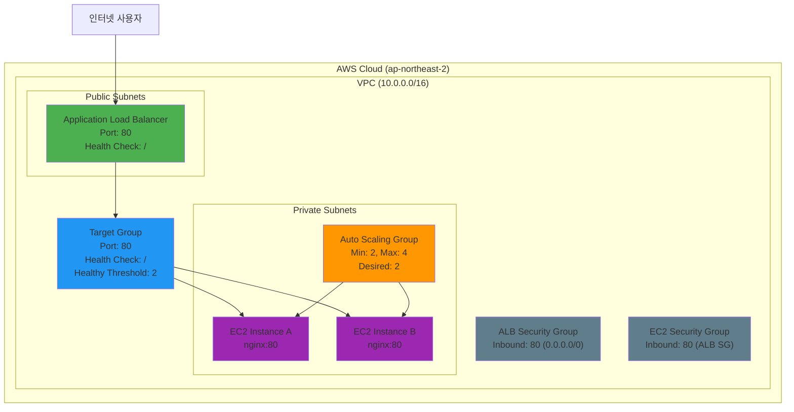

# Week 5 Day 4 Challenge 1: ALB + ASG 장애 진단 및 복구

<div align="center">

**🔍 문제 찾기** • **🔧 해결하기** • **📸 증명하기** • **🧹 정리하기**

*실무 디버깅 능력을 키우는 Challenge*

</div>

---

## 🕘 Challenge 정보
**시간**: 15:15-16:05 (50분)
**목표**: 장애 진단 및 해결 능력 향상
**방식**: AWS Web Console 중심 실습
**난이도**: ⭐⭐⭐

## 🎯 Challenge 목표
### 📚 학습 목표
- ALB 설정 오류 진단 능력
- Target Group Health Check 이해
- Auto Scaling 정책 설정 이해
- Launch Template 설정 검증

### 🛠️ 실무 역량
- AWS Console 디버깅 능력
- 체계적 문제 해결 프로세스
- 장애 대응 및 복구 경험

---

## 🚨 Challenge 시나리오: "급하게 배포된 웹 서비스"

### 📖 배경 상황
**시나리오**: 
E-Commerce 스타트업 "FastShop"의 인프라 담당자가 급하게 ALB + ASG 환경을 배포했습니다.
하지만 사용자들이 웹사이트에 접속할 수 없다는 불만이 쏟아지고 있습니다.

**긴급도**: 🔴 **Critical**
**영향도**: 💰 **High** (서비스 중단)
**제한시간**: ⏰ **50분**

**당신의 임무**:
1. 배포된 ALB + ASG의 문제점 찾기
2. 문제 수정하기
3. 정상 작동 증명하기
4. 스크린샷으로 결과 공유하기

---

## 🏗️ 목표 아키텍처

### 📐 정상 작동하는 아키텍처 (성공 기준)



**핵심 구성 요소**:
- **ALB**: HTTP(80) 포트로 트래픽 수신
- **Target Group**: Health Check 경로 `/`, 포트 80
- **Auto Scaling Group**: 최소 2개, 최대 4개 인스턴스
- **EC2 Instances**: nginx 웹 서버 실행 (포트 80)
- **Security Groups**: 적절한 포트 오픈

💡 **힌트**: 위 다이어그램과 실제 배포된 환경을 비교해보세요!

---

## 🔧 Challenge 환경 배포

⚠️ **주의**: 다음 단계는 **의도적으로 문제가 있는 설정**입니다.

### Step 1: VPC 및 Subnet 생성 (5분)

**AWS Console 경로**:
```
AWS Console → VPC → Create VPC
```

**VPC 설정**:
| 항목 | 값 |
|------|-----|
| Name | challenge-vpc |
| IPv4 CIDR | 10.0.0.0/16 |

**Subnet 설정** (4개 생성):
| 이름 | AZ | CIDR | 타입 |
|------|-----|------|------|
| challenge-public-a | ap-northeast-2a | 10.0.1.0/24 | Public |
| challenge-public-b | ap-northeast-2b | 10.0.2.0/24 | Public |
| challenge-private-a | ap-northeast-2a | 10.0.11.0/24 | Private |
| challenge-private-b | ap-northeast-2b | 10.0.12.0/24 | Private |

**Internet Gateway 및 NAT Gateway 설정**:
- Internet Gateway: challenge-igw
- NAT Gateway: challenge-nat (Public Subnet A에 배치)

**Route Tables**:
- Public RT: 0.0.0.0/0 → IGW
- Private RT: 0.0.0.0/0 → NAT Gateway

**이미지 자리**: VPC 및 네트워크 구성 완료

---

### Step 2: Security Groups 생성 (5분)

#### 2-1. ALB Security Group (의도적 오류)

**AWS Console 경로**:
```
AWS Console → EC2 → Security Groups → Create security group
```

**기본 설정**:
| 항목 | 값 |
|------|-----|
| Security group name | challenge-alb-sg |
| Description | Challenge ALB Security Group |
| VPC | challenge-vpc |

**⚠️ Inbound Rules (의도적 오류)**:
| Type | Protocol | Port Range | Source | Description |
|------|----------|------------|--------|-------------|
| HTTP | TCP | **8080** | 0.0.0.0/0 | HTTP from anywhere |

**이미지 자리**: ALB Security Group (잘못된 포트)

**💡 힌트**: ALB는 어떤 포트로 트래픽을 받아야 할까요?

---

#### 2-2. EC2 Security Group (의도적 오류)

**기본 설정**:
| 항목 | 값 |
|------|-----|
| Security group name | challenge-web-sg |
| Description | Challenge Web Security Group |
| VPC | challenge-vpc |

**⚠️ Inbound Rules (의도적 오류)**:
| Type | Protocol | Port Range | Source | Description |
|------|----------|------------|--------|-------------|
| HTTP | TCP | 80 | **0.0.0.0/0** | HTTP from anywhere |

**이미지 자리**: EC2 Security Group (잘못된 소스)

**💡 힌트**: EC2는 어디서 오는 트래픽만 받아야 할까요?

---

### Step 3: Target Group 생성 (5분)

**AWS Console 경로**:
```
AWS Console → EC2 → Target Groups → Create target group
```

**기본 설정**:
| 항목 | 값 |
|------|-----|
| Target type | Instances |
| Target group name | challenge-web-tg |
| Protocol | HTTP |
| Port | 80 |
| VPC | challenge-vpc |

**⚠️ Health checks (의도적 오류)**:
| 항목 | 값 |
|------|-----|
| Health check protocol | HTTP |
| Health check path | **/health** ⚠️ |
| Health check port | Traffic port |
| Healthy threshold | 2 |
| Unhealthy threshold | 2 |
| Timeout | 5 seconds |
| Interval | 30 seconds |

**이미지 자리**: Target Group Health Check 설정 (잘못된 경로)

**💡 힌트**: nginx 기본 설치 시 `/health` 경로가 존재할까요?

---

### Step 4: Application Load Balancer 생성 (5분)

**AWS Console 경로**:
```
AWS Console → EC2 → Load Balancers → Create load balancer → Application Load Balancer
```

**기본 설정**:
| 항목 | 값 |
|------|-----|
| Load balancer name | challenge-alb |
| Scheme | Internet-facing |
| IP address type | IPv4 |

**네트워크 매핑**:
| 항목 | 값 |
|------|-----|
| VPC | challenge-vpc |
| Mappings | ap-northeast-2a: challenge-public-a<br/>ap-northeast-2b: challenge-public-b |

**Security groups**:
- challenge-alb-sg

**Listeners and routing**:
| 항목 | 값 |
|------|-----|
| Protocol | HTTP |
| Port | 80 |
| Default action | Forward to challenge-web-tg |

**이미지 자리**: ALB 생성 완료

---

### Step 5: Launch Template 생성 (10분)

**AWS Console 경로**:
```
AWS Console → EC2 → Launch Templates → Create launch template
```

**기본 설정**:
| 항목 | 값 |
|------|-----|
| Launch template name | challenge-web-template |
| Template version description | Web server template |

**AMI 및 인스턴스 타입**:
| 항목 | 값 |
|------|-----|
| AMI | Amazon Linux 2023 |
| Instance type | t3.micro |

**네트워크 설정**:
| 항목 | 값 |
|------|-----|
| Subnet | Don't include in launch template |
| Security groups | challenge-web-sg |

**⚠️ User data (의도적 오류)**:
```bash
#!/bin/bash
yum update -y
yum install -y nginx

cat <<EOF > /usr/share/nginx/html/index.html
<!DOCTYPE html>
<html>
<head>
    <title>Challenge Web Server</title>
</head>
<body>
    <h1>Challenge Web Server</h1>
    <p>Instance ID: <span id="instance-id">Loading...</span></p>
    <script>
        fetch('http://169.254.169.254/latest/meta-data/instance-id')
            .then(response => response.text())
            .then(data => document.getElementById('instance-id').textContent = data);
    </script>
</body>
</html>
EOF
```

**이미지 자리**: Launch Template User Data

**💡 힌트**: nginx를 설치만 하고 시작하지 않으면 어떻게 될까요?

---

### Step 6: Auto Scaling Group 생성 (10분)

**AWS Console 경로**:
```
AWS Console → EC2 → Auto Scaling Groups → Create Auto Scaling group
```

**1단계: Launch template**:
| 항목 | 값 |
|------|-----|
| Auto Scaling group name | challenge-web-asg |
| Launch template | challenge-web-template |

**2단계: Network**:
| 항목 | 값 |
|------|-----|
| VPC | challenge-vpc |
| Subnets | challenge-private-a, challenge-private-b |

**3단계: Load balancing**:
| 항목 | 값 |
|------|-----|
| Load balancing | Attach to an existing load balancer |
| Target group | challenge-web-tg |
| Health check type | ELB |
| Health check grace period | 300 seconds |

**⚠️ 4단계: Group size (의도적 오류)**:
| 항목 | 값 |
|------|-----|
| Desired capacity | **1** ⚠️ |
| Minimum capacity | **1** ⚠️ |
| Maximum capacity | 4 |

**이미지 자리**: ASG 그룹 크기 설정 (최소 1개)

**💡 힌트**: 고가용성을 위해서는 최소 몇 개의 인스턴스가 필요할까요?

**Scaling policies**:
| 항목 | 값 |
|------|-----|
| Scaling policy | Target tracking scaling policy |
| Metric type | Average CPU utilization |
| Target value | 70 |

**5단계: Tags**:
| Key | Value |
|-----|-------|
| Name | challenge-web-server |

**이미지 자리**: ASG 생성 완료

---

---

## 🔍 발견해야 할 문제들 (시나리오)

### 문제 1: "ALB로 접속이 안 돼요!"
**증상**: 
- 브라우저에서 ALB DNS 주소로 접속 시도
- 연결 시간 초과 또는 연결 거부 오류 발생

**확인해야 할 것**:
- ALB는 어떤 포트로 트래픽을 받아야 하나요?
- 사용자들은 일반적으로 웹사이트에 접속할 때 어떤 포트를 사용하나요?
- ALB Security Group의 Inbound Rules를 확인해보세요

**💡 힌트**: HTTP의 기본 포트는?

---

### 문제 2: "Target Group에서 인스턴스가 Unhealthy 상태예요!"
**증상**:
- Target Group의 Targets 탭에서 모든 인스턴스가 `unhealthy` 상태
- Health check status: `Health checks failed`

**확인해야 할 것**:
- Health Check가 어떤 경로를 확인하고 있나요?
- nginx 기본 설치 시 어떤 경로가 실제로 존재하나요?
- `/health` 경로가 실제로 있나요?

**💡 힌트**: nginx 기본 페이지는 어떤 경로에 있을까요?

---

### 문제 3: "EC2 인스턴스에서 웹 서버가 안 떠요!"
**증상**:
- EC2 인스턴스에 SSH 접속 후 확인
- `curl localhost` 실행 시 연결 거부
- `systemctl status nginx` 실행 시 inactive (dead) 상태

**확인해야 할 것**:
- User Data 스크립트에서 nginx를 설치만 했나요?
- nginx 서비스를 실제로 시작했나요?
- 부팅 시 자동 시작되도록 설정했나요?

**💡 힌트**: `systemctl start nginx`와 `systemctl enable nginx`

---

### 문제 4: "EC2가 ALB로부터 트래픽을 못 받아요!"
**증상**:
- Target Group에서 인스턴스가 healthy 상태가 되었지만
- 여전히 ALB를 통한 접속이 안 됨
- 또는 보안 경고가 발생

**확인해야 할 것**:
- EC2 Security Group이 어디서 오는 트래픽을 허용하고 있나요?
- 인터넷(0.0.0.0/0)에서 직접 EC2로 접근해야 하나요?
- ALB를 통해서만 접근하도록 제한해야 하지 않나요?

**💡 힌트**: EC2 Security Group의 Source를 ALB Security Group으로 설정

---

### 문제 5: "고가용성이 보장되지 않아요!"
**증상**:
- Auto Scaling Group에 인스턴스가 1개만 실행 중
- 한 AZ에만 인스턴스가 배치됨
- 인스턴스 장애 시 서비스 중단 위험

**확인해야 할 것**:
- 고가용성을 위해 최소 몇 개의 인스턴스가 필요한가요?
- 여러 AZ에 분산 배치되어 있나요?
- ASG의 Minimum capacity가 적절한가요?

**💡 힌트**: 최소 2개 이상의 인스턴스를 서로 다른 AZ에 배치

---

## 💡 힌트 (최소한의 가이드)

### 🔍 어디를 확인해야 할까요?

#### 1. 네트워크 및 보안 설정
- ALB Security Group의 포트가 맞나요?
- EC2 Security Group의 소스가 적절한가요?
- ALB는 Public Subnet에 있나요?
- EC2는 Private Subnet에 있나요?

#### 2. Target Group 설정
- Health Check 경로가 존재하나요?
- nginx 기본 설치 시 어떤 경로가 있나요?
- Health Check가 통과하고 있나요?

#### 3. Launch Template 설정
- User Data 스크립트가 완전한가요?
- nginx가 실제로 시작되나요?
- 웹 서버가 80 포트에서 리스닝하나요?

#### 4. Auto Scaling 설정
- 고가용성을 위한 최소 인스턴스 수는?
- 인스턴스가 여러 AZ에 분산되어 있나요?

**💡 Tip**: 
- Target Group의 Targets 탭에서 Health Status 확인
- EC2 인스턴스에 SSH 접속하여 nginx 상태 확인
- ALB DNS로 접속 시도하여 오류 메시지 확인

---

## ✅ 성공 기준

### 📊 문제 진단 (20점)
- [ ] 네트워크/보안 관련 설정 오류 발견
- [ ] Target Group Health Check 관련 문제 발견
- [ ] Launch Template 관련 문제 발견
- [ ] Auto Scaling 설정 문제 발견

### 🔧 문제 해결 (50점)
- [ ] ALB Security Group 포트 수정 (80)
- [ ] EC2 Security Group 소스 수정 (ALB SG)
- [ ] Target Group Health Check 경로 수정 (/)
- [ ] Launch Template User Data 수정 (nginx 시작)
- [ ] ASG 최소 용량 수정 (2개 이상)
- [ ] 모든 인스턴스 `healthy` 상태 확인

### 📸 검증 및 제출 (30점)
- [ ] ALB DNS로 웹사이트 접속 스크린샷
- [ ] Target Group Health Status 스크린샷
- [ ] ASG 인스턴스 목록 스크린샷
- [ ] Security Groups 설정 스크린샷

---

## 🔍 문제 해결 가이드

### 체계적 진단 방법
1. **증상 파악**: ALB DNS로 접속 시 어떤 오류가 발생하나?
2. **Target Health 확인**: Target Group에서 인스턴스가 healthy한가?
3. **Security Group 검증**: 포트와 소스가 올바른가?
4. **인스턴스 확인**: nginx가 실제로 실행 중인가?
5. **ASG 설정 확인**: 충분한 인스턴스가 실행 중인가?

### 디버깅 명령어
```bash
# EC2 인스턴스에 SSH 접속 후
sudo systemctl status nginx
sudo netstat -tlnp | grep 80
curl localhost
```

---

## 📸 결과 제출

### 필수 스크린샷 (Discord 스레드에 업로드)

#### 1. 웹사이트 정상 접속
**브라우저에서 ALB DNS 주소로 접속**

**확인 사항**:
- 웹 페이지 정상 표시 ✅
- Instance ID 표시됨
- 새로고침 시 다른 인스턴스 표시 (로드밸런싱)

**이미지 자리**: 웹사이트 정상 접속

---

#### 2. Target Group Health Status
**AWS Console 경로**:
```
AWS Console → EC2 → Target Groups → challenge-web-tg → Targets
```

**확인 사항**:
- 최소 2개 인스턴스 등록 ✅
- 모든 인스턴스 `healthy` 상태 ✅
- Health check status: `Healthy`

**이미지 자리**: Target Group Healthy 상태

---

#### 3. Auto Scaling Group 인스턴스
**AWS Console 경로**:
```
AWS Console → EC2 → Auto Scaling Groups → challenge-web-asg → Instance management
```

**확인 사항**:
- Desired capacity: 2 이상 ✅
- 모든 인스턴스 `InService` 상태 ✅
- 2개 AZ에 분산 배치 ✅

**이미지 자리**: ASG 인스턴스 목록

---

#### 4. Security Groups 설정
**AWS Console 경로**:
```
AWS Console → EC2 → Security Groups
```

**ALB Security Group 확인**:
- Inbound: HTTP (80) from 0.0.0.0/0 ✅

**EC2 Security Group 확인**:
- Inbound: HTTP (80) from challenge-alb-sg ✅

**이미지 자리**: Security Groups 설정

---

### Discord 제출 형식
```
[Week 5 Day 4 Challenge 1 완료]
이름: [본인 이름]
소요 시간: [XX분]

발견한 문제:
1. [문제 1 - 구체적으로 무엇이 잘못되었는지]
2. [문제 2 - 구체적으로 무엇이 잘못되었는지]
3. [문제 3 - 구체적으로 무엇이 잘못되었는지]
4. [문제 4 - 구체적으로 무엇이 잘못되었는지]
5. [문제 5 - 구체적으로 무엇이 잘못되었는지]

해결 방법:
1. [어떻게 수정했는지]
2. [어떻게 수정했는지]
3. [어떻게 수정했는지]
4. [어떻게 수정했는지]
5. [어떻게 수정했는지]

[스크린샷 4장 첨부]
```

---

## 🧹 리소스 정리 (필수!)

⚠️ **중요**: Challenge 완료 후 **반드시** 리소스를 삭제하세요!

### 삭제 순서 (역순)

#### 1. Auto Scaling Group 삭제

**AWS Console 경로**:
```
AWS Console → EC2 → Auto Scaling Groups → challenge-web-asg → Actions → Delete
```

**설정**:
- 확인 창에서 `delete` 입력

**대기 시간**: 약 2-3분 (인스턴스 자동 종료)

**이미지 자리**: ASG 삭제 확인

---

#### 2. Application Load Balancer 삭제

**AWS Console 경로**:
```
AWS Console → EC2 → Load Balancers → challenge-alb → Actions → Delete
```

**설정**:
- 확인 창에서 `confirm` 입력

**이미지 자리**: ALB 삭제 확인

---

#### 3. Target Group 삭제

**AWS Console 경로**:
```
AWS Console → EC2 → Target Groups → challenge-web-tg → Actions → Delete
```

**이미지 자리**: Target Group 삭제 확인

---

#### 4. Launch Template 삭제

**AWS Console 경로**:
```
AWS Console → EC2 → Launch Templates → challenge-web-template → Actions → Delete template
```

**이미지 자리**: Launch Template 삭제 확인

---

#### 5. Security Groups 삭제

**삭제 순서** (의존성 때문에 순서 중요):
1. challenge-web-sg
2. challenge-alb-sg

**AWS Console 경로**:
```
AWS Console → EC2 → Security Groups → [선택] → Actions → Delete security groups
```

**이미지 자리**: Security Groups 삭제 확인

---

#### 6. NAT Gateway 삭제

**AWS Console 경로**:
```
AWS Console → VPC → NAT gateways → challenge-nat → Actions → Delete NAT gateway
```

**설정**:
- 확인 창에서 `delete` 입력

**대기 시간**: 약 5분

**이미지 자리**: NAT Gateway 삭제 확인

---

#### 7. Internet Gateway 분리 및 삭제

**AWS Console 경로**:
```
AWS Console → VPC → Internet gateways → challenge-igw
```

**분리**:
1. Actions → Detach from VPC
2. 확인 후 Detach

**삭제**:
1. Actions → Delete internet gateway
2. 확인 후 Delete

**이미지 자리**: IGW 삭제 확인

---

#### 8. Subnets 삭제

**AWS Console 경로**:
```
AWS Console → VPC → Subnets
```

**삭제할 서브넷** (4개):
- challenge-public-a
- challenge-public-b
- challenge-private-a
- challenge-private-b

**이미지 자리**: Subnets 삭제 확인

---

#### 9. Route Tables 삭제

**AWS Console 경로**:
```
AWS Console → VPC → Route tables
```

**삭제할 Route Table** (기본 RT 제외):
- challenge-public-rt
- challenge-private-rt

**이미지 자리**: Route Tables 삭제 확인

---

#### 10. VPC 삭제

**AWS Console 경로**:
```
AWS Console → VPC → Your VPCs → challenge-vpc → Actions → Delete VPC
```

**설정**:
- 확인 창에서 `delete` 입력

**이미지 자리**: VPC 삭제 확인

---

### ✅ 삭제 완료 확인

**AWS Console 확인**:
```
EC2 → Auto Scaling Groups: challenge-web-asg 없음 ✅
EC2 → Load Balancers: challenge-alb 없음 ✅
EC2 → Target Groups: challenge-web-tg 없음 ✅
EC2 → Launch Templates: challenge-web-template 없음 ✅
EC2 → Security Groups: challenge-로 시작하는 SG 없음 ✅
VPC → NAT gateways: challenge-nat 없음 ✅
VPC → Internet gateways: challenge-igw 없음 ✅
VPC → Subnets: challenge-로 시작하는 서브넷 없음 ✅
VPC → Your VPCs: challenge-vpc 없음 ✅
```

**이미지 자리**: 모든 리소스 삭제 완료

---

## 💰 비용 주의

### 예상 비용
| 리소스 | 사용 시간 | 단가 | 예상 비용 |
|--------|----------|------|-----------|
| ALB | 1시간 | $0.0225/hour | $0.023 |
| EC2 t3.micro × 2 | 1시간 | $0.0116/hour | $0.023 |
| NAT Gateway | 1시간 | $0.045/hour | $0.045 |
| Data Processing | 1GB | $0.045/GB | $0.045 |
| **합계** | | | **$0.136** |

⚠️ **삭제하지 않으면**: 시간당 과금 계속 발생!

### 비용 확인
**AWS Console 경로**:
```
AWS Console → Cost Explorer → Cost & Usage
```

**이미지 자리**: 비용 확인

---

## 🎯 학습 포인트

### 이 Challenge를 통해 배우는 것

#### 기술적 역량
- ALB 설정 및 디버깅 능력
- Target Group Health Check 이해
- Security Group 포트 및 소스 설정
- Launch Template User Data 작성
- Auto Scaling 정책 이해
- 고가용성 아키텍처 설계

#### 실무 역량
- 체계적 문제 해결 프로세스
- 장애 대응 및 복구 경험
- 로드밸런싱 트러블슈팅
- 웹 서비스 배포 검증

#### 협업 역량
- Discord를 통한 결과 공유
- 동료 학습 및 피드백
- 문제 해결 경험 공유

---

## 💡 Challenge 회고

### 🤝 팀 회고 (15분)
1. **가장 어려웠던 문제**: 어떤 문제를 찾기 어려웠나요?
2. **효과적인 디버깅 방법**: 어떻게 문제를 찾았나요?
3. **실무 적용**: 실제 업무에서 비슷한 경험이 있나요?
4. **개선 아이디어**: 더 빠르게 해결하려면?

### 📊 학습 성과
- 문제 진단 능력 향상
- AWS Console 숙련도 증가
- 실무 장애 대응 경험
- 체계적 문제 해결 프로세스 습득
- 고가용성 아키텍처 이해

---

<div align="center">

**🔍 문제 찾기** • **🔧 해결하기** • **📸 증명하기** • **🧹 정리하기**

*실무 디버깅 능력을 키우는 Challenge*

</div>
