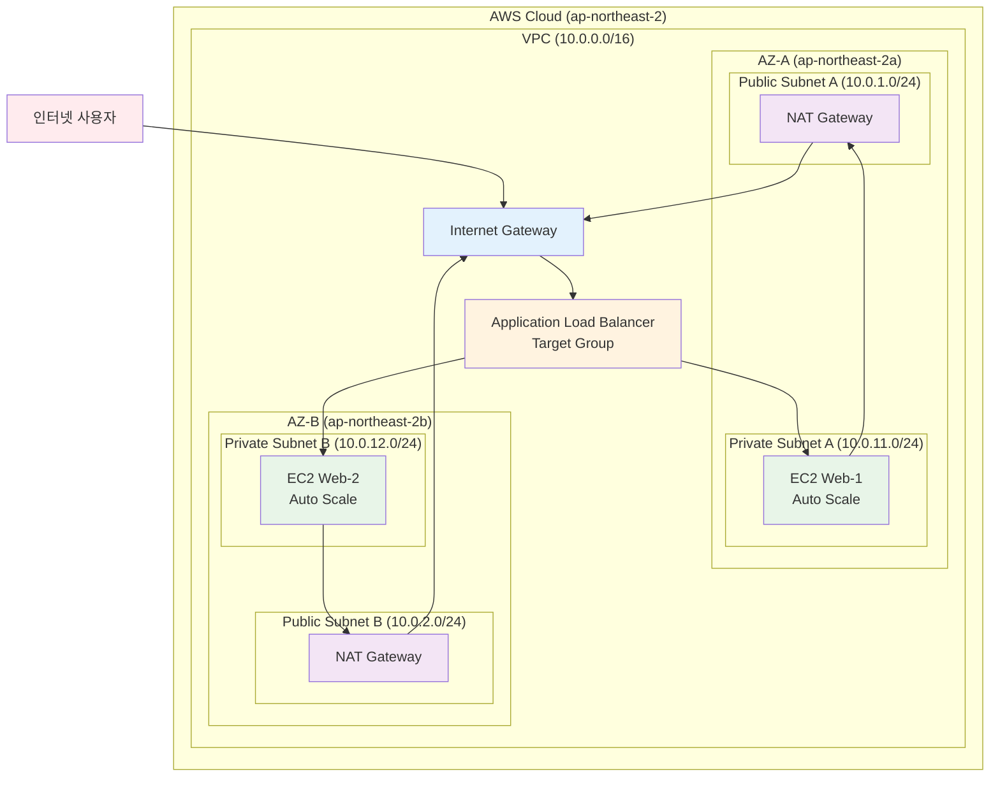

# Week 5 Day 4 Lab 1: ALB + ASG 고가용성 웹 서비스 구축

<div align="center">
**🎯 로드밸런싱** • **⏱️ 50분** • **💰 $0.30**
*Application Load Balancer와 Auto Scaling Group으로 확장 가능한 웹 서비스 구축*
</div>

---

## 🕘 Lab 정보
**시간**: 14:00-14:50 (50분)
**목표**: ALB와 ASG를 활용한 고가용성 웹 서비스 구축
**방식**: AWS Web Console 실습
**예상 비용**: $0.30

## 🎯 학습 목표
- [ ] Application Load Balancer 구성 및 운영
- [ ] Auto Scaling Group 설정 및 정책 구성
- [ ] Launch Template을 통한 인스턴스 표준화
- [ ] Health Check와 Target Group 관리

---

## 🏗️ 구축할 아키텍처

### 📐 아키텍처 다이어그램


**이미지 자리**: 아키텍처 다이어그램 이미지

### 🔗 참조 Session
**당일 Session**:
- [Session 1: Elastic Load Balancing](../session_1.md) - ALB/NLB/CLB 비교
- [Session 2: Auto Scaling Groups](../session_2.md) - ASG 개념과 정책

**이전 Day Session**:
- [Week 5 Day 1 Session 2: VPC 아키텍처](../../day1/session_2.md) - VPC 기초
- [Week 5 Day 1 Session 3: 보안 그룹](../../day1/session_3.md) - Security Groups

**향후 Session** (미리 알아두면 좋은 내용):
- 💡 [Session 3: 고가용성 아키텍처](../session_3.md) - Day 4에서 다룰 예정

---

## 🛠️ Step 1: VPC 및 네트워크 구성 (15분)

### 📋 이 단계에서 할 일
- VPC 생성 (10.0.0.0/16)
- 2개 AZ에 Public Subnet 생성 (NAT Gateway용)
- 2개 AZ에 Private Subnet 생성 (EC2 인스턴스용)
- Internet Gateway 연결
- NAT Gateway 생성 (각 AZ마다)
- Route Table 설정 (Public용, Private용)

### 🔗 참조 개념
- [Session 2: VPC 아키텍처](../../day1/session_2.md) - CIDR 블록과 Subnet 설계

### 📝 실습 절차

#### 1-1. VPC 생성

**AWS Console 접속 방법**:
1. AWS Management Console에 로그인
2. 상단 검색창에 "VPC" 입력
3. "VPC" 서비스 클릭
4. **직접 링크**: https://ap-northeast-2.console.aws.amazon.com/vpc/home?region=ap-northeast-2

**VPC 생성 단계**:
1. 왼쪽 메뉴에서 **"VPC"** 클릭
2. 오른쪽 상단 **"VPC 생성"** 버튼 클릭
3. **"VPC만"** 선택 (생성할 리소스)

**설정 값 입력**:
| 항목 | 입력 값 | 설명 |
|------|---------|------|
| 이름 태그 | `week5-day4-vpc` | VPC 이름 (정확히 입력) |
| IPv4 CIDR 블록 | `10.0.0.0/16` | IP 주소 범위 (슬래시 포함) |
| IPv6 CIDR 블록 | "IPv6 CIDR 블록 없음" | IPv6 사용 안함 (기본값) |
| 테넌시 | "기본값" | 기본 테넌시 (기본값) |

**생성 완료**:
4. 하단 **"VPC 생성"** 버튼 클릭
5. "VPC를 성공적으로 생성했습니다" 메시지 확인
6. VPC ID 기록 (예: vpc-0123456789abcdef0)

**이미지 자리**: Step 1-1 VPC 생성 완료 스크린샷

**⚠️ 주의사항**:
- 이름 태그는 정확히 `week5-day4-vpc`로 입력 (대소문자 구분)
- CIDR 블록은 반드시 `10.0.0.0/16` (다른 값 입력 시 오류)

#### 1-2. Public Subnet 생성 (AZ-A)

**Subnet 생성 접근**:
1. 왼쪽 메뉴에서 **"서브넷"** 클릭
2. 오른쪽 상단 **"서브넷 생성"** 버튼 클릭
3. **직접 링크**: https://ap-northeast-2.console.aws.amazon.com/vpc/home?region=ap-northeast-2#CreateSubnet:

**VPC 선택**:
1. "VPC ID" 드롭다운 클릭
2. 방금 생성한 "week5-day4-vpc" 선택
3. VPC ID가 자동으로 채워지는 것 확인

**첫 번째 서브넷 설정**:
| 항목 | 입력 값 | 설명 |
|------|---------|------|
| 서브넷 이름 | `week5-day4-public-a` | AZ-A 퍼블릭 서브넷 |
| 가용 영역 | `ap-northeast-2a` | 서울 리전 AZ-A |
| IPv4 CIDR 블록 | `10.0.1.0/24` | 256개 IP 주소 |

**이미지 자리**: Step 1-2 Public Subnet A 설정 스크린샷

#### 1-3. Public Subnet 생성 (AZ-B)

**두 번째 서브넷 추가**:
1. 같은 화면에서 **"새 서브넷 추가"** 버튼 클릭
2. 새로운 서브넷 설정 입력

**두 번째 서브넷 설정**:
| 항목 | 입력 값 | 설명 |
|------|---------|------|
| 서브넷 이름 | `week5-day4-public-b` | AZ-B 퍼블릭 서브넷 |
| 가용 영역 | `ap-northeast-2b` | 서울 리전 AZ-B |
| IPv4 CIDR 블록 | `10.0.2.0/24` | 256개 IP 주소 |

**이미지 자리**: Step 1-3 Public Subnet B 설정 스크린샷

#### 1-4. Private Subnet 생성 (AZ-A)

**세 번째 서브넷 추가**:
1. 같은 화면에서 **"새 서브넷 추가"** 버튼 클릭

**세 번째 서브넷 설정**:
| 항목 | 입력 값 | 설명 |
|------|---------|------|
| 서브넷 이름 | `week5-day4-private-a` | AZ-A 프라이빗 서브넷 |
| 가용 영역 | `ap-northeast-2a` | 서울 리전 AZ-A |
| IPv4 CIDR 블록 | `10.0.11.0/24` | 256개 IP 주소 |

**이미지 자리**: Step 1-4 Private Subnet A 설정 스크린샷

#### 1-5. Private Subnet 생성 (AZ-B)

**네 번째 서브넷 추가**:
1. 같은 화면에서 **"새 서브넷 추가"** 버튼 클릭

**네 번째 서브넷 설정**:
| 항목 | 입력 값 | 설명 |
|------|---------|------|
| 서브넷 이름 | `week5-day4-private-b` | AZ-B 프라이빗 서브넷 |
| 가용 영역 | `ap-northeast-2b` | 서울 리전 AZ-B |
| IPv4 CIDR 블록 | `10.0.12.0/24` | 256개 IP 주소 |

**서브넷 생성 완료**:
2. 모든 설정 확인 후 하단 **"서브넷 생성"** 버튼 클릭
3. "4개의 서브넷을 성공적으로 생성했습니다" 메시지 확인

**이미지 자리**: Step 1-5 모든 서브넷 생성 완료 스크린샷

#### 1-6. Internet Gateway 생성 및 연결

**Internet Gateway 생성**:
1. 왼쪽 메뉴에서 **"인터넷 게이트웨이"** 클릭
2. 오른쪽 상단 **"인터넷 게이트웨이 생성"** 버튼 클릭
3. **직접 링크**: https://ap-northeast-2.console.aws.amazon.com/vpc/home?region=ap-northeast-2#CreateInternetGateway:
4. 이름 태그에 `week5-day4-igw` 입력
5. **"인터넷 게이트웨이 생성"** 버튼 클릭

**VPC에 연결**:
1. 생성 완료 후 **"VPC에 연결"** 버튼 클릭 (또는 작업 → VPC에 연결)
2. 사용 가능한 VPC에서 "week5-day4-vpc" 선택
3. **"인터넷 게이트웨이 연결"** 버튼 클릭
4. 상태가 "연결됨"으로 변경되는 것 확인

**이미지 자리**: Step 1-6 IGW 생성 및 VPC 연결 완료 스크린샷

#### 1-7. Elastic IP 생성 (NAT Gateway용)

**첫 번째 Elastic IP 생성**:
1. 상단 검색창에 "EC2" 입력 후 EC2 서비스로 이동
2. 왼쪽 메뉴에서 **"탄력적 IP"** 클릭
3. 오른쪽 상단 **"탄력적 IP 주소 할당"** 버튼 클릭
4. **직접 링크**: https://ap-northeast-2.console.aws.amazon.com/ec2/home?region=ap-northeast-2#AllocateAddress:
5. 네트워크 경계 그룹: "ap-northeast-2" (기본값)
6. 퍼블릭 IPv4 주소 풀: "Amazon의 IPv4 주소 풀" (기본값)
7. 이름 태그: `week5-day4-eip-a` 입력
8. **"할당"** 버튼 클릭

**두 번째 Elastic IP 생성**:
1. 다시 **"탄력적 IP 주소 할당"** 버튼 클릭
2. 동일한 설정으로 진행
3. 이름 태그: `week5-day4-eip-b` 입력
4. **"할당"** 버튼 클릭

**이미지 자리**: Step 1-7 Elastic IP 2개 생성 완료 스크린샷

#### 1-8. NAT Gateway 생성 (AZ-A)

**첫 번째 NAT Gateway 생성**:
1. VPC 서비스로 돌아가기 (상단 검색창에 "VPC" 입력)
2. 왼쪽 메뉴에서 **"NAT 게이트웨이"** 클릭
3. 오른쪽 상단 **"NAT 게이트웨이 생성"** 버튼 클릭
4. **직접 링크**: https://ap-northeast-2.console.aws.amazon.com/vpc/home?region=ap-northeast-2#CreateNatGateway:

**설정 값 입력**:
| 항목 | 입력 값 | 설명 |
|------|---------|------|
| 이름 | `week5-day4-nat-a` | NAT Gateway 이름 |
| 서브넷 | `week5-day4-public-a` | Public Subnet A 선택 |
| 연결 유형 | "퍼블릭" | 퍼블릭 연결 (기본값) |
| 탄력적 IP 할당 ID | week5-day4-eip-a의 ID | 첫 번째 EIP 선택 |

3. **"NAT 게이트웨이 생성"** 버튼 클릭
4. 생성 완료 메시지 확인

**이미지 자리**: Step 1-8 NAT Gateway A 생성 완료 스크린샷

#### 1-9. NAT Gateway 생성 (AZ-B)

**두 번째 NAT Gateway 생성**:
1. 다시 **"NAT 게이트웨이 생성"** 버튼 클릭

**설정 값 입력**:
| 항목 | 입력 값 | 설명 |
|------|---------|------|
| 이름 | `week5-day4-nat-b` | NAT Gateway 이름 |
| 서브넷 | `week5-day4-public-b` | Public Subnet B 선택 |
| 연결 유형 | "퍼블릭" | 퍼블릭 연결 (기본값) |
| 탄력적 IP 할당 ID | week5-day4-eip-b의 ID | 두 번째 EIP 선택 |

2. **"NAT 게이트웨이 생성"** 버튼 클릭
3. 생성 완료 메시지 확인

**이미지 자리**: Step 1-9 NAT Gateway B 생성 완료 스크린샷

#### 1-10. Public Route Table 생성 및 설정

**Public Route Table 생성**:
1. 왼쪽 메뉴에서 **"라우팅 테이블"** 클릭
2. 오른쪽 상단 **"라우팅 테이블 생성"** 버튼 클릭
3. **직접 링크**: https://ap-northeast-2.console.aws.amazon.com/vpc/home?region=ap-northeast-2#CreateRouteTable:

**설정 값 입력**:
| 항목 | 입력 값 | 설명 |
|------|---------|------|
| 이름 | `week5-day4-public-rt` | 퍼블릭 라우팅 테이블 |
| VPC | `week5-day4-vpc` | 위에서 생성한 VPC |

3. **"라우팅 테이블 생성"** 버튼 클릭

**라우팅 규칙 추가**:
1. 생성된 Route Table 선택
2. 하단 **"라우팅"** 탭 클릭
3. **"라우팅 편집"** 버튼 클릭
4. **"라우팅 추가"** 버튼 클릭
5. 대상: `0.0.0.0/0` 입력
6. 타겟: "인터넷 게이트웨이" 선택 → `week5-day4-igw` 선택
7. **"변경 사항 저장"** 버튼 클릭

**Public Subnet 연결**:
1. **"서브넷 연결"** 탭 클릭
2. **"서브넷 연결 편집"** 버튼 클릭
3. `week5-day4-public-a`와 `week5-day4-public-b` 체크
4. **"연결 저장"** 버튼 클릭

**이미지 자리**: Step 1-10 Public Route Table 설정 완료 스크린샷

#### 1-11. Private Route Table 생성 및 설정 (AZ-A)

**첫 번째 Private Route Table 생성**:
1. 다시 **"라우팅 테이블 생성"** 버튼 클릭

**설정 값 입력**:
| 항목 | 입력 값 | 설명 |
|------|---------|------|
| 이름 | `week5-day4-private-rt-a` | AZ-A 프라이빗 라우팅 테이블 |
| VPC | `week5-day4-vpc` | 위에서 생성한 VPC |

2. **"라우팅 테이블 생성"** 버튼 클릭

**라우팅 규칙 추가**:
1. 생성된 Route Table 선택
2. **"라우팅"** 탭 → **"라우팅 편집"** 버튼 클릭
3. **"라우팅 추가"** 버튼 클릭
4. 대상: `0.0.0.0/0` 입력
5. 타겟: "NAT 게이트웨이" 선택 → `week5-day4-nat-a` 선택
6. **"변경 사항 저장"** 버튼 클릭

**Private Subnet A 연결**:
1. **"서브넷 연결"** 탭 클릭
2. **"서브넷 연결 편집"** 버튼 클릭
3. `week5-day4-private-a` 체크
4. **"연결 저장"** 버튼 클릭

**이미지 자리**: Step 1-11 Private Route Table A 설정 완료 스크린샷

#### 1-12. Private Route Table 생성 및 설정 (AZ-B)

**두 번째 Private Route Table 생성**:
1. 다시 **"라우팅 테이블 생성"** 버튼 클릭

**설정 값 입력**:
| 항목 | 입력 값 | 설명 |
|------|---------|------|
| 이름 | `week5-day4-private-rt-b` | AZ-B 프라이빗 라우팅 테이블 |
| VPC | `week5-day4-vpc` | 위에서 생성한 VPC |

2. **"라우팅 테이블 생성"** 버튼 클릭

**라우팅 규칙 추가**:
1. 생성된 Route Table 선택
2. **"라우팅"** 탭 → **"라우팅 편집"** 버튼 클릭
3. **"라우팅 추가"** 버튼 클릭
4. 대상: `0.0.0.0/0` 입력
5. 타겟: "NAT 게이트웨이" 선택 → `week5-day4-nat-b` 선택
6. **"변경 사항 저장"** 버튼 클릭

**Private Subnet B 연결**:
1. **"서브넷 연결"** 탭 클릭
2. **"서브넷 연결 편집"** 버튼 클릭
3. `week5-day4-private-b` 체크
4. **"연결 저장"** 버튼 클릭

**이미지 자리**: Step 1-12 Private Route Table B 설정 완료 스크린샷

### ✅ Step 1 검증

**VPC 리소스 확인**:
1. VPC Dashboard로 이동
2. "Your VPCs" 에서 week5-day4-vpc 상태 "Available" 확인
3. "Subnets" 에서 4개 서브넷 모두 "Available" 확인
4. "Internet gateways" 에서 IGW 상태 "Attached" 확인
5. "NAT gateways" 에서 2개 NAT Gateway 상태 "Available" 확인
6. "Route tables" 에서 3개 Route Table 확인

**네트워크 구성 최종 확인**:
| 리소스 | 이름 | 상태 | 연결 |
|--------|------|------|------|
| VPC | week5-day4-vpc | Available | - |
| Public Subnet A | week5-day4-public-a | Available | Public RT |
| Public Subnet B | week5-day4-public-b | Available | Public RT |
| Private Subnet A | week5-day4-private-a | Available | Private RT A |
| Private Subnet B | week5-day4-private-b | Available | Private RT B |
| Internet Gateway | week5-day4-igw | Attached | VPC |
| NAT Gateway A | week5-day4-nat-a | Available | Public Subnet A |
| NAT Gateway B | week5-day4-nat-b | Available | Public Subnet B |

**이미지 자리**: Step 1 전체 네트워크 구성 완료 스크린샷

**✅ 체크리스트**:
- [ ] VPC 생성 완료 (10.0.0.0/16)
- [ ] 4개 서브넷 생성 완료 (Public 2개, Private 2개)
- [ ] Internet Gateway 연결 완료
- [ ] 2개 NAT Gateway 생성 완료 (각 AZ마다)
- [ ] 3개 Route Table 설정 완료 (Public 1개, Private 2개)
- [ ] 모든 서브넷 연결 완료

---
## 🛠️ Step 2: Security Group 생성 (5분)

### 📋 이 단계에서 할 일
- ALB용 Security Group 생성
- EC2용 Security Group 생성
- 적절한 인바운드/아웃바운드 규칙 설정

### 🔗 참조 개념
- [Session 3: 보안 그룹](../../day1/session_3.md) - Security Groups vs Network ACL

### 📝 실습 절차

#### 2-1. ALB Security Group 생성

**AWS Console 경로**:
1. 상단 검색창에 "EC2" 입력 후 EC2 서비스로 이동
2. 왼쪽 메뉴에서 **"보안 그룹"** 클릭
3. 오른쪽 상단 **"보안 그룹 생성"** 버튼 클릭
4. **직접 링크**: https://ap-northeast-2.console.aws.amazon.com/ec2/home?region=ap-northeast-2#CreateSecurityGroup:

**설정 값**:
| 항목 | 입력 값 | 설명 |
|------|---------|------|
| 보안 그룹 이름 | `week5-day4-alb-sg` | ALB용 보안 그룹 |
| 설명 | `Security group for ALB` | ALB 설명 |
| VPC | `week5-day4-vpc` | 위에서 생성한 VPC |

**인바운드 규칙**:
1. **"인바운드 규칙 추가"** 버튼 클릭 (첫 번째 규칙)
   - 유형: **HTTP**
   - 프로토콜: **TCP** (자동 설정)
   - 포트 범위: **80** (자동 설정)
   - 소스: **0.0.0.0/0** (Anywhere IPv4)
   - 설명: `Allow HTTP from anywhere`

2. **"인바운드 규칙 추가"** 버튼 클릭 (두 번째 규칙)
   - 유형: **HTTPS**
   - 프로토콜: **TCP** (자동 설정)
   - 포트 범위: **443** (자동 설정)
   - 소스: **0.0.0.0/0** (Anywhere IPv4)
   - 설명: `Allow HTTPS from anywhere`

3. **"보안 그룹 생성"** 버튼 클릭

**이미지 자리**: Step 2-1 ALB Security Group 생성 스크린샷

#### 2-2. EC2 Security Group 생성

**두 번째 보안 그룹 생성**:
1. 다시 **"보안 그룹 생성"** 버튼 클릭

**설정 값**:
| 항목 | 입력 값 | 설명 |
|------|---------|------|
| 보안 그룹 이름 | `week5-day4-web-sg` | EC2용 보안 그룹 |
| 설명 | `Security group for Web servers` | 웹 서버 설명 |
| VPC | `week5-day4-vpc` | 위에서 생성한 VPC |

**인바운드 규칙**:
1. **"인바운드 규칙 추가"** 버튼 클릭 (첫 번째 규칙)
   - 유형: **HTTP**
   - 프로토콜: **TCP** (자동 설정)
   - 포트 범위: **80** (자동 설정)
   - 소스: **사용자 지정** 선택 → `week5-day4-alb-sg` 입력 (ALB 보안 그룹)
   - 설명: `Allow HTTP from ALB`

2. **"인바운드 규칙 추가"** 버튼 클릭 (두 번째 규칙)
   - 유형: **SSH**
   - 프로토콜: **TCP** (자동 설정)
   - 포트 범위: **22** (자동 설정)
   - 소스: **내 IP** (자동으로 현재 IP 입력됨)
   - 설명: `Allow SSH from my IP`

3. **"보안 그룹 생성"** 버튼 클릭

**이미지 자리**: Step 2-2 EC2 Security Group 생성 스크린샷

**⚠️ 주의사항**:
- EC2 Security Group의 HTTP 규칙은 ALB Security Group만 허용
- SSH는 본인 IP만 허용하여 보안 강화
- 소스에서 보안 그룹을 선택할 때는 보안 그룹 ID가 아닌 이름으로 검색 가능

### ✅ Step 2 검증

**✅ 체크리스트**:
- [ ] ALB Security Group 생성 완료
- [ ] EC2 Security Group 생성 완료
- [ ] 적절한 인바운드 규칙 설정 완료
- [ ] 보안 원칙 준수 (최소 권한 원칙)

---

## 🛠️ Step 3: Launch Template 생성 (10분)

### 📋 이 단계에서 할 일
- EC2 Launch Template 생성
- User Data로 웹 서버 자동 설치
- Auto Scaling에서 사용할 표준 템플릿 구성

### 🔗 참조 개념
- [Session 2: Auto Scaling Groups](../session_2.md) - Launch Template 개념

### 📝 실습 절차

#### 3-1. Launch Template 생성

**AWS Console 경로**:
1. EC2 서비스에서 왼쪽 메뉴 **"시작 템플릿"** 클릭
2. 오른쪽 상단 **"시작 템플릿 생성"** 버튼 클릭
3. **직접 링크**: https://ap-northeast-2.console.aws.amazon.com/ec2/home?region=ap-northeast-2#CreateTemplate:

**설정 값**:
| 항목 | 입력 값 | 설명 |
|------|---------|------|
| 시작 템플릿 이름 | `week5-day4-web-template` | 웹 서버 템플릿 |
| 템플릿 버전 설명 | `Web server template for ASG` | 템플릿 설명 |

**이미지 자리**: Step 3-1 Launch Template 기본 설정 스크린샷

#### 3-2. AMI 및 인스턴스 타입 설정

**애플리케이션 및 OS 이미지 (Amazon Machine Image)**:
1. **"빠른 시작"** 탭에서 **"Amazon Linux"** 선택
2. **"Amazon Linux 2023 AMI"** 선택 (첫 번째 옵션)
3. 아키텍처: **"64비트 (x86)"** (기본값)

**인스턴스 유형**:
1. 인스턴스 유형: **"t3.micro"** 선택 (프리티어 적격)

**이미지 자리**: Step 3-2 AMI 및 인스턴스 타입 설정 스크린샷

#### 3-3. Key pair 및 네트워크 설정

**키 페어 (로그인)**:
1. **"키 페어 이름"** 드롭다운 클릭
2. 기존 키페어가 있으면 선택, 없으면 **"새 키 페어 생성"** 클릭
3. 새로 생성하는 경우:
   - 키 페어 이름: `week5-day4-keypair`
   - 키 페어 유형: **"RSA"** (기본값)
   - 프라이빗 키 파일 형식: **".pem"** (기본값)
   - **"키 페어 생성"** 클릭 후 파일 다운로드

**네트워크 설정**:
1. **서브넷**: **"시작 템플릿에 포함하지 않음"** 선택 (ASG에서 지정할 예정)
2. **보안 그룹**: **"기존 보안 그룹 선택"** 선택
3. 보안 그룹 ID: `week5-day4-web-sg` 선택

**⚠️ 중요**: 
- 서브넷은 Launch Template에서 지정하지 않음 (Auto Scaling Group에서 Private Subnet 지정)
- 보안 그룹은 반드시 미리 생성된 것을 선택

**이미지 자리**: Step 3-3 네트워크 설정 스크린샷

#### 3-4. User Data 스크립트 설정

**Advanced details → User data**:
```bash
#!/bin/bash
yum update -y
yum install -y httpd
systemctl start httpd
systemctl enable httpd

# 간단한 웹 페이지 생성
cat <<EOF > /var/www/html/index.html
<!DOCTYPE html>
<html>
<head>
    <title>Week 5 Day 4 Lab 1</title>
    <style>
        body { font-family: Arial, sans-serif; margin: 40px; }
        .container { max-width: 800px; margin: 0 auto; }
        .header { background: #232F3E; color: white; padding: 20px; border-radius: 5px; }
        .content { background: #f9f9f9; padding: 20px; border-radius: 5px; margin-top: 20px; }
        .instance-info { background: #e8f4fd; padding: 15px; border-radius: 5px; margin-top: 15px; }
    </style>
</head>
<body>
    <div class="container">
        <div class="header">
            <h1>🚀 Week 5 Day 4 Lab 1</h1>
            <h2>ALB + ASG 고가용성 웹 서비스</h2>
        </div>
        <div class="content">
            <h3>✅ 성공적으로 배포되었습니다!</h3>
            <p>이 페이지는 Auto Scaling Group에 의해 자동으로 생성된 EC2 인스턴스에서 실행되고 있습니다.</p>
            <div class="instance-info">
                <h4>📊 인스턴스 정보:</h4>
                <p><strong>Instance ID:</strong> <span id="instance-id">Loading...</span></p>
                <p><strong>Availability Zone:</strong> <span id="az">Loading...</span></p>
                <p><strong>Local IP:</strong> <span id="local-ip">Loading...</span></p>
                <p><strong>Load Time:</strong> <span id="load-time"></span></p>
            </div>
        </div>
    </div>
    
    <script>
        // 페이지 로드 시간 표시
        document.getElementById('load-time').textContent = new Date().toLocaleString();
        
        // 인스턴스 메타데이터 가져오기
        fetch('http://169.254.169.254/latest/meta-data/instance-id')
            .then(response => response.text())
            .then(data => document.getElementById('instance-id').textContent = data)
            .catch(err => document.getElementById('instance-id').textContent = 'N/A');
            
        fetch('http://169.254.169.254/latest/meta-data/placement/availability-zone')
            .then(response => response.text())
            .then(data => document.getElementById('az').textContent = data)
            .catch(err => document.getElementById('az').textContent = 'N/A');
            
        fetch('http://169.254.169.254/latest/meta-data/local-ipv4')
            .then(response => response.text())
            .then(data => document.getElementById('local-ip').textContent = data)
            .catch(err => document.getElementById('local-ip').textContent = 'N/A');
    </script>
</body>
</html>
EOF

# 웹 서버 상태 확인
systemctl status httpd
```

**이미지 자리**: Step 3-4 User Data 설정 스크린샷

**⚠️ 주의사항**:
- User Data 스크립트는 정확히 복사하여 붙여넣기
- 스크립트 실행 시간이 2-3분 소요될 수 있음

### ✅ Step 3 검증

**✅ 체크리스트**:
- [ ] Launch Template 생성 완료
- [ ] AMI 및 인스턴스 타입 설정 완료
- [ ] Security Group 연결 완료
- [ ] User Data 스크립트 설정 완료

---

## 🛠️ Step 4: Application Load Balancer 생성 (15분)

### 📋 이 단계에서 할 일
- Application Load Balancer 생성
- Target Group 생성 및 설정
- Health Check 구성
- 리스너 규칙 설정

### 🔗 참조 개념
- [Session 1: Elastic Load Balancing](../session_1.md) - ALB vs NLB vs CLB

### 📝 실습 절차

#### 4-1. Target Group 생성

**AWS Console 경로**:
1. EC2 서비스에서 왼쪽 메뉴 **"대상 그룹"** 클릭
2. 오른쪽 상단 **"대상 그룹 생성"** 버튼 클릭
3. **직접 링크**: https://ap-northeast-2.console.aws.amazon.com/ec2/home?region=ap-northeast-2#CreateTargetGroup:

**설정 값**:
| 항목 | 입력 값 | 설명 |
|------|---------|------|
| 대상 유형 | **인스턴스** | EC2 인스턴스 대상 |
| 대상 그룹 이름 | `week5-day4-web-tg` | 웹 서버 타겟 그룹 |
| 프로토콜 | **HTTP** | HTTP 프로토콜 |
| 포트 | **80** | HTTP 포트 |
| VPC | `week5-day4-vpc` | 위에서 생성한 VPC |

**상태 검사**:
| 항목 | 입력 값 | 설명 |
|------|---------|------|
| 상태 검사 프로토콜 | **HTTP** | HTTP 헬스체크 |
| 상태 검사 경로 | **/** | 루트 경로 체크 |
| 상태 검사 포트 | **트래픽 포트** | 트래픽 포트 사용 |
| 정상 임계값 | **2** | 연속 2회 성공 시 정상 |
| 비정상 임계값 | **2** | 연속 2회 실패 시 비정상 |
| 제한 시간 | **5초** | 타임아웃 5초 |
| 간격 | **30초** | 30초마다 체크 |
| 성공 코드 | **200** | HTTP 200 응답 시 성공 |

4. **"다음"** 버튼 클릭
5. 대상 등록 화면에서 **"대상 그룹 생성"** 버튼 클릭 (지금은 대상 등록하지 않음)

**이미지 자리**: Step 4-1 Target Group 생성 스크린샷

#### 4-2. Application Load Balancer 생성

**AWS Console 경로**:
1. EC2 서비스에서 왼쪽 메뉴 **"로드 밸런서"** 클릭
2. 오른쪽 상단 **"로드 밸런서 생성"** 버튼 클릭
3. **"Application Load Balancer"** 카드에서 **"생성"** 버튼 클릭
4. **직접 링크**: https://ap-northeast-2.console.aws.amazon.com/ec2/home?region=ap-northeast-2#CreateLoadBalancer:

**기본 구성**:
| 항목 | 입력 값 | 설명 |
|------|---------|------|
| 로드 밸런서 이름 | `week5-day4-alb` | ALB 이름 |
| 체계 | **인터넷 경계** | 인터넷 연결 |
| IP 주소 유형 | **IPv4** | IPv4 주소 타입 |

**네트워크 매핑**:
| 항목 | 입력 값 | 설명 |
|------|---------|------|
| VPC | `week5-day4-vpc` | 위에서 생성한 VPC |
| 매핑 | **ap-northeast-2a**: `week5-day4-public-a`<br/>**ap-northeast-2b**: `week5-day4-public-b` | 두 AZ 모두 선택 |

**⚠️ 중요**: 반드시 Public Subnet을 선택해야 함 (ALB는 인터넷에서 접근 가능해야 함)

**이미지 자리**: Step 4-2 ALB 기본 설정 스크린샷

#### 4-3. Security groups 및 Listeners 설정

**보안 그룹**:
1. **"보안 그룹"** 섹션에서 기본 보안 그룹 제거
2. `week5-day4-alb-sg` 선택

**리스너 및 라우팅**:
| 항목 | 입력 값 | 설명 |
|------|---------|------|
| 프로토콜 | **HTTP** | HTTP 프로토콜 |
| 포트 | **80** | HTTP 포트 |
| 기본 작업 | **대상 그룹으로 전달** | 타겟 그룹으로 전달 |
| 대상 그룹 | `week5-day4-web-tg` | 위에서 생성한 타겟 그룹 |

3. **"로드 밸런서 생성"** 버튼 클릭
4. 생성 완료 메시지 확인

**이미지 자리**: Step 4-3 Security groups 및 Listeners 설정 스크린샷

### ✅ Step 4 검증

**검증 방법**:
1. ALB DNS 이름 확인
2. ALB 상태가 "Active"인지 확인
3. Target Group 상태 확인

**이미지 자리**: Step 4 검증 결과

**✅ 체크리스트**:
- [ ] Target Group 생성 완료
- [ ] ALB 생성 완료
- [ ] Health Check 설정 완료
- [ ] 리스너 규칙 설정 완료

---

## 🛠️ Step 5: Auto Scaling Group 생성 (10분)

### 📋 이 단계에서 할 일
- Auto Scaling Group 생성
- 스케일링 정책 설정
- Target Group 연결
- 인스턴스 자동 생성 확인

### 🔗 참조 개념
- [Session 2: Auto Scaling Groups](../session_2.md) - ASG 개념과 정책

### 📝 실습 절차

#### 5-1. Auto Scaling Group 생성

**AWS Console 경로**:
1. EC2 서비스에서 왼쪽 메뉴 **"Auto Scaling 그룹"** 클릭
2. 오른쪽 상단 **"Auto Scaling 그룹 생성"** 버튼 클릭
3. **직접 링크**: https://ap-northeast-2.console.aws.amazon.com/ec2/home?region=ap-northeast-2#CreateAutoScalingGroup:

**1단계: 시작 템플릿 또는 구성 선택**:
| 항목 | 입력 값 | 설명 |
|------|---------|------|
| Auto Scaling 그룹 이름 | `week5-day4-web-asg` | ASG 이름 |
| 시작 템플릿 | `week5-day4-web-template` | 위에서 생성한 템플릿 |
| 버전 | **기본값 (1)** | 기본 버전 |

4. **"다음"** 버튼 클릭

**이미지 자리**: Step 5-1 ASG 기본 설정 스크린샷

#### 5-2. 네트워크 설정

**2단계: 인스턴스 시작 옵션 선택**:

**네트워크 설정**:
1. **"VPC"** 드롭다운에서 `week5-day4-vpc` 선택
2. **"가용 영역 및 서브넷"** 섹션에서:
   - **중요**: Private Subnet만 선택해야 함
   - `week5-day4-private-a (ap-northeast-2a)` 체크
   - `week5-day4-private-b (ap-northeast-2b)` 체크
   - Public Subnet은 선택하지 않음

**인스턴스 유형 요구 사항 (선택사항)**:
- **"시작 템플릿 재정의"** 체크 해제 (기본값 사용)

3. **"다음"** 버튼 클릭

**⚠️ 중요 주의사항**:
- **반드시 Private Subnet만 선택**: Public Subnet 선택 시 보안 위험
- **두 AZ 모두 선택**: 고가용성을 위해 필수
- EC2 인스턴스는 Private Subnet에 배치되어 NAT Gateway를 통해 인터넷 접근

**이미지 자리**: Step 5-2 Private Subnet 선택 스크린샷

#### 5-3. Load balancer 연결

**3단계: 고급 옵션 구성**:
| 항목 | 입력 값 | 설명 |
|------|---------|------|
| 로드 밸런싱 | **기존 로드 밸런서에 연결** | 기존 로드밸런서 연결 |
| 기존 로드 밸런서 대상 그룹 | `week5-day4-web-tg` | 위에서 생성한 타겟 그룹 |

**상태 검사**:
| 항목 | 입력 값 | 설명 |
|------|---------|------|
| 상태 검사 유형 | **ELB** | ELB 헬스체크 사용 |
| 상태 검사 유예 기간 | **300초** | 5분 유예 기간 |

4. **"다음"** 버튼 클릭

**이미지 자리**: Step 5-3 Load balancer 연결 스크린샷

#### 5-4. 그룹 크기 및 스케일링 정책

**4단계: 그룹 크기 및 스케일링 정책 구성**:
| 항목 | 입력 값 | 설명 |
|------|---------|------|
| 원하는 용량 | **2** | 원하는 인스턴스 수 |
| 최소 용량 | **1** | 최소 인스턴스 수 |
| 최대 용량 | **4** | 최대 인스턴스 수 |

**스케일링 정책**:
1. **"대상 추적 스케일링 정책"** 선택
2. 정책 이름: `week5-day4-cpu-policy`
3. 지표 유형: **평균 CPU 사용률**
4. 대상 값: **70**

5. **"다음"** 버튼 클릭

**이미지 자리**: Step 5-4 그룹 크기 및 스케일링 정책 스크린샷

#### 5-5. 태그 설정

**5단계: 태그 추가**:
1. **"태그 추가"** 버튼 클릭하여 다음 태그들 추가:

| 키 | 값 | 새 인스턴스에 태그 지정 |
|-----|-------|-------------------|
| Name | `week5-day4-web-server` | ✓ |
| Environment | `Lab` | ✓ |
| Week | `Week5` | ✓ |
| Day | `Day4` | ✓ |

6. **"다음"** 버튼 클릭
7. **6단계: 검토**에서 모든 설정 확인 후 **"Auto Scaling 그룹 생성"** 버튼 클릭

**이미지 자리**: Step 5-5 태그 설정 스크린샷

### ✅ Step 5 검증

**검증 방법**:
```bash
# ASG 상태 확인
aws autoscaling describe-auto-scaling-groups --auto-scaling-group-names week5-day4-web-asg
```

**예상 결과**:
- ASG 상태: InService
- 인스턴스 수: 2개 (Desired capacity)
- 인스턴스 상태: InService

**이미지 자리**: Step 5 검증 결과

**✅ 체크리스트**:
- [ ] Auto Scaling Group 생성 완료
- [ ] Target Group 연결 완료
- [ ] 스케일링 정책 설정 완료
- [ ] 인스턴스 2개 자동 생성 확인

---

## 🛠️ Step 6: 전체 시스템 테스트 (5분)

### 📋 테스트 시나리오
1. ALB DNS를 통한 웹 사이트 접근
2. 인스턴스 정보 확인 (로드밸런싱 동작 확인)
3. Health Check 상태 확인
4. Auto Scaling 동작 확인

### 🧪 테스트 실행

#### 테스트 1: 웹 사이트 접근
**방법**:
1. ALB DNS 이름 복사
2. 웹 브라우저에서 접근
3. 페이지 새로고침으로 로드밸런싱 확인

**예상 결과**:
- Week 5 Day 4 Lab 1 페이지 표시
- 새로고침 시 다른 인스턴스 정보 표시 (로드밸런싱)

**이미지 자리**: 테스트 1 결과

#### 테스트 2: Target Group Health Check
**방법**:
```
AWS Console → EC2 → Target Groups → week5-day4-web-tg → Targets 탭
```

**예상 결과**:
- 2개 인스턴스 모두 "healthy" 상태
- Health check 통과

**이미지 자리**: 테스트 2 결과

#### 테스트 3: Auto Scaling 동작 확인
**방법**:
```
AWS Console → EC2 → Auto Scaling Groups → week5-day4-web-asg → Activity 탭
```

**예상 결과**:
- "Successful" 상태의 인스턴스 생성 활동
- Desired capacity 2개 달성

**이미지 자리**: 테스트 3 결과

### ✅ 전체 검증 체크리스트
- [ ] ALB를 통한 웹 사이트 정상 접근
- [ ] 로드밸런싱 동작 확인 (인스턴스 간 트래픽 분산)
- [ ] Health Check 정상 동작
- [ ] Auto Scaling Group 정상 동작
- [ ] 2개 AZ에 인스턴스 분산 배치 확인

---

## 🧹 리소스 정리 (10분)

### ⚠️ 중요: 반드시 순서대로 삭제

**삭제 순서** (역순으로):
```
Step 6 → Step 5 → Step 4 → Step 3 → Step 2 → Step 1
```

### 🗑️ 삭제 절차

#### 1. Auto Scaling Group 삭제
**AWS Console 경로**:
```
AWS Console → EC2 → Auto Scaling Groups → week5-day4-web-asg
```

**삭제 단계**:
1. Auto Scaling Group 선택
2. "Actions" 버튼 클릭
3. "Delete" 선택
4. 확인 창에서 "delete" 입력
5. "Delete" 버튼 클릭
6. 삭제 완료까지 2-3분 대기

**확인 사항**:
- [ ] ASG 삭제 완료
- [ ] 연결된 EC2 인스턴스 자동 종료 확인 (EC2 Dashboard에서 확인)

**이미지 자리**: ASG 삭제 확인 스크린샷

#### 2. Application Load Balancer 삭제
**AWS Console 경로**:
```
AWS Console → EC2 → Load Balancers → week5-day4-alb
```

**삭제 단계**:
1. Load Balancer 선택
2. "Actions" 버튼 클릭
3. "Delete" 선택
4. 확인 창에서 "confirm" 입력
5. "Delete" 버튼 클릭

**확인 사항**:
- [ ] ALB 삭제 완료 (상태가 "deleting"에서 사라짐)

#### 3. Target Group 삭제
**AWS Console 경로**:
```
AWS Console → EC2 → Target Groups → week5-day4-web-tg
```

**삭제 단계**:
1. Target Group 선택
2. "Actions" 버튼 클릭
3. "Delete" 선택
4. 확인 창에서 "Yes, delete" 클릭

#### 4. Launch Template 삭제
**AWS Console 경로**:
```
AWS Console → EC2 → Launch Templates → week5-day4-web-template
```

**삭제 단계**:
1. Launch Template 선택
2. "Actions" 버튼 클릭
3. "Delete template" 선택
4. 확인 창에서 "Delete" 클릭

#### 5. Security Groups 삭제

**삭제 순서** (의존성 때문에 순서 중요):
1. **먼저 EC2 Security Group 삭제**:
   - `week5-day4-web-sg` 선택
   - "Actions" → "Delete security groups"
   - 확인 창에서 "Delete" 클릭

2. **다음 ALB Security Group 삭제**:
   - `week5-day4-alb-sg` 선택
   - "Actions" → "Delete security groups"
   - 확인 창에서 "Delete" 클릭

#### 6. NAT Gateway 삭제

**AWS Console 경로**:
```
AWS Console → VPC → NAT gateways
```

**첫 번째 NAT Gateway 삭제**:
1. `week5-day4-nat-a` 선택
2. "Actions" 버튼 클릭
3. "Delete NAT gateway" 선택
4. 확인 창에서 "delete" 입력
5. "Delete" 버튼 클릭

**두 번째 NAT Gateway 삭제**:
1. `week5-day4-nat-b` 선택
2. 동일한 방법으로 삭제

**⚠️ 주의**: NAT Gateway 삭제는 몇 분 소요됨 (완전히 삭제될 때까지 대기)

#### 7. Elastic IP 해제

**AWS Console 경로**:
```
AWS Console → EC2 → Elastic IPs
```

**첫 번째 EIP 해제**:
1. `week5-day4-eip-a` 선택
2. "Actions" 버튼 클릭
3. "Release Elastic IP addresses" 선택
4. 확인 창에서 "Release" 클릭

**두 번째 EIP 해제**:
1. `week5-day4-eip-b` 선택
2. 동일한 방법으로 해제

#### 8. Route Tables 삭제

**AWS Console 경로**:
```
AWS Console → VPC → Route tables
```

**삭제 순서**:
1. **Private Route Table A 삭제**:
   - `week5-day4-private-rt-a` 선택
   - "Actions" → "Delete route table"
   - 확인 창에서 "Delete" 클릭

2. **Private Route Table B 삭제**:
   - `week5-day4-private-rt-b` 선택
   - 동일한 방법으로 삭제

3. **Public Route Table 삭제**:
   - `week5-day4-public-rt` 선택
   - 동일한 방법으로 삭제

#### 9. Internet Gateway 분리 및 삭제

**AWS Console 경로**:
```
AWS Console → VPC → Internet gateways
```

**IGW 분리**:
1. `week5-day4-igw` 선택
2. "Actions" 버튼 클릭
3. "Detach from VPC" 선택
4. 확인 창에서 "Detach internet gateway" 클릭

**IGW 삭제**:
1. 분리 완료 후 동일한 IGW 선택
2. "Actions" → "Delete internet gateway"
3. 확인 창에서 "Delete internet gateway" 클릭

#### 10. Subnets 삭제

**AWS Console 경로**:
```
AWS Console → VPC → Subnets
```

**모든 서브넷 삭제**:
1. 다음 서브넷들을 Ctrl+클릭으로 다중 선택:
   - `week5-day4-public-a`
   - `week5-day4-public-b`
   - `week5-day4-private-a`
   - `week5-day4-private-b`
2. "Actions" 버튼 클릭
3. "Delete subnet" 선택
4. 확인 창에서 "Delete" 클릭

#### 11. VPC 삭제

**AWS Console 경로**:
```
AWS Console → VPC → Your VPCs
```

**VPC 삭제**:
1. `week5-day4-vpc` 선택
2. "Actions" 버튼 클릭
3. "Delete VPC" 선택
4. 확인 창에서 "delete" 입력
5. "Delete" 버튼 클릭

### ✅ 정리 완료 확인

**최종 확인 방법**:
1. **VPC Dashboard 확인**:
   - Your VPCs: week5-day4-vpc 없음
   - Subnets: week5-day4로 시작하는 서브넷 없음
   - Internet gateways: week5-day4-igw 없음
   - NAT gateways: week5-day4로 시작하는 NAT Gateway 없음
   - Route tables: week5-day4로 시작하는 Route Table 없음

2. **EC2 Dashboard 확인**:
   - Instances: 모든 인스턴스 "terminated" 상태
   - Load Balancers: week5-day4-alb 없음
   - Target Groups: week5-day4-web-tg 없음
   - Auto Scaling Groups: week5-day4-web-asg 없음
   - Launch Templates: week5-day4-web-template 없음
   - Security Groups: week5-day4로 시작하는 SG 없음
   - Elastic IPs: week5-day4로 시작하는 EIP 없음

**이미지 자리**: 정리 완료 확인

**✅ 최종 체크리스트**:
- [ ] Auto Scaling Group 삭제
- [ ] 모든 EC2 인스턴스 종료
- [ ] Application Load Balancer 삭제
- [ ] Target Group 삭제
- [ ] Launch Template 삭제
- [ ] Security Groups 삭제 (2개)
- [ ] NAT Gateways 삭제 (2개)
- [ ] Elastic IPs 해제 (2개)
- [ ] Route Tables 삭제 (3개)
- [ ] Internet Gateway 분리 및 삭제
- [ ] Subnets 삭제 (4개)
- [ ] VPC 삭제
- [ ] 비용 확인 (Cost Explorer)

---

## 💰 비용 확인

### 예상 비용 계산
| 리소스 | 사용 시간 | 단가 | 예상 비용 |
|--------|----------|------|-----------|
| ALB | 50분 | $0.0225/hour | $0.019 |
| EC2 t3.micro × 2 | 50분 | $0.0116/hour | $0.019 |
| NAT Gateway × 2 | 50분 | $0.045/hour | $0.075 |
| Data Processing (NAT) | 1GB | $0.045/GB | $0.045 |
| Elastic IP × 2 | 50분 | $0.005/hour | $0.008 |
| **합계** | | | **$0.166** |

### 실제 비용 확인
**AWS Console 경로**:
```
AWS Console → Cost Explorer → Cost & Usage
```

**비용 절약 팁**:
- **NAT Gateway**: 가장 큰 비용 요소 ($0.045/hour × 2개)
- **실습 시간 단축**: 50분 이내 완료로 비용 최소화
- **즉시 정리**: 실습 완료 후 바로 리소스 삭제

**이미지 자리**: 비용 확인 스크린샷

---

## 🔍 트러블슈팅

### 문제 1: 인스턴스가 Target Group에서 Unhealthy 상태
**증상**:
- Target Group에서 인스턴스가 "unhealthy" 상태

**원인**:
- User Data 스크립트 실행 중 (2-3분 소요)
- Security Group 설정 오류
- 웹 서버 시작 실패

**해결 방법**:
```bash
# 인스턴스에 SSH 접속하여 확인
ssh -i your-key.pem ec2-user@instance-ip

# 웹 서버 상태 확인
sudo systemctl status httpd

# 웹 서버 재시작
sudo systemctl restart httpd
```

**참조**: [Session 1: Elastic Load Balancing](../session_1.md) - Health Check 설정

### 문제 2: ALB DNS로 접근 시 503 오류
**증상**:
- ALB DNS 접근 시 "503 Service Temporarily Unavailable" 오류

**원인**:
- Target Group에 healthy한 인스턴스가 없음
- Security Group 규칙 오류

**해결 방법**:
1. Target Group 상태 확인
2. Security Group 규칙 재확인
3. 인스턴스 Health Check 로그 확인

### 문제 3: Auto Scaling이 동작하지 않음
**증상**:
- CPU 사용률이 높아도 인스턴스가 추가되지 않음

**원인**:
- CloudWatch 메트릭 수집 지연
- 스케일링 정책 설정 오류

**해결 방법**:
1. CloudWatch 메트릭 확인
2. 스케일링 정책 재검토
3. ASG Activity History 확인

---

## 💡 Lab 회고

### 🤝 페어 회고 (5분)
1. **가장 어려웠던 부분**: ALB와 ASG 연결 설정
2. **새로 배운 점**: Target Group의 Health Check 중요성
3. **실무 적용 아이디어**: 실제 서비스에서 고가용성 구현 방법

### 📊 학습 성과
- **기술적 성취**: ALB + ASG 고가용성 아키텍처 구축
- **이해도 향상**: 로드밸런싱과 자동 확장 개념 완전 이해
- **다음 Lab 준비**: Multi-AZ 아키텍처 심화 학습

---

## 🔗 관련 자료

### 📚 Session 복습
- [Session 1: Elastic Load Balancing](../session_1.md)
- [Session 2: Auto Scaling Groups](../session_2.md)

### 📖 AWS 공식 문서
- [Application Load Balancer 사용자 가이드](https://docs.aws.amazon.com/elasticloadbalancing/latest/application/)
- [Auto Scaling 사용자 가이드](https://docs.aws.amazon.com/autoscaling/ec2/userguide/)
- [ALB 요금](https://aws.amazon.com/elasticloadbalancing/pricing/)

### 🎯 다음 Lab
- [Challenge: 고가용성 아키텍처](../challenge_1.md) - 이번 Lab을 기반으로 장애 대응 시나리오

---

<div align="center">

**✅ Lab 완료** • **🧹 리소스 정리 필수** • **💰 비용 확인**

*다음 Challenge로 이동하기 전 반드시 리소스 정리 확인*

</div>
