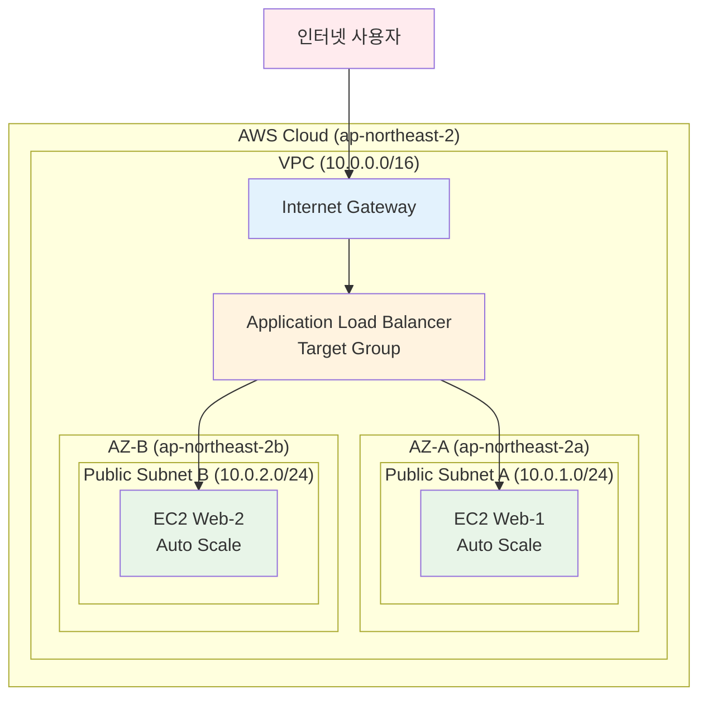

# Week 5 Day 4 Lab 1: ALB + ASG 고가용성 웹 서비스 구축

<div align="center">
**🎯 로드밸런싱** • **⏱️ 50분** • **💰 $0.30**
*Application Load Balancer와 Auto Scaling Group으로 확장 가능한 웹 서비스 구축*
</div>

---

## 🕘 Lab 정보
**시간**: 14:00-14:50 (50분)
**목표**: ALB와 ASG를 활용한 고가용성 웹 서비스 구축
**방식**: AWS Web Console 실습
**예상 비용**: $0.30

## 🎯 학습 목표
- [ ] Application Load Balancer 구성 및 운영
- [ ] Auto Scaling Group 설정 및 정책 구성
- [ ] Launch Template을 통한 인스턴스 표준화
- [ ] Health Check와 Target Group 관리

---

## 🏗️ 구축할 아키텍처

### 📐 아키텍처 다이어그램


**이미지 자리**: 아키텍처 다이어그램 이미지

### 🔗 참조 Session
**당일 Session**:
- [Session 1: Elastic Load Balancing](../session_1.md) - ALB/NLB/CLB 비교
- [Session 2: Auto Scaling Groups](../session_2.md) - ASG 개념과 정책

**이전 Day Session**:
- [Week 5 Day 1 Session 2: VPC 아키텍처](../../day1/session_2.md) - VPC 기초
- [Week 5 Day 1 Session 3: 보안 그룹](../../day1/session_3.md) - Security Groups

**향후 Session** (미리 알아두면 좋은 내용):
- 💡 [Session 3: 고가용성 아키텍처](../session_3.md) - Day 4에서 다룰 예정

---

## 🛠️ Step 1: VPC 및 네트워크 구성 (10분)

### 📋 이 단계에서 할 일
- VPC 생성 (10.0.0.0/16)
- 2개 AZ에 Public Subnet 생성
- Internet Gateway 연결
- Route Table 설정

### 🔗 참조 개념
- [Session 2: VPC 아키텍처](../../day1/session_2.md) - CIDR 블록과 Subnet 설계

### 📝 실습 절차

#### 1-1. VPC 생성

**AWS Console 경로**:
```
AWS Console → VPC → Your VPCs → Create VPC
```

**설정 값**:
| 항목 | 값 | 설명 |
|------|-----|------|
| Name tag | week5-day4-vpc | VPC 이름 |
| IPv4 CIDR block | 10.0.0.0/16 | IP 주소 범위 |
| IPv6 CIDR block | No IPv6 CIDR block | IPv6 사용 안함 |
| Tenancy | Default | 기본 테넌시 |

**이미지 자리**: Step 1-1 VPC 생성 스크린샷

**⚠️ 주의사항**:
- CIDR 블록은 정확히 10.0.0.0/16으로 입력
- 다른 VPC와 중복되지 않도록 확인

#### 1-2. Public Subnet 생성 (AZ-A)

**AWS Console 경로**:
```
AWS Console → VPC → Subnets → Create subnet
```

**설정 값**:
| 항목 | 값 | 설명 |
|------|-----|------|
| VPC ID | week5-day4-vpc | 위에서 생성한 VPC |
| Subnet name | week5-day4-public-a | AZ-A 퍼블릭 서브넷 |
| Availability Zone | ap-northeast-2a | 서울 리전 AZ-A |
| IPv4 CIDR block | 10.0.1.0/24 | 256개 IP 주소 |

**이미지 자리**: Step 1-2 Subnet A 생성 스크린샷

#### 1-3. Public Subnet 생성 (AZ-B)

**설정 값**:
| 항목 | 값 | 설명 |
|------|-----|------|
| VPC ID | week5-day4-vpc | 위에서 생성한 VPC |
| Subnet name | week5-day4-public-b | AZ-B 퍼블릭 서브넷 |
| Availability Zone | ap-northeast-2b | 서울 리전 AZ-B |
| IPv4 CIDR block | 10.0.2.0/24 | 256개 IP 주소 |

**이미지 자리**: Step 1-3 Subnet B 생성 스크린샷

#### 1-4. Internet Gateway 생성 및 연결

**AWS Console 경로**:
```
AWS Console → VPC → Internet Gateways → Create internet gateway
```

**설정 값**:
| 항목 | 값 | 설명 |
|------|-----|------|
| Name tag | week5-day4-igw | Internet Gateway 이름 |

**연결 작업**:
1. 생성된 IGW 선택
2. Actions → Attach to VPC
3. VPC 선택: week5-day4-vpc

**이미지 자리**: Step 1-4 IGW 생성 및 연결 스크린샷

#### 1-5. Route Table 설정

**AWS Console 경로**:
```
AWS Console → VPC → Route Tables → Create route table
```

**설정 값**:
| 항목 | 값 | 설명 |
|------|-----|------|
| Name | week5-day4-public-rt | 퍼블릭 라우트 테이블 |
| VPC | week5-day4-vpc | 위에서 생성한 VPC |

**라우팅 규칙 추가**:
1. 생성된 Route Table 선택
2. Routes 탭 → Edit routes
3. Add route:
   - Destination: 0.0.0.0/0
   - Target: Internet Gateway (week5-day4-igw)

**서브넷 연결**:
1. Subnet associations 탭 → Edit subnet associations
2. 두 개의 Public Subnet 모두 선택

**이미지 자리**: Step 1-5 Route Table 설정 스크린샷

### ✅ Step 1 검증

**검증 명령어**:
```bash
# VPC 상태 확인
aws ec2 describe-vpcs --filters "Name=tag:Name,Values=week5-day4-vpc"
```

**예상 결과**:
```json
{
    "Vpcs": [
        {
            "VpcId": "vpc-xxxxxxxxx",
            "State": "available",
            "CidrBlock": "10.0.0.0/16"
        }
    ]
}
```

**이미지 자리**: Step 1 검증 결과

**✅ 체크리스트**:
- [ ] VPC 생성 완료 (10.0.0.0/16)
- [ ] 2개 AZ에 Public Subnet 생성 완료
- [ ] Internet Gateway 연결 완료
- [ ] Route Table 설정 및 서브넷 연결 완료

---
## 🛠️ Step 2: Security Group 생성 (5분)

### 📋 이 단계에서 할 일
- ALB용 Security Group 생성
- EC2용 Security Group 생성
- 적절한 인바운드/아웃바운드 규칙 설정

### 🔗 참조 개념
- [Session 3: 보안 그룹](../../day1/session_3.md) - Security Groups vs Network ACL

### 📝 실습 절차

#### 2-1. ALB Security Group 생성

**AWS Console 경로**:
```
AWS Console → EC2 → Security Groups → Create security group
```

**설정 값**:
| 항목 | 값 | 설명 |
|------|-----|------|
| Security group name | week5-day4-alb-sg | ALB용 보안 그룹 |
| Description | Security group for ALB | ALB 설명 |
| VPC | week5-day4-vpc | 위에서 생성한 VPC |

**Inbound rules**:
| Type | Protocol | Port Range | Source | Description |
|------|----------|------------|--------|-------------|
| HTTP | TCP | 80 | 0.0.0.0/0 | Allow HTTP from anywhere |
| HTTPS | TCP | 443 | 0.0.0.0/0 | Allow HTTPS from anywhere |

**이미지 자리**: Step 2-1 ALB Security Group 생성 스크린샷

#### 2-2. EC2 Security Group 생성

**설정 값**:
| 항목 | 값 | 설명 |
|------|-----|------|
| Security group name | week5-day4-web-sg | EC2용 보안 그룹 |
| Description | Security group for Web servers | 웹 서버 설명 |
| VPC | week5-day4-vpc | 위에서 생성한 VPC |

**Inbound rules**:
| Type | Protocol | Port Range | Source | Description |
|------|----------|------------|--------|-------------|
| HTTP | TCP | 80 | week5-day4-alb-sg | Allow HTTP from ALB |
| SSH | TCP | 22 | My IP | Allow SSH from my IP |

**이미지 자리**: Step 2-2 EC2 Security Group 생성 스크린샷

**⚠️ 주의사항**:
- EC2 Security Group의 HTTP 규칙은 ALB Security Group만 허용
- SSH는 본인 IP만 허용하여 보안 강화

### ✅ Step 2 검증

**✅ 체크리스트**:
- [ ] ALB Security Group 생성 완료
- [ ] EC2 Security Group 생성 완료
- [ ] 적절한 인바운드 규칙 설정 완료
- [ ] 보안 원칙 준수 (최소 권한 원칙)

---

## 🛠️ Step 3: Launch Template 생성 (10분)

### 📋 이 단계에서 할 일
- EC2 Launch Template 생성
- User Data로 웹 서버 자동 설치
- Auto Scaling에서 사용할 표준 템플릿 구성

### 🔗 참조 개념
- [Session 2: Auto Scaling Groups](../session_2.md) - Launch Template 개념

### 📝 실습 절차

#### 3-1. Launch Template 생성

**AWS Console 경로**:
```
AWS Console → EC2 → Launch Templates → Create launch template
```

**설정 값**:
| 항목 | 값 | 설명 |
|------|-----|------|
| Launch template name | week5-day4-web-template | 웹 서버 템플릿 |
| Template version description | Web server template for ASG | 템플릿 설명 |

**이미지 자리**: Step 3-1 Launch Template 기본 설정 스크린샷

#### 3-2. AMI 및 인스턴스 타입 설정

**Application and OS Images (Amazon Machine Image)**:
- AMI: Amazon Linux 2023 AMI (HVM) - Kernel 6.1, SSD Volume Type
- Architecture: 64-bit (x86)

**Instance type**:
- Instance type: t3.micro (프리티어 적격)

**이미지 자리**: Step 3-2 AMI 및 인스턴스 타입 설정 스크린샷

#### 3-3. Key pair 및 네트워크 설정

**Key pair (login)**:
- Key pair name: 기존 키페어 선택 또는 새로 생성

**Network settings**:
- Subnet: Don't include in launch template (ASG에서 지정)
- Security groups: week5-day4-web-sg

**이미지 자리**: Step 3-3 네트워크 설정 스크린샷

#### 3-4. User Data 스크립트 설정

**Advanced details → User data**:
```bash
#!/bin/bash
yum update -y
yum install -y httpd
systemctl start httpd
systemctl enable httpd

# 간단한 웹 페이지 생성
cat <<EOF > /var/www/html/index.html
<!DOCTYPE html>
<html>
<head>
    <title>Week 5 Day 4 Lab 1</title>
    <style>
        body { font-family: Arial, sans-serif; margin: 40px; }
        .container { max-width: 800px; margin: 0 auto; }
        .header { background: #232F3E; color: white; padding: 20px; border-radius: 5px; }
        .content { background: #f9f9f9; padding: 20px; border-radius: 5px; margin-top: 20px; }
        .instance-info { background: #e8f4fd; padding: 15px; border-radius: 5px; margin-top: 15px; }
    </style>
</head>
<body>
    <div class="container">
        <div class="header">
            <h1>🚀 Week 5 Day 4 Lab 1</h1>
            <h2>ALB + ASG 고가용성 웹 서비스</h2>
        </div>
        <div class="content">
            <h3>✅ 성공적으로 배포되었습니다!</h3>
            <p>이 페이지는 Auto Scaling Group에 의해 자동으로 생성된 EC2 인스턴스에서 실행되고 있습니다.</p>
            <div class="instance-info">
                <h4>📊 인스턴스 정보:</h4>
                <p><strong>Instance ID:</strong> <span id="instance-id">Loading...</span></p>
                <p><strong>Availability Zone:</strong> <span id="az">Loading...</span></p>
                <p><strong>Local IP:</strong> <span id="local-ip">Loading...</span></p>
                <p><strong>Load Time:</strong> <span id="load-time"></span></p>
            </div>
        </div>
    </div>
    
    <script>
        // 페이지 로드 시간 표시
        document.getElementById('load-time').textContent = new Date().toLocaleString();
        
        // 인스턴스 메타데이터 가져오기
        fetch('http://169.254.169.254/latest/meta-data/instance-id')
            .then(response => response.text())
            .then(data => document.getElementById('instance-id').textContent = data)
            .catch(err => document.getElementById('instance-id').textContent = 'N/A');
            
        fetch('http://169.254.169.254/latest/meta-data/placement/availability-zone')
            .then(response => response.text())
            .then(data => document.getElementById('az').textContent = data)
            .catch(err => document.getElementById('az').textContent = 'N/A');
            
        fetch('http://169.254.169.254/latest/meta-data/local-ipv4')
            .then(response => response.text())
            .then(data => document.getElementById('local-ip').textContent = data)
            .catch(err => document.getElementById('local-ip').textContent = 'N/A');
    </script>
</body>
</html>
EOF

# 웹 서버 상태 확인
systemctl status httpd
```

**이미지 자리**: Step 3-4 User Data 설정 스크린샷

**⚠️ 주의사항**:
- User Data 스크립트는 정확히 복사하여 붙여넣기
- 스크립트 실행 시간이 2-3분 소요될 수 있음

### ✅ Step 3 검증

**✅ 체크리스트**:
- [ ] Launch Template 생성 완료
- [ ] AMI 및 인스턴스 타입 설정 완료
- [ ] Security Group 연결 완료
- [ ] User Data 스크립트 설정 완료

---

## 🛠️ Step 4: Application Load Balancer 생성 (15분)

### 📋 이 단계에서 할 일
- Application Load Balancer 생성
- Target Group 생성 및 설정
- Health Check 구성
- 리스너 규칙 설정

### 🔗 참조 개념
- [Session 1: Elastic Load Balancing](../session_1.md) - ALB vs NLB vs CLB

### 📝 실습 절차

#### 4-1. Target Group 생성

**AWS Console 경로**:
```
AWS Console → EC2 → Target Groups → Create target group
```

**설정 값**:
| 항목 | 값 | 설명 |
|------|-----|------|
| Target type | Instances | EC2 인스턴스 대상 |
| Target group name | week5-day4-web-tg | 웹 서버 타겟 그룹 |
| Protocol | HTTP | HTTP 프로토콜 |
| Port | 80 | HTTP 포트 |
| VPC | week5-day4-vpc | 위에서 생성한 VPC |

**Health checks**:
| 항목 | 값 | 설명 |
|------|-----|------|
| Health check protocol | HTTP | HTTP 헬스체크 |
| Health check path | / | 루트 경로 체크 |
| Health check port | Traffic port | 트래픽 포트 사용 |
| Healthy threshold | 2 | 연속 2회 성공 시 정상 |
| Unhealthy threshold | 2 | 연속 2회 실패 시 비정상 |
| Timeout | 5 seconds | 타임아웃 5초 |
| Interval | 30 seconds | 30초마다 체크 |
| Success codes | 200 | HTTP 200 응답 시 성공 |

**이미지 자리**: Step 4-1 Target Group 생성 스크린샷

#### 4-2. Application Load Balancer 생성

**AWS Console 경로**:
```
AWS Console → EC2 → Load Balancers → Create Load Balancer → Application Load Balancer
```

**Basic configuration**:
| 항목 | 값 | 설명 |
|------|-----|------|
| Load balancer name | week5-day4-alb | ALB 이름 |
| Scheme | Internet-facing | 인터넷 연결 |
| IP address type | IPv4 | IPv4 주소 타입 |

**Network mapping**:
| 항목 | 값 | 설명 |
|------|-----|------|
| VPC | week5-day4-vpc | 위에서 생성한 VPC |
| Mappings | ap-northeast-2a: week5-day4-public-a<br/>ap-northeast-2b: week5-day4-public-b | 두 AZ 모두 선택 |

**이미지 자리**: Step 4-2 ALB 기본 설정 스크린샷

#### 4-3. Security groups 및 Listeners 설정

**Security groups**:
- Security groups: week5-day4-alb-sg

**Listeners and routing**:
| 항목 | 값 | 설명 |
|------|-----|------|
| Protocol | HTTP | HTTP 프로토콜 |
| Port | 80 | HTTP 포트 |
| Default action | Forward to target group | 타겟 그룹으로 전달 |
| Target group | week5-day4-web-tg | 위에서 생성한 타겟 그룹 |

**이미지 자리**: Step 4-3 Security groups 및 Listeners 설정 스크린샷

### ✅ Step 4 검증

**검증 방법**:
1. ALB DNS 이름 확인
2. ALB 상태가 "Active"인지 확인
3. Target Group 상태 확인

**이미지 자리**: Step 4 검증 결과

**✅ 체크리스트**:
- [ ] Target Group 생성 완료
- [ ] ALB 생성 완료
- [ ] Health Check 설정 완료
- [ ] 리스너 규칙 설정 완료

---

## 🛠️ Step 5: Auto Scaling Group 생성 (10분)

### 📋 이 단계에서 할 일
- Auto Scaling Group 생성
- 스케일링 정책 설정
- Target Group 연결
- 인스턴스 자동 생성 확인

### 🔗 참조 개념
- [Session 2: Auto Scaling Groups](../session_2.md) - ASG 개념과 정책

### 📝 실습 절차

#### 5-1. Auto Scaling Group 생성

**AWS Console 경로**:
```
AWS Console → EC2 → Auto Scaling Groups → Create Auto Scaling group
```

**Step 1: Choose launch template or configuration**:
| 항목 | 값 | 설명 |
|------|-----|------|
| Auto Scaling group name | week5-day4-web-asg | ASG 이름 |
| Launch template | week5-day4-web-template | 위에서 생성한 템플릿 |
| Version | Default (1) | 기본 버전 |

**이미지 자리**: Step 5-1 ASG 기본 설정 스크린샷

#### 5-2. 네트워크 설정

**Step 2: Choose instance launch options**:
| 항목 | 값 | 설명 |
|------|-----|------|
| VPC | week5-day4-vpc | 위에서 생성한 VPC |
| Availability Zones and subnets | week5-day4-public-a<br/>week5-day4-public-b | 두 AZ 모두 선택 |

**이미지 자리**: Step 5-2 네트워크 설정 스크린샷

#### 5-3. Load balancer 연결

**Step 3: Configure advanced options**:
| 항목 | 값 | 설명 |
|------|-----|------|
| Load balancing | Attach to an existing load balancer | 기존 로드밸런서 연결 |
| Existing load balancer target groups | week5-day4-web-tg | 위에서 생성한 타겟 그룹 |

**Health checks**:
| 항목 | 값 | 설명 |
|------|-----|------|
| Health check type | ELB | ELB 헬스체크 사용 |
| Health check grace period | 300 seconds | 5분 유예 기간 |

**이미지 자리**: Step 5-3 Load balancer 연결 스크린샷

#### 5-4. 그룹 크기 및 스케일링 정책

**Step 4: Configure group size and scaling policies**:
| 항목 | 값 | 설명 |
|------|-----|------|
| Desired capacity | 2 | 원하는 인스턴스 수 |
| Minimum capacity | 1 | 최소 인스턴스 수 |
| Maximum capacity | 4 | 최대 인스턴스 수 |

**Scaling policies**:
- Scaling policies: Target tracking scaling policy
- Policy name: week5-day4-cpu-policy
- Metric type: Average CPU utilization
- Target value: 70

**이미지 자리**: Step 5-4 그룹 크기 및 스케일링 정책 스크린샷

#### 5-5. 태그 설정

**Step 5: Add tags**:
| Key | Value | Tag new instances |
|-----|-------|-------------------|
| Name | week5-day4-web-server | ✓ |
| Environment | Lab | ✓ |
| Week | Week5 | ✓ |
| Day | Day4 | ✓ |

**이미지 자리**: Step 5-5 태그 설정 스크린샷

### ✅ Step 5 검증

**검증 방법**:
```bash
# ASG 상태 확인
aws autoscaling describe-auto-scaling-groups --auto-scaling-group-names week5-day4-web-asg
```

**예상 결과**:
- ASG 상태: InService
- 인스턴스 수: 2개 (Desired capacity)
- 인스턴스 상태: InService

**이미지 자리**: Step 5 검증 결과

**✅ 체크리스트**:
- [ ] Auto Scaling Group 생성 완료
- [ ] Target Group 연결 완료
- [ ] 스케일링 정책 설정 완료
- [ ] 인스턴스 2개 자동 생성 확인

---

## 🛠️ Step 6: 전체 시스템 테스트 (5분)

### 📋 테스트 시나리오
1. ALB DNS를 통한 웹 사이트 접근
2. 인스턴스 정보 확인 (로드밸런싱 동작 확인)
3. Health Check 상태 확인
4. Auto Scaling 동작 확인

### 🧪 테스트 실행

#### 테스트 1: 웹 사이트 접근
**방법**:
1. ALB DNS 이름 복사
2. 웹 브라우저에서 접근
3. 페이지 새로고침으로 로드밸런싱 확인

**예상 결과**:
- Week 5 Day 4 Lab 1 페이지 표시
- 새로고침 시 다른 인스턴스 정보 표시 (로드밸런싱)

**이미지 자리**: 테스트 1 결과

#### 테스트 2: Target Group Health Check
**방법**:
```
AWS Console → EC2 → Target Groups → week5-day4-web-tg → Targets 탭
```

**예상 결과**:
- 2개 인스턴스 모두 "healthy" 상태
- Health check 통과

**이미지 자리**: 테스트 2 결과

#### 테스트 3: Auto Scaling 동작 확인
**방법**:
```
AWS Console → EC2 → Auto Scaling Groups → week5-day4-web-asg → Activity 탭
```

**예상 결과**:
- "Successful" 상태의 인스턴스 생성 활동
- Desired capacity 2개 달성

**이미지 자리**: 테스트 3 결과

### ✅ 전체 검증 체크리스트
- [ ] ALB를 통한 웹 사이트 정상 접근
- [ ] 로드밸런싱 동작 확인 (인스턴스 간 트래픽 분산)
- [ ] Health Check 정상 동작
- [ ] Auto Scaling Group 정상 동작
- [ ] 2개 AZ에 인스턴스 분산 배치 확인

---

## 🧹 리소스 정리 (5분)

### ⚠️ 중요: 반드시 순서대로 삭제

**삭제 순서** (역순으로):
```
Step 6 → Step 5 → Step 4 → Step 3 → Step 2 → Step 1
```

### 🗑️ 삭제 절차

#### 1. Auto Scaling Group 삭제
**AWS Console 경로**:
```
AWS Console → EC2 → Auto Scaling Groups → week5-day4-web-asg → Actions → Delete
```

**확인 사항**:
- [ ] ASG 삭제 완료
- [ ] 연결된 EC2 인스턴스 자동 종료 확인

**이미지 자리**: ASG 삭제 확인 스크린샷

#### 2. Application Load Balancer 삭제
**AWS Console 경로**:
```
AWS Console → EC2 → Load Balancers → week5-day4-alb → Actions → Delete
```

**확인 사항**:
- [ ] ALB 삭제 완료

#### 3. Target Group 삭제
**AWS Console 경로**:
```
AWS Console → EC2 → Target Groups → week5-day4-web-tg → Actions → Delete
```

#### 4. Launch Template 삭제
**AWS Console 경로**:
```
AWS Console → EC2 → Launch Templates → week5-day4-web-template → Actions → Delete template
```

#### 5. Security Groups 삭제
**삭제 순서**:
1. week5-day4-web-sg
2. week5-day4-alb-sg

#### 6. 네트워크 리소스 삭제
**삭제 순서**:
1. Route Table (week5-day4-public-rt)
2. Internet Gateway (week5-day4-igw) - VPC에서 분리 후 삭제
3. Subnets (week5-day4-public-a, week5-day4-public-b)
4. VPC (week5-day4-vpc)

### ✅ 정리 완료 확인

**확인 명령어**:
```bash
# 모든 리소스 삭제 확인
aws ec2 describe-vpcs --filters "Name=tag:Name,Values=week5-day4-vpc"
```

**예상 결과**:
```json
{
    "Vpcs": []
}
```

**이미지 자리**: 정리 완료 확인

**✅ 최종 체크리스트**:
- [ ] Auto Scaling Group 삭제
- [ ] 모든 EC2 인스턴스 종료
- [ ] Application Load Balancer 삭제
- [ ] Target Group 삭제
- [ ] Launch Template 삭제
- [ ] Security Groups 삭제
- [ ] 네트워크 리소스 삭제 (Route Table, IGW, Subnets, VPC)
- [ ] 비용 확인 (Cost Explorer)

---

## 💰 비용 확인

### 예상 비용 계산
| 리소스 | 사용 시간 | 단가 | 예상 비용 |
|--------|----------|------|-----------|
| ALB | 50분 | $0.0225/hour | $0.019 |
| EC2 t3.micro × 2 | 50분 | $0.0116/hour | $0.019 |
| Data Processing | 1GB | $0.008/GB | $0.008 |
| **합계** | | | **$0.046** |

### 실제 비용 확인
**AWS Console 경로**:
```
AWS Console → Cost Explorer → Cost & Usage
```

**이미지 자리**: 비용 확인 스크린샷

---

## 🔍 트러블슈팅

### 문제 1: 인스턴스가 Target Group에서 Unhealthy 상태
**증상**:
- Target Group에서 인스턴스가 "unhealthy" 상태

**원인**:
- User Data 스크립트 실행 중 (2-3분 소요)
- Security Group 설정 오류
- 웹 서버 시작 실패

**해결 방법**:
```bash
# 인스턴스에 SSH 접속하여 확인
ssh -i your-key.pem ec2-user@instance-ip

# 웹 서버 상태 확인
sudo systemctl status httpd

# 웹 서버 재시작
sudo systemctl restart httpd
```

**참조**: [Session 1: Elastic Load Balancing](../session_1.md) - Health Check 설정

### 문제 2: ALB DNS로 접근 시 503 오류
**증상**:
- ALB DNS 접근 시 "503 Service Temporarily Unavailable" 오류

**원인**:
- Target Group에 healthy한 인스턴스가 없음
- Security Group 규칙 오류

**해결 방법**:
1. Target Group 상태 확인
2. Security Group 규칙 재확인
3. 인스턴스 Health Check 로그 확인

### 문제 3: Auto Scaling이 동작하지 않음
**증상**:
- CPU 사용률이 높아도 인스턴스가 추가되지 않음

**원인**:
- CloudWatch 메트릭 수집 지연
- 스케일링 정책 설정 오류

**해결 방법**:
1. CloudWatch 메트릭 확인
2. 스케일링 정책 재검토
3. ASG Activity History 확인

---

## 💡 Lab 회고

### 🤝 페어 회고 (5분)
1. **가장 어려웠던 부분**: ALB와 ASG 연결 설정
2. **새로 배운 점**: Target Group의 Health Check 중요성
3. **실무 적용 아이디어**: 실제 서비스에서 고가용성 구현 방법

### 📊 학습 성과
- **기술적 성취**: ALB + ASG 고가용성 아키텍처 구축
- **이해도 향상**: 로드밸런싱과 자동 확장 개념 완전 이해
- **다음 Lab 준비**: Multi-AZ 아키텍처 심화 학습

---

## 🔗 관련 자료

### 📚 Session 복습
- [Session 1: Elastic Load Balancing](../session_1.md)
- [Session 2: Auto Scaling Groups](../session_2.md)

### 📖 AWS 공식 문서
- [Application Load Balancer 사용자 가이드](https://docs.aws.amazon.com/elasticloadbalancing/latest/application/)
- [Auto Scaling 사용자 가이드](https://docs.aws.amazon.com/autoscaling/ec2/userguide/)
- [ALB 요금](https://aws.amazon.com/elasticloadbalancing/pricing/)

### 🎯 다음 Lab
- [Challenge: 고가용성 아키텍처](../challenge_1.md) - 이번 Lab을 기반으로 장애 대응 시나리오

---

<div align="center">

**✅ Lab 완료** • **🧹 리소스 정리 필수** • **💰 비용 확인**

*다음 Challenge로 이동하기 전 반드시 리소스 정리 확인*

</div>
