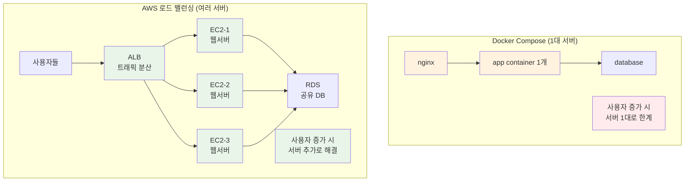
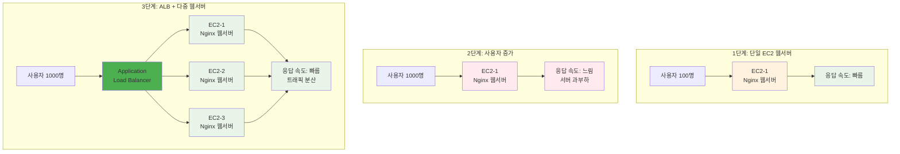
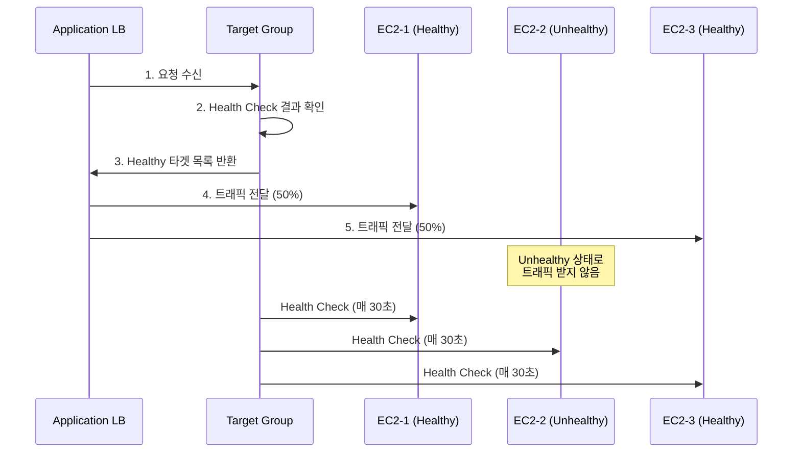
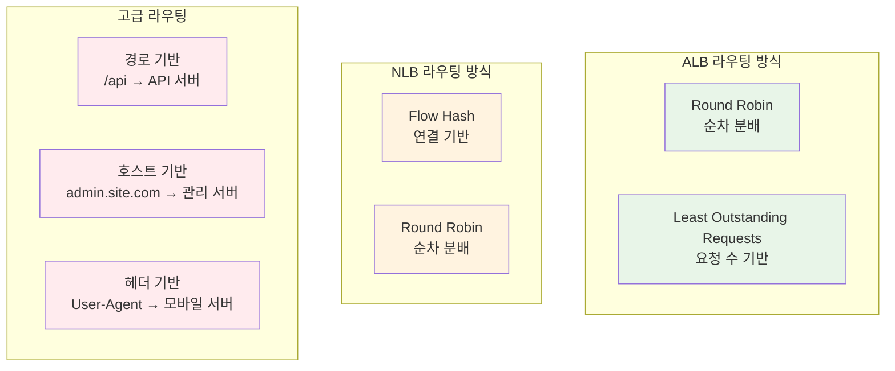

# Week 5 Day 4 Session 1: Elastic Load Balancing (09:00-09:50)

<div align="center">

**⚖️ 로드 밸런싱** • **🎯 트래픽 분산** • **🔍 헬스 체크** • **📊 고가용성**

*트래픽을 여러 서버에 분산하여 안정적인 서비스 제공*

</div>

---

## 🕘 세션 정보
**시간**: 09:00-09:50 (50분)
**목표**: AWS 로드 밸런서의 종류와 특징을 이해하고 실무 적용 방법 학습
**방식**: 이론 설명 + 실무 사례 분석

## 🎯 세션 목표

### 📚 학습 목표
- **이해 목표**: ALB, NLB, CLB의 차이점과 적용 시나리오 이해
- **적용 목표**: Target Group과 Health Check 설정 방법 습득
- **협업 목표**: 로드 밸런서 선택 기준을 팀과 함께 토론

### 🤔 왜 필요한가? (5분)

**현실 문제 상황**:
- 💼 **실무 시나리오**: "쇼핑몰 사이트에 사용자가 몰려서 서버가 느려져요. 어떻게 해야 하나요?"
- 🏠 **일상 비유**: 맛집에 손님이 몰리면 → 직원을 더 고용하고 → 주문을 나눠서 처리
- ☁️ **AWS 아키텍처**: 1개 EC2에서 웹서버 1개 → 3개 EC2에서 웹서버 3개 + ALB로 분산
- 📊 **시장 동향**: 쿠팡은 11번가 세일 때 수백 대의 서버로 트래픽 분산 처리

**Docker Compose vs AWS 비교**:


**핵심 차이점**:
- **Docker Compose**: 1대 서버에서 컨테이너만 여러 개
- **AWS ALB**: 여러 대 서버에서 각각 웹서버 실행 + 트래픽 분산

## 📖 핵심 개념 (35분)

### 🔍 개념 1: AWS 로드 밸런서 종류와 특징 (12분)

> **정의**: 들어오는 트래픽을 여러 대상에 자동으로 분산하는 AWS 관리형 서비스

**🏗️ 실제 웹서버 배포 시나리오**:


**각 EC2에서 실행되는 것**:
- **동일한 웹 애플리케이션** (Nginx + 정적 파일 또는 Node.js 앱)
- **동일한 코드**, 다른 서버에서 실행
- **공유 데이터베이스** (RDS)로 데이터 일관성 유지

**로드 밸런서 비교표**:
| 구분 | ALB (Application) | NLB (Network) | CLB (Classic) |
|------|-------------------|---------------|---------------|
| **OSI 계층** | Layer 7 (HTTP/HTTPS) | Layer 4 (TCP/UDP) | Layer 4/7 |
| **프로토콜** | HTTP, HTTPS, HTTP/2 | TCP, UDP, TLS | HTTP, HTTPS, TCP |
| **라우팅** | 경로, 호스트, 헤더 기반 | IP + 포트 기반 | 기본 라운드 로빈 |
| **성능** | 높음 | 매우 높음 (초저지연) | 보통 |
| **가격** | 중간 | 낮음 | 가장 낮음 |
| **권장 용도** | 웹 애플리케이션 | 게임, IoT, 고성능 | 레거시 (신규 비권장) |

**실무 선택 기준**:
- **ALB**: 웹 서비스, API, 마이크로서비스 (80% 사용 사례)
- **NLB**: 게임 서버, IoT, 극한 성능 필요 시
- **CLB**: 기존 시스템 유지 목적 (신규 개발 비권장)

### 🔍 개념 2: Target Groups와 Health Check (12분)

> **정의**: 로드 밸런서가 트래픽을 전달할 대상들을 그룹화하고 상태를 모니터링하는 메커니즘

**Target Group 동작 원리**:


**Target Group 타입**:
- **Instance**: EC2 인스턴스 직접 등록
- **IP**: 특정 IP 주소 (온프레미스, 컨테이너)
- **Lambda**: 서버리스 함수
- **ALB**: 다른 ALB (체인 구성)

**Health Check 설정**:
```yaml
Health Check 설정:
  Protocol: HTTP/HTTPS
  Path: /health
  Port: 80
  Interval: 30초 (기본값)
  Timeout: 5초
  Healthy Threshold: 5회 연속 성공
  Unhealthy Threshold: 2회 연속 실패
```

**실무 Health Check 예시**:
```bash
# 각 EC2에서 실행되는 간단한 웹서버
# EC2-1에서
echo "Server 1 - Healthy" > /var/www/html/health.html

# EC2-2에서  
echo "Server 2 - Healthy" > /var/www/html/health.html

# EC2-3에서
echo "Server 3 - Healthy" > /var/www/html/health.html

# ALB가 각 서버의 /health.html을 체크
# 응답이 200 OK면 Healthy, 아니면 Unhealthy
```

**Node.js 웹서버 예시**:
```javascript
// 각 EC2에서 동일한 앱 실행, 서버 정보만 다름
const express = require('express');
const app = express();

app.get('/', (req, res) => {
  res.json({ 
    message: 'Hello from Server!',
    server: process.env.SERVER_ID || 'unknown',
    timestamp: new Date().toISOString()
  });
});

app.get('/health', (req, res) => {
  res.status(200).json({ 
    status: 'healthy',
    server: process.env.SERVER_ID || 'unknown'
  });
});

app.listen(3000, () => {
  console.log(`Server ${process.env.SERVER_ID} running on port 3000`);
});
```

### 🔍 개념 3: 로드 밸런싱 알고리즘과 고급 기능 (11분)

> **정의**: 트래픽을 분산하는 방식과 고급 라우팅 기능

**로드 밸런싱 알고리즘**:


**ALB 고급 라우팅 규칙**:
```yaml
# 경로 기반 라우팅
Rule 1:
  Condition: Path = /api/*
  Action: Forward to API-Target-Group

Rule 2:
  Condition: Path = /admin/*
  Action: Forward to Admin-Target-Group

# 호스트 기반 라우팅
Rule 3:
  Condition: Host = mobile.example.com
  Action: Forward to Mobile-Target-Group

# 헤더 기반 라우팅
Rule 4:
  Condition: Header[User-Agent] contains "Mobile"
  Action: Forward to Mobile-Target-Group
```

**Sticky Sessions (세션 고정)**:
- **용도**: 사용자를 특정 서버에 고정 (세션 데이터 유지)
- **방식**: 쿠키 기반 또는 애플리케이션 기반
- **주의사항**: 서버 장애 시 세션 손실 가능

**Connection Draining**:
- **목적**: 서버 종료 시 기존 연결 안전하게 처리
- **동작**: 새 요청 차단 + 기존 요청 완료 대기
- **시간**: 1-3600초 설정 가능

**실무 사례 - Netflix 로드 밸런싱**:
- **문제**: 전 세계 2억 사용자의 동영상 스트리밍
- **해결**: 지역별 ALB + 콘텐츠 기반 라우팅
- **결과**: 99.99% 가용성 달성
- **핵심**: 지연 시간 기반 라우팅으로 최적 서버 선택

## 💭 함께 생각해보기 (10분)

### 🤝 페어 토론 (5분)

**토론 주제**:
1. **웹서버 확장**: "쇼핑몰 사이트에 사용자가 10배 늘어났다면 어떻게 대응하시겠어요?"
2. **Health Check 설계**: "웹서버가 정상인지 확인하려면 어떤 방법이 좋을까요?"
3. **Docker vs AWS**: "Docker Compose와 AWS ALB의 차이점을 어떻게 설명하시겠어요?"

**페어 활동 가이드**:
- 👥 **자유 페어링**: 경험이나 관심사가 비슷한 사람끼리
- 🔄 **역할 교대**: 3분씩 설명자/질문자 역할 바꾸기
- 📝 **핵심 정리**: 대화 내용 중 중요한 점 메모하기

### 🎯 전체 공유 (5분)

**인사이트 공유**:
- 페어 토론에서 나온 창의적인 아이디어
- 실무에서 적용 가능한 로드 밸런싱 전략
- 예상하지 못했던 고려사항들

**💡 이해도 체크 질문**:
- ✅ "ALB와 NLB의 주요 차이점을 설명할 수 있나요?"
- ✅ "Target Group의 Health Check가 실패하면 어떻게 되나요?"
- ✅ "어떤 상황에서 Sticky Session을 사용해야 하나요?"

## 🔑 핵심 키워드

### 🆕 새로운 용어
- **ALB (Application Load Balancer)**: L7 로드 밸런서, HTTP/HTTPS 트래픽 처리
- **NLB (Network Load Balancer)**: L4 로드 밸런서, 초고성능 TCP/UDP 처리
- **Target Group**: 로드 밸런서가 트래픽을 전달할 대상들의 그룹
- **Health Check**: 대상 서버의 상태를 주기적으로 확인하는 메커니즘

### 🔧 중요 개념
- **Connection Draining**: 서버 종료 시 기존 연결을 안전하게 처리하는 기능
- **Sticky Sessions**: 사용자를 특정 서버에 고정하는 세션 유지 기능
- **Cross-Zone Load Balancing**: 여러 AZ에 걸쳐 균등하게 트래픽 분산

### 💼 실무 용어
- **Listener**: 로드 밸런서가 특정 포트에서 연결 요청을 확인하는 프로세스
- **Rule**: 트래픽을 어떤 Target Group으로 라우팅할지 결정하는 조건
- **Weighted Routing**: 가중치를 부여하여 트래픽 비율을 조정하는 방식

## 📝 세션 마무리

### ✅ 오늘 세션 성과
- **기술적 이해**: AWS 로드 밸런서 3종류의 특징과 차이점 파악
- **실무 적용**: Target Group과 Health Check 설정 방법 학습
- **아키텍처 설계**: 상황별 적절한 로드 밸런서 선택 기준 습득

### 🎯 다음 세션 준비
- **Session 2 주제**: Auto Scaling Groups + 컨테이너 레지스트리
- **연결 내용**: 오늘 배운 ALB와 Auto Scaling Group을 연동하는 방법
- **사전 생각**: "서버가 자동으로 늘어나고 줄어든다면 어떤 장점이 있을까요?"

### 🔗 실습 연계
- **Lab 1**: 오늘 배운 ALB를 실제로 구성하고 여러 EC2에 트래픽 분산
- **Challenge**: 완전한 고가용성 아키텍처에서 ALB + ASG 통합 구성

---

<div align="center">

**⚖️ 로드 밸런싱 완료** • **🎯 트래픽 분산 이해** • **📊 고가용성 준비**

*다음 세션에서는 Auto Scaling으로 서버를 자동 확장해보겠습니다!*

</div>
