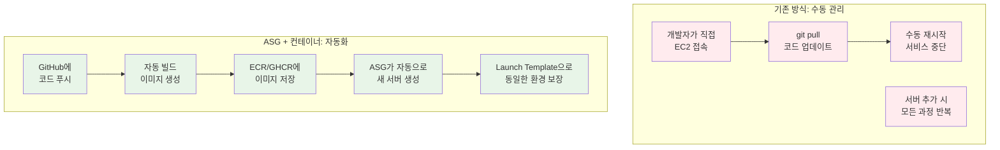
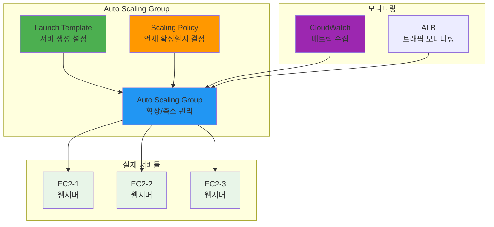
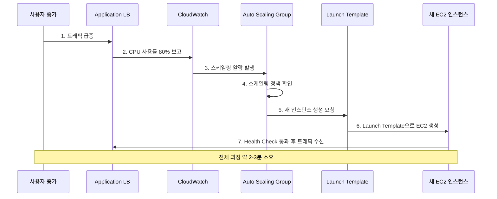
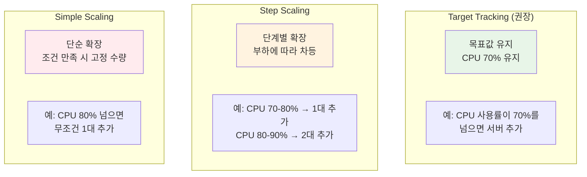
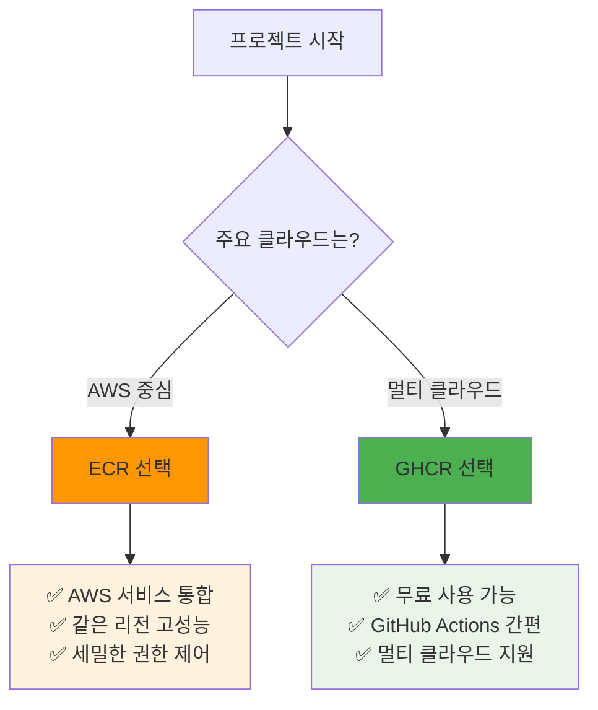

# Week 5 Day 4 Session 2: Auto Scaling Groups & 컨테이너 레지스트리 (10:00-10:50)

<div align="center">

**📈 자동 확장** • **🔄 탄력적 운영** • **📦 컨테이너 이미지** • **⚙️ Launch Template**

*서버를 자동으로 늘리고 줄이며 컨테이너 이미지를 효율적으로 관리*

</div>

---

## 🕘 세션 정보
**시간**: 10:00-10:50 (50분)
**목표**: Auto Scaling Groups 동작 원리와 컨테이너 레지스트리 전략 이해
**방식**: 이론 설명 + 실무 사례 분석

## 🎯 세션 목표

### 📚 학습 목표
- **이해 목표**: ASG의 동작 원리와 스케일링 정책 이해
- **적용 목표**: Launch Template 설정과 컨테이너 이미지 관리 방법 습득
- **협업 목표**: 트래픽 패턴에 따른 스케일링 전략을 팀과 함께 설계

### 🤔 왜 필요한가? (5분)

**현실 문제 상황**:
- 💼 **실무 시나리오**: "평소엔 서버 1대면 충분한데, 세일 기간엔 10대가 필요해요. 매번 수동으로 관리할 수 없어요!"
- 🏠 **일상 비유**: 카페에서 평일엔 직원 2명, 주말엔 5명 필요 → 자동으로 직원 수 조절
- ☁️ **AWS 아키텍처**: 수동 EC2 관리 → ASG로 트래픽에 따라 자동 확장/축소
- 📊 **시장 동향**: 쿠팡은 11번가 세일 때 서버를 자동으로 10배 확장 후 다시 축소

**Docker 이미지 관리의 진화**:


**핵심 변화**:
- **수동 관리** → **자동 스케일링**
- **서버별 설정** → **Launch Template 표준화**
- **코드 배포** → **컨테이너 이미지 배포**

## 📖 핵심 개념 (35분)

### 🔍 개념 1: Auto Scaling Groups 동작 원리 (12분)

> **정의**: 트래픽과 부하에 따라 EC2 인스턴스를 자동으로 늘리고 줄이는 AWS 서비스

**ASG 핵심 구성 요소**:


**ASG 동작 시나리오**:


**ASG 설정 요소**:
- **Desired Capacity**: 유지하고 싶은 인스턴스 수 (예: 3대)
- **Min Size**: 최소 인스턴스 수 (예: 2대)
- **Max Size**: 최대 인스턴스 수 (예: 10대)
- **Health Check**: 인스턴스 상태 확인 방식 (EC2 또는 ELB)

### 🔍 개념 2: Launch Template과 스케일링 정책 (12분)

> **정의**: 새로운 EC2 인스턴스를 생성할 때 사용할 설정 템플릿과 확장 조건

**Launch Template 구성**:
```yaml
Launch Template 설정:
  AMI: Amazon Linux 2023
  Instance Type: t3.micro
  Key Pair: my-key-pair
  Security Groups: web-server-sg
  User Data: |
    #!/bin/bash
    yum update -y
    yum install -y docker
    systemctl start docker
    
    # ECR 로그인
    aws ecr get-login-password --region ap-northeast-2 | \
    docker login --username AWS --password-stdin \
    123456789012.dkr.ecr.ap-northeast-2.amazonaws.com
    
    # 컨테이너 실행
    docker run -d -p 80:3000 \
    123456789012.dkr.ecr.ap-northeast-2.amazonaws.com/my-app:latest
```

**스케일링 정책 종류**:


**실무 스케일링 정책 예시**:
```yaml
# Target Tracking Policy (가장 일반적)
Policy Name: CPU-Target-Tracking
Target Value: 70%
Metric: Average CPU Utilization
Scale-out Cooldown: 300초 (5분)
Scale-in Cooldown: 300초 (5분)

# 동작 예시:
# CPU 70% 초과 → 5분 후 인스턴스 추가
# CPU 70% 미만 → 5분 후 인스턴스 제거
```

### 🔍 개념 3: 컨테이너 레지스트리 전략 (GHCR vs ECR) (11분)

> **정의**: Docker 이미지를 저장하고 관리하는 서비스 비교와 선택 기준

**GHCR vs ECR 상세 비교**:
| 구분 | GitHub Container Registry | Amazon ECR |
|------|---------------------------|------------|
| **비용** | Public: 무료<br/>Private: 500MB 무료 | $0.10/GB/month<br/>데이터 전송비 별도 |
| **통합성** | GitHub Actions 네이티브<br/>GitHub 계정으로 바로 사용 | AWS 서비스 완전 통합<br/>IAM 세밀한 권한 제어 |
| **성능** | 글로벌 CDN<br/>전 세계 빠른 접근 | 리전별 최적화<br/>같은 리전 내 초고속 |
| **보안** | GitHub 팀/조직 권한<br/>기본적인 접근 제어 | IAM Role/Policy<br/>세밀한 권한 관리 |
| **사용 편의성** | GitHub 계정만 있으면 즉시 사용 | AWS 계정 + IAM 설정 필요 |

**실무 선택 기준**:


**ECR 사용 예시**:
```bash
# 1. ECR 리포지토리 생성
aws ecr create-repository --repository-name my-web-app

# 2. Docker 이미지 빌드
docker build -t my-web-app .

# 3. ECR 로그인
aws ecr get-login-password --region ap-northeast-2 | \
docker login --username AWS --password-stdin \
123456789012.dkr.ecr.ap-northeast-2.amazonaws.com

# 4. 이미지 태그 및 푸시
docker tag my-web-app:latest \
123456789012.dkr.ecr.ap-northeast-2.amazonaws.com/my-web-app:latest

docker push \
123456789012.dkr.ecr.ap-northeast-2.amazonaws.com/my-web-app:latest
```

**GHCR 사용 예시**:
```bash
# 1. GitHub 토큰으로 로그인
echo $GITHUB_TOKEN | docker login ghcr.io -u USERNAME --password-stdin

# 2. 이미지 태그 및 푸시
docker tag my-web-app:latest ghcr.io/username/my-web-app:latest
docker push ghcr.io/username/my-web-app:latest

# 3. ASG Launch Template에서 사용
docker run -d -p 80:3000 ghcr.io/username/my-web-app:latest
```

**실무 사례 - 스타트업 vs 대기업**:
- **스타트업**: GHCR 사용 (무료, 빠른 시작, GitHub 중심 개발)
- **대기업**: ECR 사용 (보안, 규정 준수, AWS 인프라 통합)

## 💭 함께 생각해보기 (10분)

### 🤝 페어 토론 (5분)

**토론 주제**:
1. **스케일링 전략**: "온라인 쇼핑몰에서 블랙프라이데이 세일을 준비한다면 ASG를 어떻게 설정하시겠어요?"
2. **컨테이너 레지스트리**: "우리 프로젝트에는 GHCR과 ECR 중 어떤 것이 더 적합할까요?"
3. **Launch Template**: "새 서버가 생성될 때 어떤 소프트웨어들이 자동으로 설치되어야 할까요?"

**페어 활동 가이드**:
- 👥 **자유 페어링**: 경험이나 관심사가 비슷한 사람끼리
- 🔄 **역할 교대**: 3분씩 설명자/질문자 역할 바꾸기
- 📝 **핵심 정리**: 대화 내용 중 중요한 점 메모하기

### 🎯 전체 공유 (5분)

**인사이트 공유**:
- 페어 토론에서 나온 창의적인 스케일링 전략
- 컨테이너 레지스트리 선택의 실무적 고려사항
- 예상하지 못했던 ASG 활용 아이디어

**💡 이해도 체크 질문**:
- ✅ "ASG가 새 서버를 추가하는 과정을 설명할 수 있나요?"
- ✅ "Launch Template에 어떤 정보들이 포함되어야 하나요?"
- ✅ "GHCR과 ECR의 주요 차이점을 3가지 말할 수 있나요?"

## 🔑 핵심 키워드

### 🆕 새로운 용어
- **ASG (Auto Scaling Group)**: 트래픽에 따라 EC2 인스턴스를 자동으로 확장/축소하는 서비스
- **Launch Template**: 새 EC2 인스턴스 생성 시 사용할 설정 템플릿
- **Target Tracking**: 특정 메트릭 목표값을 유지하도록 자동 조정하는 스케일링 정책
- **Cooldown**: 스케일링 작업 후 다음 작업까지의 대기 시간

### 🔧 중요 개념
- **Desired Capacity**: ASG가 유지하려는 인스턴스 수
- **Health Check Grace Period**: 새 인스턴스가 헬스체크를 받기 전 대기 시간
- **Scale-out vs Scale-in**: 확장(서버 추가) vs 축소(서버 제거)

### 💼 실무 용어
- **ECR (Elastic Container Registry)**: AWS의 관리형 Docker 이미지 저장소
- **GHCR (GitHub Container Registry)**: GitHub의 컨테이너 이미지 저장소
- **Image Tag**: 컨테이너 이미지의 버전을 구분하는 라벨 (latest, v1.0.0 등)

## 📝 세션 마무리

### ✅ 오늘 세션 성과
- **기술적 이해**: ASG 동작 원리와 스케일링 정책 파악
- **실무 적용**: Launch Template 설정과 컨테이너 레지스트리 선택 기준 학습
- **아키텍처 설계**: 트래픽 패턴에 따른 자동 확장 전략 수립

### 🎯 다음 세션 준비
- **Session 3 주제**: 고가용성 아키텍처 설계
- **연결 내용**: 오늘 배운 ALB + ASG를 Multi-AZ로 확장하는 방법
- **사전 생각**: "서버가 여러 지역에 분산되어 있다면 어떤 장점이 있을까요?"

### 🔗 실습 연계
- **Lab 1**: 오늘 배운 ASG + Launch Template을 실제로 구성하고 부하 테스트
- **ECR 통합 가이드**: [GitHub Actions + ECR 완전 가이드](./ECR_GITHUB_ACTIONS_GUIDE.md) - OIDC 설정부터 자동 배포까지

---

<div align="center">

**📈 자동 확장 완료** • **🔄 탄력적 운영 이해** • **📦 컨테이너 관리 전략**

*다음 세션에서는 Multi-AZ 고가용성 아키텍처를 설계해보겠습니다!*

</div>
