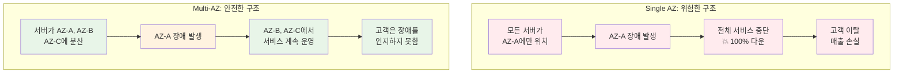
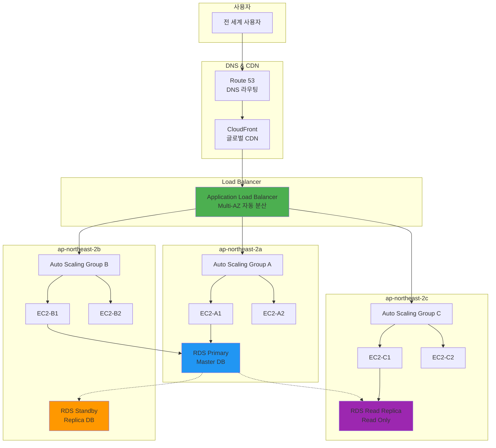
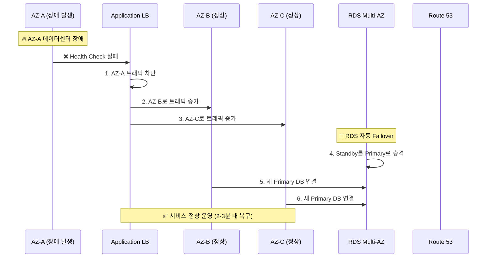
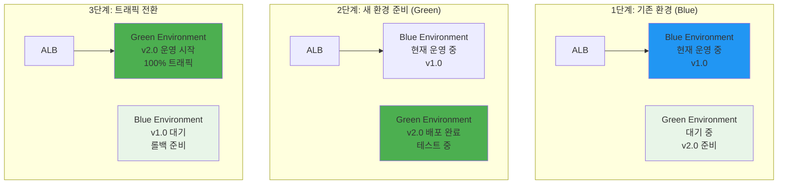
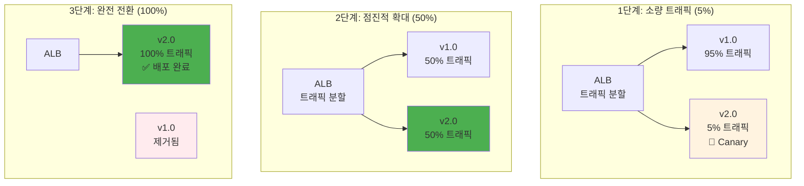

# Week 5 Day 4 Session 3: 고가용성 아키텍처 설계 (11:00-11:50)

<div align="center">

**🏗️ Multi-AZ 설계** • **🔄 장애 복구** • **🚀 무중단 배포** • **📊 99.99% 가용성**

*서비스가 절대 멈추지 않는 고가용성 아키텍처 구축*

</div>

---

## 🕘 세션 정보
**시간**: 11:00-11:50 (50분)
**목표**: 고가용성 아키텍처 설계 원칙과 AWS Multi-AZ 구성 방법 이해
**방식**: 이론 설명 + 실무 장애 사례 분석

## 🎯 세션 목표

### 📚 학습 목표
- **이해 목표**: Multi-AZ 배포와 장애 복구 메커니즘 이해
- **적용 목표**: Blue-Green, Canary 배포 전략 습득
- **협업 목표**: 팀과 함께 장애 시나리오별 대응 방안 설계

### 🤔 왜 필요한가? (5분)

**현실 문제 상황**:
- 💼 **실무 시나리오**: "은행 앱이 1시간 다운되면 수십억 원 손실! 절대 멈춰서는 안 돼요!"
- 🏠 **일상 비유**: 병원에 응급실이 여러 개 있듯이, 하나가 문제 생겨도 다른 곳에서 계속 진료
- ☁️ **AWS 아키텍처**: 단일 AZ → Multi-AZ로 지역별 분산 배치
- 📊 **시장 동향**: Netflix 99.99% 가용성 = 연간 52분만 다운타임 허용

**장애 영향도 비교**:


**실제 장애 사례**:
- **2021년 카카오톡**: 데이터센터 화재로 5시간 서비스 중단
- **2022년 AWS 장애**: 단일 AZ 의존 서비스들 연쇄 장애
- **교훈**: Multi-AZ 구성의 중요성

## 📖 핵심 개념 (35분)

### 🔍 개념 1: Multi-AZ 배포 전략 (12분)

> **정의**: 여러 가용 영역(AZ)에 서비스를 분산 배치하여 단일 장애점을 제거하는 아키텍처

**Multi-AZ 아키텍처 구성**:


**Multi-AZ 설계 원칙**:
- **최소 2개 AZ**: 기본적인 고가용성 확보
- **권장 3개 AZ**: 더 높은 가용성과 성능 분산
- **균등 분산**: 각 AZ에 동일한 용량 배치
- **독립성**: 각 AZ가 독립적으로 동작 가능

**가용성 계산**:
```yaml
Single AZ 가용성: 99.5% (연간 43.8시간 다운)
Multi-AZ 가용성: 99.99% (연간 52.6분 다운)

계산 공식:
Single AZ: 99.5%
Multi-AZ (2개): 1 - (0.005 × 0.005) = 99.9975%
Multi-AZ (3개): 1 - (0.005 × 0.005 × 0.005) = 99.999875%
```

### 🔍 개념 2: 장애 복구 메커니즘 (12분)

> **정의**: 장애 발생 시 자동으로 감지하고 복구하는 시스템과 절차

**자동 장애 복구 과정**:


**장애 감지 방법**:
- **Health Check**: ALB가 30초마다 각 인스턴스 상태 확인
- **CloudWatch Alarms**: 메트릭 기반 자동 알림
- **RDS Multi-AZ**: 60초 내 자동 Failover
- **Route 53 Health Check**: DNS 레벨 장애 감지

**복구 시간 목표 (RTO/RPO)**:
```yaml
RTO (Recovery Time Objective): 복구 시간 목표
- ALB Health Check: 30초 - 2분
- RDS Multi-AZ Failover: 60초 - 120초
- ASG 인스턴스 교체: 2분 - 5분

RPO (Recovery Point Objective): 데이터 손실 목표
- RDS Multi-AZ: 0초 (동기 복제)
- RDS Read Replica: 5분 이내
- S3 Cross-Region Replication: 15분 이내
```

### 🔍 개념 3: 무중단 배포 전략 (Blue-Green, Canary) (11분)

> **정의**: 서비스 중단 없이 새 버전을 안전하게 배포하는 방법론

**Blue-Green 배포**:


**Canary 배포**:


**배포 전략 비교**:
| 구분 | Blue-Green | Canary | Rolling |
|------|------------|--------|---------|
| **리소스 사용** | 2배 필요 | 1.1-1.5배 | 1배 |
| **롤백 속도** | 즉시 (DNS 변경) | 빠름 | 느림 |
| **위험도** | 낮음 | 매우 낮음 | 중간 |
| **복잡도** | 중간 | 높음 | 낮음 |
| **적용 사례** | 대규모 업데이트 | 중요한 서비스 | 일반적 배포 |

**실무 배포 시나리오**:
```yaml
# 금융 서비스 (높은 안정성 필요)
배포 전략: Canary
단계: 1% → 5% → 25% → 50% → 100%
모니터링: 각 단계마다 30분 관찰
롤백 조건: 에러율 0.1% 초과 시

# 일반 웹 서비스
배포 전략: Blue-Green
준비 시간: 30분
전환 시간: 5분
롤백 준비: 24시간 Blue 환경 유지
```

## 💭 함께 생각해보기 (10분)

### 🤝 페어 토론 (5분)

**토론 주제**:
1. **장애 시나리오**: "만약 서울 리전 전체에 정전이 발생한다면 어떻게 대응하시겠어요?"
2. **배포 전략**: "은행 앱과 게임 앱의 배포 전략이 달라야 하는 이유는 무엇일까요?"
3. **비용 vs 안정성**: "Multi-AZ 구성 시 비용이 2-3배 증가합니다. 어떻게 균형을 맞추시겠어요?"

**페어 활동 가이드**:
- 👥 **자유 페어링**: 경험이나 관심사가 비슷한 사람끼리
- 🔄 **역할 교대**: 3분씩 설명자/질문자 역할 바꾸기
- 📝 **핵심 정리**: 대화 내용 중 중요한 점 메모하기

### 🎯 전체 공유 (5분)

**인사이트 공유**:
- 페어 토론에서 나온 창의적인 장애 대응 방안
- 서비스 특성에 따른 배포 전략 차이점
- 비용과 안정성의 실무적 균형점

**💡 이해도 체크 질문**:
- ✅ "Multi-AZ 구성이 Single AZ보다 안전한 이유를 설명할 수 있나요?"
- ✅ "Blue-Green과 Canary 배포의 차이점을 말할 수 있나요?"
- ✅ "RDS Multi-AZ Failover가 어떻게 동작하는지 아시나요?"

## 🔑 핵심 키워드

### 🆕 새로운 용어
- **Multi-AZ**: 여러 가용 영역에 서비스를 분산 배치하는 아키텍처
- **RTO (Recovery Time Objective)**: 장애 발생 후 복구까지 목표 시간
- **RPO (Recovery Point Objective)**: 장애 시 허용 가능한 데이터 손실 시간
- **Failover**: 주 시스템 장애 시 대기 시스템으로 자동 전환

### 🔧 중요 개념
- **Blue-Green 배포**: 두 개의 동일한 환경을 번갈아 사용하는 무중단 배포
- **Canary 배포**: 소량 트래픽부터 점진적으로 새 버전을 배포하는 방식
- **Health Check**: 시스템 상태를 주기적으로 확인하는 모니터링 메커니즘

### 💼 실무 용어
- **Cross-AZ**: 가용 영역 간 데이터 복제 및 통신
- **Disaster Recovery**: 재해 복구 계획 및 절차
- **Circuit Breaker**: 장애 전파 방지를 위한 차단 메커니즘

## 📝 세션 마무리

### ✅ 오늘 세션 성과
- **기술적 이해**: Multi-AZ 아키텍처와 장애 복구 메커니즘 파악
- **실무 적용**: Blue-Green, Canary 배포 전략과 적용 시나리오 학습
- **아키텍처 설계**: 고가용성을 위한 종합적 설계 원칙 습득

### 🎯 다음 세션 준비
- **Session 4 주제**: 고객 사례 - News & Media 플랫폼 (Ghost CMS)
- **연결 내용**: 오늘 배운 Multi-AZ + ALB + ASG를 실제 뉴스 사이트에 적용
- **사전 생각**: "뉴스 사이트에서 속보 발생 시 트래픽이 급증한다면 어떻게 대응할까요?"

### 🔗 실습 연계
- **Challenge**: 완전한 고가용성 아키텍처 구현 - Multi-AZ + ALB + ASG + RDS
- **장애 테스트**: 의도적으로 AZ 장애를 발생시켜 복구 과정 체험

---

<div align="center">

**🏗️ 고가용성 설계 완료** • **🔄 장애 복구 이해** • **🚀 무중단 배포 전략**

*다음 세션에서는 실제 뉴스 플랫폼 사례로 종합 적용해보겠습니다!*

</div>
