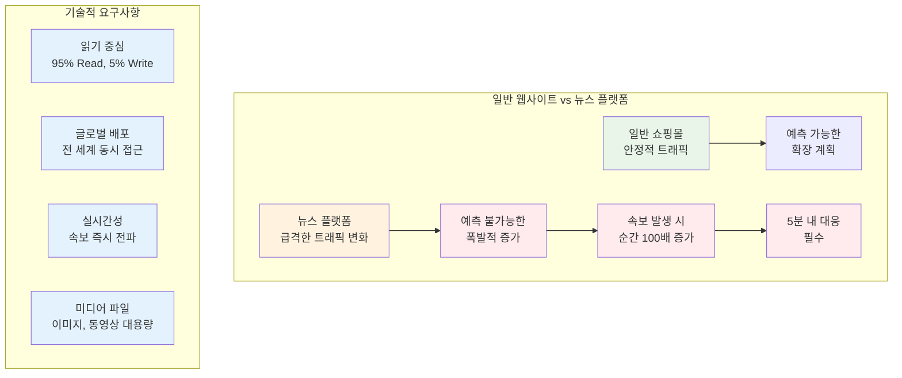
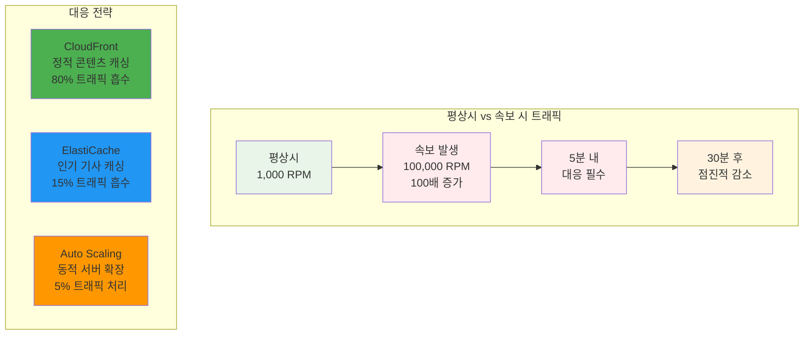
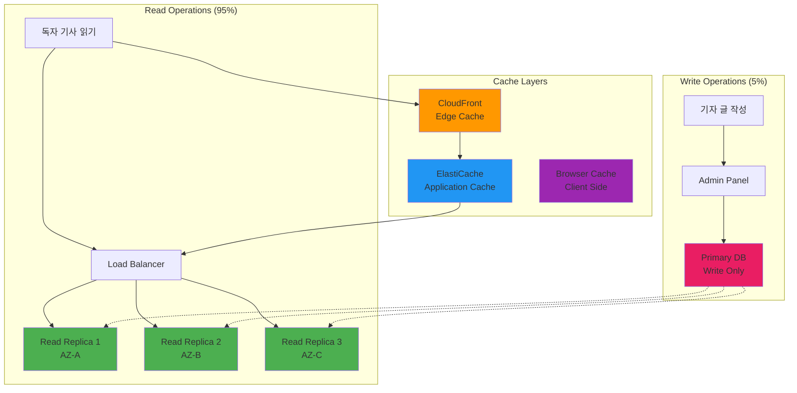

# Week 5 Day 4 Session 4: 고객 사례 - News & Media 플랫폼 (12:00-12:50)

<div align="center">

**📰 뉴스 플랫폼** • **📈 트래픽 급증 대응** • **🌍 글로벌 배포** • **⚡ 실시간 속보**

*Ghost CMS 기반 뉴스 포털의 AWS 고가용성 아키텍처*

</div>

---

## 🕘 세션 정보
**시간**: 12:00-12:50 (50분)
**목표**: 실제 뉴스 플랫폼 사례를 통한 AWS 서비스 통합 아키텍처 이해
**방식**: 실무 사례 분석 + 아키텍처 설계

## 🎯 세션 목표

### 📚 학습 목표
- **이해 목표**: 뉴스 미디어 플랫폼의 특수한 요구사항과 AWS 솔루션 이해
- **적용 목표**: Ghost CMS 기반 아키텍처에 Day 1-4 학습 내용 통합 적용
- **협업 목표**: 팀과 함께 트래픽 급증 시나리오별 대응 전략 수립

### 🤔 왜 필요한가? (5분)

**현실 문제 상황**:
- 💼 **실무 시나리오**: "속보 발생 시 평소 트래픽의 100배가 몰려요! 서버가 다운되면 안 돼요!"
- 🏠 **일상 비유**: TV 뉴스에서 속보가 나오면 모든 사람이 동시에 인터넷 뉴스를 확인하는 상황
- ☁️ **AWS 아키텍처**: 정적 콘텐츠 CDN + 동적 API 로드밸런싱 + 읽기 최적화 DB
- 📊 **시장 동향**: CNN은 대선 결과 발표 시 평소 대비 1000% 트래픽 증가 경험

**뉴스 플랫폼의 특수성**:


**실제 사례**:
- **2020년 미국 대선**: 주요 뉴스 사이트 트래픽 500-1000% 증가
- **2024년 올림픽**: 실시간 결과 발표 시 순간 트래픽 폭증
- **코로나19 발표**: WHO 발표 직후 전 세계 뉴스 사이트 동시 접속

## 📖 핵심 개념 (35분)

### 🔍 개념 1: Ghost CMS 뉴스 플랫폼 아키텍처 (12분)

> **정의**: Ghost CMS를 기반으로 한 현대적 뉴스 플랫폼의 AWS 클라우드 아키텍처

**전체 아키텍처 구성**:
```mermaid
graph TB
    subgraph "글로벌 사용자"
        U1[한국 독자]
        U2[미국 독자]
        U3[유럽 독자]
    end
    
    subgraph "CDN & DNS"
        R53[Route 53<br/>지연 시간 기반 라우팅]
        CF[CloudFront<br/>글로벌 CDN<br/>정적 콘텐츠 캐싱]
    end
    
    subgraph "Load Balancer"
        ALB[Application Load Balancer<br/>Multi-AZ 분산]
    end
    
    subgraph "Web Tier (Multi-AZ)"
        ASG[Auto Scaling Group<br/>Min: 3, Max: 50]
        EC2_1[EC2-1<br/>Ghost CMS]
        EC2_2[EC2-2<br/>Ghost CMS]
        EC2_3[EC2-3<br/>Ghost CMS]
    end
    
    subgraph "Cache Layer"
        REDIS[ElastiCache Redis<br/>세션 & 인기 기사 캐싱]
    end
    
    subgraph "Database Tier"
        RDS_W[RDS MySQL<br/>Primary (Write)]
        RDS_R1[RDS Read Replica 1<br/>ap-northeast-2a]
        RDS_R2[RDS Read Replica 2<br/>ap-northeast-2b]
        RDS_R3[RDS Read Replica 3<br/>ap-northeast-2c]
    end
    
    subgraph "Storage"
        S3[S3 Bucket<br/>이미지, 동영상<br/>미디어 파일]
    end
    
    subgraph "Monitoring"
        CW[CloudWatch<br/>메트릭 & 알람]
        SNS[SNS<br/>알림 시스템]
    end
    
    U1 --> R53
    U2 --> R53
    U3 --> R53
    R53 --> CF
    CF --> ALB
    
    ALB --> ASG
    ASG --> EC2_1
    ASG --> EC2_2
    ASG --> EC2_3
    
    EC2_1 --> REDIS
    EC2_2 --> REDIS
    EC2_3 --> REDIS
    
    EC2_1 --> RDS_W
    EC2_1 --> RDS_R1
    EC2_2 --> RDS_R2
    EC2_3 --> RDS_R3
    
    RDS_W -.-> RDS_R1
    RDS_W -.-> RDS_R2
    RDS_W -.-> RDS_R3
    
    EC2_1 --> S3
    EC2_2 --> S3
    EC2_3 --> S3
    CF --> S3
    
    EC2_1 -.-> CW
    ASG -.-> CW
    RDS_W -.-> CW
    CW --> SNS
    
    style CF fill:#ff9800
    style ALB fill:#4caf50
    style ASG fill:#2196f3
    style REDIS fill:#e91e63
    style RDS_W fill:#3f51b5
    style RDS_R1 fill:#9c27b0
    style RDS_R2 fill:#9c27b0
    style RDS_R3 fill:#9c27b0
    style S3 fill:#ff5722
```

**Ghost CMS 특징**:
- **Node.js 기반**: 빠른 성능과 확장성
- **마크다운 에디터**: 기자들이 쉽게 사용 가능
- **RESTful API**: 모바일 앱, 외부 시스템 연동
- **테마 시스템**: 브랜드별 커스터마이징

**Docker 컨테이너 구성**:
```yaml
# Ghost CMS 컨테이너 설정
services:
  ghost:
    image: ghost:5-alpine
    environment:
      database__client: mysql
      database__connection__host: rds-endpoint
      database__connection__user: ghost_user
      database__connection__password: ${DB_PASSWORD}
      database__connection__database: ghost_prod
      url: https://news.example.com
      mail__transport: SMTP
      mail__options__service: SES
    volumes:
      - ghost_content:/var/lib/ghost/content
    ports:
      - "2368:2368"
```

### 🔍 개념 2: 트래픽 급증 대응 전략 (12분)

> **정의**: 속보 발생 시 순간적인 트래픽 폭증에 대응하는 자동화된 확장 전략

**트래픽 패턴 분석**:


**Auto Scaling 정책 설정**:
```yaml
# 뉴스 플랫폼 특화 ASG 설정
Auto Scaling Group:
  Min Size: 3 (기본 가용성)
  Desired: 5 (평상시 운영)
  Max Size: 50 (속보 시 최대)

Target Tracking Policy:
  Metric: ALB Request Count Per Target
  Target Value: 1000 requests/minute/instance
  Scale-out Cooldown: 60초 (빠른 확장)
  Scale-in Cooldown: 300초 (안전한 축소)

Step Scaling Policy (추가):
  CPU > 70%: +2 instances
  CPU > 85%: +5 instances
  CPU > 95%: +10 instances
```

**캐싱 전략**:
```yaml
# CloudFront 캐싱 설정
Static Content (이미지, CSS, JS):
  TTL: 24시간
  Cache Hit Ratio: 95%+

Article Pages:
  TTL: 5분 (속보 시 1분)
  Cache Hit Ratio: 80%+

API Responses:
  TTL: 30초
  Cache Hit Ratio: 60%+

# ElastiCache Redis 설정
Hot Articles (인기 기사):
  TTL: 10분
  Memory: 16GB
  Hit Ratio: 90%+

User Sessions:
  TTL: 24시간
  Cluster Mode: Enabled
```

### 🔍 개념 3: 읽기 최적화 및 글로벌 배포 (11분)

> **정의**: 읽기 중심 워크로드 최적화와 전 세계 사용자를 위한 성능 최적화

**읽기 최적화 아키텍처**:


**글로벌 배포 전략**:
```yaml
# Route 53 지연 시간 기반 라우팅
Primary Region (ap-northeast-2):
  - 한국, 일본, 동남아시아 사용자
  - Full Stack 배포

Secondary Region (us-east-1):
  - 미국, 캐나다 사용자
  - Read Replica + CloudFront

Tertiary Region (eu-west-1):
  - 유럽 사용자
  - Read Replica + CloudFront

# CloudFront Edge Locations
Global Edge Locations: 400+ 위치
Regional Edge Caches: 13개 지역
Origin Shield: 주요 리전에 추가 캐시 계층
```

**성능 최적화 기법**:
```javascript
// Ghost CMS 성능 최적화 설정
const ghostConfig = {
  // 데이터베이스 연결 풀
  database: {
    client: 'mysql',
    connection: {
      host: process.env.DB_HOST,
      user: process.env.DB_USER,
      password: process.env.DB_PASSWORD,
      database: process.env.DB_NAME,
      // 읽기 전용 연결 풀
      acquireConnectionTimeout: 60000,
      pool: { min: 2, max: 20 }
    }
  },
  
  // Redis 캐싱
  caching: {
    frontend: true,
    redis: {
      host: process.env.REDIS_HOST,
      port: 6379,
      ttl: 600 // 10분 캐시
    }
  },
  
  // 이미지 최적화
  imageOptimization: {
    resize: true,
    quality: 80,
    formats: ['webp', 'jpg'],
    responsive: true
  }
};
```

**실시간 속보 배포**:
```yaml
# 속보 발생 시 자동화 워크플로우
Breaking News Workflow:
  1. 기자가 속보 작성 및 발행
  2. Webhook이 CloudFront 캐시 무효화
  3. ElastiCache 관련 캐시 삭제
  4. Push 알림 서비스 (SNS) 트리거
  5. 소셜 미디어 자동 포스팅
  6. 모니터링 알람 활성화

Cache Invalidation:
  - CloudFront: 즉시 무효화
  - ElastiCache: 관련 키 삭제
  - Browser: Cache-Control 헤더 조정
```

## 💭 함께 생각해보기 (10분)

### 🤝 페어 토론 (5분)

**토론 주제**:
1. **속보 대응**: "올림픽 금메달 소식이 나왔을 때 뉴스 사이트는 어떻게 대응해야 할까요?"
2. **글로벌 전략**: "한국 뉴스를 전 세계에 서비스한다면 어떤 AWS 서비스를 활용하시겠어요?"
3. **비용 최적화**: "평상시 트래픽 대비 100배 증가에 대비하면서도 비용을 절약하는 방법은?"

**페어 활동 가이드**:
- 👥 **자유 페어링**: 뉴스나 미디어에 관심 있는 사람끼리
- 🔄 **역할 교대**: 3분씩 기자/독자 관점에서 토론
- 📝 **핵심 정리**: 실무에서 적용 가능한 아이디어 메모

### 🎯 전체 공유 (5분)

**인사이트 공유**:
- 페어 토론에서 나온 창의적인 트래픽 대응 전략
- 글로벌 뉴스 서비스의 기술적 도전과 해결책
- 비용 효율적인 확장 전략

**💡 이해도 체크 질문**:
- ✅ "뉴스 플랫폼이 일반 웹사이트와 다른 특징을 3가지 말할 수 있나요?"
- ✅ "속보 발생 시 트래픽 급증에 어떻게 대응하는지 설명할 수 있나요?"
- ✅ "읽기 중심 워크로드를 위한 최적화 방법을 아시나요?"

## 🔑 핵심 키워드

### 🆕 새로운 용어
- **Ghost CMS**: Node.js 기반의 현대적 콘텐츠 관리 시스템
- **Read Replica**: 읽기 전용 데이터베이스 복제본으로 읽기 성능 향상
- **Edge Location**: CloudFront의 전 세계 캐시 서버 위치
- **Cache Invalidation**: 캐시된 콘텐츠를 강제로 무효화하는 작업

### 🔧 중요 개념
- **Request Per Minute (RPM)**: 분당 요청 수로 트래픽 측정 단위
- **Cache Hit Ratio**: 캐시에서 직접 응답한 요청의 비율
- **Origin Shield**: CloudFront의 추가 캐시 계층으로 오리진 보호

### 💼 실무 용어
- **Breaking News**: 속보, 긴급 뉴스로 트래픽 급증의 주요 원인
- **Content Delivery Network (CDN)**: 전 세계 사용자에게 빠른 콘텐츠 전송
- **Latency-based Routing**: 지연 시간 기반 DNS 라우팅 정책

## 📝 세션 마무리

### ✅ 오늘 세션 성과
- **실무 사례 이해**: 뉴스 플랫폼의 특수한 요구사항과 AWS 솔루션 파악
- **통합 아키텍처**: Day 1-4에서 배운 모든 AWS 서비스의 실제 적용 사례 학습
- **확장 전략**: 예측 불가능한 트래픽 급증에 대한 자동화된 대응 방안 습득

### 🎯 오후 실습 준비
- **Lab 1**: ALB + ASG 구성으로 기본 고가용성 아키텍처 구축
- **Challenge**: 완전한 뉴스 플랫폼 아키텍처 구현 - Multi-AZ + 캐싱 + 모니터링
- **연결 내용**: 오늘 배운 이론을 실제로 구현하고 부하 테스트

### 🔗 Day 5 연계
- **CloudMart 프로젝트**: 뉴스 플랫폼에서 배운 고가용성 패턴을 전자상거래에 적용
- **종합 아키텍처**: Week 5 전체 학습 내용을 하나의 프로덕션 시스템으로 통합

---

<div align="center">

**📰 뉴스 플랫폼 완료** • **📈 트래픽 급증 대응** • **🌍 글로벌 아키텍처**

*오후 실습에서 직접 고가용성 아키텍처를 구축해보겠습니다!*

</div>
