# Week 5 Day 5: CloudMart 프로젝트 AWS 배포

<div align="center">

**🚀 프로덕션 배포** • **🏗️ 전체 인프라** • **📊 모니터링** • **🔐 보안**

*Week 1-4에서 만든 CloudMart를 AWS에 완전 배포*

</div>

---

## 🎯 Day 5 목표

> **CloudMart 프로젝트를 AWS 프로덕션 환경에 완전히 배포하고 운영 준비 완료**

### 핵심 목표
- Week 1-4 CloudMart 프로젝트의 AWS 마이그레이션
- 프로덕션급 인프라 구축 (고가용성, 보안, 모니터링)
- 운영 자동화 및 비용 최적화
- 실무 배포 경험 습득

---

## 🕘 일일 스케줄

| 시간 | 구분 | 내용 | 목적 |
|------|------|------|------|
| **09:00-09:50** | 📚 이론 1 | [Session 1: 배포 전략 수립](./session_1.md) | 마이그레이션 계획 |
| **09:50-10:00** | ☕ 휴식 | 10분 휴식 | |
| **10:00-10:50** | 📚 이론 2 | [Session 2: 인프라 구성](./session_2.md) | 아키텍처 설계 |
| **10:50-11:00** | ☕ 휴식 | 10분 휴식 | |
| **11:00-11:50** | 📚 이론 3 | [Session 3: 모니터링 & 로깅](./session_3.md) | 관측성 구축 |
| **11:50-12:00** | ☕ 휴식 | 10분 휴식 | |
| **12:00-12:50** | 📚 이론 4 | [Session 4: 보안 & 백업](./session_4.md) | 운영 안정성 |
| **12:50-13:00** | ☕ 휴식 | 10분 휴식 | |
| **13:00-14:00** | 🍽️ 점심 | 점심시간 (60분) | |
| **14:00-14:50** | 🛠️ 실습 1 | [Lab 1: CloudMart 인프라 구축](./lab_1.md) | 전체 배포 |
| **14:50-15:00** | ☕ 휴식 | 10분 휴식 | |
| **15:00-15:50** | 🎯 Challenge | [Challenge: 프로덕션급 배포](./challenge_1.md) | 최종 완성 |
| **15:50-16:00** | ☕ 휴식 | 10분 휴식 | |
| **16:00-18:00** | 👥 케어 | 개별 멘토링 및 최종 점검 | 완성도 향상 |

---

## 📚 Session 개요

### Session 1: 배포 전략 수립 (09:00-09:50)
**주제**: CloudMart 아키텍처 분석 및 AWS 마이그레이션 계획

**핵심 내용**:
- CloudMart 현재 아키텍처 분석 (Docker Compose)
- AWS 서비스 매핑 전략
- 단계별 마이그레이션 계획
- 비용 추정 및 최적화

**학습 목표**:
- Docker Compose → AWS 서비스 매핑 이해
- 마이그레이션 전략 수립 능력
- 비용 효율적 아키텍처 설계

---

### Session 2: 인프라 구성 (10:00-10:50)
**주제**: CloudMart를 위한 AWS 인프라 설계

**핵심 내용**:
- Multi-AZ VPC 네트워크 설계
- 컴퓨팅 리소스 계획 (EC2, ASG)
- 데이터베이스 전략 (RDS Multi-AZ)
- 스토리지 구성 (S3, EBS)

**학습 목표**:
- 프로덕션급 네트워크 설계
- 고가용성 아키텍처 구성
- 리소스 최적 배치

---

### Session 3: 모니터링 & 로깅 (11:00-11:50)
**주제**: 운영을 위한 관측성 구축

**핵심 내용**:
- CloudWatch 메트릭 & 알람
- CloudWatch Logs 중앙화
- AWS X-Ray 분산 추적
- 대시보드 구성

**학습 목표**:
- 종합 모니터링 시스템 구축
- 로그 분석 및 활용
- 장애 대응 체계 수립

---

### Session 4: 보안 & 백업 (12:00-12:50)
**주제**: 프로덕션 환경의 보안과 재해 복구

**핵심 내용**:
- IAM 정책 & 역할 설계
- 보안 그룹 최적화
- 백업 전략 (RDS, EBS)
- 재해 복구 계획

**학습 목표**:
- 보안 베스트 프랙티스 적용
- 데이터 보호 전략 수립
- 비즈니스 연속성 계획

---

## 🛠️ 실습 개요

### Lab 1: CloudMart 인프라 구축 (14:00-14:50)
**목표**: CloudMart 전체 인프라를 AWS에 배포

**구축 내용**:
- Multi-AZ VPC 네트워크
- ALB + ASG (Backend)
- RDS PostgreSQL (Multi-AZ)
- ElastiCache Redis
- S3 + CloudFront (Frontend)

**예상 비용**: $0.50

---

### Challenge: 프로덕션급 배포 (15:00-15:50)
**목표**: 완전한 프로덕션 환경 구축 및 검증

**요구사항**:
1. 고가용성 (Multi-AZ)
2. 자동 확장 (ASG)
3. 모니터링 (CloudWatch)
4. 백업 & 복구 전략
5. 비용 최적화

**제약사항**:
- 비용: $0.80 이하
- 시간: 50분

**평가 기준**:
- 아키텍처 설계 (30%)
- 고가용성 구현 (30%)
- 보안 설정 (20%)
- 모니터링 (20%)

---

## 🏗️ CloudMart 최종 아키텍처

### 전체 구성도

```mermaid
graph TB
    subgraph "AWS Cloud - ap-northeast-2"
        subgraph "CDN Layer"
            CF[CloudFront<br/>Global CDN]
        end
        
        subgraph "Frontend Layer"
            S3[S3 Bucket<br/>React Frontend]
        end
        
        subgraph "VPC 10.0.0.0/16"
            subgraph "AZ-A"
                subgraph "Public Subnet A"
                    ALB_A[ALB]
                end
                subgraph "Private Subnet A"
                    EC2_A[EC2 ASG<br/>Backend API]
                    RDS_P[RDS Primary<br/>PostgreSQL]
                    REDIS_A[ElastiCache<br/>Redis]
                end
            end
            
            subgraph "AZ-B"
                subgraph "Public Subnet B"
                    ALB_B[ALB]
                end
                subgraph "Private Subnet B"
                    EC2_B[EC2 ASG<br/>Backend API]
                    RDS_S[RDS Standby<br/>PostgreSQL]
                    REDIS_B[ElastiCache<br/>Redis]
                end
            end
        end
        
        subgraph "Monitoring"
            CW[CloudWatch<br/>모니터링]
        end
    end
    
    CF --> S3
    CF --> ALB_A
    CF --> ALB_B
    ALB_A --> EC2_A
    ALB_B --> EC2_B
    EC2_A --> RDS_P
    EC2_B --> RDS_P
    RDS_P -.복제.-> RDS_S
    EC2_A --> REDIS_A
    EC2_B --> REDIS_B
    EC2_A --> CW
    EC2_B --> CW
    RDS_P --> CW
    
    style CF fill:#4caf50
    style S3 fill:#ff9800
    style ALB_A fill:#2196f3
    style ALB_B fill:#2196f3
    style EC2_A fill:#9c27b0
    style EC2_B fill:#9c27b0
    style RDS_P fill:#f44336
    style RDS_S fill:#ffebee
    style REDIS_A fill:#e91e63
    style REDIS_B fill:#e91e63
    style CW fill:#ff5722
```


### 사용된 AWS 서비스
-  **CloudFront**: 글로벌 CDN
-  **S3**: Frontend 정적 파일
-  **VPC**: 네트워크 격리
-  **ALB**: 로드 밸런싱
-  **EC2 + ASG**: Backend API 서버
-  **RDS**: PostgreSQL Multi-AZ
-  **ElastiCache**: Redis 캐싱
-  **CloudWatch**: 모니터링

---

## 💰 예상 비용

### 일일 비용 (12명 기준)
```
CloudFront: $0.50
S3: $0.20
ALB: $0.50
EC2 (t3.micro × 4): $1.00
RDS (db.t3.micro Multi-AZ): $2.00
ElastiCache (cache.t3.micro): $0.50
데이터 전송: $0.30
---
일일 합계: $5.00
학생당: $0.42/day
```

### 비용 절감 전략
- 프리티어 최대 활용
- 실습 시간 엄수 (50분)
- 즉시 리소스 정리
- 태그 기반 자동 정리

---

## 🎯 학습 성과

### Day 5 완료 후 달성 목표
- [ ] CloudMart 전체 AWS 배포 완료
- [ ] 프로덕션급 인프라 구축 경험
- [ ] 고가용성 아키텍처 이해
- [ ] 모니터링 & 로깅 시스템 구축
- [ ] 보안 베스트 프랙티스 적용
- [ ] 비용 최적화 전략 수립

### Week 5 전체 성과
- [ ] AWS 핵심 서비스 실무 활용
- [ ] Docker Compose → AWS 마이그레이션
- [ ] 고가용성 아키텍처 설계 및 구현
- [ ] 운영 자동화 및 모니터링
- [ ] 실무 배포 경험 습득

---

## 🔗 관련 자료

### 이전 Day 복습
- [Day 1: AWS 기초 & 네트워킹](../day1/README.md)
- [Day 2: 컴퓨팅 & 스토리지](../day2/README.md)
- [Day 3: 데이터베이스 & 캐싱](../day3/README.md)
- [Day 4: 로드밸런싱 & 고가용성](../day4/README.md)

### CloudMart 프로젝트
- Week 1-4에서 개발한 CloudMart 프로젝트
- Docker Compose 기반 로컬 개발 환경
- 이제 AWS 프로덕션 환경으로 마이그레이션

### AWS 공식 문서
- [AWS Well-Architected Framework](https://aws.amazon.com/architecture/well-architected/)
- [AWS 아키텍처 센터](https://aws.amazon.com/architecture/)
- [AWS 비용 최적화](https://aws.amazon.com/pricing/cost-optimization/)

---

## 🎉 Week 5 완료!

Day 5를 마치면 **Week 5 AWS 집중 과정**이 완료됩니다!

**다음 단계**:
- **Terraform 특강**: Infrastructure as Code
- **기본 프로젝트**: 4주간 팀 프로젝트
- **심화 프로젝트**: 5주간 전문화 트랙

---

<div align="center">

**🚀 CloudMart AWS 배포** • **🏗️ 프로덕션 인프라** • **📊 완전한 운영 환경**

*5일간의 AWS 여정의 대미를 장식하는 최종 배포!*

</div>
