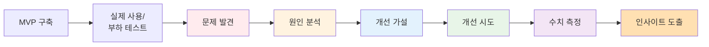

# Week 5 Day 5 Challenge 1: 프로젝트 인사이트 발굴 계획서 (15:00-15:50)

<div align="center">

**💡 통찰력 기반 프로젝트** • **📈 점진적 발전** • **🔍 Pain Point 발굴** • **🎯 차별화된 경쟁력**

*단순 구현을 넘어, 기술적 통찰력으로 면접관을 사로잡는 프로젝트*

</div>

---

## 🎯 이 Challenge의 진짜 목표

### 💭 일반 부트캠프 vs 우리의 차별점

**일반 부트캠프 프로젝트**:
```
"최신 기술 스택으로 멋진 프로젝트 만들기"
→ 결과: 화려하지만 깊이 없는 포트폴리오
→ 면접: "이 기술을 왜 선택했나요?" → 대답 못함
→ 결과: 서류는 통과, 면접에서 탈락
```

**우리의 프로젝트 접근법**:
```
"MVP → Pain Point 발견 → 점진적 개선 → 수치적 검증 → 통찰력 도출"
→ 결과: 기술적 의사결정의 이유를 명확히 설명 가능
→ 면접: "왜 이렇게 했나요?" → 데이터와 경험 기반 답변
→ 결과: 신입이지만 시니어급 통찰력 보유
```

### 🚀 프로젝트 진화 로드맵

```mermaid
graph LR
    A[Week 6-9<br/>기본 프로젝트] --> B[Docker Compose<br/>MVP 구축]
    B --> C[Pain Point<br/>발견 및 기록]
    C --> D[점진적<br/>개선 시도]
    D --> E[수치적<br/>검증]
    E --> F[Week 10-14<br/>심화 프로젝트]
    F --> G[고급 아키텍처<br/>적용]
    G --> H[Before/After<br/>비교 분석]
    H --> I[기술적 통찰력<br/>도출]
    I --> J[면접 무기화]
    
    style A fill:#e8f5e8
    style B fill:#fff3e0
    style C fill:#ffebee
    style D fill:#e3f2fd
    style E fill:#f3e5f5
    style F fill:#e8f5e8
    style G fill:#fff3e0
    style H fill:#ffebee
    style I fill:#e3f2fd
    style J fill:#f3e5f5
```



### 💡 우리가 만들 "통찰력"의 예시

#### 예시 1: 데이터베이스 성능 개선
**일반적인 답변** (탈락):
> "PostgreSQL을 사용했습니다. 왜냐하면 많이 쓰이니까요."

**통찰력 있는 답변** (합격):
> "초기에는 단순 CRUD만 있어서 PostgreSQL로 충분했습니다. 
> 하지만 사용자가 늘면서 상품 목록 조회 API의 응답 시간이 
> 평균 800ms에서 2.3초로 증가했습니다. (수치적 근거)
> 
> 원인 분석 결과, 복잡한 JOIN 쿼리와 페이지네이션이 문제였고,
> Redis 캐싱을 도입하여 자주 조회되는 데이터를 캐싱했습니다.
> 
> 결과: 응답 시간 2.3초 → 120ms (95% 개선)
> 캐시 히트율: 87%
> 
> 이 과정에서 '읽기 중심 워크로드에서는 캐싱이 필수'라는 
> 인사이트를 얻었고, 심화 프로젝트에서는 처음부터 
> 캐싱 전략을 설계에 포함시켰습니다."

#### 예시 2: 트래픽 급증 대응
**일반적인 답변** (탈락):
> "Auto Scaling을 사용했습니다."

**통찰력 있는 답변** (합격):
> "부하 테스트에서 동시 접속자 100명까지는 문제없었지만,
> 200명부터 응답 시간이 급격히 증가하고 500명에서 서버가 다운됐습니다.
> 
> 원인: 단일 컨테이너로 모든 요청 처리
> 
> 1차 개선: Docker Compose로 컨테이너 3개로 수평 확장
> → 동시 접속 500명까지 안정적 처리
> 
> 2차 개선 (심화): AWS ALB + Auto Scaling
> → 트래픽에 따라 자동으로 2-10개 인스턴스 조절
> → 비용 효율: 평소 $50/월 → 피크 시간만 $120/월
> 
> 인사이트: '수평 확장은 필수지만, 클라우드 Auto Scaling으로 
> 비용 효율까지 고려해야 실무에서 채택 가능한 아키텍처'"

### 🎯 이번 Challenge의 목표

**단순히 "무엇을 만들까?"가 아닙니다.**

**진짜 목표**:
1. **MVP 정의**: 최소 기능으로 빠르게 검증
2. **Pain Point 예측**: 어디서 문제가 생길지 미리 예상
3. **측정 지표 설정**: 무엇을 어떻게 측정할지 계획
4. **개선 가설 수립**: 문제 발생 시 어떻게 개선할지 가설
5. **심화 연결**: 기본 → 심화 프로젝트 발전 방향 설계

## 🕘 Challenge 정보
**시간**: 15:00-15:50 (50분)
**목표**: 통찰력 발굴을 위한 프로젝트 계획 수립
**방식**: 팀별 협업 작업
**제출물**: 프로젝트 계획서 + 아키텍처 다이어그램 + Pain Point 분석

## 📊 프로젝트 단계별 목표

### 기본 프로젝트 (Week 6-9, 4주)
**목표**: MVP 구축 및 Pain Point 발견
- ✅ Docker Compose로 빠른 배포
- ✅ 핵심 기능만 구현 (P0)
- ✅ 실제 사용하며 문제점 발견
- ✅ 성능 지표 측정 (응답 시간, TPS, 에러율)
- ✅ 개선 시도 및 결과 기록

### 심화 프로젝트 (Week 10-14, 5주)
**목표**: 고급 아키텍처 적용 및 통찰력 도출
- ✅ AWS 클라우드 네이티브 아키텍처
- ✅ 기본 프로젝트 Pain Point 해결
- ✅ Before/After 수치 비교
- ✅ 비용/성능/확장성 분석
- ✅ 기술적/비즈니스적 인사이트 정리

### 최종 결과물
**포트폴리오**:
- 📊 수치로 증명된 개선 사례
- 💡 기술적 의사결정의 근거
- 🎯 문제 해결 과정의 스토리
- 📈 점진적 발전의 증거

**면접 무기**:
- "왜 이 기술을 선택했나요?" → 명확한 근거
- "어려웠던 점은?" → 구체적인 문제와 해결 과정
- "개선한 경험은?" → 수치로 증명된 개선 사례
- "다음에는 어떻게 하겠나요?" → 인사이트 기반 발전 방향

---

## 📋 프로젝트 계획서 양식

### 📄 제출 양식

다음 양식에 맞춰 프로젝트 계획서를 작성하세요.

**파일명**: `[팀명]_프로젝트_계획서.md` (예: `team1_프로젝트_계획서.md`)

**제출 위치**: 각 팀 GitHub Repository의 `docs/` 폴더

---

## 📝 프로젝트 계획서 템플릿

```markdown
# [프로젝트명] 계획서

## 📌 프로젝트 개요

### 프로젝트명
- **한글명**: [프로젝트 한글 이름]
- **영문명**: [프로젝트 영문 이름]
- **버전**: v1.0.0

### 프로젝트 설명
[프로젝트에 대한 간단한 설명 (2-3문장)]

### 프로젝트 목표
- 목표 1: [구체적인 목표]
- 목표 2: [구체적인 목표]
- 목표 3: [구체적인 목표]

### 타겟 사용자
- 주요 사용자: [누가 사용하는가?]
- 사용 시나리오: [어떤 상황에서 사용하는가?]

---

## 🏗️ 아키텍처 설계

### Docker Compose 기반 아키텍처

**아키텍처 다이어그램**:
- 📎 첨부 파일: `architecture_diagram.png` 또는 `architecture_diagram.drawio`
- 🔗 온라인 링크: [Draw.io / Excalidraw / PPT 링크]

**권장 도구**:
- [Draw.io](https://app.diagrams.net/)
- [Excalidraw](https://excalidraw.com/)
- PowerPoint / Google Slides
- Mermaid (Markdown 내 작성 가능)

**아키텍처 다이어그램 포함 요소**:
```
필수 포함 사항:
- [ ] 모든 서비스 컨테이너 (Frontend, Backend, Database 등)
- [ ] 서비스 간 통신 방향 (화살표)
- [ ] 포트 번호 (예: 3000, 8080, 5432)
- [ ] 네트워크 구성 (Docker Network)
- [ ] 볼륨 마운트 (데이터 영속성)
- [ ] 외부 접근 경로 (사용자 → 서비스)

### 서비스 구성 요소

#### Frontend
| 항목 | 내용 |
|------|------|
| **기술 스택** | React / Vue / Angular / Next.js 등 |
| **포트** | 3000 (예시) |
| **주요 기능** | UI/UX, 사용자 인터랙션 |
| **외부 의존성** | Backend API |

#### Backend
| 항목 | 내용 |
|------|------|
| **기술 스택** | Node.js / Spring Boot / Django / FastAPI 등 |
| **포트** | 8080 (예시) |
| **주요 기능** | 비즈니스 로직, API 제공 |
| **외부 의존성** | Database, Cache (선택) |

#### Database
| 항목 | 내용 |
|------|------|
| **기술 스택** | PostgreSQL / MySQL / MongoDB 등 |
| **포트** | 5432 / 3306 / 27017 (예시) |
| **데이터 영속성** | Docker Volume 사용 |
| **초기 데이터** | 있음 / 없음 |

#### 기타 서비스 (선택 사항)
| 서비스 | 기술 스택 | 포트 | 용도 |
|--------|----------|------|------|
| Cache | Redis | 6379 | 세션, 캐싱 |
| Message Queue | RabbitMQ / Kafka | 5672 / 9092 | 비동기 처리 |
| 기타 | - | - | - |

### Docker Compose 구성

```yaml
# docker-compose.yml 예시 (실제 파일은 프로젝트 루트에 위치)

version: '3.8'

services:
  frontend:
    image: [이미지명]
    ports:
      - "3000:3000"
    depends_on:
      - backend
    networks:
      - app-network

  backend:
    image: [이미지명]
    ports:
      - "8080:8080"
    environment:
      - DB_HOST=database
      - DB_PORT=5432
    depends_on:
      - database
    networks:
      - app-network

  database:
    image: postgres:15
    ports:
      - "5432:5432"
    environment:
      - POSTGRES_DB=mydb
      - POSTGRES_USER=user
      - POSTGRES_PASSWORD=password
    volumes:
      - db-data:/var/lib/postgresql/data
    networks:
      - app-network

volumes:
  db-data:

networks:
  app-network:
    driver: bridge
```

---

## 🎯 기능 명세

### 핵심 기능 목록

**우선순위 분류**:
- **P0 (필수)**: 프로젝트의 핵심 기능, 반드시 구현
- **P1 (중요)**: 사용자 경험 향상, 가능하면 구현
- **P2 (선택)**: 추가 기능, 시간 여유 시 구현

#### 기능 1: [기능명]
| 항목 | 내용 |
|------|------|
| **우선순위** | P0 / P1 / P2 |
| **설명** | [기능에 대한 상세 설명] |
| **사용자 스토리** | "사용자는 [행동]을 통해 [목적]을 달성한다" |
| **API 엔드포인트** | `POST /api/[endpoint]` |
| **요청 예시** | `{ "key": "value" }` |
| **응답 예시** | `{ "status": "success" }` |
| **예상 소요 시간** | X일 |
| **담당자** | [팀원 이름] |

#### 기능 2: [기능명]
[동일한 형식으로 반복]

#### 기능 3: [기능명]
[동일한 형식으로 반복]

### 기능 목록 요약표

| 번호 | 기능명 | 우선순위 | 담당자 | 예상 소요 | 상태 |
|------|--------|----------|--------|-----------|------|
| 1 | [기능 1] | P0 | [이름] | 2일 | 대기 |
| 2 | [기능 2] | P0 | [이름] | 3일 | 대기 |
| 3 | [기능 3] | P1 | [이름] | 1일 | 대기 |
| 4 | [기능 4] | P2 | [이름] | 2일 | 대기 |

---

## 📡 API 명세

### API 엔드포인트 목록

#### 인증 관련
| Method | Endpoint | 설명 | 요청 Body | 응답 |
|--------|----------|------|-----------|------|
| POST | `/api/auth/register` | 회원가입 | `{ "email", "password" }` | `{ "userId", "token" }` |
| POST | `/api/auth/login` | 로그인 | `{ "email", "password" }` | `{ "token" }` |
| POST | `/api/auth/logout` | 로그아웃 | - | `{ "status": "success" }` |

#### 비즈니스 로직 관련
| Method | Endpoint | 설명 | 요청 Body | 응답 |
|--------|----------|------|-----------|------|
| GET | `/api/[resource]` | 목록 조회 | - | `[{ "id", "name" }]` |
| GET | `/api/[resource]/:id` | 상세 조회 | - | `{ "id", "name", "details" }` |
| POST | `/api/[resource]` | 생성 | `{ "name", "data" }` | `{ "id", "status" }` |
| PUT | `/api/[resource]/:id` | 수정 | `{ "name", "data" }` | `{ "status" }` |
| DELETE | `/api/[resource]/:id` | 삭제 | - | `{ "status" }` |

### API 부하 테스트 준비

**강사 부하 테스트를 위한 정보**:
- **테스트 대상 API**: [가장 중요한 API 3-5개 선정]
- **예상 TPS**: [초당 요청 수 예상치]
- **테스트 시나리오**: [사용자 행동 시나리오]

**예시**:
```
1. 로그인 API: POST /api/auth/login
   - 예상 TPS: 100
   - 시나리오: 동시 100명 로그인

2. 상품 조회 API: GET /api/products
   - 예상 TPS: 500
   - 시나리오: 메인 페이지 접속 시 호출
```

---

## 💻 기술 스택

### Frontend
- **프레임워크**: [React / Vue / Angular / Next.js]
- **상태 관리**: [Redux / Vuex / Zustand]
- **스타일링**: [Tailwind CSS / Material-UI / Styled-components]
- **기타**: [TypeScript / ESLint / Prettier]

### Backend
- **프레임워크**: [Node.js + Express / Spring Boot / Django / FastAPI]
- **ORM**: [Prisma / TypeORM / Sequelize / JPA / Django ORM]
- **인증**: [JWT / OAuth2 / Passport.js]
- **기타**: [TypeScript / Swagger / Jest]

### Database
- **RDBMS**: [PostgreSQL / MySQL]
- **NoSQL**: [MongoDB / Redis] (선택)
- **마이그레이션**: [Prisma Migrate / Flyway / Alembic]

### DevOps (Week 1-4 학습 내용)
- **컨테이너**: Docker, Docker Compose
- **오케스트레이션**: Kubernetes (Week 3)
- **CI/CD**: GitHub Actions (예정)
- **모니터링**: Prometheus, Grafana (Week 4)

### 클라우드 (Week 5 학습 예정)
- **AWS 서비스**: [다음 섹션에서 계획]

---

## ☁️ AWS 마이그레이션 계획

### Docker Compose → AWS 서비스 매핑

| Docker Compose | AWS 서비스 | 이유 |
|----------------|-----------|------|
| Frontend Container | **S3 + CloudFront** 또는 **ECS** | 정적 파일 호스팅 또는 컨테이너 실행 |
| Backend Container | **ECS** 또는 **EC2 + ALB** | 컨테이너 오케스트레이션 |
| Database Container | **RDS** (PostgreSQL/MySQL) | 관리형 데이터베이스 |
| Redis Container | **ElastiCache** | 관리형 캐시 |
| Docker Network | **VPC + Subnet** | 네트워크 격리 |
| Docker Volume | **EBS** 또는 **EFS** | 데이터 영속성 |
| Load Balancer | **ALB** (Application Load Balancer) | 로드 밸런싱 |

### 예상 AWS 아키텍처

```
사용자
  ↓
CloudFront (CDN)
  ↓
ALB (Load Balancer)
  ↓
ECS (Backend Containers)
  ↓
RDS (Database) + ElastiCache (Redis)
```

**아키텍처 다이어그램**: [AWS 아키텍처 다이어그램 첨부 또는 링크]

---

## ⚠️ Pain Points 발굴 및 개선 계획 (핵심!)

### 🎯 이 섹션이 가장 중요합니다!

**면접관이 가장 궁금해하는 것**:
- "프로젝트하면서 어려웠던 점은?"
- "어떻게 해결했나요?"
- "왜 그렇게 해결했나요?"
- "결과는 어땠나요?"

### Pain Point 발굴 프로세스



### 예상 Pain Point 1: [직접 작성]

#### 📋 Pain Point 정의
**문제 상황**:
- [구체적으로 어떤 문제가 발생할 것으로 예상되는가?]
- 예: "상품 목록 조회 시 응답 시간이 느릴 것으로 예상"

**예상 발생 시점**:
- [언제 이 문제가 나타날까?]
- 예: "데이터가 1,000개 이상 쌓이면"

**영향도**:
- [ ] 🔴 Critical: 서비스 사용 불가
- [ ] 🟡 High: 사용자 경험 저하
- [ ] 🟢 Medium: 불편하지만 사용 가능

#### 📊 측정 지표 설정

**현재 상태 (Baseline)**:
| 지표 | 목표 값 | 측정 방법 |
|------|---------|-----------|
| 응답 시간 | < 200ms | API 로그 분석 |
| TPS | > 100 | 부하 테스트 |
| 에러율 | < 1% | 에러 로그 |
| CPU 사용률 | < 70% | Docker stats |
| 메모리 사용률 | < 80% | Docker stats |

**측정 도구**:
- [ ] Postman / curl (수동 테스트)
- [ ] Apache Bench / wrk (부하 테스트)
- [ ] Docker stats (리소스 모니터링)
- [ ] Application 로그 (에러 추적)

#### 🔍 원인 분석 계획

**가설 1**: [예상 원인]
- 검증 방법: [어떻게 확인할 것인가?]
- 예: "DB 쿼리가 느림 → EXPLAIN ANALYZE로 쿼리 플랜 확인"

**가설 2**: [예상 원인]
- 검증 방법: [어떻게 확인할 것인가?]

**가설 3**: [예상 원인]
- 검증 방법: [어떻게 확인할 것인가?]

#### 💡 개선 방안 (기본 프로젝트)

**방안 1**: [Docker Compose 환경에서의 해결책]
- 구현 방법: [구체적인 구현 계획]
- 예상 효과: [수치로 표현]
- 예: "Redis 캐싱 도입 → 응답 시간 80% 감소 예상"

**방안 2**: [대안]
- 구현 방법:
- 예상 효과:

**방안 3**: [대안]
- 구현 방법:
- 예상 효과:

#### 🚀 고급 해결 방안 (심화 프로젝트)

**AWS 아키텍처 개선**:
- 적용 기술: [AWS 서비스명]
- 예: "ElastiCache Redis + RDS Read Replica"
- 예상 개선: [수치로 표현]
- 예: "응답 시간 200ms → 50ms, TPS 100 → 500"

**비용 분석**:
- 기본 프로젝트: $0 (로컬)
- 심화 프로젝트: $XX/월 (AWS)
- 비용 대비 효과: [ROI 계산]

#### 📈 검증 계획

**Before (기본 프로젝트)**:
```
측정 시점: Week 7
- 응답 시간: [측정값]
- TPS: [측정값]
- 에러율: [측정값]
```

**After (심화 프로젝트)**:
```
측정 시점: Week 12
- 응답 시간: [측정값] (XX% 개선)
- TPS: [측정값] (XX% 개선)
- 에러율: [측정값] (XX% 개선)
```

#### 💭 예상 인사이트

**기술적 인사이트**:
- [이 경험을 통해 배울 것으로 예상되는 기술적 교훈]
- 예: "읽기 중심 워크로드에서는 캐싱이 필수적이며, 캐시 무효화 전략이 중요하다"

**비즈니스적 인사이트**:
- [비용, 확장성, 유지보수 관점의 교훈]
- 예: "초기에는 단순한 아키텍처로 빠르게 검증하고, 트래픽 증가 시점에 확장하는 것이 비용 효율적"

---

### Pain Point 2: [직접 작성]
[동일한 형식으로 최소 3개 작성]

---

### Pain Point 3: [직접 작성]
[동일한 형식으로 최소 3개 작성]

---

### 📊 Pain Point 우선순위 매트릭스

| Pain Point | 발생 확률 | 영향도 | 우선순위 | 해결 시기 |
|-----------|----------|--------|----------|-----------|
| Pain Point 1 | 높음 | Critical | P0 | Week 7 |
| Pain Point 2 | 중간 | High | P1 | Week 8 |
| Pain Point 3 | 낮음 | Medium | P2 | Week 11 |

---

## 📊 측정 및 모니터링 계획

### 핵심 지표 (KPI)

#### 성능 지표
| 지표 | 목표 | 측정 주기 | 도구 |
|------|------|-----------|------|
| API 응답 시간 | < 200ms | 매일 | Application 로그 |
| 페이지 로드 시간 | < 2초 | 매일 | Browser DevTools |
| TPS (초당 처리량) | > 100 | 주간 | 부하 테스트 |
| 에러율 | < 1% | 매일 | 에러 로그 |

#### 리소스 지표
| 지표 | 목표 | 측정 주기 | 도구 |
|------|------|-----------|------|
| CPU 사용률 | < 70% | 실시간 | Docker stats |
| 메모리 사용률 | < 80% | 실시간 | Docker stats |
| 디스크 사용률 | < 80% | 주간 | df -h |
| 네트워크 대역폭 | < 100Mbps | 주간 | Docker stats |

#### 비즈니스 지표 (선택)
| 지표 | 목표 | 측정 주기 | 도구 |
|------|------|-----------|------|
| 사용자 수 | - | 매일 | Application 로그 |
| 전환율 | - | 주간 | Analytics |
| 이탈률 | < 50% | 주간 | Analytics |

### 부하 테스트 시나리오

#### 시나리오 1: 정상 트래픽
```bash
# Apache Bench 예시
ab -n 1000 -c 10 http://localhost:8080/api/products

# 목표:
# - 평균 응답 시간: < 200ms
# - 에러율: 0%
```

#### 시나리오 2: 피크 트래픽
```bash
# 동시 접속자 100명
ab -n 10000 -c 100 http://localhost:8080/api/products

# 목표:
# - 평균 응답 시간: < 500ms
# - 에러율: < 1%
```

#### 시나리오 3: 스트레스 테스트
```bash
# 한계점 찾기
ab -n 50000 -c 500 http://localhost:8080/api/products

# 목표:
# - 서버 다운 없이 처리
# - 한계 TPS 측정
```

### 강사 부하 테스트 준비

**제출 정보**:
- **테스트 대상 API**: [가장 중요한 API 3개]
- **예상 TPS**: [현실적인 목표]
- **테스트 시나리오**: [사용자 행동 기반]

**예시**:
```
1. 상품 목록 조회: GET /api/products
   - 예상 TPS: 100
   - 시나리오: 메인 페이지 접속 (가장 많이 호출)
   
2. 상품 상세 조회: GET /api/products/:id
   - 예상 TPS: 50
   - 시나리오: 상품 클릭
   
3. 장바구니 추가: POST /api/cart
   - 예상 TPS: 20
   - 시나리오: 구매 의사 있는 사용자
```

---


## 📚 참고 자료

### 학습 자료
- Week 1-2: Docker 기초 및 심화
- Week 3: Kubernetes
- Week 4: Cloud Native (Service Mesh, GitOps, FinOps)
- Week 5: AWS 인프라 구축

### 외부 참고 자료
- [프로젝트 관련 공식 문서 링크]
- [참고한 오픈소스 프로젝트]
- [기술 블로그 글]

---

## ✅ 제출 체크리스트

### 필수 항목
- [ ] 프로젝트 개요 작성 완료
- [ ] 아키텍처 다이어그램 첨부 (Docker Compose 기반)
- [ ] 기능 명세 상세 작성 (최소 5개 이상)
- [ ] API 엔드포인트 목록 작성
- [ ] 기술 스택 선정 및 이유 명시
- [ ] AWS 마이그레이션 계획 수립
- [ ] Pain Points 및 최적화 전략 (최소 3개)
- [ ] 팀 역할 분담 명확히 정의
- [ ] 주차별 계획 수립

### 권장 항목
- [ ] Docker Compose 파일 작성
- [ ] API 부하 테스트 시나리오
- [ ] 데이터베이스 ERD 다이어그램
- [ ] 화면 설계 (Wireframe)

---

## 📤 제출 방법

### 제출 위치
```
GitHub Repository: [팀 Repository URL]
└── docs/
    ├── [팀명]_프로젝트_계획서.md          # 이 문서
    ├── architecture_diagram.png           # 아키텍처 다이어그램
    ├── aws_architecture_diagram.png       # AWS 아키텍처 (선택)
    └── erd_diagram.png                    # ERD (선택)
```

### 제출 기한
- **마감**: Week 5 Day 5 (오늘) 18:00까지
- **제출 방법**: GitHub Repository에 Push 후 강사에게 링크 공유

---

## 🎤 발표 준비 (선택 사항)

### 발표 자료 (5분)
다음 주 월요일 간단한 프로젝트 소개 발표를 진행할 수 있습니다.

**발표 내용**:
1. 프로젝트 소개 (1분)
2. 아키텍처 설명 (2분)
3. 핵심 기능 소개 (1분)
4. 기술 스택 및 이유 (1분)

**발표 자료 형식**: PPT, PDF, 또는 Markdown

---

## 💡 작성 팁

### 좋은 계획서의 특징
- ✅ **구체적**: 모호한 표현 대신 명확한 수치와 기준
- ✅ **실현 가능**: 4주 내 완성 가능한 범위
- ✅ **우선순위 명확**: P0/P1/P2 분류로 집중할 기능 선정
- ✅ **역할 분담 명확**: 각 팀원의 책임 영역 정의
- ✅ **확장 가능**: AWS 마이그레이션을 고려한 설계

### 피해야 할 것
- ❌ 너무 많은 기능 (4주 내 완성 불가능)
- ❌ 모호한 표현 ("대충", "적당히", "나중에")
- ❌ 역할 분담 없음 (모두가 모든 것을 함)
- ❌ 기술 스택 선정 이유 없음

---

## 🔗 참고 예시

### 예시 프로젝트: "CloudMart"

**프로젝트 개요**:
- 온라인 쇼핑몰 플랫폼
- 사용자: 일반 소비자 및 판매자
- 목표: 간편한 상품 구매 및 판매 경험 제공

**핵심 기능**:
1. 회원가입/로그인 (P0)
2. 상품 목록 조회 (P0)
3. 상품 상세 조회 (P0)
4. 장바구니 (P1)
5. 주문/결제 (P1)
6. 리뷰 작성 (P2)

**기술 스택**:
- Frontend: React + TypeScript
- Backend: Node.js + Express
- Database: PostgreSQL
- Cache: Redis

**Docker Compose 구성**:
- frontend (React)
- backend (Node.js)
- database (PostgreSQL)
- cache (Redis)

## 🎤 면접 무기화 전략

### 💼 이 프로젝트로 면접에서 차별화하는 법

#### 일반 지원자 vs 당신

**질문: "프로젝트에서 어려웠던 점은?"**

❌ **일반 지원자**:
> "음... Docker 설정이 어려웠어요."

✅ **당신**:
> "초기 MVP에서는 문제없었지만, 부하 테스트 결과 
> 동시 접속자 200명부터 응답 시간이 800ms에서 2.3초로 증가했습니다.
> 
> 원인 분석 결과 DB 쿼리의 N+1 문제와 인덱스 부재가 원인이었고,
> 1) 쿼리 최적화 2) 인덱스 추가 3) Redis 캐싱을 순차적으로 적용했습니다.
> 
> 결과적으로 응답 시간을 120ms까지 개선했고 (95% 개선),
> 동시 접속 500명까지 안정적으로 처리 가능해졌습니다.
> 
> 이 경험을 통해 '성능 문제는 측정 없이 해결할 수 없다'는 
> 인사이트를 얻었습니다."

---

**질문: "왜 이 기술을 선택했나요?"**

❌ **일반 지원자**:
> "요즘 많이 쓰이는 기술이라서요."

✅ **당신**:
> "초기에는 PostgreSQL만 사용했습니다. 
> 하지만 상품 목록 조회가 전체 트래픽의 70%를 차지하고,
> 데이터 변경은 5%에 불과하다는 것을 로그 분석으로 확인했습니다.
> 
> 이는 전형적인 읽기 중심 워크로드이므로 Redis 캐싱이 
> 효과적일 것으로 판단했고, 실제로 캐시 히트율 87%를 달성하며
> 응답 시간을 95% 개선했습니다.
> 
> 심화 프로젝트에서는 AWS ElastiCache를 사용해 
> 관리 부담을 줄이고 고가용성을 확보했습니다."

---

**질문: "다음에는 어떻게 하시겠어요?"**

❌ **일반 지원자**:
> "더 공부해서 잘 만들겠습니다."

✅ **당신**:
> "이번 프로젝트에서 3가지 인사이트를 얻었습니다:
> 
> 1. 측정 없는 최적화는 무의미 → 처음부터 모니터링 설계
> 2. 읽기 중심 워크로드는 캐싱 필수 → 캐시 전략 사전 설계
> 3. 수평 확장은 비용 효율적 → Auto Scaling 기본 적용
> 
> 다음 프로젝트에서는 이 인사이트를 바탕으로
> 1) 초기 설계 단계에서 모니터링 지표 정의
> 2) 워크로드 분석 후 캐싱 전략 수립
> 3) 클라우드 네이티브 아키텍처로 시작
> 
> 이렇게 하면 개발 시간을 30% 단축하고
> 성능 문제를 사전에 예방할 수 있을 것으로 예상합니다."

---

### 📝 면접 답변 준비 템플릿

#### 기술 선택 이유
```
[기술명]을 선택한 이유:

1. 문제 상황: [구체적인 문제]
2. 데이터 분석: [수치적 근거]
3. 선택 근거: [왜 이 기술이 적합한가]
4. 결과: [수치로 증명된 개선]
5. 인사이트: [배운 교훈]
```

#### 문제 해결 경험
```
[문제명] 해결 과정:

1. 문제 발견: [언제, 어떻게 발견]
2. 측정: [구체적인 수치]
3. 원인 분석: [어떻게 원인을 찾았는가]
4. 해결 시도: [시도한 방법들]
5. 결과: [Before/After 비교]
6. 인사이트: [배운 교훈]
```

#### 프로젝트 발전 과정
```
기본 → 심화 프로젝트 발전:

1. 기본 프로젝트 한계: [구체적인 문제점]
2. 심화 프로젝트 개선: [적용한 기술]
3. 수치적 개선: [Before/After]
4. 비용 분석: [비용 대비 효과]
5. 인사이트: [기술적/비즈니스적 교훈]
```

---

## 📚 인사이트 도출 가이드

### 기술적 인사이트 예시

1. **"성능은 측정 없이 개선할 수 없다"**
   - 근거: 추측으로 최적화 시도 → 효과 없음
   - 측정 후 병목 지점 파악 → 95% 개선

2. **"읽기 중심 워크로드는 캐싱이 필수"**
   - 근거: 읽기 70%, 쓰기 5% 워크로드 분석
   - Redis 캐싱 도입 → 응답 시간 95% 개선

3. **"수평 확장은 수직 확장보다 비용 효율적"**
   - 근거: 단일 서버 스펙 업 vs 여러 서버 분산
   - 비용 비교 및 확장성 분석

### 비즈니스적 인사이트 예시

1. **"초기에는 단순하게, 필요할 때 복잡하게"**
   - 근거: 과도한 초기 설계 → 개발 지연
   - MVP 빠른 검증 → 점진적 개선이 효율적

2. **"클라우드는 비용이 아닌 투자"**
   - 근거: 관리 시간 vs 클라우드 비용 비교
   - 개발자 시간 절약 효과 분석

3. **"모니터링은 선택이 아닌 필수"**
   - 근거: 문제 발생 후 원인 파악 불가
   - 사전 모니터링으로 빠른 대응 가능

---

## ✅ 제출 체크리스트

### 필수 항목 (기본 점수)
- [ ] 프로젝트 개요 작성 완료
- [ ] Docker Compose 아키텍처 다이어그램
- [ ] 기능 명세 (P0/P1/P2 우선순위)
- [ ] API 엔드포인트 목록
- [ ] 기술 스택 선정 및 이유

### 핵심 항목 (차별화 점수) ⭐
- [ ] **Pain Point 3개 이상 상세 분석**
- [ ] **측정 지표 및 목표 수치 설정**
- [ ] **개선 가설 및 검증 계획**
- [ ] **Before/After 비교 계획**
- [ ] **예상 인사이트 도출**

### 고급 항목 (추가 점수)
- [ ] 부하 테스트 시나리오 작성
- [ ] 면접 답변 준비 (3개 이상)
- [ ] AWS 마이그레이션 상세 계획
- [ ] 비용 분석 및 ROI 계산
- [ ] 데이터베이스 ERD

---

## 📤 제출 방법

### 제출 위치
```
GitHub Repository: [팀 Repository URL]
└── docs/
    ├── [팀명]_프로젝트_계획서.md          # 이 문서
    ├── architecture_diagram.png           # Docker Compose 아키텍처
    ├── aws_architecture_diagram.png       # AWS 아키텍처 (선택)
    ├── pain_point_analysis.md             # Pain Point 상세 분석 (선택)
    └── interview_preparation.md           # 면접 답변 준비 (선택)
```

### 제출 기한
- **마감**: Week 5 Day 5 (오늘) 18:00까지
- **제출 방법**: GitHub Repository에 Push 후 강사에게 링크 공유

---

## 💡 작성 팁

### 좋은 계획서의 특징
- ✅ **수치 기반**: 모든 목표와 개선을 수치로 표현
- ✅ **측정 가능**: 성공/실패를 명확히 판단 가능
- ✅ **인사이트 중심**: 단순 구현이 아닌 배움에 집중
- ✅ **발전 계획**: 기본 → 심화 연결고리 명확
- ✅ **면접 준비**: 질문에 대한 답변 미리 준비

### 피해야 할 것
- ❌ "대충", "적당히", "나중에" 같은 모호한 표현
- ❌ 측정 계획 없는 목표 ("성능 개선")
- ❌ 근거 없는 기술 선택 ("유행이라서")
- ❌ Pain Point 없는 완벽한 계획 (비현실적)

---

<div align="center">

**💡 통찰력이 경쟁력** • **📊 수치가 증거** • **🎯 측정이 개선의 시작** • **🚀 점진적 발전이 성공의 열쇠**

*일반 부트캠프 졸업생과 차별화되는 당신만의 무기를 만드세요!*

</div>
