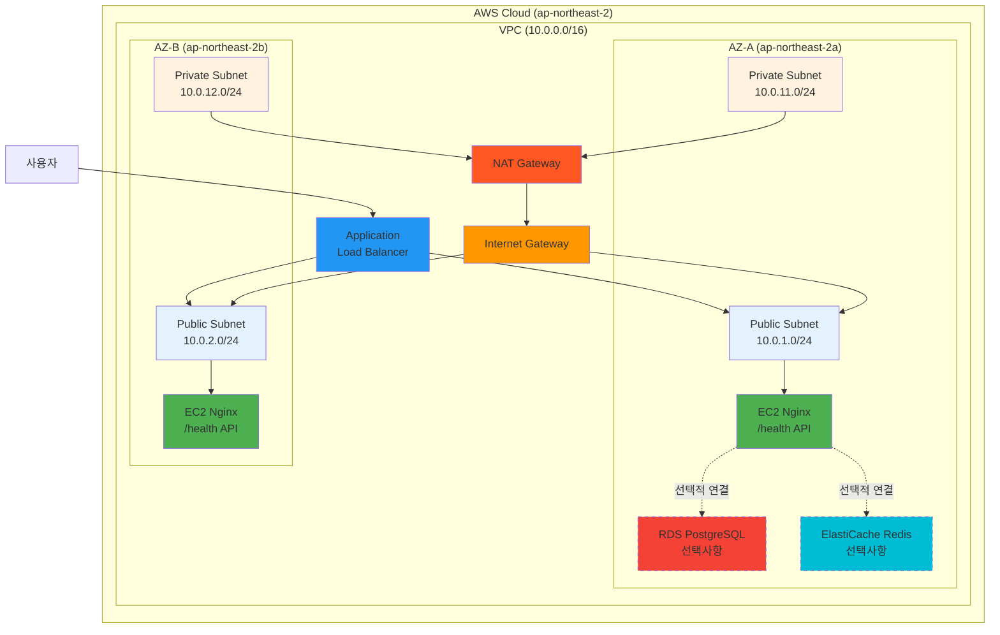

# Week 5 Day 5 Lab 1: CloudMart 인프라 구축 (14:00-14:50)

<div align="center">

**🚀 전체 배포** • **🏗️ Multi-AZ** • **📊 모니터링** • **🔐 보안**

*CloudMart 프로젝트를 AWS에 완전 배포*

</div>

---

## 🕘 Lab 정보
**시간**: 14:00-14:50 (50분)
**목표**: AWS 인프라 구축 능력 검증 (Multi-AZ, ALB, ASG)
**방식**: AWS Web Console 실습
**예상 비용**: $0.20

## 🎯 학습 목표
- [ ] Multi-AZ VPC 네트워크 구축 (Public/Private Subnet, NAT Gateway)
- [ ] Internet Gateway 및 Route Table 설정
- [ ] Security Group 체이닝 구성
- [ ] ALB + Target Group 설정
- [ ] Launch Template 및 Auto Scaling Group 구성
- [ ] Health Check 동작 검증

---

## 🏗️ 구축할 아키텍처

### 📐 Lab 1 아키텍처 (인프라 검증용)


**💡 아키텍처 구성**:

**필수 구성** (40분):
- ✅ **VPC**: Multi-AZ 네트워크 구성 (Public/Private Subnet)
- ✅ **NAT Gateway**: Private Subnet의 아웃바운드 트래픽
- ✅ **ALB**: 로드 밸런싱 및 Health Check
- ✅ **EC2 (Nginx)**: 간단한 `/health` API 응답

**선택적 구성** (시간 여유 시, 20분):
- 📚 **RDS PostgreSQL**: 데이터베이스 구성 연습
- 📚 **ElastiCache Redis**: 캐시 서버 구성 연습
- 💡 실제 연결은 하지 않고 생성만 연습

**🎯 Lab 1의 목표**:
- AWS 인프라 구축 능력 검증
- Multi-AZ 네트워크 설계
- ALB + ASG 구성
- Health Check 동작 확인

**이미지 자리**: Lab 1 아키텍처 다이어그램

### 🔗 참조 Session
**당일 Session**:
- [Session 1: 배포 전략 수립](./session_1.md) - 마이그레이션 계획
- [Session 2: 인프라 구성](./session_2.md) - VPC, RDS, ElastiCache
- [Session 3: 모니터링 & 로깅](./session_3.md) - CloudWatch
- [Session 4: 보안 & 백업](./session_4.md) - IAM, 보안 그룹

**이전 Day Session**:
- [Day 1 Session 2: VPC 아키텍처](../day1/session_2.md) - VPC 기초
- [Day 3 Session 1: RDS 기초](../day3/session_1.md) - RDS 구성
- [Day 4 Session 1: ELB](../day4/session_1.md) - ALB 설정

---

## 📦 사전 준비: CloudMart 샘플 앱 다운로드

---

## 🛠️ Step 1: VPC 네트워크 구성 (10분)

### 📋 이 단계에서 할 일
- VPC 생성 (10.0.0.0/16)
- 4개 Subnet 생성 (Public × 2, Private × 2)
- Internet Gateway 및 NAT Gateway 설정
- Route Table 구성

### 🔗 참조 개념
- [Session 2: 인프라 구성](./session_2.md) - Multi-AZ VPC 설계

### 📝 실습 절차

#### 1-1. VPC 생성

**AWS Console 경로**:
- 🔗 [VPC Console 바로가기](https://ap-northeast-2.console.aws.amazon.com/vpc/home?region=ap-northeast-2#vpcs:)
```
AWS Console → VPC → Your VPCs → Create VPC
```

**설정 값**:
| 항목 | 값 | 설명 |
|------|-----|------|
| Name | cloudmart-vpc | VPC 이름 |
| IPv4 CIDR | 10.0.0.0/16 | 65,536개 IP |
| IPv6 CIDR | No IPv6 | IPv6 미사용 |
| Tenancy | Default | 공유 하드웨어 |

**이미지 자리**: VPC 생성 화면

#### 1-2. Subnet 생성 (4개)

**AWS Console 경로**:
- 🔗 [Subnets Console 바로가기](https://ap-northeast-2.console.aws.amazon.com/vpc/home?region=ap-northeast-2#subnets:)
```
VPC → Subnets → Create subnet
```

**1-2-1. Public Subnet A 생성**:
1. **Create subnet** 클릭
2. 설정:
   - VPC: cloudmart-vpc
   - Subnet name: `cloudmart-public-a`
   - Availability Zone: `ap-northeast-2a`
   - IPv4 CIDR block: `10.0.1.0/24`
3. **Create subnet** 클릭

**1-2-2. Public Subnet B 생성**:
1. **Create subnet** 클릭
2. 설정:
   - VPC: cloudmart-vpc
   - Subnet name: `cloudmart-public-b`
   - Availability Zone: `ap-northeast-2b`
   - IPv4 CIDR block: `10.0.2.0/24`
3. **Create subnet** 클릭

**1-2-3. Private Subnet A 생성**:
1. **Create subnet** 클릭
2. 설정:
   - VPC: cloudmart-vpc
   - Subnet name: `cloudmart-private-a`
   - Availability Zone: `ap-northeast-2a`
   - IPv4 CIDR block: `10.0.11.0/24`
3. **Create subnet** 클릭

**1-2-4. Private Subnet B 생성**:
1. **Create subnet** 클릭
2. 설정:
   - VPC: cloudmart-vpc
   - Subnet name: `cloudmart-private-b`
   - Availability Zone: `ap-northeast-2b`
   - IPv4 CIDR block: `10.0.12.0/24`
3. **Create subnet** 클릭

**이미지 자리**: 4개 Subnet 생성 완료 화면

**1-2-5. Public Subnet에 Public IP 자동 할당 활성화** ⚠️ **필수**:

**cloudmart-public-a 설정**:
1. **cloudmart-public-a** 선택
2. **Actions** → **Edit subnet settings**
3. **Enable auto-assign public IPv4 address** 체크
4. **Save** 클릭

**cloudmart-public-b 설정**:
1. **cloudmart-public-b** 선택
2. **Actions** → **Edit subnet settings**
3. **Enable auto-assign public IPv4 address** 체크
4. **Save** 클릭

**이미지 자리**: Public IP 자동 할당 설정 화면

**💡 왜 필요한가?**
- EC2 인스턴스가 인터넷에 접근하려면 Public IP 필요
- SSM Agent가 AWS Systems Manager와 통신하려면 인터넷 접근 필요
- User Data 스크립트에서 외부 파일 다운로드 시 필요

**📊 생성된 Subnet 요약**:
| Subnet | AZ | CIDR | 타입 | Public IP 자동 할당 |
|--------|-----|------|------|---------------------|
| cloudmart-public-a | ap-northeast-2a | 10.0.1.0/24 | Public | ✅ 활성화 |
| cloudmart-public-b | ap-northeast-2b | 10.0.2.0/24 | Public | ✅ 활성화 |
| cloudmart-private-a | ap-northeast-2a | 10.0.11.0/24 | Private | ❌ 비활성화 |
| cloudmart-private-b | ap-northeast-2b | 10.0.12.0/24 | Private | ❌ 비활성화 |

#### 1-3. Internet Gateway 생성

**AWS Console 경로**:
- 🔗 [Internet Gateways Console 바로가기](https://ap-northeast-2.console.aws.amazon.com/vpc/home?region=ap-northeast-2#igws:)
```
VPC → Internet Gateways → Create internet gateway
```

**설정**:
- Name: cloudmart-igw
- Attach to VPC: cloudmart-vpc

**이미지 자리**: IGW 연결 화면

#### 1-4. NAT Gateway 생성

**AWS Console 경로**:
- 🔗 [NAT Gateways Console 바로가기](https://ap-northeast-2.console.aws.amazon.com/vpc/home?region=ap-northeast-2#NatGateways:)
```
VPC → NAT Gateways → Create NAT gateway
```

**설정**:
- Name: cloudmart-nat-a
- Subnet: cloudmart-public-a
- Elastic IP: Allocate Elastic IP

**이미지 자리**: NAT Gateway 생성 화면

#### 1-5. Route Table 설정

**AWS Console 경로**:
- 🔗 [Route Tables Console 바로가기](https://ap-northeast-2.console.aws.amazon.com/vpc/home?region=ap-northeast-2#RouteTables:)
```
VPC → Route Tables → Create route table
```

**1-5-1. Public Route Table 생성**:
| 항목 | 값 |
|------|-----|
| Name | cloudmart-public-rt |
| VPC | cloudmart-vpc |

**Routes 추가**:
1. **Edit routes** 클릭
2. **Add route** 클릭
   - Destination: `0.0.0.0/0`
   - Target: Internet Gateway → `cloudmart-igw`
3. **Save changes**

**Subnet Associations**:
1. **Subnet associations** 탭
2. **Edit subnet associations**
3. 선택:
   - ✅ cloudmart-public-a
   - ✅ cloudmart-public-b
4. **Save associations**

**이미지 자리**: Public Route Table 설정

**1-5-2. Private Route Table 생성**:
| 항목 | 값 |
|------|-----|
| Name | cloudmart-private-rt |
| VPC | cloudmart-vpc |

**Routes 추가**:
1. **Edit routes** 클릭
2. **Add route** 클릭
   - Destination: `0.0.0.0/0`
   - Target: NAT Gateway → `cloudmart-nat-a`
3. **Save changes**

**⚠️ 중요**: NAT Gateway가 `available` 상태가 될 때까지 기다린 후 Route 추가

**Subnet Associations**:
1. **Subnet associations** 탭
2. **Edit subnet associations**
3. 선택:
   - ✅ cloudmart-private-a
   - ✅ cloudmart-private-b
4. **Save associations**

**이미지 자리**: Private Route Table 설정

**💡 Private Subnet의 인터넷 접근**:
- Private Subnet의 리소스(RDS, Redis)는 직접 인터넷 접근 불가
- NAT Gateway를 통해 아웃바운드 트래픽만 가능 (패키지 업데이트 등)
- 인바운드 트래픽은 VPC 내부에서만 가능 (보안 강화)

### ✅ Step 1 검증

**AWS Console에서 확인**:
```
VPC → Your VPCs → cloudmart-vpc 선택
→ Details 탭에서 CIDR 확인: 10.0.0.0/16

VPC → Subnets → Filter by VPC: cloudmart-vpc
→ 4개 Subnet 확인 (Public × 2, Private × 2)

VPC → Internet Gateways → cloudmart-igw
→ State: Attached

VPC → NAT Gateways → cloudmart-nat-a
→ State: Available

VPC → Route Tables
→ cloudmart-public-rt: 0.0.0.0/0 → IGW 확인
→ cloudmart-private-rt: 0.0.0.0/0 → NAT GW 확인
```

**이미지 자리**: 검증 결과

**✅ 체크리스트**:
- [ ] VPC 생성 완료 (10.0.0.0/16)
- [ ] 4개 Subnet 생성 완료
- [ ] Internet Gateway 연결 완료
- [ ] NAT Gateway 생성 완료
- [ ] Route Table 설정 완료

---

## 🛠️ Step 2: ALB + ASG Backend 배포 (30분)

### 📋 이 단계에서 할 일
- ALB Security Group 생성
- Backend Security Group 생성
- Launch Template 생성 (Nginx)
- ALB 및 Target Group 생성
- Auto Scaling Group 생성

### 🔗 참조 개념
- [Day 4 Session 1: ELB](../day4/session_1.md) - ALB 설정
- [Day 4 Session 2: Auto Scaling](../day4/session_2.md) - ASG 구성

### 📝 실습 절차

#### 2-1. ALB Security Group 생성

**AWS Console 경로**:
- 🔗 [RDS Subnet Groups Console 바로가기](https://ap-northeast-2.console.aws.amazon.com/rds/home?region=ap-northeast-2#db-subnet-groups-list:)
```
RDS → Subnet groups → Create DB subnet group
```

**설정**:
- Name: cloudmart-db-subnet-group
- VPC: cloudmart-vpc
- Subnets: cloudmart-private-a, cloudmart-private-b

**이미지 자리**: DB Subnet Group 생성

#### 2-2. Security Group 생성

**AWS Console 경로**:
- 🔗 [Security Groups Console 바로가기](https://ap-northeast-2.console.aws.amazon.com/ec2/home?region=ap-northeast-2#SecurityGroups:)
```
EC2 → Security Groups → Create security group
```

**설정**:
```yaml
Name: cloudmart-rds-sg
VPC: cloudmart-vpc
Description: Security group for RDS PostgreSQL
Inbound Rules:
  - Type: PostgreSQL (5432)
    Source: 10.0.0.0/16
    Description: Allow from VPC
Outbound Rules:
  - Type: All traffic
    Destination: 0.0.0.0/0
```

**💡 왜 VPC CIDR을 허용하나요?**
- Backend EC2 인스턴스가 VPC 내부에서 RDS에 접근
- Security Group 체이닝 대신 CIDR 사용으로 순서 문제 해결
- Private Subnet의 모든 리소스가 접근 가능

**이미지 자리**: RDS Security Group

#### 2-3. RDS 인스턴스 생성

**AWS Console 경로**:
- 🔗 [RDS Databases Console 바로가기](https://ap-northeast-2.console.aws.amazon.com/rds/home?region=ap-northeast-2#databases:)
```
RDS → Databases → Create database
```

**설정 값**:
| 항목 | 값 |
|------|-----|
| Engine | PostgreSQL 15 |
| Template | Free tier |
| DB instance identifier | cloudmart-db |
| Master username | cloudmart_admin |
| Master password | [강력한 비밀번호] |
| DB instance class | db.t3.micro |
| Storage | 20 GB gp3 |
| Multi-AZ | Enabled |
| VPC | cloudmart-vpc |
| Subnet group | cloudmart-db-subnet-group |
| Public access | No |
| Security group | cloudmart-rds-sg |
| Initial database | cloudmart |

**이미지 자리**: RDS 생성 화면

### ✅ Step 2 검증

**AWS Console에서 확인**:
```
RDS → Databases → cloudmart-db 선택
→ Status: Available
→ Multi-AZ: Yes
→ Endpoint 복사 (나중에 사용)

RDS → Subnet groups → cloudmart-db-subnet-group
→ Subnets: 2개 확인

EC2 → Security Groups → cloudmart-rds-sg
→ Inbound rules: PostgreSQL (5432) 확인
```

**이미지 자리**: RDS 생성 완료

**✅ 체크리스트**:
- [ ] DB Subnet Group 생성 완료
- [ ] RDS Security Group 생성 완료
- [ ] RDS 인스턴스 생성 완료 (Multi-AZ)
- [ ] 상태: Available

---

## 🛠️ Step 3: ElastiCache Redis 구성 (10분)

### 📋 이 단계에서 할 일
- Cache Subnet Group 생성
- ElastiCache Redis 클러스터 생성
- Security Group 설정

### 🔗 참조 개념
- [Session 2: 인프라 구성](./session_2.md) - ElastiCache Redis

### 📝 실습 절차

#### 3-1. Cache Subnet Group 생성

**AWS Console 경로**:
- 🔗 [ElastiCache Subnet Groups Console 바로가기](https://ap-northeast-2.console.aws.amazon.com/elasticache/home?region=ap-northeast-2#/subnet-groups)
```
ElastiCache → Subnet groups → Create subnet group
```

**설정**:
- Name: cloudmart-cache-subnet-group
- VPC: cloudmart-vpc
- Subnets: cloudmart-private-a, cloudmart-private-b

**이미지 자리**: Cache Subnet Group

#### 3-2. Security Group 생성

**AWS Console 경로**:
- 🔗 [Security Groups Console 바로가기](https://ap-northeast-2.console.aws.amazon.com/ec2/home?region=ap-northeast-2#SecurityGroups:)

**설정**:
```yaml
Name: cloudmart-redis-sg
VPC: cloudmart-vpc
Description: Security group for ElastiCache Redis
Inbound Rules:
  - Type: Custom TCP
    Port: 6379
    Source: 10.0.0.0/16
    Description: Allow from VPC
Outbound Rules:
  - Type: All traffic
    Destination: 0.0.0.0/0
```

**💡 왜 VPC CIDR을 허용하나요?**
- Backend EC2 인스턴스가 VPC 내부에서 Redis에 접근
- Security Group 체이닝 대신 CIDR 사용으로 순서 문제 해결

**이미지 자리**: Redis Security Group

#### 3-3. Redis 클러스터 생성

**AWS Console 경로**:
- 🔗 [ElastiCache Redis Console 바로가기](https://ap-northeast-2.console.aws.amazon.com/elasticache/home?region=ap-northeast-2#/redis)
```
ElastiCache → Redis clusters → Create
```

**설정**:
| 항목 | 값 |
|------|-----|
| Cluster mode | Disabled |
| Name | cloudmart-redis |
| Engine version | 7.0 |
| Node type | cache.t3.micro |
| Number of replicas | 1 |
| Multi-AZ | Enabled |
| Subnet group | cloudmart-cache-subnet-group |
| Security group | cloudmart-redis-sg |

**이미지 자리**: Redis 생성 화면

### ✅ Step 3 검증

**AWS Console에서 확인**:
```
ElastiCache → Redis clusters → cloudmart-redis 선택
→ Status: Available
→ Cluster mode: Disabled
→ Number of nodes: 2 (Primary + Replica)
→ Primary endpoint 복사 (나중에 사용)

ElastiCache → Subnet groups → cloudmart-cache-subnet-group
→ Subnets: 2개 확인

EC2 → Security Groups → cloudmart-redis-sg
→ Inbound rules: Custom TCP (6379) 확인
```

**이미지 자리**: Redis 생성 완료

**✅ 체크리스트**:
- [ ] Cache Subnet Group 생성 완료
- [ ] Redis Security Group 생성 완료
- [ ] Redis 클러스터 생성 완료
- [ ] 상태: Available

---

## 🛠️ Step 4: ALB + ASG Backend 배포 (15분)

### 📋 이 단계에서 할 일
- Backend Security Group 생성
- Launch Template 생성
- ALB 생성
- Auto Scaling Group 생성

### 🔗 참조 개념
- [Day 4 Session 1: ELB](../day4/session_1.md) - ALB 설정
- [Day 4 Session 2: Auto Scaling](../day4/session_2.md) - ASG 구성

### 📝 실습 절차

#### 4-1. ALB Security Group 생성

**AWS Console 경로**:
- 🔗 [Security Groups Console 바로가기](https://ap-northeast-2.console.aws.amazon.com/ec2/home?region=ap-northeast-2#SecurityGroups:)

**설정**:
```yaml
Name: cloudmart-alb-sg
VPC: cloudmart-vpc
Description: Security group for Application Load Balancer
Inbound Rules:
  - Type: HTTP (80)
    Source: 0.0.0.0/0
    Description: Allow HTTP from internet
Outbound Rules:
  - Type: All traffic
    Destination: 0.0.0.0/0
```

**이미지 자리**: ALB Security Group

#### 4-2. Backend Security Group 생성

**설정**:
```yaml
Name: cloudmart-backend-sg
VPC: cloudmart-vpc
Description: Security group for Backend EC2 instances
Inbound Rules:
  - Type: HTTP (80)
    Source: cloudmart-alb-sg
    Description: Allow from ALB only
Outbound Rules:
  - Type: All traffic
    Destination: 0.0.0.0/0
```

**💡 포트 80을 사용하는 이유**:
- Nginx가 기본 HTTP 포트(80)에서 실행
- ALB가 80 → 80으로 트래픽 전달
- 간단한 정적 JSON 응답으로 인프라 검증

**💡 ALB SG만 허용하는 이유**:
- Backend는 ALB를 통해서만 접근 가능 (보안 강화)
- 직접 인터넷 노출 방지
- ALB가 Health Check도 수행

**이미지 자리**: Backend Security Group

#### 4-3. Launch Template 생성

**AWS Console 경로**:
- 🔗 [Launch Templates Console 바로가기](https://ap-northeast-2.console.aws.amazon.com/ec2/home?region=ap-northeast-2#LaunchTemplates:)
```
EC2 → Launch Templates → Create launch template
```

**설정**:
```yaml
Name: cloudmart-backend-template
AMI: Amazon Linux 2023
Instance type: t3.micro
Key pair: [Your key pair]
Network: cloudmart-vpc
Security group: cloudmart-backend-sg

User data:
#!/bin/bash
yum update -y
yum install -y nginx

# /health 엔드포인트 설정
cat > /usr/share/nginx/html/health << 'EOF'
{"status":"healthy","timestamp":"2025-10-30T15:30:00.000Z","version":"1.0.0"}
EOF

# Nginx 설정
cat > /etc/nginx/conf.d/health.conf << 'EOF'
server {
    listen 80;
    
    location /health {
        default_type application/json;
        alias /usr/share/nginx/html/health;
    }
    
    location / {
        return 200 'CloudMart Backend - Lab 1 Infrastructure Test';
        add_header Content-Type text/plain;
    }
}
EOF

# 기본 설정 비활성화
rm -f /etc/nginx/conf.d/default.conf

# Nginx 시작
systemctl start nginx
systemctl enable nginx
```

**💡 간소화된 User Data**:
- ✅ Nginx만 설치 (Docker, Node.js 불필요)
- ✅ `/health` 정적 JSON 파일
- ✅ 80 포트 사용 (8080 → 80)
- ✅ 즉시 실행 가능 (빌드/설치 시간 없음)
- ✅ 인프라 검증에 충분

**이미지 자리**: Launch Template

#### 4-4. ALB 생성

**AWS Console 경로**:
- 🔗 [Load Balancers Console 바로가기](https://ap-northeast-2.console.aws.amazon.com/ec2/home?region=ap-northeast-2#LoadBalancers:)
```
EC2 → Load Balancers → Create load balancer → Application Load Balancer
```

**설정**:
```yaml
Name: cloudmart-alb
Scheme: Internet-facing
IP address type: IPv4
VPC: cloudmart-vpc
Subnets: cloudmart-public-a, cloudmart-public-b
Security group: cloudmart-alb-sg

Target group:
  Name: cloudmart-backend-tg
  Protocol: HTTP
  Port: 80
  Health check path: /health
  Health check port: traffic-port
```

**💡 간소화된 포트 설정**:
- ALB: **80 포트**로 요청 받음
- Target Group: **80 포트**로 트래픽 전달
- Backend (Nginx): **80 포트**에서 실행
- Security Group: **80 포트** 허용

**이미지 자리**: ALB 생성

#### 4-5. Auto Scaling Group 생성

**AWS Console 경로**:
- 🔗 [Auto Scaling Groups Console 바로가기](https://ap-northeast-2.console.aws.amazon.com/ec2/home?region=ap-northeast-2#AutoScalingGroups:)
```
EC2 → Auto Scaling Groups → Create Auto Scaling group
```

**설정**:
```yaml
Name: cloudmart-backend-asg
Launch template: cloudmart-backend-template
VPC: cloudmart-vpc
Subnets: cloudmart-public-a, cloudmart-public-b
Load balancer: cloudmart-alb
Target group: cloudmart-backend-tg

Group size:
  Desired: 2
  Minimum: 2
  Maximum: 4

Scaling policy:
  Target tracking: Average CPU 70%
```

**이미지 자리**: ASG 생성

### ✅ Step 4 검증

**AWS Console에서 확인**:
```
EC2 → Load Balancers → cloudmart-alb 선택
→ State: Active
→ DNS name 복사
→ Listeners 탭: HTTP:80 확인

EC2 → Target Groups → cloudmart-backend-tg
→ Targets 탭: 2개 인스턴스 Healthy 확인

EC2 → Auto Scaling Groups → cloudmart-backend-asg
→ Desired: 2, Min: 2, Max: 4
→ Instances 탭: 2개 인스턴스 InService 확인
```

**브라우저에서 테스트**:
```
http://<ALB-DNS>/health
→ 예상 결과: {"status":"healthy"}
```

**이미지 자리**: Backend 배포 완료

**✅ 체크리스트**:
- [ ] Launch Template 생성 완료
- [ ] ALB 생성 완료
- [ ] ASG 생성 완료 (2개 인스턴스)
- [ ] Target Health: Healthy

---

---

## ✅ 전체 시스템 검증

### 📋 인프라 검증 (필수)

#### 테스트 1: ALB Health Check 확인
```
AWS Console → EC2 → Target Groups → cloudmart-backend-tg
→ Targets 탭 → Health status 확인
```

**예상 결과**: 
- Status: `healthy`
- Health check path: `/health`
- Response: `{"status":"healthy","timestamp":"...","version":"1.0.0"}`

**이미지 자리**: Target Group Health Check 결과

#### 테스트 2: ALB를 통한 Backend 접근
```bash
# ALB DNS로 직접 접근
curl http://<ALB-DNS>/health

# 예상 응답
{
  "status": "healthy",
  "timestamp": "2025-10-30T15:30:00.000Z",
  "version": "1.0.0"
}
```

**브라우저 테스트**:
```
http://<ALB-DNS>/health
```

**이미지 자리**: 브라우저에서 /health 응답 확인

#### 테스트 3: Frontend 배포 확인
```
브라우저에서 CloudFront URL 접속
→ CloudMart 메인 페이지 표시 확인
```

**예상 결과**: S3에서 호스팅된 정적 페이지 정상 표시

**이미지 자리**: CloudFront를 통한 Frontend 접근

### 💡 선택적 검증 (심화)

**RDS 연결 테스트** (선택):
```bash
# EC2에서 psql 설치 후 테스트
sudo dnf install -y postgresql15
psql -h <RDS-ENDPOINT> -U cloudmart_admin -d cloudmart
```

**Redis 연결 테스트** (선택):
```bash
# EC2에서 redis-cli 설치 후 테스트
sudo dnf install -y redis
redis-cli -h <REDIS-ENDPOINT> ping
```

**💡 참고**: 
- Lab 1의 목표는 **AWS 인프라 구축 검증**입니다
- Backend 애플리케이션이 `/health`로 응답하면 인프라 구성 성공
- 실제 DB 연동은 기본 프로젝트에서 구현합니다

### ✅ 최종 체크리스트
- [ ] VPC 네트워크 구성 완료 (Public/Private Subnet, NAT Gateway)
- [ ] RDS PostgreSQL 생성 완료 (연결 테스트는 선택)
- [ ] ElastiCache Redis 생성 완료 (연결 테스트는 선택)
- [ ] ALB + ASG Backend 배포 완료
- [ ] Target Group Health Check: `healthy` 상태
- [ ] ALB를 통한 `/health` 엔드포인트 응답 확인
- [ ] S3 + CloudFront Frontend 배포 완료

---

## 🧹 리소스 정리 (5분)

### ⚠️ 중요: 반드시 순서대로 삭제

**삭제 순서**:
```
1. CloudFront Distribution 삭제
2. S3 버킷 비우기 및 삭제
3. Auto Scaling Group 삭제
4. ALB 삭제
5. Launch Template 삭제
6. ElastiCache 클러스터 삭제
7. RDS 인스턴스 삭제 (스냅샷 생략)
8. NAT Gateway 삭제
9. Elastic IP 해제
10. Internet Gateway 분리 및 삭제
11. Subnet 삭제
12. VPC 삭제
```

**이미지 자리**: 리소스 정리 완료

---

## 💰 비용 확인

### 예상 비용 계산
| 리소스 | 사용 시간 | 단가 | 예상 비용 |
|--------|----------|------|-----------|
| VPC, Subnet | 50분 | $0 | $0 |
| NAT Gateway | 50분 | $0.045/hour | $0.04 |
| RDS (db.t3.micro) | 50분 | $0.017/hour | $0.01 |
| ElastiCache | 50분 | $0.017/hour | $0.01 |
| ALB | 50분 | $0.025/hour | $0.02 |
| EC2 (t3.micro × 2) | 50분 | $0.010/hour | $0.02 |
| S3 + CloudFront | 50분 | $0.01 | $0.01 |
| **합계** | | | **$0.11** |

**이미지 자리**: Cost Explorer 확인

---

## 💡 Lab 회고

### 🤝 페어 회고 (5분)
1. **가장 어려웠던 부분**: 
2. **새로 배운 점**:
3. **실무 적용 아이디어**:

### 📊 학습 성과
- **기술적 성취**: CloudMart 전체 AWS 배포 완료
- **이해도 향상**: Multi-AZ 고가용성 아키텍처 구현
- **다음 Challenge 준비**: 프로덕션급 완성도 향상

---

## 🔗 관련 자료

### 📚 Session 복습
- [Session 1: 배포 전략](./session_1.md)
- [Session 2: 인프라 구성](./session_2.md)
- [Session 3: 모니터링](./session_3.md)
- [Session 4: 보안 & 백업](./session_4.md)

### 🎯 다음 Challenge
- [Challenge: 프로덕션급 배포](./challenge_1.md) - 완전한 운영 환경 구축

---

<div align="center">

**✅ CloudMart 배포 완료** • **🏗️ Multi-AZ 구성** • **📊 모니터링 준비**

*Challenge에서 프로덕션급 완성도로 마무리하겠습니다!*

</div>
