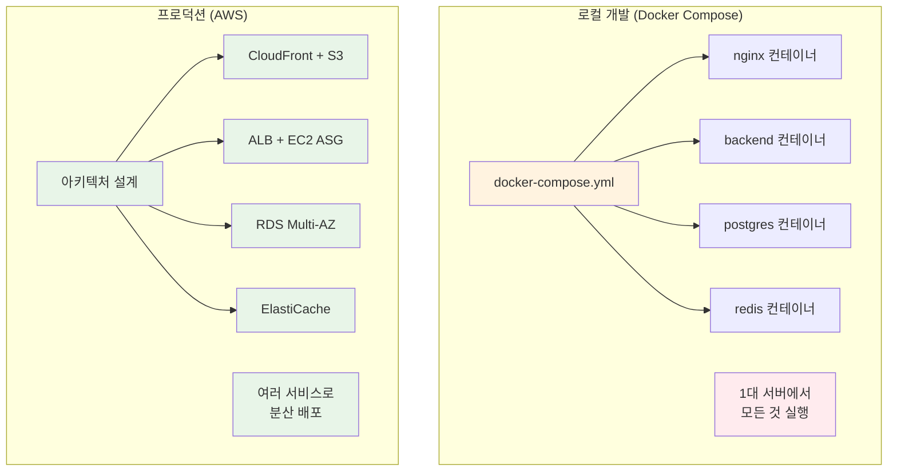
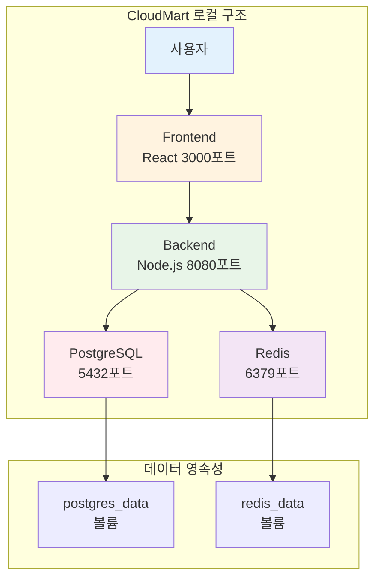
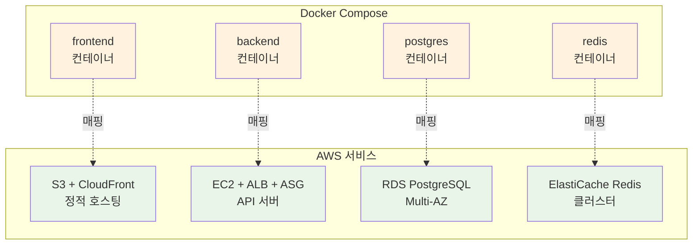
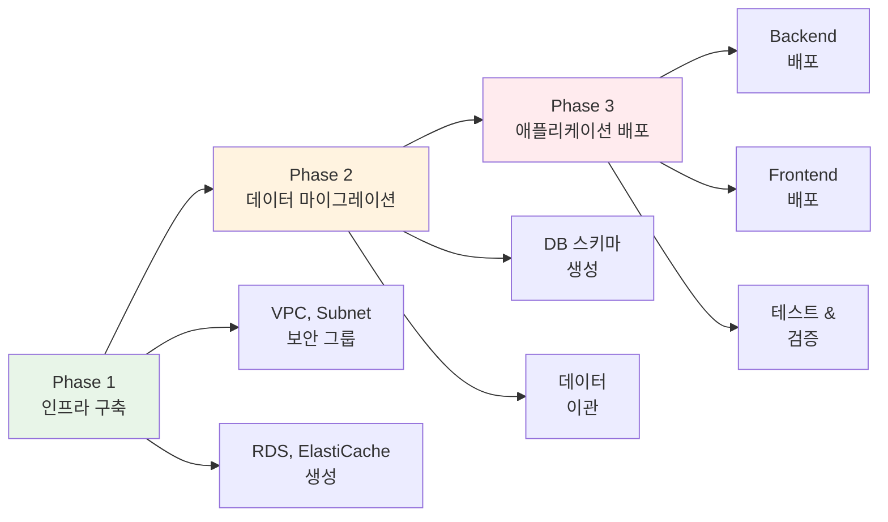

# Week 5 Day 5 Session 1: 배포 전략 수립 (09:00-09:50)

<div align="center">

**📋 마이그레이션 계획** • **🔄 서비스 매핑** • **💰 비용 추정** • **🎯 단계별 전략**

*Docker Compose에서 AWS로의 체계적 마이그레이션*

</div>

---

## 🕘 세션 정보
**시간**: 09:00-09:50 (50분)
**목표**: CloudMart 프로젝트의 AWS 마이그레이션 전략 수립
**방식**: 이론 설명 + 아키텍처 설계

## 🎯 세션 목표

### 📚 학습 목표
- **이해 목표**: Docker Compose와 AWS 서비스 간 매핑 관계 이해
- **적용 목표**: 단계별 마이그레이션 계획 수립 능력
- **협업 목표**: 팀과 함께 최적의 배포 전략 도출

### 🤔 왜 필요한가? (5분)

**현실 문제 상황**:
- 💼 **실무 시나리오**: "로컬에서 잘 돌아가는 앱을 실제 서비스로 배포하려면?"
- 🏠 **일상 비유**: 집에서 요리 연습 → 실제 식당 오픈 (주방 설비, 재료 공급, 손님 대응)
- ☁️ **AWS 아키텍처**: Docker Compose (1대 서버) → AWS (여러 서비스 조합)
- 📊 **시장 동향**: Airbnb, Uber 등 모든 스타트업이 거치는 과정

**Docker Compose vs AWS 비교**:


## 📖 핵심 개념 (35분)

### 🔍 개념 1: CloudMart 현재 아키텍처 분석 (12분)

> **정의**: Docker Compose 기반 CloudMart의 구성 요소와 의존성 파악

**CloudMart Docker Compose 구조**:
```yaml
# docker-compose.yml (Week 1-4에서 개발)
version: '3.8'
services:
  frontend:
    image: cloudmart-frontend:latest
    ports:
      - "3000:3000"
    depends_on:
      - backend
  
  backend:
    image: cloudmart-backend:latest
    ports:
      - "8080:8080"
    environment:
      DATABASE_URL: postgresql://postgres:5432/cloudmart
      REDIS_URL: redis://redis:6379
    depends_on:
      - postgres
      - redis
  
  postgres:
    image: postgres:15-alpine
    volumes:
      - postgres_data:/var/lib/postgresql/data
    environment:
      POSTGRES_DB: cloudmart
      POSTGRES_PASSWORD: password
  
  redis:
    image: redis:7-alpine
    volumes:
      - redis_data:/data

volumes:
  postgres_data:
  redis_data:
```

**구성 요소 분석**:


**핵심 요구사항 파악**:
- **Frontend**: 정적 파일 서빙 (HTML, CSS, JS)
- **Backend**: API 서버 (Node.js/Express)
- **Database**: 관계형 데이터베이스 (PostgreSQL)
- **Cache**: 세션 & 캐싱 (Redis)
- **Storage**: 데이터 영속성 (Volumes)

### 🔍 개념 2: AWS 서비스 매핑 전략 (12분)

> **정의**: Docker Compose 구성 요소를 AWS 서비스로 1:1 매핑

**서비스 매핑 테이블**:
| Docker Compose | AWS 서비스 | 이유 |
|----------------|------------|------|
| **frontend** | S3 + CloudFront | 정적 파일은 S3, CDN으로 전 세계 배포 |
| **backend** | EC2 + ALB + ASG | API 서버는 EC2, 로드밸런싱 + 자동 확장 |
| **postgres** | RDS PostgreSQL | 관리형 DB, 자동 백업, Multi-AZ |
| **redis** | ElastiCache Redis | 관리형 캐시, 고가용성 |
| **volumes** | EBS + S3 | 블록 스토리지 + 객체 스토리지 |
| **network** | VPC + Subnet | 네트워크 격리 및 보안 |

**상세 매핑 다이어그램**:


**매핑 시 고려사항**:
- **Frontend**: 빌드 후 정적 파일만 S3에 업로드
- **Backend**: Docker 이미지를 EC2에서 실행 또는 ECR 사용
- **Database**: 데이터 마이그레이션 계획 필요
- **Cache**: Redis 데이터는 휘발성이므로 마이그레이션 불필요

### 🔍 개념 3: 단계별 마이그레이션 계획 (11분)

> **정의**: 안전하고 체계적인 배포를 위한 단계별 전략

**3단계 마이그레이션 전략**:


**Phase 1: 인프라 구축 (20분)**
```yaml
Step 1: 네트워크 구성
  - VPC 생성 (10.0.0.0/16)
  - Public Subnet × 2 (AZ-A, AZ-B)
  - Private Subnet × 2 (AZ-A, AZ-B)
  - Internet Gateway, NAT Gateway

Step 2: 데이터베이스 구성
  - RDS PostgreSQL (db.t3.micro, Multi-AZ)
  - ElastiCache Redis (cache.t3.micro)
  - 보안 그룹 설정

Step 3: 컴퓨팅 리소스
  - ALB 생성
  - Launch Template 생성
  - Auto Scaling Group 설정
```

**Phase 2: 데이터 마이그레이션 (10분)**
```bash
# 1. 로컬 DB 덤프
docker exec cloudmart-postgres pg_dump -U postgres cloudmart > cloudmart.sql

# 2. AWS RDS로 복원
psql -h cloudmart-db.xxxxx.ap-northeast-2.rds.amazonaws.com \
     -U postgres -d cloudmart < cloudmart.sql

# 3. 데이터 검증
psql -h cloudmart-db.xxxxx.ap-northeast-2.rds.amazonaws.com \
     -U postgres -d cloudmart -c "SELECT COUNT(*) FROM products;"
```

**Phase 3: 애플리케이션 배포 (20분)**
```yaml
Step 1: Backend 배포
  - Docker 이미지 빌드
  - ECR에 푸시 (선택)
  - EC2 User Data로 배포
  - 환경 변수 설정 (RDS, Redis 엔드포인트)

Step 2: Frontend 배포
  - React 앱 빌드 (npm run build)
  - S3 버킷에 업로드
  - CloudFront 배포 생성

Step 3: 통합 테스트
  - Frontend → Backend API 호출 테스트
  - Backend → RDS 연결 테스트
  - Backend → Redis 연결 테스트
```

**비용 추정**:
```
인프라 구축 (1시간):
  - VPC, Subnet: $0 (무료)
  - NAT Gateway: $0.045
  - RDS (db.t3.micro): $0.017
  - ElastiCache: $0.017
  - ALB: $0.025
  - EC2 (t3.micro × 2): $0.020
  ---
  시간당 합계: $0.124
  
Lab 1 (50분): $0.10
Challenge (50분): $0.10
---
Day 5 총 비용: $0.20 (학생당)
```

## 💭 함께 생각해보기 (10분)

### 🤝 페어 토론 (5분)

**토론 주제**:
1. **마이그레이션 우선순위**: "Frontend와 Backend 중 어느 것을 먼저 배포해야 할까요?"
2. **데이터 안전성**: "데이터 마이그레이션 중 문제가 생기면 어떻게 대응할까요?"
3. **비용 최적화**: "같은 기능을 더 저렴하게 구현할 방법이 있을까요?"

**페어 활동 가이드**:
- 👥 **자유 페어링**: 프로젝트 경험이 비슷한 사람끼리
- 🔄 **역할 교대**: 3분씩 설명자/질문자 역할 바꾸기
- 📝 **핵심 정리**: 마이그레이션 체크리스트 작성

### 🎯 전체 공유 (5분)

**인사이트 공유**:
- 페어 토론에서 나온 마이그레이션 전략
- 예상하지 못했던 고려사항
- 실무에서 적용 가능한 팁

**💡 이해도 체크 질문**:
- ✅ "Docker Compose의 각 서비스가 AWS의 어떤 서비스로 매핑되나요?"
- ✅ "마이그레이션을 3단계로 나눈 이유는 무엇인가요?"
- ✅ "데이터 마이그레이션 시 가장 주의해야 할 점은 무엇인가요?"

## 🔑 핵심 키워드

### 🆕 새로운 용어
- **마이그레이션 (Migration)**: 기존 시스템을 새로운 환경으로 이전하는 과정
- **서비스 매핑 (Service Mapping)**: 로컬 구성 요소를 클라우드 서비스로 1:1 대응
- **단계별 배포 (Phased Deployment)**: 위험을 줄이기 위한 점진적 배포 전략

### 🔧 중요 개념
- **인프라 우선 (Infrastructure First)**: 애플리케이션 배포 전 인프라 구축
- **데이터 무결성 (Data Integrity)**: 마이그레이션 중 데이터 손실 방지
- **롤백 계획 (Rollback Plan)**: 문제 발생 시 이전 상태로 복구하는 방법

### 💼 실무 용어
- **Lift and Shift**: 최소한의 변경으로 클라우드로 이전
- **Re-architecting**: 클라우드 네이티브로 재설계
- **Hybrid Deployment**: 일부는 로컬, 일부는 클라우드

## 📝 세션 마무리

### ✅ 오늘 세션 성과
- **아키텍처 분석**: CloudMart Docker Compose 구조 완전 이해
- **서비스 매핑**: AWS 서비스로의 1:1 매핑 전략 수립
- **배포 계획**: 3단계 마이그레이션 로드맵 완성

### 🎯 다음 세션 준비
- **Session 2 주제**: 인프라 구성 (VPC, RDS, ElastiCache)
- **연결 내용**: 오늘 수립한 계획을 실제 AWS 인프라로 구현
- **사전 생각**: "Multi-AZ 구성이 왜 중요한가요?"

### 🔗 실습 연계
- **Lab 1**: 오늘 배운 마이그레이션 계획을 실제로 실행
- **Challenge**: 프로덕션급 완성도로 전체 시스템 배포

---

<div align="center">

**📋 마이그레이션 계획 완료** • **🔄 서비스 매핑 이해** • **🎯 배포 준비 완료**

*다음 세션에서는 실제 AWS 인프라를 구축해보겠습니다!*

</div>
