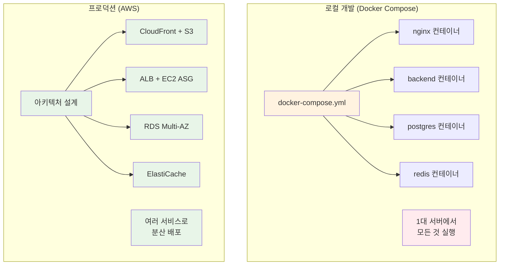
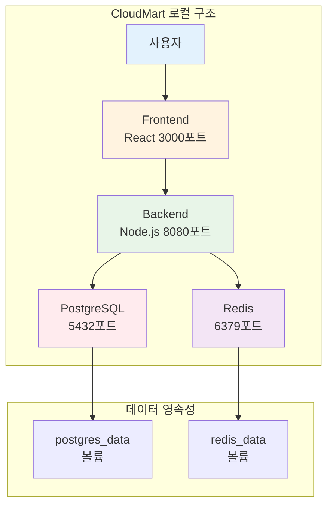
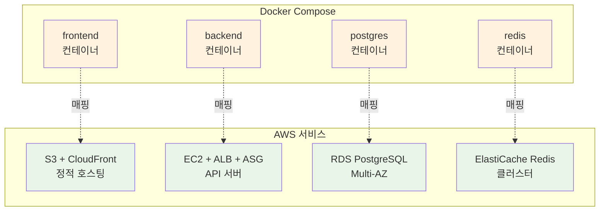
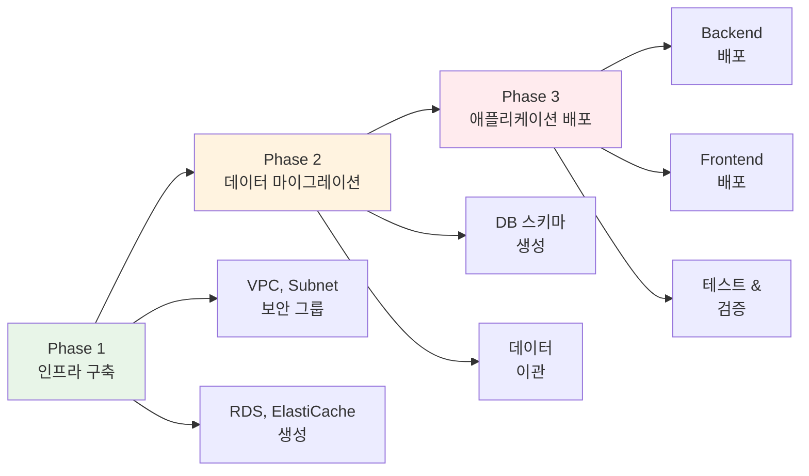

# Week 5 Day 5 Session 1: 배포 전략 수립 (09:00-09:50)

<div align="center">

**📋 마이그레이션 계획** • **🔄 서비스 매핑** • **💰 비용 추정** • **🎯 단계별 전략**

*Docker Compose에서 AWS로의 체계적 마이그레이션*

</div>

---

## 🕘 세션 정보
**시간**: 09:00-09:50 (50분)
**목표**: CloudMart 프로젝트의 AWS 마이그레이션 전략 수립
**방식**: 이론 설명 + 아키텍처 설계

## 🎯 세션 목표

### 📚 학습 목표
- **이해 목표**: Docker Compose와 AWS 서비스 간 매핑 관계 이해
- **적용 목표**: 단계별 마이그레이션 계획 수립 능력
- **협업 목표**: 팀과 함께 최적의 배포 전략 도출

### 🤔 왜 필요한가? (5분)

**현실 문제 상황**:
- 💼 **실무 시나리오**: "로컬에서 잘 돌아가는 앱을 실제 서비스로 배포하려면?"
- 🏠 **일상 비유**: 집에서 요리 연습 → 실제 식당 오픈 (주방 설비, 재료 공급, 손님 대응)
- ☁️ **AWS 아키텍처**: Docker Compose (1대 서버) → AWS (여러 서비스 조합)
- 📊 **시장 동향**: Airbnb, Uber 등 모든 스타트업이 거치는 과정

**Docker Compose vs AWS 비교**:


## 📖 핵심 개념 (35분)

### 🔍 개념 1: CloudMart 현재 아키텍처 분석 (12분)

> **정의**: Docker Compose 기반 CloudMart의 구성 요소와 의존성 파악

**CloudMart Docker Compose 구조**:
```yaml
# docker-compose.yml (Week 1-4에서 개발)
version: '3.8'
services:
  frontend:
    image: cloudmart-frontend:latest
    ports:
      - "3000:3000"
    depends_on:
      - backend
  
  backend:
    image: cloudmart-backend:latest
    ports:
      - "8080:8080"
    environment:
      DATABASE_URL: postgresql://postgres:5432/cloudmart
      REDIS_URL: redis://redis:6379
    depends_on:
      - postgres
      - redis
  
  postgres:
    image: postgres:15-alpine
    volumes:
      - postgres_data:/var/lib/postgresql/data
    environment:
      POSTGRES_DB: cloudmart
      POSTGRES_PASSWORD: password
  
  redis:
    image: redis:7-alpine
    volumes:
      - redis_data:/data

volumes:
  postgres_data:
  redis_data:
```

**구성 요소 분석**:


**핵심 요구사항 파악**:
- **Frontend**: 정적 파일 서빙 (HTML, CSS, JS)
- **Backend**: API 서버 (Node.js/Express)
- **Database**: 관계형 데이터베이스 (PostgreSQL)
- **Cache**: 세션 & 캐싱 (Redis)
- **Storage**: 데이터 영속성 (Volumes)

---

### 🚨 Docker Compose → AWS 마이그레이션 Pain Points

> **💡 기본 프로젝트의 핵심**: 이 Pain Points를 완벽하게 이해하고 극복하는 것이 목표입니다!

**Pain Point 1: 네트워크 설정의 복잡도 증가**

```yaml
# ✅ Docker Compose (간단 - 자동 서비스 디스커버리)
services:
  backend:
    depends_on:
      - postgres
    environment:
      DATABASE_URL: postgresql://postgres:5432/cloudmart  # 서비스명으로 자동 연결
```

```bash
# ❌ AWS (복잡 - 수동 엔드포인트 관리)
# RDS 엔드포인트: cloudmart-db.c9akciq32.ap-northeast-2.rds.amazonaws.com
# 보안 그룹 설정 필요 (Inbound/Outbound 규칙)
# VPC 내부 통신 설정 필요 (Private Subnet)
DATABASE_URL=postgresql://cloudmart-db.c9akciq32.ap-northeast-2.rds.amazonaws.com:5432/cloudmart
```

**극복 방법**:
- ✅ **Parameter Store 활용**: 엔드포인트를 중앙 관리
- ✅ **Service Discovery**: AWS Cloud Map 또는 Route 53 Private Hosted Zone
- ✅ **환경별 설정 분리**: dev/staging/prod 환경 구분

**기본 프로젝트 적용**:
- 팀 프로젝트에서 환경 변수 관리 전략 수립
- 개발/스테이징/프로덕션 환경 분리 경험

---

**Pain Point 2: 데이터 영속성 전략의 다양화**

```yaml
# ✅ Docker Compose (단순 - 로컬 볼륨)
volumes:
  postgres_data:  # 로컬 디스크에 자동 생성
  redis_data:     # 재시작 시 데이터 유지
```

```bash
# ❌ AWS (복잡 - 여러 스토리지 옵션)
# RDS: 자동 백업 (7-35일), 스냅샷, Multi-AZ 복제
# EBS: 볼륨 타입 선택 (gp3, io2, st1, sc1)
# S3: 정적 파일, 백업, 로그 저장
# 각각 다른 비용 구조와 성능 특성
```

**극복 방법**:
- ✅ **백업 전략 수립**: 자동 백업 + 수동 스냅샷
- ✅ **스토리지 계층화**: Hot(EBS) / Warm(S3) / Cold(Glacier)
- ✅ **재해 복구 계획**: RTO/RPO 목표 설정

**기본 프로젝트 적용**:
- 데이터 백업 및 복구 시나리오 실습
- 비용 효율적인 스토리지 전략 수립

---

**Pain Point 3: 시크릿 관리의 보안 강화**

```yaml
# ✅ Docker Compose (간단 - 평문 저장)
environment:
  POSTGRES_PASSWORD: password  # .env 파일에 평문
  REDIS_PASSWORD: redis123
  API_KEY: abc123
```

```bash
# ❌ AWS (복잡 - 암호화 및 접근 제어)
# Systems Manager Parameter Store (무료, 기본 암호화)
aws ssm put-parameter \
  --name /cloudmart/db/password \
  --value "xxx" \
  --type SecureString

# Secrets Manager (유료, 자동 로테이션)
aws secretsmanager create-secret \
  --name cloudmart/db \
  --secret-string '{"password":"xxx"}'
```

**극복 방법**:
- ✅ **시크릿 계층화**: 민감도에 따라 Parameter Store vs Secrets Manager
- ✅ **IAM 역할 기반 접근**: EC2 인스턴스 프로파일 활용
- ✅ **자동 로테이션**: 정기적인 비밀번호 변경

**기본 프로젝트 적용**:
- 팀 프로젝트에서 시크릿 관리 Best Practice 적용
- 보안 감사 및 컴플라이언스 체크

---

**Pain Point 4: 로그 및 모니터링의 분산화**

```bash
# ✅ Docker Compose (간단 - 단일 서버)
docker-compose logs -f backend  # 실시간 로그 확인
docker stats                    # 리소스 사용량 확인
```

```bash
# ❌ AWS (복잡 - 분산 환경)
# CloudWatch Logs: 여러 EC2 인스턴스의 로그 통합
# CloudWatch Metrics: CPU, 메모리, 네트워크 모니터링
# X-Ray: 분산 추적 (마이크로서비스 간 호출 추적)
# CloudWatch Alarms: 임계값 초과 시 알림
```

**극복 방법**:
- ✅ **중앙 집중식 로깅**: CloudWatch Logs Insights 쿼리
- ✅ **대시보드 구축**: CloudWatch Dashboard로 시각화
- ✅ **알림 자동화**: SNS + Lambda로 Slack/Email 알림

**기본 프로젝트 적용**:
- 팀 프로젝트 모니터링 대시보드 구축
- 장애 알림 시스템 구현

---

**Pain Point 5: 배포 프로세스의 복잡도 증가**

```bash
# ✅ Docker Compose (즉시 반영 - 1분)
docker-compose down
docker-compose up -d --build  # 빌드 + 배포 완료
```

```bash
# ❌ AWS (단계적 프로세스 - 5-10분)
# 1. 이미지 빌드 및 ECR 푸시 (2분)
docker build -t cloudmart-backend .
docker push xxx.dkr.ecr.ap-northeast-2.amazonaws.com/cloudmart-backend

# 2. Launch Template 업데이트 (1분)
aws ec2 create-launch-template-version --launch-template-id lt-xxx

# 3. Auto Scaling Group 인스턴스 교체 (3-5분)
aws autoscaling start-instance-refresh --auto-scaling-group-name cloudmart-asg

# 4. ALB Health Check 통과 대기 (2분)
# 5. 이전 인스턴스 종료 (1분)
```

**극복 방법**:
- ✅ **Blue-Green 배포**: 무중단 배포 전략
- ✅ **Canary 배포**: 점진적 트래픽 전환
- ✅ **CI/CD 파이프라인**: GitHub Actions + CodeDeploy 자동화

**기본 프로젝트 적용**:
- 팀 프로젝트에서 무중단 배포 전략 구현
- CI/CD 파이프라인 구축 경험

---

**Pain Point 6: 비용 관리의 필요성**

```bash
# ✅ Docker Compose (무료 - 로컬 개발)
# 비용: $0 (전기세만 발생)
# 리소스: 개발자 PC 사양에 의존
```

```bash
# ❌ AWS (시간당 과금 - 프로덕션)
# RDS (db.t3.micro): $0.017/hour
# ElastiCache (cache.t3.micro): $0.017/hour
# ALB: $0.025/hour
# EC2 (t3.micro × 2): $0.010/hour × 2
# NAT Gateway: $0.045/hour
# 데이터 전송: $0.09/GB
# ---
# 합계: $0.124/hour = $89.28/month
```

**극복 방법**:
- ✅ **비용 최적화**: Reserved Instances, Savings Plans
- ✅ **리소스 스케줄링**: 개발 환경 야간/주말 자동 종료
- ✅ **비용 알림**: AWS Budgets로 예산 초과 알림

**기본 프로젝트 적용**:
- 팀 프로젝트 예산 관리 및 비용 최적화
- FinOps 원칙 적용 경험

---

**Pain Point 7: 고가용성 및 확장성 설계**

```yaml
# ✅ Docker Compose (단일 서버 - 단순)
services:
  backend:
    # 1개 컨테이너만 실행
    # 서버 다운 시 전체 서비스 중단
    # 트래픽 증가 시 수동 스케일링
```

```bash
# ❌ AWS (Multi-AZ 분산 - 복잡)
# ALB: 여러 AZ에 트래픽 자동 분산
# ASG: 최소 2개, 최대 10개 인스턴스 자동 확장
# RDS: Multi-AZ 자동 장애 조치 (1-2분)
# ElastiCache: 클러스터 모드로 샤딩
# 복잡도 증가, 하지만 99.99% 가용성 달성
```

**극복 방법**:
- ✅ **Multi-AZ 배포**: 단일 장애점 제거
- ✅ **Auto Scaling 정책**: CPU/메모리 기반 자동 확장
- ✅ **Health Check 최적화**: 빠른 장애 감지 및 복구

**기본 프로젝트 적용**:
- 팀 프로젝트에서 고가용성 아키텍처 설계
- 장애 시나리오 테스트 및 복구 경험

---

### 📊 Pain Points 종합 비교표

| 항목 | Docker Compose | AWS | 난이도 | 기본 프로젝트 학습 목표 |
|------|----------------|-----|--------|------------------------|
| **네트워크** | 서비스명 자동 연결 | 엔드포인트 수동 설정 | ⭐⭐⭐ | 환경 변수 관리 전략 수립 |
| **스토리지** | 로컬 볼륨 자동 생성 | EBS/S3 선택 및 설정 | ⭐⭐⭐⭐ | 백업 및 복구 전략 구현 |
| **시크릿** | .env 평문 저장 | Parameter Store/Secrets Manager | ⭐⭐⭐⭐⭐ | 보안 Best Practice 적용 |
| **로그** | docker logs 명령어 | CloudWatch 통합 설정 | ⭐⭐⭐⭐ | 모니터링 대시보드 구축 |
| **배포** | 즉시 반영 (1분) | 단계적 롤링 (5-10분) | ⭐⭐⭐ | CI/CD 파이프라인 구축 |
| **비용** | 무료 (로컬) | 시간당 과금 ($0.124/h) | ⭐⭐⭐⭐⭐ | FinOps 원칙 적용 |
| **고가용성** | 단일 서버 | Multi-AZ 분산 | ⭐⭐⭐⭐⭐ | 고가용성 아키텍처 설계 |

---

### 🎯 기본 프로젝트에서의 학습 목표

**Week 5 (이론 + 실습)**:
- ✅ Pain Points 이해 및 기본 극복 방법 학습
- ✅ CloudMart 프로젝트 AWS 배포 경험

**기본 프로젝트 (4주)**:
- 🎯 **1주차**: Pain Points 1-3 극복 (네트워크, 스토리지, 시크릿)
- 🎯 **2주차**: Pain Points 4-5 극복 (로그, 배포)
- 🎯 **3주차**: Pain Points 6-7 극복 (비용, 고가용성)
- 🎯 **4주차**: 팀 프로젝트 완성 및 더 나은 방법 탐구

**💡 핵심 인사이트**:
> "이 Pain Points를 극복하는 과정에서 더 나은 방법을 찾아내는 것이 진짜 목표입니다!"

**예시 - 더 나은 방법 탐구**:
- 💡 "Parameter Store 대신 Secrets Manager를 사용하면 자동 로테이션이 가능하다"
- 💡 "NAT Gateway 비용이 비싸다면 VPC Endpoint를 사용하면 무료다"
- 💡 "ALB 대신 CloudFront를 사용하면 글로벌 배포가 가능하다"
- 💡 "EC2 대신 Fargate를 사용하면 서버 관리가 필요 없다"

**심화 프로젝트 (5주)**:
- 🚀 더 나은 방법을 실제로 적용하여 프로젝트 고도화
- 🚀 Kubernetes, Terraform, GitOps 등 고급 기술 적용
- 🚀 실무 수준의 프로덕션 환경 구축

---

**💪 이제 이 Pain Points를 하나씩 극복해나가며 실력을 쌓아갑시다!**

### 🔍 개념 2: AWS 서비스 매핑 전략 (12분)

> **정의**: Docker Compose 구성 요소를 AWS 서비스로 1:1 매핑

**서비스 매핑 테이블**:
| Docker Compose | AWS 서비스 | 이유 |
|----------------|------------|------|
| **frontend** | S3 + CloudFront | 정적 파일은 S3, CDN으로 전 세계 배포 |
| **backend** | EC2 + ALB + ASG | API 서버는 EC2, 로드밸런싱 + 자동 확장 |
| **postgres** | RDS PostgreSQL | 관리형 DB, 자동 백업, Multi-AZ |
| **redis** | ElastiCache Redis | 관리형 캐시, 고가용성 |
| **volumes** | EBS + S3 | 블록 스토리지 + 객체 스토리지 |
| **network** | VPC + Subnet | 네트워크 격리 및 보안 |

**상세 매핑 다이어그램**:


**매핑 시 고려사항**:
- **Frontend**: 빌드 후 정적 파일만 S3에 업로드
- **Backend**: Docker 이미지를 EC2에서 실행 또는 ECR 사용
- **Database**: 데이터 마이그레이션 계획 필요
- **Cache**: Redis 데이터는 휘발성이므로 마이그레이션 불필요

### 🔍 개념 3: 단계별 마이그레이션 계획 (11분)

> **정의**: 안전하고 체계적인 배포를 위한 단계별 전략

**3단계 마이그레이션 전략**:


**Phase 1: 인프라 구축 (20분)**
```yaml
Step 1: 네트워크 구성
  - VPC 생성 (10.0.0.0/16)
  - Public Subnet × 2 (AZ-A, AZ-B)
  - Private Subnet × 2 (AZ-A, AZ-B)
  - Internet Gateway, NAT Gateway

Step 2: 데이터베이스 구성
  - RDS PostgreSQL (db.t3.micro, Multi-AZ)
  - ElastiCache Redis (cache.t3.micro)
  - 보안 그룹 설정

Step 3: 컴퓨팅 리소스
  - ALB 생성
  - Launch Template 생성
  - Auto Scaling Group 설정
```

**Phase 2: 데이터 마이그레이션 (10분)**
```bash
# 1. 로컬 DB 덤프
docker exec cloudmart-postgres pg_dump -U postgres cloudmart > cloudmart.sql

# 2. AWS RDS로 복원
psql -h cloudmart-db.xxxxx.ap-northeast-2.rds.amazonaws.com \
     -U postgres -d cloudmart < cloudmart.sql

# 3. 데이터 검증
psql -h cloudmart-db.xxxxx.ap-northeast-2.rds.amazonaws.com \
     -U postgres -d cloudmart -c "SELECT COUNT(*) FROM products;"
```

**Phase 3: 애플리케이션 배포 (20분)**
```yaml
Step 1: Backend 배포
  - Docker 이미지 빌드
  - ECR에 푸시 (선택)
  - EC2 User Data로 배포
  - 환경 변수 설정 (RDS, Redis 엔드포인트)

Step 2: Frontend 배포
  - React 앱 빌드 (npm run build)
  - S3 버킷에 업로드
  - CloudFront 배포 생성

Step 3: 통합 테스트
  - Frontend → Backend API 호출 테스트
  - Backend → RDS 연결 테스트
  - Backend → Redis 연결 테스트
```

**비용 추정**:
```
인프라 구축 (1시간):
  - VPC, Subnet: $0 (무료)
  - NAT Gateway: $0.045
  - RDS (db.t3.micro): $0.017
  - ElastiCache: $0.017
  - ALB: $0.025
  - EC2 (t3.micro × 2): $0.020
  ---
  시간당 합계: $0.124
  
Lab 1 (50분): $0.10
Challenge (50분): $0.10
---
Day 5 총 비용: $0.20 (학생당)
```

## 💭 함께 생각해보기 (10분)

### 🤝 페어 토론 (5분)

**토론 주제**:
1. **마이그레이션 우선순위**: "Frontend와 Backend 중 어느 것을 먼저 배포해야 할까요?"
2. **데이터 안전성**: "데이터 마이그레이션 중 문제가 생기면 어떻게 대응할까요?"
3. **비용 최적화**: "같은 기능을 더 저렴하게 구현할 방법이 있을까요?"

**페어 활동 가이드**:
- 👥 **자유 페어링**: 프로젝트 경험이 비슷한 사람끼리
- 🔄 **역할 교대**: 3분씩 설명자/질문자 역할 바꾸기
- 📝 **핵심 정리**: 마이그레이션 체크리스트 작성

### 🎯 전체 공유 (5분)

**인사이트 공유**:
- 페어 토론에서 나온 마이그레이션 전략
- 예상하지 못했던 고려사항
- 실무에서 적용 가능한 팁

**💡 이해도 체크 질문**:
- ✅ "Docker Compose의 각 서비스가 AWS의 어떤 서비스로 매핑되나요?"
- ✅ "마이그레이션을 3단계로 나눈 이유는 무엇인가요?"
- ✅ "데이터 마이그레이션 시 가장 주의해야 할 점은 무엇인가요?"

## 🔑 핵심 키워드

### 🆕 새로운 용어
- **마이그레이션 (Migration)**: 기존 시스템을 새로운 환경으로 이전하는 과정
- **서비스 매핑 (Service Mapping)**: 로컬 구성 요소를 클라우드 서비스로 1:1 대응
- **단계별 배포 (Phased Deployment)**: 위험을 줄이기 위한 점진적 배포 전략

### 🔧 중요 개념
- **인프라 우선 (Infrastructure First)**: 애플리케이션 배포 전 인프라 구축
- **데이터 무결성 (Data Integrity)**: 마이그레이션 중 데이터 손실 방지
- **롤백 계획 (Rollback Plan)**: 문제 발생 시 이전 상태로 복구하는 방법

### 💼 실무 용어
- **Lift and Shift**: 최소한의 변경으로 클라우드로 이전
- **Re-architecting**: 클라우드 네이티브로 재설계
- **Hybrid Deployment**: 일부는 로컬, 일부는 클라우드

## 📝 세션 마무리

### ✅ 오늘 세션 성과
- **아키텍처 분석**: CloudMart Docker Compose 구조 완전 이해
- **서비스 매핑**: AWS 서비스로의 1:1 매핑 전략 수립
- **배포 계획**: 3단계 마이그레이션 로드맵 완성

### 🎯 다음 세션 준비
- **Session 2 주제**: 인프라 구성 (VPC, RDS, ElastiCache)
- **연결 내용**: 오늘 수립한 계획을 실제 AWS 인프라로 구현
- **사전 생각**: "Multi-AZ 구성이 왜 중요한가요?"

### 🔗 실습 연계
- **Lab 1**: 오늘 배운 마이그레이션 계획을 실제로 실행
- **Challenge**: 프로덕션급 완성도로 전체 시스템 배포

---

<div align="center">

**📋 마이그레이션 계획 완료** • **🔄 서비스 매핑 이해** • **🎯 배포 준비 완료**

*다음 세션에서는 실제 AWS 인프라를 구축해보겠습니다!*

</div>
