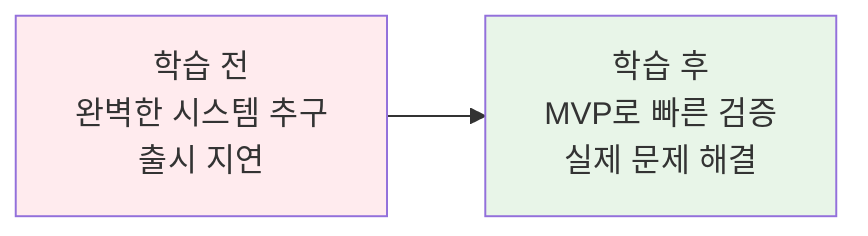
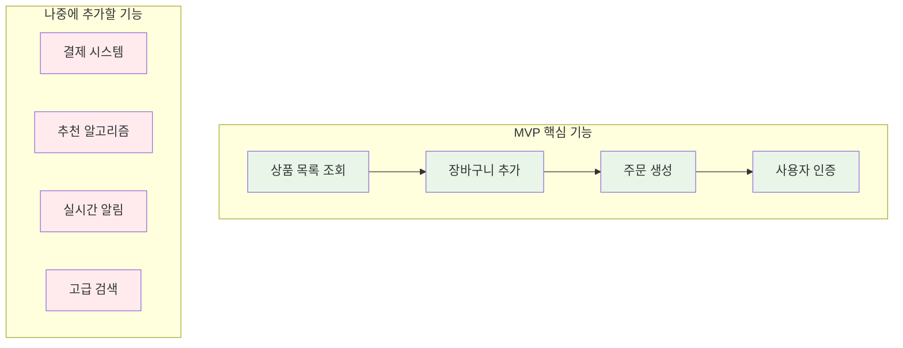
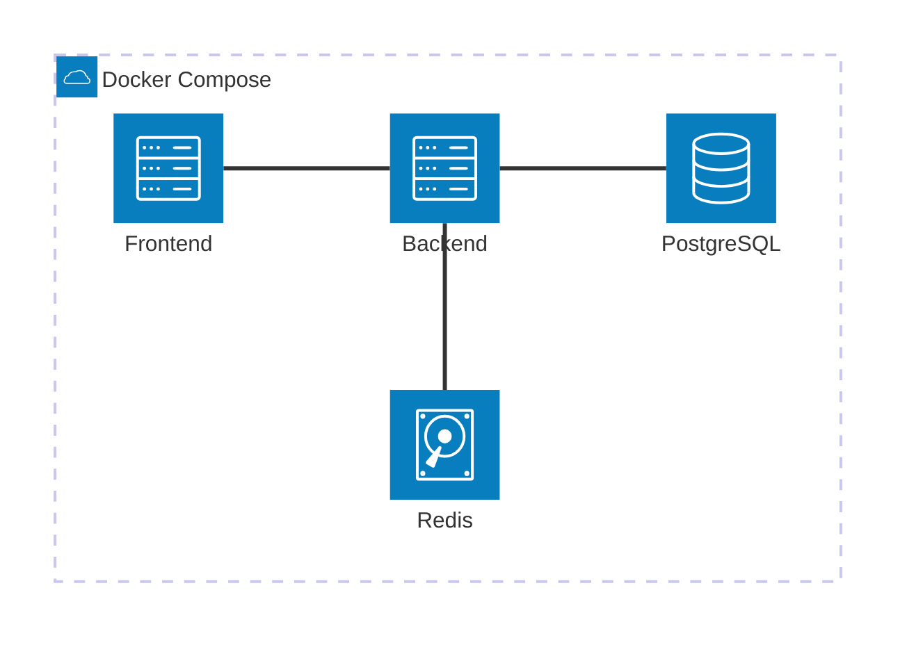
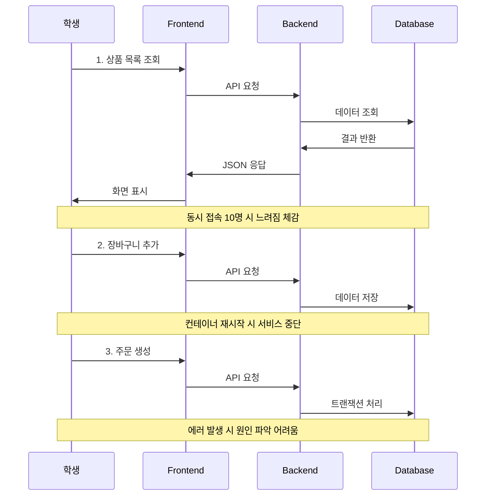
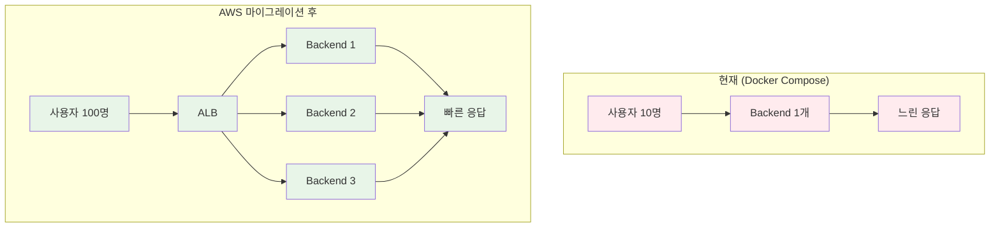
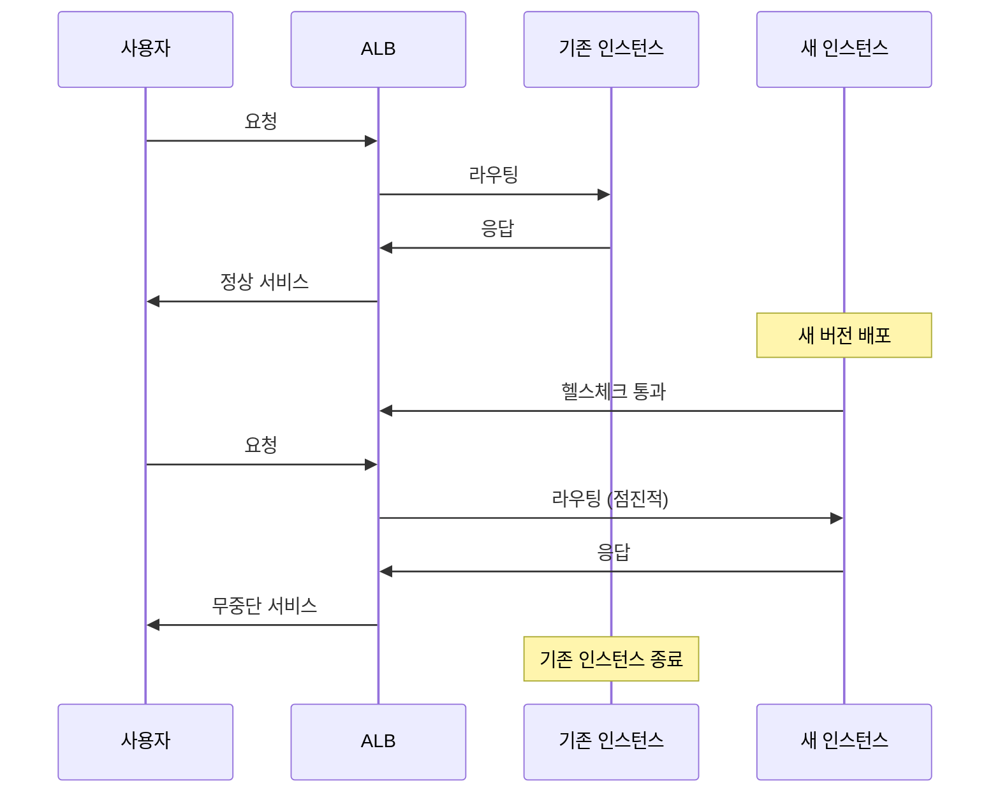
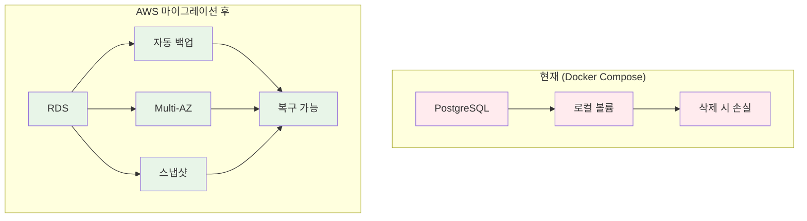
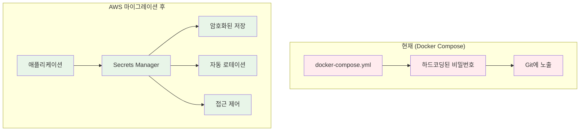
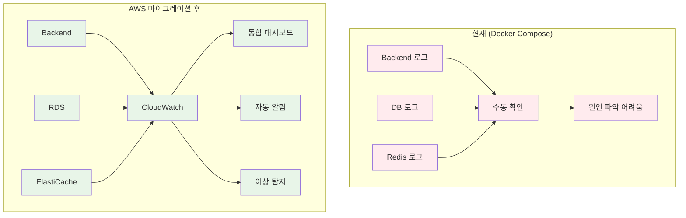

# Week 5 Day 5 Session 1: MVP 구현과 Pain Point 발견

<div align="center">

**🎯 최소 MVP 구현** • **🔍 실제 문제 경험** • **💡 AWS 필요성 체감**

*Docker Compose로 최소 기능을 구현하고, 실제 사용하며 한계를 경험합니다*

</div>

---

## 🕘 Session 정보
**시간**: 09:00-09:50 (50분)
**목표**: 최소 MVP 구현 및 실제 Pain Point 발견
**방식**: 실습 중심 + 문제 경험 + 토론

## 🎯 Session 목표

### 📚 학습 목표
- **이해 목표**: 최소 기능 제품(MVP)의 개념과 중요성
- **적용 목표**: Docker Compose로 CloudMart MVP 구현
- **경험 목표**: 실제 사용하며 로컬 환경의 한계 체감

### 🤔 왜 필요한가? (5분)

**현실 문제 상황**:
- 💼 **실무 시나리오**: "완벽한 시스템을 만들려다 출시가 늦어지고, 정작 사용자가 원하는 기능은 놓쳤다"
- 🏠 **일상 비유**: 집을 지을 때 기초부터 완벽하게 하려다 1년이 걸리는 것보다, 임시 거처를 만들어 살면서 필요한 것을 파악하는 것이 현명
- 🎯 **MVP 철학**: "빠르게 만들고, 실제로 사용하고, 문제를 발견하고, 개선한다"

**학습 전후 비교**:


---

## 📖 핵심 개념 (35분)

### 🔍 개념 1: MVP (Minimum Viable Product) (10분)

> **정의**: 최소한의 기능만으로 사용자에게 가치를 제공할 수 있는 제품

**CloudMart MVP의 핵심 기능**:


**MVP 선정 기준**:
- ✅ **필수 기능**: 이것 없이는 서비스가 불가능
- ✅ **사용자 가치**: 사용자가 실제로 사용할 기능
- ✅ **빠른 구현**: 1-2일 내 구현 가능
- ❌ **Nice to Have**: 있으면 좋지만 없어도 되는 기능

### 🔍 개념 2: Docker Compose MVP 구현 (15분)

**최소 아키텍처**:


**docker-compose.yml**:
```yaml
version: '3.8'

services:
  # 프론트엔드 - 정적 파일 서빙
  frontend:
    image: nginx:alpine
    ports:
      - "80:80"
    volumes:
      - ./frontend:/usr/share/nginx/html
    depends_on:
      - backend

  # 백엔드 API
  backend:
    image: node:18-alpine
    ports:
      - "3000:3000"
    environment:
      - NODE_ENV=production
      - DB_HOST=postgres
      - DB_PORT=5432
      - DB_NAME=cloudmart
      - DB_USER=user
      - DB_PASSWORD=password
      - REDIS_HOST=redis
      - REDIS_PORT=6379
    volumes:
      - ./backend:/app
    working_dir: /app
    command: npm start
    depends_on:
      - postgres
      - redis

  # 데이터베이스
  postgres:
    image: postgres:15-alpine
    environment:
      - POSTGRES_DB=cloudmart
      - POSTGRES_USER=user
      - POSTGRES_PASSWORD=password
    volumes:
      - postgres_data:/var/lib/postgresql/data
    ports:
      - "5432:5432"

  # 캐시 및 세션 스토어
  redis:
    image: redis:7-alpine
    volumes:
      - redis_data:/data
    ports:
      - "6379:6379"

volumes:
  postgres_data:
  redis_data:
```

**핵심 포인트**:
- **단순함**: 각 서비스 1개씩만
- **로컬 개발**: 모든 포트 노출
- **빠른 시작**: 복잡한 설정 없음
- **데이터 영속성**: 볼륨으로 데이터 보존

### 🔍 개념 3: Pain Point 발견 프로세스 (10분)

**실제 사용 시나리오**:


**Pain Point 발견 체크리스트**:
- [ ] **성능**: 동시 접속 시 응답 속도 저하
- [ ] **가용성**: 배포 시 서비스 중단
- [ ] **확장성**: 트래픽 증가 시 대응 불가
- [ ] **안정성**: 데이터 손실 위험
- [ ] **보안**: 비밀번호 하드코딩
- [ ] **모니터링**: 문제 원인 파악 어려움

---

## 💭 함께 생각해보기 (10분)

### 🤝 페어 실습 (5분)

**실습 주제**: "MVP 실행 및 문제 경험"

**페어 활동 가이드**:
1. **MVP 실행** (2분):
   ```bash
   # CloudMart MVP 실행
   cd cloudmart-mvp
   docker-compose up -d
   
   # 상태 확인
   docker-compose ps
   curl http://localhost
   ```

2. **동시 접속 테스트** (2분):
   ```bash
   # 10명 동시 접속 시뮬레이션
   for i in {1..10}; do
     curl http://localhost/api/products &
   done
   wait
   
   # 응답 시간 측정
   time curl http://localhost/api/products
   ```

3. **문제 경험** (1분):
   ```bash
   # 컨테이너 재시작
   docker-compose restart backend
   
   # 이 순간 서비스 접근 시도
   curl http://localhost/api/products
   # 에러 발생 확인
   ```

### 🎯 전체 공유 (5분)

**공유 질문**:
1. **성능**: "동시 접속 시 얼마나 느려졌나요?"
2. **가용성**: "재시작 시 서비스가 얼마나 중단되었나요?"
3. **모니터링**: "에러 발생 시 원인을 어떻게 찾았나요?"

**예상 답변**:
- "10명만 접속해도 응답이 2-3초 걸렸어요"
- "재시작하는 동안 서비스가 완전히 멈췄어요"
- "로그를 일일이 확인해야 해서 시간이 오래 걸렸어요"

### 💡 이해도 체크 질문

- ✅ "MVP의 핵심 기능 3가지를 말할 수 있나요?"
- ✅ "Docker Compose의 한계를 3가지 이상 경험했나요?"
- ✅ "왜 AWS가 필요한지 자신의 경험으로 설명할 수 있나요?"

---

## 🚨 실제 Pain Point 사례

### Pain Point 1: 확장성 문제

**상황**:
```
시간: 오후 2시 (점심시간 직후)
동시 접속자: 10명
증상: 응답 시간 200ms → 3000ms
```

**원인**:
- 단일 백엔드 컨테이너
- CPU/메모리 제한 없음 (호스트 리소스 공유)
- 로드 밸런싱 없음

**AWS 해결 방안**:


**측정 가능한 지표**:
- **현재**: 동시 접속 10명, 응답 시간 3초
- **목표**: 동시 접속 100명, 응답 시간 200ms

### Pain Point 2: 가용성 문제

**상황**:
```
작업: 새 버전 배포
방법: docker-compose restart
다운타임: 30초
영향: 모든 사용자 서비스 중단
```

**원인**:
- 단일 인스턴스
- 무중단 배포 불가
- 헬스체크 없음

**AWS 해결 방안**:


**측정 가능한 지표**:
- **현재**: 배포 시 30초 다운타임
- **목표**: 배포 시 0초 다운타임 (무중단)

### Pain Point 3: 데이터 안정성

**상황**:
```
작업: docker-compose down
결과: 볼륨 삭제 시 데이터 손실
백업: 없음
복구: 불가능
```

**원인**:
- 로컬 볼륨만 사용
- 자동 백업 없음
- 재해 복구 계획 없음

**AWS 해결 방안**:


**측정 가능한 지표**:
- **현재**: 백업 없음, 복구 불가
- **목표**: 자동 백업, 35일 보관, 5분 내 복구

### Pain Point 4: 보안 문제

**상황**:
```yaml
# docker-compose.yml에 하드코딩
environment:
  - DB_PASSWORD=password  # 🚨 보안 위험
  - API_KEY=secret123     # 🚨 코드 저장소에 노출
```

**원인**:
- 환경변수 하드코딩
- 시크릿 관리 시스템 없음
- 코드 저장소에 비밀번호 노출

**AWS 해결 방안**:


**측정 가능한 지표**:
- **현재**: 비밀번호 코드에 노출
- **목표**: 암호화 저장, 자동 로테이션, 감사 로그

### Pain Point 5: 모니터링 부재

**상황**:
```bash
# 에러 발생 시 로그 확인
docker-compose logs backend | grep ERROR
docker-compose logs postgres | grep ERROR
docker-compose logs redis | grep ERROR

# 각 컨테이너마다 일일이 확인 필요
# 전체 시스템 상태 파악 어려움
```

**원인**:
- 로그 분산 (각 컨테이너)
- 메트릭 수집 없음
- 알림 시스템 없음
- 대시보드 없음

**AWS 해결 방안**:


**측정 가능한 지표**:
- **현재**: 문제 발견 시간 30분+
- **목표**: 문제 발견 시간 1분 이내, 자동 알림

---

## 📝 Pain Point 문서화 템플릿

### 🚨 Pain Point 기록 양식

```markdown
## 🚨 Pain Point N: [문제 제목]

### 📝 상황
- **언제**: [구체적인 시간과 상황]
- **무엇**: [발생한 문제]
- **영향**: [서비스에 미친 영향]

### 🔍 원인 분석
- **기술적 원인**: [Docker Compose의 한계]
- **아키텍처 원인**: [단일 서버 구조의 문제]

### 💡 AWS 해결 방안
- **AWS 서비스**: [필요한 AWS 서비스]
- **해결 방법**: [구체적인 해결 방법]
- **기대 효과**: [개선 효과]

### 📊 측정 가능한 지표
- **현재**: [현재 상태의 수치]
- **목표**: [AWS 마이그레이션 후 목표]
```

---

## 🔑 핵심 키워드

### 새로운 용어
- **MVP (Minimum Viable Product)**: 최소 기능 제품 - 핵심 기능만으로 사용자에게 가치를 제공
- **Pain Point**: 고통점 - 실제 사용 중 겪는 문제점
- **Downtime**: 다운타임 - 서비스 중단 시간

### 중요 개념
- **빠른 검증**: 완벽함보다 빠른 출시와 피드백
- **실제 경험**: 이론이 아닌 직접 겪은 문제
- **측정 가능**: 개선 효과를 수치로 확인

---

## 📝 Session 마무리

### ✅ 오늘 Session 성과

**학습 성과**:
- [ ] MVP 개념 이해 및 CloudMart MVP 정의
- [ ] Docker Compose로 MVP 구현 및 실행
- [ ] 최소 5가지 Pain Point 실제 경험
- [ ] 각 Pain Point별 AWS 해결 방안 이해

**경험 성과**:
- [ ] 동시 접속 시 성능 저하 체감
- [ ] 배포 시 서비스 중단 경험
- [ ] 데이터 손실 위험 인식
- [ ] 모니터링 부재로 인한 답답함
- [ ] AWS 필요성 자연스럽게 체감

### 🎯 다음 Session 준비

**Session 2 예고**: "AWS 마이그레이션 전략 수립"
- Pain Point별 AWS 서비스 매핑
- 단계적 마이그레이션 계획
- 비용 효율적 아키텍처 설계

**준비사항**:
- 오늘 발견한 Pain Point 정리
- 가장 시급한 문제 우선순위 정하기
- AWS 서비스 중 관심 있는 것 찾아보기

---

## 🔗 참고 자료

### 📚 복습 자료
- [MVP 개념 및 사례](https://aws.amazon.com/startups/start-building/how-to-build-an-mvp/)
- [Docker Compose 공식 문서](https://docs.docker.com/compose/)

### 📖 심화 학습
- [AWS Well-Architected Framework](https://aws.amazon.com/architecture/well-architected/)
- [클라우드 마이그레이션 전략](https://aws.amazon.com/cloud-migration/)

---

<div align="center">

**🎯 MVP 구현** • **🔍 문제 경험** • **💡 AWS 필요성 체감**

*완벽함보다 빠른 검증, 이론보다 실제 경험*

</div>
