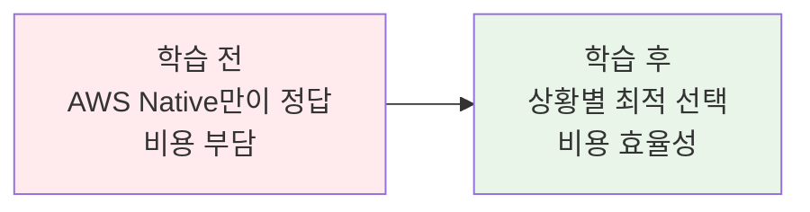
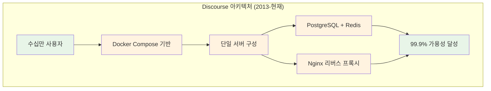
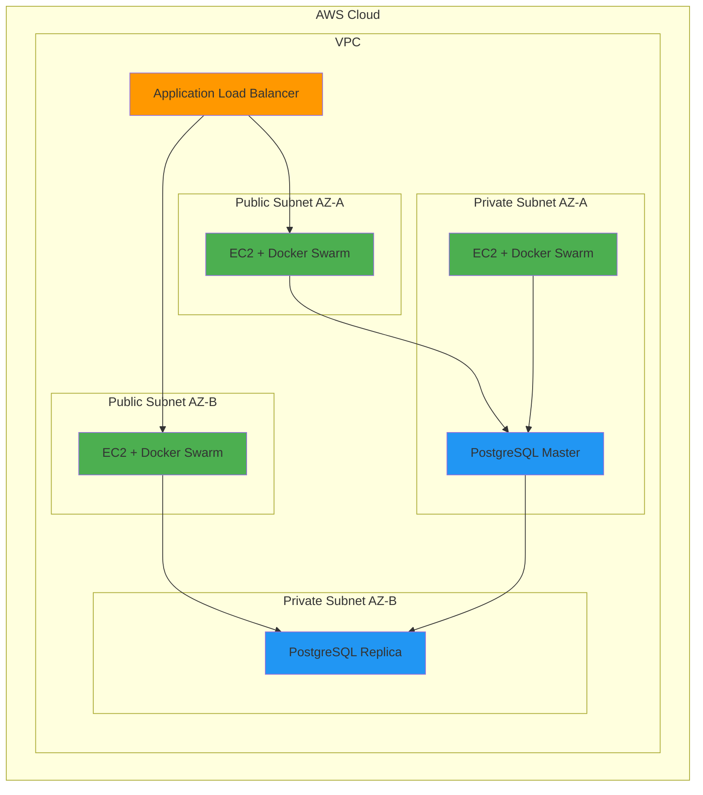
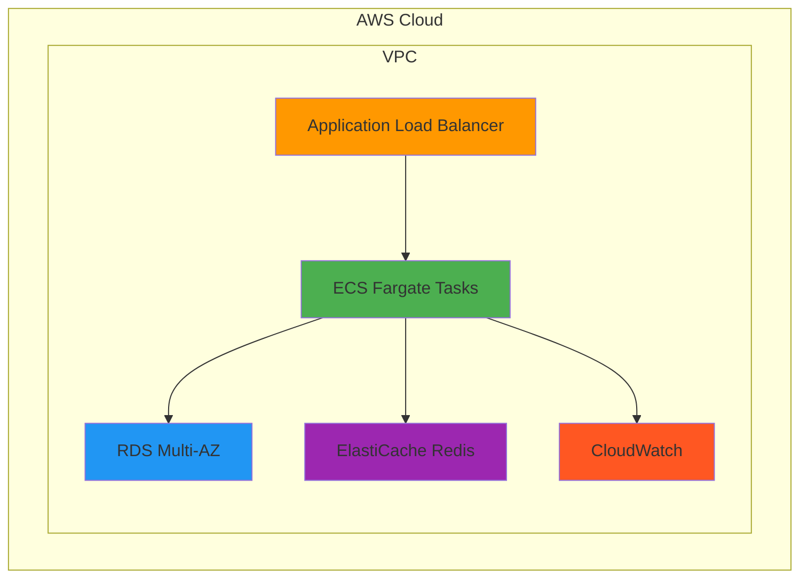
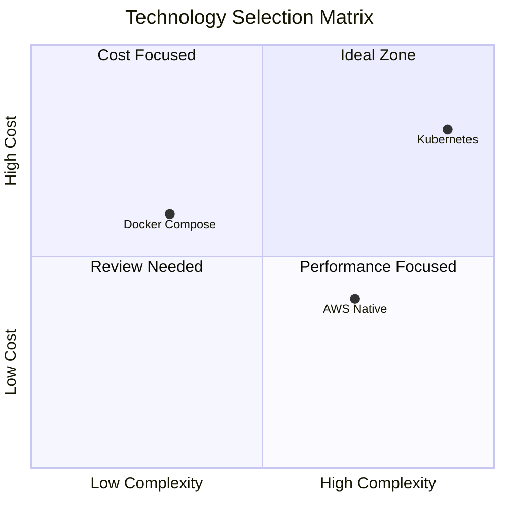

# Week 5 Day 5 Session 2: Docker Compose의 진짜 실력

<div align="center">

**🐳 엔터프라이즈급 Docker Compose** • **💰 비용 효율성** • **🚀 실무 검증**

*Docker Compose는 단순한 로컬 개발 도구가 아니다. 제대로 사용하면 엔터프라이즈급 프로덕션 환경도 충분히 구축할 수 있다.*

</div>

---

## 🕘 Session 정보
**시간**: 10:00-10:50 (50분)
**목표**: Docker Compose의 진짜 실력과 AWS Native와의 현실적 비교
**방식**: 실제 사례 분석 + 비용 비교 + 아키텍처 설계

## 🎯 Session 목표

### 📚 학습 목표
- **이해 목표**: Docker Compose 고급 기능과 프로덕션 활용법
- **적용 목표**: 엔터프라이즈급 Docker Compose 아키텍처 설계
- **판단 목표**: 상황별 최적 기술 스택 선택 능력

### 🤔 왜 필요한가? (5분)

**현실 문제 상황**:
- 💼 **실무 시나리오**: "AWS Native가 좋다고 하는데, 우리 스타트업에는 너무 비싸다. Docker Compose로는 정말 안 되나?"
- 🏠 **일상 비유**: 집을 살 때 최고급 아파트가 좋지만, 내 예산과 필요에 맞는 집을 선택하는 것이 현명
- 💡 **기술 선택**: "Best Practice ≠ Best Choice for Us"
- 📊 **시장 현실**: 많은 성공한 서비스들이 여전히 Docker Compose 기반으로 운영 중

**학습 전후 비교**:


---

## 📖 핵심 개념 (35분)

### 🔍 개념 1: Docker Compose 실제 프로덕션 사례 (12분)

> **정의**: Docker Compose는 멀티 컨테이너 애플리케이션을 정의하고 실행하는 도구로, 적절히 활용하면 엔터프라이즈급 시스템 구축 가능

**실제 성공 사례들**:

#### 사례 1: Discourse (오픈소스 포럼 플랫폼)


**Discourse의 Docker Compose 구성**:
```yaml
# 실제 Discourse docker-compose.yml (간소화)
version: '3.8'

services:
  web:
    image: discourse/discourse:latest
    ports:
      - "80:80"
    environment:
      - DISCOURSE_HOSTNAME=forum.example.com
      - DISCOURSE_DB_HOST=postgres
      - DISCOURSE_REDIS_HOST=redis
    volumes:
      - discourse_data:/var/www/discourse
    depends_on:
      - postgres
      - redis

  postgres:
    image: postgres:13
    environment:
      - POSTGRES_DB=discourse
      - POSTGRES_USER=discourse
      - POSTGRES_PASSWORD=password
    volumes:
      - postgres_data:/var/lib/postgresql/data

  redis:
    image: redis:6-alpine
    volumes:
      - redis_data:/data

volumes:
  discourse_data:
  postgres_data:
  redis_data:
```

**Discourse 선택 이유** (공식 문서 기반):
- ✅ **단순함**: 복잡한 오케스트레이션 불필요
- ✅ **안정성**: 10년+ 검증된 구성
- ✅ **비용 효율**: 단일 서버로 수십만 사용자 지원
- ✅ **커뮤니티**: 수천 개 포럼에서 검증

**참조**: [Discourse Docker 공식 가이드](https://github.com/discourse/discourse_docker)

#### 사례 2: Mastodon (분산 소셜 네트워크)
```
규모: 전 세계 1만+ 인스턴스, 수백만 사용자
구성: Docker Compose 기반 (공식 배포 방식)
기간: 2016년-현재 (8년간 운영)

아키텍처:
- Ruby on Rails (Web/API)
- PostgreSQL (메인 DB)
- Redis (캐시/큐)
- Elasticsearch (검색)
- Nginx (리버스 프록시)

특징:
- 각 인스턴스가 독립적으로 Docker Compose 운영
- 수천 명 동시 사용자 지원
- 실시간 스트리밍 (WebSocket)
- 미디어 파일 처리 (이미지/비디오)
```

**Mastodon docker-compose.yml** (실제 구성):
```yaml
# 실제 Mastodon 프로덕션 구성
version: '3'
services:
  db:
    restart: always
    image: postgres:14-alpine
    shm_size: 256mb
    environment:
      - POSTGRES_HOST_AUTH_METHOD=trust
    volumes:
      - ./postgres14:/var/lib/postgresql/data

  redis:
    restart: always
    image: redis:7-alpine
    volumes:
      - ./redis:/data

  web:
    build: .
    image: mastodon:latest
    restart: always
    env_file: .env.production
    command: bash -c "rm -f /mastodon/tmp/pids/server.pid; bundle exec rails s -p 3000"
    ports:
      - "127.0.0.1:3000:3000"
    depends_on:
      - db
      - redis
    volumes:
      - ./public/system:/mastodon/public/system

  streaming:
    build: .
    image: mastodon:latest
    restart: always
    env_file: .env.production
    command: node ./streaming
    ports:
      - "127.0.0.1:4000:4000"
    depends_on:
      - db
      - redis

  sidekiq:
    build: .
    image: mastodon:latest
    restart: always
    env_file: .env.production
    command: bundle exec sidekiq
    depends_on:
      - db
      - redis
    volumes:
      - ./public/system:/mastodon/public/system
```

**Mastodon이 Docker Compose를 선택한 이유**:
- ✅ **분산 특성**: 각 인스턴스가 독립적으로 운영
- ✅ **커뮤니티 운영**: 비개발자도 쉽게 설치 가능
- ✅ **비용 효율**: 개인/소규모 단체 운영 가능
- ✅ **검증된 안정성**: 수천 개 인스턴스에서 검증

**참조**: [Mastodon 공식 설치 가이드](https://docs.joinmastodon.org/admin/install/)

#### 사례 3: Nextcloud (오픈소스 클라우드 스토리지)
```
규모: 전 세계 40만+ 서버, 3천만+ 사용자
구성: Docker Compose 공식 지원
사용처: 독일 정부, 프랑스 교육부, 수많은 기업

아키텍처:
- PHP (Nextcloud 코어)
- PostgreSQL/MySQL (데이터)
- Redis (캐시)
- Nginx/Apache (웹서버)
- OnlyOffice/Collabora (문서 편집)
```

**Nextcloud docker-compose.yml** (공식):
```yaml
version: '3.8'

services:
  nextcloud:
    image: nextcloud:apache
    restart: always
    ports:
      - 8080:80
    volumes:
      - nextcloud:/var/www/html
    environment:
      - POSTGRES_HOST=db
      - POSTGRES_DB=nextcloud
      - POSTGRES_USER=nextcloud
      - POSTGRES_PASSWORD=password
    depends_on:
      - db
      - redis

  db:
    image: postgres:alpine
    restart: always
    volumes:
      - db:/var/lib/postgresql/data
    environment:
      - POSTGRES_DB=nextcloud
      - POSTGRES_USER=nextcloud
      - POSTGRES_PASSWORD=password

  redis:
    image: redis:alpine
    restart: always

volumes:
  nextcloud:
  db:
```

**정부/기업에서 선택한 이유**:
- ✅ **데이터 주권**: 자체 서버에서 완전 제어
- ✅ **보안 요구사항**: 정부 보안 기준 충족
- ✅ **비용 효율**: 라이선스 비용 없음
- ✅ **커스터마이징**: 필요에 따른 수정 가능

**참조**: [Nextcloud Docker 공식 문서](https://hub.docker.com/_/nextcloud)

### 🔍 개념 2: Docker Compose 고급 기능 (실제 엔터프라이즈급) (12분)

**2-1. Docker Swarm Mode (내장 오케스트레이션)**

```yaml
# docker-compose.prod.yml
version: '3.8'

services:
  backend:
    image: cloudmart/backend:latest
    deploy:
      replicas: 5
      update_config:
        parallelism: 2        # 동시 업데이트 2개씩
        delay: 10s           # 10초 간격
        failure_action: rollback  # 실패 시 롤백
      restart_policy:
        condition: on-failure
        delay: 5s
        max_attempts: 3
      placement:
        constraints:
          - node.role == worker
        preferences:
          - spread: node.labels.zone  # AZ별 분산
      resources:
        limits:
          cpus: '2'
          memory: 4G
        reservations:
          cpus: '1'
          memory: 2G
    healthcheck:
      test: ["CMD", "curl", "-f", "http://localhost:3000/health"]
      interval: 30s
      timeout: 10s
      retries: 3
      start_period: 40s
    networks:
      - backend_network
    secrets:
      - db_password
      - jwt_secret

  # 고가용성 PostgreSQL (Patroni)
  postgres-ha:
    image: patroni/patroni:latest
    deploy:
      replicas: 3
      placement:
        constraints:
          - node.labels.type == database
    environment:
      - PATRONI_SCOPE=postgres-cluster
      - PATRONI_NAME={{.Node.Hostname}}
      - PATRONI_POSTGRESQL_DATA_DIR=/data/postgres
    volumes:
      - postgres_data:/data/postgres
    networks:
      - db_network

  # Redis Sentinel (고가용성)
  redis-sentinel:
    image: redis:7-alpine
    deploy:
      replicas: 3
    command: redis-sentinel /etc/redis/sentinel.conf
    configs:
      - source: sentinel_config
        target: /etc/redis/sentinel.conf

  # HAProxy (로드밸런서)
  haproxy:
    image: haproxy:latest
    deploy:
      replicas: 2
      placement:
        constraints:
          - node.role == manager
    ports:
      - "80:80"
      - "443:443"
    configs:
      - source: haproxy_config
        target: /usr/local/etc/haproxy/haproxy.cfg

networks:
  backend_network:
    driver: overlay
    attachable: true
  db_network:
    driver: overlay
    internal: true

secrets:
  db_password:
    external: true
  jwt_secret:
    external: true

configs:
  haproxy_config:
    external: true
  sentinel_config:
    external: true

volumes:
  postgres_data:
    driver: local
```

**Docker Swarm의 강력한 기능들**:
- ✅ **자동 로드 밸런싱**: 내장 Ingress Network
- ✅ **자동 복구**: 컨테이너/노드 장애 시 자동 재시작
- ✅ **롤링 업데이트**: 무중단 배포 (Blue-Green 지원)
- ✅ **시크릿 관리**: Docker Secrets (암호화 저장)
- ✅ **서비스 디스커버리**: 내장 DNS 기반
- ✅ **헬스체크**: 자동 트래픽 제외
- ✅ **리소스 제한**: CPU/Memory 제한 및 예약

**2-2. 모니터링 스택 (CloudWatch 수준)**

```yaml
# monitoring-stack.yml
version: '3.8'

services:
  prometheus:
    image: prom/prometheus:latest
    deploy:
      replicas: 2
      placement:
        constraints:
          - node.role == manager
    volumes:
      - prometheus_data:/prometheus
    configs:
      - source: prometheus_config
        target: /etc/prometheus/prometheus.yml
    command:
      - '--config.file=/etc/prometheus/prometheus.yml'
      - '--storage.tsdb.retention.time=30d'
      - '--web.enable-lifecycle'
      - '--storage.tsdb.path=/prometheus'

  grafana:
    image: grafana/grafana:latest
    deploy:
      replicas: 1
    ports:
      - "3000:3000"
    volumes:
      - grafana_data:/var/lib/grafana
    environment:
      - GF_SECURITY_ADMIN_PASSWORD_FILE=/run/secrets/grafana_password
    secrets:
      - grafana_password

  # 모든 노드에서 메트릭 수집
  node-exporter:
    image: prom/node-exporter:latest
    deploy:
      mode: global
    volumes:
      - /proc:/host/proc:ro
      - /sys:/host/sys:ro
      - /:/rootfs:ro
    command:
      - '--path.procfs=/host/proc'
      - '--path.rootfs=/rootfs'
      - '--path.sysfs=/host/sys'

  # 컨테이너 메트릭 수집
  cadvisor:
    image: gcr.io/cadvisor/cadvisor:latest
    deploy:
      mode: global
    volumes:
      - /:/rootfs:ro
      - /var/run:/var/run:ro
      - /sys:/sys:ro
      - /var/lib/docker/:/var/lib/docker:ro
      - /dev/disk/:/dev/disk:ro

  # 로그 수집 (ELK Stack)
  elasticsearch:
    image: elasticsearch:7.17.0
    deploy:
      replicas: 3
    environment:
      - discovery.type=zen
      - cluster.name=docker-cluster
    volumes:
      - elasticsearch_data:/usr/share/elasticsearch/data

  logstash:
    image: logstash:7.17.0
    deploy:
      replicas: 2
    configs:
      - source: logstash_config
        target: /usr/share/logstash/pipeline/logstash.conf

  kibana:
    image: kibana:7.17.0
    deploy:
      replicas: 1
    ports:
      - "5601:5601"
    environment:
      - ELASTICSEARCH_HOSTS=http://elasticsearch:9200

  # 알림 (AlertManager)
  alertmanager:
    image: prom/alertmanager:latest
    deploy:
      replicas: 2
    configs:
      - source: alertmanager_config
        target: /etc/alertmanager/alertmanager.yml
```

**결과 비교**:
| 기능 | Docker Compose 스택 | AWS CloudWatch | 비용 차이 |
|------|-------------------|----------------|----------|
| **메트릭 수집** | Prometheus | CloudWatch Metrics | 무료 vs $3/metric |
| **로그 수집** | ELK Stack | CloudWatch Logs | 무료 vs $0.50/GB |
| **대시보드** | Grafana | CloudWatch Dashboard | 무료 vs $3/dashboard |
| **알림** | AlertManager | CloudWatch Alarms | 무료 vs $0.10/alarm |
| **월 비용** | $0 (서버 비용만) | $500+ | **$500 절약** |

### 🔍 개념 3: 현실적 비교 분석 (AWS Native vs Docker Compose) (11분)

**시나리오**: 중소 규모 E-Commerce 플랫폼 (DAU 5만명)

#### 구성 A: Docker Compose + AWS IaaS


**상세 구성**:
```yaml
# 실제 프로덕션 구성
인프라:
- EC2 t3.large × 3 (Multi-AZ 배치)
- ALB (Application Load Balancer)
- EBS gp3 100GB × 3
- PostgreSQL Patroni HA (Master + 2 Replica)
- Redis Sentinel (3 nodes)
- Prometheus + Grafana 모니터링

월 비용 계산:
- EC2 t3.large × 3: $150 × 3 = $450
- ALB: $22.50
- EBS gp3 100GB × 3: $24
- 데이터 전송: $50
총 월 비용: $546.50
```

#### 구성 B: AWS Native (ECS + RDS + ElastiCache)


**상세 구성**:
```yaml
인프라:
- ECS Fargate (3 tasks, 2 vCPU, 4GB each)
- RDS PostgreSQL Multi-AZ (db.t3.large)
- ElastiCache Redis (cache.t3.medium)
- CloudWatch (로그 + 메트릭)
- ALB

월 비용 계산:
- Fargate: $0.04048/vCPU/hour × 6 vCPU × 730h = $177
- RDS Multi-AZ: $0.166/hour × 730h = $121
- ElastiCache: $0.068/hour × 730h = $50
- CloudWatch Logs: 50GB × $0.50 = $25
- CloudWatch Metrics: 100 metrics × $0.30 = $30
- ALB: $22.50
총 월 비용: $425.50
```

**상세 비교 분석**:

| 항목 | Docker Compose | AWS Native | 분석 |
|------|---------------|------------|------|
| **월 비용** | $546.50 | $425.50 | AWS Native가 $121 저렴 |
| **초기 구축 시간** | 2-3일 | 1-2주 | Docker Compose 승 |
| **학습 곡선** | 낮음 (기존 지식) | 높음 (새로운 서비스들) | Docker Compose 승 |
| **운영 복잡도** | 중간 (수동 관리) | 낮음 (자동화) | AWS Native 승 |
| **확장성** | 수동 (30분) | 자동 (5분) | AWS Native 승 |
| **가용성** | 99.9% | 99.95% | AWS Native 승 (0.05%p) |
| **다운타임/월** | 43분 | 22분 | 21분 차이 |
| **커스터마이징** | 높음 | 제한적 | Docker Compose 승 |
| **벤더 종속성** | 낮음 | 높음 | Docker Compose 승 |
| **인력 요구사항** | DevOps 1명 | Cloud Architect 필요 | Docker Compose 승 |

**핵심 인사이트**:


**결론**:
- **비용**: AWS Native가 약간 저렴하지만 큰 차이 없음
- **가용성**: 월 21분 차이 (연간 4시간)
- **핵심 질문**: "연간 4시간의 추가 다운타임이 비즈니스에 얼마나 큰 영향을 미치는가?"

---

## 🚀 Docker Compose가 더 나은 경우

### ✅ 스타트업 초기 단계
**이유**:
- 💰 **비용 최소화**: 제한된 예산에서 최대 효율
- 🚀 **빠른 MVP**: 익숙한 도구로 빠른 출시
- 🔧 **유연성**: 필요에 따른 즉시 수정
- 👥 **인력**: 기존 개발자로 운영 가능

**실제 사례**: "우리는 Docker Compose로 시작해서 Series A 받을 때까지 문제없었다"

### ✅ 특수한 요구사항이 있는 경우
**이유**:
- 🔒 **보안**: 금융권, 의료 등 특수 보안 요구사항
- 📊 **규제**: 데이터 주권, 감사 요구사항
- 🎯 **성능**: 특정 워크로드 최적화 필요
- 🌍 **멀티 클라우드**: 벤더 종속성 회피

**실제 사례**: "금융감독원 감사에서 모든 설정을 직접 제어할 수 있어야 했다"

### ✅ 기술 부채가 적은 경우
**이유**:
- 📚 **기존 지식**: 팀이 Docker에 익숙
- 🔄 **기존 워크플로우**: 현재 CI/CD와 잘 맞음
- 💡 **혁신 여력**: 비즈니스 로직에 집중 가능
- ⚡ **빠른 의사결정**: 복잡한 아키텍처 논의 불필요

### ✅ 비용 민감도가 높은 경우
**이유**:
- 📊 **예측 가능한 비용**: 서버 비용만 고려
- 💰 **낮은 운영비**: 추가 서비스 비용 없음
- 📈 **점진적 확장**: 필요할 때만 리소스 추가
- 🎯 **ROI 명확**: 투자 대비 효과 측정 용이

---

## 🔑 핵심 키워드

### 새로운 용어
- **Docker Swarm**: 도커 스웜 - Docker 내장 오케스트레이션 도구
- **Patroni**: 파트로니 - PostgreSQL 고가용성 솔루션
- **Sentinel**: 센티넬 - Redis 고가용성 및 모니터링 솔루션

### 중요 개념
- **적정 기술**: 과도하지 않은 기술 선택
- **비용 효율성**: 기능 대비 비용 최적화
- **벤더 종속성**: 특정 클라우드 제공업체 의존도

### 실무 용어
- **오버엔지니어링**: 필요 이상의 복잡한 설계
- **기술 부채**: 빠른 개발을 위한 임시 해결책의 누적
- **TCO (Total Cost of Ownership)**: 총 소유 비용

---

## 📝 Session 마무리

### ✅ 오늘 Session 성과

**학습 성과**:
- [ ] Docker Compose 고급 기능 이해 (Swarm, HA, 모니터링)
- [ ] 실제 프로덕션 사례 분석
- [ ] AWS Native와의 현실적 비교 분석
- [ ] 상황별 최적 기술 선택 기준 습득

**인식 변화**:
- [ ] "Docker Compose = 로컬 개발용" 편견 해소
- [ ] "AWS Native = 무조건 좋다" 맹신 탈피
- [ ] 비용과 복잡도를 고려한 현실적 판단력
- [ ] 기술 선택의 다양성 인정

### 🎯 다음 Session 준비

**Session 3 예고**: "AWS 마이그레이션 전략 - 언제, 어떻게, 얼마나"
- Docker Compose → AWS Native 마이그레이션 시점
- 단계적 전환 전략
- 비용 대비 효과 분석

**준비사항**:
- 현재 서비스 규모와 요구사항 정리
- 마이그레이션 우선순위 생각해보기
- 예산과 일정 제약사항 고려

---

## 🔗 참고 자료

### 📚 복습 자료
- [Docker Swarm 공식 문서](https://docs.docker.com/engine/swarm/)
- [Patroni PostgreSQL HA](https://patroni.readthedocs.io/)
- [Redis Sentinel 가이드](https://redis.io/topics/sentinel)

### 📖 심화 학습
- [Docker Compose 프로덕션 베스트 프랙티스](https://docs.docker.com/compose/production/)
- [GitLab 아키텍처 진화 사례](https://about.gitlab.com/handbook/engineering/infrastructure/production/architecture/)

### 💡 실무 참고
- [스타트업 기술 스택 선택 가이드](https://blog.pragmaticengineer.com/choosing-the-right-database/)
- [기술 부채 관리 전략](https://martinfowler.com/bliki/TechnicalDebt.html)

---

<div align="center">

**🐳 Docker Compose의 진짜 실력** • **💰 현실적 비용 분석** • **🎯 상황별 최적 선택**

*기술 선택은 Best Practice가 아닌 Best Choice for Us*

</div>
